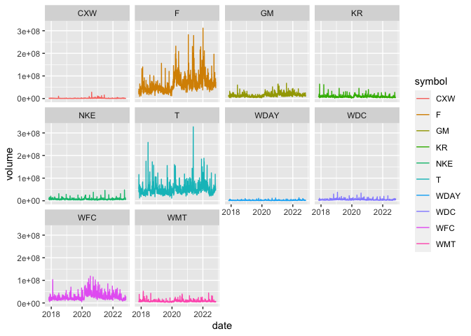

```r
library(ggplot2)
library(readr)
library(knitr)
library(tidyverse)
```

```
## ── Attaching packages ─────────────────────────────────────── tidyverse 1.3.2 ──
## ✔ tibble  3.1.8     ✔ dplyr   1.0.8
## ✔ tidyr   1.2.0     ✔ stringr 1.4.1
## ✔ purrr   0.3.4     ✔ forcats 0.5.1
## ── Conflicts ────────────────────────────────────────── tidyverse_conflicts() ──
## ✖ dplyr::filter() masks stats::filter()
## ✖ dplyr::lag()    masks stats::lag()
```

```r
library(downloader)
library(tidyquant)
```

```
## Loading required package: lubridate
## 
## Attaching package: 'lubridate'
## 
## The following objects are masked from 'package:base':
## 
##     date, intersect, setdiff, union
## 
## Loading required package: PerformanceAnalytics
## Loading required package: xts
## Loading required package: zoo
## 
## Attaching package: 'zoo'
## 
## The following objects are masked from 'package:base':
## 
##     as.Date, as.Date.numeric
## 
## 
## Attaching package: 'xts'
## 
## The following objects are masked from 'package:dplyr':
## 
##     first, last
## 
## 
## Attaching package: 'PerformanceAnalytics'
## 
## The following object is masked from 'package:graphics':
## 
##     legend
## 
## Loading required package: quantmod
## Loading required package: TTR
## Registered S3 method overwritten by 'quantmod':
##   method            from
##   as.zoo.data.frame zoo
```

```r
library(timetk)
library(dygraphs)
```


### Setting up tickers today

```r
tickers_today <- tq_get(c("CXW", "F", "GM", "JCP", "KR", "WDC", "NKE","T", "WDAY", "WFC", "WMT"), get = "stock.prices", from = today()-years(5), to = today())
```

```
## Warning: x = 'JCP', get = 'stock.prices': Error in getSymbols.yahoo(Symbols = "JCP", env = <environment>, verbose = FALSE, : Unable to import "JCP".
## JCP download failed after two attempts. Error message:
## HTTP error 404.
##  Removing JCP.
```

```r
tail(tickers_today)
```

```
## # A tibble: 6 × 8
##   symbol date        open  high   low close  volume adjusted
##   <chr>  <date>     <dbl> <dbl> <dbl> <dbl>   <dbl>    <dbl>
## 1 WMT    2022-10-26  140.  142.  140.  141. 6918100     141.
## 2 WMT    2022-10-27  141.  142.  140.  141. 5534300     141.
## 3 WMT    2022-10-28  140.  143.  140.  143. 4549400     143.
## 4 WMT    2022-10-31  142.  143.  142.  142. 7524000     142.
## 5 WMT    2022-11-01  143.  144.  142.  142. 4938100     142.
## 6 WMT    2022-11-02  141.  144.  141.  141. 5174000     141.
```

```r
adjusted <- tickers_today %>%
  select(symbol, date, adjusted) %>%
  pivot_wider(names_from = symbol, values_from = adjusted) %>%
  tk_xts(date_var = date)
```

```
## Warning: Non-numeric columns being dropped: date
```

```r
tail(adjusted)
```

```
##              CXW     F    GM    KR   WDC   NKE     T   WDAY   WFC    WMT
## 2022-10-26 10.06 12.82 37.86 45.44 35.28 92.39 18.14 154.73 45.70 141.14
## 2022-10-27 10.32 13.00 38.16 45.68 34.34 90.54 18.03 155.24 45.65 140.73
## 2022-10-28 10.36 13.26 38.85 46.77 35.50 93.83 18.48 157.65 46.35 142.51
## 2022-10-31 10.47 13.37 39.25 47.29 34.37 92.68 18.23 155.82 45.99 142.33
## 2022-11-01 10.21 13.40 39.35 47.17 35.70 93.77 18.35 151.60 46.95 141.69
## 2022-11-02  9.95 13.06 38.52 46.56 34.58 90.30 18.43 143.51 46.88 140.75
```

### Graph 1

```r
dygraph(adjusted, main = "Stock Percentage") %>%
  dyRebase(percent = TRUE) %>%
  dyShading(from = today()-years(5), to = today()) %>%
  dyRangeSelector()
```

```{=html}
<div id="htmlwidget-cf25ca8b2c498e92b584" style="width:672px;height:480px;" class="dygraphs html-widget"></div>
<script type="application/json" data-for="htmlwidget-cf25ca8b2c498e92b584">{"x":{"attrs":{"title":"Stock Percentage","labels":["day","CXW","F","GM","KR","WDC","NKE","T","WDAY","WFC","WMT"],"legend":"auto","retainDateWindow":false,"axes":{"x":{"pixelsPerLabel":60}},"showRangeSelector":true,"rangeSelectorHeight":40,"rangeSelectorPlotFillColor":" #A7B1C4","rangeSelectorPlotStrokeColor":"#808FAB","interactionModel":"Dygraph.Interaction.defaultModel"},"scale":"daily","annotations":[],"shadings":[{"from":"2017-11-03T00:00:00.000Z","to":"2022-11-03T00:00:00.000Z","color":"#EFEFEF","axis":"x"}],"events":[],"format":"date","data":[["2017-11-03T00:00:00.000Z","2017-11-06T00:00:00.000Z","2017-11-07T00:00:00.000Z","2017-11-08T00:00:00.000Z","2017-11-09T00:00:00.000Z","2017-11-10T00:00:00.000Z","2017-11-13T00:00:00.000Z","2017-11-14T00:00:00.000Z","2017-11-15T00:00:00.000Z","2017-11-16T00:00:00.000Z","2017-11-17T00:00:00.000Z","2017-11-20T00:00:00.000Z","2017-11-21T00:00:00.000Z","2017-11-22T00:00:00.000Z","2017-11-24T00:00:00.000Z","2017-11-27T00:00:00.000Z","2017-11-28T00:00:00.000Z","2017-11-29T00:00:00.000Z","2017-11-30T00:00:00.000Z","2017-12-01T00:00:00.000Z","2017-12-04T00:00:00.000Z","2017-12-05T00:00:00.000Z","2017-12-06T00:00:00.000Z","2017-12-07T00:00:00.000Z","2017-12-08T00:00:00.000Z","2017-12-11T00:00:00.000Z","2017-12-12T00:00:00.000Z","2017-12-13T00:00:00.000Z","2017-12-14T00:00:00.000Z","2017-12-15T00:00:00.000Z","2017-12-18T00:00:00.000Z","2017-12-19T00:00:00.000Z","2017-12-20T00:00:00.000Z","2017-12-21T00:00:00.000Z","2017-12-22T00:00:00.000Z","2017-12-26T00:00:00.000Z","2017-12-27T00:00:00.000Z","2017-12-28T00:00:00.000Z","2017-12-29T00:00:00.000Z","2018-01-02T00:00:00.000Z","2018-01-03T00:00:00.000Z","2018-01-04T00:00:00.000Z","2018-01-05T00:00:00.000Z","2018-01-08T00:00:00.000Z","2018-01-09T00:00:00.000Z","2018-01-10T00:00:00.000Z","2018-01-11T00:00:00.000Z","2018-01-12T00:00:00.000Z","2018-01-16T00:00:00.000Z","2018-01-17T00:00:00.000Z","2018-01-18T00:00:00.000Z","2018-01-19T00:00:00.000Z","2018-01-22T00:00:00.000Z","2018-01-23T00:00:00.000Z","2018-01-24T00:00:00.000Z","2018-01-25T00:00:00.000Z","2018-01-26T00:00:00.000Z","2018-01-29T00:00:00.000Z","2018-01-30T00:00:00.000Z","2018-01-31T00:00:00.000Z","2018-02-01T00:00:00.000Z","2018-02-02T00:00:00.000Z","2018-02-05T00:00:00.000Z","2018-02-06T00:00:00.000Z","2018-02-07T00:00:00.000Z","2018-02-08T00:00:00.000Z","2018-02-09T00:00:00.000Z","2018-02-12T00:00:00.000Z","2018-02-13T00:00:00.000Z","2018-02-14T00:00:00.000Z","2018-02-15T00:00:00.000Z","2018-02-16T00:00:00.000Z","2018-02-20T00:00:00.000Z","2018-02-21T00:00:00.000Z","2018-02-22T00:00:00.000Z","2018-02-23T00:00:00.000Z","2018-02-26T00:00:00.000Z","2018-02-27T00:00:00.000Z","2018-02-28T00:00:00.000Z","2018-03-01T00:00:00.000Z","2018-03-02T00:00:00.000Z","2018-03-05T00:00:00.000Z","2018-03-06T00:00:00.000Z","2018-03-07T00:00:00.000Z","2018-03-08T00:00:00.000Z","2018-03-09T00:00:00.000Z","2018-03-12T00:00:00.000Z","2018-03-13T00:00:00.000Z","2018-03-14T00:00:00.000Z","2018-03-15T00:00:00.000Z","2018-03-16T00:00:00.000Z","2018-03-19T00:00:00.000Z","2018-03-20T00:00:00.000Z","2018-03-21T00:00:00.000Z","2018-03-22T00:00:00.000Z","2018-03-23T00:00:00.000Z","2018-03-26T00:00:00.000Z","2018-03-27T00:00:00.000Z","2018-03-28T00:00:00.000Z","2018-03-29T00:00:00.000Z","2018-04-02T00:00:00.000Z","2018-04-03T00:00:00.000Z","2018-04-04T00:00:00.000Z","2018-04-05T00:00:00.000Z","2018-04-06T00:00:00.000Z","2018-04-09T00:00:00.000Z","2018-04-10T00:00:00.000Z","2018-04-11T00:00:00.000Z","2018-04-12T00:00:00.000Z","2018-04-13T00:00:00.000Z","2018-04-16T00:00:00.000Z","2018-04-17T00:00:00.000Z","2018-04-18T00:00:00.000Z","2018-04-19T00:00:00.000Z","2018-04-20T00:00:00.000Z","2018-04-23T00:00:00.000Z","2018-04-24T00:00:00.000Z","2018-04-25T00:00:00.000Z","2018-04-26T00:00:00.000Z","2018-04-27T00:00:00.000Z","2018-04-30T00:00:00.000Z","2018-05-01T00:00:00.000Z","2018-05-02T00:00:00.000Z","2018-05-03T00:00:00.000Z","2018-05-04T00:00:00.000Z","2018-05-07T00:00:00.000Z","2018-05-08T00:00:00.000Z","2018-05-09T00:00:00.000Z","2018-05-10T00:00:00.000Z","2018-05-11T00:00:00.000Z","2018-05-14T00:00:00.000Z","2018-05-15T00:00:00.000Z","2018-05-16T00:00:00.000Z","2018-05-17T00:00:00.000Z","2018-05-18T00:00:00.000Z","2018-05-21T00:00:00.000Z","2018-05-22T00:00:00.000Z","2018-05-23T00:00:00.000Z","2018-05-24T00:00:00.000Z","2018-05-25T00:00:00.000Z","2018-05-29T00:00:00.000Z","2018-05-30T00:00:00.000Z","2018-05-31T00:00:00.000Z","2018-06-01T00:00:00.000Z","2018-06-04T00:00:00.000Z","2018-06-05T00:00:00.000Z","2018-06-06T00:00:00.000Z","2018-06-07T00:00:00.000Z","2018-06-08T00:00:00.000Z","2018-06-11T00:00:00.000Z","2018-06-12T00:00:00.000Z","2018-06-13T00:00:00.000Z","2018-06-14T00:00:00.000Z","2018-06-15T00:00:00.000Z","2018-06-18T00:00:00.000Z","2018-06-19T00:00:00.000Z","2018-06-20T00:00:00.000Z","2018-06-21T00:00:00.000Z","2018-06-22T00:00:00.000Z","2018-06-25T00:00:00.000Z","2018-06-26T00:00:00.000Z","2018-06-27T00:00:00.000Z","2018-06-28T00:00:00.000Z","2018-06-29T00:00:00.000Z","2018-07-02T00:00:00.000Z","2018-07-03T00:00:00.000Z","2018-07-05T00:00:00.000Z","2018-07-06T00:00:00.000Z","2018-07-09T00:00:00.000Z","2018-07-10T00:00:00.000Z","2018-07-11T00:00:00.000Z","2018-07-12T00:00:00.000Z","2018-07-13T00:00:00.000Z","2018-07-16T00:00:00.000Z","2018-07-17T00:00:00.000Z","2018-07-18T00:00:00.000Z","2018-07-19T00:00:00.000Z","2018-07-20T00:00:00.000Z","2018-07-23T00:00:00.000Z","2018-07-24T00:00:00.000Z","2018-07-25T00:00:00.000Z","2018-07-26T00:00:00.000Z","2018-07-27T00:00:00.000Z","2018-07-30T00:00:00.000Z","2018-07-31T00:00:00.000Z","2018-08-01T00:00:00.000Z","2018-08-02T00:00:00.000Z","2018-08-03T00:00:00.000Z","2018-08-06T00:00:00.000Z","2018-08-07T00:00:00.000Z","2018-08-08T00:00:00.000Z","2018-08-09T00:00:00.000Z","2018-08-10T00:00:00.000Z","2018-08-13T00:00:00.000Z","2018-08-14T00:00:00.000Z","2018-08-15T00:00:00.000Z","2018-08-16T00:00:00.000Z","2018-08-17T00:00:00.000Z","2018-08-20T00:00:00.000Z","2018-08-21T00:00:00.000Z","2018-08-22T00:00:00.000Z","2018-08-23T00:00:00.000Z","2018-08-24T00:00:00.000Z","2018-08-27T00:00:00.000Z","2018-08-28T00:00:00.000Z","2018-08-29T00:00:00.000Z","2018-08-30T00:00:00.000Z","2018-08-31T00:00:00.000Z","2018-09-04T00:00:00.000Z","2018-09-05T00:00:00.000Z","2018-09-06T00:00:00.000Z","2018-09-07T00:00:00.000Z","2018-09-10T00:00:00.000Z","2018-09-11T00:00:00.000Z","2018-09-12T00:00:00.000Z","2018-09-13T00:00:00.000Z","2018-09-14T00:00:00.000Z","2018-09-17T00:00:00.000Z","2018-09-18T00:00:00.000Z","2018-09-19T00:00:00.000Z","2018-09-20T00:00:00.000Z","2018-09-21T00:00:00.000Z","2018-09-24T00:00:00.000Z","2018-09-25T00:00:00.000Z","2018-09-26T00:00:00.000Z","2018-09-27T00:00:00.000Z","2018-09-28T00:00:00.000Z","2018-10-01T00:00:00.000Z","2018-10-02T00:00:00.000Z","2018-10-03T00:00:00.000Z","2018-10-04T00:00:00.000Z","2018-10-05T00:00:00.000Z","2018-10-08T00:00:00.000Z","2018-10-09T00:00:00.000Z","2018-10-10T00:00:00.000Z","2018-10-11T00:00:00.000Z","2018-10-12T00:00:00.000Z","2018-10-15T00:00:00.000Z","2018-10-16T00:00:00.000Z","2018-10-17T00:00:00.000Z","2018-10-18T00:00:00.000Z","2018-10-19T00:00:00.000Z","2018-10-22T00:00:00.000Z","2018-10-23T00:00:00.000Z","2018-10-24T00:00:00.000Z","2018-10-25T00:00:00.000Z","2018-10-26T00:00:00.000Z","2018-10-29T00:00:00.000Z","2018-10-30T00:00:00.000Z","2018-10-31T00:00:00.000Z","2018-11-01T00:00:00.000Z","2018-11-02T00:00:00.000Z","2018-11-05T00:00:00.000Z","2018-11-06T00:00:00.000Z","2018-11-07T00:00:00.000Z","2018-11-08T00:00:00.000Z","2018-11-09T00:00:00.000Z","2018-11-12T00:00:00.000Z","2018-11-13T00:00:00.000Z","2018-11-14T00:00:00.000Z","2018-11-15T00:00:00.000Z","2018-11-16T00:00:00.000Z","2018-11-19T00:00:00.000Z","2018-11-20T00:00:00.000Z","2018-11-21T00:00:00.000Z","2018-11-23T00:00:00.000Z","2018-11-26T00:00:00.000Z","2018-11-27T00:00:00.000Z","2018-11-28T00:00:00.000Z","2018-11-29T00:00:00.000Z","2018-11-30T00:00:00.000Z","2018-12-03T00:00:00.000Z","2018-12-04T00:00:00.000Z","2018-12-06T00:00:00.000Z","2018-12-07T00:00:00.000Z","2018-12-10T00:00:00.000Z","2018-12-11T00:00:00.000Z","2018-12-12T00:00:00.000Z","2018-12-13T00:00:00.000Z","2018-12-14T00:00:00.000Z","2018-12-17T00:00:00.000Z","2018-12-18T00:00:00.000Z","2018-12-19T00:00:00.000Z","2018-12-20T00:00:00.000Z","2018-12-21T00:00:00.000Z","2018-12-24T00:00:00.000Z","2018-12-26T00:00:00.000Z","2018-12-27T00:00:00.000Z","2018-12-28T00:00:00.000Z","2018-12-31T00:00:00.000Z","2019-01-02T00:00:00.000Z","2019-01-03T00:00:00.000Z","2019-01-04T00:00:00.000Z","2019-01-07T00:00:00.000Z","2019-01-08T00:00:00.000Z","2019-01-09T00:00:00.000Z","2019-01-10T00:00:00.000Z","2019-01-11T00:00:00.000Z","2019-01-14T00:00:00.000Z","2019-01-15T00:00:00.000Z","2019-01-16T00:00:00.000Z","2019-01-17T00:00:00.000Z","2019-01-18T00:00:00.000Z","2019-01-22T00:00:00.000Z","2019-01-23T00:00:00.000Z","2019-01-24T00:00:00.000Z","2019-01-25T00:00:00.000Z","2019-01-28T00:00:00.000Z","2019-01-29T00:00:00.000Z","2019-01-30T00:00:00.000Z","2019-01-31T00:00:00.000Z","2019-02-01T00:00:00.000Z","2019-02-04T00:00:00.000Z","2019-02-05T00:00:00.000Z","2019-02-06T00:00:00.000Z","2019-02-07T00:00:00.000Z","2019-02-08T00:00:00.000Z","2019-02-11T00:00:00.000Z","2019-02-12T00:00:00.000Z","2019-02-13T00:00:00.000Z","2019-02-14T00:00:00.000Z","2019-02-15T00:00:00.000Z","2019-02-19T00:00:00.000Z","2019-02-20T00:00:00.000Z","2019-02-21T00:00:00.000Z","2019-02-22T00:00:00.000Z","2019-02-25T00:00:00.000Z","2019-02-26T00:00:00.000Z","2019-02-27T00:00:00.000Z","2019-02-28T00:00:00.000Z","2019-03-01T00:00:00.000Z","2019-03-04T00:00:00.000Z","2019-03-05T00:00:00.000Z","2019-03-06T00:00:00.000Z","2019-03-07T00:00:00.000Z","2019-03-08T00:00:00.000Z","2019-03-11T00:00:00.000Z","2019-03-12T00:00:00.000Z","2019-03-13T00:00:00.000Z","2019-03-14T00:00:00.000Z","2019-03-15T00:00:00.000Z","2019-03-18T00:00:00.000Z","2019-03-19T00:00:00.000Z","2019-03-20T00:00:00.000Z","2019-03-21T00:00:00.000Z","2019-03-22T00:00:00.000Z","2019-03-25T00:00:00.000Z","2019-03-26T00:00:00.000Z","2019-03-27T00:00:00.000Z","2019-03-28T00:00:00.000Z","2019-03-29T00:00:00.000Z","2019-04-01T00:00:00.000Z","2019-04-02T00:00:00.000Z","2019-04-03T00:00:00.000Z","2019-04-04T00:00:00.000Z","2019-04-05T00:00:00.000Z","2019-04-08T00:00:00.000Z","2019-04-09T00:00:00.000Z","2019-04-10T00:00:00.000Z","2019-04-11T00:00:00.000Z","2019-04-12T00:00:00.000Z","2019-04-15T00:00:00.000Z","2019-04-16T00:00:00.000Z","2019-04-17T00:00:00.000Z","2019-04-18T00:00:00.000Z","2019-04-22T00:00:00.000Z","2019-04-23T00:00:00.000Z","2019-04-24T00:00:00.000Z","2019-04-25T00:00:00.000Z","2019-04-26T00:00:00.000Z","2019-04-29T00:00:00.000Z","2019-04-30T00:00:00.000Z","2019-05-01T00:00:00.000Z","2019-05-02T00:00:00.000Z","2019-05-03T00:00:00.000Z","2019-05-06T00:00:00.000Z","2019-05-07T00:00:00.000Z","2019-05-08T00:00:00.000Z","2019-05-09T00:00:00.000Z","2019-05-10T00:00:00.000Z","2019-05-13T00:00:00.000Z","2019-05-14T00:00:00.000Z","2019-05-15T00:00:00.000Z","2019-05-16T00:00:00.000Z","2019-05-17T00:00:00.000Z","2019-05-20T00:00:00.000Z","2019-05-21T00:00:00.000Z","2019-05-22T00:00:00.000Z","2019-05-23T00:00:00.000Z","2019-05-24T00:00:00.000Z","2019-05-28T00:00:00.000Z","2019-05-29T00:00:00.000Z","2019-05-30T00:00:00.000Z","2019-05-31T00:00:00.000Z","2019-06-03T00:00:00.000Z","2019-06-04T00:00:00.000Z","2019-06-05T00:00:00.000Z","2019-06-06T00:00:00.000Z","2019-06-07T00:00:00.000Z","2019-06-10T00:00:00.000Z","2019-06-11T00:00:00.000Z","2019-06-12T00:00:00.000Z","2019-06-13T00:00:00.000Z","2019-06-14T00:00:00.000Z","2019-06-17T00:00:00.000Z","2019-06-18T00:00:00.000Z","2019-06-19T00:00:00.000Z","2019-06-20T00:00:00.000Z","2019-06-21T00:00:00.000Z","2019-06-24T00:00:00.000Z","2019-06-25T00:00:00.000Z","2019-06-26T00:00:00.000Z","2019-06-27T00:00:00.000Z","2019-06-28T00:00:00.000Z","2019-07-01T00:00:00.000Z","2019-07-02T00:00:00.000Z","2019-07-03T00:00:00.000Z","2019-07-05T00:00:00.000Z","2019-07-08T00:00:00.000Z","2019-07-09T00:00:00.000Z","2019-07-10T00:00:00.000Z","2019-07-11T00:00:00.000Z","2019-07-12T00:00:00.000Z","2019-07-15T00:00:00.000Z","2019-07-16T00:00:00.000Z","2019-07-17T00:00:00.000Z","2019-07-18T00:00:00.000Z","2019-07-19T00:00:00.000Z","2019-07-22T00:00:00.000Z","2019-07-23T00:00:00.000Z","2019-07-24T00:00:00.000Z","2019-07-25T00:00:00.000Z","2019-07-26T00:00:00.000Z","2019-07-29T00:00:00.000Z","2019-07-30T00:00:00.000Z","2019-07-31T00:00:00.000Z","2019-08-01T00:00:00.000Z","2019-08-02T00:00:00.000Z","2019-08-05T00:00:00.000Z","2019-08-06T00:00:00.000Z","2019-08-07T00:00:00.000Z","2019-08-08T00:00:00.000Z","2019-08-09T00:00:00.000Z","2019-08-12T00:00:00.000Z","2019-08-13T00:00:00.000Z","2019-08-14T00:00:00.000Z","2019-08-15T00:00:00.000Z","2019-08-16T00:00:00.000Z","2019-08-19T00:00:00.000Z","2019-08-20T00:00:00.000Z","2019-08-21T00:00:00.000Z","2019-08-22T00:00:00.000Z","2019-08-23T00:00:00.000Z","2019-08-26T00:00:00.000Z","2019-08-27T00:00:00.000Z","2019-08-28T00:00:00.000Z","2019-08-29T00:00:00.000Z","2019-08-30T00:00:00.000Z","2019-09-03T00:00:00.000Z","2019-09-04T00:00:00.000Z","2019-09-05T00:00:00.000Z","2019-09-06T00:00:00.000Z","2019-09-09T00:00:00.000Z","2019-09-10T00:00:00.000Z","2019-09-11T00:00:00.000Z","2019-09-12T00:00:00.000Z","2019-09-13T00:00:00.000Z","2019-09-16T00:00:00.000Z","2019-09-17T00:00:00.000Z","2019-09-18T00:00:00.000Z","2019-09-19T00:00:00.000Z","2019-09-20T00:00:00.000Z","2019-09-23T00:00:00.000Z","2019-09-24T00:00:00.000Z","2019-09-25T00:00:00.000Z","2019-09-26T00:00:00.000Z","2019-09-27T00:00:00.000Z","2019-09-30T00:00:00.000Z","2019-10-01T00:00:00.000Z","2019-10-02T00:00:00.000Z","2019-10-03T00:00:00.000Z","2019-10-04T00:00:00.000Z","2019-10-07T00:00:00.000Z","2019-10-08T00:00:00.000Z","2019-10-09T00:00:00.000Z","2019-10-10T00:00:00.000Z","2019-10-11T00:00:00.000Z","2019-10-14T00:00:00.000Z","2019-10-15T00:00:00.000Z","2019-10-16T00:00:00.000Z","2019-10-17T00:00:00.000Z","2019-10-18T00:00:00.000Z","2019-10-21T00:00:00.000Z","2019-10-22T00:00:00.000Z","2019-10-23T00:00:00.000Z","2019-10-24T00:00:00.000Z","2019-10-25T00:00:00.000Z","2019-10-28T00:00:00.000Z","2019-10-29T00:00:00.000Z","2019-10-30T00:00:00.000Z","2019-10-31T00:00:00.000Z","2019-11-01T00:00:00.000Z","2019-11-04T00:00:00.000Z","2019-11-05T00:00:00.000Z","2019-11-06T00:00:00.000Z","2019-11-07T00:00:00.000Z","2019-11-08T00:00:00.000Z","2019-11-11T00:00:00.000Z","2019-11-12T00:00:00.000Z","2019-11-13T00:00:00.000Z","2019-11-14T00:00:00.000Z","2019-11-15T00:00:00.000Z","2019-11-18T00:00:00.000Z","2019-11-19T00:00:00.000Z","2019-11-20T00:00:00.000Z","2019-11-21T00:00:00.000Z","2019-11-22T00:00:00.000Z","2019-11-25T00:00:00.000Z","2019-11-26T00:00:00.000Z","2019-11-27T00:00:00.000Z","2019-11-29T00:00:00.000Z","2019-12-02T00:00:00.000Z","2019-12-03T00:00:00.000Z","2019-12-04T00:00:00.000Z","2019-12-05T00:00:00.000Z","2019-12-06T00:00:00.000Z","2019-12-09T00:00:00.000Z","2019-12-10T00:00:00.000Z","2019-12-11T00:00:00.000Z","2019-12-12T00:00:00.000Z","2019-12-13T00:00:00.000Z","2019-12-16T00:00:00.000Z","2019-12-17T00:00:00.000Z","2019-12-18T00:00:00.000Z","2019-12-19T00:00:00.000Z","2019-12-20T00:00:00.000Z","2019-12-23T00:00:00.000Z","2019-12-24T00:00:00.000Z","2019-12-26T00:00:00.000Z","2019-12-27T00:00:00.000Z","2019-12-30T00:00:00.000Z","2019-12-31T00:00:00.000Z","2020-01-02T00:00:00.000Z","2020-01-03T00:00:00.000Z","2020-01-06T00:00:00.000Z","2020-01-07T00:00:00.000Z","2020-01-08T00:00:00.000Z","2020-01-09T00:00:00.000Z","2020-01-10T00:00:00.000Z","2020-01-13T00:00:00.000Z","2020-01-14T00:00:00.000Z","2020-01-15T00:00:00.000Z","2020-01-16T00:00:00.000Z","2020-01-17T00:00:00.000Z","2020-01-21T00:00:00.000Z","2020-01-22T00:00:00.000Z","2020-01-23T00:00:00.000Z","2020-01-24T00:00:00.000Z","2020-01-27T00:00:00.000Z","2020-01-28T00:00:00.000Z","2020-01-29T00:00:00.000Z","2020-01-30T00:00:00.000Z","2020-01-31T00:00:00.000Z","2020-02-03T00:00:00.000Z","2020-02-04T00:00:00.000Z","2020-02-05T00:00:00.000Z","2020-02-06T00:00:00.000Z","2020-02-07T00:00:00.000Z","2020-02-10T00:00:00.000Z","2020-02-11T00:00:00.000Z","2020-02-12T00:00:00.000Z","2020-02-13T00:00:00.000Z","2020-02-14T00:00:00.000Z","2020-02-18T00:00:00.000Z","2020-02-19T00:00:00.000Z","2020-02-20T00:00:00.000Z","2020-02-21T00:00:00.000Z","2020-02-24T00:00:00.000Z","2020-02-25T00:00:00.000Z","2020-02-26T00:00:00.000Z","2020-02-27T00:00:00.000Z","2020-02-28T00:00:00.000Z","2020-03-02T00:00:00.000Z","2020-03-03T00:00:00.000Z","2020-03-04T00:00:00.000Z","2020-03-05T00:00:00.000Z","2020-03-06T00:00:00.000Z","2020-03-09T00:00:00.000Z","2020-03-10T00:00:00.000Z","2020-03-11T00:00:00.000Z","2020-03-12T00:00:00.000Z","2020-03-13T00:00:00.000Z","2020-03-16T00:00:00.000Z","2020-03-17T00:00:00.000Z","2020-03-18T00:00:00.000Z","2020-03-19T00:00:00.000Z","2020-03-20T00:00:00.000Z","2020-03-23T00:00:00.000Z","2020-03-24T00:00:00.000Z","2020-03-25T00:00:00.000Z","2020-03-26T00:00:00.000Z","2020-03-27T00:00:00.000Z","2020-03-30T00:00:00.000Z","2020-03-31T00:00:00.000Z","2020-04-01T00:00:00.000Z","2020-04-02T00:00:00.000Z","2020-04-03T00:00:00.000Z","2020-04-06T00:00:00.000Z","2020-04-07T00:00:00.000Z","2020-04-08T00:00:00.000Z","2020-04-09T00:00:00.000Z","2020-04-13T00:00:00.000Z","2020-04-14T00:00:00.000Z","2020-04-15T00:00:00.000Z","2020-04-16T00:00:00.000Z","2020-04-17T00:00:00.000Z","2020-04-20T00:00:00.000Z","2020-04-21T00:00:00.000Z","2020-04-22T00:00:00.000Z","2020-04-23T00:00:00.000Z","2020-04-24T00:00:00.000Z","2020-04-27T00:00:00.000Z","2020-04-28T00:00:00.000Z","2020-04-29T00:00:00.000Z","2020-04-30T00:00:00.000Z","2020-05-01T00:00:00.000Z","2020-05-04T00:00:00.000Z","2020-05-05T00:00:00.000Z","2020-05-06T00:00:00.000Z","2020-05-07T00:00:00.000Z","2020-05-08T00:00:00.000Z","2020-05-11T00:00:00.000Z","2020-05-12T00:00:00.000Z","2020-05-13T00:00:00.000Z","2020-05-14T00:00:00.000Z","2020-05-15T00:00:00.000Z","2020-05-18T00:00:00.000Z","2020-05-19T00:00:00.000Z","2020-05-20T00:00:00.000Z","2020-05-21T00:00:00.000Z","2020-05-22T00:00:00.000Z","2020-05-26T00:00:00.000Z","2020-05-27T00:00:00.000Z","2020-05-28T00:00:00.000Z","2020-05-29T00:00:00.000Z","2020-06-01T00:00:00.000Z","2020-06-02T00:00:00.000Z","2020-06-03T00:00:00.000Z","2020-06-04T00:00:00.000Z","2020-06-05T00:00:00.000Z","2020-06-08T00:00:00.000Z","2020-06-09T00:00:00.000Z","2020-06-10T00:00:00.000Z","2020-06-11T00:00:00.000Z","2020-06-12T00:00:00.000Z","2020-06-15T00:00:00.000Z","2020-06-16T00:00:00.000Z","2020-06-17T00:00:00.000Z","2020-06-18T00:00:00.000Z","2020-06-19T00:00:00.000Z","2020-06-22T00:00:00.000Z","2020-06-23T00:00:00.000Z","2020-06-24T00:00:00.000Z","2020-06-25T00:00:00.000Z","2020-06-26T00:00:00.000Z","2020-06-29T00:00:00.000Z","2020-06-30T00:00:00.000Z","2020-07-01T00:00:00.000Z","2020-07-02T00:00:00.000Z","2020-07-06T00:00:00.000Z","2020-07-07T00:00:00.000Z","2020-07-08T00:00:00.000Z","2020-07-09T00:00:00.000Z","2020-07-10T00:00:00.000Z","2020-07-13T00:00:00.000Z","2020-07-14T00:00:00.000Z","2020-07-15T00:00:00.000Z","2020-07-16T00:00:00.000Z","2020-07-17T00:00:00.000Z","2020-07-20T00:00:00.000Z","2020-07-21T00:00:00.000Z","2020-07-22T00:00:00.000Z","2020-07-23T00:00:00.000Z","2020-07-24T00:00:00.000Z","2020-07-27T00:00:00.000Z","2020-07-28T00:00:00.000Z","2020-07-29T00:00:00.000Z","2020-07-30T00:00:00.000Z","2020-07-31T00:00:00.000Z","2020-08-03T00:00:00.000Z","2020-08-04T00:00:00.000Z","2020-08-05T00:00:00.000Z","2020-08-06T00:00:00.000Z","2020-08-07T00:00:00.000Z","2020-08-10T00:00:00.000Z","2020-08-11T00:00:00.000Z","2020-08-12T00:00:00.000Z","2020-08-13T00:00:00.000Z","2020-08-14T00:00:00.000Z","2020-08-17T00:00:00.000Z","2020-08-18T00:00:00.000Z","2020-08-19T00:00:00.000Z","2020-08-20T00:00:00.000Z","2020-08-21T00:00:00.000Z","2020-08-24T00:00:00.000Z","2020-08-25T00:00:00.000Z","2020-08-26T00:00:00.000Z","2020-08-27T00:00:00.000Z","2020-08-28T00:00:00.000Z","2020-08-31T00:00:00.000Z","2020-09-01T00:00:00.000Z","2020-09-02T00:00:00.000Z","2020-09-03T00:00:00.000Z","2020-09-04T00:00:00.000Z","2020-09-08T00:00:00.000Z","2020-09-09T00:00:00.000Z","2020-09-10T00:00:00.000Z","2020-09-11T00:00:00.000Z","2020-09-14T00:00:00.000Z","2020-09-15T00:00:00.000Z","2020-09-16T00:00:00.000Z","2020-09-17T00:00:00.000Z","2020-09-18T00:00:00.000Z","2020-09-21T00:00:00.000Z","2020-09-22T00:00:00.000Z","2020-09-23T00:00:00.000Z","2020-09-24T00:00:00.000Z","2020-09-25T00:00:00.000Z","2020-09-28T00:00:00.000Z","2020-09-29T00:00:00.000Z","2020-09-30T00:00:00.000Z","2020-10-01T00:00:00.000Z","2020-10-02T00:00:00.000Z","2020-10-05T00:00:00.000Z","2020-10-06T00:00:00.000Z","2020-10-07T00:00:00.000Z","2020-10-08T00:00:00.000Z","2020-10-09T00:00:00.000Z","2020-10-12T00:00:00.000Z","2020-10-13T00:00:00.000Z","2020-10-14T00:00:00.000Z","2020-10-15T00:00:00.000Z","2020-10-16T00:00:00.000Z","2020-10-19T00:00:00.000Z","2020-10-20T00:00:00.000Z","2020-10-21T00:00:00.000Z","2020-10-22T00:00:00.000Z","2020-10-23T00:00:00.000Z","2020-10-26T00:00:00.000Z","2020-10-27T00:00:00.000Z","2020-10-28T00:00:00.000Z","2020-10-29T00:00:00.000Z","2020-10-30T00:00:00.000Z","2020-11-02T00:00:00.000Z","2020-11-03T00:00:00.000Z","2020-11-04T00:00:00.000Z","2020-11-05T00:00:00.000Z","2020-11-06T00:00:00.000Z","2020-11-09T00:00:00.000Z","2020-11-10T00:00:00.000Z","2020-11-11T00:00:00.000Z","2020-11-12T00:00:00.000Z","2020-11-13T00:00:00.000Z","2020-11-16T00:00:00.000Z","2020-11-17T00:00:00.000Z","2020-11-18T00:00:00.000Z","2020-11-19T00:00:00.000Z","2020-11-20T00:00:00.000Z","2020-11-23T00:00:00.000Z","2020-11-24T00:00:00.000Z","2020-11-25T00:00:00.000Z","2020-11-27T00:00:00.000Z","2020-11-30T00:00:00.000Z","2020-12-01T00:00:00.000Z","2020-12-02T00:00:00.000Z","2020-12-03T00:00:00.000Z","2020-12-04T00:00:00.000Z","2020-12-07T00:00:00.000Z","2020-12-08T00:00:00.000Z","2020-12-09T00:00:00.000Z","2020-12-10T00:00:00.000Z","2020-12-11T00:00:00.000Z","2020-12-14T00:00:00.000Z","2020-12-15T00:00:00.000Z","2020-12-16T00:00:00.000Z","2020-12-17T00:00:00.000Z","2020-12-18T00:00:00.000Z","2020-12-21T00:00:00.000Z","2020-12-22T00:00:00.000Z","2020-12-23T00:00:00.000Z","2020-12-24T00:00:00.000Z","2020-12-28T00:00:00.000Z","2020-12-29T00:00:00.000Z","2020-12-30T00:00:00.000Z","2020-12-31T00:00:00.000Z","2021-01-04T00:00:00.000Z","2021-01-05T00:00:00.000Z","2021-01-06T00:00:00.000Z","2021-01-07T00:00:00.000Z","2021-01-08T00:00:00.000Z","2021-01-11T00:00:00.000Z","2021-01-12T00:00:00.000Z","2021-01-13T00:00:00.000Z","2021-01-14T00:00:00.000Z","2021-01-15T00:00:00.000Z","2021-01-19T00:00:00.000Z","2021-01-20T00:00:00.000Z","2021-01-21T00:00:00.000Z","2021-01-22T00:00:00.000Z","2021-01-25T00:00:00.000Z","2021-01-26T00:00:00.000Z","2021-01-27T00:00:00.000Z","2021-01-28T00:00:00.000Z","2021-01-29T00:00:00.000Z","2021-02-01T00:00:00.000Z","2021-02-02T00:00:00.000Z","2021-02-03T00:00:00.000Z","2021-02-04T00:00:00.000Z","2021-02-05T00:00:00.000Z","2021-02-08T00:00:00.000Z","2021-02-09T00:00:00.000Z","2021-02-10T00:00:00.000Z","2021-02-11T00:00:00.000Z","2021-02-12T00:00:00.000Z","2021-02-16T00:00:00.000Z","2021-02-17T00:00:00.000Z","2021-02-18T00:00:00.000Z","2021-02-19T00:00:00.000Z","2021-02-22T00:00:00.000Z","2021-02-23T00:00:00.000Z","2021-02-24T00:00:00.000Z","2021-02-25T00:00:00.000Z","2021-02-26T00:00:00.000Z","2021-03-01T00:00:00.000Z","2021-03-02T00:00:00.000Z","2021-03-03T00:00:00.000Z","2021-03-04T00:00:00.000Z","2021-03-05T00:00:00.000Z","2021-03-08T00:00:00.000Z","2021-03-09T00:00:00.000Z","2021-03-10T00:00:00.000Z","2021-03-11T00:00:00.000Z","2021-03-12T00:00:00.000Z","2021-03-15T00:00:00.000Z","2021-03-16T00:00:00.000Z","2021-03-17T00:00:00.000Z","2021-03-18T00:00:00.000Z","2021-03-19T00:00:00.000Z","2021-03-22T00:00:00.000Z","2021-03-23T00:00:00.000Z","2021-03-24T00:00:00.000Z","2021-03-25T00:00:00.000Z","2021-03-26T00:00:00.000Z","2021-03-29T00:00:00.000Z","2021-03-30T00:00:00.000Z","2021-03-31T00:00:00.000Z","2021-04-01T00:00:00.000Z","2021-04-05T00:00:00.000Z","2021-04-06T00:00:00.000Z","2021-04-07T00:00:00.000Z","2021-04-08T00:00:00.000Z","2021-04-09T00:00:00.000Z","2021-04-12T00:00:00.000Z","2021-04-13T00:00:00.000Z","2021-04-14T00:00:00.000Z","2021-04-15T00:00:00.000Z","2021-04-16T00:00:00.000Z","2021-04-19T00:00:00.000Z","2021-04-20T00:00:00.000Z","2021-04-21T00:00:00.000Z","2021-04-22T00:00:00.000Z","2021-04-23T00:00:00.000Z","2021-04-26T00:00:00.000Z","2021-04-27T00:00:00.000Z","2021-04-28T00:00:00.000Z","2021-04-29T00:00:00.000Z","2021-04-30T00:00:00.000Z","2021-05-03T00:00:00.000Z","2021-05-04T00:00:00.000Z","2021-05-05T00:00:00.000Z","2021-05-06T00:00:00.000Z","2021-05-07T00:00:00.000Z","2021-05-10T00:00:00.000Z","2021-05-11T00:00:00.000Z","2021-05-12T00:00:00.000Z","2021-05-13T00:00:00.000Z","2021-05-14T00:00:00.000Z","2021-05-17T00:00:00.000Z","2021-05-18T00:00:00.000Z","2021-05-19T00:00:00.000Z","2021-05-20T00:00:00.000Z","2021-05-21T00:00:00.000Z","2021-05-24T00:00:00.000Z","2021-05-25T00:00:00.000Z","2021-05-26T00:00:00.000Z","2021-05-27T00:00:00.000Z","2021-05-28T00:00:00.000Z","2021-06-01T00:00:00.000Z","2021-06-02T00:00:00.000Z","2021-06-03T00:00:00.000Z","2021-06-04T00:00:00.000Z","2021-06-07T00:00:00.000Z","2021-06-08T00:00:00.000Z","2021-06-09T00:00:00.000Z","2021-06-10T00:00:00.000Z","2021-06-11T00:00:00.000Z","2021-06-14T00:00:00.000Z","2021-06-15T00:00:00.000Z","2021-06-16T00:00:00.000Z","2021-06-17T00:00:00.000Z","2021-06-18T00:00:00.000Z","2021-06-21T00:00:00.000Z","2021-06-22T00:00:00.000Z","2021-06-23T00:00:00.000Z","2021-06-24T00:00:00.000Z","2021-06-25T00:00:00.000Z","2021-06-28T00:00:00.000Z","2021-06-29T00:00:00.000Z","2021-06-30T00:00:00.000Z","2021-07-01T00:00:00.000Z","2021-07-02T00:00:00.000Z","2021-07-06T00:00:00.000Z","2021-07-07T00:00:00.000Z","2021-07-08T00:00:00.000Z","2021-07-09T00:00:00.000Z","2021-07-12T00:00:00.000Z","2021-07-13T00:00:00.000Z","2021-07-14T00:00:00.000Z","2021-07-15T00:00:00.000Z","2021-07-16T00:00:00.000Z","2021-07-19T00:00:00.000Z","2021-07-20T00:00:00.000Z","2021-07-21T00:00:00.000Z","2021-07-22T00:00:00.000Z","2021-07-23T00:00:00.000Z","2021-07-26T00:00:00.000Z","2021-07-27T00:00:00.000Z","2021-07-28T00:00:00.000Z","2021-07-29T00:00:00.000Z","2021-07-30T00:00:00.000Z","2021-08-02T00:00:00.000Z","2021-08-03T00:00:00.000Z","2021-08-04T00:00:00.000Z","2021-08-05T00:00:00.000Z","2021-08-06T00:00:00.000Z","2021-08-09T00:00:00.000Z","2021-08-10T00:00:00.000Z","2021-08-11T00:00:00.000Z","2021-08-12T00:00:00.000Z","2021-08-13T00:00:00.000Z","2021-08-16T00:00:00.000Z","2021-08-17T00:00:00.000Z","2021-08-18T00:00:00.000Z","2021-08-19T00:00:00.000Z","2021-08-20T00:00:00.000Z","2021-08-23T00:00:00.000Z","2021-08-24T00:00:00.000Z","2021-08-25T00:00:00.000Z","2021-08-26T00:00:00.000Z","2021-08-27T00:00:00.000Z","2021-08-30T00:00:00.000Z","2021-08-31T00:00:00.000Z","2021-09-01T00:00:00.000Z","2021-09-02T00:00:00.000Z","2021-09-03T00:00:00.000Z","2021-09-07T00:00:00.000Z","2021-09-08T00:00:00.000Z","2021-09-09T00:00:00.000Z","2021-09-10T00:00:00.000Z","2021-09-13T00:00:00.000Z","2021-09-14T00:00:00.000Z","2021-09-15T00:00:00.000Z","2021-09-16T00:00:00.000Z","2021-09-17T00:00:00.000Z","2021-09-20T00:00:00.000Z","2021-09-21T00:00:00.000Z","2021-09-22T00:00:00.000Z","2021-09-23T00:00:00.000Z","2021-09-24T00:00:00.000Z","2021-09-27T00:00:00.000Z","2021-09-28T00:00:00.000Z","2021-09-29T00:00:00.000Z","2021-09-30T00:00:00.000Z","2021-10-01T00:00:00.000Z","2021-10-04T00:00:00.000Z","2021-10-05T00:00:00.000Z","2021-10-06T00:00:00.000Z","2021-10-07T00:00:00.000Z","2021-10-08T00:00:00.000Z","2021-10-11T00:00:00.000Z","2021-10-12T00:00:00.000Z","2021-10-13T00:00:00.000Z","2021-10-14T00:00:00.000Z","2021-10-15T00:00:00.000Z","2021-10-18T00:00:00.000Z","2021-10-19T00:00:00.000Z","2021-10-20T00:00:00.000Z","2021-10-21T00:00:00.000Z","2021-10-22T00:00:00.000Z","2021-10-25T00:00:00.000Z","2021-10-26T00:00:00.000Z","2021-10-27T00:00:00.000Z","2021-10-28T00:00:00.000Z","2021-10-29T00:00:00.000Z","2021-11-01T00:00:00.000Z","2021-11-02T00:00:00.000Z","2021-11-03T00:00:00.000Z","2021-11-04T00:00:00.000Z","2021-11-05T00:00:00.000Z","2021-11-08T00:00:00.000Z","2021-11-09T00:00:00.000Z","2021-11-10T00:00:00.000Z","2021-11-11T00:00:00.000Z","2021-11-12T00:00:00.000Z","2021-11-15T00:00:00.000Z","2021-11-16T00:00:00.000Z","2021-11-17T00:00:00.000Z","2021-11-18T00:00:00.000Z","2021-11-19T00:00:00.000Z","2021-11-22T00:00:00.000Z","2021-11-23T00:00:00.000Z","2021-11-24T00:00:00.000Z","2021-11-26T00:00:00.000Z","2021-11-29T00:00:00.000Z","2021-11-30T00:00:00.000Z","2021-12-01T00:00:00.000Z","2021-12-02T00:00:00.000Z","2021-12-03T00:00:00.000Z","2021-12-06T00:00:00.000Z","2021-12-07T00:00:00.000Z","2021-12-08T00:00:00.000Z","2021-12-09T00:00:00.000Z","2021-12-10T00:00:00.000Z","2021-12-13T00:00:00.000Z","2021-12-14T00:00:00.000Z","2021-12-15T00:00:00.000Z","2021-12-16T00:00:00.000Z","2021-12-17T00:00:00.000Z","2021-12-20T00:00:00.000Z","2021-12-21T00:00:00.000Z","2021-12-22T00:00:00.000Z","2021-12-23T00:00:00.000Z","2021-12-27T00:00:00.000Z","2021-12-28T00:00:00.000Z","2021-12-29T00:00:00.000Z","2021-12-30T00:00:00.000Z","2021-12-31T00:00:00.000Z","2022-01-03T00:00:00.000Z","2022-01-04T00:00:00.000Z","2022-01-05T00:00:00.000Z","2022-01-06T00:00:00.000Z","2022-01-07T00:00:00.000Z","2022-01-10T00:00:00.000Z","2022-01-11T00:00:00.000Z","2022-01-12T00:00:00.000Z","2022-01-13T00:00:00.000Z","2022-01-14T00:00:00.000Z","2022-01-18T00:00:00.000Z","2022-01-19T00:00:00.000Z","2022-01-20T00:00:00.000Z","2022-01-21T00:00:00.000Z","2022-01-24T00:00:00.000Z","2022-01-25T00:00:00.000Z","2022-01-26T00:00:00.000Z","2022-01-27T00:00:00.000Z","2022-01-28T00:00:00.000Z","2022-01-31T00:00:00.000Z","2022-02-01T00:00:00.000Z","2022-02-02T00:00:00.000Z","2022-02-03T00:00:00.000Z","2022-02-04T00:00:00.000Z","2022-02-07T00:00:00.000Z","2022-02-08T00:00:00.000Z","2022-02-09T00:00:00.000Z","2022-02-10T00:00:00.000Z","2022-02-11T00:00:00.000Z","2022-02-14T00:00:00.000Z","2022-02-15T00:00:00.000Z","2022-02-16T00:00:00.000Z","2022-02-17T00:00:00.000Z","2022-02-18T00:00:00.000Z","2022-02-22T00:00:00.000Z","2022-02-23T00:00:00.000Z","2022-02-24T00:00:00.000Z","2022-02-25T00:00:00.000Z","2022-02-28T00:00:00.000Z","2022-03-01T00:00:00.000Z","2022-03-02T00:00:00.000Z","2022-03-03T00:00:00.000Z","2022-03-04T00:00:00.000Z","2022-03-07T00:00:00.000Z","2022-03-08T00:00:00.000Z","2022-03-09T00:00:00.000Z","2022-03-10T00:00:00.000Z","2022-03-11T00:00:00.000Z","2022-03-14T00:00:00.000Z","2022-03-15T00:00:00.000Z","2022-03-16T00:00:00.000Z","2022-03-17T00:00:00.000Z","2022-03-18T00:00:00.000Z","2022-03-21T00:00:00.000Z","2022-03-22T00:00:00.000Z","2022-03-23T00:00:00.000Z","2022-03-24T00:00:00.000Z","2022-03-25T00:00:00.000Z","2022-03-28T00:00:00.000Z","2022-03-29T00:00:00.000Z","2022-03-30T00:00:00.000Z","2022-03-31T00:00:00.000Z","2022-04-01T00:00:00.000Z","2022-04-04T00:00:00.000Z","2022-04-05T00:00:00.000Z","2022-04-06T00:00:00.000Z","2022-04-07T00:00:00.000Z","2022-04-08T00:00:00.000Z","2022-04-11T00:00:00.000Z","2022-04-12T00:00:00.000Z","2022-04-13T00:00:00.000Z","2022-04-14T00:00:00.000Z","2022-04-18T00:00:00.000Z","2022-04-19T00:00:00.000Z","2022-04-20T00:00:00.000Z","2022-04-21T00:00:00.000Z","2022-04-22T00:00:00.000Z","2022-04-25T00:00:00.000Z","2022-04-26T00:00:00.000Z","2022-04-27T00:00:00.000Z","2022-04-28T00:00:00.000Z","2022-04-29T00:00:00.000Z","2022-05-02T00:00:00.000Z","2022-05-03T00:00:00.000Z","2022-05-04T00:00:00.000Z","2022-05-05T00:00:00.000Z","2022-05-06T00:00:00.000Z","2022-05-09T00:00:00.000Z","2022-05-10T00:00:00.000Z","2022-05-11T00:00:00.000Z","2022-05-12T00:00:00.000Z","2022-05-13T00:00:00.000Z","2022-05-16T00:00:00.000Z","2022-05-17T00:00:00.000Z","2022-05-18T00:00:00.000Z","2022-05-19T00:00:00.000Z","2022-05-20T00:00:00.000Z","2022-05-23T00:00:00.000Z","2022-05-24T00:00:00.000Z","2022-05-25T00:00:00.000Z","2022-05-26T00:00:00.000Z","2022-05-27T00:00:00.000Z","2022-05-31T00:00:00.000Z","2022-06-01T00:00:00.000Z","2022-06-02T00:00:00.000Z","2022-06-03T00:00:00.000Z","2022-06-06T00:00:00.000Z","2022-06-07T00:00:00.000Z","2022-06-08T00:00:00.000Z","2022-06-09T00:00:00.000Z","2022-06-10T00:00:00.000Z","2022-06-13T00:00:00.000Z","2022-06-14T00:00:00.000Z","2022-06-15T00:00:00.000Z","2022-06-16T00:00:00.000Z","2022-06-17T00:00:00.000Z","2022-06-21T00:00:00.000Z","2022-06-22T00:00:00.000Z","2022-06-23T00:00:00.000Z","2022-06-24T00:00:00.000Z","2022-06-27T00:00:00.000Z","2022-06-28T00:00:00.000Z","2022-06-29T00:00:00.000Z","2022-06-30T00:00:00.000Z","2022-07-01T00:00:00.000Z","2022-07-05T00:00:00.000Z","2022-07-06T00:00:00.000Z","2022-07-07T00:00:00.000Z","2022-07-08T00:00:00.000Z","2022-07-11T00:00:00.000Z","2022-07-12T00:00:00.000Z","2022-07-13T00:00:00.000Z","2022-07-14T00:00:00.000Z","2022-07-15T00:00:00.000Z","2022-07-18T00:00:00.000Z","2022-07-19T00:00:00.000Z","2022-07-20T00:00:00.000Z","2022-07-21T00:00:00.000Z","2022-07-22T00:00:00.000Z","2022-07-25T00:00:00.000Z","2022-07-26T00:00:00.000Z","2022-07-27T00:00:00.000Z","2022-07-28T00:00:00.000Z","2022-07-29T00:00:00.000Z","2022-08-01T00:00:00.000Z","2022-08-02T00:00:00.000Z","2022-08-03T00:00:00.000Z","2022-08-04T00:00:00.000Z","2022-08-05T00:00:00.000Z","2022-08-08T00:00:00.000Z","2022-08-09T00:00:00.000Z","2022-08-10T00:00:00.000Z","2022-08-11T00:00:00.000Z","2022-08-12T00:00:00.000Z","2022-08-15T00:00:00.000Z","2022-08-16T00:00:00.000Z","2022-08-17T00:00:00.000Z","2022-08-18T00:00:00.000Z","2022-08-19T00:00:00.000Z","2022-08-22T00:00:00.000Z","2022-08-23T00:00:00.000Z","2022-08-24T00:00:00.000Z","2022-08-25T00:00:00.000Z","2022-08-26T00:00:00.000Z","2022-08-29T00:00:00.000Z","2022-08-30T00:00:00.000Z","2022-08-31T00:00:00.000Z","2022-09-01T00:00:00.000Z","2022-09-02T00:00:00.000Z","2022-09-06T00:00:00.000Z","2022-09-07T00:00:00.000Z","2022-09-08T00:00:00.000Z","2022-09-09T00:00:00.000Z","2022-09-12T00:00:00.000Z","2022-09-13T00:00:00.000Z","2022-09-14T00:00:00.000Z","2022-09-15T00:00:00.000Z","2022-09-16T00:00:00.000Z","2022-09-19T00:00:00.000Z","2022-09-20T00:00:00.000Z","2022-09-21T00:00:00.000Z","2022-09-22T00:00:00.000Z","2022-09-23T00:00:00.000Z","2022-09-26T00:00:00.000Z","2022-09-27T00:00:00.000Z","2022-09-28T00:00:00.000Z","2022-09-29T00:00:00.000Z","2022-09-30T00:00:00.000Z","2022-10-03T00:00:00.000Z","2022-10-04T00:00:00.000Z","2022-10-05T00:00:00.000Z","2022-10-06T00:00:00.000Z","2022-10-07T00:00:00.000Z","2022-10-10T00:00:00.000Z","2022-10-11T00:00:00.000Z","2022-10-12T00:00:00.000Z","2022-10-13T00:00:00.000Z","2022-10-14T00:00:00.000Z","2022-10-17T00:00:00.000Z","2022-10-18T00:00:00.000Z","2022-10-19T00:00:00.000Z","2022-10-20T00:00:00.000Z","2022-10-21T00:00:00.000Z","2022-10-24T00:00:00.000Z","2022-10-25T00:00:00.000Z","2022-10-26T00:00:00.000Z","2022-10-27T00:00:00.000Z","2022-10-28T00:00:00.000Z","2022-10-31T00:00:00.000Z","2022-11-01T00:00:00.000Z","2022-11-02T00:00:00.000Z"],[19.427423,19.688776,19.791735,20.59956,20.449085,19.490782,19.300703,18.152323,18.350319,18.540396,18.382,18.382,18.255281,18.374083,18.215685,18.302801,18.564157,18.492878,18.619596,18.382,18.334482,17.80385,17.732571,17.867207,17.859287,17.487057,17.281137,17.249462,17.241541,17.487057,17.843451,17.582094,17.384098,17.534576,17.708813,17.74049,17.708813,17.708813,18.160814,18.201172,18.451389,18.233458,18.346455,19.00832,18.112387,17.515099,18.249603,18.015526,18.1931,17.934811,17.7411,18.031673,18.104313,17.950956,18.217316,18.386814,19.39575,18.612814,18.40296,18.733891,18.459457,18.007456,17.256809,16.724091,16.441587,16.078375,16.255949,16.320518,17.159952,17.482813,17.329451,17.20031,17.168024,17.458595,17.490883,17.846027,17.644241,16.780592,16.780592,17.208384,17.20031,17.18417,17.523167,17.563526,17.119593,17.36981,17.700741,17.555454,17.272955,17.216452,17.345596,16.772522,16.764452,16.925879,16.514233,15.731302,15.553729,15.666731,16.191374,16.100645,15.671737,16.348095,16.925472,17.024452,17.098684,17.18117,17.007954,16.867735,16.570797,16.45532,16.735764,16.884232,16.859486,16.777004,16.711016,16.628534,16.562548,16.75226,16.900728,17.073944,16.628534,16.859486,16.900728,17.379128,17.717308,17.832785,17.214163,16.966711,17.148176,17.214163,17.065695,16.917225,17.304893,16.950216,17.0327,17.37088,17.255402,17.395622,17.329638,17.395622,17.667816,17.882273,17.750299,17.874025,17.849281,17.775045,17.601833,17.651321,17.684313,17.700808,17.667816,17.230658,17.478107,17.692562,17.37088,17.511101,18.129721,18.583376,19.317474,19.647406,19.127766,18.962795,19.556673,20.069113,19.800291,19.993505,20.228724,19.993505,19.968306,20.144718,20.598352,20.682358,20.86717,20.774765,20.379936,20.413536,20.67396,20.640354,20.715961,20.631954,20.816767,21.085588,21.262001,21.488817,21.539221,21.530821,21.640032,21.33761,21.656832,21.673632,21.497219,21.186398,21.312407,21.077187,20.791569,20.472343,20.909176,21.228399,21.262001,21.446815,21.312407,20.976383,20.984779,21.320803,21.598028,21.564425,21.808043,21.749239,21.36281,21.572826,21.631628,20.993179,20.741161,20.615156,20.858768,21.119188,21.194798,21.438414,21.413212,21.295607,21.665232,21.077187,20.640354,20.489143,20.203524,20.295929,20.809101,20.620935,20.663702,20.552513,20.141977,20.005131,20.484089,20.655148,20.364351,20.013685,19.132742,19.175507,19.628805,19.774204,19.67157,19.979473,20.013685,20.347248,20.390011,20.697914,20.304482,20.184742,20.193295,19.209717,19.278139,19.397881,19.979473,18.636675,18.807734,18.970238,18.687992,19.423536,19.278139,18.867601,18.602463,18.320219,18.303112,18.17482,18.149162,18.439959,18.747862,18.277456,18.747862,18.824835,18.773521,19.064318,18.337326,18.961683,18.918921,18.722202,18.576805,18.362982,18.397194,17.969553,17.037292,17.18269,16.053715,16.438589,15.74581,15.138557,15.514882,15.087238,15.506329,15.620215,15.225989,15.339878,15.690302,15.918079,16.426197,16.653975,16.899273,17.074484,16.557606,16.794144,17.162088,17.056959,17.074484,16.724056,16.732819,16.811665,16.794144,16.855467,17.19713,17.144567,17.407389,17.083242,17.494993,17.573839,17.459953,17.643925,17.766575,17.775337,17.530037,17.600121,17.521276,17.819138,17.933025,18.695202,18.958021,19.308447,19.24712,18.922979,18.800327,18.555031,18.213369,18.458666,18.292212,17.451193,17.179609,17.065722,17.311022,17.074484,16.846706,16.820425,16.759098,16.759098,16.706535,16.618929,17.074484,16.811665,16.802902,17.109528,16.978117,17.293499,17.427904,17.669834,17.616074,17.786318,17.974485,18.216417,18.198496,17.875923,18.225376,18.162655,18.234337,18.458345,18.126812,18.395622,18.51211,18.234337,18.368742,18.422504,18.225376,18.422504,18.31498,18.646515,18.933243,18.583792,19.085569,19.166216,18.55691,18.288099,19.345423,19.605272,19.435026,19.354383,19.55151,19.829281,19.784479,19.856161,20.06225,20.017448,19.981609,20.008488,19.721756,19.452946,19.488789,19.623192,19.282698,19.390224,19.372303,19.820322,20.411705,20.716358,21.083733,21.262938,21.504869,21.325661,21.460068,21.567591,21.415264,21.325661,20.044333,19.883045,19.372303,18.521069,18.673395,19.002924,18.490322,18.490322,18.4354,18.545244,18.4354,17.977718,17.70311,16.650444,16.641291,16.412449,15.991381,16.119534,15.561163,15.222476,14.883793,15.414704,15.021097,14.462727,14.810565,14.838024,15.167555,15.5337,15.158402,15.195018,15.378088,15.963922,16.229376,16.494831,16.192762,16.156149,16.265991,15.725926,15.753388,16.174456,16.06461,15.890693,15.854078,15.817463,15.268245,15.762543,15.240785,15.579469,15.634391,15.515393,15.771695,15.908999,15.918152,15.83577,16.110378,16.384987,16.751133,16.531446,16.302605,16.384987,16.073765,16.018843,15.863231,15.890693,15.60693,15.826617,16.558907,16.320911,16.220221,16.220222,15.253392,14.906084,15.093819,15.412967,15.262779,14.849764,14.652643,14.173923,14.586936,14.708963,14.46491,14.371043,14.596323,14.389815,14.568164,14.971791,15.20646,14.915471,14.859151,14.643257,14.52123,14.52123,14.324109,14.746511,15.150138,14.896698,14.624483,14.953018,15.159526,14.962404,14.924858,14.66203,14.774671,14.502456,14.511843,14.417975,14.371043,14.164535,14.145761,14.164535,14.361655,14.455523,14.220855,14.00496,14.033121,14.173923,13.94864,14.126988,14.427362,14.324109,14.164535,14.399202,14.943631,15.056273,15.694568,15.994943,16.03249,16.370411,16.257771,16.276543,16.576918,16.445505,16.285931,16.314089,16.210836,15.526958,15.49806,15.430635,15.392107,14.987559,15.026088,15.295786,15.642542,15.825552,15.989298,15.604014,15.594381,15.54622,15.729231,15.632909,15.623277,15.950768,15.81592,15.81592,15.363211,15.459531,15.77739,16.201204,16.220469,15.979666,16.162676,16.326422,16.750233,16.278261,16.230101,16.326422,16.143412,16.576855,16.759867,16.220469,15.26689,15.536588,15.180201,14.265151,15.488428,15.13204,15.931506,15.738863,15.565485,14.255519,14.159197,12.743278,10.431572,11.65485,10.171505,11.38515,8.803746,9.603211,9.535786,8.408829,9.757324,9.892175,10.739799,10.999866,11.52,11.17,10.08,9.78,8.98,9.6,9.48,10.34,11.26,12.02,12.48,11.96,11.39,11.64,11.42,11.1,11.1,10.93,11.16,11.84,12.5,13.21,13.12,12.16,11.72,11.81,11.54,11,12.33,11.65,11,10.33,10.05,10.24,11.62,11.06,11.43,11.58,11.48,12.23,13.07,12.56,12.03,12.55,12.2,12.97,12.93,13.79,13.96,14.16,13.22,11.96,12.38,12.5,12.52,10.43,10.19,9.84,10.1,9.73,9.35,9.45,9.02,9.53,9.36,9.4,9.53,9.26,9.17,9.25,8.8,9.25,9.12,9.11,9.42,9.24,9.14,8.83,9.16,9.16,9.17,8.91,8.84,8.91,9.04,8.79,8.91,8.92,9.21,9.14,8.74,8.74,8.98,9.16,9.9,9.68,9.87,10.05,9.59,9.37,9.31,9.25,9.66,9.54,9.21,9.43,9.35,9.31,9.41,9.48,9.53,9.49,9.5,9.4,9.06,9.03,9.13,9.15,9.13,8.93,8.57,8.22,8.21,8,8,8.04,8.25,8.16,8,8.18,8.31,8.03,7.98,7.91,7.99,7.92,7.89,7.72,7.82,7.94,7.76,7.64,7.66,6.85,6.73,6.62,6.41,6,5.92,6.32,6.41,7.19,7.51,6.46,6.18,6,6.22,6.38,6.58,6.23,6.6,6.72,6.81,6.71,6.82,6.8,7.09,7.79,7.84,7.68,7.09,7.46,7.64,7.71,7.86,7.59,7.85,7.71,7.55,7.53,7.86,7.76,7.55,7.55,7.4,7.2,6.45,6.73,6.98,7.03,6.83,6.78,6.55,6.7,6.73,6.93,6.85,6.69,6.52,6.86,6.87,7.1,7.34,7.28,6.71,6.77,6.77,6.65,6.26,7.29,6.94,7.11,7.23,7.29,6.92,7.24,7.19,7.63,7.96,7.85,7.62,7.73,7.62,7.6,6.95,7.19,7.59,7.51,7.73,8.23,7.18,7.59,7.42,7.67,7.79,7.74,8.15,8.31,8.54,8.33,8.52,9.09,9.09,9.31,9.25,9.22,9.01,8.48,8.51,8.63,8.92,9.11,9.06,9.05,8.84,8.97,9.08,7.51,7.26,7.53,7.59,7.61,7.94,8.14,8.61,8.42,8.32,8.73,8.47,8.18,8.15,8.18,8,7.96,7.77,8.42,8.34,8.29,7.91,8.14,8.07,7.92,7.72,7.8,7.83,8.13,8.22,8.11,8.06,7.97,7.86,7.55,7.45,7.63,7.83,8.59,8.63,9.07,9.03,9.3,9.43,11.12,10.79,11.41,11.38,11.29,11.97,11.98,11.7,11.63,11.4,11.24,11.65,11.15,11,10.69,10.47,10.59,10.49,10.48,10.6,10.42,10.42,10.62,10.13,10.19,9.97,9.69,9.55,10.01,10.24,9.83,9.73,10.16,10.17,10.13,10.2,10.28,10.16,10.04,10.27,10.29,10.51,10.69,10.55,10.8,10.84,10.72,10.55,10.43,10.01,9.37,9.39,9.45,9.6,9.54,9.38,9.64,9.62,9.72,9.74,9.77,9.5,9.42,9.18,9.07,8.9,8.98,8.74,8.79,8.81,8.56,8.73,8.62,8.57,8.62,8.52,8.72,8.69,8.95,8.9,8.88,8.82,8.94,8.87,8.97,9.4,9.51,9.48,9.49,9.49,9.41,9.23,9.15,9.23,9.16,9,9,8.47,8.36,8.56,8.61,8.82,8.92,9.3,9.11,9.57,9.64,9.79,10.6,10.87,11.39,11.45,11.63,11.58,11.32,11.59,11.84,11.88,11.88,11.3,11.07,10.77,10.41,10.33,10.25,10.43,10.37,10.03,9.8,9.64,9.32,9.69,9.81,9.53,9.85,9.77,10.24,10.29,10.29,10.26,10.28,10.19,9.99,9.97,10.13,10.17,10.05,9.98,10.37,10.24,10.69,10.72,10.8,10.95,10.71,10.51,10.11,9.99,10.17,10.57,10.59,10.2,9.97,10.11,10.29,10.28,9.94,9.73,9.87,9.6,10.06,9.69,9.72,9.74,9.78,9.84,9.84,9.87,9.24,9.06,9,9.16,9.11,8.74,8.71,8.81,8.73,8.59,8.4,8.93,8.91,8.85,8.85,9.43,9.4,9.38,9.47,9.75,9.7,9.75,9.78,10.1,9.98,10.2,10.13,11.17,11.49,11.65,11.35,11.41,11.21,11.17,11.09,11.47,11.7,13.45,13.14,13.79,13.81,13.41,13.04,12.93,12.49,12.76,13,12.43,12.92,13.22,13.73,11.99,12.15,11.62,10.79,10.36,10.41,10.67,11.33,11.82,11.57,12.1,12.16,12.42,12.91,13.26,13.03,13,12.87,12.61,12.68,12.43,12.81,13.06,12.82,12.38,12.25,11.65,11.51,11.54,10.75,10.86,11.1,11,11.09,11.67,11.63,11.4,11.28,11.11,11.14,11.14,10.76,10.77,11.05,11.21,11.11,10.92,10.73,10.99,10.98,11.29,11.56,11.07,11,10.98,11.12,11.21,11.02,10.77,10.63,10.9,10.38,9.82,9.58,9.62,9.5,9.6,9.87,10.07,10.3,10.11,10.08,9.98,9.79,9.75,9.79,9.63,9.78,9.77,10.06,9.66,9.53,9.6,9.54,9.36,9.59,9.38,9.67,9.87,9.56,9.66,9.58,9.74,9.7,9.44,9.53,9.48,9.19,8.93,8.89,9.11,8.82,8.84,9.39,9.8,9.74,9.64,9.43,9.54,9.62,9.17,9.57,9.4,9.52,9.5,9.63,9.53,9.55,9.67,9.88,10.06,10.32,10.36,10.47,10.21,9.95],[10.352158,10.327029,10.184647,10.10089,10.084141,10.059012,10.184647,10.067389,10.050637,10.084141,10.059012,10.15952,10.151146,10.109266,10.134393,10.142768,10.226524,10.519669,10.486164,10.536418,10.578298,10.410785,10.368909,10.49454,10.561545,10.536418,10.553171,10.578298,10.435912,10.536418,10.603422,10.628549,10.653675,10.578298,10.536418,10.553171,10.469415,10.536418,10.461038,10.603422,10.687179,10.87144,11.055699,11.013824,10.955194,10.913318,11.0222,11.080827,10.971946,10.201399,10.109266,10.050637,10.067389,10.017136,10.092515,9.69049,9.757494,9.542949,9.491459,9.414224,9.371314,9.191094,8.78775,9.234005,9.234005,8.950807,9.036625,9.182514,9.088113,9.216842,9.234005,9.105278,9.122441,9.096697,9.122441,9.182514,9.345569,9.105278,9.105278,8.83066,8.925062,9.079533,9.122441,9.122441,9.105278,9.20826,9.276913,9.251168,9.457133,9.500041,9.568695,9.448549,9.431386,9.525785,9.225422,9.06237,9.294077,9.294077,9.319822,9.508623,9.319822,9.568695,9.723165,9.740332,9.59444,9.654512,9.826149,9.808986,9.706002,9.680258,9.766074,9.766074,9.723165,9.531835,9.410077,9.601409,9.531835,9.66229,9.940591,9.99277,9.775347,9.792742,9.749256,9.74056,9.87971,9.862317,9.80144,9.618803,9.749256,9.731862,9.723166,9.757955,9.914498,9.966681,9.853621,10.010166,10.018864,9.949286,10.105831,10.010166,9.949286,10.044952,10.044952,10.184105,10.210194,10.288466,10.410224,10.462404,10.523286,10.462404,10.53198,10.45371,10.340648,10.331952,10.427618,10.340648,10.323256,10.184105,10.131923,10.00147,10.018864,9.931892,9.810136,9.6275,9.653592,9.557924,9.610107,9.618803,9.74056,9.784046,9.6275,9.610107,9.549229,9.436169,9.444864,9.453563,9.410077,9.313067,9.233694,9.321885,9.27779,8.722181,8.757458,8.880925,8.854467,8.730999,8.748637,8.854467,8.845649,8.889744,8.863288,8.739819,8.589893,8.342955,8.378234,8.334135,8.387053,8.422328,8.572255,8.695723,8.545794,8.49288,8.536979,8.810372,8.82801,8.792734,8.554615,8.360593,8.351773,8.369411,8.316497,8.17539,8.272401,8.210669,8.237125,8.263582,8.334135,8.422328,8.448785,8.62517,8.651627,8.686904,8.457604,8.28122,8.17539,8.140114,8.157752,8.219487,8.113656,8.051922,8.06956,8.043101,8.166572,7.893177,7.778528,7.769709,7.619782,7.769709,7.760887,7.725613,7.505133,7.496314,7.550178,7.711776,7.343694,8.070881,8.061902,8.331233,8.492828,8.573627,8.340209,8.421007,8.555671,8.56465,8.618516,8.492828,8.421007,8.51976,8.56465,8.56465,8.358166,8.124747,8.304298,8.133723,8.178612,8.196568,8.438964,8.331233,8.447941,8.41203,8.447941,8.618516,8.241455,8.097814,7.918262,7.648932,7.666888,7.756664,7.630978,7.648932,7.630978,7.604045,7.469379,7.415515,7.226985,6.849924,7.047432,7.047432,7.011522,6.86788,7.092319,6.984589,7.253917,7.442448,7.514267,7.828486,7.783598,7.918262,8.070881,7.936215,7.442448,7.50529,7.702799,7.630978,7.487336,7.720753,7.954171,7.774619,7.864396,7.955735,8.03794,7.96487,7.946601,7.992272,7.96487,7.590375,7.663447,7.608642,7.727385,7.681715,7.690849,7.800458,8.065344,8.165818,7.955735,7.955735,8.001406,8.111015,8.019674,8.010539,8.028807,8.047078,8.010539,7.836994,7.745653,7.690849,7.864396,7.827858,7.791322,7.681715,7.699983,7.827858,7.946601,7.773056,7.937467,7.800458,7.773056,8.001406,7.87353,8.010539,8.019674,8.202354,8.229756,8.339365,8.43984,8.448973,8.494645,8.412437,8.522045,8.576849,8.631653,8.522045,8.549447,8.677325,8.722994,8.677325,8.816533,8.881497,8.723726,9.661063,9.577536,9.698185,9.558976,9.596099,9.661063,9.62394,9.633221,9.596099,9.466172,9.633221,9.354803,9.503292,9.614659,9.651782,9.549696,9.540414,9.503292,9.252718,9.141352,9.12279,9.076387,9.011424,9.039265,8.835093,8.918617,9.206315,9.076387,9.048546,9.057826,9.113509,9.206315,9.141352,9.336245,9.261998,9.326962,9.373366,9.317681,9.317681,9.271279,9.234157,9.132071,9.197035,9.466172,9.494012,9.419768,9.391927,9.466172,9.466172,9.466172,9.410488,9.382645,9.456891,9.735308,9.670344,9.753869,9.58682,9.521855,9.466172,9.437915,9.579199,9.729906,9.004637,9.014056,9.042314,8.995217,8.976377,8.76916,8.740904,8.693806,8.929282,8.976377,9.004637,8.901025,8.750321,8.722064,8.477167,8.3453,8.439492,8.505425,8.439492,8.514845,8.514845,8.26053,8.307625,8.25111,8.477167,8.590197,8.637293,8.571359,8.665551,8.797418,8.797418,8.985798,8.872768,8.872768,8.86335,8.901025,8.759742,8.740904,8.712646,8.571359,8.637293,8.627872,8.580778,8.665551,8.609035,8.552521,8.627872,8.382977,8.109824,8.204015,8.232272,8.175757,8.04389,8.06273,8.119244,8.269949,8.307625,8.543101,8.543101,8.580778,8.750321,8.645012,8.683306,8.817338,8.233344,8.348228,8.242917,8.271639,8.175903,8.223771,8.51098,8.61629,8.635437,8.539701,8.51098,8.654585,8.692879,8.654585,8.434391,8.415243,8.568422,8.568422,8.520555,8.357801,8.338655,8.51098,8.61629,8.625865,8.712027,8.673734,8.625865,8.51098,8.568422,8.549275,8.635437,8.625865,8.683306,8.721601,8.922647,8.836484,8.989663,8.989663,9.133268,9.00881,9.075825,9.037532,9.066254,9.047104,8.960941,8.855632,8.9035,9.018384,8.817338,8.769469,8.855632,8.855632,8.865205,8.855632,8.846058,8.893926,8.798189,8.779043,8.769469,8.817338,8.769469,8.750322,8.61629,8.51098,8.587568,8.626514,8.607042,8.587568,8.743352,8.938084,8.091009,8.03259,7.896279,7.847598,7.886543,8.022853,8.03259,7.886543,7.847598,7.789179,7.818387,7.682077,7.37051,7.03947,7.019997,6.786322,6.776585,7.01026,6.786322,6.893423,6.562383,6.318971,5.744519,6.095032,5.744519,5.209013,5.481634,4.877973,4.877973,4.381413,4.352203,4.215892,3.904326,4.819554,5.247959,5.111648,5.053229,4.897446,4.702716,4.284048,4.245102,4.128264,4.410622,4.585879,4.897446,5.228486,5.02402,5.150594,4.897446,4.809818,4.985074,4.848763,4.644298,4.644298,4.761135,4.741662,5.033757,5.238222,5.121385,4.955864,4.790344,4.731926,4.839027,4.741662,4.741662,5.101912,4.985074,4.848763,4.595615,4.761135,4.770872,5.170067,5.160331,5.345324,5.481634,5.501107,5.6861,5.871093,5.695837,5.559526,5.71531,5.744519,6.026877,6.396863,7.146571,7.331564,7.049206,6.630538,5.968458,6.289762,6.328708,6.37739,6.163188,6.163188,6.065823,6.114506,5.987931,5.793201,5.871093,5.754255,5.85162,5.919775,5.822411,5.890566,6.026877,5.958721,5.929512,5.6861,5.939248,5.900302,6.192397,6.562383,6.679221,6.620802,6.484491,6.503963,6.659748,6.796058,6.698693,6.747375,6.825267,6.737639,6.562383,6.435809,6.5137,6.679221,6.776585,6.747375,6.679221,6.903159,7.03947,6.922632,6.844741,6.854476,6.796058,6.70843,6.688957,6.659748,6.484491,6.796058,6.757113,6.640275,6.727902,6.757113,6.640275,6.650011,6.766849,6.640275,6.718167,6.844741,6.786322,6.727902,6.815531,6.932369,6.854476,6.835004,7.088152,7.03947,6.688957,6.601329,6.465018,6.484491,6.338444,6.5137,6.426072,6.484491,6.572119,6.70843,6.835004,6.796058,7.03947,7.156308,7.058944,7.467875,7.555503,7.37051,7.419192,7.467875,7.389983,7.53603,7.643131,7.993644,7.944962,7.818387,7.711287,7.497084,7.691813,7.526293,7.506821,7.672341,7.438665,7.779442,7.584713,7.983907,8.159165,8.110481,7.993644,8.314948,8.568096,8.519415,8.587568,8.587568,8.509677,8.626514,9.200967,8.840717,8.850453,8.840717,8.996502,8.957555,8.967292,9.093866,8.977028,9.006236,9.200967,8.879663,8.782298,8.675198,8.908872,8.801771,8.840717,8.714144,8.694671,8.558359,8.753088,8.626514,8.655725,8.587568,8.626514,8.558359,8.295476,8.42205,8.607042,8.821244,8.762825,9.054921,9.52227,9.52227,9.901993,9.570953,9.755946,10.573809,11.226152,11.216417,10.992477,10.895112,10.505655,10.4375,10.252505,10.5446,10.573809,10.904849,11.07037,11.20668,11.255363,11.615613,11.450092,11.14826,11.14826,11.23589,11.177471,11.128789,11.274837,11.391674,11.313781,11.946653,11.450092,11.391674,11.664294,12.219274,11.849288,11.615613,11.946653,12.316638,12.238746,12.569787,12.472422,13.017665,12.852144,12.160854,12.355583,12.160854,12.491894,12.511368,11.888233,11.820078,11.995334,11.975863,11.829814,12.131646,11.927179,11.849288,12.36532,12.579523,12.39453,12.180327,12.180327,12.053754,11.878496,11.917442,11.917442,11.907706,11.790868,11.14826,11.420882,11.625348,11.89797,11.946653,12.160854,12.102436,10.963268,11.23589,11.323518,11.109316,11.304045,11.430619,11.508511,11.40141,11.274837,11.031424,11.245626,11.527985,11.829814,11.820078,11.790868,12.160854,12.978718,12.715833,12.472422,13.533697,14.487871,14.147095,14.419717,14.51708,15.56862,15.549148,15.46152,15.218106,15.07206,14.71181,14.87733,14.478135,14.604709,14.624183,14.38077,14.13736,14.390507,14.51708,15.013641,14.857858,14.789703,14.565764,14.614446,14.468399,14.51708,14.536555,14.117887,13.855001,13.689482,14.098413,14.224986,14.039993,13.874474,13.6408,13.251339,12.930036,13.543434,13.816054,13.543434,13.455805,13.660272,13.426596,13.494751,14.010785,13.58238,13.543434,13.650535,12.968982,13.348704,13.436334,13.38765,13.455805,13.562906,13.533697,13.231867,13.105293,12.647679,12.657415,12.336111,12.238746,12.39453,12.735307,12.822935,12.560049,12.959247,12.706099,12.686624,12.764516,12.667151,12.550315,12.608732,12.686624,12.42374,12.345848,12.647679,12.521104,12.871617,13.046873,13.192921,12.482159,12.433475,12.881353,13.348704,13.41686,13.786845,13.932893,13.923156,13.786845,13.786845,13.971839,13.91342,13.7479,14.497608,14.721547,14.692339,15.227844,15.101271,15.042851,15.286263,15.149953,15.013641,15.617304,16.113863,15.850978,15.578358,15.519938,15.101271,16.415693,16.629896,17.476971,17.535387,18.139048,18.908232,18.781658,19.618994,19.589783,18.849812,19.034803,18.986122,19.336637,19.268478,19.433998,19.140434,18.974079,20.040699,19.766706,19.815634,19.326359,19.248074,18.778372,19.160006,19.443787,18.729443,18.807726,19.531855,19.385071,19.150221,20.989895,19.991776,19.619923,19.756922,19.91349,19.345932,19.003437,19.189363,19.707993,19.815634,20.353836,20.314693,20.118984,20.030914,20.32448,21.30303,23.788546,23.152489,23.935329,23.915758,23.338415,23.82769,23.945114,24.483318,24.64967,23.857044,21.968447,21.185604,20.207052,19.952629,19.551426,19.482925,19.13065,19.219173,19.966692,20.320784,20.291275,19.563425,17.665113,17.596262,17.429052,18.04871,17.783144,17.261845,17.173323,17.783144,17.714293,17.25201,17.743801,17.006115,16.6717,16.868412,17.537249,17.271681,16.425802,17.802816,17.311026,16.573339,15.707788,15.766803,16.101221,16.061876,15.77664,15.481564,15.796309,16.307774,16.307774,16.583174,16.209414,16.809399,16.40613,16.553667,16.199577,16.396296,17.458561,16.986444,16.632353,16.376621,16.386457,15.56025,15.137312,14.714372,14.802894,15.029117,15.107802,15.255341,15.225833,15.412713,15.884832,15.786473,15.442221,14.881579,15.039999,14.564739,14.703358,14.475628,14.020171,14.129085,14.416222,14.832073,14.386517,14.069677,13.237972,13.21817,12.703304,12.317155,13.366689,12.921132,13.396392,12.653798,12.723107,12.376563,12.703304,12.297354,12.58449,12.99044,13.495404,13.544911,13.416195,13.752837,13.366689,13.327084,13.604318,13.396392,13.148861,12.624095,11.693377,12.079526,12.148835,11.138906,11.119104,11.346833,11.366635,11.445847,11.891402,11.921105,11.693377,11.406241,11.020092,11.208216,11.0894,10.950784,11.534957,11.505253,11.178512,11.445847,11.396339,11.277525,11.762686,11.841896,12.465674,12.604292,12.871626,12.693403,12.713206,12.416168,13.05975,13.861751,14.544937,15.188519,15.010296,15.535062,15.218222,15.148913,15.624173,15.039999,15.5,15.83,16.18,16.32,16.43,16.030001,16.15,15.88,15.08,15.32,15.52,15.93,15.41,15.57,15.45,15.24,15.19,15.16,15.03,15.43,15.47,15.42,15.54,14.74,14.66,14.89,14.72,14.93,13.09,13.05,12.77,12.31,11.99,11.91,12.18,11.47,11.2,11.47,12.36,12.51,12.36,12.2,11.36,11.56,11.54,11.77,11.67,11.83,12.03,12.13,11.77,12.19,12.48,12.83,12.82,13,13.26,13.37,13.4,13.06],[38.129318,37.949215,37.552975,37.922199,37.922199,38.4175,39.237007,38.72369,38.597614,39.264015,39.516174,40.416725,40.49778,39.885399,40.038494,39.777328,40.452751,39.45314,38.804733,38.534576,38.768723,38.543583,37.958221,38.185413,38.185413,37.86734,37.740124,37.621986,37.085835,37.213047,38.303543,38.612514,38.639778,38.31263,38.185413,37.985485,37.540195,37.603817,37.249401,37.985485,38.912399,40.111946,39.993813,40.184647,40.030159,39.075974,40.157383,40.048328,40.157383,40.011982,39.857494,39.212296,39.339508,39.421303,40.130116,39.221378,39.521263,39.094151,38.803349,38.539818,38.557991,37.258492,35.931721,38.040009,38.521645,37.031303,37.67651,38.167236,37.621986,37.994576,38.030922,37.340279,37.04948,36.858643,37.176704,37.176704,37.74921,36.504227,35.75906,34.341427,34.014278,34.295986,34.468643,34.295986,34.736618,34.736618,34.72744,34.892677,34.598915,34.7458,34.828419,33.974693,33.864532,34.497944,33.36882,32.285591,33.038342,32.010201,32.560986,33.359634,32.827206,33.910427,34.911034,34.883492,34.589741,34.72744,35.865738,35.801487,35.645424,35.553627,35.957539,36.003441,35.737225,34.672356,34.525482,34.598915,34.819241,34.984474,35.112995,34.562199,33.726833,33.433071,33.231125,33.185223,33.699291,33.359634,33.350456,33.29538,34.112389,33.864532,33.625858,33.910427,34.911034,35.15889,34.69072,34.966125,35.140533,34.7458,35.241508,35.15889,34.31435,34.72744,39.198029,39.657028,40.189457,39.849808,40.327156,40.753117,40.975357,41.530956,40.910534,41.160549,40.34568,40.660519,40.697556,39.132622,38.845566,38.076988,38.197361,37.604729,37.975121,37.382484,37.521389,36.484272,36.57687,36.086094,36.549095,36.262028,36.808369,37.123211,36.39167,36.363892,36.447231,36.632431,37.067646,36.919487,36.400936,36.484272,36.363892,36.558353,34.863777,34.030376,34.752655,34.882294,35.104538,34.391525,33.91,34.937855,34.817478,34.798958,34.873032,34.734131,33.882221,33.484043,33.52108,33.280327,33.604427,33.687763,34.048901,34.178535,33.456264,33.030308,33.289581,34.900814,34.558197,34.373001,33.669243,33.382187,32.965481,32.678421,32.182304,31.742352,31.704905,31.611298,31.882763,32.060616,32.416332,32.781395,32.856277,33.446007,33.773632,33.06221,32.528645,31.405363,31.573853,31.517691,31.517691,32.013813,31.171345,31.82659,32.060616,31.938925,32.060616,30.562893,30.516088,30.244629,29.75787,30.066771,30.272709,29.88892,29.093254,29.205585,29.336634,30.066771,28.606491,29.954441,30.562893,31.012209,31.396002,34.251034,34.13871,33.72683,33.93277,34.129337,34.522495,34.232311,33.417919,33.408566,33.633224,32.977974,33.277515,33.464725,33.399208,32.84692,33.277515,33.633224,35.243279,34.344639,34.588024,34.410168,35.524101,35.992138,34.185509,33.769306,32.813927,32.558525,32.813927,33.750389,33.211208,33.201752,32.785549,33.012569,33.040943,32.416645,31.196405,30.61939,31.707199,32.123405,32.085567,31.640987,31.820711,30.505884,31.527475,32.501774,32.927437,33.277424,32.851761,35.169266,35.623302,35.519257,35.632763,36.190861,36.521927,36.086807,35.632763,36.096264,36.550304,36.380035,36.389503,36.975971,36.909756,36.682735,36.824619,37.17461,37.751621,36.559765,36.607059,36.540848,36.919212,36.890839,36.786785,36.975971,37.39217,37.789455,37.477303,37.827297,37.969181,37.940804,37.836754,37.344875,37.39217,37.127312,37.155689,36.578682,36.339859,36.292095,36.893936,36.893936,37.065887,36.330299,36.368511,36.282536,36.559578,35.346336,35.680687,34.811367,35.10751,35.222141,34.97377,35.403656,35.441868,36.072369,36.120136,36.674213,37.056335,37.199627,37.314266,37.123207,37.495773,37.572201,37.935223,37.801472,37.887455,38.202705,38.498844,37.734604,38.049854,37.944771,37.362034,37.906555,38.221809,37.209183,37.018124,36.540466,37.065887,36.387619,36.807953,36.502254,35.900414,36.19656,34.926006,35.384548,35.699802,35.709358,35.346336,35.317677,35.470528,33.961143,33.559917,33.550362,33.292423,33.235111,33.263771,31.849915,32.193829,34.133095,34.238178,33.977482,34.267147,34.769226,34.952682,34.440941,34.778885,34.43129,34.894749,35.435455,35.512699,35.686497,35.647877,35.686497,36.381683,36.816181,36.999634,37.202396,37.414818,37.018948,36.84515,37.173439,36.912739,36.767906,36.787216,37.105846,37.858967,38.003807,38.071392,37.810692,37.772068,38.119663,38.486576,39.307281,39.471424,39.345905,39.365219,39.27832,39.03693,38.950031,38.766579,38.409328,37.665859,37.733452,38.032764,38.718304,38.245186,37.52103,37.665859,35.908573,35.213379,35.725117,36.072712,35.686497,35.840977,35.976158,34.817509,35.000961,34.653362,35.184414,35.638218,35.812016,35.638218,36.922394,37.770847,37.819607,38.599796,38.599796,38.482765,38.102428,37.897625,36.288486,37.341743,37.234467,36.844368,36.444527,36.317749,35.859383,36.190968,36.678585,36.49329,36.551804,35.215729,33.821144,34.113716,34.045448,33.889412,33.040958,33.294514,33.80164,34.689098,34.620834,35.362015,35.742359,35.293747,35.274242,35.040188,35.410778,35.70335,34.932915,35.830132,35.732605,37.263721,36.971153,36.239723,37.029667,37.439266,37.28323,37.468521,37.536789,37.71233,37.761093,37.634312,36.268986,35.888645,35.97641,35.7131,35.47905,34.406284,33.811394,34.455051,34.923161,35.020683,35.244987,35.108452,34.991425,34.650093,34.913403,34.804981,35.031689,34.873981,34.607841,34.735981,35.583679,35.140118,35.59354,35.79068,36.776375,36.727089,36.717236,36.244099,36.05682,35.958248,36.037106,35.918816,36.076527,36.845375,35.800533,35.3274,34.64727,34.154419,34.578274,34.154419,34.479702,34.64727,34.64727,35.041546,35.090832,34.489559,34.410702,34.381134,33.819283,32.932156,33.158863,33.119438,32.853302,32.912441,33.23772,33.878426,34.528984,33.838997,33.14901,33.760139,34.50927,34.982407,34.785267,34.262848,33.91785,34.420555,34.785267,34.154419,32.616734,31.295898,31.542322,30.270771,30.063774,30.970617,30.08349,31.079044,30.031435,28.624647,24.633759,27.058224,25.940775,22.987518,24.653711,20.952164,20.273712,16.76173,17.669657,18.098679,17.55991,21.061914,21.441048,22.50861,21.331297,21.271435,20.732666,19.216127,18.148565,17.998907,19.505466,21.25148,23.077311,24.005194,22.957586,22.927652,21.610661,20.82246,22.428793,22.32902,21.191616,21.25148,21.47098,21.900002,22.398861,22.129477,23.725832,22.239225,20.852392,20.702734,21.211573,21.840136,22.388884,23.87549,22.748062,22.50861,21.411116,22.25918,22.578449,24.753485,24.633759,25.421959,25.74123,25.92082,27.337585,27.726698,26.619226,25.821047,26.878633,27.347563,29.00378,29.093576,30.540274,30.610113,29.791983,28.684509,26.439636,27.896309,27.706743,27.716721,27.098131,27.028292,26.52943,26.309933,26.190205,25.222416,25.172527,24.404282,25.242369,25.242369,24.903143,25.182505,25.671389,25.072756,24.88319,23.366652,24.33444,24.803371,25.581594,26.818769,26.788839,26.38975,25.950752,26.090433,26.240089,26.699043,26.190205,25.641459,26.270023,25.831024,25.142597,24.833302,25.581594,25.74123,26.270023,26.559362,26.659134,27.916264,28.455034,27.96615,27.487244,27.796537,29.941641,29.772028,29.153439,28.764328,28.494942,30.240955,29.62237,29.412848,29.62237,29.951618,29.562504,29.722141,30.889475,29.412848,29.931664,32.306244,31.877222,30.101276,30.390614,31.108974,31.508064,31.717587,31.84729,31.428246,29.931664,29.372938,29.273167,29.04369,28.933941,29.372938,28.674532,29.522596,30.310797,30.390614,30.889475,30.330751,31.547974,32.136627,32.086742,32.136627,31.797403,31.597858,32.515762,33.373806,33.274029,35.518906,35.688519,37.324783,36.746105,35.738403,34.810524,34.012344,34.810524,34.451344,34.471298,35.269474,35.159729,37.055397,37.384647,38.87125,40.986423,40.467609,39.230431,41.096172,42.034031,41.884373,42.622688,42.722458,42.941959,44.668018,46.354168,45.356445,44.957359,43.740135,44.578224,44.478451,43.989567,44.298862,44.209068,43.700226,44.328793,42.772346,41.824509,41.525192,41.565102,41.325645,41.934258,40.91658,41.116127,40.806835,42.353302,41.485287,41.565102,41.475307,41.744694,41.545147,40.417721,41.565102,42.882095,43.221321,42.961914,44.907471,47.711071,48.618996,51.412617,49.856174,54.71508,55.732758,54.954533,55.273804,53.268383,51.921459,49.227608,50.923737,50.564556,51.392662,52.599911,54.126423,54.006699,54.28606,56.750435,55.932301,54.75499,53.378132,53.477901,53.338223,52.76952,52.041183,52.450249,51.861595,50.993576,52.779499,50.484737,51.213078,52.420319,53.986744,52.550022,51.711937,53.627563,54.854759,54.525513,56.700546,56.201687,59.125008,57.808018,56.989883,59.913212,59.134987,59.683735,57.967651,56.032074,55.682873,56.471069,56.391254,55.812572,58.376717,57.329109,57.668335,60.900959,61.798904,60.691437,59.953121,60.022961,59.524101,58.356766,58.346786,58.476494,58.576263,57.748154,55.64296,57.359043,56.530933,57.398952,58.0774,58.835674,58.416626,56.441139,57.089661,57.019817,55.21394,57.448841,58.586243,58.855629,57.279224,55.60305,53.637539,54.475624,55.872437,55.912346,55.762688,55.403507,55.383553,56.590797,56.471069,56.630703,57.947701,59.63385,59.1749,59.514126,59.514126,63.315441,63.225647,63.085968,63.774395,62.627014,61.200272,61.349934,60.651527,60.671482,61.619316,59.943146,58.626148,59.164921,59.105057,59.983051,59.903236,60.16264,58.506424,58.695992,59.035213,58.975353,58.825695,57.329109,56.461094,55.932301,58.626148,58.835674,58.596218,57.867882,56.820274,55.333668,54.056583,56.022099,56.920044,55.513256,54.81485,55.64296,54.874714,55.363602,57.149521,56.710526,56.900089,57.748154,52.599911,54.31599,54.924599,53.827106,54.136398,54.146378,54.495579,53.52779,52.829384,50.355034,50.72419,48.968201,48.688839,48.070251,49.457085,49.586788,48.509247,49.686558,49.057995,48.898357,48.998131,48.838497,48.708794,48.60902,48.858452,48.3097,49.37727,50.704235,50.62442,51.701958,51.402641,51.213078,49.257538,49.257538,50.664326,51.801727,52.111023,53.118725,52.72961,52.809429,52.589931,53.008976,53.857037,54.216217,53.807152,56.311432,58.436581,57.957676,58.825695,57.638405,57.558586,57.867882,56.76041,56.720501,57.538631,58.276947,57.638405,57.628426,57.239315,54.136398,54.116447,54.306015,55.363602,55.463371,55.872437,58.506424,58.386696,59.464233,58.486469,59.134987,61.67918,63.255581,62.826561,62.467381,64.462822,62.188019,61.659225,63.914074,62.906376,62.048336,60.032936,59.723644,57.738174,57.927746,60.881001,59.573986,59.70369,61.389839,60.641548,59.484188,63.066013,58.995308,58.266972,58.476494,58.256992,55.034351,53.916904,54.665195,55.952255,56.780365,57.299179,56.979908,57.099636,57.997585,58.496449,61.030659,65.590248,62.597084,62.726788,62.128155,60.930889,61.32,60.89098,61.629295,60.960819,58.656082,56.111893,54.525513,53.15863,52.520092,51.781776,52.230751,51.332802,50.125561,52.609886,53.946835,53.378132,52.989021,51.173168,50.594486,49.347332,50.604465,50.22533,48.718773,48.289749,49.556854,50.315125,48.708794,48.489292,46.663464,46.274353,46.244419,47.32196,46.613579,44.418587,46.214485,44.797722,42.303417,39.739273,40.108429,42.183689,41.754669,41.415443,40.736996,42.034031,43.750111,43.560547,44.717903,43.510662,44.458496,43.680271,44.248974,43.550571,44.11927,46.154621,45.116993,43.640366,42.862141,43.081638,41.325645,39.410023,38.631802,39.260365,40.238132,39.948792,40.128384,40.038589,40.537449,41.984146,41.624966,40.617264,39.749249,39.729294,37.95335,38.571938,38.661732,37.823643,38.362415,39.849018,41.076218,39.858997,39.489841,38.172844,38.611847,37.185104,35.479,38.122959,37.015488,38.01321,35.748383,36.03772,35.319363,35.917995,35.129795,35.898041,37.334759,38.48214,38.591892,38.182823,38.781456,37.52433,37.743828,38.282597,37.604145,36.566517,34.930248,32.206467,33.124374,34.102142,31.348429,31.807379,32.565647,32.755219,32.914852,34.740685,34.551117,33.912575,33.373806,31.687654,32.116673,32.296265,31.198771,32.585602,32.236401,30.799683,31.458178,31.647743,31.518042,32.795124,32.545692,34.32164,34.680817,35.049976,34.591022,34.441368,33.264053,34.601002,35.658588,36.177402,36.686241,36.047699,37.225014,36.147472,35.977859,37.474442,36.536583,37.863556,38.372391,39.390068,39.310253,38.901184,38.312531,38.631802,39.60957,38.462185,38.472164,39.160591,40.297993,39.140636,39.419998,39.130001,38.209999,38.560001,38.470001,38.709999,40.110001,40.5,41.290001,42.049999,40.529999,40.619999,40.66,39.970001,41.389999,39.060001,37.68,37.380001,35.48,35.040001,34.709999,35.25,33.259998,32.09,32.869999,35.799999,34.84,34.630001,33.619999,32.290001,32.09,32.200001,32.759998,32.889999,33.57,34.25,33.630001,33.439999,35,35.720001,37.009998,37.860001,38.16,38.849998,39.25,39.349998,38.52],[19.397503,19.244133,19.226084,19.713278,19.803495,19.920786,19.97492,19.979456,19.607443,20.215361,21.240643,21.050108,20.669025,20.995665,20.850492,21.03196,21.376743,22.120756,23.463614,23.291216,24.389091,23.790245,23.962645,24.071524,24.207621,24.116888,23.890051,24.216692,23.499901,23.998932,24.497969,24.452604,24.788313,24.997002,25.632133,25.223835,25.142168,25.087734,24.906265,25.677502,25.269197,24.479818,24.788313,25.378082,25.196613,25.396223,25.477882,25.53233,25.632133,26.01321,26.367079,26.965912,26.884247,26.593904,26.748148,27.45587,28.018415,28.435795,27.973047,27.546606,27.4105,26.621124,25.831745,26.376146,26.221907,25.015144,25.096807,24.679434,25.514175,25.883289,26.238729,26.147593,25.053936,24.981024,24.807858,24.990135,25.382029,24.85343,24.716724,25.026592,24.926338,25.509619,25.527851,23.905588,20.94359,21.946114,21.86409,21.882318,21.362829,21.535992,21.590677,21.107641,21.335487,21.371943,21.317259,21.217007,21.754728,21.390167,21.526878,21.81852,21.217007,21.499535,21.946114,21.700039,21.663588,21.453964,21.381054,21.399284,21.508652,21.627127,22.028137,22.082821,22.401808,22.037256,21.982573,22.593197,23.130913,23.358755,23.358755,23.258507,22.957752,22.565853,22.374462,21.754728,22.000793,21.854973,21.955227,22.201303,22.201303,22.392691,22.653767,22.672087,22.84613,23.175909,22.800329,22.690409,22.626286,22.507196,22.498035,22.543842,22.443075,22.882774,22.287346,22.369789,22.672087,22.818651,22.607962,22.882774,23.230873,23.39576,23.533165,23.826296,23.963707,23.707211,23.826296,23.807983,23.982033,26.317936,27.197346,26.867569,26.565268,26.574432,26.043127,26.061451,25.850756,26.290459,26.198854,26.675198,26.336256,26.354584,25.621746,25.603424,25.695028,25.640068,26.033964,25.777472,25.759151,25.777472,25.914881,25.612587,25.90572,26.235495,26.290459,27.224823,26.565268,26.2813,27.243143,27.417194,27.39887,27.481314,28.040104,27.316427,27.609558,27.380548,28.024797,27.665861,28.098429,28.853117,28.899141,28.86232,29.212055,29.736662,28.715065,28.70586,28.632236,28.236477,28.567808,28.991173,29.359312,29.414536,29.966745,29.791876,29.221262,28.889933,29.202854,26.303734,25.585859,26.543026,26.95719,26.57984,26.855951,27.564625,27.251703,26.929577,27.049223,26.690285,26.791523,26.460196,26.763914,27.04002,26.487808,26.754707,27.012411,25.696299,25.521435,24.610281,24.775948,25.309755,25.033648,25.116482,25.180902,25.364969,25.75152,26.16568,25.723913,25.769932,25.383383,25.981611,27.693468,27.389755,26.993998,27.767101,28.172056,28.374535,28.825506,28.853117,28.889933,28.871527,28.880732,28.002474,27.762112,27.956253,28.252081,27.355339,27.299871,27.447788,27.336851,27.771353,27.965496,28.06719,27.420052,27.512503,26.477085,27.327602,26.967058,26.615759,27.031773,27.503254,27.512503,27.318357,26.735939,26.393881,26.098047,25.589586,25.330727,24.591148,25.635805,25.312237,25.497139,25.423176,25.238279,25.284512,25.571095,25.811459,26.310677,25.931639,26.329166,26.282944,26.162758,26.458593,26.532549,26.745182,27.207422,27.105728,27.031773,26.541796,25.996357,26.088802,25.959379,26.12578,26.1905,25.950132,25.996357,26.162758,26.153521,26.051823,25.728256,25.469402,26.42161,26.772917,26.902973,27.404617,27.451065,26.70789,26.549959,26.494226,26.800787,26.865812,27.683306,27.246691,26.029741,26.605703,26.865812,26.41991,23.790924,22.731899,22.917688,22.741184,22.973429,22.992006,22.629709,22.806213,22.601841,22.285994,22.592552,22.611132,22.434628,22.731899,22.546101,22.704025,22.852665,22.741184,22.072329,22.109484,21.998013,22.202381,22.165222,22.239544,23.205669,23.911692,23.846657,23.660864,23.753763,23.725895,23.948851,23.688738,23.428625,23.753763,23.939558,23.224251,23.753763,23.948851,23.763054,23.948851,23.911692,23.883814,23.939558,23.484362,23.558678,23.9953,23.586548,23.586548,23.549183,23.035414,22.624405,22.484285,22.699131,22.418896,21.979864,22.157345,22.063932,21.512802,21.27927,21.307293,21.447411,22.073275,21.830402,22.138662,22.353514,22.783203,23.035414,23.007393,22.998053,22.661772,22.75518,22.36285,22.082615,21.606211,20.774845,20.625383,20.410542,20.018209,19.980841,20.279758,20.177008,20.027552,20.130301,20.317125,20.363832,20.279758,20.223713,20.326464,20.447901,20.625383,20.513288,20.214373,20.233053,20.261078,19.485758,19.448393,19.840723,19.747313,20.064913,20.018209,20.018209,19.765993,20.10228,20.774845,20.475927,20.81221,22.325483,21.811718,21.783695,21.550165,21.531485,20.797777,20.91065,21.315136,21.625547,21.550297,21.954775,22.26519,21.907743,22.500353,21.747835,22.114687,22.26519,22.274597,22.585012,23.19643,23.356342,23.234062,23.694983,24.287588,24.052425,24.071239,24.673252,24.438093,24.127674,23.7232,24.287588,24.155899,24.193523,24.278185,24.240553,24.249964,24.212336,24.249964,24.071239,23.563286,23.130589,23.318718,23.365746,23.008303,23.074152,22.425102,22.810764,22.66967,22.867205,23.05534,22.980082,22.519165,22.679081,23.37516,23.497442,23.450409,23.779638,23.82667,23.168213,23.271685,23.17762,23.506851,23.506851,26.178295,25.397556,25.265863,25.416368,25.030703,25.397556,25.453995,25.463459,25.312059,25.558084,25.425608,25.160658,25.26475,25.59593,25.54862,25.586468,25.766254,25.870342,26.248842,25.917654,26.154217,25.359365,26.01228,26.343464,26.371853,26.513794,26.684113,26.580029,26.788198,27.157236,26.807125,27.21401,27.441111,27.337019,27.535736,27.337019,27.21401,27.497885,27.431646,27.119385,27.157236,27.25186,27.05315,26.892286,26.911215,26.835512,26.892286,27.289711,26.769278,26.570564,26.636799,26.882826,26.844975,26.911215,26.674652,26.807125,26.807125,25.974428,26.069054,25.416143,25.529694,25.917654,26.570564,26.542175,26.457012,26.627338,26.911215,27.147772,27.242929,26.862309,28.270603,28.108843,28.337215,28.841536,28.803476,28.232546,27.357115,26.986012,26.767149,28.24206,27.91853,29.460043,31.84844,30.487722,29.735991,31.020586,29.107969,27.709188,29.222157,29.593264,31.401213,32.26712,32.52404,30.230801,29.574228,28.689285,26.586361,27.595003,27.718704,28.213511,28.660744,29.022327,30.06904,30.725609,31.049135,30.316442,29.517136,29.555201,29.812117,30.535297,30.478205,30.402081,30.383051,30.383051,30.611418,30.74464,31.287027,31.363146,31.667639,30.792215,29.992914,30.078552,30.411594,30.953981,31.220415,31.191864,31.096712,31.724739,32.095844,31.924561,32.44791,31.338907,31.080782,30.841772,30.363754,30.880018,30.707928,30.946938,29.9909,31.816927,30.650566,31.185949,31.061666,31.549244,31.243309,31.654411,31.052099,31.558796,31.472755,31.13814,31.26243,30.841772,30.669691,31.099905,31.367596,30.411558,30.822655,30.660126,30.688808,31.377155,31.338907,31.243309,32.629562,32.36187,32.094185,32.02726,32.24715,32.199348,30.994741,31.31979,31.969898,31.816927,32.734726,32.285397,32.24715,32.36187,32.648689,33.260548,33.614288,33.585606,33.184063,33.231865,33.681206,33.566483,32.897251,33.260548,33.556915,33.834167,33.547356,33.489998,33.690769,33.489998,32.753853,33.088467,33.242226,34.011055,34.59729,34.827934,34.808723,34.520401,34.510796,34.654949,34.674171,34.952866,34.751057,33.924561,34.289757,34.020664,35.173908,34.703007,34.087936,33.271057,33.809242,33.386387,33.0308,31.560417,31.445093,30.772366,31.243273,31.915997,32.156258,32.425346,31.983265,32.12743,32.22353,32.386906,32.454182,32.588722,32.694439,32.742493,33.184563,32.627163,32.704048,32.953918,33.107685,33.280666,33.444038,32.52145,32.655998,32.742493,32.559895,32.031322,32.031322,31.368206,31.483532,31.867947,31.079897,30.90691,31.003014,30.954964,30.810806,31.464312,30.839638,31.445093,31.877554,29.80172,30.676262,30.839638,30.955612,31.06192,31.216558,30.829973,30.965279,31.661125,31.351858,31.922068,31.593473,31.235884,31.342194,31.893076,31.902737,31.206892,29.844185,29.554251,29.91184,30.250095,30.163118,30.163118,30.288757,30.250095,30.143787,29.931168,29.960163,29.834524,29.766867,29.853851,30.33708,30.472383,30.33708,30.404734,30.491711,30.69467,31.052261,30.829973,31.129576,30.752653,30.569029,30.69467,30.462719,30.916954,32.028378,32.569599,32.492275,31.960728,32.096035,32.434292,33.410416,35.82655,37.450207,34.193249,33.342762,32.569599,31.989719,32.820873,32.327984,32.038048,32.163681,32.463287,32.482616,32.453468,32.987877,32.706097,33.395973,32.880993,33.055897,32.638081,32.093948,31.821884,31.491522,31.29719,31.957918,31.63727,32.307713,33.123909,33.463989,33.755489,33.483421,34.241322,33.949825,34.455082,34.853462,34.804886,34.280186,33.706902,34.396786,35.164394,35.601643,34.697994,35.455894,36.174923,36.874519,37.000843,34.970066,34.931198,35.689091,35.844559,36.097191,36.174923,36.709335,36.893959,36.515011,36.184643,36.136051,36.058327,36.369259,36.689899,36.835651,36.369259,36.291519,35.504478,35.727959,35.611359,36.009743,35.504478,36.320679,34.872898,35.436462,36.621883,36.660751,37.758736,37.3312,35.59193,35.943459,36.324272,36.509804,36.324272,35.543106,35.504044,35.72863,35.738392,35.601692,35.533337,35.435692,36.109447,36.40239,37.056618,37.583908,37.70108,38.052608,37.974487,37.378845,37.876842,37.798721,37.496029,36.9785,36.666031,38.25766,37.837784,38.648247,38.892357,38.267422,38.228367,38.286949,38.433426,37.935429,37.408142,37.232376,37.466724,36.529324,36.75391,36.988262,37.369087,37.408142,37.17379,37.4179,37.925667,38.433426,40.103172,39.614941,39.165768,38.794712,38.950947,38.853302,39.08765,39.08765,39.76141,39.741879,40.044579,41.616676,40.933155,40.884338,40.767159,41.284687,41.772907,41.987732,41.840542,42.007362,42.635361,44.588047,45.39267,45.068863,46.059925,45.863678,44.892235,44.941299,44.323109,44.637112,45.333797,45.166985,44.882423,46.422989,45.77536,45.127739,45.422112,45.265114,41.869984,42.076046,41.006481,40.329418,40.103725,40.172417,39.652355,39.691608,39.348164,39.426666,39.230415,39.436478,39.750484,40.564919,39.671978,38.406166,38.886982,39.132294,38.808479,38.759415,38.72998,38.837921,39.083229,38.72998,38.386539,37.866478,38.47485,38.337479,38.58279,38.563168,39.475731,39.573856,39.210789,38.739792,38.945854,39.269669,39.691608,39.93692,42.144733,42.605915,41.526543,40.918167,41.143856,41.673733,41.477482,41.842358,42.069172,41.112606,40.087009,40.826626,40.323681,42.266403,42.463631,41.950832,42.542526,41.763462,40.954823,39.653103,44.031612,42.828506,44.485241,44.445793,42.217098,43.075047,43.9823,44.998039,44.94873,45.579868,45.274162,44.169674,44.8797,43.262409,42.917259,42.611553,43.13422,43.804798,44.090778,44.51482,44.63316,44.564129,45.53056,46.161697,46.4674,47.453552,48.419979,47.049229,46.487122,48.794716,48.439701,47.917042,47.907185,46.615326,46.270168,47.05909,44.455654,43.76535,44.771225,42.867954,42.98629,43.518814,43.489223,44.485241,44.149948,44.051334,44.869839,44.524685,44.544407,45.629177,45.262634,45.975903,44.153111,44.806938,45.16357,44.618717,44.113483,44.024326,46.025433,46.362251,47.897751,48.908215,54.584618,58.388699,57.279179,55.188911,54.822376,56.556007,55.367226,54.901627,55.664421,54.475647,55.139381,55.297882,55.159195,56.040867,55.921993,56.219185,56.466846,56.466846,55.862553,55.842739,56.833385,56.942356,56.902729,57.110767,58.180664,59.319912,61.093166,60.082706,58.200481,57.794312,57.774498,57.279179,57.249458,57.160297,57.635811,56.466846,56.159744,55.198822,55.060131,54.970974,53.45528,53.217525,54.277519,55.248352,53.346306,53.346306,54.327049,54.673775,53.821823,53.921268,53.09584,52.906891,50.947742,47.636089,47.735538,48.391903,49.94331,51.226196,50.878128,51.85273,52.668209,52.678158,51.067081,52.588654,52.250526,51.862675,51.743332,50.937798,50.152149,50.808514,50.052704,50.11237,50.59967,49.545509,45.945457,48.133335,47.079174,47.467026,48.18306,48.431683,48.16317,47.844933,47.069233,47.874767,46.96978,47.138847,48.471462,47.755428,47.636089,47.337742,47.685814,47.238293,47.486916,47.268127,47.039394,46.939945,46.025013,45.985237,45.458153,45.766449,45.686886,45.786339,46.184132,46.482483,46.522259,46.711216,46.442703,46.98967,46.830551,46.611763,46.532207,46.93,47.209999,47.52,49.080002,48.549999,49.619999,49.5,50.119999,49.599998,49.66,49.32,48.380001,48.299999,47.509998,47.939999,48.610001,48.43,48.52,49.82,48.360001,51.939999,50.540001,49.369999,48.939999,47.880001,47.279999,47.450001,46.919998,45.27,45.5,44.860001,45,44.290001,45.450001,44.68,43.75,43.75,44.700001,44.599998,43.720001,43,44.259998,45.68,46.040001,46.57,43.16,42.110001,43.16,42.939999,42.169998,43.630001,43.990002,44.77,45.439999,45.68,46.77,47.290001,47.169998,46.560001],[79.321182,80.086945,78.482468,79.421455,79.886391,81.062386,80.624809,83.487343,82.375137,83.150017,83.232086,82.84919,84.189285,84.699814,84.581284,78.901817,79.211769,73.84227,71.891365,72.347176,70.295998,71.617882,70.979729,71.426422,74.270729,74.024582,74.54422,76.239853,75.337326,74.407478,76.230736,76.795937,75.455841,73.687286,73.550545,72.930626,73.805794,73.970901,72.952713,74.649704,75.833023,75.374367,75.851372,74.704742,73.952568,74.218575,75.447746,76.245804,76.94294,78.117096,79.254539,78.520706,79.107773,80.116798,79.777412,80.713051,82.189896,80.217697,79.878296,81.62117,80.401161,78.199646,74.713913,77.282356,76.787018,73.466377,73.925041,75.530304,76.108223,76.438438,77.548378,77.887764,79.309578,78.584908,78.456497,81.767937,81.841316,79.97921,79.841606,80.052589,80.951546,82.510948,86.042549,87.390976,89.17971,91.317009,94.353264,94.399132,94.665138,93.775375,97.64637,94.628448,95.096268,94.33493,92.49115,84.703285,86.473671,84.556534,83.744888,85.100677,82.997833,84.123032,85.322029,83.495872,80.950325,81.67894,83.67112,82.665802,83.468208,82.942497,83.486641,84.270622,84.574959,82.55513,82.60125,80.24015,79.714455,79.244064,81.079453,74.595665,72.668068,73.590363,70.805023,70.998695,71.275391,72.419037,71.690422,72.354492,72.898643,72.677299,74.817024,76.532509,80.258591,79.797455,78.16497,79.806679,81.042557,81.623596,80.664413,79.640663,79.769783,79.806679,77.021324,79.197952,78.25721,79.225624,78.137314,76.182022,76.200493,76.550957,75.739334,76.421829,76.135918,74.337433,74.033073,74.254417,73.986961,74.604897,73.488907,72.059334,72.409821,71.293839,71.414528,71.860107,72.444946,71.358826,71.906517,72.342819,73.967354,74.338692,72.584183,73.196869,73.818825,72.806976,73.32682,73.131874,71.906517,71.145309,70.903946,69.724998,70.20771,71.563042,66.030342,65.009216,65.120605,64.266571,63.607475,63.087612,63.403244,62.892673,62.242867,61.370258,60.14489,59.615761,60.330555,59.365116,60.395531,59.996357,59.430096,60.23772,59.430096,58.808128,59.235149,59.847839,60.033501,58.845261,58.743153,58.70602,55.921108,55.707592,53.646755,53.553921,52.959816,51.038219,52.514229,53.006222,52.876263,53.08049,53.934532,54.203739,55.744724,56.366692,55.624046,55.401253,54.71431,54.564507,54.807938,54.321083,54.040215,54.639404,53.000977,52.570297,52.10218,50.950588,50.697811,50.679081,50.941231,51.025501,52.486046,52.205162,52.270702,52.935444,51.830666,52.111546,49.003201,50.56673,41.372784,38.901089,38.732559,40.324181,44.078537,44.696465,45.276932,45.782509,45.436096,44.527939,42.814602,40.689323,41.8409,42.177956,43.750843,43.629135,42.234127,42.767788,43.910011,44.321957,44.864986,45.576527,45.080326,42.617996,42.496273,43.413803,40.296097,40.820396,39.350487,39.004074,38.947899,38.358067,37.412453,36.307678,35.811462,36.251503,34.24794,34.350925,33.61129,32.824844,34.575623,35.012207,34.869843,35.088142,36.312469,33.835331,35.268463,36.521271,36.170109,37.764595,37.783573,37.992371,36.122654,35.761997,35.904366,34.613586,37.204628,35.648106,35.705044,38.096771,40.963051,41.760292,40.384098,41.598946,42.699898,44.607582,45.414314,44.996716,45.556683,43.525608,44.332348,43.592052,44.854351,45.262463,45.537701,45.224503,45.556683,45.993267,44.787914,46.970837,48.745651,48.375504,46.069195,47.739601,49.030376,49.932022,48.157211,45.670574,44.598095,45.063148,47.132183,46.648148,46.496288,45.15807,45.651592,45.831921,45.442791,44.768929,49.144268,45.926826,45.452274,44.683517,43.070049,43.904961,46.121803,47.321396,48.348244,49.912502,49.327106,49.941296,49.509441,48.08913,48.645733,48.780098,49.739765,49.768555,52.100555,52.254105,53.156197,52.023781,52.254105,51.764664,50.814594,48.866459,48.434612,49.058395,48.751305,47.753242,48.751305,47.561314,45.306084,44.816654,44.547939,44.010521,41.256271,42.830132,43.655449,43.27158,42.830132,40.258213,41.69772,40.488525,39.816765,39.327332,37.983791,38.060558,37.868629,35.718967,35.584614,37.561531,36.37154,36.457912,35.45026,36.448318,36.860973,34.778488,35.834129,34.864861,34.807278,36.573074,37.273632,38.04137,38.42524,39.375313,39.44249,42.321499,43.243649,46.155678,48.194099,46.912807,46.534237,47.097237,48.407646,49.970436,52.455372,52.668915,53.678421,53.037773,49.980145,49.980145,51.329384,50.9217,53.688129,54.338482,55.678017,55.299454,54.843231,54.154057,54.930592,52.309769,53.882267,52.795101,51.203194,52.008862,51.280849,53.581356,52.668915,52.581558,53.969624,52.833935,52.474785,53.571648,55.571243,54.542324,54.697628,55.250916,53.028072,53.037773,51.115837,51.872963,53.464874,55.59066,55.78479,57.590252,60.133423,60.414921,60.909962,60.444038,62.414516,62.80278,62.705711,61.142929,62.03595,61.696213,60.812893,58.900665,59.201572,57.83292,59.259811,59.98782,58.716236,57.891159,56.871952,55.153851,56.583622,57.357262,56.789276,54.370415,55.359505,56.152733,57.141819,58.052559,59.560677,58.228832,58.385521,56.926373,57.386639,57.641258,56.456314,58.287594,59.962185,61.431129,61.489883,60.872932,50.580547,52.715408,53.82201,53.018986,52.607689,52.137627,50.942886,50.913509,51.452122,49.963593,49.336845,49.297672,48.484856,46.536064,47.49577,46.849434,47.4566,48.729679,47.70142,49.366222,49.28788,47.49577,46.722126,46.457718,46.408756,48.063763,47.064884,48.220451,50.012554,52.617477,53.175674,55.330124,56.054802,56.04501,57.553123,59.844673,61.401749,60.941479,61.499676,60.843552,61.088375,62.155804,64.771545,63.774597,62.550629,66.785164,67.752487,67.73275,67.061546,68.236153,68.315117,65.807961,67.782104,67.377403,67.900551,67.782104,70.012878,68.621109,65.798096,67.525467,65.896797,66.094215,64.653091,66.37059,67.545204,67.229347,67.811714,66.163307,67.140503,68.02887,69.440376,68.680336,68.354607,67.426758,68.660591,68.167061,66.11396,62.738174,58.760281,58.849117,54.456654,54.841614,59.263687,56.193901,58.375324,56.963814,54.022346,46.787125,49.30415,44.556343,38.604313,41.27927,32.839821,33.609737,28.812576,30.934776,30.648525,33.925598,39.946728,41.091728,43.717335,41.703712,42.947418,41.081856,38.169998,38.400002,38.209999,43.310001,42.860001,45.34,45.049999,43.759998,44.77,42.650002,41.080002,42.32,39.549999,37.830002,39.93,39.389999,40.689999,43.09,44.700001,47.73,46.080002,40.48,39.669998,40.34,40.630001,41.849998,44.200001,42.389999,40.98,39.25,40.34,39.209999,42.380001,41.740002,42.98,42.689999,42.419998,45.07,46.009998,43.619999,44.369999,43.080002,44,45.439999,45.98,48.459999,48.529999,47.830002,46.849998,42.349998,42.950001,42.93,44.470001,43.709999,42.82,44.389999,45.110001,43.509998,42.25,42.57,40.869999,41.990002,44.150002,42.450001,42.439999,42.950001,41.720001,42.799999,42.32,42.310001,41.849998,42.049999,44.07,43.799999,43.41,43.580002,44.169998,43.959999,46.16,42.849998,43.73,42.849998,42.419998,42.759998,43.099998,43.900002,44.759998,44.470001,37.299999,36.990002,37.360001,36.98,36.77,35.740002,35.740002,35.599998,34.709999,34.450001,34.099998,33.709999,34.540001,34.310001,34.299999,35.240002,37.84,38.419998,37.34,38.860001,37.709999,38.16,36.450001,36.549999,36.25,37.369999,38.939999,37.779999,38.779999,38.279999,37.209999,36.09,36.470001,38.919998,37.529999,38.470001,38.619999,39.32,36.549999,36.330002,35.959999,36.57,36.259998,37.549999,38.700001,38.119999,38.32,37.849998,37.73,38,37.939999,40.919998,41.41,42.060001,42.939999,41.720001,40.490002,40.32,38.810001,38.110001,37.73,37.029999,37.48,37.509998,39.150002,39.810001,41.48,41.27,40.599998,39.310001,41.470001,43.580002,42.720001,42.490002,42.610001,42.419998,44.48,45.84,45.259998,45.849998,44.880001,47.27,47.720001,48.48,51.75,51.139999,52.419998,51.099998,51.610001,51.09,51.139999,53.580002,53.02,53.459999,53.189999,52.209999,49.720001,49.93,49.919998,50.060001,48.290001,49.529999,55.389999,52.23,53.060001,53.41,54.740002,51.82,51.560001,49.900002,49.470001,50.369999,51.209999,51.990002,51.82,53.509998,50.709999,51.279999,52.060001,53.189999,52.650002,56.43,57.59,57.91,57.700001,59.259998,59.740002,62.119999,61.689999,60.389999,63.959999,65.57,66.660004,67.300003,68.709999,68.879997,67.860001,67.150002,70.529999,67.790001,68.529999,72.209999,69.540001,69.669998,63.490002,68.07,68.860001,69.330002,66.580002,68.690002,68.470001,68.599998,69.769997,71.300003,69.169998,70.580002,70.330002,65.459999,63.66,64.050003,67.279999,65.349998,65.459999,66.75,71.370003,72.040001,72.82,72.220001,72.940002,72.93,71.43,69.800003,68.690002,68.730003,68.889999,68.309998,67.980003,69.459999,66.260002,68.07,71.410004,72.449997,70.599998,71.129997,70.629997,70.120003,67.279999,68.580002,69.610001,71.650002,68.620003,68.150002,64.379997,66.370003,71.870003,76.419998,73.209999,71.260002,72.949997,72.339996,73.910004,73.050003,74.760002,75.860001,75.230003,75.550003,76.599998,76.779999,77.169998,76.129997,75.699997,74.860001,73.559998,74.779999,74.709999,74.919998,73.269997,70.769997,69.470001,69.199997,68.459999,69.239998,69.790001,70.75,69.989998,70.650002,71.169998,70.860001,70.209999,69.150002,69.330002,67.82,70.169998,70.889999,70.080002,70.010002,66.910004,64.199997,62.990002,64.639999,64.449997,63.049999,63.75,64.269997,62.360001,63.52,64.459999,64.93,64.690002,66.139999,64.940002,67.07,68.760002,67.610001,65.5,66.720001,62.380001,63.150002,61.849998,61.139999,61.009998,59.57,60.040001,62.279999,60.759998,65.5,62.57,63.240002,62.07,63.200001,61.040001,61.639999,61.41,60.400002,58.080002,58.740002,57.970001,58.509998,57.540001,58.259998,58.279999,57.919998,56.619999,55.470001,56.580002,57.490002,57.939999,59.060001,58.32,56.700001,56.439999,57.09,56.950001,56.959999,56.43,57.389999,56.59,56.169998,54.200001,54.209999,56.549999,55.41,55.400002,55.650002,56.41,56.799999,57.049999,56.830002,56.32,55.48,57.279999,52.290001,54.18,55.029999,55.77,55.040001,56.18,55.779999,56.25,55.259998,58.82,60.560001,58.93,58.48,56.490002,55.700001,56.02,56.93,60.529999,59.869999,57.759998,58.990002,57.84,57.720001,56.950001,57.52,57.060001,59.169998,59,57.330002,57.869999,55.73,55.630001,56.349998,56.709999,56.849998,55.900002,59.02,59.790001,61.200001,62.09,62.84,66.129997,65.370003,65.209999,65.93,67.620003,67.059998,64.739998,65.830002,65.540001,66.019997,66.540001,66.510002,66.639999,64.120003,61.939999,59.919998,57.810001,57.02,55.09,54.580002,53.84,49.900002,51.740002,52.57,53.439999,52.290001,51.810001,51.849998,52.369999,54.48,54.09,53.73,52.860001,55.869999,56.389999,56.450001,55.529999,53.419998,51.98,51.830002,52.950001,50.939999,49.490002,51.84,52.02,50.27,46.610001,45.77,47.77,46.59,45.299999,44.470001,45.939999,48.25,48.860001,49.299999,48.950001,49.73,48.68,50.5,50.810001,50.700001,51.889999,50.619999,49.650002,48.389999,49.34,48.119999,47.860001,47.759998,47.200001,47.02,47.5,47.860001,46.34,47.279999,48.950001,49.5,50.240002,49.459999,51.009998,49.580002,50.049999,52.610001,53.07,53.919998,61.720001,62.860001,61.189999,59.450001,56.529999,57.360001,55.75,55.549999,58.450001,57.889999,61.189999,59.099998,58.009998,56.810001,57.34,56.599998,59.099998,60.68,62.25,60.689999,60.279999,61.93,60.080002,59.720001,60.32,57.82,56.580002,54.029999,50.360001,49.240002,49.950001,46.349998,46.349998,46.5,45.52,45.919998,47.07,47.580002,46.740002,45.400002,44.830002,43.419998,43.790001,43.77,44.860001,45.240002,44.82,46.029999,46.310001,46.009998,47.41,46.900002,48.560001,49.59,50.43,47.220001,46.84,46.950001,48.43,48.720001,49.099998,49.119999,48.470001,49.389999,49.91,47.09,47.580002,46.310001,47.68,49.060001,50.669998,49.610001,49.240002,48.200001,48.720001,47.669998,46.060001,45.849998,46.209999,47.91,45.490002,44.759998,43.360001,42.259998,41.990002,41.650002,40.970001,41.450001,42.41,43.799999,43.27,39.32,38.330002,37.77,37.220001,36.619999,35.540001,34.779999,33.82,33.84,32.400002,32.720001,33.150002,32.18,32.549999,34.049999,36.459999,37.169998,37.060001,35.740002,34.66,34.82,34.279999,35.099998,33.720001,33.889999,33.610001,33.360001,33.470001,34.860001,34.919998,35.290001,35.279999,34.34,35.5,34.369999,35.700001,34.580002],[53.009846,53.323853,52.476982,53.057411,53.409481,53.371426,53.20015,53.266747,53.885254,54.456173,56.321167,56.378262,56.511467,56.20697,56.444859,56.739849,56.692265,57.434456,57.491554,57.166954,57.376995,57.682491,57.01421,57.854332,58.522621,59.104973,59.353199,61.386688,61.60627,61.854496,61.873585,61.329414,60.708858,61.835396,60.422451,60.766144,60.097858,60.097858,59.715988,60.6134,60.603844,60.565655,61.081188,61.625374,61.186207,61.310314,61.377155,61.739914,60.546574,60.9189,61.205296,64.164841,63.382,64.098022,64.919044,64.642174,64.95723,64.518082,64.279427,65.129082,64.584915,64.1744,61.472618,62.265007,62.656433,59.658714,62.52277,62.990566,62.885559,64.880859,65.195923,65.205444,64.432159,64.012115,64.088463,65.071808,66.494293,64.947693,63.992996,63.315174,63.094936,62.290573,62.4725,61.447887,62.348022,63.487541,63.985481,63.363037,63.391777,63.573719,63.114067,62.922573,63.966328,63.535408,61.687294,61.888371,63.104496,63.363037,62.664021,63.621582,61.400017,63.870556,65.517616,66.637978,64.684502,64.330208,64.157845,63.995056,64.895172,64.397247,64.215294,64.64621,63.391777,62.941723,63.286438,64.042938,64.12912,63.841843,65.163307,66.60923,65.488869,65.211174,65.364395,64.062088,65.211174,66.398575,65.555901,65.067551,65.038818,65.527184,65.919777,66.551796,68.313736,67.93071,68.294586,68.352036,68.285004,68.313736,69.118103,69.185143,67.911552,69.165993,68.754227,69.868118,70.895607,71.10685,71.779022,71.788635,71.92305,71.625389,71.337303,71.164474,71.731018,72.825706,72.604851,71.30851,71.750229,71.001213,70.511497,69.474426,69.676064,68.51416,68.850235,76.513069,75.235939,73.248192,73.507492,73.440269,74.20845,74.486938,74.285286,74.294899,74.304489,74.659798,74.390923,73.545898,73.891579,73.901184,73.545898,72.528038,74.093239,75.043884,73.833969,72.940926,73.853188,74.45813,75.524017,75.610435,76.349846,77.329292,77.300499,78.030281,77.521347,76.964401,76.954788,76.407463,76.868378,76.580299,78.913712,79.65313,79.355438,79.614716,79.172966,79.365036,79.297829,79.499474,78.164719,79.127335,76.624527,76.932571,77.394623,77.298363,79.03109,79.541267,79.897438,80.349869,80.36911,80.147713,82.072952,81.273994,82.178825,82.352127,81.119965,81.620522,80.571274,81.379868,81.553154,81.302864,79.676033,79.416145,77.182846,77.125099,77.23098,77.413879,72.13871,71.724792,73.072464,72.186852,74.583778,73.621155,72.774071,71.436005,72.100235,70.608154,69.424141,70.367493,69.376015,69.491524,71.724792,72.234978,73.919556,73.71743,74.631912,73.707794,75.055458,74.872551,73.505646,72.292732,72.389,72.389,71.551537,71.946205,69.809174,68.461517,69.664787,68.817673,69.992065,69.395248,71.869186,71.561142,72.526619,75.249283,73.173515,72.932129,70.808067,70.006729,71.030151,71.754234,70.412239,70.026047,67.486855,68.69368,66.588943,65.198654,69.871567,65.748985,70.489479,71.126678,70.808067,71.580467,71.503212,70.238449,72.072868,73.105919,74.081039,73.945885,73.781761,73.414871,73.463135,75.19136,74.998253,76.398186,77.672607,77.962257,77.720901,77.662964,77.827103,77.547104,77.450569,78.473953,79.053246,78.696022,79.159462,79.999428,79.854591,79.545639,79.516685,80.7911,81.785553,82.451736,81.756584,82.432434,81.650383,81.911057,81.051788,81.833817,82.229668,82.837929,83.19516,82.770348,84.367477,82.896156,82.702583,82.402519,82.528351,82.083084,83.070404,82.692917,83.17688,84.086769,84.019012,85.006332,84.880493,83.912529,85.190239,79.556709,79.692223,80.708572,80.427879,81.347435,81.511986,82.499306,81.666878,81.763657,82.547707,82.663872,82.015343,81.57975,82.160515,82.276672,83.476952,84.04805,84.986977,85.887169,86.34211,84.561073,84.628815,85.55806,84.754662,85.480629,85.432236,85.016014,83.14785,82.538017,82.954247,80.892487,79.895485,80.118126,80.321404,81.260315,79.885826,80.989281,81.318405,81.57975,81.860451,80.195572,80.960251,80.534348,79.992287,79.527672,78.598419,76.343071,76.720573,74.876343,75.672272,79.224854,80.292595,80.030525,80.962357,80.156715,80.816742,80.205223,81.156479,80.99147,79.7005,81.826233,81.098236,82.738647,83.233673,82.020348,80.195534,80.127602,81.205002,81.486496,82.903671,82.466858,83.670471,84.272278,85.88356,85.456482,84.874092,85.69915,86.504776,86.854233,86.000031,84.932327,84.874092,84.010208,83.44722,84.1558,84.1558,84.718781,84.971161,85.04879,84.641129,83.505463,80.680847,78.758949,76.652649,78.914253,78.894852,80.564384,79.574318,79.253998,80.875,78.652199,77.176796,77.924194,78.74926,78.166855,80.312012,80.865273,78.079498,79.836357,79.622849,81.030304,82.874542,82.232246,82.39769,84.032593,86.047043,86.309807,86.290337,84.499725,84.42186,85.317169,84.97657,84.927902,85.239319,85.716171,85.346352,84.353745,85.336632,84.840317,88.372902,89.696396,89.832649,91.399452,89.803444,89.03466,89.745064,90.57225,90.669563,89.287674,90.037003,90.504128,91.360504,92.333664,92.246078,92.333664,92.995422,93.520927,93.637718,93.03434,89.842369,89.04438,88.47995,88.411835,86.883957,87.769554,87.146721,86.786636,87.44841,87.467857,87.078606,87.973907,87.399734,87.633301,87.098061,88.840004,88.820572,90.543053,91.652466,91.097771,90.552795,89.686676,90.835007,90.406822,90.825264,91.613533,91.218376,91.286682,90.213409,91.442795,93.462494,94.643089,94.282082,94.652863,94.818726,95.345612,95.394371,96.409111,97.228699,98.12635,98.692253,97.531181,97.609222,97.706795,98.262947,99.102043,98.350754,98.848358,99.716743,99.443542,99.355736,99.306946,99.082535,99.014244,98.448334,99.677734,100.419243,100.292419,100.858307,101.99012,102.038918,101.951088,100.516815,99.550873,97.804367,97.970245,97.414085,95.804176,93.960121,96.857918,98.916656,98.097069,97.833618,97.023804,97.589706,97.589706,100.497292,100.858307,101.02417,99.521599,99.970428,100.038727,97.814117,93.579575,90.642715,89.764572,86.398415,87.450195,90.678955,88.966736,91.764984,88.62429,86.452217,82.293991,86.393524,82.186363,72.597939,73.948166,65.347931,68.332085,66.570953,68.821297,65.99369,61.444092,70.768318,77.304108,82.479881,81.432983,83.536568,80.953575,77.519341,78.409691,77.157341,82.802742,82.342911,83.45829,84.916138,82.636436,85.581444,83.203911,84.436699,87.968765,86.002159,83.360443,86.853371,85.46402,86.462006,87.44043,86.882721,86.16848,85.297699,83.693115,83.898575,85.317268,86.530487,86.647896,88.506889,88.966736,86.354385,84.162743,84.681305,85.111794,89.074356,89.534218,90.943115,92.224838,91.725838,94.533882,97.713715,96.334145,96.692162,97.633774,98.810799,102.116257,99.340446,100.743065,102.292824,100.664597,100.164368,93.347466,94.583336,95.966331,97.143364,97.310104,96.564644,93.945793,97.604347,99.968208,98.163437,99.45816,91.876183,94.034058,96.172318,95.53476,96.545036,98.035934,95.211075,96.947182,95.132614,96.113464,94.612755,94.907013,96.652939,95.397438,94.436211,93.818283,96.476372,97.015846,96.417526,96.545036,95.348389,94.426399,95.112991,94.965858,95.740746,96.44696,95.466103,99.006973,98.526352,99.909348,103.391365,103.106934,103.205002,104.480118,104.39183,103.636574,104.921516,106.314301,105.941574,107.648254,109.688416,109.374557,109.394173,108.717369,110.383606,109.990395,112.890305,114.817039,110.93409,110.49173,110.806297,112.949295,112.841156,115.996674,117.254921,117.245102,116.576653,114.384499,112.713371,111.445267,114.885841,124.951996,122.632057,122.120888,122.209366,124.204895,123.408646,124.489975,124.489975,125.738419,125.482819,127.851906,127.507866,128.756287,127.2621,127.006508,125.492661,126.809898,125.826889,125.266563,126.308571,127.232597,127.812592,127.783119,126.190598,125.817062,120.007393,120.774139,118.041336,120.312126,122.474777,125.178093,127.498016,126.711601,126.76075,125.541809,125.492661,124.489975,126.102127,127.90107,129.965424,129.395264,129.670502,130.722321,131.852829,132.413132,133.238861,131.970779,132.413132,133.140564,133.278198,134.63475,135.132202,136.668793,137.033249,136.708191,135.516373,135.348907,134.235855,137.29921,136.264923,138.392548,135.22084,141.859756,140.313293,139.633652,139.476044,140.293594,139.446487,139.45636,139.347992,137.998566,139.111588,140.214798,142.775818,144.1548,144.844299,142.874313,140.894455,139.180557,138.609238,137.181,140.658035,139.485886,137.259781,135.486801,133.073547,129.054733,132.699219,131.586197,133.674408,137.496201,136.550598,138.520615,142.933395,141.258911,139.663177,140.323151,141.386932,139.988235,139.584396,141.830215,142.913681,139.88974,134.619965,134.088104,133.615295,133.506943,133.028229,135.860947,135.239136,132.514999,130.323853,131.616852,132.811096,134.18306,135.801712,139.354919,138.624542,143.056183,142.769974,142.937744,141.309189,135.703033,136.4729,135.337845,131.429306,126.968063,131.26152,131.75502,131.222015,131.162811,130.80748,133.363831,135.377304,134.765366,131.942566,133.689529,134.864059,131.804352,130.541,131.932678,132.564362,130.846985,125.457947,128.211685,127.501022,128.49791,129.889587,130.392944,129.011169,131.527985,130.896332,131.300995,129.84024,130.491669,131.75502,136.01886,134.627182,135.337845,131.656326,131.873459,134.163315,134.63707,133.798111,131.231918,131.537888,130.935806,132.317612,132.574234,135.11084,134.785126,134.958176,133.029648,132.69339,132.69339,132.268127,132.475815,131.882431,130.389038,129.538483,130.487946,129.914322,128.856079,128.964859,127.50116,126.996788,128.648407,131.022003,131.635178,132.129669,152.651291,150.683197,154.233688,152.789764,156.261124,157.981964,158.3479,158.397354,158.862183,159.228119,160.039093,159.811615,159.762161,159.910507,158.090775,156.132538,157.981964,159.30722,161.878601,164.529114,163.273102,162.758835,163.639023,165.152191,165.666443,166.892822,169.345535,170.018036,171.936691,170.898239,169.879578,170.3741,169.385086,168.762024,169.800461,170.463074,168.781799,166.952148,163.767578,165.943375,167.852142,168.109268,167.97081,165.082947,166.009201,166.454956,163.195801,163.017487,162.135849,161.759399,161.115494,159.203598,161.808929,162.056595,158.024734,157.271866,156.429825,156.122742,154.953796,152.804138,153.56694,155.964233,158.084183,148.187805,146.652344,143.938049,144.651291,143.868683,145.681519,145.760773,148.059036,147.405228,150.426636,151.050735,148.871353,151.912582,154.83493,155.667038,156.5289,157.935593,156.340683,156.964767,160.659805,161.947601,162.680695,162.2547,160.828217,162.918442,165.721909,164.770905,166.256851,170.883072,173.795517,175.846115,170.239182,172.19072,166.682816,165.404922,167.505035,167.267288,170.219345,170.130188,169.743851,173.240753,172.606766,170.536346,170.417496,166.445084,168.277725,167.653625,165.137436,168.406494,168.947372,167.627457,169.989395,168.957275,166.823624,167.776321,165.573181,164.144119,162.655502,161.484467,160.134796,155.78804,165.364777,164.183807,164.412064,166.307571,165.156387,167.498444,166.218246,165.404465,163.419662,165.126587,161.018036,159.8172,155.778122,149.297714,149.158768,151.054276,148.454147,147.054855,145.834213,144.008163,141.64624,141.864563,144.891418,144.375366,142.896683,143.541733,144.802109,146.945694,147.094559,147.580841,144.20665,144.286041,144.037964,142.44017,145.149445,143.720383,139.115616,140.514908,144.474609,145.377701,141.715729,141.864563,137.140717,135.791061,136.128464,137.746094,135.513168,131.216034,134.649765,132.952759,130.481003,123.776924,120.564133,126.273544,125.358452,121.976563,116.943527,118.763779,124.522926,126.731094,130.540695,129.496292,132.380829,132.291306,131.376205,132.987579,134.091675,138.39859,137.801788,133.843002,132.808548,133.624161,131.595047,127.676033,128.690613,127.467148,124.314049,124.373726,126.810661,132.748871,130.928619,136.319733,135.146011,134.73822,128.382263,127.258278,119.877808,120.593971,126.373024,124.035538,125.408188,122.205345,125.388283,117.997879,113.879944,110.617416,108.906586,107.344948,107.325058,112.407829,112.000008,115.282425,108.787224,105.872841,107.424522,108.051163,106.718307,107.623451,112.338203,115.371948,118.216705,118.047615,122.752411,120.603584,119.885651,121.321518,122.049431,118.260315,114.401405,110.123688,110.402885,113.115097,106.813194,107.032562,108.368729,104.619492,107.690674,112.586617,110.183517,102.485626,102.954277,101.90728,100.890205,104.021217,103.931473,107.820297,107.620872,104.808952,103.462822,104.808952,102.92437,104.400124,103.642303,108.877266,110.791771,111.300308,108.807472,108.96701,104.898689,107.551079,111.908562,114.590851,113.972633,111.449875,113.95269,114.152115,113.543861,113.673492,109.794632,112.815956,113.773201,115.737564,115.986847,117.721863,116.704781,115.677734,112.835899,110.023972,110.362999,111.090912,112.895729,107.969872,107.571014,107.551079,106.145111,106.184998,105.739998,105.150002,108.480003,108.730003,110.970001,112.379997,105.720001,107,105.5,104.120003,107.209999,102.419998,99.790001,98.550003,97.019997,96.059998,96.290001,98.699997,95.330002,83.120003,85.400002,88.639999,91.099998,90.169998,87.160004,86.690002,87.989998,88.510002,89.559998,87.550003,89.970001,89.68,88.57,86.830002,88.5,88.010002,91.720001,92.389999,90.540001,93.830002,92.68,93.769997,90.300003],[16.651403,16.431385,16.536394,16.721413,17.001436,17.111443,17.086445,16.861425,16.906429,17.261457,17.256462,17.321459,17.166451,17.43647,17.406471,17.341463,17.711496,18.241543,18.191534,18.251539,18.636572,18.276543,18.05652,18.086527,18.36655,18.451557,19.051611,19.021606,18.871593,19.121611,19.231621,19.026608,19.276628,19.441639,19.471643,19.531647,19.446644,19.591658,19.441639,19.271624,18.826591,19.001602,19.071611,19.126614,19.076746,18.634047,18.562811,18.776524,18.684935,18.751085,18.903738,18.934269,19.270107,18.924097,18.837589,19.056393,19.244669,18.959715,19.05131,19.056393,19.926525,19.371876,18.639137,18.740906,18.791788,18.099752,18.344006,18.506836,18.623869,18.527189,18.827406,18.898649,18.710373,18.476305,18.55772,18.684935,19.061483,18.761261,18.471214,18.318563,18.49666,18.674757,18.761261,18.781614,18.883385,18.852852,19.010597,19.025858,18.842676,18.847767,18.827406,18.613693,18.491568,18.318563,17.99799,17.657059,17.65197,17.758831,18.094667,18.140465,17.860598,17.99799,18.257498,18.389803,18.130287,18.235022,18.566849,18.276497,18.229837,18.219467,18.478706,18.33353,18.255766,18.053551,17.97578,18.089849,18.146881,18.250578,17.161764,17.130655,16.95437,16.871414,16.622541,16.560322,16.664019,16.612173,16.435883,16.280344,16.529217,16.741793,16.689943,16.638094,16.746979,16.55514,16.617359,16.897333,16.814383,16.762529,16.995848,16.855858,16.762529,16.886967,16.757343,16.835117,16.804005,16.943998,17.306938,17.529888,17.540255,17.721722,17.809868,16.7055,16.861044,17.187683,16.689943,16.79364,16.591433,16.384037,16.430706,16.441072,16.394409,16.409964,16.689943,16.64847,16.700317,16.959557,16.902523,16.943998,17.013857,17.199076,16.865681,17.056192,16.759836,16.881552,16.807465,16.781008,16.548159,16.458189,16.40527,16.765131,16.008369,16.061293,16.447609,16.934475,16.918598,16.881552,16.855095,17.077356,16.992687,17.146152,17.124987,17.193787,17.072065,17.045609,17.061483,17.183197,17.511305,17.479555,17.521889,17.675356,17.294333,17.193787,17.273165,17.373716,17.289043,17.056192,16.913307,16.902723,16.860386,16.945061,17.02973,16.99798,17.140862,17.289043,17.685942,17.823538,17.781199,17.791782,17.8447,17.659483,17.696526,17.876453,17.945251,17.86587,17.648897,17.685942,17.770613,17.722986,17.950541,17.950541,18.056387,17.987589,18.051092,18.079159,17.728365,17.134722,17.40456,17.463924,17.480112,17.577257,17.53948,17.739159,17.631226,17.820112,16.384571,16.179495,15.699183,15.996001,16.443935,16.557266,16.454731,16.470922,16.530285,16.708378,16.78393,16.751554,16.56267,16.611235,16.36838,16.465523,16.255047,16.346794,16.379177,15.877275,16.066164,15.844893,16.163303,16.427742,16.589651,16.497906,16.859486,17.113136,16.584251,16.476318,16.265844,16.14172,16.028383,16.276634,16.14172,16.309015,16.114735,16.05537,16.093149,15.461728,15.278234,14.765546,15.154109,15.191886,15.359188,15.402363,15.942039,15.963625,16.373781,16.670597,16.881073,16.602655,16.768131,17.027376,16.889482,16.878447,16.856386,16.900511,17.077017,16.867414,17.038408,16.878447,16.911547,16.917059,16.933607,16.199999,16.580589,16.547495,16.332378,16.34341,16.304806,16.244127,16.299288,16.387543,16.442699,16.459244,16.431664,16.806744,16.894997,17.016344,17.005312,17.181818,17.170786,17.220432,17.132177,17.165274,16.9998,16.536469,16.519918,16.442699,16.503372,16.525436,16.668844,16.894997,16.701941,16.701941,16.917059,16.988762,16.922575,16.828806,17.132177,17.13769,16.972219,17.314203,17.319715,17.104601,17.297651,17.623087,17.446581,17.578959,17.639637,17.843718,17.86578,17.885633,17.958868,18.13913,18.13913,18.037735,18.167299,17.998301,18.043369,18.071531,18.082798,17.344839,17.091343,17.282875,17.395542,17.440605,17.344839,17.249075,17.294142,17.232176,17.198378,17.06881,17.113876,17.249075,17.164576,17.513838,17.60397,17.812401,17.913801,18.133499,18.257427,18.184196,18.105331,18.178564,17.987032,17.975765,17.947601,17.22654,17.513838,17.73354,17.846201,18.082798,18.302494,17.987032,18.088432,18.127867,18.189831,18.223631,18.195467,18.27433,18.257427,18.330664,18.279964,18.353197,18.336292,18.325031,18.578527,18.877089,18.832022,19.062986,19.141855,19.322117,19.293951,19.273979,19.400402,19.228003,19.337187,19.371666,19.296963,19.11307,19.015381,18.842985,18.463713,18.440725,19.10158,19.429136,19.624516,19.733704,19.641756,19.567053,19.607281,19.636011,19.245245,19.515335,19.572802,19.848631,19.848631,19.814154,20.032522,19.590036,19.733704,20.095734,20.331345,20.101484,20.204922,20.337091,20.009537,20.07275,19.952068,20.089991,20.199175,20.262386,20.331345,20.526728,20.624414,20.831297,21.141611,21.595592,22.262192,22.055313,21.785221,21.440434,21.354233,21.124372,21.348486,21.785221,21.607082,21.480658,21.480658,21.480658,21.509392,21.744997,21.497896,21.308262,21.371473,21.555363,21.641562,21.538122,21.681633,21.898161,21.991796,21.92742,22.179056,22.114683,22.126387,22.512621,22.372171,22.337061,22.085423,21.547043,21.59971,22.524323,22.272692,22.354618,22.524323,22.793514,22.758402,22.922258,22.969078,23.068556,23.045151,23.039299,22.922258,22.916407,22.793514,23.115377,23.191452,22.237576,21.757711,22.003496,22.091278,21.804527,21.886456,22.038607,21.874752,21.839643,21.974236,22.296097,22.348761,22.354618,22.260983,22.272692,22.337061,22.442394,22.389729,22.582846,22.530174,22.670624,22.781813,22.910553,22.863739,22.799366,22.916407,22.963224,22.846182,22.869593,22.740847,22.857889,22.881294,22.969078,23.039299,23.109867,22.972876,22.692938,22.686981,22.555944,22.651243,22.859707,22.943094,23.252815,23.008617,22.931185,22.78228,22.978832,22.067539,22.293875,22.40704,22.013935,22.413,22.520208,22.895447,22.9014,22.835884,22.734631,22.657196,22.818014,22.78228,22.788235,22.895447,22.9967,22.960962,22.663155,22.246227,22.097321,21.28133,20.977562,22.144972,21.620831,22.740583,22.144972,22.055626,20.66189,21.352802,20.560635,18.660624,20.530849,18.946516,20.096056,19.565954,18.553411,16.945248,15.944617,16.730829,16.915468,18.225821,17.773153,18.005447,17.362183,16.707006,17.129889,16.355589,17.53491,17.916103,18.219959,18.731997,18.40283,18.975821,18.341871,18.384542,19.036779,18.884388,18.207769,17.963943,17.982229,18.110243,18.616182,18.683231,19.158693,18.573509,18.226057,18.043184,18.128527,17.549433,17.610394,18.159002,17.909082,17.610394,17.12274,17.421429,17.256844,17.95175,17.653061,18.03709,18.146811,18.213865,18.78686,19.414713,18.933155,18.811241,18.853909,18.890484,19.207458,19.384232,19.975515,20.255913,19.884079,19.591484,18.390638,18.591797,18.591797,18.762476,18.445499,18.500362,18.475979,18.354063,18.439404,17.933464,18.116337,17.72621,18.232151,18.427216,18.226057,18.335777,18.585701,18.482073,18.567411,18.423021,18.790983,18.560228,18.684961,18.716141,18.953136,18.865822,18.616358,18.865822,18.809692,18.647541,18.441734,18.267105,18.516571,18.435497,18.441734,18.447968,18.472918,18.716141,18.616358,18.610125,18.722382,18.834642,18.834642,18.822166,18.65378,18.716141,18.616358,18.578939,18.541519,18.504101,18.516571,18.728619,18.647541,18.703667,18.647541,18.734858,18.591412,18.379364,18.522806,18.454206,18.348181,18.404314,18.316999,18.030113,18.086245,18.173557,18.161083,18.235926,18.129902,18.042587,17.85549,17.780649,17.381506,17.487528,17.487528,17.699574,17.649679,17.780649,17.768175,17.886673,17.880436,17.905384,17.96151,18.280008,18.094717,17.97332,17.730522,17.5644,17.538841,17.46217,17.174646,17.097975,17.072418,18.069157,17.775248,17.494116,17.200205,16.93185,17.097975,17.264101,17.468559,17.545229,17.276876,17.577179,17.532454,18.081938,18.433353,18.356682,18.171391,18.471689,18.510027,18.548365,18.286396,18.069157,18.094717,18.286396,18.676151,18.522804,18.548365,18.369461,18.446135,18.586699,18.676151,18.874222,18.938116,19.685673,20.100983,19.609001,19.813461,19.51955,19.538715,19.353424,18.925339,18.784773,18.535585,18.145834,18.369461,18.331123,18.241674,18.235285,18.203337,18.375849,18.810328,18.695316,19.059511,19.11063,18.978834,18.880737,18.802258,18.710701,19.155415,19.076933,18.933054,18.939594,18.854576,18.919973,19.037697,19.456251,19.057314,18.834957,18.72378,18.73686,18.664921,18.6453,18.893816,18.919973,18.815338,18.717239,18.671463,18.763018,18.834957,18.946138,19.338531,19.116173,18.965757,19.175032,19.083475,19.214273,18.72378,18.239826,18.370621,18.455643,18.782639,18.913435,19.371233,19.613205,19.38431,19.613205,19.318913,19.495489,19.573967,19.613205,19.717846,19.626286,19.462788,19.613205,19.619745,19.613205,19.672068,19.822485,19.985981,20.097162,19.796326,19.927124,20.084082,20.26066,20.227959,20.06641,20.093168,20.039658,19.818926,19.885813,19.899193,20.032969,20.059721,19.992832,20.139988,20.976088,21.002842,20.675093,20.58145,20.708536,20.962709,21.009531,21.069735,21.417551,21.42424,21.678413,21.511192,21.825569,21.578081,21.384108,21.544636,21.564703,20.982777,19.765417,19.370775,19.825615,20.073101,19.899193,19.74535,19.765417,19.872437,19.68515,19.61157,19.805548,19.551374,19.578129,19.45104,19.384155,19.404221,19.517929,19.61157,19.457727,19.584818,19.437662,19.223625,19.163424,19.350708,19.250378,19.163424,19.257065,19.323954,19.250378,19.170111,19.250378,19.471107,19.551374,19.410908,19.350708,19.308556,19.493557,19.514114,19.370226,19.363373,19.479855,19.418188,19.041334,19.123554,19.116705,19.192076,19.288,19.308556,19.32226,19.192076,19.383926,19.219481,19.260593,19.315407,19.082443,19.144114,19.157816,19.082443,19.246887,19.294853,19.198923,19.315407,19.32226,19.315407,19.068741,18.863182,18.890593,18.856333,18.808371,18.794666,18.513741,18.589111,18.657629,18.787815,18.630222,18.938557,18.883741,18.787815,18.911146,18.787815,18.623369,18.856333,18.726147,18.890593,18.911146,18.863182,18.643925,18.47263,18.506889,18.630222,18.589111,18.774111,18.66448,18.774111,18.506889,18.609667,18.671333,18.739853,18.712444,19.041742,18.816811,18.296663,17.874916,17.783537,18.008469,18.064699,17.804625,17.987383,18.212311,18.106876,17.917091,18.022526,17.832741,17.614841,17.959265,17.755424,17.832741,17.734335,17.69919,17.432085,17.642958,17.488316,17.368822,17.537521,17.516436,17.530493,17.432085,17.333677,17.333677,17.143894,16.961138,17.361794,17.403967,17.200125,17.024399,16.792439,16.047359,15.625614,16.201998,16.490189,16.363668,16.223085,16.286346,16.124681,16.05439,15.773226,15.667788,15.583442,16.665918,16.715122,17.003311,17.200125,17.418026,17.481289,17.418026,17.446144,17.31962,17.418026,17.291502,17.874916,18.022526,18.423183,18.352892,18.979885,19.102617,19.015984,19.095396,19.348078,19.622416,19.716269,19.694611,19.506905,19.210907,19.015984,19.117054,17.507122,17.413271,18.200188,18.409552,17.629852,17.716484,17.730925,17.384394,17.2761,17.283319,17.687607,17.507122,17.420488,17.362736,17.572098,17.283319,17.15337,17.232784,17.146151,16.972885,16.770741,17.261662,17.102835,16.98732,17.196686,17.261662,17.232784,17.016201,16.604692,16.792397,16.741861,16.741861,16.52528,16.669668,16.741861,16.741861,16.763519,16.720203,16.756302,16.756302,16.842936,17.211124,17.232784,17.319416,17.427708,17.059515,17.312199,17.456587,17.247221,17.348295,17.13171,17.427708,18.76339,18.69648,18.83029,18.946646,18.869074,18.898165,18.839987,19.596298,18.927254,18.917557,18.713932,18.490917,18.83029,18.287294,18.5394,18.743023,19.344196,19.344196,19.421766,18.956341,18.772112,18.839987,19.121178,19.237535,19.664173,19.945368,19.615692,19.596298,19.780531,20.110207,20.517452,20.6532,20.672594,20.643505,20.643505,20.57563,20.546541,20.265347,20.304134,20.498058,20.410791,20.245955,20.061724,19.159964,18.859379,18.849682,18.384256,18.791502,19.353889,19.702961,19.984154,20.352613,20.148993,19.984154,20.313829,20.323524,20.662895,20.527147,20.449577,20.507755,20.437012,20.299456,20.240503,20.093121,19.975214,20.211025,20.171724,20.437012,20.122597,18.589821,18.078896,18.206627,17.98064,18.069069,18.255754,18.452265,18.403135,18.039595,18.049419,17.951164,18.029768,17.685875,17.78413,17.695702,17.725178,17.951164,18.069069,18.245928,18.098547,18.108372,18.108372,17.813606,17.744827,17.695702,17.774305,17.577795,17.469715,17.509016,17.233904,17.194601,16.890013,16.496992,16.575596,16.477341,16.732803,17.076694,16.536293,16.477341,16.467516,16.447865,16.467516,16.271006,15.966415,15.95659,15.730604,15.396538,15.45549,15.553745,15.258981,15.072296,15.622523,15.809208,15.652,15.32,14.94,14.9,14.81,14.63,15.12,14.99,15.31,15.6,15.54,16.74,17.1,17.51,17.690001,18.139999,18.030001,18.48,18.23,18.35,18.43],[109.760002,108.419998,108.529999,110.879997,106.150002,107.309998,106.169998,107.470001,106.610001,109.339996,111.68,113.800003,115.290001,115.150002,116.139999,114.940002,114.760002,106.540001,103,100.519997,96.580002,99.199997,102.349998,104.199997,104.849998,104.809998,102.489998,101.470001,103.349998,103.470001,103.650002,102.93,102,102.889999,102.32,102.93,103.059998,102.199997,101.739998,103.400002,105.169998,109.25,109.32,109.940002,109.699997,114.139999,114.239998,112.900002,110.089996,112.260002,113.279999,114.110001,115.300003,117.209999,115.870003,115.32,118.809998,116.519997,120.260002,119.889999,119.029999,117.489998,114.75,116.07,117.769997,110.970001,112.959999,115.629997,116.629997,120.709999,124.309998,124.010002,126.019997,125.669998,124.360001,127.330002,127.800003,128.210007,126.669998,123.949997,131.279999,132.919998,135.949997,137.580002,136.940002,137.619995,139.070007,137.339996,138.789993,136.419998,135.330002,131.600006,133.080002,133.429993,131.220001,127.639999,131.740005,126.440002,123.769997,127.110001,125.239998,125.010002,126.040001,126,122.580002,123.290001,126.5,126.629997,128.229996,124.709999,126.830002,132.570007,132.600006,131.970001,130.529999,129.830002,125.559998,122.580002,125.93,124.239998,124.839996,125.620003,126.370003,128.699997,130.050003,133.130005,134.789993,136.5,138.009995,135.740005,133.960007,133.429993,133.970001,132.919998,134.479996,131.699997,130.350006,129.520004,130.5,130.789993,130.410004,131.779999,130.960007,126.290001,128.149994,128.710007,128.309998,123.370003,123.900002,123.239998,126.589996,126.440002,128.199997,128.089996,131.130005,129.559998,128.179993,125.760002,124.010002,120.720001,121.82,117.720001,119.910004,121.120003,124.260002,123.739998,126.389999,128.75,129.100006,129.139999,131.619995,137.309998,134.759995,132.880005,133.199997,133.190002,132.979996,132.330002,133.919998,130.910004,133.669998,134.410004,130.550003,123.900002,124.019997,126.379997,130.779999,129.160004,131.550003,132.75,135.009995,136.529999,137.169998,137.089996,137.399994,139.199997,140.050003,142.649994,143.289993,145.009995,146.139999,145.679993,151,151.679993,152.259995,153.779999,153.809998,154.539993,156.690002,142.210007,144.520004,144.929993,143.660004,146.149994,148.210007,150.539993,151.070007,144.729996,143.679993,140.660004,141.660004,138.630005,141.5,143.789993,144.509995,145.970001,145.979996,145.869995,142.899994,145.660004,139.759995,139.970001,132.419998,131.669998,124.300003,124.75,128.309998,127,134.190002,137.25,130.429993,127.699997,129.720001,128.779999,122.110001,125.839996,120.650002,122.75,128.020004,133.020004,137.889999,132.839996,130.320007,134.979996,144.240005,145.990005,139.929993,133.100006,135.059998,132.389999,136.179993,134.229996,124.07,126.809998,133.100006,135.259995,140.229996,138.75,145.830002,145.300003,164,167.800003,165.020004,168.130005,160.429993,159.679993,162.940002,165.520004,164.649994,162.029999,153.759995,155.710007,155.690002,152.059998,144.929993,142.410004,153.809998,158.490005,159.559998,159.679993,159.740005,154.020004,163.350006,163.5,166.949997,166.179993,167.960007,167.460007,163.330002,164.470001,165.339996,166.580002,172.080002,170.770004,171.660004,171.199997,175.580002,172.5,166.690002,172.619995,181.529999,186.059998,186.779999,189.289993,188.479996,186.610001,189.410004,190.300003,189.520004,187.75,188.539993,190.789993,192.740005,188.649994,189.470001,194.699997,196.229996,195.119995,197.449997,197.929993,189.139999,179.220001,181.960007,182.429993,181.75,181.610001,185.5,187.339996,186.160004,187.039993,186.690002,187.509995,191.529999,192.710007,197.580002,191.080002,190.699997,192.639999,189.679993,190.199997,192.850006,192.75,193.779999,193.5,185.470001,186.289993,187.110001,190.800003,195.100006,195.869995,195.75,192.910004,195.789993,191.020004,187.830002,189.369995,195.199997,195.369995,198.820007,204.410004,204.509995,205.630005,201.179993,198.649994,203.119995,202.979996,198.539993,196.919998,200.350006,203.529999,194.080002,201.279999,204.990005,212,210.380005,202.809998,206.830002,210.410004,205.320007,210.720001,212.869995,203.229996,207.910004,204.119995,191.880005,195.789993,199.600006,204.110001,211.470001,213.690002,205.770004,209.449997,208.460007,208,209.029999,213.240005,215.759995,220.110001,216.330002,209.070007,204.520004,204.580002,206.259995,205.580002,213.470001,213.960007,216.800003,216.009995,215.270004,218.740005,219.229996,224.300003,222.169998,218,213.5,218.009995,217.880005,214.240005,214.339996,211.970001,214.589996,215.009995,215.889999,212.5,205.970001,199.979996,203.860001,195.830002,187.839996,187.330002,187.149994,192.789993,191.520004,189.740005,192.149994,185.770004,185.990005,192.389999,187.639999,186.149994,190.919998,193.369995,192.130005,193.860001,188.350006,185.309998,187.649994,177.279999,174.979996,173.669998,175.899994,172.300003,171.039993,173.889999,172.559998,170.380005,167.589996,173,175.070007,175.509995,172.740005,174.970001,174.449997,167.509995,169.979996,174.440002,168.649994,169.960007,168.740005,165.809998,172.089996,173.880005,177.839996,169.490005,173.289993,174.320007,180.440002,180.240005,180.960007,160.460007,157.830002,154.539993,154.089996,153.020004,152.289993,158.589996,160.75,159.399994,158.110001,164.100006,162.160004,165.330002,165.190002,161.380005,161.550003,160.440002,162.419998,163.970001,163.710007,166.380005,164.800003,165.979996,164,166.889999,172.559998,171.509995,172.839996,176.449997,177.990005,179.679993,179.119995,171.929993,173.5,165.389999,160.970001,166.220001,163.630005,163.220001,165,159.740005,159.460007,160.449997,159.610001,161.479996,161.570007,167.160004,165.610001,166.190002,165.360001,165.850006,163.839996,164.449997,167.460007,168.440002,169.490005,172.949997,178.710007,179.479996,180.110001,181.919998,179.979996,179.179993,182.779999,181.059998,182.309998,182.410004,184.380005,186.070007,183.960007,186.679993,183.610001,188.149994,184.630005,188.570007,194.699997,188.470001,187.5,192.080002,194.860001,193.070007,194.399994,194.669998,196.990005,199.380005,197.580002,190.559998,183.860001,177.110001,175.470001,175.360001,171.199997,173.25,172.889999,166.559998,170.889999,165.309998,158.679993,142.970001,150.309998,142.029999,131.289993,137.759995,120.190002,124.019997,113.870003,126.739998,125,127.150002,132.389999,135.729996,145.279999,136.210007,137.300003,130.220001,126.279999,122.370003,116.080002,130.309998,131.800003,142.110001,145.410004,141.179993,149.449997,146.070007,142.580002,149.300003,150.899994,140.149994,145.820007,143.600006,144.960007,148.100006,145.070007,154.770004,153.899994,146.660004,148.470001,152.179993,152.279999,160.660004,165.550003,166.580002,159.729996,153.759995,155.229996,154.300003,150.559998,157.419998,159.539993,163.830002,168.149994,168.339996,170.380005,182.559998,183.429993,177.960007,178.830002,181.710007,175.300003,178.669998,181.229996,179.759995,183.050003,173.5,173.550003,178,181.139999,182.559998,187.809998,183.559998,184.940002,185.339996,180.070007,186.259995,187.479996,186.179993,187.360001,191.470001,188.449997,190.789993,191.600006,198.300003,197.559998,195.880005,184.770004,185.679993,183.229996,181.710007,182.830002,193.990005,188.5,188.570007,185.369995,182.779999,183.759995,180.380005,183.910004,180.580002,180.919998,181.589996,181.490005,183.990005,183.690002,177.470001,181.050003,177.550003,178.25,183.759995,181.580002,185.240005,191.559998,191.199997,194.320007,192.649994,191.600006,194.029999,213.619995,216.630005,243.880005,239.710007,241.75,233.479996,223,215.800003,208.580002,210.75,207.309998,206.199997,208.410004,207.630005,205.619995,203.190002,200.449997,203.550003,211.800003,207.389999,208.690002,215.779999,220.339996,220.779999,215.130005,220.520004,218.979996,222.039993,217.009995,227.210007,224.039993,225.729996,228.190002,232.899994,230.539993,226.669998,229.449997,227.639999,224.429993,224.309998,220.850006,224.139999,210.330002,214.169998,209.699997,217.630005,210.119995,205.479996,209.179993,215.240005,225.229996,225,223.399994,213.899994,218.619995,219.809998,222,224.970001,226.779999,223.610001,230.800003,209.399994,207.100006,213.139999,214.880005,223.860001,224.789993,225.699997,225.429993,224.169998,222.179993,227.279999,228.169998,219.479996,218.289993,219.240005,220.369995,220.25,230.589996,239.809998,241.389999,242.320007,257.709991,248.759995,248.759995,241.919998,237.720001,236.929993,239.610001,228.080002,225.360001,220,226.210007,227.649994,228.830002,225.619995,229.070007,227.330002,222.559998,221.039993,226.789993,229.389999,235.529999,234.990005,235.600006,223.449997,228.559998,227.529999,236.690002,257.76001,258.630005,264.190002,263.950012,272.790009,275.369995,274.089996,275.98999,281.359985,274.869995,271.049988,272.790009,276.339996,269.950012,261.730011,262.779999,251.190002,245.179993,252.800003,247.960007,236.699997,230.350006,237.020004,231.070007,245.919998,242.710007,257.269989,252.729996,254.880005,257.119995,260.720001,249.139999,251.229996,257.269989,257.390015,246.070007,246.149994,249.660004,243.119995,243.229996,248.429993,254.970001,255,254.899994,251.929993,257.040009,257.609985,259.51001,265.929993,259.850006,260.290009,256.350006,254.509995,249.919998,251.619995,252.949997,254.800003,259.23999,261.329987,260.890015,254.669998,247,243.75,237.160004,235.940002,234.929993,236.710007,232.289993,236.899994,224.5,222.580002,228.770004,229.449997,225.089996,226,233.429993,231.419998,234,236.570007,237.070007,229.350006,228.720001,226.410004,226.830002,221.240005,223.309998,225.649994,224.720001,225.460007,229.070007,230.089996,232.279999,231.809998,230.199997,235.039993,236.490005,236.929993,238.970001,238.690002,241.710007,243,242.910004,246.389999,238.740005,235.509995,238.300003,238.550003,238.649994,237.089996,239.940002,236.389999,232.990005,232.029999,228.699997,227.529999,226.149994,230.830002,237.360001,237.919998,240.399994,238.610001,230.660004,234.389999,235.25,234.399994,233.649994,235.360001,232.229996,236,235.720001,234.190002,230.699997,231.369995,235.330002,236.679993,232.580002,231.360001,231.580002,231.899994,235.949997,242.619995,245.809998,246.110001,246.759995,269.279999,271.369995,273.160004,273.369995,271.320007,277.73999,274.369995,272.200012,270,267.529999,267.75,269.779999,269.850006,271.070007,268.51001,267.190002,270.179993,270.709991,270.070007,268.429993,263.779999,252.369995,249.509995,249.889999,254.550003,249.679993,252.050003,256.329987,257.859985,255.899994,253.669998,257.190002,266.600006,271.109985,270.98999,272.670013,277.269989,277.26001,281.01001,280.790009,282.149994,282.76001,283.130005,286.73999,289.980011,288.070007,291.279999,288.959991,290.480011,289.920013,292.730011,293.480011,291.01001,295.23999,296.450012,295.600006,299.839996,300.899994,299.089996,286.600006,274.75,274.279999,277.880005,277.549988,281.589996,274.230011,260.859985,266.660004,266.98999,269.089996,280.23999,282.299988,279.350006,279.679993,280.920013,273.350006,279.220001,272.230011,273.880005,269.700012,278.859985,277.880005,278.049988,279.350006,275.799988,275.75,276.5,273.179993,263.720001,253.059998,248.259995,250.630005,250.240005,252.309998,255.720001,257.959991,249.410004,254.309998,245.860001,249.460007,251.770004,245.690002,247.630005,236.110001,225.039993,226.179993,238.179993,253.009995,252.740005,242.850006,233.020004,236.789993,236.449997,238.509995,243.449997,239.639999,232.770004,232.979996,235.460007,228.309998,216.710007,214.470001,218.089996,213.009995,222.360001,225.229996,229.050003,240.330002,248.389999,245.369995,240.210007,224.410004,219.899994,233.529999,228.449997,224.910004,220.910004,221.419998,227.470001,235.300003,243.600006,242.839996,244.149994,236.779999,241.229996,238.089996,244.229996,246.259995,241.559998,239.460007,237.929993,243,239.720001,230.139999,233.25,228.770004,227.210007,225.970001,228.660004,224.669998,219.5,224.619995,220.139999,212.449997,206.130005,209.130005,201.899994,206.720001,215.460007,206.699997,208.410004,201.300003,207.759995,195.820007,189.460007,176.210007,183.669998,173.139999,171.919998,182.289993,176.059998,173.339996,162.949997,164.520004,165.990005,165.789993,158.770004,164.509995,168.149994,158.789993,156.300003,156.559998,169.440002,162.130005,158.860001,159.25,160.039993,153.830002,149.279999,142.229996,139.380005,142.809998,136.860001,139.380005,138.600006,136.589996,142.190002,152.050003,148.050003,144.25,146.309998,139.580002,142.350006,146.369995,145.940002,147.600006,148.009995,145.539993,137.779999,140.050003,137.919998,140.710007,138.740005,141.839996,147.300003,149.779999,148,145.440002,140.910004,150.100006,152.809998,155.100006,155.580002,155.059998,160.360001,162.539993,161.710007,166.800003,166.429993,171.330002,166.080002,176.229996,179.550003,177.789993,175.889999,173.130005,168.179993,160.850006,157.660004,160.380005,162.360001,166.460007,160.889999,164.270004,164.559998,161.089996,158.539993,159.899994,165.770004,167.580002,169.960007,169.75,160.110001,160.130005,154.330002,152.289993,155,152.649994,150.979996,150.490005,151.240005,146.970001,149.179993,156.850006,156.259995,152.220001,154.25,159,159.449997,159.5,152.880005,147.830002,142.699997,143.929993,142.710007,139.589996,148.940002,152.610001,146.5,145.419998,149.479996,147.949997,156.179993,154.729996,155.240005,157.649994,155.820007,151.600006,143.509995],[49.091167,48.943054,47.958622,47.270397,47.043884,46.878365,46.799953,47.078732,46.826092,47.566593,47.174564,47.08744,47.496906,47.096165,47.122299,47.000328,48.41164,49.378654,49.195709,48.960487,49.997196,51.007774,51.025196,51.713432,51.669872,51.286545,52.558487,51.748276,51.591469,52.15773,53.07246,52.58461,52.392952,53.673592,53.621315,53.255424,53.098621,53.403522,52.854671,53.220577,53.630032,54.300842,54.666737,54.048191,54.239861,54.989075,54.893242,54.492508,54.448952,55.651173,55.712162,55.94738,56.391682,56.182594,57.045071,57.193165,57.437103,57.34127,56.870834,57.306412,57.411587,56.149601,50.970211,50.198986,50.426842,48.551403,49.191154,49.515415,50.829987,52.18837,52.600269,52.538925,52.538925,52.346123,51.539856,51.855339,52.556438,51.890404,51.189301,50.225277,50.312916,50.470669,50.014946,49.603054,49.708221,51.031551,50.847523,50.444382,49.629353,49.804626,48.989582,48.621506,48.113209,48.016804,46.03619,44.677799,45.825859,44.782974,45.115993,45.931026,45.002064,45.641815,46.369213,46.675945,45.773273,45.790806,46.115063,45.510365,46.185169,44.59893,44.520054,44.318485,44.160744,45.168579,46.062481,46.106297,46.018658,46.544491,45.957302,45.887211,45.536659,46.062481,45.738216,45.508652,46.276836,46.497574,46.965549,47.468861,48.254707,48.07811,48.104599,48.343006,48.599068,47.875031,47.415874,48.157589,48.793316,49.605648,48.272366,48.475456,46.753647,47.883862,47.67194,48.290028,48.413643,48.122265,49.075882,49.120022,49.164173,49.014069,48.899284,48.705017,48.334171,48.546085,48.634388,48.634388,48.104599,48.007469,47.627789,47.645451,47.177475,47.045029,47.354069,48.952263,49.729279,49.058216,48.775665,49.349598,50.126621,49.994167,49.508533,49.473217,48.881618,50.320873,49.941193,49.950024,49.738117,49.808739,51.212685,51.521721,51.415764,51.486408,51.768955,51.64534,50.585766,50.903637,51.468742,51.945549,51.998528,51.936722,52.263416,51.978798,51.631908,51.240566,51.649712,51.578556,52.174473,52.352364,52.503567,52.441315,52.62809,52.138901,52.20116,52.56583,52.53915,52.441315,51.996586,52.014378,52.299,52.432415,51.525188,51.053787,51.107155,51.035999,49.755207,48.919136,48.678982,48.30542,48.474415,49.114811,49.408321,48.910244,48.260952,48.234268,47.282562,46.980156,46.748901,46.473179,46.366447,46.828953,47.593868,47.30925,47.736179,47.611652,46.63327,45.752731,46.348652,47.353722,47.789543,48.438835,47.229202,47.042416,45.939514,45.859467,44.640938,46.126293,45.583729,46.455387,46.864536,47.344822,47.638344,47.682823,47.72728,47.62944,47.656128,47.6651,47.557503,46.938824,47.288509,46.759491,47.360241,47.467842,47.808556,47.10918,47.010551,46.472576,47.414043,47.691998,48.732094,48.454136,48.669323,48.633465,46.427746,45.809067,45.064854,43.755775,42.823269,42.805336,42.168728,41.729374,41.792133,41.711449,40.949303,41.281055,40.45615,39.093269,40.877575,40.823761,41.047928,41.316925,42.088024,41.756279,42.993637,42.715675,42.626011,42.859131,42.814304,42.921898,43.415047,42.742565,43.881306,44.141319,44.840694,44.706203,44.939327,44.813801,44.948296,44.670334,44.697227,44.91243,44.251953,44.251953,44.387665,44.577663,44.532429,43.500999,43.11195,43.11195,44.378616,44.351479,43.899097,44.532429,44.677197,45.066242,44.84005,44.351479,44.930519,44.867188,45.147675,45.138618,45.265293,45.337666,45.138618,45.075283,44.94862,45.05719,45.021004,44.921478,45.165756,45.554806,45.835289,46.803387,46.513859,45.600056,45.111481,43.709091,43.500999,44.342422,44.125282,44.414806,43.71814,44.161472,43.618614,44.206718,44.487183,44.134331,44.224812,43.555286,43.238621,43.19339,42.062431,42.315765,43.11195,43.021473,43.048622,42.759087,42.840515,42.958149,42.985287,43.392433,43.672909,43.799576,43.636711,43.700047,44.01672,43.817673,42.677662,42.523857,42.697426,43.071964,42.322887,42.469048,41.875271,41.930077,41.747383,41.518997,42.322887,42.112778,41.619484,42.17672,41.646877,41.546402,41.153599,40.532406,40.669434,41.729103,41.893539,41.948349,41.683426,42.268074,42.258934,41.025696,41.372837,41.646877,41.354561,42.112778,41.701698,41.893539,42.83445,42.268074,42.149311,41.838726,42.286343,43.227253,43.565258,43.145042,43.537846,43.638336,43.41909,43.69315,43.071964,43.062828,43.263802,42.670021,41.381969,41.299751,41.856995,42.048824,42.459908,43.117638,44.259525,43.930656,45.036007,44.104225,44.350868,44.22298,42.989742,43.33688,42.149311,42.870995,41.847862,42.864037,42.771648,41.967953,42.457569,40.619213,40.074181,41.007206,41.80167,41.275105,41.570721,42.143467,41.03492,41.552242,41.339775,42.00491,42.67004,43.021072,42.577656,42.956413,43.991058,43.556885,44.72086,44.628483,45.127327,44.94257,45.19199,45.247421,45.044189,45.201233,45.182751,44.924095,45.228947,44.94257,45.506081,45.145802,46.845581,46.596161,45.321327,44.776283,44.785522,45.459896,45.090374,44.175816,44.480671,44.94257,45.459896,45.51532,46.291309,45.810932,45.829411,46.16198,46.614635,46.762447,47.048817,47.205856,47.640045,47.713951,48.194324,48.064983,47.695473,48.20356,48.702415,49.238213,49.700104,50.362274,50.455536,50.408909,50.567459,49.700108,49.886639,50.175743,50.362274,50.390255,49.933262,49.951927,50.623417,50.558132,50.185078,50.679375,50.791286,50.007877,49.037941,49.653481,49.644154,50.707359,50.28767,50.073166,49.588192,50.698029,50.166424,50.567459,50.679375,50.054504,50.017204,49.737423,50.185078,50.194408,50.502182,50.28767,49.989223,50.175743,50.129124,49.821346,49.522911,49.112545,49.261768,49.177834,48.963318,48.599606,45.978889,45.064911,45.932266,45.866982,45.64315,45.288746,44.971645,44.365433,43.927097,44.178913,44.085648,44.682533,43.777878,43.945747,44.076313,45.055588,45.225254,45.093288,45.027306,45.23468,45.046162,45.357212,45.451469,44.292091,44.386353,44.622002,44.961327,43.72654,42.529453,41.605728,40.031609,38.504616,39.83366,38.202991,39.023041,36.666576,34.960491,30.615175,33.065899,30.473795,25.638327,29.116467,24.978514,27.928808,26.505503,26.665745,24.978514,23.800278,27.259573,27.306702,29.125889,28.541487,28.202156,27.052206,25.044497,25.657177,24.724018,26.986223,27.118181,28.541487,31.29384,29.625462,28.447231,26.807133,25.346121,26.750574,26.090769,25.298996,25.26129,25.006794,25.374403,26.778851,27.21244,28.277563,27.382107,26.005934,25.779716,24.808847,24.139618,24.264639,24.456989,23.831858,23.120174,21.66795,23.139404,22.46619,24.437754,23.033615,23.581806,23.524103,23.245197,25.255234,26.880569,26.178497,25.457195,26.053473,26.351614,27.726898,29.063713,30.458233,32.045097,31.381502,28.573223,25.764952,26.899801,27.130615,27.428761,26.399698,26.495872,26.543961,26.303526,26.188116,25.120588,26.322758,24.370434,24.716658,24.620485,24.129997,24.370434,24.514692,23.524103,23.610657,23.120174,24.495455,24.437754,23.322138,24.380051,24.485838,23.995358,23.629894,25.197525,25.255234,25.341787,25.255234,24.514692,24.553162,24.793596,23.706829,23.331753,23.360607,23.293285,23.4664,23.408455,24.209984,23.852676,24.45141,24.325869,24.161697,24.432093,23.630568,23.215319,23.244289,22.935265,22.829039,23.649883,23.765764,23.215319,23.74645,23.843021,23.321543,23.224974,23.727137,23.67885,23.93959,23.147718,23.022181,23.128403,23.437428,23.958902,24.026503,24.828028,24.248611,24.267925,23.215319,22.838694,22.046822,22.520018,22.829039,23.002865,22.462074,22.703497,22.751781,23.167032,23.611252,23.350515,23.958902,24.432093,24.432093,24.799057,23.891302,22.452419,22.162708,22.075794,21.766771,22.02751,21.921288,22.452419,22.48139,21.921288,21.071472,20.45343,20.414799,20.714167,21.148729,21.332212,21.129414,21.662987,21.255531,23.496531,23.467428,23.467428,23.098778,23.351011,24.156216,24.292038,24.31144,25.37858,24.718891,25.514397,27.755398,27.735994,27.609877,26.533035,27.221828,28.007627,28.288967,28.667316,28.463591,28.075541,28.182255,28.609112,28.211355,27.784502,28.84194,28.764334,28.58971,28.14345,28.667316,28.09494,29.443424,28.948656,29.035967,28.89045,28.861347,29.2785,28.81284,29.61805,31.713524,32.431423,32.198586,32.247097,32.926182,32.790367,33.71199,31.082943,31.655321,31.490395,31.044132,30.947119,31.276968,30.442656,29.268799,29.889681,28.987461,29.094173,29.831472,30.753096,31.784685,31.687366,32.504856,32.368603,32.310219,31.843081,32.631371,33.857609,35.60936,35.969444,36.816128,36.26141,36.144619,37.263798,36.553368,35.200615,36.095963,36.144619,36.679878,36.164089,36.426853,37.633614,37.108089,38.51923,37.83799,38.898773,38.636017,38.295391,38.772255,39.716263,38.56789,37.925579,37.215141,37.098358,38.246727,38.694405,37.409775,38.334316,38.022896,38.56789,38.421906,38.78199,38.91824,38.957165,39.41457,39.677338,38.723598,40.864635,41.107941,42.665058,42.703987,41.399902,42.081139,41.555607,42.684521,42.957016,43.881557,43.871819,45.000732,43.842625,44.261101,44.514141,44.708775,45.479279,45.391502,45.450012,44.59174,44.51371,45.254959,45.801136,46.717937,45.703602,45.030628,44.60149,44.747787,45.098904,44.952606,45.254959,45.606071,45.567062,46.093731,45.654835,45.313473,45.801136,45.947437,45.45977,44.786797,43.977287,44.552719,44.035805,44.338154,44.445435,41.734039,40.719704,42.211948,42.465534,42.875164,44.06506,45.235451,44.660015,43.684689,44.172344,44.289391,43.957775,42.416771,42.328987,41.275642,42.826401,43.07024,42.163185,43.84074,43.889503,43.187271,41.987625,43.733456,44.669765,43.918762,43.489624,43.899254,44.026047,44.386917,45.352486,44.806305,44.660015,45.674347,45.011127,46.029869,47.773506,47.655956,48.615932,49.624886,50.104874,49.340809,48.400429,47.714729,46.989853,46.284561,46.451088,46.637203,47.371883,48.282883,48.047787,48.792255,47.42086,44.766228,42.562202,43.659321,43.267494,43.404636,42.924644,43.453609,43.424225,44.825005,45.109081,45.687027,45.334377,45.5205,44.873985,44.913166,46.118038,46.823318,46.940868,46.58823,44.981731,46.069057,45.461727,46.059261,46.059261,46.980057,46.891891,46.784138,47.019241,46.313946,45.696823,45.109081,44.384201,47.391476,48.420017,49.311428,49.135101,49.301632,49.624886,49.585705,49.595497,49.027351,50.310585,50.114666,50.653431,50.251808,50.937504,49.777153,49.600151,50.022991,49.059307,49.521488,49.747654,50.111496,50.2295,49.531315,49.010139,49.069145,48.007126,49.50182,50.54417,50.455669,47.623619,48.341465,46.98444,46.423935,48.095627,46.954945,47.997295,49.413319,48.587303,48.86264,49.364147,47.751457,48.075958,48.12513,49.462482,47.151615,46.069927,47.013947,47.230278,47.554787,47.957958,47.613781,47.643288,47.29911,47.18111,49.885323,51.871689,51.41935,52.737038,53.858055,54.428398,55.126579,55.460918,55.067574,57.093273,55.746082,54.644733,54.084229,52.776367,52.432198,52.697704,53.238544,52.864872,53.287712,52.904209,54.674236,54.998741,54.49498,55.640789,56.628551,58.031178,58.337387,58.327511,57.596561,57.142189,57.665707,57.428642,55.462994,54.949356,54.603634,53.289909,52.065079,53.447952,52.717003,49.67469,51.581078,50.613068,48.193043,45.249504,45.891552,48.558517,48.410351,47.876957,49.24995,49.496891,50.968662,50.850128,50.790859,50.51429,52.736759,50.494534,50.701965,51.91692,51.17609,50.968662,49.496891,47.867077,48.114021,47.867077,47.531239,47.30405,47.155891,48.133774,48.726437,47.827568,47.946102,45.782894,46.592861,47.244789,48.05476,47.195396,45.773018,45.26926,44.034554,44.034554,44.617332,43.09618,43.135685,43.61969,45.417423,44.454052,44.245487,43.659519,42.785538,42.279022,41.52422,42.348541,41.921482,43.411228,41.822166,41.712917,41.385174,43.520477,42.994102,43.818428,45.288311,45.576328,45.45715,44.851318,45.020157,44.513641,44.811592,45.159203,44.324944,42.378338,39.806046,38.723495,37.174156,37.909096,37.392654,38.216976,38.723495,38.336155,37.640945,40.481392,39.964951,39.905357,39.438572,38.90226,39.647133,39.825905,39.230007,39.845768,39.905357,39.518024,39.329323,38.802944,38.475204,40.848866,40.908455,42.60677,42.427998,42.984169,42.87492,43.202663,42.60677,43.411228,43.023895,43.570137,43.242393,42.586903,43.59,42.77,43.759998,43.189999,43.400002,44.330002,45.25,45.939999,45.75,46.060001,46.139999,46.139999,45.349998,44.41,44.369999,44.639999,45.389999,43.970001,43.919998,44.139999,43.709999,43.700001,43.380001,42.880001,43.84,45.23,45.330002,45.529999,43.220001,43.279999,44.139999,43.939999,44.32,43.41,42.27,41.52,40.41,40.009998,40.029999,40.810001,40.5,40.220001,41.580002,43.540001,43.310001,42.240002,41.790001,41.450001,40.23,40.509998,42.380001,43.169998,43.959999,44.669998,43.619999,43.650002,44.830002,45.200001,45.369999,45.700001,45.650002,46.349998,45.990002,46.950001,46.880001],[81.721397,80.828362,81.056206,82.249939,82.286392,82.851364,82.915154,83.006287,81.858101,90.779297,88.820091,88.829216,87.954399,87.854156,88.045509,88.045509,88.182205,88.9021,88.601387,88.710724,88.400932,89.148155,88.64695,88.656097,88.445419,88.793526,88.582832,89.553856,88.97673,88.958412,89.682106,90.506546,90.460747,89.828644,89.966064,90.836334,90.92794,91.056168,90.460747,90.314186,91.101974,91.184433,91.724899,93.080673,91.963074,91.30352,91.62413,92.402786,92.237907,94.07917,95.544861,95.810516,96.598343,97.010582,96.909805,97.651833,99.291565,100.354172,98.686943,97.651833,96.66246,95.709763,91.688263,92.430283,94.216576,91.62413,91.028709,91.193596,92.503555,93.163116,94.564697,95.984573,86.210228,83.837654,84.982704,85.092659,85.303329,83.837654,82.454399,81.602463,81.318497,82.426926,81.584145,80.374939,81.020004,81.757233,81.158234,81.370201,80.789627,80.642189,82.171898,80.586906,81.047661,81.259621,80.301231,78.716209,80.632957,79.296768,80.881783,81.98761,78.836014,79.987907,80.374939,80.91864,79.886543,79.50872,79.665382,79.16777,78.725426,79.269142,80.024765,81.001587,80.697479,80.992363,80.153793,79.342842,79.73909,80.32888,81.038437,80.439453,81.517624,80.550034,79.564011,79.462639,80.660606,78.762283,79.011093,76.541428,76.680527,77.320389,78.256958,78.377525,79.870522,78.349709,77.561485,78.368256,77.311096,76.977264,76.828888,76.467232,76.411606,78.006592,76.541428,76.958725,79.21212,78.470276,78.414612,78.776276,78.229164,78.173508,77.988045,77.978775,77.700592,77.617119,76.967987,77.533653,77.533653,78.090057,78.655739,80.185829,79.731415,80.575287,79.620132,79.425407,77.895325,78.303337,78.423897,78.368256,79.685059,80.87204,80.241447,80.232162,81.326408,81.270782,81.780815,81.669533,81.344963,81.660263,81.261513,81.567528,81.511887,81.817909,81.725151,82.420662,82.745224,81.827187,82.309395,83.088333,83.153236,83.245987,83.505653,83.02063,84.111908,83.608223,84.736809,84.1492,92.002632,91.265785,89.540276,89.614899,89.232475,88.775452,88.560928,88.178513,89.605553,89.204498,89.633545,89.409698,88.943344,90.118553,89.959976,89.381699,90.379715,90.137199,89.512306,88.71949,88.225151,88.439674,89.008636,88.831398,89.307098,89.446999,88.532944,88.700851,88.225151,87.796127,87.590919,88.047935,88.747475,87.74015,87.87072,87.031288,88.318413,90.547607,89.316422,87.600227,88.430359,87.506973,89.36306,90.062592,89.698837,90.612885,90.603561,91.219162,90.9953,92.506302,92.28244,93.084595,95.528282,93.532295,93.812103,94.520943,95.985313,96.377052,97.300453,97.822746,98.457001,96.880707,96.013306,94.698166,92.842087,91.116562,90.267784,87.824097,87.833412,88.700851,88.747475,88.644867,90.902039,90.743469,91.079262,92.105232,89.36306,88.875404,87.393684,88.097031,88.012642,87.318665,87.177971,86.137032,85.124207,85.414917,84.917885,81.85128,81.710609,80.482071,84.786598,85.893188,86.399605,87.356171,87.534348,87.084221,87.628128,88.659698,89.278664,88.987946,89.053596,88.941055,89.044212,90.263351,90.357132,90.72287,91.651291,91.426216,92.570335,92.242096,90.910446,91.022964,90.69474,88.903549,89.869469,88.022011,88.875404,89.653793,89.691292,90.713509,89.635033,90.216476,90.938591,91.848244,92.392174,93.770737,95.843277,93.667564,93.208054,93.358093,92.954834,92.551605,92.00766,92.832924,91.83886,91.763832,92.223351,92.148323,91.388695,91.520004,92.354645,92.251503,92.870422,92.60643,92.795013,93.964142,94.14328,93.002434,93.39843,92.663002,92.559288,92.700714,91.65416,91.578735,91.955887,92.229301,91.399605,91.6353,92.502724,93.181587,93.558716,93.049599,93.90757,95.038986,95.755562,96.575836,97.047256,97.264099,97.282967,96.519241,97.179237,97.612961,97.603531,95.727264,95.755562,96.962402,95.566986,95.36898,96.245827,96.604118,95.510391,94.567574,94.349564,96.59597,94.681305,95.060448,94.671829,96.027245,95.600716,96.226295,95.847168,96.899292,96.548576,97.316353,97.079376,96.795013,96.861382,96.150482,96.643372,97.212067,98.975098,99.629128,100.529572,101.913445,102.311546,103.14566,102.98452,103.382607,103.467926,103.932365,103.903938,104.567436,105.33519,105.439468,104.946579,104.415794,104.358925,104.728569,104.851799,105.780678,106.46315,106.140884,106.8423,106.99395,107.088745,107.979713,108.624252,108.984459,108.775909,108.624252,108.738007,107.96077,106.937073,106.24514,106.159828,106.36837,107.126656,106.415771,106.216705,104.624306,103.676453,103.695412,100.302078,101.676476,102.557999,103.367622,102.186493,100.224297,102.310333,101.157776,107.339645,107.625397,108.406464,106.730026,106.701462,106.596657,105.567963,106.672874,107.082451,107.368217,108.663643,108.835106,109.197067,110.406761,109.959061,109.282784,110.806816,110.540123,110.511528,111.368805,111.854591,110.082901,110.978271,111.597412,111.549789,111.425964,112.035576,112.778549,112.845222,112.683296,112.826157,113.045242,112.254654,110.606796,110.787766,112.549942,111.664085,111.997467,113.283379,113.931091,114.531174,113.511971,113.854881,113.750092,114.150169,113.483398,114.054901,113.902527,113.683426,113.445297,113.388153,113.559601,111.587883,112.492775,111.692657,112.035576,111.987946,113.216698,113.826317,114.521652,113.769173,113.388153,113.464348,115.236046,114.921707,113.226234,114.54071,114.197792,113.473885,114.16922,113.692963,113.273857,113.531044,113.121437,113.435783,113.616745,113.035728,113.054771,113.53318,114.604767,114.202927,113.992424,113.858467,114.58564,115.092735,115.331932,116.039955,114.68132,114.8918,115.092735,113.887161,114.346428,114.356003,114.422981,114.241188,113.705383,113.801064,112.79644,112.566788,111.523903,111.141182,112.28933,111.351669,110.873268,111.160301,110.299194,110.892418,109.993027,110.595802,111.083771,110.80629,109.428505,110.854141,111.562157,110.882835,111.543037,109.543343,109.332848,110.289627,111.763077,111.284691,111.418648,110.2705,110.414024,110.844574,112.365875,112.79644,114.461243,112.595512,112.60508,113.456619,111.294266,109.447647,108.864021,105.630051,103.027573,110.873268,108.031609,111.724815,110.91156,112.164948,112.097977,114.614349,109.485924,99.554405,109.170174,102.147316,114.107246,117.283813,114.794739,109.528305,109.826218,110.546982,105.136406,105.540031,105.309387,110.70076,109.191948,109.691673,114.025909,114.823563,121.156738,117.235741,117.091576,117.053146,120.41674,123.972542,123.741882,127.17276,126.970947,124.789429,124.174362,126.461601,123.520866,124.395401,123.299835,123.01152,118.782997,116.812897,118.129486,118.879097,119.868965,118.49469,117.654922,118.668434,119.373062,119.479248,119.411682,119.131752,121.564209,123.224442,120.608597,121.091225,120.647202,120.010132,119.556458,118.224419,119.39238,119.749512,119.652992,119.63369,119.180023,117.867271,117.33638,117.027504,117.133675,116.950287,115.917458,113.649109,113.977303,115.492744,114.894287,113.890434,115.685791,117.452209,116.863403,116.120155,115.550652,114.208969,114.923225,115.618233,115.531357,115.068031,114.759148,122.539116,120.116302,123.311302,126.139511,125.019829,127.423309,127.413635,127.606689,127.162659,126.902084,127.732178,128.05072,127.066139,126.680054,126.651093,127.181984,126.14917,125.598969,124.903961,124.807457,127.066139,125.299728,124.855721,125.454178,127.297798,125.676186,127.307457,127.792076,128.518997,131.426666,130.564056,128.334839,126.551476,127.57885,127.288086,126.609634,126.677467,132.424973,135.98201,134.57663,143.047638,143.134857,140.091507,138.434143,134.188965,135.58461,132.599411,132.492813,133.09375,133.132492,132.066345,132.483109,131.12619,132.85141,134.053238,131.804657,132.492813,133.045288,133.025879,132.91925,135.604034,138.676483,136.175858,137.435837,136.301895,136.553848,137.009415,138.385696,139.81044,141.729507,139.509964,140.081833,140.256271,138.550461,139.471191,139.955811,139.131989,139.422745,137.78476,138.472916,135.730026,135.613693,134.479706,136.078918,138.385696,137.590927,139.054428,141.283676,139.122314,141.080109,143.425629,143.667953,145.90683,147.748398,144.772873,144.50148,147.438248,145.616104,146.284836,146.70163,147.15715,146.93425,148.087585,147.942215,145.887482,144.705017,144.327026,143.551651,144.850403,143.706711,143.035507,142.996628,141.68335,141.615295,141.469345,142.121124,141.975204,141.994629,140.272842,139.31955,139.591934,141.265076,140.370132,140.253387,140.224213,142.539398,141.78064,142.665863,142.656143,142.636673,143.278687,144.912949,143.434341,142.967407,140.700882,139.484924,141.547165,140.905167,142.344849,142.218384,143.492691,139.922653,139.835129,136.66391,135.477112,136.936264,137.354584,138.648315,140.428482,141.080261,141.858459,140.204788,140.097778,140.535492,141.693115,143.191162,133.91098,134.572464,133.94014,131.780609,129.582153,128.356476,126.381744,127.792244,126.566566,124.115211,124.056847,125.603531,124.397316,125.379807,128.5802,128.531586,130.467361,129.796158,129.757248,128.67749,126.997345,128.687256,129.302658,130.836273,130.025513,130.904648,131.998703,133.503006,132.594574,132.68248,132.477325,136.199066,136.853546,136.560501,136.472565,136.540939,136.560501,136.140457,136.091614,136.912125,137.351715,136.472565,137.527542,137.92804,136.433487,136.658188,134.714294,135.173401,134.694733,136.394424,136.667938,138.826721,137.459152,137.341965,138.322617,137.489059,138.097061,136.851624,133.311401,135.56694,136.822174,136.204361,139.165985,139.175797,139.666107,139.009079,139.01886,139.587662,139.420944,138.950241,139.283661,138.920807,138.616806,138.861984,139.107147,138.175507,137.12619,136.390701,137.175217,138.028397,137.842087,137.292908,134.498016,135.056992,132.556305,133.762512,134.380341,133.331024,134.26265,135.851334,135.429672,134.645126,138.293198,136.626068,137.400787,137.234055,137.008514,136.890839,137.587097,137.341949,137.86171,138.812943,138.920807,138.822739,138.49913,139.12674,138.440292,138.538361,139.675919,139.872055,139.881866,139.31308,139.489609,139.79361,139.470001,141.039063,140.077988,142.676758,142.421799,142.765015,145.805069,147.109344,146.715637,147.178253,148.379059,148.329849,146.75502,147.74913,149.068039,148.083771,146.558136,146.617203,145.032562,144.215591,145.377045,145.770752,145.45578,146.223511,146.902649,144.953812,145.140823,144.117157,143.59549,142.778549,142.030502,142.276566,142.749039,142.453735,140.495056,140.770645,140.445816,140.524551,140.918274,140.012741,138.290283,138.231232,137.187881,134.894547,133.595276,134.471283,135.455566,137.050079,137.463501,137.335526,137.187881,136.193771,137.670166,138.339493,139.451706,142.414383,143.703766,144.501022,146.006958,147.699905,146.410522,145.209702,146.115234,147.069977,147.434143,147.365265,147.818024,148.900742,147.867233,146.922333,147.434143,146.105392,146.164444,145.436081,144.599457,140.918274,139.707611,140.908447,140.150558,142.502945,143.516754,144.23526,142.621048,140.386765,138.418228,134.983124,133.339386,135.34729,136.813843,136.370941,134.99295,136.870605,139.370834,141.880951,143.234848,144.055069,141.653671,137.117661,137.562363,137.977417,138.155319,137.848969,139.104019,141.10025,141.031097,141.485672,142.987793,142.948242,140.329422,142.226837,141.831543,143.185425,142.908737,142.50354,141.752487,143.758606,143.353439,140.843323,142.246597,139.558609,138.540726,138.550613,135.536484,134.152954,134.241898,135.902145,138.165207,139.252258,139.192963,139.331314,137.690842,136.33696,136.366608,136.070145,134.47908,133.7379,132.37413,132.789185,131.959061,137.246124,136.366608,134.844727,133.461182,132.947311,134.775558,133.569901,134.390137,134.558136,137.651306,141.139786,140.003311,137.107788,137.819321,140.952026,140.39859,142.355316,144.064957,143.640015,143.858261,144.284866,143.084473,142.657883,140.822571,141.695587,142.310654,144.840408,146.060638,148.679672,147.737213,149.810608,149.840363,150.266968,153.759018,155.296677,156.15979,153.06456,152.012985,155.971298,155.832413,154.641937,156.397873,158.362152,158.60025,155.614151,155.693527,154.066559,153.014969,154.969315,151.774887,150.772903,151.298706,153.391937,152.077667,148.911453,150.65387,148.533096,146.979858,146.840469,147.408005,147.567322,130.780426,121.899101,118.553673,118.683105,122.068359,123.591728,122.83503,125.453621,127.922859,128.07222,124.905998,126.957077,124.776566,124.328522,122.83503,121.769669,120.495209,121.172264,118.892197,118.941978,118.86232,120.096954,117.777054,121.640228,120.166649,123.083939,123.18351,123.581772,121.839363,121.391312,121.052788,122.098228,123.711205,124.587387,124.776566,124.856224,124.905998,124.527649,124.826355,127.265724,128.510315,128.211609,128.998184,130.073502,131.97522,131.636703,131.447525,121.451057,126.041054,129.187363,131.477386,131.965256,132.104645,129.934113,125.025482,126.031105,127.056641,128.311172,128.580002,129.820007,132.220001,132.600006,139.369995,139.520004,139.070007,137.020004,134.570007,134,134.970001,135.869995,131.600006,132.880005,132.479996,132.550003,134.479996,133,132.339996,135.740005,136.429993,136.839996,138.070007,135.220001,134.919998,133.470001,133.190002,134.330002,133.550003,134.770004,133.389999,130.059998,131.309998,130.949997,133.110001,132.25,129.699997,132.529999,134.25,132.919998,131.679993,128.559998,129.320007,132.669998,131.169998,132.279999,130.429993,131.369995,134.139999,133.759995,134.089996,136.800003,139.410004,140.070007,141.139999,140.729996,142.509995,142.330002,141.690002,140.75]],"plugins":{"Rebase":"percent"}},"evals":["attrs.interactionModel"],"jsHooks":[]}</script>
```

### Graph 2

```r
dygraph(adjusted, main = "Stock Price Comparison") %>%
  dyHighlight(highlightCircleSize = 2, 
              highlightSeriesBackgroundAlpha = 0.2,
              hideOnMouseOut = FALSE) %>% 
  dyRangeSelector(dateWindow = c(today()-years(5), today()))
```

```{=html}
<div id="htmlwidget-f04a3d798f5e8a74b416" style="width:672px;height:480px;" class="dygraphs html-widget"></div>
<script type="application/json" data-for="htmlwidget-f04a3d798f5e8a74b416">{"x":{"attrs":{"title":"Stock Price Comparison","labels":["day","CXW","F","GM","KR","WDC","NKE","T","WDAY","WFC","WMT"],"legend":"auto","retainDateWindow":false,"axes":{"x":{"pixelsPerLabel":60}},"highlightCircleSize":2,"highlightSeriesBackgroundAlpha":0.2,"highlightSeriesOpts":[],"hideOverlayOnMouseOut":false,"showRangeSelector":true,"dateWindow":["2017-11-03T00:00:00.000Z","2022-11-03T00:00:00.000Z"],"rangeSelectorHeight":40,"rangeSelectorPlotFillColor":" #A7B1C4","rangeSelectorPlotStrokeColor":"#808FAB","interactionModel":"Dygraph.Interaction.defaultModel"},"scale":"daily","annotations":[],"shadings":[],"events":[],"format":"date","data":[["2017-11-03T00:00:00.000Z","2017-11-06T00:00:00.000Z","2017-11-07T00:00:00.000Z","2017-11-08T00:00:00.000Z","2017-11-09T00:00:00.000Z","2017-11-10T00:00:00.000Z","2017-11-13T00:00:00.000Z","2017-11-14T00:00:00.000Z","2017-11-15T00:00:00.000Z","2017-11-16T00:00:00.000Z","2017-11-17T00:00:00.000Z","2017-11-20T00:00:00.000Z","2017-11-21T00:00:00.000Z","2017-11-22T00:00:00.000Z","2017-11-24T00:00:00.000Z","2017-11-27T00:00:00.000Z","2017-11-28T00:00:00.000Z","2017-11-29T00:00:00.000Z","2017-11-30T00:00:00.000Z","2017-12-01T00:00:00.000Z","2017-12-04T00:00:00.000Z","2017-12-05T00:00:00.000Z","2017-12-06T00:00:00.000Z","2017-12-07T00:00:00.000Z","2017-12-08T00:00:00.000Z","2017-12-11T00:00:00.000Z","2017-12-12T00:00:00.000Z","2017-12-13T00:00:00.000Z","2017-12-14T00:00:00.000Z","2017-12-15T00:00:00.000Z","2017-12-18T00:00:00.000Z","2017-12-19T00:00:00.000Z","2017-12-20T00:00:00.000Z","2017-12-21T00:00:00.000Z","2017-12-22T00:00:00.000Z","2017-12-26T00:00:00.000Z","2017-12-27T00:00:00.000Z","2017-12-28T00:00:00.000Z","2017-12-29T00:00:00.000Z","2018-01-02T00:00:00.000Z","2018-01-03T00:00:00.000Z","2018-01-04T00:00:00.000Z","2018-01-05T00:00:00.000Z","2018-01-08T00:00:00.000Z","2018-01-09T00:00:00.000Z","2018-01-10T00:00:00.000Z","2018-01-11T00:00:00.000Z","2018-01-12T00:00:00.000Z","2018-01-16T00:00:00.000Z","2018-01-17T00:00:00.000Z","2018-01-18T00:00:00.000Z","2018-01-19T00:00:00.000Z","2018-01-22T00:00:00.000Z","2018-01-23T00:00:00.000Z","2018-01-24T00:00:00.000Z","2018-01-25T00:00:00.000Z","2018-01-26T00:00:00.000Z","2018-01-29T00:00:00.000Z","2018-01-30T00:00:00.000Z","2018-01-31T00:00:00.000Z","2018-02-01T00:00:00.000Z","2018-02-02T00:00:00.000Z","2018-02-05T00:00:00.000Z","2018-02-06T00:00:00.000Z","2018-02-07T00:00:00.000Z","2018-02-08T00:00:00.000Z","2018-02-09T00:00:00.000Z","2018-02-12T00:00:00.000Z","2018-02-13T00:00:00.000Z","2018-02-14T00:00:00.000Z","2018-02-15T00:00:00.000Z","2018-02-16T00:00:00.000Z","2018-02-20T00:00:00.000Z","2018-02-21T00:00:00.000Z","2018-02-22T00:00:00.000Z","2018-02-23T00:00:00.000Z","2018-02-26T00:00:00.000Z","2018-02-27T00:00:00.000Z","2018-02-28T00:00:00.000Z","2018-03-01T00:00:00.000Z","2018-03-02T00:00:00.000Z","2018-03-05T00:00:00.000Z","2018-03-06T00:00:00.000Z","2018-03-07T00:00:00.000Z","2018-03-08T00:00:00.000Z","2018-03-09T00:00:00.000Z","2018-03-12T00:00:00.000Z","2018-03-13T00:00:00.000Z","2018-03-14T00:00:00.000Z","2018-03-15T00:00:00.000Z","2018-03-16T00:00:00.000Z","2018-03-19T00:00:00.000Z","2018-03-20T00:00:00.000Z","2018-03-21T00:00:00.000Z","2018-03-22T00:00:00.000Z","2018-03-23T00:00:00.000Z","2018-03-26T00:00:00.000Z","2018-03-27T00:00:00.000Z","2018-03-28T00:00:00.000Z","2018-03-29T00:00:00.000Z","2018-04-02T00:00:00.000Z","2018-04-03T00:00:00.000Z","2018-04-04T00:00:00.000Z","2018-04-05T00:00:00.000Z","2018-04-06T00:00:00.000Z","2018-04-09T00:00:00.000Z","2018-04-10T00:00:00.000Z","2018-04-11T00:00:00.000Z","2018-04-12T00:00:00.000Z","2018-04-13T00:00:00.000Z","2018-04-16T00:00:00.000Z","2018-04-17T00:00:00.000Z","2018-04-18T00:00:00.000Z","2018-04-19T00:00:00.000Z","2018-04-20T00:00:00.000Z","2018-04-23T00:00:00.000Z","2018-04-24T00:00:00.000Z","2018-04-25T00:00:00.000Z","2018-04-26T00:00:00.000Z","2018-04-27T00:00:00.000Z","2018-04-30T00:00:00.000Z","2018-05-01T00:00:00.000Z","2018-05-02T00:00:00.000Z","2018-05-03T00:00:00.000Z","2018-05-04T00:00:00.000Z","2018-05-07T00:00:00.000Z","2018-05-08T00:00:00.000Z","2018-05-09T00:00:00.000Z","2018-05-10T00:00:00.000Z","2018-05-11T00:00:00.000Z","2018-05-14T00:00:00.000Z","2018-05-15T00:00:00.000Z","2018-05-16T00:00:00.000Z","2018-05-17T00:00:00.000Z","2018-05-18T00:00:00.000Z","2018-05-21T00:00:00.000Z","2018-05-22T00:00:00.000Z","2018-05-23T00:00:00.000Z","2018-05-24T00:00:00.000Z","2018-05-25T00:00:00.000Z","2018-05-29T00:00:00.000Z","2018-05-30T00:00:00.000Z","2018-05-31T00:00:00.000Z","2018-06-01T00:00:00.000Z","2018-06-04T00:00:00.000Z","2018-06-05T00:00:00.000Z","2018-06-06T00:00:00.000Z","2018-06-07T00:00:00.000Z","2018-06-08T00:00:00.000Z","2018-06-11T00:00:00.000Z","2018-06-12T00:00:00.000Z","2018-06-13T00:00:00.000Z","2018-06-14T00:00:00.000Z","2018-06-15T00:00:00.000Z","2018-06-18T00:00:00.000Z","2018-06-19T00:00:00.000Z","2018-06-20T00:00:00.000Z","2018-06-21T00:00:00.000Z","2018-06-22T00:00:00.000Z","2018-06-25T00:00:00.000Z","2018-06-26T00:00:00.000Z","2018-06-27T00:00:00.000Z","2018-06-28T00:00:00.000Z","2018-06-29T00:00:00.000Z","2018-07-02T00:00:00.000Z","2018-07-03T00:00:00.000Z","2018-07-05T00:00:00.000Z","2018-07-06T00:00:00.000Z","2018-07-09T00:00:00.000Z","2018-07-10T00:00:00.000Z","2018-07-11T00:00:00.000Z","2018-07-12T00:00:00.000Z","2018-07-13T00:00:00.000Z","2018-07-16T00:00:00.000Z","2018-07-17T00:00:00.000Z","2018-07-18T00:00:00.000Z","2018-07-19T00:00:00.000Z","2018-07-20T00:00:00.000Z","2018-07-23T00:00:00.000Z","2018-07-24T00:00:00.000Z","2018-07-25T00:00:00.000Z","2018-07-26T00:00:00.000Z","2018-07-27T00:00:00.000Z","2018-07-30T00:00:00.000Z","2018-07-31T00:00:00.000Z","2018-08-01T00:00:00.000Z","2018-08-02T00:00:00.000Z","2018-08-03T00:00:00.000Z","2018-08-06T00:00:00.000Z","2018-08-07T00:00:00.000Z","2018-08-08T00:00:00.000Z","2018-08-09T00:00:00.000Z","2018-08-10T00:00:00.000Z","2018-08-13T00:00:00.000Z","2018-08-14T00:00:00.000Z","2018-08-15T00:00:00.000Z","2018-08-16T00:00:00.000Z","2018-08-17T00:00:00.000Z","2018-08-20T00:00:00.000Z","2018-08-21T00:00:00.000Z","2018-08-22T00:00:00.000Z","2018-08-23T00:00:00.000Z","2018-08-24T00:00:00.000Z","2018-08-27T00:00:00.000Z","2018-08-28T00:00:00.000Z","2018-08-29T00:00:00.000Z","2018-08-30T00:00:00.000Z","2018-08-31T00:00:00.000Z","2018-09-04T00:00:00.000Z","2018-09-05T00:00:00.000Z","2018-09-06T00:00:00.000Z","2018-09-07T00:00:00.000Z","2018-09-10T00:00:00.000Z","2018-09-11T00:00:00.000Z","2018-09-12T00:00:00.000Z","2018-09-13T00:00:00.000Z","2018-09-14T00:00:00.000Z","2018-09-17T00:00:00.000Z","2018-09-18T00:00:00.000Z","2018-09-19T00:00:00.000Z","2018-09-20T00:00:00.000Z","2018-09-21T00:00:00.000Z","2018-09-24T00:00:00.000Z","2018-09-25T00:00:00.000Z","2018-09-26T00:00:00.000Z","2018-09-27T00:00:00.000Z","2018-09-28T00:00:00.000Z","2018-10-01T00:00:00.000Z","2018-10-02T00:00:00.000Z","2018-10-03T00:00:00.000Z","2018-10-04T00:00:00.000Z","2018-10-05T00:00:00.000Z","2018-10-08T00:00:00.000Z","2018-10-09T00:00:00.000Z","2018-10-10T00:00:00.000Z","2018-10-11T00:00:00.000Z","2018-10-12T00:00:00.000Z","2018-10-15T00:00:00.000Z","2018-10-16T00:00:00.000Z","2018-10-17T00:00:00.000Z","2018-10-18T00:00:00.000Z","2018-10-19T00:00:00.000Z","2018-10-22T00:00:00.000Z","2018-10-23T00:00:00.000Z","2018-10-24T00:00:00.000Z","2018-10-25T00:00:00.000Z","2018-10-26T00:00:00.000Z","2018-10-29T00:00:00.000Z","2018-10-30T00:00:00.000Z","2018-10-31T00:00:00.000Z","2018-11-01T00:00:00.000Z","2018-11-02T00:00:00.000Z","2018-11-05T00:00:00.000Z","2018-11-06T00:00:00.000Z","2018-11-07T00:00:00.000Z","2018-11-08T00:00:00.000Z","2018-11-09T00:00:00.000Z","2018-11-12T00:00:00.000Z","2018-11-13T00:00:00.000Z","2018-11-14T00:00:00.000Z","2018-11-15T00:00:00.000Z","2018-11-16T00:00:00.000Z","2018-11-19T00:00:00.000Z","2018-11-20T00:00:00.000Z","2018-11-21T00:00:00.000Z","2018-11-23T00:00:00.000Z","2018-11-26T00:00:00.000Z","2018-11-27T00:00:00.000Z","2018-11-28T00:00:00.000Z","2018-11-29T00:00:00.000Z","2018-11-30T00:00:00.000Z","2018-12-03T00:00:00.000Z","2018-12-04T00:00:00.000Z","2018-12-06T00:00:00.000Z","2018-12-07T00:00:00.000Z","2018-12-10T00:00:00.000Z","2018-12-11T00:00:00.000Z","2018-12-12T00:00:00.000Z","2018-12-13T00:00:00.000Z","2018-12-14T00:00:00.000Z","2018-12-17T00:00:00.000Z","2018-12-18T00:00:00.000Z","2018-12-19T00:00:00.000Z","2018-12-20T00:00:00.000Z","2018-12-21T00:00:00.000Z","2018-12-24T00:00:00.000Z","2018-12-26T00:00:00.000Z","2018-12-27T00:00:00.000Z","2018-12-28T00:00:00.000Z","2018-12-31T00:00:00.000Z","2019-01-02T00:00:00.000Z","2019-01-03T00:00:00.000Z","2019-01-04T00:00:00.000Z","2019-01-07T00:00:00.000Z","2019-01-08T00:00:00.000Z","2019-01-09T00:00:00.000Z","2019-01-10T00:00:00.000Z","2019-01-11T00:00:00.000Z","2019-01-14T00:00:00.000Z","2019-01-15T00:00:00.000Z","2019-01-16T00:00:00.000Z","2019-01-17T00:00:00.000Z","2019-01-18T00:00:00.000Z","2019-01-22T00:00:00.000Z","2019-01-23T00:00:00.000Z","2019-01-24T00:00:00.000Z","2019-01-25T00:00:00.000Z","2019-01-28T00:00:00.000Z","2019-01-29T00:00:00.000Z","2019-01-30T00:00:00.000Z","2019-01-31T00:00:00.000Z","2019-02-01T00:00:00.000Z","2019-02-04T00:00:00.000Z","2019-02-05T00:00:00.000Z","2019-02-06T00:00:00.000Z","2019-02-07T00:00:00.000Z","2019-02-08T00:00:00.000Z","2019-02-11T00:00:00.000Z","2019-02-12T00:00:00.000Z","2019-02-13T00:00:00.000Z","2019-02-14T00:00:00.000Z","2019-02-15T00:00:00.000Z","2019-02-19T00:00:00.000Z","2019-02-20T00:00:00.000Z","2019-02-21T00:00:00.000Z","2019-02-22T00:00:00.000Z","2019-02-25T00:00:00.000Z","2019-02-26T00:00:00.000Z","2019-02-27T00:00:00.000Z","2019-02-28T00:00:00.000Z","2019-03-01T00:00:00.000Z","2019-03-04T00:00:00.000Z","2019-03-05T00:00:00.000Z","2019-03-06T00:00:00.000Z","2019-03-07T00:00:00.000Z","2019-03-08T00:00:00.000Z","2019-03-11T00:00:00.000Z","2019-03-12T00:00:00.000Z","2019-03-13T00:00:00.000Z","2019-03-14T00:00:00.000Z","2019-03-15T00:00:00.000Z","2019-03-18T00:00:00.000Z","2019-03-19T00:00:00.000Z","2019-03-20T00:00:00.000Z","2019-03-21T00:00:00.000Z","2019-03-22T00:00:00.000Z","2019-03-25T00:00:00.000Z","2019-03-26T00:00:00.000Z","2019-03-27T00:00:00.000Z","2019-03-28T00:00:00.000Z","2019-03-29T00:00:00.000Z","2019-04-01T00:00:00.000Z","2019-04-02T00:00:00.000Z","2019-04-03T00:00:00.000Z","2019-04-04T00:00:00.000Z","2019-04-05T00:00:00.000Z","2019-04-08T00:00:00.000Z","2019-04-09T00:00:00.000Z","2019-04-10T00:00:00.000Z","2019-04-11T00:00:00.000Z","2019-04-12T00:00:00.000Z","2019-04-15T00:00:00.000Z","2019-04-16T00:00:00.000Z","2019-04-17T00:00:00.000Z","2019-04-18T00:00:00.000Z","2019-04-22T00:00:00.000Z","2019-04-23T00:00:00.000Z","2019-04-24T00:00:00.000Z","2019-04-25T00:00:00.000Z","2019-04-26T00:00:00.000Z","2019-04-29T00:00:00.000Z","2019-04-30T00:00:00.000Z","2019-05-01T00:00:00.000Z","2019-05-02T00:00:00.000Z","2019-05-03T00:00:00.000Z","2019-05-06T00:00:00.000Z","2019-05-07T00:00:00.000Z","2019-05-08T00:00:00.000Z","2019-05-09T00:00:00.000Z","2019-05-10T00:00:00.000Z","2019-05-13T00:00:00.000Z","2019-05-14T00:00:00.000Z","2019-05-15T00:00:00.000Z","2019-05-16T00:00:00.000Z","2019-05-17T00:00:00.000Z","2019-05-20T00:00:00.000Z","2019-05-21T00:00:00.000Z","2019-05-22T00:00:00.000Z","2019-05-23T00:00:00.000Z","2019-05-24T00:00:00.000Z","2019-05-28T00:00:00.000Z","2019-05-29T00:00:00.000Z","2019-05-30T00:00:00.000Z","2019-05-31T00:00:00.000Z","2019-06-03T00:00:00.000Z","2019-06-04T00:00:00.000Z","2019-06-05T00:00:00.000Z","2019-06-06T00:00:00.000Z","2019-06-07T00:00:00.000Z","2019-06-10T00:00:00.000Z","2019-06-11T00:00:00.000Z","2019-06-12T00:00:00.000Z","2019-06-13T00:00:00.000Z","2019-06-14T00:00:00.000Z","2019-06-17T00:00:00.000Z","2019-06-18T00:00:00.000Z","2019-06-19T00:00:00.000Z","2019-06-20T00:00:00.000Z","2019-06-21T00:00:00.000Z","2019-06-24T00:00:00.000Z","2019-06-25T00:00:00.000Z","2019-06-26T00:00:00.000Z","2019-06-27T00:00:00.000Z","2019-06-28T00:00:00.000Z","2019-07-01T00:00:00.000Z","2019-07-02T00:00:00.000Z","2019-07-03T00:00:00.000Z","2019-07-05T00:00:00.000Z","2019-07-08T00:00:00.000Z","2019-07-09T00:00:00.000Z","2019-07-10T00:00:00.000Z","2019-07-11T00:00:00.000Z","2019-07-12T00:00:00.000Z","2019-07-15T00:00:00.000Z","2019-07-16T00:00:00.000Z","2019-07-17T00:00:00.000Z","2019-07-18T00:00:00.000Z","2019-07-19T00:00:00.000Z","2019-07-22T00:00:00.000Z","2019-07-23T00:00:00.000Z","2019-07-24T00:00:00.000Z","2019-07-25T00:00:00.000Z","2019-07-26T00:00:00.000Z","2019-07-29T00:00:00.000Z","2019-07-30T00:00:00.000Z","2019-07-31T00:00:00.000Z","2019-08-01T00:00:00.000Z","2019-08-02T00:00:00.000Z","2019-08-05T00:00:00.000Z","2019-08-06T00:00:00.000Z","2019-08-07T00:00:00.000Z","2019-08-08T00:00:00.000Z","2019-08-09T00:00:00.000Z","2019-08-12T00:00:00.000Z","2019-08-13T00:00:00.000Z","2019-08-14T00:00:00.000Z","2019-08-15T00:00:00.000Z","2019-08-16T00:00:00.000Z","2019-08-19T00:00:00.000Z","2019-08-20T00:00:00.000Z","2019-08-21T00:00:00.000Z","2019-08-22T00:00:00.000Z","2019-08-23T00:00:00.000Z","2019-08-26T00:00:00.000Z","2019-08-27T00:00:00.000Z","2019-08-28T00:00:00.000Z","2019-08-29T00:00:00.000Z","2019-08-30T00:00:00.000Z","2019-09-03T00:00:00.000Z","2019-09-04T00:00:00.000Z","2019-09-05T00:00:00.000Z","2019-09-06T00:00:00.000Z","2019-09-09T00:00:00.000Z","2019-09-10T00:00:00.000Z","2019-09-11T00:00:00.000Z","2019-09-12T00:00:00.000Z","2019-09-13T00:00:00.000Z","2019-09-16T00:00:00.000Z","2019-09-17T00:00:00.000Z","2019-09-18T00:00:00.000Z","2019-09-19T00:00:00.000Z","2019-09-20T00:00:00.000Z","2019-09-23T00:00:00.000Z","2019-09-24T00:00:00.000Z","2019-09-25T00:00:00.000Z","2019-09-26T00:00:00.000Z","2019-09-27T00:00:00.000Z","2019-09-30T00:00:00.000Z","2019-10-01T00:00:00.000Z","2019-10-02T00:00:00.000Z","2019-10-03T00:00:00.000Z","2019-10-04T00:00:00.000Z","2019-10-07T00:00:00.000Z","2019-10-08T00:00:00.000Z","2019-10-09T00:00:00.000Z","2019-10-10T00:00:00.000Z","2019-10-11T00:00:00.000Z","2019-10-14T00:00:00.000Z","2019-10-15T00:00:00.000Z","2019-10-16T00:00:00.000Z","2019-10-17T00:00:00.000Z","2019-10-18T00:00:00.000Z","2019-10-21T00:00:00.000Z","2019-10-22T00:00:00.000Z","2019-10-23T00:00:00.000Z","2019-10-24T00:00:00.000Z","2019-10-25T00:00:00.000Z","2019-10-28T00:00:00.000Z","2019-10-29T00:00:00.000Z","2019-10-30T00:00:00.000Z","2019-10-31T00:00:00.000Z","2019-11-01T00:00:00.000Z","2019-11-04T00:00:00.000Z","2019-11-05T00:00:00.000Z","2019-11-06T00:00:00.000Z","2019-11-07T00:00:00.000Z","2019-11-08T00:00:00.000Z","2019-11-11T00:00:00.000Z","2019-11-12T00:00:00.000Z","2019-11-13T00:00:00.000Z","2019-11-14T00:00:00.000Z","2019-11-15T00:00:00.000Z","2019-11-18T00:00:00.000Z","2019-11-19T00:00:00.000Z","2019-11-20T00:00:00.000Z","2019-11-21T00:00:00.000Z","2019-11-22T00:00:00.000Z","2019-11-25T00:00:00.000Z","2019-11-26T00:00:00.000Z","2019-11-27T00:00:00.000Z","2019-11-29T00:00:00.000Z","2019-12-02T00:00:00.000Z","2019-12-03T00:00:00.000Z","2019-12-04T00:00:00.000Z","2019-12-05T00:00:00.000Z","2019-12-06T00:00:00.000Z","2019-12-09T00:00:00.000Z","2019-12-10T00:00:00.000Z","2019-12-11T00:00:00.000Z","2019-12-12T00:00:00.000Z","2019-12-13T00:00:00.000Z","2019-12-16T00:00:00.000Z","2019-12-17T00:00:00.000Z","2019-12-18T00:00:00.000Z","2019-12-19T00:00:00.000Z","2019-12-20T00:00:00.000Z","2019-12-23T00:00:00.000Z","2019-12-24T00:00:00.000Z","2019-12-26T00:00:00.000Z","2019-12-27T00:00:00.000Z","2019-12-30T00:00:00.000Z","2019-12-31T00:00:00.000Z","2020-01-02T00:00:00.000Z","2020-01-03T00:00:00.000Z","2020-01-06T00:00:00.000Z","2020-01-07T00:00:00.000Z","2020-01-08T00:00:00.000Z","2020-01-09T00:00:00.000Z","2020-01-10T00:00:00.000Z","2020-01-13T00:00:00.000Z","2020-01-14T00:00:00.000Z","2020-01-15T00:00:00.000Z","2020-01-16T00:00:00.000Z","2020-01-17T00:00:00.000Z","2020-01-21T00:00:00.000Z","2020-01-22T00:00:00.000Z","2020-01-23T00:00:00.000Z","2020-01-24T00:00:00.000Z","2020-01-27T00:00:00.000Z","2020-01-28T00:00:00.000Z","2020-01-29T00:00:00.000Z","2020-01-30T00:00:00.000Z","2020-01-31T00:00:00.000Z","2020-02-03T00:00:00.000Z","2020-02-04T00:00:00.000Z","2020-02-05T00:00:00.000Z","2020-02-06T00:00:00.000Z","2020-02-07T00:00:00.000Z","2020-02-10T00:00:00.000Z","2020-02-11T00:00:00.000Z","2020-02-12T00:00:00.000Z","2020-02-13T00:00:00.000Z","2020-02-14T00:00:00.000Z","2020-02-18T00:00:00.000Z","2020-02-19T00:00:00.000Z","2020-02-20T00:00:00.000Z","2020-02-21T00:00:00.000Z","2020-02-24T00:00:00.000Z","2020-02-25T00:00:00.000Z","2020-02-26T00:00:00.000Z","2020-02-27T00:00:00.000Z","2020-02-28T00:00:00.000Z","2020-03-02T00:00:00.000Z","2020-03-03T00:00:00.000Z","2020-03-04T00:00:00.000Z","2020-03-05T00:00:00.000Z","2020-03-06T00:00:00.000Z","2020-03-09T00:00:00.000Z","2020-03-10T00:00:00.000Z","2020-03-11T00:00:00.000Z","2020-03-12T00:00:00.000Z","2020-03-13T00:00:00.000Z","2020-03-16T00:00:00.000Z","2020-03-17T00:00:00.000Z","2020-03-18T00:00:00.000Z","2020-03-19T00:00:00.000Z","2020-03-20T00:00:00.000Z","2020-03-23T00:00:00.000Z","2020-03-24T00:00:00.000Z","2020-03-25T00:00:00.000Z","2020-03-26T00:00:00.000Z","2020-03-27T00:00:00.000Z","2020-03-30T00:00:00.000Z","2020-03-31T00:00:00.000Z","2020-04-01T00:00:00.000Z","2020-04-02T00:00:00.000Z","2020-04-03T00:00:00.000Z","2020-04-06T00:00:00.000Z","2020-04-07T00:00:00.000Z","2020-04-08T00:00:00.000Z","2020-04-09T00:00:00.000Z","2020-04-13T00:00:00.000Z","2020-04-14T00:00:00.000Z","2020-04-15T00:00:00.000Z","2020-04-16T00:00:00.000Z","2020-04-17T00:00:00.000Z","2020-04-20T00:00:00.000Z","2020-04-21T00:00:00.000Z","2020-04-22T00:00:00.000Z","2020-04-23T00:00:00.000Z","2020-04-24T00:00:00.000Z","2020-04-27T00:00:00.000Z","2020-04-28T00:00:00.000Z","2020-04-29T00:00:00.000Z","2020-04-30T00:00:00.000Z","2020-05-01T00:00:00.000Z","2020-05-04T00:00:00.000Z","2020-05-05T00:00:00.000Z","2020-05-06T00:00:00.000Z","2020-05-07T00:00:00.000Z","2020-05-08T00:00:00.000Z","2020-05-11T00:00:00.000Z","2020-05-12T00:00:00.000Z","2020-05-13T00:00:00.000Z","2020-05-14T00:00:00.000Z","2020-05-15T00:00:00.000Z","2020-05-18T00:00:00.000Z","2020-05-19T00:00:00.000Z","2020-05-20T00:00:00.000Z","2020-05-21T00:00:00.000Z","2020-05-22T00:00:00.000Z","2020-05-26T00:00:00.000Z","2020-05-27T00:00:00.000Z","2020-05-28T00:00:00.000Z","2020-05-29T00:00:00.000Z","2020-06-01T00:00:00.000Z","2020-06-02T00:00:00.000Z","2020-06-03T00:00:00.000Z","2020-06-04T00:00:00.000Z","2020-06-05T00:00:00.000Z","2020-06-08T00:00:00.000Z","2020-06-09T00:00:00.000Z","2020-06-10T00:00:00.000Z","2020-06-11T00:00:00.000Z","2020-06-12T00:00:00.000Z","2020-06-15T00:00:00.000Z","2020-06-16T00:00:00.000Z","2020-06-17T00:00:00.000Z","2020-06-18T00:00:00.000Z","2020-06-19T00:00:00.000Z","2020-06-22T00:00:00.000Z","2020-06-23T00:00:00.000Z","2020-06-24T00:00:00.000Z","2020-06-25T00:00:00.000Z","2020-06-26T00:00:00.000Z","2020-06-29T00:00:00.000Z","2020-06-30T00:00:00.000Z","2020-07-01T00:00:00.000Z","2020-07-02T00:00:00.000Z","2020-07-06T00:00:00.000Z","2020-07-07T00:00:00.000Z","2020-07-08T00:00:00.000Z","2020-07-09T00:00:00.000Z","2020-07-10T00:00:00.000Z","2020-07-13T00:00:00.000Z","2020-07-14T00:00:00.000Z","2020-07-15T00:00:00.000Z","2020-07-16T00:00:00.000Z","2020-07-17T00:00:00.000Z","2020-07-20T00:00:00.000Z","2020-07-21T00:00:00.000Z","2020-07-22T00:00:00.000Z","2020-07-23T00:00:00.000Z","2020-07-24T00:00:00.000Z","2020-07-27T00:00:00.000Z","2020-07-28T00:00:00.000Z","2020-07-29T00:00:00.000Z","2020-07-30T00:00:00.000Z","2020-07-31T00:00:00.000Z","2020-08-03T00:00:00.000Z","2020-08-04T00:00:00.000Z","2020-08-05T00:00:00.000Z","2020-08-06T00:00:00.000Z","2020-08-07T00:00:00.000Z","2020-08-10T00:00:00.000Z","2020-08-11T00:00:00.000Z","2020-08-12T00:00:00.000Z","2020-08-13T00:00:00.000Z","2020-08-14T00:00:00.000Z","2020-08-17T00:00:00.000Z","2020-08-18T00:00:00.000Z","2020-08-19T00:00:00.000Z","2020-08-20T00:00:00.000Z","2020-08-21T00:00:00.000Z","2020-08-24T00:00:00.000Z","2020-08-25T00:00:00.000Z","2020-08-26T00:00:00.000Z","2020-08-27T00:00:00.000Z","2020-08-28T00:00:00.000Z","2020-08-31T00:00:00.000Z","2020-09-01T00:00:00.000Z","2020-09-02T00:00:00.000Z","2020-09-03T00:00:00.000Z","2020-09-04T00:00:00.000Z","2020-09-08T00:00:00.000Z","2020-09-09T00:00:00.000Z","2020-09-10T00:00:00.000Z","2020-09-11T00:00:00.000Z","2020-09-14T00:00:00.000Z","2020-09-15T00:00:00.000Z","2020-09-16T00:00:00.000Z","2020-09-17T00:00:00.000Z","2020-09-18T00:00:00.000Z","2020-09-21T00:00:00.000Z","2020-09-22T00:00:00.000Z","2020-09-23T00:00:00.000Z","2020-09-24T00:00:00.000Z","2020-09-25T00:00:00.000Z","2020-09-28T00:00:00.000Z","2020-09-29T00:00:00.000Z","2020-09-30T00:00:00.000Z","2020-10-01T00:00:00.000Z","2020-10-02T00:00:00.000Z","2020-10-05T00:00:00.000Z","2020-10-06T00:00:00.000Z","2020-10-07T00:00:00.000Z","2020-10-08T00:00:00.000Z","2020-10-09T00:00:00.000Z","2020-10-12T00:00:00.000Z","2020-10-13T00:00:00.000Z","2020-10-14T00:00:00.000Z","2020-10-15T00:00:00.000Z","2020-10-16T00:00:00.000Z","2020-10-19T00:00:00.000Z","2020-10-20T00:00:00.000Z","2020-10-21T00:00:00.000Z","2020-10-22T00:00:00.000Z","2020-10-23T00:00:00.000Z","2020-10-26T00:00:00.000Z","2020-10-27T00:00:00.000Z","2020-10-28T00:00:00.000Z","2020-10-29T00:00:00.000Z","2020-10-30T00:00:00.000Z","2020-11-02T00:00:00.000Z","2020-11-03T00:00:00.000Z","2020-11-04T00:00:00.000Z","2020-11-05T00:00:00.000Z","2020-11-06T00:00:00.000Z","2020-11-09T00:00:00.000Z","2020-11-10T00:00:00.000Z","2020-11-11T00:00:00.000Z","2020-11-12T00:00:00.000Z","2020-11-13T00:00:00.000Z","2020-11-16T00:00:00.000Z","2020-11-17T00:00:00.000Z","2020-11-18T00:00:00.000Z","2020-11-19T00:00:00.000Z","2020-11-20T00:00:00.000Z","2020-11-23T00:00:00.000Z","2020-11-24T00:00:00.000Z","2020-11-25T00:00:00.000Z","2020-11-27T00:00:00.000Z","2020-11-30T00:00:00.000Z","2020-12-01T00:00:00.000Z","2020-12-02T00:00:00.000Z","2020-12-03T00:00:00.000Z","2020-12-04T00:00:00.000Z","2020-12-07T00:00:00.000Z","2020-12-08T00:00:00.000Z","2020-12-09T00:00:00.000Z","2020-12-10T00:00:00.000Z","2020-12-11T00:00:00.000Z","2020-12-14T00:00:00.000Z","2020-12-15T00:00:00.000Z","2020-12-16T00:00:00.000Z","2020-12-17T00:00:00.000Z","2020-12-18T00:00:00.000Z","2020-12-21T00:00:00.000Z","2020-12-22T00:00:00.000Z","2020-12-23T00:00:00.000Z","2020-12-24T00:00:00.000Z","2020-12-28T00:00:00.000Z","2020-12-29T00:00:00.000Z","2020-12-30T00:00:00.000Z","2020-12-31T00:00:00.000Z","2021-01-04T00:00:00.000Z","2021-01-05T00:00:00.000Z","2021-01-06T00:00:00.000Z","2021-01-07T00:00:00.000Z","2021-01-08T00:00:00.000Z","2021-01-11T00:00:00.000Z","2021-01-12T00:00:00.000Z","2021-01-13T00:00:00.000Z","2021-01-14T00:00:00.000Z","2021-01-15T00:00:00.000Z","2021-01-19T00:00:00.000Z","2021-01-20T00:00:00.000Z","2021-01-21T00:00:00.000Z","2021-01-22T00:00:00.000Z","2021-01-25T00:00:00.000Z","2021-01-26T00:00:00.000Z","2021-01-27T00:00:00.000Z","2021-01-28T00:00:00.000Z","2021-01-29T00:00:00.000Z","2021-02-01T00:00:00.000Z","2021-02-02T00:00:00.000Z","2021-02-03T00:00:00.000Z","2021-02-04T00:00:00.000Z","2021-02-05T00:00:00.000Z","2021-02-08T00:00:00.000Z","2021-02-09T00:00:00.000Z","2021-02-10T00:00:00.000Z","2021-02-11T00:00:00.000Z","2021-02-12T00:00:00.000Z","2021-02-16T00:00:00.000Z","2021-02-17T00:00:00.000Z","2021-02-18T00:00:00.000Z","2021-02-19T00:00:00.000Z","2021-02-22T00:00:00.000Z","2021-02-23T00:00:00.000Z","2021-02-24T00:00:00.000Z","2021-02-25T00:00:00.000Z","2021-02-26T00:00:00.000Z","2021-03-01T00:00:00.000Z","2021-03-02T00:00:00.000Z","2021-03-03T00:00:00.000Z","2021-03-04T00:00:00.000Z","2021-03-05T00:00:00.000Z","2021-03-08T00:00:00.000Z","2021-03-09T00:00:00.000Z","2021-03-10T00:00:00.000Z","2021-03-11T00:00:00.000Z","2021-03-12T00:00:00.000Z","2021-03-15T00:00:00.000Z","2021-03-16T00:00:00.000Z","2021-03-17T00:00:00.000Z","2021-03-18T00:00:00.000Z","2021-03-19T00:00:00.000Z","2021-03-22T00:00:00.000Z","2021-03-23T00:00:00.000Z","2021-03-24T00:00:00.000Z","2021-03-25T00:00:00.000Z","2021-03-26T00:00:00.000Z","2021-03-29T00:00:00.000Z","2021-03-30T00:00:00.000Z","2021-03-31T00:00:00.000Z","2021-04-01T00:00:00.000Z","2021-04-05T00:00:00.000Z","2021-04-06T00:00:00.000Z","2021-04-07T00:00:00.000Z","2021-04-08T00:00:00.000Z","2021-04-09T00:00:00.000Z","2021-04-12T00:00:00.000Z","2021-04-13T00:00:00.000Z","2021-04-14T00:00:00.000Z","2021-04-15T00:00:00.000Z","2021-04-16T00:00:00.000Z","2021-04-19T00:00:00.000Z","2021-04-20T00:00:00.000Z","2021-04-21T00:00:00.000Z","2021-04-22T00:00:00.000Z","2021-04-23T00:00:00.000Z","2021-04-26T00:00:00.000Z","2021-04-27T00:00:00.000Z","2021-04-28T00:00:00.000Z","2021-04-29T00:00:00.000Z","2021-04-30T00:00:00.000Z","2021-05-03T00:00:00.000Z","2021-05-04T00:00:00.000Z","2021-05-05T00:00:00.000Z","2021-05-06T00:00:00.000Z","2021-05-07T00:00:00.000Z","2021-05-10T00:00:00.000Z","2021-05-11T00:00:00.000Z","2021-05-12T00:00:00.000Z","2021-05-13T00:00:00.000Z","2021-05-14T00:00:00.000Z","2021-05-17T00:00:00.000Z","2021-05-18T00:00:00.000Z","2021-05-19T00:00:00.000Z","2021-05-20T00:00:00.000Z","2021-05-21T00:00:00.000Z","2021-05-24T00:00:00.000Z","2021-05-25T00:00:00.000Z","2021-05-26T00:00:00.000Z","2021-05-27T00:00:00.000Z","2021-05-28T00:00:00.000Z","2021-06-01T00:00:00.000Z","2021-06-02T00:00:00.000Z","2021-06-03T00:00:00.000Z","2021-06-04T00:00:00.000Z","2021-06-07T00:00:00.000Z","2021-06-08T00:00:00.000Z","2021-06-09T00:00:00.000Z","2021-06-10T00:00:00.000Z","2021-06-11T00:00:00.000Z","2021-06-14T00:00:00.000Z","2021-06-15T00:00:00.000Z","2021-06-16T00:00:00.000Z","2021-06-17T00:00:00.000Z","2021-06-18T00:00:00.000Z","2021-06-21T00:00:00.000Z","2021-06-22T00:00:00.000Z","2021-06-23T00:00:00.000Z","2021-06-24T00:00:00.000Z","2021-06-25T00:00:00.000Z","2021-06-28T00:00:00.000Z","2021-06-29T00:00:00.000Z","2021-06-30T00:00:00.000Z","2021-07-01T00:00:00.000Z","2021-07-02T00:00:00.000Z","2021-07-06T00:00:00.000Z","2021-07-07T00:00:00.000Z","2021-07-08T00:00:00.000Z","2021-07-09T00:00:00.000Z","2021-07-12T00:00:00.000Z","2021-07-13T00:00:00.000Z","2021-07-14T00:00:00.000Z","2021-07-15T00:00:00.000Z","2021-07-16T00:00:00.000Z","2021-07-19T00:00:00.000Z","2021-07-20T00:00:00.000Z","2021-07-21T00:00:00.000Z","2021-07-22T00:00:00.000Z","2021-07-23T00:00:00.000Z","2021-07-26T00:00:00.000Z","2021-07-27T00:00:00.000Z","2021-07-28T00:00:00.000Z","2021-07-29T00:00:00.000Z","2021-07-30T00:00:00.000Z","2021-08-02T00:00:00.000Z","2021-08-03T00:00:00.000Z","2021-08-04T00:00:00.000Z","2021-08-05T00:00:00.000Z","2021-08-06T00:00:00.000Z","2021-08-09T00:00:00.000Z","2021-08-10T00:00:00.000Z","2021-08-11T00:00:00.000Z","2021-08-12T00:00:00.000Z","2021-08-13T00:00:00.000Z","2021-08-16T00:00:00.000Z","2021-08-17T00:00:00.000Z","2021-08-18T00:00:00.000Z","2021-08-19T00:00:00.000Z","2021-08-20T00:00:00.000Z","2021-08-23T00:00:00.000Z","2021-08-24T00:00:00.000Z","2021-08-25T00:00:00.000Z","2021-08-26T00:00:00.000Z","2021-08-27T00:00:00.000Z","2021-08-30T00:00:00.000Z","2021-08-31T00:00:00.000Z","2021-09-01T00:00:00.000Z","2021-09-02T00:00:00.000Z","2021-09-03T00:00:00.000Z","2021-09-07T00:00:00.000Z","2021-09-08T00:00:00.000Z","2021-09-09T00:00:00.000Z","2021-09-10T00:00:00.000Z","2021-09-13T00:00:00.000Z","2021-09-14T00:00:00.000Z","2021-09-15T00:00:00.000Z","2021-09-16T00:00:00.000Z","2021-09-17T00:00:00.000Z","2021-09-20T00:00:00.000Z","2021-09-21T00:00:00.000Z","2021-09-22T00:00:00.000Z","2021-09-23T00:00:00.000Z","2021-09-24T00:00:00.000Z","2021-09-27T00:00:00.000Z","2021-09-28T00:00:00.000Z","2021-09-29T00:00:00.000Z","2021-09-30T00:00:00.000Z","2021-10-01T00:00:00.000Z","2021-10-04T00:00:00.000Z","2021-10-05T00:00:00.000Z","2021-10-06T00:00:00.000Z","2021-10-07T00:00:00.000Z","2021-10-08T00:00:00.000Z","2021-10-11T00:00:00.000Z","2021-10-12T00:00:00.000Z","2021-10-13T00:00:00.000Z","2021-10-14T00:00:00.000Z","2021-10-15T00:00:00.000Z","2021-10-18T00:00:00.000Z","2021-10-19T00:00:00.000Z","2021-10-20T00:00:00.000Z","2021-10-21T00:00:00.000Z","2021-10-22T00:00:00.000Z","2021-10-25T00:00:00.000Z","2021-10-26T00:00:00.000Z","2021-10-27T00:00:00.000Z","2021-10-28T00:00:00.000Z","2021-10-29T00:00:00.000Z","2021-11-01T00:00:00.000Z","2021-11-02T00:00:00.000Z","2021-11-03T00:00:00.000Z","2021-11-04T00:00:00.000Z","2021-11-05T00:00:00.000Z","2021-11-08T00:00:00.000Z","2021-11-09T00:00:00.000Z","2021-11-10T00:00:00.000Z","2021-11-11T00:00:00.000Z","2021-11-12T00:00:00.000Z","2021-11-15T00:00:00.000Z","2021-11-16T00:00:00.000Z","2021-11-17T00:00:00.000Z","2021-11-18T00:00:00.000Z","2021-11-19T00:00:00.000Z","2021-11-22T00:00:00.000Z","2021-11-23T00:00:00.000Z","2021-11-24T00:00:00.000Z","2021-11-26T00:00:00.000Z","2021-11-29T00:00:00.000Z","2021-11-30T00:00:00.000Z","2021-12-01T00:00:00.000Z","2021-12-02T00:00:00.000Z","2021-12-03T00:00:00.000Z","2021-12-06T00:00:00.000Z","2021-12-07T00:00:00.000Z","2021-12-08T00:00:00.000Z","2021-12-09T00:00:00.000Z","2021-12-10T00:00:00.000Z","2021-12-13T00:00:00.000Z","2021-12-14T00:00:00.000Z","2021-12-15T00:00:00.000Z","2021-12-16T00:00:00.000Z","2021-12-17T00:00:00.000Z","2021-12-20T00:00:00.000Z","2021-12-21T00:00:00.000Z","2021-12-22T00:00:00.000Z","2021-12-23T00:00:00.000Z","2021-12-27T00:00:00.000Z","2021-12-28T00:00:00.000Z","2021-12-29T00:00:00.000Z","2021-12-30T00:00:00.000Z","2021-12-31T00:00:00.000Z","2022-01-03T00:00:00.000Z","2022-01-04T00:00:00.000Z","2022-01-05T00:00:00.000Z","2022-01-06T00:00:00.000Z","2022-01-07T00:00:00.000Z","2022-01-10T00:00:00.000Z","2022-01-11T00:00:00.000Z","2022-01-12T00:00:00.000Z","2022-01-13T00:00:00.000Z","2022-01-14T00:00:00.000Z","2022-01-18T00:00:00.000Z","2022-01-19T00:00:00.000Z","2022-01-20T00:00:00.000Z","2022-01-21T00:00:00.000Z","2022-01-24T00:00:00.000Z","2022-01-25T00:00:00.000Z","2022-01-26T00:00:00.000Z","2022-01-27T00:00:00.000Z","2022-01-28T00:00:00.000Z","2022-01-31T00:00:00.000Z","2022-02-01T00:00:00.000Z","2022-02-02T00:00:00.000Z","2022-02-03T00:00:00.000Z","2022-02-04T00:00:00.000Z","2022-02-07T00:00:00.000Z","2022-02-08T00:00:00.000Z","2022-02-09T00:00:00.000Z","2022-02-10T00:00:00.000Z","2022-02-11T00:00:00.000Z","2022-02-14T00:00:00.000Z","2022-02-15T00:00:00.000Z","2022-02-16T00:00:00.000Z","2022-02-17T00:00:00.000Z","2022-02-18T00:00:00.000Z","2022-02-22T00:00:00.000Z","2022-02-23T00:00:00.000Z","2022-02-24T00:00:00.000Z","2022-02-25T00:00:00.000Z","2022-02-28T00:00:00.000Z","2022-03-01T00:00:00.000Z","2022-03-02T00:00:00.000Z","2022-03-03T00:00:00.000Z","2022-03-04T00:00:00.000Z","2022-03-07T00:00:00.000Z","2022-03-08T00:00:00.000Z","2022-03-09T00:00:00.000Z","2022-03-10T00:00:00.000Z","2022-03-11T00:00:00.000Z","2022-03-14T00:00:00.000Z","2022-03-15T00:00:00.000Z","2022-03-16T00:00:00.000Z","2022-03-17T00:00:00.000Z","2022-03-18T00:00:00.000Z","2022-03-21T00:00:00.000Z","2022-03-22T00:00:00.000Z","2022-03-23T00:00:00.000Z","2022-03-24T00:00:00.000Z","2022-03-25T00:00:00.000Z","2022-03-28T00:00:00.000Z","2022-03-29T00:00:00.000Z","2022-03-30T00:00:00.000Z","2022-03-31T00:00:00.000Z","2022-04-01T00:00:00.000Z","2022-04-04T00:00:00.000Z","2022-04-05T00:00:00.000Z","2022-04-06T00:00:00.000Z","2022-04-07T00:00:00.000Z","2022-04-08T00:00:00.000Z","2022-04-11T00:00:00.000Z","2022-04-12T00:00:00.000Z","2022-04-13T00:00:00.000Z","2022-04-14T00:00:00.000Z","2022-04-18T00:00:00.000Z","2022-04-19T00:00:00.000Z","2022-04-20T00:00:00.000Z","2022-04-21T00:00:00.000Z","2022-04-22T00:00:00.000Z","2022-04-25T00:00:00.000Z","2022-04-26T00:00:00.000Z","2022-04-27T00:00:00.000Z","2022-04-28T00:00:00.000Z","2022-04-29T00:00:00.000Z","2022-05-02T00:00:00.000Z","2022-05-03T00:00:00.000Z","2022-05-04T00:00:00.000Z","2022-05-05T00:00:00.000Z","2022-05-06T00:00:00.000Z","2022-05-09T00:00:00.000Z","2022-05-10T00:00:00.000Z","2022-05-11T00:00:00.000Z","2022-05-12T00:00:00.000Z","2022-05-13T00:00:00.000Z","2022-05-16T00:00:00.000Z","2022-05-17T00:00:00.000Z","2022-05-18T00:00:00.000Z","2022-05-19T00:00:00.000Z","2022-05-20T00:00:00.000Z","2022-05-23T00:00:00.000Z","2022-05-24T00:00:00.000Z","2022-05-25T00:00:00.000Z","2022-05-26T00:00:00.000Z","2022-05-27T00:00:00.000Z","2022-05-31T00:00:00.000Z","2022-06-01T00:00:00.000Z","2022-06-02T00:00:00.000Z","2022-06-03T00:00:00.000Z","2022-06-06T00:00:00.000Z","2022-06-07T00:00:00.000Z","2022-06-08T00:00:00.000Z","2022-06-09T00:00:00.000Z","2022-06-10T00:00:00.000Z","2022-06-13T00:00:00.000Z","2022-06-14T00:00:00.000Z","2022-06-15T00:00:00.000Z","2022-06-16T00:00:00.000Z","2022-06-17T00:00:00.000Z","2022-06-21T00:00:00.000Z","2022-06-22T00:00:00.000Z","2022-06-23T00:00:00.000Z","2022-06-24T00:00:00.000Z","2022-06-27T00:00:00.000Z","2022-06-28T00:00:00.000Z","2022-06-29T00:00:00.000Z","2022-06-30T00:00:00.000Z","2022-07-01T00:00:00.000Z","2022-07-05T00:00:00.000Z","2022-07-06T00:00:00.000Z","2022-07-07T00:00:00.000Z","2022-07-08T00:00:00.000Z","2022-07-11T00:00:00.000Z","2022-07-12T00:00:00.000Z","2022-07-13T00:00:00.000Z","2022-07-14T00:00:00.000Z","2022-07-15T00:00:00.000Z","2022-07-18T00:00:00.000Z","2022-07-19T00:00:00.000Z","2022-07-20T00:00:00.000Z","2022-07-21T00:00:00.000Z","2022-07-22T00:00:00.000Z","2022-07-25T00:00:00.000Z","2022-07-26T00:00:00.000Z","2022-07-27T00:00:00.000Z","2022-07-28T00:00:00.000Z","2022-07-29T00:00:00.000Z","2022-08-01T00:00:00.000Z","2022-08-02T00:00:00.000Z","2022-08-03T00:00:00.000Z","2022-08-04T00:00:00.000Z","2022-08-05T00:00:00.000Z","2022-08-08T00:00:00.000Z","2022-08-09T00:00:00.000Z","2022-08-10T00:00:00.000Z","2022-08-11T00:00:00.000Z","2022-08-12T00:00:00.000Z","2022-08-15T00:00:00.000Z","2022-08-16T00:00:00.000Z","2022-08-17T00:00:00.000Z","2022-08-18T00:00:00.000Z","2022-08-19T00:00:00.000Z","2022-08-22T00:00:00.000Z","2022-08-23T00:00:00.000Z","2022-08-24T00:00:00.000Z","2022-08-25T00:00:00.000Z","2022-08-26T00:00:00.000Z","2022-08-29T00:00:00.000Z","2022-08-30T00:00:00.000Z","2022-08-31T00:00:00.000Z","2022-09-01T00:00:00.000Z","2022-09-02T00:00:00.000Z","2022-09-06T00:00:00.000Z","2022-09-07T00:00:00.000Z","2022-09-08T00:00:00.000Z","2022-09-09T00:00:00.000Z","2022-09-12T00:00:00.000Z","2022-09-13T00:00:00.000Z","2022-09-14T00:00:00.000Z","2022-09-15T00:00:00.000Z","2022-09-16T00:00:00.000Z","2022-09-19T00:00:00.000Z","2022-09-20T00:00:00.000Z","2022-09-21T00:00:00.000Z","2022-09-22T00:00:00.000Z","2022-09-23T00:00:00.000Z","2022-09-26T00:00:00.000Z","2022-09-27T00:00:00.000Z","2022-09-28T00:00:00.000Z","2022-09-29T00:00:00.000Z","2022-09-30T00:00:00.000Z","2022-10-03T00:00:00.000Z","2022-10-04T00:00:00.000Z","2022-10-05T00:00:00.000Z","2022-10-06T00:00:00.000Z","2022-10-07T00:00:00.000Z","2022-10-10T00:00:00.000Z","2022-10-11T00:00:00.000Z","2022-10-12T00:00:00.000Z","2022-10-13T00:00:00.000Z","2022-10-14T00:00:00.000Z","2022-10-17T00:00:00.000Z","2022-10-18T00:00:00.000Z","2022-10-19T00:00:00.000Z","2022-10-20T00:00:00.000Z","2022-10-21T00:00:00.000Z","2022-10-24T00:00:00.000Z","2022-10-25T00:00:00.000Z","2022-10-26T00:00:00.000Z","2022-10-27T00:00:00.000Z","2022-10-28T00:00:00.000Z","2022-10-31T00:00:00.000Z","2022-11-01T00:00:00.000Z","2022-11-02T00:00:00.000Z"],[19.427423,19.688776,19.791735,20.59956,20.449085,19.490782,19.300703,18.152323,18.350319,18.540396,18.382,18.382,18.255281,18.374083,18.215685,18.302801,18.564157,18.492878,18.619596,18.382,18.334482,17.80385,17.732571,17.867207,17.859287,17.487057,17.281137,17.249462,17.241541,17.487057,17.843451,17.582094,17.384098,17.534576,17.708813,17.74049,17.708813,17.708813,18.160814,18.201172,18.451389,18.233458,18.346455,19.00832,18.112387,17.515099,18.249603,18.015526,18.1931,17.934811,17.7411,18.031673,18.104313,17.950956,18.217316,18.386814,19.39575,18.612814,18.40296,18.733891,18.459457,18.007456,17.256809,16.724091,16.441587,16.078375,16.255949,16.320518,17.159952,17.482813,17.329451,17.20031,17.168024,17.458595,17.490883,17.846027,17.644241,16.780592,16.780592,17.208384,17.20031,17.18417,17.523167,17.563526,17.119593,17.36981,17.700741,17.555454,17.272955,17.216452,17.345596,16.772522,16.764452,16.925879,16.514233,15.731302,15.553729,15.666731,16.191374,16.100645,15.671737,16.348095,16.925472,17.024452,17.098684,17.18117,17.007954,16.867735,16.570797,16.45532,16.735764,16.884232,16.859486,16.777004,16.711016,16.628534,16.562548,16.75226,16.900728,17.073944,16.628534,16.859486,16.900728,17.379128,17.717308,17.832785,17.214163,16.966711,17.148176,17.214163,17.065695,16.917225,17.304893,16.950216,17.0327,17.37088,17.255402,17.395622,17.329638,17.395622,17.667816,17.882273,17.750299,17.874025,17.849281,17.775045,17.601833,17.651321,17.684313,17.700808,17.667816,17.230658,17.478107,17.692562,17.37088,17.511101,18.129721,18.583376,19.317474,19.647406,19.127766,18.962795,19.556673,20.069113,19.800291,19.993505,20.228724,19.993505,19.968306,20.144718,20.598352,20.682358,20.86717,20.774765,20.379936,20.413536,20.67396,20.640354,20.715961,20.631954,20.816767,21.085588,21.262001,21.488817,21.539221,21.530821,21.640032,21.33761,21.656832,21.673632,21.497219,21.186398,21.312407,21.077187,20.791569,20.472343,20.909176,21.228399,21.262001,21.446815,21.312407,20.976383,20.984779,21.320803,21.598028,21.564425,21.808043,21.749239,21.36281,21.572826,21.631628,20.993179,20.741161,20.615156,20.858768,21.119188,21.194798,21.438414,21.413212,21.295607,21.665232,21.077187,20.640354,20.489143,20.203524,20.295929,20.809101,20.620935,20.663702,20.552513,20.141977,20.005131,20.484089,20.655148,20.364351,20.013685,19.132742,19.175507,19.628805,19.774204,19.67157,19.979473,20.013685,20.347248,20.390011,20.697914,20.304482,20.184742,20.193295,19.209717,19.278139,19.397881,19.979473,18.636675,18.807734,18.970238,18.687992,19.423536,19.278139,18.867601,18.602463,18.320219,18.303112,18.17482,18.149162,18.439959,18.747862,18.277456,18.747862,18.824835,18.773521,19.064318,18.337326,18.961683,18.918921,18.722202,18.576805,18.362982,18.397194,17.969553,17.037292,17.18269,16.053715,16.438589,15.74581,15.138557,15.514882,15.087238,15.506329,15.620215,15.225989,15.339878,15.690302,15.918079,16.426197,16.653975,16.899273,17.074484,16.557606,16.794144,17.162088,17.056959,17.074484,16.724056,16.732819,16.811665,16.794144,16.855467,17.19713,17.144567,17.407389,17.083242,17.494993,17.573839,17.459953,17.643925,17.766575,17.775337,17.530037,17.600121,17.521276,17.819138,17.933025,18.695202,18.958021,19.308447,19.24712,18.922979,18.800327,18.555031,18.213369,18.458666,18.292212,17.451193,17.179609,17.065722,17.311022,17.074484,16.846706,16.820425,16.759098,16.759098,16.706535,16.618929,17.074484,16.811665,16.802902,17.109528,16.978117,17.293499,17.427904,17.669834,17.616074,17.786318,17.974485,18.216417,18.198496,17.875923,18.225376,18.162655,18.234337,18.458345,18.126812,18.395622,18.51211,18.234337,18.368742,18.422504,18.225376,18.422504,18.31498,18.646515,18.933243,18.583792,19.085569,19.166216,18.55691,18.288099,19.345423,19.605272,19.435026,19.354383,19.55151,19.829281,19.784479,19.856161,20.06225,20.017448,19.981609,20.008488,19.721756,19.452946,19.488789,19.623192,19.282698,19.390224,19.372303,19.820322,20.411705,20.716358,21.083733,21.262938,21.504869,21.325661,21.460068,21.567591,21.415264,21.325661,20.044333,19.883045,19.372303,18.521069,18.673395,19.002924,18.490322,18.490322,18.4354,18.545244,18.4354,17.977718,17.70311,16.650444,16.641291,16.412449,15.991381,16.119534,15.561163,15.222476,14.883793,15.414704,15.021097,14.462727,14.810565,14.838024,15.167555,15.5337,15.158402,15.195018,15.378088,15.963922,16.229376,16.494831,16.192762,16.156149,16.265991,15.725926,15.753388,16.174456,16.06461,15.890693,15.854078,15.817463,15.268245,15.762543,15.240785,15.579469,15.634391,15.515393,15.771695,15.908999,15.918152,15.83577,16.110378,16.384987,16.751133,16.531446,16.302605,16.384987,16.073765,16.018843,15.863231,15.890693,15.60693,15.826617,16.558907,16.320911,16.220221,16.220222,15.253392,14.906084,15.093819,15.412967,15.262779,14.849764,14.652643,14.173923,14.586936,14.708963,14.46491,14.371043,14.596323,14.389815,14.568164,14.971791,15.20646,14.915471,14.859151,14.643257,14.52123,14.52123,14.324109,14.746511,15.150138,14.896698,14.624483,14.953018,15.159526,14.962404,14.924858,14.66203,14.774671,14.502456,14.511843,14.417975,14.371043,14.164535,14.145761,14.164535,14.361655,14.455523,14.220855,14.00496,14.033121,14.173923,13.94864,14.126988,14.427362,14.324109,14.164535,14.399202,14.943631,15.056273,15.694568,15.994943,16.03249,16.370411,16.257771,16.276543,16.576918,16.445505,16.285931,16.314089,16.210836,15.526958,15.49806,15.430635,15.392107,14.987559,15.026088,15.295786,15.642542,15.825552,15.989298,15.604014,15.594381,15.54622,15.729231,15.632909,15.623277,15.950768,15.81592,15.81592,15.363211,15.459531,15.77739,16.201204,16.220469,15.979666,16.162676,16.326422,16.750233,16.278261,16.230101,16.326422,16.143412,16.576855,16.759867,16.220469,15.26689,15.536588,15.180201,14.265151,15.488428,15.13204,15.931506,15.738863,15.565485,14.255519,14.159197,12.743278,10.431572,11.65485,10.171505,11.38515,8.803746,9.603211,9.535786,8.408829,9.757324,9.892175,10.739799,10.999866,11.52,11.17,10.08,9.78,8.98,9.6,9.48,10.34,11.26,12.02,12.48,11.96,11.39,11.64,11.42,11.1,11.1,10.93,11.16,11.84,12.5,13.21,13.12,12.16,11.72,11.81,11.54,11,12.33,11.65,11,10.33,10.05,10.24,11.62,11.06,11.43,11.58,11.48,12.23,13.07,12.56,12.03,12.55,12.2,12.97,12.93,13.79,13.96,14.16,13.22,11.96,12.38,12.5,12.52,10.43,10.19,9.84,10.1,9.73,9.35,9.45,9.02,9.53,9.36,9.4,9.53,9.26,9.17,9.25,8.8,9.25,9.12,9.11,9.42,9.24,9.14,8.83,9.16,9.16,9.17,8.91,8.84,8.91,9.04,8.79,8.91,8.92,9.21,9.14,8.74,8.74,8.98,9.16,9.9,9.68,9.87,10.05,9.59,9.37,9.31,9.25,9.66,9.54,9.21,9.43,9.35,9.31,9.41,9.48,9.53,9.49,9.5,9.4,9.06,9.03,9.13,9.15,9.13,8.93,8.57,8.22,8.21,8,8,8.04,8.25,8.16,8,8.18,8.31,8.03,7.98,7.91,7.99,7.92,7.89,7.72,7.82,7.94,7.76,7.64,7.66,6.85,6.73,6.62,6.41,6,5.92,6.32,6.41,7.19,7.51,6.46,6.18,6,6.22,6.38,6.58,6.23,6.6,6.72,6.81,6.71,6.82,6.8,7.09,7.79,7.84,7.68,7.09,7.46,7.64,7.71,7.86,7.59,7.85,7.71,7.55,7.53,7.86,7.76,7.55,7.55,7.4,7.2,6.45,6.73,6.98,7.03,6.83,6.78,6.55,6.7,6.73,6.93,6.85,6.69,6.52,6.86,6.87,7.1,7.34,7.28,6.71,6.77,6.77,6.65,6.26,7.29,6.94,7.11,7.23,7.29,6.92,7.24,7.19,7.63,7.96,7.85,7.62,7.73,7.62,7.6,6.95,7.19,7.59,7.51,7.73,8.23,7.18,7.59,7.42,7.67,7.79,7.74,8.15,8.31,8.54,8.33,8.52,9.09,9.09,9.31,9.25,9.22,9.01,8.48,8.51,8.63,8.92,9.11,9.06,9.05,8.84,8.97,9.08,7.51,7.26,7.53,7.59,7.61,7.94,8.14,8.61,8.42,8.32,8.73,8.47,8.18,8.15,8.18,8,7.96,7.77,8.42,8.34,8.29,7.91,8.14,8.07,7.92,7.72,7.8,7.83,8.13,8.22,8.11,8.06,7.97,7.86,7.55,7.45,7.63,7.83,8.59,8.63,9.07,9.03,9.3,9.43,11.12,10.79,11.41,11.38,11.29,11.97,11.98,11.7,11.63,11.4,11.24,11.65,11.15,11,10.69,10.47,10.59,10.49,10.48,10.6,10.42,10.42,10.62,10.13,10.19,9.97,9.69,9.55,10.01,10.24,9.83,9.73,10.16,10.17,10.13,10.2,10.28,10.16,10.04,10.27,10.29,10.51,10.69,10.55,10.8,10.84,10.72,10.55,10.43,10.01,9.37,9.39,9.45,9.6,9.54,9.38,9.64,9.62,9.72,9.74,9.77,9.5,9.42,9.18,9.07,8.9,8.98,8.74,8.79,8.81,8.56,8.73,8.62,8.57,8.62,8.52,8.72,8.69,8.95,8.9,8.88,8.82,8.94,8.87,8.97,9.4,9.51,9.48,9.49,9.49,9.41,9.23,9.15,9.23,9.16,9,9,8.47,8.36,8.56,8.61,8.82,8.92,9.3,9.11,9.57,9.64,9.79,10.6,10.87,11.39,11.45,11.63,11.58,11.32,11.59,11.84,11.88,11.88,11.3,11.07,10.77,10.41,10.33,10.25,10.43,10.37,10.03,9.8,9.64,9.32,9.69,9.81,9.53,9.85,9.77,10.24,10.29,10.29,10.26,10.28,10.19,9.99,9.97,10.13,10.17,10.05,9.98,10.37,10.24,10.69,10.72,10.8,10.95,10.71,10.51,10.11,9.99,10.17,10.57,10.59,10.2,9.97,10.11,10.29,10.28,9.94,9.73,9.87,9.6,10.06,9.69,9.72,9.74,9.78,9.84,9.84,9.87,9.24,9.06,9,9.16,9.11,8.74,8.71,8.81,8.73,8.59,8.4,8.93,8.91,8.85,8.85,9.43,9.4,9.38,9.47,9.75,9.7,9.75,9.78,10.1,9.98,10.2,10.13,11.17,11.49,11.65,11.35,11.41,11.21,11.17,11.09,11.47,11.7,13.45,13.14,13.79,13.81,13.41,13.04,12.93,12.49,12.76,13,12.43,12.92,13.22,13.73,11.99,12.15,11.62,10.79,10.36,10.41,10.67,11.33,11.82,11.57,12.1,12.16,12.42,12.91,13.26,13.03,13,12.87,12.61,12.68,12.43,12.81,13.06,12.82,12.38,12.25,11.65,11.51,11.54,10.75,10.86,11.1,11,11.09,11.67,11.63,11.4,11.28,11.11,11.14,11.14,10.76,10.77,11.05,11.21,11.11,10.92,10.73,10.99,10.98,11.29,11.56,11.07,11,10.98,11.12,11.21,11.02,10.77,10.63,10.9,10.38,9.82,9.58,9.62,9.5,9.6,9.87,10.07,10.3,10.11,10.08,9.98,9.79,9.75,9.79,9.63,9.78,9.77,10.06,9.66,9.53,9.6,9.54,9.36,9.59,9.38,9.67,9.87,9.56,9.66,9.58,9.74,9.7,9.44,9.53,9.48,9.19,8.93,8.89,9.11,8.82,8.84,9.39,9.8,9.74,9.64,9.43,9.54,9.62,9.17,9.57,9.4,9.52,9.5,9.63,9.53,9.55,9.67,9.88,10.06,10.32,10.36,10.47,10.21,9.95],[10.352158,10.327029,10.184647,10.10089,10.084141,10.059012,10.184647,10.067389,10.050637,10.084141,10.059012,10.15952,10.151146,10.109266,10.134393,10.142768,10.226524,10.519669,10.486164,10.536418,10.578298,10.410785,10.368909,10.49454,10.561545,10.536418,10.553171,10.578298,10.435912,10.536418,10.603422,10.628549,10.653675,10.578298,10.536418,10.553171,10.469415,10.536418,10.461038,10.603422,10.687179,10.87144,11.055699,11.013824,10.955194,10.913318,11.0222,11.080827,10.971946,10.201399,10.109266,10.050637,10.067389,10.017136,10.092515,9.69049,9.757494,9.542949,9.491459,9.414224,9.371314,9.191094,8.78775,9.234005,9.234005,8.950807,9.036625,9.182514,9.088113,9.216842,9.234005,9.105278,9.122441,9.096697,9.122441,9.182514,9.345569,9.105278,9.105278,8.83066,8.925062,9.079533,9.122441,9.122441,9.105278,9.20826,9.276913,9.251168,9.457133,9.500041,9.568695,9.448549,9.431386,9.525785,9.225422,9.06237,9.294077,9.294077,9.319822,9.508623,9.319822,9.568695,9.723165,9.740332,9.59444,9.654512,9.826149,9.808986,9.706002,9.680258,9.766074,9.766074,9.723165,9.531835,9.410077,9.601409,9.531835,9.66229,9.940591,9.99277,9.775347,9.792742,9.749256,9.74056,9.87971,9.862317,9.80144,9.618803,9.749256,9.731862,9.723166,9.757955,9.914498,9.966681,9.853621,10.010166,10.018864,9.949286,10.105831,10.010166,9.949286,10.044952,10.044952,10.184105,10.210194,10.288466,10.410224,10.462404,10.523286,10.462404,10.53198,10.45371,10.340648,10.331952,10.427618,10.340648,10.323256,10.184105,10.131923,10.00147,10.018864,9.931892,9.810136,9.6275,9.653592,9.557924,9.610107,9.618803,9.74056,9.784046,9.6275,9.610107,9.549229,9.436169,9.444864,9.453563,9.410077,9.313067,9.233694,9.321885,9.27779,8.722181,8.757458,8.880925,8.854467,8.730999,8.748637,8.854467,8.845649,8.889744,8.863288,8.739819,8.589893,8.342955,8.378234,8.334135,8.387053,8.422328,8.572255,8.695723,8.545794,8.49288,8.536979,8.810372,8.82801,8.792734,8.554615,8.360593,8.351773,8.369411,8.316497,8.17539,8.272401,8.210669,8.237125,8.263582,8.334135,8.422328,8.448785,8.62517,8.651627,8.686904,8.457604,8.28122,8.17539,8.140114,8.157752,8.219487,8.113656,8.051922,8.06956,8.043101,8.166572,7.893177,7.778528,7.769709,7.619782,7.769709,7.760887,7.725613,7.505133,7.496314,7.550178,7.711776,7.343694,8.070881,8.061902,8.331233,8.492828,8.573627,8.340209,8.421007,8.555671,8.56465,8.618516,8.492828,8.421007,8.51976,8.56465,8.56465,8.358166,8.124747,8.304298,8.133723,8.178612,8.196568,8.438964,8.331233,8.447941,8.41203,8.447941,8.618516,8.241455,8.097814,7.918262,7.648932,7.666888,7.756664,7.630978,7.648932,7.630978,7.604045,7.469379,7.415515,7.226985,6.849924,7.047432,7.047432,7.011522,6.86788,7.092319,6.984589,7.253917,7.442448,7.514267,7.828486,7.783598,7.918262,8.070881,7.936215,7.442448,7.50529,7.702799,7.630978,7.487336,7.720753,7.954171,7.774619,7.864396,7.955735,8.03794,7.96487,7.946601,7.992272,7.96487,7.590375,7.663447,7.608642,7.727385,7.681715,7.690849,7.800458,8.065344,8.165818,7.955735,7.955735,8.001406,8.111015,8.019674,8.010539,8.028807,8.047078,8.010539,7.836994,7.745653,7.690849,7.864396,7.827858,7.791322,7.681715,7.699983,7.827858,7.946601,7.773056,7.937467,7.800458,7.773056,8.001406,7.87353,8.010539,8.019674,8.202354,8.229756,8.339365,8.43984,8.448973,8.494645,8.412437,8.522045,8.576849,8.631653,8.522045,8.549447,8.677325,8.722994,8.677325,8.816533,8.881497,8.723726,9.661063,9.577536,9.698185,9.558976,9.596099,9.661063,9.62394,9.633221,9.596099,9.466172,9.633221,9.354803,9.503292,9.614659,9.651782,9.549696,9.540414,9.503292,9.252718,9.141352,9.12279,9.076387,9.011424,9.039265,8.835093,8.918617,9.206315,9.076387,9.048546,9.057826,9.113509,9.206315,9.141352,9.336245,9.261998,9.326962,9.373366,9.317681,9.317681,9.271279,9.234157,9.132071,9.197035,9.466172,9.494012,9.419768,9.391927,9.466172,9.466172,9.466172,9.410488,9.382645,9.456891,9.735308,9.670344,9.753869,9.58682,9.521855,9.466172,9.437915,9.579199,9.729906,9.004637,9.014056,9.042314,8.995217,8.976377,8.76916,8.740904,8.693806,8.929282,8.976377,9.004637,8.901025,8.750321,8.722064,8.477167,8.3453,8.439492,8.505425,8.439492,8.514845,8.514845,8.26053,8.307625,8.25111,8.477167,8.590197,8.637293,8.571359,8.665551,8.797418,8.797418,8.985798,8.872768,8.872768,8.86335,8.901025,8.759742,8.740904,8.712646,8.571359,8.637293,8.627872,8.580778,8.665551,8.609035,8.552521,8.627872,8.382977,8.109824,8.204015,8.232272,8.175757,8.04389,8.06273,8.119244,8.269949,8.307625,8.543101,8.543101,8.580778,8.750321,8.645012,8.683306,8.817338,8.233344,8.348228,8.242917,8.271639,8.175903,8.223771,8.51098,8.61629,8.635437,8.539701,8.51098,8.654585,8.692879,8.654585,8.434391,8.415243,8.568422,8.568422,8.520555,8.357801,8.338655,8.51098,8.61629,8.625865,8.712027,8.673734,8.625865,8.51098,8.568422,8.549275,8.635437,8.625865,8.683306,8.721601,8.922647,8.836484,8.989663,8.989663,9.133268,9.00881,9.075825,9.037532,9.066254,9.047104,8.960941,8.855632,8.9035,9.018384,8.817338,8.769469,8.855632,8.855632,8.865205,8.855632,8.846058,8.893926,8.798189,8.779043,8.769469,8.817338,8.769469,8.750322,8.61629,8.51098,8.587568,8.626514,8.607042,8.587568,8.743352,8.938084,8.091009,8.03259,7.896279,7.847598,7.886543,8.022853,8.03259,7.886543,7.847598,7.789179,7.818387,7.682077,7.37051,7.03947,7.019997,6.786322,6.776585,7.01026,6.786322,6.893423,6.562383,6.318971,5.744519,6.095032,5.744519,5.209013,5.481634,4.877973,4.877973,4.381413,4.352203,4.215892,3.904326,4.819554,5.247959,5.111648,5.053229,4.897446,4.702716,4.284048,4.245102,4.128264,4.410622,4.585879,4.897446,5.228486,5.02402,5.150594,4.897446,4.809818,4.985074,4.848763,4.644298,4.644298,4.761135,4.741662,5.033757,5.238222,5.121385,4.955864,4.790344,4.731926,4.839027,4.741662,4.741662,5.101912,4.985074,4.848763,4.595615,4.761135,4.770872,5.170067,5.160331,5.345324,5.481634,5.501107,5.6861,5.871093,5.695837,5.559526,5.71531,5.744519,6.026877,6.396863,7.146571,7.331564,7.049206,6.630538,5.968458,6.289762,6.328708,6.37739,6.163188,6.163188,6.065823,6.114506,5.987931,5.793201,5.871093,5.754255,5.85162,5.919775,5.822411,5.890566,6.026877,5.958721,5.929512,5.6861,5.939248,5.900302,6.192397,6.562383,6.679221,6.620802,6.484491,6.503963,6.659748,6.796058,6.698693,6.747375,6.825267,6.737639,6.562383,6.435809,6.5137,6.679221,6.776585,6.747375,6.679221,6.903159,7.03947,6.922632,6.844741,6.854476,6.796058,6.70843,6.688957,6.659748,6.484491,6.796058,6.757113,6.640275,6.727902,6.757113,6.640275,6.650011,6.766849,6.640275,6.718167,6.844741,6.786322,6.727902,6.815531,6.932369,6.854476,6.835004,7.088152,7.03947,6.688957,6.601329,6.465018,6.484491,6.338444,6.5137,6.426072,6.484491,6.572119,6.70843,6.835004,6.796058,7.03947,7.156308,7.058944,7.467875,7.555503,7.37051,7.419192,7.467875,7.389983,7.53603,7.643131,7.993644,7.944962,7.818387,7.711287,7.497084,7.691813,7.526293,7.506821,7.672341,7.438665,7.779442,7.584713,7.983907,8.159165,8.110481,7.993644,8.314948,8.568096,8.519415,8.587568,8.587568,8.509677,8.626514,9.200967,8.840717,8.850453,8.840717,8.996502,8.957555,8.967292,9.093866,8.977028,9.006236,9.200967,8.879663,8.782298,8.675198,8.908872,8.801771,8.840717,8.714144,8.694671,8.558359,8.753088,8.626514,8.655725,8.587568,8.626514,8.558359,8.295476,8.42205,8.607042,8.821244,8.762825,9.054921,9.52227,9.52227,9.901993,9.570953,9.755946,10.573809,11.226152,11.216417,10.992477,10.895112,10.505655,10.4375,10.252505,10.5446,10.573809,10.904849,11.07037,11.20668,11.255363,11.615613,11.450092,11.14826,11.14826,11.23589,11.177471,11.128789,11.274837,11.391674,11.313781,11.946653,11.450092,11.391674,11.664294,12.219274,11.849288,11.615613,11.946653,12.316638,12.238746,12.569787,12.472422,13.017665,12.852144,12.160854,12.355583,12.160854,12.491894,12.511368,11.888233,11.820078,11.995334,11.975863,11.829814,12.131646,11.927179,11.849288,12.36532,12.579523,12.39453,12.180327,12.180327,12.053754,11.878496,11.917442,11.917442,11.907706,11.790868,11.14826,11.420882,11.625348,11.89797,11.946653,12.160854,12.102436,10.963268,11.23589,11.323518,11.109316,11.304045,11.430619,11.508511,11.40141,11.274837,11.031424,11.245626,11.527985,11.829814,11.820078,11.790868,12.160854,12.978718,12.715833,12.472422,13.533697,14.487871,14.147095,14.419717,14.51708,15.56862,15.549148,15.46152,15.218106,15.07206,14.71181,14.87733,14.478135,14.604709,14.624183,14.38077,14.13736,14.390507,14.51708,15.013641,14.857858,14.789703,14.565764,14.614446,14.468399,14.51708,14.536555,14.117887,13.855001,13.689482,14.098413,14.224986,14.039993,13.874474,13.6408,13.251339,12.930036,13.543434,13.816054,13.543434,13.455805,13.660272,13.426596,13.494751,14.010785,13.58238,13.543434,13.650535,12.968982,13.348704,13.436334,13.38765,13.455805,13.562906,13.533697,13.231867,13.105293,12.647679,12.657415,12.336111,12.238746,12.39453,12.735307,12.822935,12.560049,12.959247,12.706099,12.686624,12.764516,12.667151,12.550315,12.608732,12.686624,12.42374,12.345848,12.647679,12.521104,12.871617,13.046873,13.192921,12.482159,12.433475,12.881353,13.348704,13.41686,13.786845,13.932893,13.923156,13.786845,13.786845,13.971839,13.91342,13.7479,14.497608,14.721547,14.692339,15.227844,15.101271,15.042851,15.286263,15.149953,15.013641,15.617304,16.113863,15.850978,15.578358,15.519938,15.101271,16.415693,16.629896,17.476971,17.535387,18.139048,18.908232,18.781658,19.618994,19.589783,18.849812,19.034803,18.986122,19.336637,19.268478,19.433998,19.140434,18.974079,20.040699,19.766706,19.815634,19.326359,19.248074,18.778372,19.160006,19.443787,18.729443,18.807726,19.531855,19.385071,19.150221,20.989895,19.991776,19.619923,19.756922,19.91349,19.345932,19.003437,19.189363,19.707993,19.815634,20.353836,20.314693,20.118984,20.030914,20.32448,21.30303,23.788546,23.152489,23.935329,23.915758,23.338415,23.82769,23.945114,24.483318,24.64967,23.857044,21.968447,21.185604,20.207052,19.952629,19.551426,19.482925,19.13065,19.219173,19.966692,20.320784,20.291275,19.563425,17.665113,17.596262,17.429052,18.04871,17.783144,17.261845,17.173323,17.783144,17.714293,17.25201,17.743801,17.006115,16.6717,16.868412,17.537249,17.271681,16.425802,17.802816,17.311026,16.573339,15.707788,15.766803,16.101221,16.061876,15.77664,15.481564,15.796309,16.307774,16.307774,16.583174,16.209414,16.809399,16.40613,16.553667,16.199577,16.396296,17.458561,16.986444,16.632353,16.376621,16.386457,15.56025,15.137312,14.714372,14.802894,15.029117,15.107802,15.255341,15.225833,15.412713,15.884832,15.786473,15.442221,14.881579,15.039999,14.564739,14.703358,14.475628,14.020171,14.129085,14.416222,14.832073,14.386517,14.069677,13.237972,13.21817,12.703304,12.317155,13.366689,12.921132,13.396392,12.653798,12.723107,12.376563,12.703304,12.297354,12.58449,12.99044,13.495404,13.544911,13.416195,13.752837,13.366689,13.327084,13.604318,13.396392,13.148861,12.624095,11.693377,12.079526,12.148835,11.138906,11.119104,11.346833,11.366635,11.445847,11.891402,11.921105,11.693377,11.406241,11.020092,11.208216,11.0894,10.950784,11.534957,11.505253,11.178512,11.445847,11.396339,11.277525,11.762686,11.841896,12.465674,12.604292,12.871626,12.693403,12.713206,12.416168,13.05975,13.861751,14.544937,15.188519,15.010296,15.535062,15.218222,15.148913,15.624173,15.039999,15.5,15.83,16.18,16.32,16.43,16.030001,16.15,15.88,15.08,15.32,15.52,15.93,15.41,15.57,15.45,15.24,15.19,15.16,15.03,15.43,15.47,15.42,15.54,14.74,14.66,14.89,14.72,14.93,13.09,13.05,12.77,12.31,11.99,11.91,12.18,11.47,11.2,11.47,12.36,12.51,12.36,12.2,11.36,11.56,11.54,11.77,11.67,11.83,12.03,12.13,11.77,12.19,12.48,12.83,12.82,13,13.26,13.37,13.4,13.06],[38.129318,37.949215,37.552975,37.922199,37.922199,38.4175,39.237007,38.72369,38.597614,39.264015,39.516174,40.416725,40.49778,39.885399,40.038494,39.777328,40.452751,39.45314,38.804733,38.534576,38.768723,38.543583,37.958221,38.185413,38.185413,37.86734,37.740124,37.621986,37.085835,37.213047,38.303543,38.612514,38.639778,38.31263,38.185413,37.985485,37.540195,37.603817,37.249401,37.985485,38.912399,40.111946,39.993813,40.184647,40.030159,39.075974,40.157383,40.048328,40.157383,40.011982,39.857494,39.212296,39.339508,39.421303,40.130116,39.221378,39.521263,39.094151,38.803349,38.539818,38.557991,37.258492,35.931721,38.040009,38.521645,37.031303,37.67651,38.167236,37.621986,37.994576,38.030922,37.340279,37.04948,36.858643,37.176704,37.176704,37.74921,36.504227,35.75906,34.341427,34.014278,34.295986,34.468643,34.295986,34.736618,34.736618,34.72744,34.892677,34.598915,34.7458,34.828419,33.974693,33.864532,34.497944,33.36882,32.285591,33.038342,32.010201,32.560986,33.359634,32.827206,33.910427,34.911034,34.883492,34.589741,34.72744,35.865738,35.801487,35.645424,35.553627,35.957539,36.003441,35.737225,34.672356,34.525482,34.598915,34.819241,34.984474,35.112995,34.562199,33.726833,33.433071,33.231125,33.185223,33.699291,33.359634,33.350456,33.29538,34.112389,33.864532,33.625858,33.910427,34.911034,35.15889,34.69072,34.966125,35.140533,34.7458,35.241508,35.15889,34.31435,34.72744,39.198029,39.657028,40.189457,39.849808,40.327156,40.753117,40.975357,41.530956,40.910534,41.160549,40.34568,40.660519,40.697556,39.132622,38.845566,38.076988,38.197361,37.604729,37.975121,37.382484,37.521389,36.484272,36.57687,36.086094,36.549095,36.262028,36.808369,37.123211,36.39167,36.363892,36.447231,36.632431,37.067646,36.919487,36.400936,36.484272,36.363892,36.558353,34.863777,34.030376,34.752655,34.882294,35.104538,34.391525,33.91,34.937855,34.817478,34.798958,34.873032,34.734131,33.882221,33.484043,33.52108,33.280327,33.604427,33.687763,34.048901,34.178535,33.456264,33.030308,33.289581,34.900814,34.558197,34.373001,33.669243,33.382187,32.965481,32.678421,32.182304,31.742352,31.704905,31.611298,31.882763,32.060616,32.416332,32.781395,32.856277,33.446007,33.773632,33.06221,32.528645,31.405363,31.573853,31.517691,31.517691,32.013813,31.171345,31.82659,32.060616,31.938925,32.060616,30.562893,30.516088,30.244629,29.75787,30.066771,30.272709,29.88892,29.093254,29.205585,29.336634,30.066771,28.606491,29.954441,30.562893,31.012209,31.396002,34.251034,34.13871,33.72683,33.93277,34.129337,34.522495,34.232311,33.417919,33.408566,33.633224,32.977974,33.277515,33.464725,33.399208,32.84692,33.277515,33.633224,35.243279,34.344639,34.588024,34.410168,35.524101,35.992138,34.185509,33.769306,32.813927,32.558525,32.813927,33.750389,33.211208,33.201752,32.785549,33.012569,33.040943,32.416645,31.196405,30.61939,31.707199,32.123405,32.085567,31.640987,31.820711,30.505884,31.527475,32.501774,32.927437,33.277424,32.851761,35.169266,35.623302,35.519257,35.632763,36.190861,36.521927,36.086807,35.632763,36.096264,36.550304,36.380035,36.389503,36.975971,36.909756,36.682735,36.824619,37.17461,37.751621,36.559765,36.607059,36.540848,36.919212,36.890839,36.786785,36.975971,37.39217,37.789455,37.477303,37.827297,37.969181,37.940804,37.836754,37.344875,37.39217,37.127312,37.155689,36.578682,36.339859,36.292095,36.893936,36.893936,37.065887,36.330299,36.368511,36.282536,36.559578,35.346336,35.680687,34.811367,35.10751,35.222141,34.97377,35.403656,35.441868,36.072369,36.120136,36.674213,37.056335,37.199627,37.314266,37.123207,37.495773,37.572201,37.935223,37.801472,37.887455,38.202705,38.498844,37.734604,38.049854,37.944771,37.362034,37.906555,38.221809,37.209183,37.018124,36.540466,37.065887,36.387619,36.807953,36.502254,35.900414,36.19656,34.926006,35.384548,35.699802,35.709358,35.346336,35.317677,35.470528,33.961143,33.559917,33.550362,33.292423,33.235111,33.263771,31.849915,32.193829,34.133095,34.238178,33.977482,34.267147,34.769226,34.952682,34.440941,34.778885,34.43129,34.894749,35.435455,35.512699,35.686497,35.647877,35.686497,36.381683,36.816181,36.999634,37.202396,37.414818,37.018948,36.84515,37.173439,36.912739,36.767906,36.787216,37.105846,37.858967,38.003807,38.071392,37.810692,37.772068,38.119663,38.486576,39.307281,39.471424,39.345905,39.365219,39.27832,39.03693,38.950031,38.766579,38.409328,37.665859,37.733452,38.032764,38.718304,38.245186,37.52103,37.665859,35.908573,35.213379,35.725117,36.072712,35.686497,35.840977,35.976158,34.817509,35.000961,34.653362,35.184414,35.638218,35.812016,35.638218,36.922394,37.770847,37.819607,38.599796,38.599796,38.482765,38.102428,37.897625,36.288486,37.341743,37.234467,36.844368,36.444527,36.317749,35.859383,36.190968,36.678585,36.49329,36.551804,35.215729,33.821144,34.113716,34.045448,33.889412,33.040958,33.294514,33.80164,34.689098,34.620834,35.362015,35.742359,35.293747,35.274242,35.040188,35.410778,35.70335,34.932915,35.830132,35.732605,37.263721,36.971153,36.239723,37.029667,37.439266,37.28323,37.468521,37.536789,37.71233,37.761093,37.634312,36.268986,35.888645,35.97641,35.7131,35.47905,34.406284,33.811394,34.455051,34.923161,35.020683,35.244987,35.108452,34.991425,34.650093,34.913403,34.804981,35.031689,34.873981,34.607841,34.735981,35.583679,35.140118,35.59354,35.79068,36.776375,36.727089,36.717236,36.244099,36.05682,35.958248,36.037106,35.918816,36.076527,36.845375,35.800533,35.3274,34.64727,34.154419,34.578274,34.154419,34.479702,34.64727,34.64727,35.041546,35.090832,34.489559,34.410702,34.381134,33.819283,32.932156,33.158863,33.119438,32.853302,32.912441,33.23772,33.878426,34.528984,33.838997,33.14901,33.760139,34.50927,34.982407,34.785267,34.262848,33.91785,34.420555,34.785267,34.154419,32.616734,31.295898,31.542322,30.270771,30.063774,30.970617,30.08349,31.079044,30.031435,28.624647,24.633759,27.058224,25.940775,22.987518,24.653711,20.952164,20.273712,16.76173,17.669657,18.098679,17.55991,21.061914,21.441048,22.50861,21.331297,21.271435,20.732666,19.216127,18.148565,17.998907,19.505466,21.25148,23.077311,24.005194,22.957586,22.927652,21.610661,20.82246,22.428793,22.32902,21.191616,21.25148,21.47098,21.900002,22.398861,22.129477,23.725832,22.239225,20.852392,20.702734,21.211573,21.840136,22.388884,23.87549,22.748062,22.50861,21.411116,22.25918,22.578449,24.753485,24.633759,25.421959,25.74123,25.92082,27.337585,27.726698,26.619226,25.821047,26.878633,27.347563,29.00378,29.093576,30.540274,30.610113,29.791983,28.684509,26.439636,27.896309,27.706743,27.716721,27.098131,27.028292,26.52943,26.309933,26.190205,25.222416,25.172527,24.404282,25.242369,25.242369,24.903143,25.182505,25.671389,25.072756,24.88319,23.366652,24.33444,24.803371,25.581594,26.818769,26.788839,26.38975,25.950752,26.090433,26.240089,26.699043,26.190205,25.641459,26.270023,25.831024,25.142597,24.833302,25.581594,25.74123,26.270023,26.559362,26.659134,27.916264,28.455034,27.96615,27.487244,27.796537,29.941641,29.772028,29.153439,28.764328,28.494942,30.240955,29.62237,29.412848,29.62237,29.951618,29.562504,29.722141,30.889475,29.412848,29.931664,32.306244,31.877222,30.101276,30.390614,31.108974,31.508064,31.717587,31.84729,31.428246,29.931664,29.372938,29.273167,29.04369,28.933941,29.372938,28.674532,29.522596,30.310797,30.390614,30.889475,30.330751,31.547974,32.136627,32.086742,32.136627,31.797403,31.597858,32.515762,33.373806,33.274029,35.518906,35.688519,37.324783,36.746105,35.738403,34.810524,34.012344,34.810524,34.451344,34.471298,35.269474,35.159729,37.055397,37.384647,38.87125,40.986423,40.467609,39.230431,41.096172,42.034031,41.884373,42.622688,42.722458,42.941959,44.668018,46.354168,45.356445,44.957359,43.740135,44.578224,44.478451,43.989567,44.298862,44.209068,43.700226,44.328793,42.772346,41.824509,41.525192,41.565102,41.325645,41.934258,40.91658,41.116127,40.806835,42.353302,41.485287,41.565102,41.475307,41.744694,41.545147,40.417721,41.565102,42.882095,43.221321,42.961914,44.907471,47.711071,48.618996,51.412617,49.856174,54.71508,55.732758,54.954533,55.273804,53.268383,51.921459,49.227608,50.923737,50.564556,51.392662,52.599911,54.126423,54.006699,54.28606,56.750435,55.932301,54.75499,53.378132,53.477901,53.338223,52.76952,52.041183,52.450249,51.861595,50.993576,52.779499,50.484737,51.213078,52.420319,53.986744,52.550022,51.711937,53.627563,54.854759,54.525513,56.700546,56.201687,59.125008,57.808018,56.989883,59.913212,59.134987,59.683735,57.967651,56.032074,55.682873,56.471069,56.391254,55.812572,58.376717,57.329109,57.668335,60.900959,61.798904,60.691437,59.953121,60.022961,59.524101,58.356766,58.346786,58.476494,58.576263,57.748154,55.64296,57.359043,56.530933,57.398952,58.0774,58.835674,58.416626,56.441139,57.089661,57.019817,55.21394,57.448841,58.586243,58.855629,57.279224,55.60305,53.637539,54.475624,55.872437,55.912346,55.762688,55.403507,55.383553,56.590797,56.471069,56.630703,57.947701,59.63385,59.1749,59.514126,59.514126,63.315441,63.225647,63.085968,63.774395,62.627014,61.200272,61.349934,60.651527,60.671482,61.619316,59.943146,58.626148,59.164921,59.105057,59.983051,59.903236,60.16264,58.506424,58.695992,59.035213,58.975353,58.825695,57.329109,56.461094,55.932301,58.626148,58.835674,58.596218,57.867882,56.820274,55.333668,54.056583,56.022099,56.920044,55.513256,54.81485,55.64296,54.874714,55.363602,57.149521,56.710526,56.900089,57.748154,52.599911,54.31599,54.924599,53.827106,54.136398,54.146378,54.495579,53.52779,52.829384,50.355034,50.72419,48.968201,48.688839,48.070251,49.457085,49.586788,48.509247,49.686558,49.057995,48.898357,48.998131,48.838497,48.708794,48.60902,48.858452,48.3097,49.37727,50.704235,50.62442,51.701958,51.402641,51.213078,49.257538,49.257538,50.664326,51.801727,52.111023,53.118725,52.72961,52.809429,52.589931,53.008976,53.857037,54.216217,53.807152,56.311432,58.436581,57.957676,58.825695,57.638405,57.558586,57.867882,56.76041,56.720501,57.538631,58.276947,57.638405,57.628426,57.239315,54.136398,54.116447,54.306015,55.363602,55.463371,55.872437,58.506424,58.386696,59.464233,58.486469,59.134987,61.67918,63.255581,62.826561,62.467381,64.462822,62.188019,61.659225,63.914074,62.906376,62.048336,60.032936,59.723644,57.738174,57.927746,60.881001,59.573986,59.70369,61.389839,60.641548,59.484188,63.066013,58.995308,58.266972,58.476494,58.256992,55.034351,53.916904,54.665195,55.952255,56.780365,57.299179,56.979908,57.099636,57.997585,58.496449,61.030659,65.590248,62.597084,62.726788,62.128155,60.930889,61.32,60.89098,61.629295,60.960819,58.656082,56.111893,54.525513,53.15863,52.520092,51.781776,52.230751,51.332802,50.125561,52.609886,53.946835,53.378132,52.989021,51.173168,50.594486,49.347332,50.604465,50.22533,48.718773,48.289749,49.556854,50.315125,48.708794,48.489292,46.663464,46.274353,46.244419,47.32196,46.613579,44.418587,46.214485,44.797722,42.303417,39.739273,40.108429,42.183689,41.754669,41.415443,40.736996,42.034031,43.750111,43.560547,44.717903,43.510662,44.458496,43.680271,44.248974,43.550571,44.11927,46.154621,45.116993,43.640366,42.862141,43.081638,41.325645,39.410023,38.631802,39.260365,40.238132,39.948792,40.128384,40.038589,40.537449,41.984146,41.624966,40.617264,39.749249,39.729294,37.95335,38.571938,38.661732,37.823643,38.362415,39.849018,41.076218,39.858997,39.489841,38.172844,38.611847,37.185104,35.479,38.122959,37.015488,38.01321,35.748383,36.03772,35.319363,35.917995,35.129795,35.898041,37.334759,38.48214,38.591892,38.182823,38.781456,37.52433,37.743828,38.282597,37.604145,36.566517,34.930248,32.206467,33.124374,34.102142,31.348429,31.807379,32.565647,32.755219,32.914852,34.740685,34.551117,33.912575,33.373806,31.687654,32.116673,32.296265,31.198771,32.585602,32.236401,30.799683,31.458178,31.647743,31.518042,32.795124,32.545692,34.32164,34.680817,35.049976,34.591022,34.441368,33.264053,34.601002,35.658588,36.177402,36.686241,36.047699,37.225014,36.147472,35.977859,37.474442,36.536583,37.863556,38.372391,39.390068,39.310253,38.901184,38.312531,38.631802,39.60957,38.462185,38.472164,39.160591,40.297993,39.140636,39.419998,39.130001,38.209999,38.560001,38.470001,38.709999,40.110001,40.5,41.290001,42.049999,40.529999,40.619999,40.66,39.970001,41.389999,39.060001,37.68,37.380001,35.48,35.040001,34.709999,35.25,33.259998,32.09,32.869999,35.799999,34.84,34.630001,33.619999,32.290001,32.09,32.200001,32.759998,32.889999,33.57,34.25,33.630001,33.439999,35,35.720001,37.009998,37.860001,38.16,38.849998,39.25,39.349998,38.52],[19.397503,19.244133,19.226084,19.713278,19.803495,19.920786,19.97492,19.979456,19.607443,20.215361,21.240643,21.050108,20.669025,20.995665,20.850492,21.03196,21.376743,22.120756,23.463614,23.291216,24.389091,23.790245,23.962645,24.071524,24.207621,24.116888,23.890051,24.216692,23.499901,23.998932,24.497969,24.452604,24.788313,24.997002,25.632133,25.223835,25.142168,25.087734,24.906265,25.677502,25.269197,24.479818,24.788313,25.378082,25.196613,25.396223,25.477882,25.53233,25.632133,26.01321,26.367079,26.965912,26.884247,26.593904,26.748148,27.45587,28.018415,28.435795,27.973047,27.546606,27.4105,26.621124,25.831745,26.376146,26.221907,25.015144,25.096807,24.679434,25.514175,25.883289,26.238729,26.147593,25.053936,24.981024,24.807858,24.990135,25.382029,24.85343,24.716724,25.026592,24.926338,25.509619,25.527851,23.905588,20.94359,21.946114,21.86409,21.882318,21.362829,21.535992,21.590677,21.107641,21.335487,21.371943,21.317259,21.217007,21.754728,21.390167,21.526878,21.81852,21.217007,21.499535,21.946114,21.700039,21.663588,21.453964,21.381054,21.399284,21.508652,21.627127,22.028137,22.082821,22.401808,22.037256,21.982573,22.593197,23.130913,23.358755,23.358755,23.258507,22.957752,22.565853,22.374462,21.754728,22.000793,21.854973,21.955227,22.201303,22.201303,22.392691,22.653767,22.672087,22.84613,23.175909,22.800329,22.690409,22.626286,22.507196,22.498035,22.543842,22.443075,22.882774,22.287346,22.369789,22.672087,22.818651,22.607962,22.882774,23.230873,23.39576,23.533165,23.826296,23.963707,23.707211,23.826296,23.807983,23.982033,26.317936,27.197346,26.867569,26.565268,26.574432,26.043127,26.061451,25.850756,26.290459,26.198854,26.675198,26.336256,26.354584,25.621746,25.603424,25.695028,25.640068,26.033964,25.777472,25.759151,25.777472,25.914881,25.612587,25.90572,26.235495,26.290459,27.224823,26.565268,26.2813,27.243143,27.417194,27.39887,27.481314,28.040104,27.316427,27.609558,27.380548,28.024797,27.665861,28.098429,28.853117,28.899141,28.86232,29.212055,29.736662,28.715065,28.70586,28.632236,28.236477,28.567808,28.991173,29.359312,29.414536,29.966745,29.791876,29.221262,28.889933,29.202854,26.303734,25.585859,26.543026,26.95719,26.57984,26.855951,27.564625,27.251703,26.929577,27.049223,26.690285,26.791523,26.460196,26.763914,27.04002,26.487808,26.754707,27.012411,25.696299,25.521435,24.610281,24.775948,25.309755,25.033648,25.116482,25.180902,25.364969,25.75152,26.16568,25.723913,25.769932,25.383383,25.981611,27.693468,27.389755,26.993998,27.767101,28.172056,28.374535,28.825506,28.853117,28.889933,28.871527,28.880732,28.002474,27.762112,27.956253,28.252081,27.355339,27.299871,27.447788,27.336851,27.771353,27.965496,28.06719,27.420052,27.512503,26.477085,27.327602,26.967058,26.615759,27.031773,27.503254,27.512503,27.318357,26.735939,26.393881,26.098047,25.589586,25.330727,24.591148,25.635805,25.312237,25.497139,25.423176,25.238279,25.284512,25.571095,25.811459,26.310677,25.931639,26.329166,26.282944,26.162758,26.458593,26.532549,26.745182,27.207422,27.105728,27.031773,26.541796,25.996357,26.088802,25.959379,26.12578,26.1905,25.950132,25.996357,26.162758,26.153521,26.051823,25.728256,25.469402,26.42161,26.772917,26.902973,27.404617,27.451065,26.70789,26.549959,26.494226,26.800787,26.865812,27.683306,27.246691,26.029741,26.605703,26.865812,26.41991,23.790924,22.731899,22.917688,22.741184,22.973429,22.992006,22.629709,22.806213,22.601841,22.285994,22.592552,22.611132,22.434628,22.731899,22.546101,22.704025,22.852665,22.741184,22.072329,22.109484,21.998013,22.202381,22.165222,22.239544,23.205669,23.911692,23.846657,23.660864,23.753763,23.725895,23.948851,23.688738,23.428625,23.753763,23.939558,23.224251,23.753763,23.948851,23.763054,23.948851,23.911692,23.883814,23.939558,23.484362,23.558678,23.9953,23.586548,23.586548,23.549183,23.035414,22.624405,22.484285,22.699131,22.418896,21.979864,22.157345,22.063932,21.512802,21.27927,21.307293,21.447411,22.073275,21.830402,22.138662,22.353514,22.783203,23.035414,23.007393,22.998053,22.661772,22.75518,22.36285,22.082615,21.606211,20.774845,20.625383,20.410542,20.018209,19.980841,20.279758,20.177008,20.027552,20.130301,20.317125,20.363832,20.279758,20.223713,20.326464,20.447901,20.625383,20.513288,20.214373,20.233053,20.261078,19.485758,19.448393,19.840723,19.747313,20.064913,20.018209,20.018209,19.765993,20.10228,20.774845,20.475927,20.81221,22.325483,21.811718,21.783695,21.550165,21.531485,20.797777,20.91065,21.315136,21.625547,21.550297,21.954775,22.26519,21.907743,22.500353,21.747835,22.114687,22.26519,22.274597,22.585012,23.19643,23.356342,23.234062,23.694983,24.287588,24.052425,24.071239,24.673252,24.438093,24.127674,23.7232,24.287588,24.155899,24.193523,24.278185,24.240553,24.249964,24.212336,24.249964,24.071239,23.563286,23.130589,23.318718,23.365746,23.008303,23.074152,22.425102,22.810764,22.66967,22.867205,23.05534,22.980082,22.519165,22.679081,23.37516,23.497442,23.450409,23.779638,23.82667,23.168213,23.271685,23.17762,23.506851,23.506851,26.178295,25.397556,25.265863,25.416368,25.030703,25.397556,25.453995,25.463459,25.312059,25.558084,25.425608,25.160658,25.26475,25.59593,25.54862,25.586468,25.766254,25.870342,26.248842,25.917654,26.154217,25.359365,26.01228,26.343464,26.371853,26.513794,26.684113,26.580029,26.788198,27.157236,26.807125,27.21401,27.441111,27.337019,27.535736,27.337019,27.21401,27.497885,27.431646,27.119385,27.157236,27.25186,27.05315,26.892286,26.911215,26.835512,26.892286,27.289711,26.769278,26.570564,26.636799,26.882826,26.844975,26.911215,26.674652,26.807125,26.807125,25.974428,26.069054,25.416143,25.529694,25.917654,26.570564,26.542175,26.457012,26.627338,26.911215,27.147772,27.242929,26.862309,28.270603,28.108843,28.337215,28.841536,28.803476,28.232546,27.357115,26.986012,26.767149,28.24206,27.91853,29.460043,31.84844,30.487722,29.735991,31.020586,29.107969,27.709188,29.222157,29.593264,31.401213,32.26712,32.52404,30.230801,29.574228,28.689285,26.586361,27.595003,27.718704,28.213511,28.660744,29.022327,30.06904,30.725609,31.049135,30.316442,29.517136,29.555201,29.812117,30.535297,30.478205,30.402081,30.383051,30.383051,30.611418,30.74464,31.287027,31.363146,31.667639,30.792215,29.992914,30.078552,30.411594,30.953981,31.220415,31.191864,31.096712,31.724739,32.095844,31.924561,32.44791,31.338907,31.080782,30.841772,30.363754,30.880018,30.707928,30.946938,29.9909,31.816927,30.650566,31.185949,31.061666,31.549244,31.243309,31.654411,31.052099,31.558796,31.472755,31.13814,31.26243,30.841772,30.669691,31.099905,31.367596,30.411558,30.822655,30.660126,30.688808,31.377155,31.338907,31.243309,32.629562,32.36187,32.094185,32.02726,32.24715,32.199348,30.994741,31.31979,31.969898,31.816927,32.734726,32.285397,32.24715,32.36187,32.648689,33.260548,33.614288,33.585606,33.184063,33.231865,33.681206,33.566483,32.897251,33.260548,33.556915,33.834167,33.547356,33.489998,33.690769,33.489998,32.753853,33.088467,33.242226,34.011055,34.59729,34.827934,34.808723,34.520401,34.510796,34.654949,34.674171,34.952866,34.751057,33.924561,34.289757,34.020664,35.173908,34.703007,34.087936,33.271057,33.809242,33.386387,33.0308,31.560417,31.445093,30.772366,31.243273,31.915997,32.156258,32.425346,31.983265,32.12743,32.22353,32.386906,32.454182,32.588722,32.694439,32.742493,33.184563,32.627163,32.704048,32.953918,33.107685,33.280666,33.444038,32.52145,32.655998,32.742493,32.559895,32.031322,32.031322,31.368206,31.483532,31.867947,31.079897,30.90691,31.003014,30.954964,30.810806,31.464312,30.839638,31.445093,31.877554,29.80172,30.676262,30.839638,30.955612,31.06192,31.216558,30.829973,30.965279,31.661125,31.351858,31.922068,31.593473,31.235884,31.342194,31.893076,31.902737,31.206892,29.844185,29.554251,29.91184,30.250095,30.163118,30.163118,30.288757,30.250095,30.143787,29.931168,29.960163,29.834524,29.766867,29.853851,30.33708,30.472383,30.33708,30.404734,30.491711,30.69467,31.052261,30.829973,31.129576,30.752653,30.569029,30.69467,30.462719,30.916954,32.028378,32.569599,32.492275,31.960728,32.096035,32.434292,33.410416,35.82655,37.450207,34.193249,33.342762,32.569599,31.989719,32.820873,32.327984,32.038048,32.163681,32.463287,32.482616,32.453468,32.987877,32.706097,33.395973,32.880993,33.055897,32.638081,32.093948,31.821884,31.491522,31.29719,31.957918,31.63727,32.307713,33.123909,33.463989,33.755489,33.483421,34.241322,33.949825,34.455082,34.853462,34.804886,34.280186,33.706902,34.396786,35.164394,35.601643,34.697994,35.455894,36.174923,36.874519,37.000843,34.970066,34.931198,35.689091,35.844559,36.097191,36.174923,36.709335,36.893959,36.515011,36.184643,36.136051,36.058327,36.369259,36.689899,36.835651,36.369259,36.291519,35.504478,35.727959,35.611359,36.009743,35.504478,36.320679,34.872898,35.436462,36.621883,36.660751,37.758736,37.3312,35.59193,35.943459,36.324272,36.509804,36.324272,35.543106,35.504044,35.72863,35.738392,35.601692,35.533337,35.435692,36.109447,36.40239,37.056618,37.583908,37.70108,38.052608,37.974487,37.378845,37.876842,37.798721,37.496029,36.9785,36.666031,38.25766,37.837784,38.648247,38.892357,38.267422,38.228367,38.286949,38.433426,37.935429,37.408142,37.232376,37.466724,36.529324,36.75391,36.988262,37.369087,37.408142,37.17379,37.4179,37.925667,38.433426,40.103172,39.614941,39.165768,38.794712,38.950947,38.853302,39.08765,39.08765,39.76141,39.741879,40.044579,41.616676,40.933155,40.884338,40.767159,41.284687,41.772907,41.987732,41.840542,42.007362,42.635361,44.588047,45.39267,45.068863,46.059925,45.863678,44.892235,44.941299,44.323109,44.637112,45.333797,45.166985,44.882423,46.422989,45.77536,45.127739,45.422112,45.265114,41.869984,42.076046,41.006481,40.329418,40.103725,40.172417,39.652355,39.691608,39.348164,39.426666,39.230415,39.436478,39.750484,40.564919,39.671978,38.406166,38.886982,39.132294,38.808479,38.759415,38.72998,38.837921,39.083229,38.72998,38.386539,37.866478,38.47485,38.337479,38.58279,38.563168,39.475731,39.573856,39.210789,38.739792,38.945854,39.269669,39.691608,39.93692,42.144733,42.605915,41.526543,40.918167,41.143856,41.673733,41.477482,41.842358,42.069172,41.112606,40.087009,40.826626,40.323681,42.266403,42.463631,41.950832,42.542526,41.763462,40.954823,39.653103,44.031612,42.828506,44.485241,44.445793,42.217098,43.075047,43.9823,44.998039,44.94873,45.579868,45.274162,44.169674,44.8797,43.262409,42.917259,42.611553,43.13422,43.804798,44.090778,44.51482,44.63316,44.564129,45.53056,46.161697,46.4674,47.453552,48.419979,47.049229,46.487122,48.794716,48.439701,47.917042,47.907185,46.615326,46.270168,47.05909,44.455654,43.76535,44.771225,42.867954,42.98629,43.518814,43.489223,44.485241,44.149948,44.051334,44.869839,44.524685,44.544407,45.629177,45.262634,45.975903,44.153111,44.806938,45.16357,44.618717,44.113483,44.024326,46.025433,46.362251,47.897751,48.908215,54.584618,58.388699,57.279179,55.188911,54.822376,56.556007,55.367226,54.901627,55.664421,54.475647,55.139381,55.297882,55.159195,56.040867,55.921993,56.219185,56.466846,56.466846,55.862553,55.842739,56.833385,56.942356,56.902729,57.110767,58.180664,59.319912,61.093166,60.082706,58.200481,57.794312,57.774498,57.279179,57.249458,57.160297,57.635811,56.466846,56.159744,55.198822,55.060131,54.970974,53.45528,53.217525,54.277519,55.248352,53.346306,53.346306,54.327049,54.673775,53.821823,53.921268,53.09584,52.906891,50.947742,47.636089,47.735538,48.391903,49.94331,51.226196,50.878128,51.85273,52.668209,52.678158,51.067081,52.588654,52.250526,51.862675,51.743332,50.937798,50.152149,50.808514,50.052704,50.11237,50.59967,49.545509,45.945457,48.133335,47.079174,47.467026,48.18306,48.431683,48.16317,47.844933,47.069233,47.874767,46.96978,47.138847,48.471462,47.755428,47.636089,47.337742,47.685814,47.238293,47.486916,47.268127,47.039394,46.939945,46.025013,45.985237,45.458153,45.766449,45.686886,45.786339,46.184132,46.482483,46.522259,46.711216,46.442703,46.98967,46.830551,46.611763,46.532207,46.93,47.209999,47.52,49.080002,48.549999,49.619999,49.5,50.119999,49.599998,49.66,49.32,48.380001,48.299999,47.509998,47.939999,48.610001,48.43,48.52,49.82,48.360001,51.939999,50.540001,49.369999,48.939999,47.880001,47.279999,47.450001,46.919998,45.27,45.5,44.860001,45,44.290001,45.450001,44.68,43.75,43.75,44.700001,44.599998,43.720001,43,44.259998,45.68,46.040001,46.57,43.16,42.110001,43.16,42.939999,42.169998,43.630001,43.990002,44.77,45.439999,45.68,46.77,47.290001,47.169998,46.560001],[79.321182,80.086945,78.482468,79.421455,79.886391,81.062386,80.624809,83.487343,82.375137,83.150017,83.232086,82.84919,84.189285,84.699814,84.581284,78.901817,79.211769,73.84227,71.891365,72.347176,70.295998,71.617882,70.979729,71.426422,74.270729,74.024582,74.54422,76.239853,75.337326,74.407478,76.230736,76.795937,75.455841,73.687286,73.550545,72.930626,73.805794,73.970901,72.952713,74.649704,75.833023,75.374367,75.851372,74.704742,73.952568,74.218575,75.447746,76.245804,76.94294,78.117096,79.254539,78.520706,79.107773,80.116798,79.777412,80.713051,82.189896,80.217697,79.878296,81.62117,80.401161,78.199646,74.713913,77.282356,76.787018,73.466377,73.925041,75.530304,76.108223,76.438438,77.548378,77.887764,79.309578,78.584908,78.456497,81.767937,81.841316,79.97921,79.841606,80.052589,80.951546,82.510948,86.042549,87.390976,89.17971,91.317009,94.353264,94.399132,94.665138,93.775375,97.64637,94.628448,95.096268,94.33493,92.49115,84.703285,86.473671,84.556534,83.744888,85.100677,82.997833,84.123032,85.322029,83.495872,80.950325,81.67894,83.67112,82.665802,83.468208,82.942497,83.486641,84.270622,84.574959,82.55513,82.60125,80.24015,79.714455,79.244064,81.079453,74.595665,72.668068,73.590363,70.805023,70.998695,71.275391,72.419037,71.690422,72.354492,72.898643,72.677299,74.817024,76.532509,80.258591,79.797455,78.16497,79.806679,81.042557,81.623596,80.664413,79.640663,79.769783,79.806679,77.021324,79.197952,78.25721,79.225624,78.137314,76.182022,76.200493,76.550957,75.739334,76.421829,76.135918,74.337433,74.033073,74.254417,73.986961,74.604897,73.488907,72.059334,72.409821,71.293839,71.414528,71.860107,72.444946,71.358826,71.906517,72.342819,73.967354,74.338692,72.584183,73.196869,73.818825,72.806976,73.32682,73.131874,71.906517,71.145309,70.903946,69.724998,70.20771,71.563042,66.030342,65.009216,65.120605,64.266571,63.607475,63.087612,63.403244,62.892673,62.242867,61.370258,60.14489,59.615761,60.330555,59.365116,60.395531,59.996357,59.430096,60.23772,59.430096,58.808128,59.235149,59.847839,60.033501,58.845261,58.743153,58.70602,55.921108,55.707592,53.646755,53.553921,52.959816,51.038219,52.514229,53.006222,52.876263,53.08049,53.934532,54.203739,55.744724,56.366692,55.624046,55.401253,54.71431,54.564507,54.807938,54.321083,54.040215,54.639404,53.000977,52.570297,52.10218,50.950588,50.697811,50.679081,50.941231,51.025501,52.486046,52.205162,52.270702,52.935444,51.830666,52.111546,49.003201,50.56673,41.372784,38.901089,38.732559,40.324181,44.078537,44.696465,45.276932,45.782509,45.436096,44.527939,42.814602,40.689323,41.8409,42.177956,43.750843,43.629135,42.234127,42.767788,43.910011,44.321957,44.864986,45.576527,45.080326,42.617996,42.496273,43.413803,40.296097,40.820396,39.350487,39.004074,38.947899,38.358067,37.412453,36.307678,35.811462,36.251503,34.24794,34.350925,33.61129,32.824844,34.575623,35.012207,34.869843,35.088142,36.312469,33.835331,35.268463,36.521271,36.170109,37.764595,37.783573,37.992371,36.122654,35.761997,35.904366,34.613586,37.204628,35.648106,35.705044,38.096771,40.963051,41.760292,40.384098,41.598946,42.699898,44.607582,45.414314,44.996716,45.556683,43.525608,44.332348,43.592052,44.854351,45.262463,45.537701,45.224503,45.556683,45.993267,44.787914,46.970837,48.745651,48.375504,46.069195,47.739601,49.030376,49.932022,48.157211,45.670574,44.598095,45.063148,47.132183,46.648148,46.496288,45.15807,45.651592,45.831921,45.442791,44.768929,49.144268,45.926826,45.452274,44.683517,43.070049,43.904961,46.121803,47.321396,48.348244,49.912502,49.327106,49.941296,49.509441,48.08913,48.645733,48.780098,49.739765,49.768555,52.100555,52.254105,53.156197,52.023781,52.254105,51.764664,50.814594,48.866459,48.434612,49.058395,48.751305,47.753242,48.751305,47.561314,45.306084,44.816654,44.547939,44.010521,41.256271,42.830132,43.655449,43.27158,42.830132,40.258213,41.69772,40.488525,39.816765,39.327332,37.983791,38.060558,37.868629,35.718967,35.584614,37.561531,36.37154,36.457912,35.45026,36.448318,36.860973,34.778488,35.834129,34.864861,34.807278,36.573074,37.273632,38.04137,38.42524,39.375313,39.44249,42.321499,43.243649,46.155678,48.194099,46.912807,46.534237,47.097237,48.407646,49.970436,52.455372,52.668915,53.678421,53.037773,49.980145,49.980145,51.329384,50.9217,53.688129,54.338482,55.678017,55.299454,54.843231,54.154057,54.930592,52.309769,53.882267,52.795101,51.203194,52.008862,51.280849,53.581356,52.668915,52.581558,53.969624,52.833935,52.474785,53.571648,55.571243,54.542324,54.697628,55.250916,53.028072,53.037773,51.115837,51.872963,53.464874,55.59066,55.78479,57.590252,60.133423,60.414921,60.909962,60.444038,62.414516,62.80278,62.705711,61.142929,62.03595,61.696213,60.812893,58.900665,59.201572,57.83292,59.259811,59.98782,58.716236,57.891159,56.871952,55.153851,56.583622,57.357262,56.789276,54.370415,55.359505,56.152733,57.141819,58.052559,59.560677,58.228832,58.385521,56.926373,57.386639,57.641258,56.456314,58.287594,59.962185,61.431129,61.489883,60.872932,50.580547,52.715408,53.82201,53.018986,52.607689,52.137627,50.942886,50.913509,51.452122,49.963593,49.336845,49.297672,48.484856,46.536064,47.49577,46.849434,47.4566,48.729679,47.70142,49.366222,49.28788,47.49577,46.722126,46.457718,46.408756,48.063763,47.064884,48.220451,50.012554,52.617477,53.175674,55.330124,56.054802,56.04501,57.553123,59.844673,61.401749,60.941479,61.499676,60.843552,61.088375,62.155804,64.771545,63.774597,62.550629,66.785164,67.752487,67.73275,67.061546,68.236153,68.315117,65.807961,67.782104,67.377403,67.900551,67.782104,70.012878,68.621109,65.798096,67.525467,65.896797,66.094215,64.653091,66.37059,67.545204,67.229347,67.811714,66.163307,67.140503,68.02887,69.440376,68.680336,68.354607,67.426758,68.660591,68.167061,66.11396,62.738174,58.760281,58.849117,54.456654,54.841614,59.263687,56.193901,58.375324,56.963814,54.022346,46.787125,49.30415,44.556343,38.604313,41.27927,32.839821,33.609737,28.812576,30.934776,30.648525,33.925598,39.946728,41.091728,43.717335,41.703712,42.947418,41.081856,38.169998,38.400002,38.209999,43.310001,42.860001,45.34,45.049999,43.759998,44.77,42.650002,41.080002,42.32,39.549999,37.830002,39.93,39.389999,40.689999,43.09,44.700001,47.73,46.080002,40.48,39.669998,40.34,40.630001,41.849998,44.200001,42.389999,40.98,39.25,40.34,39.209999,42.380001,41.740002,42.98,42.689999,42.419998,45.07,46.009998,43.619999,44.369999,43.080002,44,45.439999,45.98,48.459999,48.529999,47.830002,46.849998,42.349998,42.950001,42.93,44.470001,43.709999,42.82,44.389999,45.110001,43.509998,42.25,42.57,40.869999,41.990002,44.150002,42.450001,42.439999,42.950001,41.720001,42.799999,42.32,42.310001,41.849998,42.049999,44.07,43.799999,43.41,43.580002,44.169998,43.959999,46.16,42.849998,43.73,42.849998,42.419998,42.759998,43.099998,43.900002,44.759998,44.470001,37.299999,36.990002,37.360001,36.98,36.77,35.740002,35.740002,35.599998,34.709999,34.450001,34.099998,33.709999,34.540001,34.310001,34.299999,35.240002,37.84,38.419998,37.34,38.860001,37.709999,38.16,36.450001,36.549999,36.25,37.369999,38.939999,37.779999,38.779999,38.279999,37.209999,36.09,36.470001,38.919998,37.529999,38.470001,38.619999,39.32,36.549999,36.330002,35.959999,36.57,36.259998,37.549999,38.700001,38.119999,38.32,37.849998,37.73,38,37.939999,40.919998,41.41,42.060001,42.939999,41.720001,40.490002,40.32,38.810001,38.110001,37.73,37.029999,37.48,37.509998,39.150002,39.810001,41.48,41.27,40.599998,39.310001,41.470001,43.580002,42.720001,42.490002,42.610001,42.419998,44.48,45.84,45.259998,45.849998,44.880001,47.27,47.720001,48.48,51.75,51.139999,52.419998,51.099998,51.610001,51.09,51.139999,53.580002,53.02,53.459999,53.189999,52.209999,49.720001,49.93,49.919998,50.060001,48.290001,49.529999,55.389999,52.23,53.060001,53.41,54.740002,51.82,51.560001,49.900002,49.470001,50.369999,51.209999,51.990002,51.82,53.509998,50.709999,51.279999,52.060001,53.189999,52.650002,56.43,57.59,57.91,57.700001,59.259998,59.740002,62.119999,61.689999,60.389999,63.959999,65.57,66.660004,67.300003,68.709999,68.879997,67.860001,67.150002,70.529999,67.790001,68.529999,72.209999,69.540001,69.669998,63.490002,68.07,68.860001,69.330002,66.580002,68.690002,68.470001,68.599998,69.769997,71.300003,69.169998,70.580002,70.330002,65.459999,63.66,64.050003,67.279999,65.349998,65.459999,66.75,71.370003,72.040001,72.82,72.220001,72.940002,72.93,71.43,69.800003,68.690002,68.730003,68.889999,68.309998,67.980003,69.459999,66.260002,68.07,71.410004,72.449997,70.599998,71.129997,70.629997,70.120003,67.279999,68.580002,69.610001,71.650002,68.620003,68.150002,64.379997,66.370003,71.870003,76.419998,73.209999,71.260002,72.949997,72.339996,73.910004,73.050003,74.760002,75.860001,75.230003,75.550003,76.599998,76.779999,77.169998,76.129997,75.699997,74.860001,73.559998,74.779999,74.709999,74.919998,73.269997,70.769997,69.470001,69.199997,68.459999,69.239998,69.790001,70.75,69.989998,70.650002,71.169998,70.860001,70.209999,69.150002,69.330002,67.82,70.169998,70.889999,70.080002,70.010002,66.910004,64.199997,62.990002,64.639999,64.449997,63.049999,63.75,64.269997,62.360001,63.52,64.459999,64.93,64.690002,66.139999,64.940002,67.07,68.760002,67.610001,65.5,66.720001,62.380001,63.150002,61.849998,61.139999,61.009998,59.57,60.040001,62.279999,60.759998,65.5,62.57,63.240002,62.07,63.200001,61.040001,61.639999,61.41,60.400002,58.080002,58.740002,57.970001,58.509998,57.540001,58.259998,58.279999,57.919998,56.619999,55.470001,56.580002,57.490002,57.939999,59.060001,58.32,56.700001,56.439999,57.09,56.950001,56.959999,56.43,57.389999,56.59,56.169998,54.200001,54.209999,56.549999,55.41,55.400002,55.650002,56.41,56.799999,57.049999,56.830002,56.32,55.48,57.279999,52.290001,54.18,55.029999,55.77,55.040001,56.18,55.779999,56.25,55.259998,58.82,60.560001,58.93,58.48,56.490002,55.700001,56.02,56.93,60.529999,59.869999,57.759998,58.990002,57.84,57.720001,56.950001,57.52,57.060001,59.169998,59,57.330002,57.869999,55.73,55.630001,56.349998,56.709999,56.849998,55.900002,59.02,59.790001,61.200001,62.09,62.84,66.129997,65.370003,65.209999,65.93,67.620003,67.059998,64.739998,65.830002,65.540001,66.019997,66.540001,66.510002,66.639999,64.120003,61.939999,59.919998,57.810001,57.02,55.09,54.580002,53.84,49.900002,51.740002,52.57,53.439999,52.290001,51.810001,51.849998,52.369999,54.48,54.09,53.73,52.860001,55.869999,56.389999,56.450001,55.529999,53.419998,51.98,51.830002,52.950001,50.939999,49.490002,51.84,52.02,50.27,46.610001,45.77,47.77,46.59,45.299999,44.470001,45.939999,48.25,48.860001,49.299999,48.950001,49.73,48.68,50.5,50.810001,50.700001,51.889999,50.619999,49.650002,48.389999,49.34,48.119999,47.860001,47.759998,47.200001,47.02,47.5,47.860001,46.34,47.279999,48.950001,49.5,50.240002,49.459999,51.009998,49.580002,50.049999,52.610001,53.07,53.919998,61.720001,62.860001,61.189999,59.450001,56.529999,57.360001,55.75,55.549999,58.450001,57.889999,61.189999,59.099998,58.009998,56.810001,57.34,56.599998,59.099998,60.68,62.25,60.689999,60.279999,61.93,60.080002,59.720001,60.32,57.82,56.580002,54.029999,50.360001,49.240002,49.950001,46.349998,46.349998,46.5,45.52,45.919998,47.07,47.580002,46.740002,45.400002,44.830002,43.419998,43.790001,43.77,44.860001,45.240002,44.82,46.029999,46.310001,46.009998,47.41,46.900002,48.560001,49.59,50.43,47.220001,46.84,46.950001,48.43,48.720001,49.099998,49.119999,48.470001,49.389999,49.91,47.09,47.580002,46.310001,47.68,49.060001,50.669998,49.610001,49.240002,48.200001,48.720001,47.669998,46.060001,45.849998,46.209999,47.91,45.490002,44.759998,43.360001,42.259998,41.990002,41.650002,40.970001,41.450001,42.41,43.799999,43.27,39.32,38.330002,37.77,37.220001,36.619999,35.540001,34.779999,33.82,33.84,32.400002,32.720001,33.150002,32.18,32.549999,34.049999,36.459999,37.169998,37.060001,35.740002,34.66,34.82,34.279999,35.099998,33.720001,33.889999,33.610001,33.360001,33.470001,34.860001,34.919998,35.290001,35.279999,34.34,35.5,34.369999,35.700001,34.580002],[53.009846,53.323853,52.476982,53.057411,53.409481,53.371426,53.20015,53.266747,53.885254,54.456173,56.321167,56.378262,56.511467,56.20697,56.444859,56.739849,56.692265,57.434456,57.491554,57.166954,57.376995,57.682491,57.01421,57.854332,58.522621,59.104973,59.353199,61.386688,61.60627,61.854496,61.873585,61.329414,60.708858,61.835396,60.422451,60.766144,60.097858,60.097858,59.715988,60.6134,60.603844,60.565655,61.081188,61.625374,61.186207,61.310314,61.377155,61.739914,60.546574,60.9189,61.205296,64.164841,63.382,64.098022,64.919044,64.642174,64.95723,64.518082,64.279427,65.129082,64.584915,64.1744,61.472618,62.265007,62.656433,59.658714,62.52277,62.990566,62.885559,64.880859,65.195923,65.205444,64.432159,64.012115,64.088463,65.071808,66.494293,64.947693,63.992996,63.315174,63.094936,62.290573,62.4725,61.447887,62.348022,63.487541,63.985481,63.363037,63.391777,63.573719,63.114067,62.922573,63.966328,63.535408,61.687294,61.888371,63.104496,63.363037,62.664021,63.621582,61.400017,63.870556,65.517616,66.637978,64.684502,64.330208,64.157845,63.995056,64.895172,64.397247,64.215294,64.64621,63.391777,62.941723,63.286438,64.042938,64.12912,63.841843,65.163307,66.60923,65.488869,65.211174,65.364395,64.062088,65.211174,66.398575,65.555901,65.067551,65.038818,65.527184,65.919777,66.551796,68.313736,67.93071,68.294586,68.352036,68.285004,68.313736,69.118103,69.185143,67.911552,69.165993,68.754227,69.868118,70.895607,71.10685,71.779022,71.788635,71.92305,71.625389,71.337303,71.164474,71.731018,72.825706,72.604851,71.30851,71.750229,71.001213,70.511497,69.474426,69.676064,68.51416,68.850235,76.513069,75.235939,73.248192,73.507492,73.440269,74.20845,74.486938,74.285286,74.294899,74.304489,74.659798,74.390923,73.545898,73.891579,73.901184,73.545898,72.528038,74.093239,75.043884,73.833969,72.940926,73.853188,74.45813,75.524017,75.610435,76.349846,77.329292,77.300499,78.030281,77.521347,76.964401,76.954788,76.407463,76.868378,76.580299,78.913712,79.65313,79.355438,79.614716,79.172966,79.365036,79.297829,79.499474,78.164719,79.127335,76.624527,76.932571,77.394623,77.298363,79.03109,79.541267,79.897438,80.349869,80.36911,80.147713,82.072952,81.273994,82.178825,82.352127,81.119965,81.620522,80.571274,81.379868,81.553154,81.302864,79.676033,79.416145,77.182846,77.125099,77.23098,77.413879,72.13871,71.724792,73.072464,72.186852,74.583778,73.621155,72.774071,71.436005,72.100235,70.608154,69.424141,70.367493,69.376015,69.491524,71.724792,72.234978,73.919556,73.71743,74.631912,73.707794,75.055458,74.872551,73.505646,72.292732,72.389,72.389,71.551537,71.946205,69.809174,68.461517,69.664787,68.817673,69.992065,69.395248,71.869186,71.561142,72.526619,75.249283,73.173515,72.932129,70.808067,70.006729,71.030151,71.754234,70.412239,70.026047,67.486855,68.69368,66.588943,65.198654,69.871567,65.748985,70.489479,71.126678,70.808067,71.580467,71.503212,70.238449,72.072868,73.105919,74.081039,73.945885,73.781761,73.414871,73.463135,75.19136,74.998253,76.398186,77.672607,77.962257,77.720901,77.662964,77.827103,77.547104,77.450569,78.473953,79.053246,78.696022,79.159462,79.999428,79.854591,79.545639,79.516685,80.7911,81.785553,82.451736,81.756584,82.432434,81.650383,81.911057,81.051788,81.833817,82.229668,82.837929,83.19516,82.770348,84.367477,82.896156,82.702583,82.402519,82.528351,82.083084,83.070404,82.692917,83.17688,84.086769,84.019012,85.006332,84.880493,83.912529,85.190239,79.556709,79.692223,80.708572,80.427879,81.347435,81.511986,82.499306,81.666878,81.763657,82.547707,82.663872,82.015343,81.57975,82.160515,82.276672,83.476952,84.04805,84.986977,85.887169,86.34211,84.561073,84.628815,85.55806,84.754662,85.480629,85.432236,85.016014,83.14785,82.538017,82.954247,80.892487,79.895485,80.118126,80.321404,81.260315,79.885826,80.989281,81.318405,81.57975,81.860451,80.195572,80.960251,80.534348,79.992287,79.527672,78.598419,76.343071,76.720573,74.876343,75.672272,79.224854,80.292595,80.030525,80.962357,80.156715,80.816742,80.205223,81.156479,80.99147,79.7005,81.826233,81.098236,82.738647,83.233673,82.020348,80.195534,80.127602,81.205002,81.486496,82.903671,82.466858,83.670471,84.272278,85.88356,85.456482,84.874092,85.69915,86.504776,86.854233,86.000031,84.932327,84.874092,84.010208,83.44722,84.1558,84.1558,84.718781,84.971161,85.04879,84.641129,83.505463,80.680847,78.758949,76.652649,78.914253,78.894852,80.564384,79.574318,79.253998,80.875,78.652199,77.176796,77.924194,78.74926,78.166855,80.312012,80.865273,78.079498,79.836357,79.622849,81.030304,82.874542,82.232246,82.39769,84.032593,86.047043,86.309807,86.290337,84.499725,84.42186,85.317169,84.97657,84.927902,85.239319,85.716171,85.346352,84.353745,85.336632,84.840317,88.372902,89.696396,89.832649,91.399452,89.803444,89.03466,89.745064,90.57225,90.669563,89.287674,90.037003,90.504128,91.360504,92.333664,92.246078,92.333664,92.995422,93.520927,93.637718,93.03434,89.842369,89.04438,88.47995,88.411835,86.883957,87.769554,87.146721,86.786636,87.44841,87.467857,87.078606,87.973907,87.399734,87.633301,87.098061,88.840004,88.820572,90.543053,91.652466,91.097771,90.552795,89.686676,90.835007,90.406822,90.825264,91.613533,91.218376,91.286682,90.213409,91.442795,93.462494,94.643089,94.282082,94.652863,94.818726,95.345612,95.394371,96.409111,97.228699,98.12635,98.692253,97.531181,97.609222,97.706795,98.262947,99.102043,98.350754,98.848358,99.716743,99.443542,99.355736,99.306946,99.082535,99.014244,98.448334,99.677734,100.419243,100.292419,100.858307,101.99012,102.038918,101.951088,100.516815,99.550873,97.804367,97.970245,97.414085,95.804176,93.960121,96.857918,98.916656,98.097069,97.833618,97.023804,97.589706,97.589706,100.497292,100.858307,101.02417,99.521599,99.970428,100.038727,97.814117,93.579575,90.642715,89.764572,86.398415,87.450195,90.678955,88.966736,91.764984,88.62429,86.452217,82.293991,86.393524,82.186363,72.597939,73.948166,65.347931,68.332085,66.570953,68.821297,65.99369,61.444092,70.768318,77.304108,82.479881,81.432983,83.536568,80.953575,77.519341,78.409691,77.157341,82.802742,82.342911,83.45829,84.916138,82.636436,85.581444,83.203911,84.436699,87.968765,86.002159,83.360443,86.853371,85.46402,86.462006,87.44043,86.882721,86.16848,85.297699,83.693115,83.898575,85.317268,86.530487,86.647896,88.506889,88.966736,86.354385,84.162743,84.681305,85.111794,89.074356,89.534218,90.943115,92.224838,91.725838,94.533882,97.713715,96.334145,96.692162,97.633774,98.810799,102.116257,99.340446,100.743065,102.292824,100.664597,100.164368,93.347466,94.583336,95.966331,97.143364,97.310104,96.564644,93.945793,97.604347,99.968208,98.163437,99.45816,91.876183,94.034058,96.172318,95.53476,96.545036,98.035934,95.211075,96.947182,95.132614,96.113464,94.612755,94.907013,96.652939,95.397438,94.436211,93.818283,96.476372,97.015846,96.417526,96.545036,95.348389,94.426399,95.112991,94.965858,95.740746,96.44696,95.466103,99.006973,98.526352,99.909348,103.391365,103.106934,103.205002,104.480118,104.39183,103.636574,104.921516,106.314301,105.941574,107.648254,109.688416,109.374557,109.394173,108.717369,110.383606,109.990395,112.890305,114.817039,110.93409,110.49173,110.806297,112.949295,112.841156,115.996674,117.254921,117.245102,116.576653,114.384499,112.713371,111.445267,114.885841,124.951996,122.632057,122.120888,122.209366,124.204895,123.408646,124.489975,124.489975,125.738419,125.482819,127.851906,127.507866,128.756287,127.2621,127.006508,125.492661,126.809898,125.826889,125.266563,126.308571,127.232597,127.812592,127.783119,126.190598,125.817062,120.007393,120.774139,118.041336,120.312126,122.474777,125.178093,127.498016,126.711601,126.76075,125.541809,125.492661,124.489975,126.102127,127.90107,129.965424,129.395264,129.670502,130.722321,131.852829,132.413132,133.238861,131.970779,132.413132,133.140564,133.278198,134.63475,135.132202,136.668793,137.033249,136.708191,135.516373,135.348907,134.235855,137.29921,136.264923,138.392548,135.22084,141.859756,140.313293,139.633652,139.476044,140.293594,139.446487,139.45636,139.347992,137.998566,139.111588,140.214798,142.775818,144.1548,144.844299,142.874313,140.894455,139.180557,138.609238,137.181,140.658035,139.485886,137.259781,135.486801,133.073547,129.054733,132.699219,131.586197,133.674408,137.496201,136.550598,138.520615,142.933395,141.258911,139.663177,140.323151,141.386932,139.988235,139.584396,141.830215,142.913681,139.88974,134.619965,134.088104,133.615295,133.506943,133.028229,135.860947,135.239136,132.514999,130.323853,131.616852,132.811096,134.18306,135.801712,139.354919,138.624542,143.056183,142.769974,142.937744,141.309189,135.703033,136.4729,135.337845,131.429306,126.968063,131.26152,131.75502,131.222015,131.162811,130.80748,133.363831,135.377304,134.765366,131.942566,133.689529,134.864059,131.804352,130.541,131.932678,132.564362,130.846985,125.457947,128.211685,127.501022,128.49791,129.889587,130.392944,129.011169,131.527985,130.896332,131.300995,129.84024,130.491669,131.75502,136.01886,134.627182,135.337845,131.656326,131.873459,134.163315,134.63707,133.798111,131.231918,131.537888,130.935806,132.317612,132.574234,135.11084,134.785126,134.958176,133.029648,132.69339,132.69339,132.268127,132.475815,131.882431,130.389038,129.538483,130.487946,129.914322,128.856079,128.964859,127.50116,126.996788,128.648407,131.022003,131.635178,132.129669,152.651291,150.683197,154.233688,152.789764,156.261124,157.981964,158.3479,158.397354,158.862183,159.228119,160.039093,159.811615,159.762161,159.910507,158.090775,156.132538,157.981964,159.30722,161.878601,164.529114,163.273102,162.758835,163.639023,165.152191,165.666443,166.892822,169.345535,170.018036,171.936691,170.898239,169.879578,170.3741,169.385086,168.762024,169.800461,170.463074,168.781799,166.952148,163.767578,165.943375,167.852142,168.109268,167.97081,165.082947,166.009201,166.454956,163.195801,163.017487,162.135849,161.759399,161.115494,159.203598,161.808929,162.056595,158.024734,157.271866,156.429825,156.122742,154.953796,152.804138,153.56694,155.964233,158.084183,148.187805,146.652344,143.938049,144.651291,143.868683,145.681519,145.760773,148.059036,147.405228,150.426636,151.050735,148.871353,151.912582,154.83493,155.667038,156.5289,157.935593,156.340683,156.964767,160.659805,161.947601,162.680695,162.2547,160.828217,162.918442,165.721909,164.770905,166.256851,170.883072,173.795517,175.846115,170.239182,172.19072,166.682816,165.404922,167.505035,167.267288,170.219345,170.130188,169.743851,173.240753,172.606766,170.536346,170.417496,166.445084,168.277725,167.653625,165.137436,168.406494,168.947372,167.627457,169.989395,168.957275,166.823624,167.776321,165.573181,164.144119,162.655502,161.484467,160.134796,155.78804,165.364777,164.183807,164.412064,166.307571,165.156387,167.498444,166.218246,165.404465,163.419662,165.126587,161.018036,159.8172,155.778122,149.297714,149.158768,151.054276,148.454147,147.054855,145.834213,144.008163,141.64624,141.864563,144.891418,144.375366,142.896683,143.541733,144.802109,146.945694,147.094559,147.580841,144.20665,144.286041,144.037964,142.44017,145.149445,143.720383,139.115616,140.514908,144.474609,145.377701,141.715729,141.864563,137.140717,135.791061,136.128464,137.746094,135.513168,131.216034,134.649765,132.952759,130.481003,123.776924,120.564133,126.273544,125.358452,121.976563,116.943527,118.763779,124.522926,126.731094,130.540695,129.496292,132.380829,132.291306,131.376205,132.987579,134.091675,138.39859,137.801788,133.843002,132.808548,133.624161,131.595047,127.676033,128.690613,127.467148,124.314049,124.373726,126.810661,132.748871,130.928619,136.319733,135.146011,134.73822,128.382263,127.258278,119.877808,120.593971,126.373024,124.035538,125.408188,122.205345,125.388283,117.997879,113.879944,110.617416,108.906586,107.344948,107.325058,112.407829,112.000008,115.282425,108.787224,105.872841,107.424522,108.051163,106.718307,107.623451,112.338203,115.371948,118.216705,118.047615,122.752411,120.603584,119.885651,121.321518,122.049431,118.260315,114.401405,110.123688,110.402885,113.115097,106.813194,107.032562,108.368729,104.619492,107.690674,112.586617,110.183517,102.485626,102.954277,101.90728,100.890205,104.021217,103.931473,107.820297,107.620872,104.808952,103.462822,104.808952,102.92437,104.400124,103.642303,108.877266,110.791771,111.300308,108.807472,108.96701,104.898689,107.551079,111.908562,114.590851,113.972633,111.449875,113.95269,114.152115,113.543861,113.673492,109.794632,112.815956,113.773201,115.737564,115.986847,117.721863,116.704781,115.677734,112.835899,110.023972,110.362999,111.090912,112.895729,107.969872,107.571014,107.551079,106.145111,106.184998,105.739998,105.150002,108.480003,108.730003,110.970001,112.379997,105.720001,107,105.5,104.120003,107.209999,102.419998,99.790001,98.550003,97.019997,96.059998,96.290001,98.699997,95.330002,83.120003,85.400002,88.639999,91.099998,90.169998,87.160004,86.690002,87.989998,88.510002,89.559998,87.550003,89.970001,89.68,88.57,86.830002,88.5,88.010002,91.720001,92.389999,90.540001,93.830002,92.68,93.769997,90.300003],[16.651403,16.431385,16.536394,16.721413,17.001436,17.111443,17.086445,16.861425,16.906429,17.261457,17.256462,17.321459,17.166451,17.43647,17.406471,17.341463,17.711496,18.241543,18.191534,18.251539,18.636572,18.276543,18.05652,18.086527,18.36655,18.451557,19.051611,19.021606,18.871593,19.121611,19.231621,19.026608,19.276628,19.441639,19.471643,19.531647,19.446644,19.591658,19.441639,19.271624,18.826591,19.001602,19.071611,19.126614,19.076746,18.634047,18.562811,18.776524,18.684935,18.751085,18.903738,18.934269,19.270107,18.924097,18.837589,19.056393,19.244669,18.959715,19.05131,19.056393,19.926525,19.371876,18.639137,18.740906,18.791788,18.099752,18.344006,18.506836,18.623869,18.527189,18.827406,18.898649,18.710373,18.476305,18.55772,18.684935,19.061483,18.761261,18.471214,18.318563,18.49666,18.674757,18.761261,18.781614,18.883385,18.852852,19.010597,19.025858,18.842676,18.847767,18.827406,18.613693,18.491568,18.318563,17.99799,17.657059,17.65197,17.758831,18.094667,18.140465,17.860598,17.99799,18.257498,18.389803,18.130287,18.235022,18.566849,18.276497,18.229837,18.219467,18.478706,18.33353,18.255766,18.053551,17.97578,18.089849,18.146881,18.250578,17.161764,17.130655,16.95437,16.871414,16.622541,16.560322,16.664019,16.612173,16.435883,16.280344,16.529217,16.741793,16.689943,16.638094,16.746979,16.55514,16.617359,16.897333,16.814383,16.762529,16.995848,16.855858,16.762529,16.886967,16.757343,16.835117,16.804005,16.943998,17.306938,17.529888,17.540255,17.721722,17.809868,16.7055,16.861044,17.187683,16.689943,16.79364,16.591433,16.384037,16.430706,16.441072,16.394409,16.409964,16.689943,16.64847,16.700317,16.959557,16.902523,16.943998,17.013857,17.199076,16.865681,17.056192,16.759836,16.881552,16.807465,16.781008,16.548159,16.458189,16.40527,16.765131,16.008369,16.061293,16.447609,16.934475,16.918598,16.881552,16.855095,17.077356,16.992687,17.146152,17.124987,17.193787,17.072065,17.045609,17.061483,17.183197,17.511305,17.479555,17.521889,17.675356,17.294333,17.193787,17.273165,17.373716,17.289043,17.056192,16.913307,16.902723,16.860386,16.945061,17.02973,16.99798,17.140862,17.289043,17.685942,17.823538,17.781199,17.791782,17.8447,17.659483,17.696526,17.876453,17.945251,17.86587,17.648897,17.685942,17.770613,17.722986,17.950541,17.950541,18.056387,17.987589,18.051092,18.079159,17.728365,17.134722,17.40456,17.463924,17.480112,17.577257,17.53948,17.739159,17.631226,17.820112,16.384571,16.179495,15.699183,15.996001,16.443935,16.557266,16.454731,16.470922,16.530285,16.708378,16.78393,16.751554,16.56267,16.611235,16.36838,16.465523,16.255047,16.346794,16.379177,15.877275,16.066164,15.844893,16.163303,16.427742,16.589651,16.497906,16.859486,17.113136,16.584251,16.476318,16.265844,16.14172,16.028383,16.276634,16.14172,16.309015,16.114735,16.05537,16.093149,15.461728,15.278234,14.765546,15.154109,15.191886,15.359188,15.402363,15.942039,15.963625,16.373781,16.670597,16.881073,16.602655,16.768131,17.027376,16.889482,16.878447,16.856386,16.900511,17.077017,16.867414,17.038408,16.878447,16.911547,16.917059,16.933607,16.199999,16.580589,16.547495,16.332378,16.34341,16.304806,16.244127,16.299288,16.387543,16.442699,16.459244,16.431664,16.806744,16.894997,17.016344,17.005312,17.181818,17.170786,17.220432,17.132177,17.165274,16.9998,16.536469,16.519918,16.442699,16.503372,16.525436,16.668844,16.894997,16.701941,16.701941,16.917059,16.988762,16.922575,16.828806,17.132177,17.13769,16.972219,17.314203,17.319715,17.104601,17.297651,17.623087,17.446581,17.578959,17.639637,17.843718,17.86578,17.885633,17.958868,18.13913,18.13913,18.037735,18.167299,17.998301,18.043369,18.071531,18.082798,17.344839,17.091343,17.282875,17.395542,17.440605,17.344839,17.249075,17.294142,17.232176,17.198378,17.06881,17.113876,17.249075,17.164576,17.513838,17.60397,17.812401,17.913801,18.133499,18.257427,18.184196,18.105331,18.178564,17.987032,17.975765,17.947601,17.22654,17.513838,17.73354,17.846201,18.082798,18.302494,17.987032,18.088432,18.127867,18.189831,18.223631,18.195467,18.27433,18.257427,18.330664,18.279964,18.353197,18.336292,18.325031,18.578527,18.877089,18.832022,19.062986,19.141855,19.322117,19.293951,19.273979,19.400402,19.228003,19.337187,19.371666,19.296963,19.11307,19.015381,18.842985,18.463713,18.440725,19.10158,19.429136,19.624516,19.733704,19.641756,19.567053,19.607281,19.636011,19.245245,19.515335,19.572802,19.848631,19.848631,19.814154,20.032522,19.590036,19.733704,20.095734,20.331345,20.101484,20.204922,20.337091,20.009537,20.07275,19.952068,20.089991,20.199175,20.262386,20.331345,20.526728,20.624414,20.831297,21.141611,21.595592,22.262192,22.055313,21.785221,21.440434,21.354233,21.124372,21.348486,21.785221,21.607082,21.480658,21.480658,21.480658,21.509392,21.744997,21.497896,21.308262,21.371473,21.555363,21.641562,21.538122,21.681633,21.898161,21.991796,21.92742,22.179056,22.114683,22.126387,22.512621,22.372171,22.337061,22.085423,21.547043,21.59971,22.524323,22.272692,22.354618,22.524323,22.793514,22.758402,22.922258,22.969078,23.068556,23.045151,23.039299,22.922258,22.916407,22.793514,23.115377,23.191452,22.237576,21.757711,22.003496,22.091278,21.804527,21.886456,22.038607,21.874752,21.839643,21.974236,22.296097,22.348761,22.354618,22.260983,22.272692,22.337061,22.442394,22.389729,22.582846,22.530174,22.670624,22.781813,22.910553,22.863739,22.799366,22.916407,22.963224,22.846182,22.869593,22.740847,22.857889,22.881294,22.969078,23.039299,23.109867,22.972876,22.692938,22.686981,22.555944,22.651243,22.859707,22.943094,23.252815,23.008617,22.931185,22.78228,22.978832,22.067539,22.293875,22.40704,22.013935,22.413,22.520208,22.895447,22.9014,22.835884,22.734631,22.657196,22.818014,22.78228,22.788235,22.895447,22.9967,22.960962,22.663155,22.246227,22.097321,21.28133,20.977562,22.144972,21.620831,22.740583,22.144972,22.055626,20.66189,21.352802,20.560635,18.660624,20.530849,18.946516,20.096056,19.565954,18.553411,16.945248,15.944617,16.730829,16.915468,18.225821,17.773153,18.005447,17.362183,16.707006,17.129889,16.355589,17.53491,17.916103,18.219959,18.731997,18.40283,18.975821,18.341871,18.384542,19.036779,18.884388,18.207769,17.963943,17.982229,18.110243,18.616182,18.683231,19.158693,18.573509,18.226057,18.043184,18.128527,17.549433,17.610394,18.159002,17.909082,17.610394,17.12274,17.421429,17.256844,17.95175,17.653061,18.03709,18.146811,18.213865,18.78686,19.414713,18.933155,18.811241,18.853909,18.890484,19.207458,19.384232,19.975515,20.255913,19.884079,19.591484,18.390638,18.591797,18.591797,18.762476,18.445499,18.500362,18.475979,18.354063,18.439404,17.933464,18.116337,17.72621,18.232151,18.427216,18.226057,18.335777,18.585701,18.482073,18.567411,18.423021,18.790983,18.560228,18.684961,18.716141,18.953136,18.865822,18.616358,18.865822,18.809692,18.647541,18.441734,18.267105,18.516571,18.435497,18.441734,18.447968,18.472918,18.716141,18.616358,18.610125,18.722382,18.834642,18.834642,18.822166,18.65378,18.716141,18.616358,18.578939,18.541519,18.504101,18.516571,18.728619,18.647541,18.703667,18.647541,18.734858,18.591412,18.379364,18.522806,18.454206,18.348181,18.404314,18.316999,18.030113,18.086245,18.173557,18.161083,18.235926,18.129902,18.042587,17.85549,17.780649,17.381506,17.487528,17.487528,17.699574,17.649679,17.780649,17.768175,17.886673,17.880436,17.905384,17.96151,18.280008,18.094717,17.97332,17.730522,17.5644,17.538841,17.46217,17.174646,17.097975,17.072418,18.069157,17.775248,17.494116,17.200205,16.93185,17.097975,17.264101,17.468559,17.545229,17.276876,17.577179,17.532454,18.081938,18.433353,18.356682,18.171391,18.471689,18.510027,18.548365,18.286396,18.069157,18.094717,18.286396,18.676151,18.522804,18.548365,18.369461,18.446135,18.586699,18.676151,18.874222,18.938116,19.685673,20.100983,19.609001,19.813461,19.51955,19.538715,19.353424,18.925339,18.784773,18.535585,18.145834,18.369461,18.331123,18.241674,18.235285,18.203337,18.375849,18.810328,18.695316,19.059511,19.11063,18.978834,18.880737,18.802258,18.710701,19.155415,19.076933,18.933054,18.939594,18.854576,18.919973,19.037697,19.456251,19.057314,18.834957,18.72378,18.73686,18.664921,18.6453,18.893816,18.919973,18.815338,18.717239,18.671463,18.763018,18.834957,18.946138,19.338531,19.116173,18.965757,19.175032,19.083475,19.214273,18.72378,18.239826,18.370621,18.455643,18.782639,18.913435,19.371233,19.613205,19.38431,19.613205,19.318913,19.495489,19.573967,19.613205,19.717846,19.626286,19.462788,19.613205,19.619745,19.613205,19.672068,19.822485,19.985981,20.097162,19.796326,19.927124,20.084082,20.26066,20.227959,20.06641,20.093168,20.039658,19.818926,19.885813,19.899193,20.032969,20.059721,19.992832,20.139988,20.976088,21.002842,20.675093,20.58145,20.708536,20.962709,21.009531,21.069735,21.417551,21.42424,21.678413,21.511192,21.825569,21.578081,21.384108,21.544636,21.564703,20.982777,19.765417,19.370775,19.825615,20.073101,19.899193,19.74535,19.765417,19.872437,19.68515,19.61157,19.805548,19.551374,19.578129,19.45104,19.384155,19.404221,19.517929,19.61157,19.457727,19.584818,19.437662,19.223625,19.163424,19.350708,19.250378,19.163424,19.257065,19.323954,19.250378,19.170111,19.250378,19.471107,19.551374,19.410908,19.350708,19.308556,19.493557,19.514114,19.370226,19.363373,19.479855,19.418188,19.041334,19.123554,19.116705,19.192076,19.288,19.308556,19.32226,19.192076,19.383926,19.219481,19.260593,19.315407,19.082443,19.144114,19.157816,19.082443,19.246887,19.294853,19.198923,19.315407,19.32226,19.315407,19.068741,18.863182,18.890593,18.856333,18.808371,18.794666,18.513741,18.589111,18.657629,18.787815,18.630222,18.938557,18.883741,18.787815,18.911146,18.787815,18.623369,18.856333,18.726147,18.890593,18.911146,18.863182,18.643925,18.47263,18.506889,18.630222,18.589111,18.774111,18.66448,18.774111,18.506889,18.609667,18.671333,18.739853,18.712444,19.041742,18.816811,18.296663,17.874916,17.783537,18.008469,18.064699,17.804625,17.987383,18.212311,18.106876,17.917091,18.022526,17.832741,17.614841,17.959265,17.755424,17.832741,17.734335,17.69919,17.432085,17.642958,17.488316,17.368822,17.537521,17.516436,17.530493,17.432085,17.333677,17.333677,17.143894,16.961138,17.361794,17.403967,17.200125,17.024399,16.792439,16.047359,15.625614,16.201998,16.490189,16.363668,16.223085,16.286346,16.124681,16.05439,15.773226,15.667788,15.583442,16.665918,16.715122,17.003311,17.200125,17.418026,17.481289,17.418026,17.446144,17.31962,17.418026,17.291502,17.874916,18.022526,18.423183,18.352892,18.979885,19.102617,19.015984,19.095396,19.348078,19.622416,19.716269,19.694611,19.506905,19.210907,19.015984,19.117054,17.507122,17.413271,18.200188,18.409552,17.629852,17.716484,17.730925,17.384394,17.2761,17.283319,17.687607,17.507122,17.420488,17.362736,17.572098,17.283319,17.15337,17.232784,17.146151,16.972885,16.770741,17.261662,17.102835,16.98732,17.196686,17.261662,17.232784,17.016201,16.604692,16.792397,16.741861,16.741861,16.52528,16.669668,16.741861,16.741861,16.763519,16.720203,16.756302,16.756302,16.842936,17.211124,17.232784,17.319416,17.427708,17.059515,17.312199,17.456587,17.247221,17.348295,17.13171,17.427708,18.76339,18.69648,18.83029,18.946646,18.869074,18.898165,18.839987,19.596298,18.927254,18.917557,18.713932,18.490917,18.83029,18.287294,18.5394,18.743023,19.344196,19.344196,19.421766,18.956341,18.772112,18.839987,19.121178,19.237535,19.664173,19.945368,19.615692,19.596298,19.780531,20.110207,20.517452,20.6532,20.672594,20.643505,20.643505,20.57563,20.546541,20.265347,20.304134,20.498058,20.410791,20.245955,20.061724,19.159964,18.859379,18.849682,18.384256,18.791502,19.353889,19.702961,19.984154,20.352613,20.148993,19.984154,20.313829,20.323524,20.662895,20.527147,20.449577,20.507755,20.437012,20.299456,20.240503,20.093121,19.975214,20.211025,20.171724,20.437012,20.122597,18.589821,18.078896,18.206627,17.98064,18.069069,18.255754,18.452265,18.403135,18.039595,18.049419,17.951164,18.029768,17.685875,17.78413,17.695702,17.725178,17.951164,18.069069,18.245928,18.098547,18.108372,18.108372,17.813606,17.744827,17.695702,17.774305,17.577795,17.469715,17.509016,17.233904,17.194601,16.890013,16.496992,16.575596,16.477341,16.732803,17.076694,16.536293,16.477341,16.467516,16.447865,16.467516,16.271006,15.966415,15.95659,15.730604,15.396538,15.45549,15.553745,15.258981,15.072296,15.622523,15.809208,15.652,15.32,14.94,14.9,14.81,14.63,15.12,14.99,15.31,15.6,15.54,16.74,17.1,17.51,17.690001,18.139999,18.030001,18.48,18.23,18.35,18.43],[109.760002,108.419998,108.529999,110.879997,106.150002,107.309998,106.169998,107.470001,106.610001,109.339996,111.68,113.800003,115.290001,115.150002,116.139999,114.940002,114.760002,106.540001,103,100.519997,96.580002,99.199997,102.349998,104.199997,104.849998,104.809998,102.489998,101.470001,103.349998,103.470001,103.650002,102.93,102,102.889999,102.32,102.93,103.059998,102.199997,101.739998,103.400002,105.169998,109.25,109.32,109.940002,109.699997,114.139999,114.239998,112.900002,110.089996,112.260002,113.279999,114.110001,115.300003,117.209999,115.870003,115.32,118.809998,116.519997,120.260002,119.889999,119.029999,117.489998,114.75,116.07,117.769997,110.970001,112.959999,115.629997,116.629997,120.709999,124.309998,124.010002,126.019997,125.669998,124.360001,127.330002,127.800003,128.210007,126.669998,123.949997,131.279999,132.919998,135.949997,137.580002,136.940002,137.619995,139.070007,137.339996,138.789993,136.419998,135.330002,131.600006,133.080002,133.429993,131.220001,127.639999,131.740005,126.440002,123.769997,127.110001,125.239998,125.010002,126.040001,126,122.580002,123.290001,126.5,126.629997,128.229996,124.709999,126.830002,132.570007,132.600006,131.970001,130.529999,129.830002,125.559998,122.580002,125.93,124.239998,124.839996,125.620003,126.370003,128.699997,130.050003,133.130005,134.789993,136.5,138.009995,135.740005,133.960007,133.429993,133.970001,132.919998,134.479996,131.699997,130.350006,129.520004,130.5,130.789993,130.410004,131.779999,130.960007,126.290001,128.149994,128.710007,128.309998,123.370003,123.900002,123.239998,126.589996,126.440002,128.199997,128.089996,131.130005,129.559998,128.179993,125.760002,124.010002,120.720001,121.82,117.720001,119.910004,121.120003,124.260002,123.739998,126.389999,128.75,129.100006,129.139999,131.619995,137.309998,134.759995,132.880005,133.199997,133.190002,132.979996,132.330002,133.919998,130.910004,133.669998,134.410004,130.550003,123.900002,124.019997,126.379997,130.779999,129.160004,131.550003,132.75,135.009995,136.529999,137.169998,137.089996,137.399994,139.199997,140.050003,142.649994,143.289993,145.009995,146.139999,145.679993,151,151.679993,152.259995,153.779999,153.809998,154.539993,156.690002,142.210007,144.520004,144.929993,143.660004,146.149994,148.210007,150.539993,151.070007,144.729996,143.679993,140.660004,141.660004,138.630005,141.5,143.789993,144.509995,145.970001,145.979996,145.869995,142.899994,145.660004,139.759995,139.970001,132.419998,131.669998,124.300003,124.75,128.309998,127,134.190002,137.25,130.429993,127.699997,129.720001,128.779999,122.110001,125.839996,120.650002,122.75,128.020004,133.020004,137.889999,132.839996,130.320007,134.979996,144.240005,145.990005,139.929993,133.100006,135.059998,132.389999,136.179993,134.229996,124.07,126.809998,133.100006,135.259995,140.229996,138.75,145.830002,145.300003,164,167.800003,165.020004,168.130005,160.429993,159.679993,162.940002,165.520004,164.649994,162.029999,153.759995,155.710007,155.690002,152.059998,144.929993,142.410004,153.809998,158.490005,159.559998,159.679993,159.740005,154.020004,163.350006,163.5,166.949997,166.179993,167.960007,167.460007,163.330002,164.470001,165.339996,166.580002,172.080002,170.770004,171.660004,171.199997,175.580002,172.5,166.690002,172.619995,181.529999,186.059998,186.779999,189.289993,188.479996,186.610001,189.410004,190.300003,189.520004,187.75,188.539993,190.789993,192.740005,188.649994,189.470001,194.699997,196.229996,195.119995,197.449997,197.929993,189.139999,179.220001,181.960007,182.429993,181.75,181.610001,185.5,187.339996,186.160004,187.039993,186.690002,187.509995,191.529999,192.710007,197.580002,191.080002,190.699997,192.639999,189.679993,190.199997,192.850006,192.75,193.779999,193.5,185.470001,186.289993,187.110001,190.800003,195.100006,195.869995,195.75,192.910004,195.789993,191.020004,187.830002,189.369995,195.199997,195.369995,198.820007,204.410004,204.509995,205.630005,201.179993,198.649994,203.119995,202.979996,198.539993,196.919998,200.350006,203.529999,194.080002,201.279999,204.990005,212,210.380005,202.809998,206.830002,210.410004,205.320007,210.720001,212.869995,203.229996,207.910004,204.119995,191.880005,195.789993,199.600006,204.110001,211.470001,213.690002,205.770004,209.449997,208.460007,208,209.029999,213.240005,215.759995,220.110001,216.330002,209.070007,204.520004,204.580002,206.259995,205.580002,213.470001,213.960007,216.800003,216.009995,215.270004,218.740005,219.229996,224.300003,222.169998,218,213.5,218.009995,217.880005,214.240005,214.339996,211.970001,214.589996,215.009995,215.889999,212.5,205.970001,199.979996,203.860001,195.830002,187.839996,187.330002,187.149994,192.789993,191.520004,189.740005,192.149994,185.770004,185.990005,192.389999,187.639999,186.149994,190.919998,193.369995,192.130005,193.860001,188.350006,185.309998,187.649994,177.279999,174.979996,173.669998,175.899994,172.300003,171.039993,173.889999,172.559998,170.380005,167.589996,173,175.070007,175.509995,172.740005,174.970001,174.449997,167.509995,169.979996,174.440002,168.649994,169.960007,168.740005,165.809998,172.089996,173.880005,177.839996,169.490005,173.289993,174.320007,180.440002,180.240005,180.960007,160.460007,157.830002,154.539993,154.089996,153.020004,152.289993,158.589996,160.75,159.399994,158.110001,164.100006,162.160004,165.330002,165.190002,161.380005,161.550003,160.440002,162.419998,163.970001,163.710007,166.380005,164.800003,165.979996,164,166.889999,172.559998,171.509995,172.839996,176.449997,177.990005,179.679993,179.119995,171.929993,173.5,165.389999,160.970001,166.220001,163.630005,163.220001,165,159.740005,159.460007,160.449997,159.610001,161.479996,161.570007,167.160004,165.610001,166.190002,165.360001,165.850006,163.839996,164.449997,167.460007,168.440002,169.490005,172.949997,178.710007,179.479996,180.110001,181.919998,179.979996,179.179993,182.779999,181.059998,182.309998,182.410004,184.380005,186.070007,183.960007,186.679993,183.610001,188.149994,184.630005,188.570007,194.699997,188.470001,187.5,192.080002,194.860001,193.070007,194.399994,194.669998,196.990005,199.380005,197.580002,190.559998,183.860001,177.110001,175.470001,175.360001,171.199997,173.25,172.889999,166.559998,170.889999,165.309998,158.679993,142.970001,150.309998,142.029999,131.289993,137.759995,120.190002,124.019997,113.870003,126.739998,125,127.150002,132.389999,135.729996,145.279999,136.210007,137.300003,130.220001,126.279999,122.370003,116.080002,130.309998,131.800003,142.110001,145.410004,141.179993,149.449997,146.070007,142.580002,149.300003,150.899994,140.149994,145.820007,143.600006,144.960007,148.100006,145.070007,154.770004,153.899994,146.660004,148.470001,152.179993,152.279999,160.660004,165.550003,166.580002,159.729996,153.759995,155.229996,154.300003,150.559998,157.419998,159.539993,163.830002,168.149994,168.339996,170.380005,182.559998,183.429993,177.960007,178.830002,181.710007,175.300003,178.669998,181.229996,179.759995,183.050003,173.5,173.550003,178,181.139999,182.559998,187.809998,183.559998,184.940002,185.339996,180.070007,186.259995,187.479996,186.179993,187.360001,191.470001,188.449997,190.789993,191.600006,198.300003,197.559998,195.880005,184.770004,185.679993,183.229996,181.710007,182.830002,193.990005,188.5,188.570007,185.369995,182.779999,183.759995,180.380005,183.910004,180.580002,180.919998,181.589996,181.490005,183.990005,183.690002,177.470001,181.050003,177.550003,178.25,183.759995,181.580002,185.240005,191.559998,191.199997,194.320007,192.649994,191.600006,194.029999,213.619995,216.630005,243.880005,239.710007,241.75,233.479996,223,215.800003,208.580002,210.75,207.309998,206.199997,208.410004,207.630005,205.619995,203.190002,200.449997,203.550003,211.800003,207.389999,208.690002,215.779999,220.339996,220.779999,215.130005,220.520004,218.979996,222.039993,217.009995,227.210007,224.039993,225.729996,228.190002,232.899994,230.539993,226.669998,229.449997,227.639999,224.429993,224.309998,220.850006,224.139999,210.330002,214.169998,209.699997,217.630005,210.119995,205.479996,209.179993,215.240005,225.229996,225,223.399994,213.899994,218.619995,219.809998,222,224.970001,226.779999,223.610001,230.800003,209.399994,207.100006,213.139999,214.880005,223.860001,224.789993,225.699997,225.429993,224.169998,222.179993,227.279999,228.169998,219.479996,218.289993,219.240005,220.369995,220.25,230.589996,239.809998,241.389999,242.320007,257.709991,248.759995,248.759995,241.919998,237.720001,236.929993,239.610001,228.080002,225.360001,220,226.210007,227.649994,228.830002,225.619995,229.070007,227.330002,222.559998,221.039993,226.789993,229.389999,235.529999,234.990005,235.600006,223.449997,228.559998,227.529999,236.690002,257.76001,258.630005,264.190002,263.950012,272.790009,275.369995,274.089996,275.98999,281.359985,274.869995,271.049988,272.790009,276.339996,269.950012,261.730011,262.779999,251.190002,245.179993,252.800003,247.960007,236.699997,230.350006,237.020004,231.070007,245.919998,242.710007,257.269989,252.729996,254.880005,257.119995,260.720001,249.139999,251.229996,257.269989,257.390015,246.070007,246.149994,249.660004,243.119995,243.229996,248.429993,254.970001,255,254.899994,251.929993,257.040009,257.609985,259.51001,265.929993,259.850006,260.290009,256.350006,254.509995,249.919998,251.619995,252.949997,254.800003,259.23999,261.329987,260.890015,254.669998,247,243.75,237.160004,235.940002,234.929993,236.710007,232.289993,236.899994,224.5,222.580002,228.770004,229.449997,225.089996,226,233.429993,231.419998,234,236.570007,237.070007,229.350006,228.720001,226.410004,226.830002,221.240005,223.309998,225.649994,224.720001,225.460007,229.070007,230.089996,232.279999,231.809998,230.199997,235.039993,236.490005,236.929993,238.970001,238.690002,241.710007,243,242.910004,246.389999,238.740005,235.509995,238.300003,238.550003,238.649994,237.089996,239.940002,236.389999,232.990005,232.029999,228.699997,227.529999,226.149994,230.830002,237.360001,237.919998,240.399994,238.610001,230.660004,234.389999,235.25,234.399994,233.649994,235.360001,232.229996,236,235.720001,234.190002,230.699997,231.369995,235.330002,236.679993,232.580002,231.360001,231.580002,231.899994,235.949997,242.619995,245.809998,246.110001,246.759995,269.279999,271.369995,273.160004,273.369995,271.320007,277.73999,274.369995,272.200012,270,267.529999,267.75,269.779999,269.850006,271.070007,268.51001,267.190002,270.179993,270.709991,270.070007,268.429993,263.779999,252.369995,249.509995,249.889999,254.550003,249.679993,252.050003,256.329987,257.859985,255.899994,253.669998,257.190002,266.600006,271.109985,270.98999,272.670013,277.269989,277.26001,281.01001,280.790009,282.149994,282.76001,283.130005,286.73999,289.980011,288.070007,291.279999,288.959991,290.480011,289.920013,292.730011,293.480011,291.01001,295.23999,296.450012,295.600006,299.839996,300.899994,299.089996,286.600006,274.75,274.279999,277.880005,277.549988,281.589996,274.230011,260.859985,266.660004,266.98999,269.089996,280.23999,282.299988,279.350006,279.679993,280.920013,273.350006,279.220001,272.230011,273.880005,269.700012,278.859985,277.880005,278.049988,279.350006,275.799988,275.75,276.5,273.179993,263.720001,253.059998,248.259995,250.630005,250.240005,252.309998,255.720001,257.959991,249.410004,254.309998,245.860001,249.460007,251.770004,245.690002,247.630005,236.110001,225.039993,226.179993,238.179993,253.009995,252.740005,242.850006,233.020004,236.789993,236.449997,238.509995,243.449997,239.639999,232.770004,232.979996,235.460007,228.309998,216.710007,214.470001,218.089996,213.009995,222.360001,225.229996,229.050003,240.330002,248.389999,245.369995,240.210007,224.410004,219.899994,233.529999,228.449997,224.910004,220.910004,221.419998,227.470001,235.300003,243.600006,242.839996,244.149994,236.779999,241.229996,238.089996,244.229996,246.259995,241.559998,239.460007,237.929993,243,239.720001,230.139999,233.25,228.770004,227.210007,225.970001,228.660004,224.669998,219.5,224.619995,220.139999,212.449997,206.130005,209.130005,201.899994,206.720001,215.460007,206.699997,208.410004,201.300003,207.759995,195.820007,189.460007,176.210007,183.669998,173.139999,171.919998,182.289993,176.059998,173.339996,162.949997,164.520004,165.990005,165.789993,158.770004,164.509995,168.149994,158.789993,156.300003,156.559998,169.440002,162.130005,158.860001,159.25,160.039993,153.830002,149.279999,142.229996,139.380005,142.809998,136.860001,139.380005,138.600006,136.589996,142.190002,152.050003,148.050003,144.25,146.309998,139.580002,142.350006,146.369995,145.940002,147.600006,148.009995,145.539993,137.779999,140.050003,137.919998,140.710007,138.740005,141.839996,147.300003,149.779999,148,145.440002,140.910004,150.100006,152.809998,155.100006,155.580002,155.059998,160.360001,162.539993,161.710007,166.800003,166.429993,171.330002,166.080002,176.229996,179.550003,177.789993,175.889999,173.130005,168.179993,160.850006,157.660004,160.380005,162.360001,166.460007,160.889999,164.270004,164.559998,161.089996,158.539993,159.899994,165.770004,167.580002,169.960007,169.75,160.110001,160.130005,154.330002,152.289993,155,152.649994,150.979996,150.490005,151.240005,146.970001,149.179993,156.850006,156.259995,152.220001,154.25,159,159.449997,159.5,152.880005,147.830002,142.699997,143.929993,142.710007,139.589996,148.940002,152.610001,146.5,145.419998,149.479996,147.949997,156.179993,154.729996,155.240005,157.649994,155.820007,151.600006,143.509995],[49.091167,48.943054,47.958622,47.270397,47.043884,46.878365,46.799953,47.078732,46.826092,47.566593,47.174564,47.08744,47.496906,47.096165,47.122299,47.000328,48.41164,49.378654,49.195709,48.960487,49.997196,51.007774,51.025196,51.713432,51.669872,51.286545,52.558487,51.748276,51.591469,52.15773,53.07246,52.58461,52.392952,53.673592,53.621315,53.255424,53.098621,53.403522,52.854671,53.220577,53.630032,54.300842,54.666737,54.048191,54.239861,54.989075,54.893242,54.492508,54.448952,55.651173,55.712162,55.94738,56.391682,56.182594,57.045071,57.193165,57.437103,57.34127,56.870834,57.306412,57.411587,56.149601,50.970211,50.198986,50.426842,48.551403,49.191154,49.515415,50.829987,52.18837,52.600269,52.538925,52.538925,52.346123,51.539856,51.855339,52.556438,51.890404,51.189301,50.225277,50.312916,50.470669,50.014946,49.603054,49.708221,51.031551,50.847523,50.444382,49.629353,49.804626,48.989582,48.621506,48.113209,48.016804,46.03619,44.677799,45.825859,44.782974,45.115993,45.931026,45.002064,45.641815,46.369213,46.675945,45.773273,45.790806,46.115063,45.510365,46.185169,44.59893,44.520054,44.318485,44.160744,45.168579,46.062481,46.106297,46.018658,46.544491,45.957302,45.887211,45.536659,46.062481,45.738216,45.508652,46.276836,46.497574,46.965549,47.468861,48.254707,48.07811,48.104599,48.343006,48.599068,47.875031,47.415874,48.157589,48.793316,49.605648,48.272366,48.475456,46.753647,47.883862,47.67194,48.290028,48.413643,48.122265,49.075882,49.120022,49.164173,49.014069,48.899284,48.705017,48.334171,48.546085,48.634388,48.634388,48.104599,48.007469,47.627789,47.645451,47.177475,47.045029,47.354069,48.952263,49.729279,49.058216,48.775665,49.349598,50.126621,49.994167,49.508533,49.473217,48.881618,50.320873,49.941193,49.950024,49.738117,49.808739,51.212685,51.521721,51.415764,51.486408,51.768955,51.64534,50.585766,50.903637,51.468742,51.945549,51.998528,51.936722,52.263416,51.978798,51.631908,51.240566,51.649712,51.578556,52.174473,52.352364,52.503567,52.441315,52.62809,52.138901,52.20116,52.56583,52.53915,52.441315,51.996586,52.014378,52.299,52.432415,51.525188,51.053787,51.107155,51.035999,49.755207,48.919136,48.678982,48.30542,48.474415,49.114811,49.408321,48.910244,48.260952,48.234268,47.282562,46.980156,46.748901,46.473179,46.366447,46.828953,47.593868,47.30925,47.736179,47.611652,46.63327,45.752731,46.348652,47.353722,47.789543,48.438835,47.229202,47.042416,45.939514,45.859467,44.640938,46.126293,45.583729,46.455387,46.864536,47.344822,47.638344,47.682823,47.72728,47.62944,47.656128,47.6651,47.557503,46.938824,47.288509,46.759491,47.360241,47.467842,47.808556,47.10918,47.010551,46.472576,47.414043,47.691998,48.732094,48.454136,48.669323,48.633465,46.427746,45.809067,45.064854,43.755775,42.823269,42.805336,42.168728,41.729374,41.792133,41.711449,40.949303,41.281055,40.45615,39.093269,40.877575,40.823761,41.047928,41.316925,42.088024,41.756279,42.993637,42.715675,42.626011,42.859131,42.814304,42.921898,43.415047,42.742565,43.881306,44.141319,44.840694,44.706203,44.939327,44.813801,44.948296,44.670334,44.697227,44.91243,44.251953,44.251953,44.387665,44.577663,44.532429,43.500999,43.11195,43.11195,44.378616,44.351479,43.899097,44.532429,44.677197,45.066242,44.84005,44.351479,44.930519,44.867188,45.147675,45.138618,45.265293,45.337666,45.138618,45.075283,44.94862,45.05719,45.021004,44.921478,45.165756,45.554806,45.835289,46.803387,46.513859,45.600056,45.111481,43.709091,43.500999,44.342422,44.125282,44.414806,43.71814,44.161472,43.618614,44.206718,44.487183,44.134331,44.224812,43.555286,43.238621,43.19339,42.062431,42.315765,43.11195,43.021473,43.048622,42.759087,42.840515,42.958149,42.985287,43.392433,43.672909,43.799576,43.636711,43.700047,44.01672,43.817673,42.677662,42.523857,42.697426,43.071964,42.322887,42.469048,41.875271,41.930077,41.747383,41.518997,42.322887,42.112778,41.619484,42.17672,41.646877,41.546402,41.153599,40.532406,40.669434,41.729103,41.893539,41.948349,41.683426,42.268074,42.258934,41.025696,41.372837,41.646877,41.354561,42.112778,41.701698,41.893539,42.83445,42.268074,42.149311,41.838726,42.286343,43.227253,43.565258,43.145042,43.537846,43.638336,43.41909,43.69315,43.071964,43.062828,43.263802,42.670021,41.381969,41.299751,41.856995,42.048824,42.459908,43.117638,44.259525,43.930656,45.036007,44.104225,44.350868,44.22298,42.989742,43.33688,42.149311,42.870995,41.847862,42.864037,42.771648,41.967953,42.457569,40.619213,40.074181,41.007206,41.80167,41.275105,41.570721,42.143467,41.03492,41.552242,41.339775,42.00491,42.67004,43.021072,42.577656,42.956413,43.991058,43.556885,44.72086,44.628483,45.127327,44.94257,45.19199,45.247421,45.044189,45.201233,45.182751,44.924095,45.228947,44.94257,45.506081,45.145802,46.845581,46.596161,45.321327,44.776283,44.785522,45.459896,45.090374,44.175816,44.480671,44.94257,45.459896,45.51532,46.291309,45.810932,45.829411,46.16198,46.614635,46.762447,47.048817,47.205856,47.640045,47.713951,48.194324,48.064983,47.695473,48.20356,48.702415,49.238213,49.700104,50.362274,50.455536,50.408909,50.567459,49.700108,49.886639,50.175743,50.362274,50.390255,49.933262,49.951927,50.623417,50.558132,50.185078,50.679375,50.791286,50.007877,49.037941,49.653481,49.644154,50.707359,50.28767,50.073166,49.588192,50.698029,50.166424,50.567459,50.679375,50.054504,50.017204,49.737423,50.185078,50.194408,50.502182,50.28767,49.989223,50.175743,50.129124,49.821346,49.522911,49.112545,49.261768,49.177834,48.963318,48.599606,45.978889,45.064911,45.932266,45.866982,45.64315,45.288746,44.971645,44.365433,43.927097,44.178913,44.085648,44.682533,43.777878,43.945747,44.076313,45.055588,45.225254,45.093288,45.027306,45.23468,45.046162,45.357212,45.451469,44.292091,44.386353,44.622002,44.961327,43.72654,42.529453,41.605728,40.031609,38.504616,39.83366,38.202991,39.023041,36.666576,34.960491,30.615175,33.065899,30.473795,25.638327,29.116467,24.978514,27.928808,26.505503,26.665745,24.978514,23.800278,27.259573,27.306702,29.125889,28.541487,28.202156,27.052206,25.044497,25.657177,24.724018,26.986223,27.118181,28.541487,31.29384,29.625462,28.447231,26.807133,25.346121,26.750574,26.090769,25.298996,25.26129,25.006794,25.374403,26.778851,27.21244,28.277563,27.382107,26.005934,25.779716,24.808847,24.139618,24.264639,24.456989,23.831858,23.120174,21.66795,23.139404,22.46619,24.437754,23.033615,23.581806,23.524103,23.245197,25.255234,26.880569,26.178497,25.457195,26.053473,26.351614,27.726898,29.063713,30.458233,32.045097,31.381502,28.573223,25.764952,26.899801,27.130615,27.428761,26.399698,26.495872,26.543961,26.303526,26.188116,25.120588,26.322758,24.370434,24.716658,24.620485,24.129997,24.370434,24.514692,23.524103,23.610657,23.120174,24.495455,24.437754,23.322138,24.380051,24.485838,23.995358,23.629894,25.197525,25.255234,25.341787,25.255234,24.514692,24.553162,24.793596,23.706829,23.331753,23.360607,23.293285,23.4664,23.408455,24.209984,23.852676,24.45141,24.325869,24.161697,24.432093,23.630568,23.215319,23.244289,22.935265,22.829039,23.649883,23.765764,23.215319,23.74645,23.843021,23.321543,23.224974,23.727137,23.67885,23.93959,23.147718,23.022181,23.128403,23.437428,23.958902,24.026503,24.828028,24.248611,24.267925,23.215319,22.838694,22.046822,22.520018,22.829039,23.002865,22.462074,22.703497,22.751781,23.167032,23.611252,23.350515,23.958902,24.432093,24.432093,24.799057,23.891302,22.452419,22.162708,22.075794,21.766771,22.02751,21.921288,22.452419,22.48139,21.921288,21.071472,20.45343,20.414799,20.714167,21.148729,21.332212,21.129414,21.662987,21.255531,23.496531,23.467428,23.467428,23.098778,23.351011,24.156216,24.292038,24.31144,25.37858,24.718891,25.514397,27.755398,27.735994,27.609877,26.533035,27.221828,28.007627,28.288967,28.667316,28.463591,28.075541,28.182255,28.609112,28.211355,27.784502,28.84194,28.764334,28.58971,28.14345,28.667316,28.09494,29.443424,28.948656,29.035967,28.89045,28.861347,29.2785,28.81284,29.61805,31.713524,32.431423,32.198586,32.247097,32.926182,32.790367,33.71199,31.082943,31.655321,31.490395,31.044132,30.947119,31.276968,30.442656,29.268799,29.889681,28.987461,29.094173,29.831472,30.753096,31.784685,31.687366,32.504856,32.368603,32.310219,31.843081,32.631371,33.857609,35.60936,35.969444,36.816128,36.26141,36.144619,37.263798,36.553368,35.200615,36.095963,36.144619,36.679878,36.164089,36.426853,37.633614,37.108089,38.51923,37.83799,38.898773,38.636017,38.295391,38.772255,39.716263,38.56789,37.925579,37.215141,37.098358,38.246727,38.694405,37.409775,38.334316,38.022896,38.56789,38.421906,38.78199,38.91824,38.957165,39.41457,39.677338,38.723598,40.864635,41.107941,42.665058,42.703987,41.399902,42.081139,41.555607,42.684521,42.957016,43.881557,43.871819,45.000732,43.842625,44.261101,44.514141,44.708775,45.479279,45.391502,45.450012,44.59174,44.51371,45.254959,45.801136,46.717937,45.703602,45.030628,44.60149,44.747787,45.098904,44.952606,45.254959,45.606071,45.567062,46.093731,45.654835,45.313473,45.801136,45.947437,45.45977,44.786797,43.977287,44.552719,44.035805,44.338154,44.445435,41.734039,40.719704,42.211948,42.465534,42.875164,44.06506,45.235451,44.660015,43.684689,44.172344,44.289391,43.957775,42.416771,42.328987,41.275642,42.826401,43.07024,42.163185,43.84074,43.889503,43.187271,41.987625,43.733456,44.669765,43.918762,43.489624,43.899254,44.026047,44.386917,45.352486,44.806305,44.660015,45.674347,45.011127,46.029869,47.773506,47.655956,48.615932,49.624886,50.104874,49.340809,48.400429,47.714729,46.989853,46.284561,46.451088,46.637203,47.371883,48.282883,48.047787,48.792255,47.42086,44.766228,42.562202,43.659321,43.267494,43.404636,42.924644,43.453609,43.424225,44.825005,45.109081,45.687027,45.334377,45.5205,44.873985,44.913166,46.118038,46.823318,46.940868,46.58823,44.981731,46.069057,45.461727,46.059261,46.059261,46.980057,46.891891,46.784138,47.019241,46.313946,45.696823,45.109081,44.384201,47.391476,48.420017,49.311428,49.135101,49.301632,49.624886,49.585705,49.595497,49.027351,50.310585,50.114666,50.653431,50.251808,50.937504,49.777153,49.600151,50.022991,49.059307,49.521488,49.747654,50.111496,50.2295,49.531315,49.010139,49.069145,48.007126,49.50182,50.54417,50.455669,47.623619,48.341465,46.98444,46.423935,48.095627,46.954945,47.997295,49.413319,48.587303,48.86264,49.364147,47.751457,48.075958,48.12513,49.462482,47.151615,46.069927,47.013947,47.230278,47.554787,47.957958,47.613781,47.643288,47.29911,47.18111,49.885323,51.871689,51.41935,52.737038,53.858055,54.428398,55.126579,55.460918,55.067574,57.093273,55.746082,54.644733,54.084229,52.776367,52.432198,52.697704,53.238544,52.864872,53.287712,52.904209,54.674236,54.998741,54.49498,55.640789,56.628551,58.031178,58.337387,58.327511,57.596561,57.142189,57.665707,57.428642,55.462994,54.949356,54.603634,53.289909,52.065079,53.447952,52.717003,49.67469,51.581078,50.613068,48.193043,45.249504,45.891552,48.558517,48.410351,47.876957,49.24995,49.496891,50.968662,50.850128,50.790859,50.51429,52.736759,50.494534,50.701965,51.91692,51.17609,50.968662,49.496891,47.867077,48.114021,47.867077,47.531239,47.30405,47.155891,48.133774,48.726437,47.827568,47.946102,45.782894,46.592861,47.244789,48.05476,47.195396,45.773018,45.26926,44.034554,44.034554,44.617332,43.09618,43.135685,43.61969,45.417423,44.454052,44.245487,43.659519,42.785538,42.279022,41.52422,42.348541,41.921482,43.411228,41.822166,41.712917,41.385174,43.520477,42.994102,43.818428,45.288311,45.576328,45.45715,44.851318,45.020157,44.513641,44.811592,45.159203,44.324944,42.378338,39.806046,38.723495,37.174156,37.909096,37.392654,38.216976,38.723495,38.336155,37.640945,40.481392,39.964951,39.905357,39.438572,38.90226,39.647133,39.825905,39.230007,39.845768,39.905357,39.518024,39.329323,38.802944,38.475204,40.848866,40.908455,42.60677,42.427998,42.984169,42.87492,43.202663,42.60677,43.411228,43.023895,43.570137,43.242393,42.586903,43.59,42.77,43.759998,43.189999,43.400002,44.330002,45.25,45.939999,45.75,46.060001,46.139999,46.139999,45.349998,44.41,44.369999,44.639999,45.389999,43.970001,43.919998,44.139999,43.709999,43.700001,43.380001,42.880001,43.84,45.23,45.330002,45.529999,43.220001,43.279999,44.139999,43.939999,44.32,43.41,42.27,41.52,40.41,40.009998,40.029999,40.810001,40.5,40.220001,41.580002,43.540001,43.310001,42.240002,41.790001,41.450001,40.23,40.509998,42.380001,43.169998,43.959999,44.669998,43.619999,43.650002,44.830002,45.200001,45.369999,45.700001,45.650002,46.349998,45.990002,46.950001,46.880001],[81.721397,80.828362,81.056206,82.249939,82.286392,82.851364,82.915154,83.006287,81.858101,90.779297,88.820091,88.829216,87.954399,87.854156,88.045509,88.045509,88.182205,88.9021,88.601387,88.710724,88.400932,89.148155,88.64695,88.656097,88.445419,88.793526,88.582832,89.553856,88.97673,88.958412,89.682106,90.506546,90.460747,89.828644,89.966064,90.836334,90.92794,91.056168,90.460747,90.314186,91.101974,91.184433,91.724899,93.080673,91.963074,91.30352,91.62413,92.402786,92.237907,94.07917,95.544861,95.810516,96.598343,97.010582,96.909805,97.651833,99.291565,100.354172,98.686943,97.651833,96.66246,95.709763,91.688263,92.430283,94.216576,91.62413,91.028709,91.193596,92.503555,93.163116,94.564697,95.984573,86.210228,83.837654,84.982704,85.092659,85.303329,83.837654,82.454399,81.602463,81.318497,82.426926,81.584145,80.374939,81.020004,81.757233,81.158234,81.370201,80.789627,80.642189,82.171898,80.586906,81.047661,81.259621,80.301231,78.716209,80.632957,79.296768,80.881783,81.98761,78.836014,79.987907,80.374939,80.91864,79.886543,79.50872,79.665382,79.16777,78.725426,79.269142,80.024765,81.001587,80.697479,80.992363,80.153793,79.342842,79.73909,80.32888,81.038437,80.439453,81.517624,80.550034,79.564011,79.462639,80.660606,78.762283,79.011093,76.541428,76.680527,77.320389,78.256958,78.377525,79.870522,78.349709,77.561485,78.368256,77.311096,76.977264,76.828888,76.467232,76.411606,78.006592,76.541428,76.958725,79.21212,78.470276,78.414612,78.776276,78.229164,78.173508,77.988045,77.978775,77.700592,77.617119,76.967987,77.533653,77.533653,78.090057,78.655739,80.185829,79.731415,80.575287,79.620132,79.425407,77.895325,78.303337,78.423897,78.368256,79.685059,80.87204,80.241447,80.232162,81.326408,81.270782,81.780815,81.669533,81.344963,81.660263,81.261513,81.567528,81.511887,81.817909,81.725151,82.420662,82.745224,81.827187,82.309395,83.088333,83.153236,83.245987,83.505653,83.02063,84.111908,83.608223,84.736809,84.1492,92.002632,91.265785,89.540276,89.614899,89.232475,88.775452,88.560928,88.178513,89.605553,89.204498,89.633545,89.409698,88.943344,90.118553,89.959976,89.381699,90.379715,90.137199,89.512306,88.71949,88.225151,88.439674,89.008636,88.831398,89.307098,89.446999,88.532944,88.700851,88.225151,87.796127,87.590919,88.047935,88.747475,87.74015,87.87072,87.031288,88.318413,90.547607,89.316422,87.600227,88.430359,87.506973,89.36306,90.062592,89.698837,90.612885,90.603561,91.219162,90.9953,92.506302,92.28244,93.084595,95.528282,93.532295,93.812103,94.520943,95.985313,96.377052,97.300453,97.822746,98.457001,96.880707,96.013306,94.698166,92.842087,91.116562,90.267784,87.824097,87.833412,88.700851,88.747475,88.644867,90.902039,90.743469,91.079262,92.105232,89.36306,88.875404,87.393684,88.097031,88.012642,87.318665,87.177971,86.137032,85.124207,85.414917,84.917885,81.85128,81.710609,80.482071,84.786598,85.893188,86.399605,87.356171,87.534348,87.084221,87.628128,88.659698,89.278664,88.987946,89.053596,88.941055,89.044212,90.263351,90.357132,90.72287,91.651291,91.426216,92.570335,92.242096,90.910446,91.022964,90.69474,88.903549,89.869469,88.022011,88.875404,89.653793,89.691292,90.713509,89.635033,90.216476,90.938591,91.848244,92.392174,93.770737,95.843277,93.667564,93.208054,93.358093,92.954834,92.551605,92.00766,92.832924,91.83886,91.763832,92.223351,92.148323,91.388695,91.520004,92.354645,92.251503,92.870422,92.60643,92.795013,93.964142,94.14328,93.002434,93.39843,92.663002,92.559288,92.700714,91.65416,91.578735,91.955887,92.229301,91.399605,91.6353,92.502724,93.181587,93.558716,93.049599,93.90757,95.038986,95.755562,96.575836,97.047256,97.264099,97.282967,96.519241,97.179237,97.612961,97.603531,95.727264,95.755562,96.962402,95.566986,95.36898,96.245827,96.604118,95.510391,94.567574,94.349564,96.59597,94.681305,95.060448,94.671829,96.027245,95.600716,96.226295,95.847168,96.899292,96.548576,97.316353,97.079376,96.795013,96.861382,96.150482,96.643372,97.212067,98.975098,99.629128,100.529572,101.913445,102.311546,103.14566,102.98452,103.382607,103.467926,103.932365,103.903938,104.567436,105.33519,105.439468,104.946579,104.415794,104.358925,104.728569,104.851799,105.780678,106.46315,106.140884,106.8423,106.99395,107.088745,107.979713,108.624252,108.984459,108.775909,108.624252,108.738007,107.96077,106.937073,106.24514,106.159828,106.36837,107.126656,106.415771,106.216705,104.624306,103.676453,103.695412,100.302078,101.676476,102.557999,103.367622,102.186493,100.224297,102.310333,101.157776,107.339645,107.625397,108.406464,106.730026,106.701462,106.596657,105.567963,106.672874,107.082451,107.368217,108.663643,108.835106,109.197067,110.406761,109.959061,109.282784,110.806816,110.540123,110.511528,111.368805,111.854591,110.082901,110.978271,111.597412,111.549789,111.425964,112.035576,112.778549,112.845222,112.683296,112.826157,113.045242,112.254654,110.606796,110.787766,112.549942,111.664085,111.997467,113.283379,113.931091,114.531174,113.511971,113.854881,113.750092,114.150169,113.483398,114.054901,113.902527,113.683426,113.445297,113.388153,113.559601,111.587883,112.492775,111.692657,112.035576,111.987946,113.216698,113.826317,114.521652,113.769173,113.388153,113.464348,115.236046,114.921707,113.226234,114.54071,114.197792,113.473885,114.16922,113.692963,113.273857,113.531044,113.121437,113.435783,113.616745,113.035728,113.054771,113.53318,114.604767,114.202927,113.992424,113.858467,114.58564,115.092735,115.331932,116.039955,114.68132,114.8918,115.092735,113.887161,114.346428,114.356003,114.422981,114.241188,113.705383,113.801064,112.79644,112.566788,111.523903,111.141182,112.28933,111.351669,110.873268,111.160301,110.299194,110.892418,109.993027,110.595802,111.083771,110.80629,109.428505,110.854141,111.562157,110.882835,111.543037,109.543343,109.332848,110.289627,111.763077,111.284691,111.418648,110.2705,110.414024,110.844574,112.365875,112.79644,114.461243,112.595512,112.60508,113.456619,111.294266,109.447647,108.864021,105.630051,103.027573,110.873268,108.031609,111.724815,110.91156,112.164948,112.097977,114.614349,109.485924,99.554405,109.170174,102.147316,114.107246,117.283813,114.794739,109.528305,109.826218,110.546982,105.136406,105.540031,105.309387,110.70076,109.191948,109.691673,114.025909,114.823563,121.156738,117.235741,117.091576,117.053146,120.41674,123.972542,123.741882,127.17276,126.970947,124.789429,124.174362,126.461601,123.520866,124.395401,123.299835,123.01152,118.782997,116.812897,118.129486,118.879097,119.868965,118.49469,117.654922,118.668434,119.373062,119.479248,119.411682,119.131752,121.564209,123.224442,120.608597,121.091225,120.647202,120.010132,119.556458,118.224419,119.39238,119.749512,119.652992,119.63369,119.180023,117.867271,117.33638,117.027504,117.133675,116.950287,115.917458,113.649109,113.977303,115.492744,114.894287,113.890434,115.685791,117.452209,116.863403,116.120155,115.550652,114.208969,114.923225,115.618233,115.531357,115.068031,114.759148,122.539116,120.116302,123.311302,126.139511,125.019829,127.423309,127.413635,127.606689,127.162659,126.902084,127.732178,128.05072,127.066139,126.680054,126.651093,127.181984,126.14917,125.598969,124.903961,124.807457,127.066139,125.299728,124.855721,125.454178,127.297798,125.676186,127.307457,127.792076,128.518997,131.426666,130.564056,128.334839,126.551476,127.57885,127.288086,126.609634,126.677467,132.424973,135.98201,134.57663,143.047638,143.134857,140.091507,138.434143,134.188965,135.58461,132.599411,132.492813,133.09375,133.132492,132.066345,132.483109,131.12619,132.85141,134.053238,131.804657,132.492813,133.045288,133.025879,132.91925,135.604034,138.676483,136.175858,137.435837,136.301895,136.553848,137.009415,138.385696,139.81044,141.729507,139.509964,140.081833,140.256271,138.550461,139.471191,139.955811,139.131989,139.422745,137.78476,138.472916,135.730026,135.613693,134.479706,136.078918,138.385696,137.590927,139.054428,141.283676,139.122314,141.080109,143.425629,143.667953,145.90683,147.748398,144.772873,144.50148,147.438248,145.616104,146.284836,146.70163,147.15715,146.93425,148.087585,147.942215,145.887482,144.705017,144.327026,143.551651,144.850403,143.706711,143.035507,142.996628,141.68335,141.615295,141.469345,142.121124,141.975204,141.994629,140.272842,139.31955,139.591934,141.265076,140.370132,140.253387,140.224213,142.539398,141.78064,142.665863,142.656143,142.636673,143.278687,144.912949,143.434341,142.967407,140.700882,139.484924,141.547165,140.905167,142.344849,142.218384,143.492691,139.922653,139.835129,136.66391,135.477112,136.936264,137.354584,138.648315,140.428482,141.080261,141.858459,140.204788,140.097778,140.535492,141.693115,143.191162,133.91098,134.572464,133.94014,131.780609,129.582153,128.356476,126.381744,127.792244,126.566566,124.115211,124.056847,125.603531,124.397316,125.379807,128.5802,128.531586,130.467361,129.796158,129.757248,128.67749,126.997345,128.687256,129.302658,130.836273,130.025513,130.904648,131.998703,133.503006,132.594574,132.68248,132.477325,136.199066,136.853546,136.560501,136.472565,136.540939,136.560501,136.140457,136.091614,136.912125,137.351715,136.472565,137.527542,137.92804,136.433487,136.658188,134.714294,135.173401,134.694733,136.394424,136.667938,138.826721,137.459152,137.341965,138.322617,137.489059,138.097061,136.851624,133.311401,135.56694,136.822174,136.204361,139.165985,139.175797,139.666107,139.009079,139.01886,139.587662,139.420944,138.950241,139.283661,138.920807,138.616806,138.861984,139.107147,138.175507,137.12619,136.390701,137.175217,138.028397,137.842087,137.292908,134.498016,135.056992,132.556305,133.762512,134.380341,133.331024,134.26265,135.851334,135.429672,134.645126,138.293198,136.626068,137.400787,137.234055,137.008514,136.890839,137.587097,137.341949,137.86171,138.812943,138.920807,138.822739,138.49913,139.12674,138.440292,138.538361,139.675919,139.872055,139.881866,139.31308,139.489609,139.79361,139.470001,141.039063,140.077988,142.676758,142.421799,142.765015,145.805069,147.109344,146.715637,147.178253,148.379059,148.329849,146.75502,147.74913,149.068039,148.083771,146.558136,146.617203,145.032562,144.215591,145.377045,145.770752,145.45578,146.223511,146.902649,144.953812,145.140823,144.117157,143.59549,142.778549,142.030502,142.276566,142.749039,142.453735,140.495056,140.770645,140.445816,140.524551,140.918274,140.012741,138.290283,138.231232,137.187881,134.894547,133.595276,134.471283,135.455566,137.050079,137.463501,137.335526,137.187881,136.193771,137.670166,138.339493,139.451706,142.414383,143.703766,144.501022,146.006958,147.699905,146.410522,145.209702,146.115234,147.069977,147.434143,147.365265,147.818024,148.900742,147.867233,146.922333,147.434143,146.105392,146.164444,145.436081,144.599457,140.918274,139.707611,140.908447,140.150558,142.502945,143.516754,144.23526,142.621048,140.386765,138.418228,134.983124,133.339386,135.34729,136.813843,136.370941,134.99295,136.870605,139.370834,141.880951,143.234848,144.055069,141.653671,137.117661,137.562363,137.977417,138.155319,137.848969,139.104019,141.10025,141.031097,141.485672,142.987793,142.948242,140.329422,142.226837,141.831543,143.185425,142.908737,142.50354,141.752487,143.758606,143.353439,140.843323,142.246597,139.558609,138.540726,138.550613,135.536484,134.152954,134.241898,135.902145,138.165207,139.252258,139.192963,139.331314,137.690842,136.33696,136.366608,136.070145,134.47908,133.7379,132.37413,132.789185,131.959061,137.246124,136.366608,134.844727,133.461182,132.947311,134.775558,133.569901,134.390137,134.558136,137.651306,141.139786,140.003311,137.107788,137.819321,140.952026,140.39859,142.355316,144.064957,143.640015,143.858261,144.284866,143.084473,142.657883,140.822571,141.695587,142.310654,144.840408,146.060638,148.679672,147.737213,149.810608,149.840363,150.266968,153.759018,155.296677,156.15979,153.06456,152.012985,155.971298,155.832413,154.641937,156.397873,158.362152,158.60025,155.614151,155.693527,154.066559,153.014969,154.969315,151.774887,150.772903,151.298706,153.391937,152.077667,148.911453,150.65387,148.533096,146.979858,146.840469,147.408005,147.567322,130.780426,121.899101,118.553673,118.683105,122.068359,123.591728,122.83503,125.453621,127.922859,128.07222,124.905998,126.957077,124.776566,124.328522,122.83503,121.769669,120.495209,121.172264,118.892197,118.941978,118.86232,120.096954,117.777054,121.640228,120.166649,123.083939,123.18351,123.581772,121.839363,121.391312,121.052788,122.098228,123.711205,124.587387,124.776566,124.856224,124.905998,124.527649,124.826355,127.265724,128.510315,128.211609,128.998184,130.073502,131.97522,131.636703,131.447525,121.451057,126.041054,129.187363,131.477386,131.965256,132.104645,129.934113,125.025482,126.031105,127.056641,128.311172,128.580002,129.820007,132.220001,132.600006,139.369995,139.520004,139.070007,137.020004,134.570007,134,134.970001,135.869995,131.600006,132.880005,132.479996,132.550003,134.479996,133,132.339996,135.740005,136.429993,136.839996,138.070007,135.220001,134.919998,133.470001,133.190002,134.330002,133.550003,134.770004,133.389999,130.059998,131.309998,130.949997,133.110001,132.25,129.699997,132.529999,134.25,132.919998,131.679993,128.559998,129.320007,132.669998,131.169998,132.279999,130.429993,131.369995,134.139999,133.759995,134.089996,136.800003,139.410004,140.070007,141.139999,140.729996,142.509995,142.330002,141.690002,140.75]]},"evals":["attrs.interactionModel"],"jsHooks":[]}</script>
```


### GGPlot Volume

```r
volume <- tickers_today %>%
  select(symbol, date, volume)

tail(volume)
```

```
## # A tibble: 6 × 3
##   symbol date        volume
##   <chr>  <date>       <dbl>
## 1 WMT    2022-10-26 6918100
## 2 WMT    2022-10-27 5534300
## 3 WMT    2022-10-28 4549400
## 4 WMT    2022-10-31 7524000
## 5 WMT    2022-11-01 4938100
## 6 WMT    2022-11-02 5174000
```

```r
volumeplot <- ggplot(data = volume, mapping = aes(x = date, y = volume, color = symbol)) +
  geom_line() +
  facet_wrap(~symbol)

volumeplot
```

<!-- -->


### Setting up Friends Tickers

```r
tickers_friend <- tq_get(c("QQQ", "MO", "KO", "ABB", "LH", "CINF"), get = "stock.prices", from = today()-years(5), to = today())
tail(tickers_friend)
```

```
## # A tibble: 6 × 8
##   symbol date        open  high   low close  volume adjusted
##   <chr>  <date>     <dbl> <dbl> <dbl> <dbl>   <dbl>    <dbl>
## 1 CINF   2022-10-26  99.7  100.  97.8  98.1 1030800     98.1
## 2 CINF   2022-10-27  99.2  101.  98.7  98.8  673800     98.8
## 3 CINF   2022-10-28  99.4  103.  99.2 102.   635900    102. 
## 4 CINF   2022-10-31 102.   103. 101.  103.  1907300    103. 
## 5 CINF   2022-11-01 103.   104.  98.4  99.2 1103700     99.2
## 6 CINF   2022-11-02  98.7  101.  98.0  99.1  914400     99.1
```

```r
adjusted2 <- tickers_friend %>%
  select(symbol, date, adjusted) %>%
  pivot_wider(names_from = symbol, values_from = adjusted) %>%
  tk_xts(date_var = date)
```

```
## Warning: Non-numeric columns being dropped: date
```

```r
tail(adjusted2)
```

```
##               QQQ    MO    KO   ABB     LH   CINF
## 2022-10-26 277.93 46.31 59.39 28.27 229.95  98.10
## 2022-10-27 272.87 45.42 59.53 27.91 216.30  98.81
## 2022-10-28 281.22 46.31 60.76 28.02 224.29 102.49
## 2022-10-31 277.95 46.27 59.85 27.84 221.86 103.32
## 2022-11-01 275.11 46.14 59.64 28.09 222.56  99.22
## 2022-11-02 265.68 44.84 58.81 27.41 224.58  99.05
```


### Friends Graph 1

```r
dygraph(adjusted2, main = "Friend Stock Percentage") %>%
  dyRebase(percent = TRUE) %>%
  dyShading(from = today()-years(5), to = today()) %>%
  dyRangeSelector()
```

```{=html}
<div id="htmlwidget-7fd26ba0d5e411efa51e" style="width:672px;height:480px;" class="dygraphs html-widget"></div>
<script type="application/json" data-for="htmlwidget-7fd26ba0d5e411efa51e">{"x":{"attrs":{"title":"Friend Stock Percentage","labels":["day","QQQ","MO","KO","ABB","LH","CINF"],"legend":"auto","retainDateWindow":false,"axes":{"x":{"pixelsPerLabel":60}},"showRangeSelector":true,"rangeSelectorHeight":40,"rangeSelectorPlotFillColor":" #A7B1C4","rangeSelectorPlotStrokeColor":"#808FAB","interactionModel":"Dygraph.Interaction.defaultModel"},"scale":"daily","annotations":[],"shadings":[{"from":"2017-11-03T00:00:00.000Z","to":"2022-11-03T00:00:00.000Z","color":"#EFEFEF","axis":"x"}],"events":[],"format":"date","data":[["2017-11-03T00:00:00.000Z","2017-11-06T00:00:00.000Z","2017-11-07T00:00:00.000Z","2017-11-08T00:00:00.000Z","2017-11-09T00:00:00.000Z","2017-11-10T00:00:00.000Z","2017-11-13T00:00:00.000Z","2017-11-14T00:00:00.000Z","2017-11-15T00:00:00.000Z","2017-11-16T00:00:00.000Z","2017-11-17T00:00:00.000Z","2017-11-20T00:00:00.000Z","2017-11-21T00:00:00.000Z","2017-11-22T00:00:00.000Z","2017-11-24T00:00:00.000Z","2017-11-27T00:00:00.000Z","2017-11-28T00:00:00.000Z","2017-11-29T00:00:00.000Z","2017-11-30T00:00:00.000Z","2017-12-01T00:00:00.000Z","2017-12-04T00:00:00.000Z","2017-12-05T00:00:00.000Z","2017-12-06T00:00:00.000Z","2017-12-07T00:00:00.000Z","2017-12-08T00:00:00.000Z","2017-12-11T00:00:00.000Z","2017-12-12T00:00:00.000Z","2017-12-13T00:00:00.000Z","2017-12-14T00:00:00.000Z","2017-12-15T00:00:00.000Z","2017-12-18T00:00:00.000Z","2017-12-19T00:00:00.000Z","2017-12-20T00:00:00.000Z","2017-12-21T00:00:00.000Z","2017-12-22T00:00:00.000Z","2017-12-26T00:00:00.000Z","2017-12-27T00:00:00.000Z","2017-12-28T00:00:00.000Z","2017-12-29T00:00:00.000Z","2018-01-02T00:00:00.000Z","2018-01-03T00:00:00.000Z","2018-01-04T00:00:00.000Z","2018-01-05T00:00:00.000Z","2018-01-08T00:00:00.000Z","2018-01-09T00:00:00.000Z","2018-01-10T00:00:00.000Z","2018-01-11T00:00:00.000Z","2018-01-12T00:00:00.000Z","2018-01-16T00:00:00.000Z","2018-01-17T00:00:00.000Z","2018-01-18T00:00:00.000Z","2018-01-19T00:00:00.000Z","2018-01-22T00:00:00.000Z","2018-01-23T00:00:00.000Z","2018-01-24T00:00:00.000Z","2018-01-25T00:00:00.000Z","2018-01-26T00:00:00.000Z","2018-01-29T00:00:00.000Z","2018-01-30T00:00:00.000Z","2018-01-31T00:00:00.000Z","2018-02-01T00:00:00.000Z","2018-02-02T00:00:00.000Z","2018-02-05T00:00:00.000Z","2018-02-06T00:00:00.000Z","2018-02-07T00:00:00.000Z","2018-02-08T00:00:00.000Z","2018-02-09T00:00:00.000Z","2018-02-12T00:00:00.000Z","2018-02-13T00:00:00.000Z","2018-02-14T00:00:00.000Z","2018-02-15T00:00:00.000Z","2018-02-16T00:00:00.000Z","2018-02-20T00:00:00.000Z","2018-02-21T00:00:00.000Z","2018-02-22T00:00:00.000Z","2018-02-23T00:00:00.000Z","2018-02-26T00:00:00.000Z","2018-02-27T00:00:00.000Z","2018-02-28T00:00:00.000Z","2018-03-01T00:00:00.000Z","2018-03-02T00:00:00.000Z","2018-03-05T00:00:00.000Z","2018-03-06T00:00:00.000Z","2018-03-07T00:00:00.000Z","2018-03-08T00:00:00.000Z","2018-03-09T00:00:00.000Z","2018-03-12T00:00:00.000Z","2018-03-13T00:00:00.000Z","2018-03-14T00:00:00.000Z","2018-03-15T00:00:00.000Z","2018-03-16T00:00:00.000Z","2018-03-19T00:00:00.000Z","2018-03-20T00:00:00.000Z","2018-03-21T00:00:00.000Z","2018-03-22T00:00:00.000Z","2018-03-23T00:00:00.000Z","2018-03-26T00:00:00.000Z","2018-03-27T00:00:00.000Z","2018-03-28T00:00:00.000Z","2018-03-29T00:00:00.000Z","2018-04-02T00:00:00.000Z","2018-04-03T00:00:00.000Z","2018-04-04T00:00:00.000Z","2018-04-05T00:00:00.000Z","2018-04-06T00:00:00.000Z","2018-04-09T00:00:00.000Z","2018-04-10T00:00:00.000Z","2018-04-11T00:00:00.000Z","2018-04-12T00:00:00.000Z","2018-04-13T00:00:00.000Z","2018-04-16T00:00:00.000Z","2018-04-17T00:00:00.000Z","2018-04-18T00:00:00.000Z","2018-04-19T00:00:00.000Z","2018-04-20T00:00:00.000Z","2018-04-23T00:00:00.000Z","2018-04-24T00:00:00.000Z","2018-04-25T00:00:00.000Z","2018-04-26T00:00:00.000Z","2018-04-27T00:00:00.000Z","2018-04-30T00:00:00.000Z","2018-05-01T00:00:00.000Z","2018-05-02T00:00:00.000Z","2018-05-03T00:00:00.000Z","2018-05-04T00:00:00.000Z","2018-05-07T00:00:00.000Z","2018-05-08T00:00:00.000Z","2018-05-09T00:00:00.000Z","2018-05-10T00:00:00.000Z","2018-05-11T00:00:00.000Z","2018-05-14T00:00:00.000Z","2018-05-15T00:00:00.000Z","2018-05-16T00:00:00.000Z","2018-05-17T00:00:00.000Z","2018-05-18T00:00:00.000Z","2018-05-21T00:00:00.000Z","2018-05-22T00:00:00.000Z","2018-05-23T00:00:00.000Z","2018-05-24T00:00:00.000Z","2018-05-25T00:00:00.000Z","2018-05-29T00:00:00.000Z","2018-05-30T00:00:00.000Z","2018-05-31T00:00:00.000Z","2018-06-01T00:00:00.000Z","2018-06-04T00:00:00.000Z","2018-06-05T00:00:00.000Z","2018-06-06T00:00:00.000Z","2018-06-07T00:00:00.000Z","2018-06-08T00:00:00.000Z","2018-06-11T00:00:00.000Z","2018-06-12T00:00:00.000Z","2018-06-13T00:00:00.000Z","2018-06-14T00:00:00.000Z","2018-06-15T00:00:00.000Z","2018-06-18T00:00:00.000Z","2018-06-19T00:00:00.000Z","2018-06-20T00:00:00.000Z","2018-06-21T00:00:00.000Z","2018-06-22T00:00:00.000Z","2018-06-25T00:00:00.000Z","2018-06-26T00:00:00.000Z","2018-06-27T00:00:00.000Z","2018-06-28T00:00:00.000Z","2018-06-29T00:00:00.000Z","2018-07-02T00:00:00.000Z","2018-07-03T00:00:00.000Z","2018-07-05T00:00:00.000Z","2018-07-06T00:00:00.000Z","2018-07-09T00:00:00.000Z","2018-07-10T00:00:00.000Z","2018-07-11T00:00:00.000Z","2018-07-12T00:00:00.000Z","2018-07-13T00:00:00.000Z","2018-07-16T00:00:00.000Z","2018-07-17T00:00:00.000Z","2018-07-18T00:00:00.000Z","2018-07-19T00:00:00.000Z","2018-07-20T00:00:00.000Z","2018-07-23T00:00:00.000Z","2018-07-24T00:00:00.000Z","2018-07-25T00:00:00.000Z","2018-07-26T00:00:00.000Z","2018-07-27T00:00:00.000Z","2018-07-30T00:00:00.000Z","2018-07-31T00:00:00.000Z","2018-08-01T00:00:00.000Z","2018-08-02T00:00:00.000Z","2018-08-03T00:00:00.000Z","2018-08-06T00:00:00.000Z","2018-08-07T00:00:00.000Z","2018-08-08T00:00:00.000Z","2018-08-09T00:00:00.000Z","2018-08-10T00:00:00.000Z","2018-08-13T00:00:00.000Z","2018-08-14T00:00:00.000Z","2018-08-15T00:00:00.000Z","2018-08-16T00:00:00.000Z","2018-08-17T00:00:00.000Z","2018-08-20T00:00:00.000Z","2018-08-21T00:00:00.000Z","2018-08-22T00:00:00.000Z","2018-08-23T00:00:00.000Z","2018-08-24T00:00:00.000Z","2018-08-27T00:00:00.000Z","2018-08-28T00:00:00.000Z","2018-08-29T00:00:00.000Z","2018-08-30T00:00:00.000Z","2018-08-31T00:00:00.000Z","2018-09-04T00:00:00.000Z","2018-09-05T00:00:00.000Z","2018-09-06T00:00:00.000Z","2018-09-07T00:00:00.000Z","2018-09-10T00:00:00.000Z","2018-09-11T00:00:00.000Z","2018-09-12T00:00:00.000Z","2018-09-13T00:00:00.000Z","2018-09-14T00:00:00.000Z","2018-09-17T00:00:00.000Z","2018-09-18T00:00:00.000Z","2018-09-19T00:00:00.000Z","2018-09-20T00:00:00.000Z","2018-09-21T00:00:00.000Z","2018-09-24T00:00:00.000Z","2018-09-25T00:00:00.000Z","2018-09-26T00:00:00.000Z","2018-09-27T00:00:00.000Z","2018-09-28T00:00:00.000Z","2018-10-01T00:00:00.000Z","2018-10-02T00:00:00.000Z","2018-10-03T00:00:00.000Z","2018-10-04T00:00:00.000Z","2018-10-05T00:00:00.000Z","2018-10-08T00:00:00.000Z","2018-10-09T00:00:00.000Z","2018-10-10T00:00:00.000Z","2018-10-11T00:00:00.000Z","2018-10-12T00:00:00.000Z","2018-10-15T00:00:00.000Z","2018-10-16T00:00:00.000Z","2018-10-17T00:00:00.000Z","2018-10-18T00:00:00.000Z","2018-10-19T00:00:00.000Z","2018-10-22T00:00:00.000Z","2018-10-23T00:00:00.000Z","2018-10-24T00:00:00.000Z","2018-10-25T00:00:00.000Z","2018-10-26T00:00:00.000Z","2018-10-29T00:00:00.000Z","2018-10-30T00:00:00.000Z","2018-10-31T00:00:00.000Z","2018-11-01T00:00:00.000Z","2018-11-02T00:00:00.000Z","2018-11-05T00:00:00.000Z","2018-11-06T00:00:00.000Z","2018-11-07T00:00:00.000Z","2018-11-08T00:00:00.000Z","2018-11-09T00:00:00.000Z","2018-11-12T00:00:00.000Z","2018-11-13T00:00:00.000Z","2018-11-14T00:00:00.000Z","2018-11-15T00:00:00.000Z","2018-11-16T00:00:00.000Z","2018-11-19T00:00:00.000Z","2018-11-20T00:00:00.000Z","2018-11-21T00:00:00.000Z","2018-11-23T00:00:00.000Z","2018-11-26T00:00:00.000Z","2018-11-27T00:00:00.000Z","2018-11-28T00:00:00.000Z","2018-11-29T00:00:00.000Z","2018-11-30T00:00:00.000Z","2018-12-03T00:00:00.000Z","2018-12-04T00:00:00.000Z","2018-12-06T00:00:00.000Z","2018-12-07T00:00:00.000Z","2018-12-10T00:00:00.000Z","2018-12-11T00:00:00.000Z","2018-12-12T00:00:00.000Z","2018-12-13T00:00:00.000Z","2018-12-14T00:00:00.000Z","2018-12-17T00:00:00.000Z","2018-12-18T00:00:00.000Z","2018-12-19T00:00:00.000Z","2018-12-20T00:00:00.000Z","2018-12-21T00:00:00.000Z","2018-12-24T00:00:00.000Z","2018-12-26T00:00:00.000Z","2018-12-27T00:00:00.000Z","2018-12-28T00:00:00.000Z","2018-12-31T00:00:00.000Z","2019-01-02T00:00:00.000Z","2019-01-03T00:00:00.000Z","2019-01-04T00:00:00.000Z","2019-01-07T00:00:00.000Z","2019-01-08T00:00:00.000Z","2019-01-09T00:00:00.000Z","2019-01-10T00:00:00.000Z","2019-01-11T00:00:00.000Z","2019-01-14T00:00:00.000Z","2019-01-15T00:00:00.000Z","2019-01-16T00:00:00.000Z","2019-01-17T00:00:00.000Z","2019-01-18T00:00:00.000Z","2019-01-22T00:00:00.000Z","2019-01-23T00:00:00.000Z","2019-01-24T00:00:00.000Z","2019-01-25T00:00:00.000Z","2019-01-28T00:00:00.000Z","2019-01-29T00:00:00.000Z","2019-01-30T00:00:00.000Z","2019-01-31T00:00:00.000Z","2019-02-01T00:00:00.000Z","2019-02-04T00:00:00.000Z","2019-02-05T00:00:00.000Z","2019-02-06T00:00:00.000Z","2019-02-07T00:00:00.000Z","2019-02-08T00:00:00.000Z","2019-02-11T00:00:00.000Z","2019-02-12T00:00:00.000Z","2019-02-13T00:00:00.000Z","2019-02-14T00:00:00.000Z","2019-02-15T00:00:00.000Z","2019-02-19T00:00:00.000Z","2019-02-20T00:00:00.000Z","2019-02-21T00:00:00.000Z","2019-02-22T00:00:00.000Z","2019-02-25T00:00:00.000Z","2019-02-26T00:00:00.000Z","2019-02-27T00:00:00.000Z","2019-02-28T00:00:00.000Z","2019-03-01T00:00:00.000Z","2019-03-04T00:00:00.000Z","2019-03-05T00:00:00.000Z","2019-03-06T00:00:00.000Z","2019-03-07T00:00:00.000Z","2019-03-08T00:00:00.000Z","2019-03-11T00:00:00.000Z","2019-03-12T00:00:00.000Z","2019-03-13T00:00:00.000Z","2019-03-14T00:00:00.000Z","2019-03-15T00:00:00.000Z","2019-03-18T00:00:00.000Z","2019-03-19T00:00:00.000Z","2019-03-20T00:00:00.000Z","2019-03-21T00:00:00.000Z","2019-03-22T00:00:00.000Z","2019-03-25T00:00:00.000Z","2019-03-26T00:00:00.000Z","2019-03-27T00:00:00.000Z","2019-03-28T00:00:00.000Z","2019-03-29T00:00:00.000Z","2019-04-01T00:00:00.000Z","2019-04-02T00:00:00.000Z","2019-04-03T00:00:00.000Z","2019-04-04T00:00:00.000Z","2019-04-05T00:00:00.000Z","2019-04-08T00:00:00.000Z","2019-04-09T00:00:00.000Z","2019-04-10T00:00:00.000Z","2019-04-11T00:00:00.000Z","2019-04-12T00:00:00.000Z","2019-04-15T00:00:00.000Z","2019-04-16T00:00:00.000Z","2019-04-17T00:00:00.000Z","2019-04-18T00:00:00.000Z","2019-04-22T00:00:00.000Z","2019-04-23T00:00:00.000Z","2019-04-24T00:00:00.000Z","2019-04-25T00:00:00.000Z","2019-04-26T00:00:00.000Z","2019-04-29T00:00:00.000Z","2019-04-30T00:00:00.000Z","2019-05-01T00:00:00.000Z","2019-05-02T00:00:00.000Z","2019-05-03T00:00:00.000Z","2019-05-06T00:00:00.000Z","2019-05-07T00:00:00.000Z","2019-05-08T00:00:00.000Z","2019-05-09T00:00:00.000Z","2019-05-10T00:00:00.000Z","2019-05-13T00:00:00.000Z","2019-05-14T00:00:00.000Z","2019-05-15T00:00:00.000Z","2019-05-16T00:00:00.000Z","2019-05-17T00:00:00.000Z","2019-05-20T00:00:00.000Z","2019-05-21T00:00:00.000Z","2019-05-22T00:00:00.000Z","2019-05-23T00:00:00.000Z","2019-05-24T00:00:00.000Z","2019-05-28T00:00:00.000Z","2019-05-29T00:00:00.000Z","2019-05-30T00:00:00.000Z","2019-05-31T00:00:00.000Z","2019-06-03T00:00:00.000Z","2019-06-04T00:00:00.000Z","2019-06-05T00:00:00.000Z","2019-06-06T00:00:00.000Z","2019-06-07T00:00:00.000Z","2019-06-10T00:00:00.000Z","2019-06-11T00:00:00.000Z","2019-06-12T00:00:00.000Z","2019-06-13T00:00:00.000Z","2019-06-14T00:00:00.000Z","2019-06-17T00:00:00.000Z","2019-06-18T00:00:00.000Z","2019-06-19T00:00:00.000Z","2019-06-20T00:00:00.000Z","2019-06-21T00:00:00.000Z","2019-06-24T00:00:00.000Z","2019-06-25T00:00:00.000Z","2019-06-26T00:00:00.000Z","2019-06-27T00:00:00.000Z","2019-06-28T00:00:00.000Z","2019-07-01T00:00:00.000Z","2019-07-02T00:00:00.000Z","2019-07-03T00:00:00.000Z","2019-07-05T00:00:00.000Z","2019-07-08T00:00:00.000Z","2019-07-09T00:00:00.000Z","2019-07-10T00:00:00.000Z","2019-07-11T00:00:00.000Z","2019-07-12T00:00:00.000Z","2019-07-15T00:00:00.000Z","2019-07-16T00:00:00.000Z","2019-07-17T00:00:00.000Z","2019-07-18T00:00:00.000Z","2019-07-19T00:00:00.000Z","2019-07-22T00:00:00.000Z","2019-07-23T00:00:00.000Z","2019-07-24T00:00:00.000Z","2019-07-25T00:00:00.000Z","2019-07-26T00:00:00.000Z","2019-07-29T00:00:00.000Z","2019-07-30T00:00:00.000Z","2019-07-31T00:00:00.000Z","2019-08-01T00:00:00.000Z","2019-08-02T00:00:00.000Z","2019-08-05T00:00:00.000Z","2019-08-06T00:00:00.000Z","2019-08-07T00:00:00.000Z","2019-08-08T00:00:00.000Z","2019-08-09T00:00:00.000Z","2019-08-12T00:00:00.000Z","2019-08-13T00:00:00.000Z","2019-08-14T00:00:00.000Z","2019-08-15T00:00:00.000Z","2019-08-16T00:00:00.000Z","2019-08-19T00:00:00.000Z","2019-08-20T00:00:00.000Z","2019-08-21T00:00:00.000Z","2019-08-22T00:00:00.000Z","2019-08-23T00:00:00.000Z","2019-08-26T00:00:00.000Z","2019-08-27T00:00:00.000Z","2019-08-28T00:00:00.000Z","2019-08-29T00:00:00.000Z","2019-08-30T00:00:00.000Z","2019-09-03T00:00:00.000Z","2019-09-04T00:00:00.000Z","2019-09-05T00:00:00.000Z","2019-09-06T00:00:00.000Z","2019-09-09T00:00:00.000Z","2019-09-10T00:00:00.000Z","2019-09-11T00:00:00.000Z","2019-09-12T00:00:00.000Z","2019-09-13T00:00:00.000Z","2019-09-16T00:00:00.000Z","2019-09-17T00:00:00.000Z","2019-09-18T00:00:00.000Z","2019-09-19T00:00:00.000Z","2019-09-20T00:00:00.000Z","2019-09-23T00:00:00.000Z","2019-09-24T00:00:00.000Z","2019-09-25T00:00:00.000Z","2019-09-26T00:00:00.000Z","2019-09-27T00:00:00.000Z","2019-09-30T00:00:00.000Z","2019-10-01T00:00:00.000Z","2019-10-02T00:00:00.000Z","2019-10-03T00:00:00.000Z","2019-10-04T00:00:00.000Z","2019-10-07T00:00:00.000Z","2019-10-08T00:00:00.000Z","2019-10-09T00:00:00.000Z","2019-10-10T00:00:00.000Z","2019-10-11T00:00:00.000Z","2019-10-14T00:00:00.000Z","2019-10-15T00:00:00.000Z","2019-10-16T00:00:00.000Z","2019-10-17T00:00:00.000Z","2019-10-18T00:00:00.000Z","2019-10-21T00:00:00.000Z","2019-10-22T00:00:00.000Z","2019-10-23T00:00:00.000Z","2019-10-24T00:00:00.000Z","2019-10-25T00:00:00.000Z","2019-10-28T00:00:00.000Z","2019-10-29T00:00:00.000Z","2019-10-30T00:00:00.000Z","2019-10-31T00:00:00.000Z","2019-11-01T00:00:00.000Z","2019-11-04T00:00:00.000Z","2019-11-05T00:00:00.000Z","2019-11-06T00:00:00.000Z","2019-11-07T00:00:00.000Z","2019-11-08T00:00:00.000Z","2019-11-11T00:00:00.000Z","2019-11-12T00:00:00.000Z","2019-11-13T00:00:00.000Z","2019-11-14T00:00:00.000Z","2019-11-15T00:00:00.000Z","2019-11-18T00:00:00.000Z","2019-11-19T00:00:00.000Z","2019-11-20T00:00:00.000Z","2019-11-21T00:00:00.000Z","2019-11-22T00:00:00.000Z","2019-11-25T00:00:00.000Z","2019-11-26T00:00:00.000Z","2019-11-27T00:00:00.000Z","2019-11-29T00:00:00.000Z","2019-12-02T00:00:00.000Z","2019-12-03T00:00:00.000Z","2019-12-04T00:00:00.000Z","2019-12-05T00:00:00.000Z","2019-12-06T00:00:00.000Z","2019-12-09T00:00:00.000Z","2019-12-10T00:00:00.000Z","2019-12-11T00:00:00.000Z","2019-12-12T00:00:00.000Z","2019-12-13T00:00:00.000Z","2019-12-16T00:00:00.000Z","2019-12-17T00:00:00.000Z","2019-12-18T00:00:00.000Z","2019-12-19T00:00:00.000Z","2019-12-20T00:00:00.000Z","2019-12-23T00:00:00.000Z","2019-12-24T00:00:00.000Z","2019-12-26T00:00:00.000Z","2019-12-27T00:00:00.000Z","2019-12-30T00:00:00.000Z","2019-12-31T00:00:00.000Z","2020-01-02T00:00:00.000Z","2020-01-03T00:00:00.000Z","2020-01-06T00:00:00.000Z","2020-01-07T00:00:00.000Z","2020-01-08T00:00:00.000Z","2020-01-09T00:00:00.000Z","2020-01-10T00:00:00.000Z","2020-01-13T00:00:00.000Z","2020-01-14T00:00:00.000Z","2020-01-15T00:00:00.000Z","2020-01-16T00:00:00.000Z","2020-01-17T00:00:00.000Z","2020-01-21T00:00:00.000Z","2020-01-22T00:00:00.000Z","2020-01-23T00:00:00.000Z","2020-01-24T00:00:00.000Z","2020-01-27T00:00:00.000Z","2020-01-28T00:00:00.000Z","2020-01-29T00:00:00.000Z","2020-01-30T00:00:00.000Z","2020-01-31T00:00:00.000Z","2020-02-03T00:00:00.000Z","2020-02-04T00:00:00.000Z","2020-02-05T00:00:00.000Z","2020-02-06T00:00:00.000Z","2020-02-07T00:00:00.000Z","2020-02-10T00:00:00.000Z","2020-02-11T00:00:00.000Z","2020-02-12T00:00:00.000Z","2020-02-13T00:00:00.000Z","2020-02-14T00:00:00.000Z","2020-02-18T00:00:00.000Z","2020-02-19T00:00:00.000Z","2020-02-20T00:00:00.000Z","2020-02-21T00:00:00.000Z","2020-02-24T00:00:00.000Z","2020-02-25T00:00:00.000Z","2020-02-26T00:00:00.000Z","2020-02-27T00:00:00.000Z","2020-02-28T00:00:00.000Z","2020-03-02T00:00:00.000Z","2020-03-03T00:00:00.000Z","2020-03-04T00:00:00.000Z","2020-03-05T00:00:00.000Z","2020-03-06T00:00:00.000Z","2020-03-09T00:00:00.000Z","2020-03-10T00:00:00.000Z","2020-03-11T00:00:00.000Z","2020-03-12T00:00:00.000Z","2020-03-13T00:00:00.000Z","2020-03-16T00:00:00.000Z","2020-03-17T00:00:00.000Z","2020-03-18T00:00:00.000Z","2020-03-19T00:00:00.000Z","2020-03-20T00:00:00.000Z","2020-03-23T00:00:00.000Z","2020-03-24T00:00:00.000Z","2020-03-25T00:00:00.000Z","2020-03-26T00:00:00.000Z","2020-03-27T00:00:00.000Z","2020-03-30T00:00:00.000Z","2020-03-31T00:00:00.000Z","2020-04-01T00:00:00.000Z","2020-04-02T00:00:00.000Z","2020-04-03T00:00:00.000Z","2020-04-06T00:00:00.000Z","2020-04-07T00:00:00.000Z","2020-04-08T00:00:00.000Z","2020-04-09T00:00:00.000Z","2020-04-13T00:00:00.000Z","2020-04-14T00:00:00.000Z","2020-04-15T00:00:00.000Z","2020-04-16T00:00:00.000Z","2020-04-17T00:00:00.000Z","2020-04-20T00:00:00.000Z","2020-04-21T00:00:00.000Z","2020-04-22T00:00:00.000Z","2020-04-23T00:00:00.000Z","2020-04-24T00:00:00.000Z","2020-04-27T00:00:00.000Z","2020-04-28T00:00:00.000Z","2020-04-29T00:00:00.000Z","2020-04-30T00:00:00.000Z","2020-05-01T00:00:00.000Z","2020-05-04T00:00:00.000Z","2020-05-05T00:00:00.000Z","2020-05-06T00:00:00.000Z","2020-05-07T00:00:00.000Z","2020-05-08T00:00:00.000Z","2020-05-11T00:00:00.000Z","2020-05-12T00:00:00.000Z","2020-05-13T00:00:00.000Z","2020-05-14T00:00:00.000Z","2020-05-15T00:00:00.000Z","2020-05-18T00:00:00.000Z","2020-05-19T00:00:00.000Z","2020-05-20T00:00:00.000Z","2020-05-21T00:00:00.000Z","2020-05-22T00:00:00.000Z","2020-05-26T00:00:00.000Z","2020-05-27T00:00:00.000Z","2020-05-28T00:00:00.000Z","2020-05-29T00:00:00.000Z","2020-06-01T00:00:00.000Z","2020-06-02T00:00:00.000Z","2020-06-03T00:00:00.000Z","2020-06-04T00:00:00.000Z","2020-06-05T00:00:00.000Z","2020-06-08T00:00:00.000Z","2020-06-09T00:00:00.000Z","2020-06-10T00:00:00.000Z","2020-06-11T00:00:00.000Z","2020-06-12T00:00:00.000Z","2020-06-15T00:00:00.000Z","2020-06-16T00:00:00.000Z","2020-06-17T00:00:00.000Z","2020-06-18T00:00:00.000Z","2020-06-19T00:00:00.000Z","2020-06-22T00:00:00.000Z","2020-06-23T00:00:00.000Z","2020-06-24T00:00:00.000Z","2020-06-25T00:00:00.000Z","2020-06-26T00:00:00.000Z","2020-06-29T00:00:00.000Z","2020-06-30T00:00:00.000Z","2020-07-01T00:00:00.000Z","2020-07-02T00:00:00.000Z","2020-07-06T00:00:00.000Z","2020-07-07T00:00:00.000Z","2020-07-08T00:00:00.000Z","2020-07-09T00:00:00.000Z","2020-07-10T00:00:00.000Z","2020-07-13T00:00:00.000Z","2020-07-14T00:00:00.000Z","2020-07-15T00:00:00.000Z","2020-07-16T00:00:00.000Z","2020-07-17T00:00:00.000Z","2020-07-20T00:00:00.000Z","2020-07-21T00:00:00.000Z","2020-07-22T00:00:00.000Z","2020-07-23T00:00:00.000Z","2020-07-24T00:00:00.000Z","2020-07-27T00:00:00.000Z","2020-07-28T00:00:00.000Z","2020-07-29T00:00:00.000Z","2020-07-30T00:00:00.000Z","2020-07-31T00:00:00.000Z","2020-08-03T00:00:00.000Z","2020-08-04T00:00:00.000Z","2020-08-05T00:00:00.000Z","2020-08-06T00:00:00.000Z","2020-08-07T00:00:00.000Z","2020-08-10T00:00:00.000Z","2020-08-11T00:00:00.000Z","2020-08-12T00:00:00.000Z","2020-08-13T00:00:00.000Z","2020-08-14T00:00:00.000Z","2020-08-17T00:00:00.000Z","2020-08-18T00:00:00.000Z","2020-08-19T00:00:00.000Z","2020-08-20T00:00:00.000Z","2020-08-21T00:00:00.000Z","2020-08-24T00:00:00.000Z","2020-08-25T00:00:00.000Z","2020-08-26T00:00:00.000Z","2020-08-27T00:00:00.000Z","2020-08-28T00:00:00.000Z","2020-08-31T00:00:00.000Z","2020-09-01T00:00:00.000Z","2020-09-02T00:00:00.000Z","2020-09-03T00:00:00.000Z","2020-09-04T00:00:00.000Z","2020-09-08T00:00:00.000Z","2020-09-09T00:00:00.000Z","2020-09-10T00:00:00.000Z","2020-09-11T00:00:00.000Z","2020-09-14T00:00:00.000Z","2020-09-15T00:00:00.000Z","2020-09-16T00:00:00.000Z","2020-09-17T00:00:00.000Z","2020-09-18T00:00:00.000Z","2020-09-21T00:00:00.000Z","2020-09-22T00:00:00.000Z","2020-09-23T00:00:00.000Z","2020-09-24T00:00:00.000Z","2020-09-25T00:00:00.000Z","2020-09-28T00:00:00.000Z","2020-09-29T00:00:00.000Z","2020-09-30T00:00:00.000Z","2020-10-01T00:00:00.000Z","2020-10-02T00:00:00.000Z","2020-10-05T00:00:00.000Z","2020-10-06T00:00:00.000Z","2020-10-07T00:00:00.000Z","2020-10-08T00:00:00.000Z","2020-10-09T00:00:00.000Z","2020-10-12T00:00:00.000Z","2020-10-13T00:00:00.000Z","2020-10-14T00:00:00.000Z","2020-10-15T00:00:00.000Z","2020-10-16T00:00:00.000Z","2020-10-19T00:00:00.000Z","2020-10-20T00:00:00.000Z","2020-10-21T00:00:00.000Z","2020-10-22T00:00:00.000Z","2020-10-23T00:00:00.000Z","2020-10-26T00:00:00.000Z","2020-10-27T00:00:00.000Z","2020-10-28T00:00:00.000Z","2020-10-29T00:00:00.000Z","2020-10-30T00:00:00.000Z","2020-11-02T00:00:00.000Z","2020-11-03T00:00:00.000Z","2020-11-04T00:00:00.000Z","2020-11-05T00:00:00.000Z","2020-11-06T00:00:00.000Z","2020-11-09T00:00:00.000Z","2020-11-10T00:00:00.000Z","2020-11-11T00:00:00.000Z","2020-11-12T00:00:00.000Z","2020-11-13T00:00:00.000Z","2020-11-16T00:00:00.000Z","2020-11-17T00:00:00.000Z","2020-11-18T00:00:00.000Z","2020-11-19T00:00:00.000Z","2020-11-20T00:00:00.000Z","2020-11-23T00:00:00.000Z","2020-11-24T00:00:00.000Z","2020-11-25T00:00:00.000Z","2020-11-27T00:00:00.000Z","2020-11-30T00:00:00.000Z","2020-12-01T00:00:00.000Z","2020-12-02T00:00:00.000Z","2020-12-03T00:00:00.000Z","2020-12-04T00:00:00.000Z","2020-12-07T00:00:00.000Z","2020-12-08T00:00:00.000Z","2020-12-09T00:00:00.000Z","2020-12-10T00:00:00.000Z","2020-12-11T00:00:00.000Z","2020-12-14T00:00:00.000Z","2020-12-15T00:00:00.000Z","2020-12-16T00:00:00.000Z","2020-12-17T00:00:00.000Z","2020-12-18T00:00:00.000Z","2020-12-21T00:00:00.000Z","2020-12-22T00:00:00.000Z","2020-12-23T00:00:00.000Z","2020-12-24T00:00:00.000Z","2020-12-28T00:00:00.000Z","2020-12-29T00:00:00.000Z","2020-12-30T00:00:00.000Z","2020-12-31T00:00:00.000Z","2021-01-04T00:00:00.000Z","2021-01-05T00:00:00.000Z","2021-01-06T00:00:00.000Z","2021-01-07T00:00:00.000Z","2021-01-08T00:00:00.000Z","2021-01-11T00:00:00.000Z","2021-01-12T00:00:00.000Z","2021-01-13T00:00:00.000Z","2021-01-14T00:00:00.000Z","2021-01-15T00:00:00.000Z","2021-01-19T00:00:00.000Z","2021-01-20T00:00:00.000Z","2021-01-21T00:00:00.000Z","2021-01-22T00:00:00.000Z","2021-01-25T00:00:00.000Z","2021-01-26T00:00:00.000Z","2021-01-27T00:00:00.000Z","2021-01-28T00:00:00.000Z","2021-01-29T00:00:00.000Z","2021-02-01T00:00:00.000Z","2021-02-02T00:00:00.000Z","2021-02-03T00:00:00.000Z","2021-02-04T00:00:00.000Z","2021-02-05T00:00:00.000Z","2021-02-08T00:00:00.000Z","2021-02-09T00:00:00.000Z","2021-02-10T00:00:00.000Z","2021-02-11T00:00:00.000Z","2021-02-12T00:00:00.000Z","2021-02-16T00:00:00.000Z","2021-02-17T00:00:00.000Z","2021-02-18T00:00:00.000Z","2021-02-19T00:00:00.000Z","2021-02-22T00:00:00.000Z","2021-02-23T00:00:00.000Z","2021-02-24T00:00:00.000Z","2021-02-25T00:00:00.000Z","2021-02-26T00:00:00.000Z","2021-03-01T00:00:00.000Z","2021-03-02T00:00:00.000Z","2021-03-03T00:00:00.000Z","2021-03-04T00:00:00.000Z","2021-03-05T00:00:00.000Z","2021-03-08T00:00:00.000Z","2021-03-09T00:00:00.000Z","2021-03-10T00:00:00.000Z","2021-03-11T00:00:00.000Z","2021-03-12T00:00:00.000Z","2021-03-15T00:00:00.000Z","2021-03-16T00:00:00.000Z","2021-03-17T00:00:00.000Z","2021-03-18T00:00:00.000Z","2021-03-19T00:00:00.000Z","2021-03-22T00:00:00.000Z","2021-03-23T00:00:00.000Z","2021-03-24T00:00:00.000Z","2021-03-25T00:00:00.000Z","2021-03-26T00:00:00.000Z","2021-03-29T00:00:00.000Z","2021-03-30T00:00:00.000Z","2021-03-31T00:00:00.000Z","2021-04-01T00:00:00.000Z","2021-04-05T00:00:00.000Z","2021-04-06T00:00:00.000Z","2021-04-07T00:00:00.000Z","2021-04-08T00:00:00.000Z","2021-04-09T00:00:00.000Z","2021-04-12T00:00:00.000Z","2021-04-13T00:00:00.000Z","2021-04-14T00:00:00.000Z","2021-04-15T00:00:00.000Z","2021-04-16T00:00:00.000Z","2021-04-19T00:00:00.000Z","2021-04-20T00:00:00.000Z","2021-04-21T00:00:00.000Z","2021-04-22T00:00:00.000Z","2021-04-23T00:00:00.000Z","2021-04-26T00:00:00.000Z","2021-04-27T00:00:00.000Z","2021-04-28T00:00:00.000Z","2021-04-29T00:00:00.000Z","2021-04-30T00:00:00.000Z","2021-05-03T00:00:00.000Z","2021-05-04T00:00:00.000Z","2021-05-05T00:00:00.000Z","2021-05-06T00:00:00.000Z","2021-05-07T00:00:00.000Z","2021-05-10T00:00:00.000Z","2021-05-11T00:00:00.000Z","2021-05-12T00:00:00.000Z","2021-05-13T00:00:00.000Z","2021-05-14T00:00:00.000Z","2021-05-17T00:00:00.000Z","2021-05-18T00:00:00.000Z","2021-05-19T00:00:00.000Z","2021-05-20T00:00:00.000Z","2021-05-21T00:00:00.000Z","2021-05-24T00:00:00.000Z","2021-05-25T00:00:00.000Z","2021-05-26T00:00:00.000Z","2021-05-27T00:00:00.000Z","2021-05-28T00:00:00.000Z","2021-06-01T00:00:00.000Z","2021-06-02T00:00:00.000Z","2021-06-03T00:00:00.000Z","2021-06-04T00:00:00.000Z","2021-06-07T00:00:00.000Z","2021-06-08T00:00:00.000Z","2021-06-09T00:00:00.000Z","2021-06-10T00:00:00.000Z","2021-06-11T00:00:00.000Z","2021-06-14T00:00:00.000Z","2021-06-15T00:00:00.000Z","2021-06-16T00:00:00.000Z","2021-06-17T00:00:00.000Z","2021-06-18T00:00:00.000Z","2021-06-21T00:00:00.000Z","2021-06-22T00:00:00.000Z","2021-06-23T00:00:00.000Z","2021-06-24T00:00:00.000Z","2021-06-25T00:00:00.000Z","2021-06-28T00:00:00.000Z","2021-06-29T00:00:00.000Z","2021-06-30T00:00:00.000Z","2021-07-01T00:00:00.000Z","2021-07-02T00:00:00.000Z","2021-07-06T00:00:00.000Z","2021-07-07T00:00:00.000Z","2021-07-08T00:00:00.000Z","2021-07-09T00:00:00.000Z","2021-07-12T00:00:00.000Z","2021-07-13T00:00:00.000Z","2021-07-14T00:00:00.000Z","2021-07-15T00:00:00.000Z","2021-07-16T00:00:00.000Z","2021-07-19T00:00:00.000Z","2021-07-20T00:00:00.000Z","2021-07-21T00:00:00.000Z","2021-07-22T00:00:00.000Z","2021-07-23T00:00:00.000Z","2021-07-26T00:00:00.000Z","2021-07-27T00:00:00.000Z","2021-07-28T00:00:00.000Z","2021-07-29T00:00:00.000Z","2021-07-30T00:00:00.000Z","2021-08-02T00:00:00.000Z","2021-08-03T00:00:00.000Z","2021-08-04T00:00:00.000Z","2021-08-05T00:00:00.000Z","2021-08-06T00:00:00.000Z","2021-08-09T00:00:00.000Z","2021-08-10T00:00:00.000Z","2021-08-11T00:00:00.000Z","2021-08-12T00:00:00.000Z","2021-08-13T00:00:00.000Z","2021-08-16T00:00:00.000Z","2021-08-17T00:00:00.000Z","2021-08-18T00:00:00.000Z","2021-08-19T00:00:00.000Z","2021-08-20T00:00:00.000Z","2021-08-23T00:00:00.000Z","2021-08-24T00:00:00.000Z","2021-08-25T00:00:00.000Z","2021-08-26T00:00:00.000Z","2021-08-27T00:00:00.000Z","2021-08-30T00:00:00.000Z","2021-08-31T00:00:00.000Z","2021-09-01T00:00:00.000Z","2021-09-02T00:00:00.000Z","2021-09-03T00:00:00.000Z","2021-09-07T00:00:00.000Z","2021-09-08T00:00:00.000Z","2021-09-09T00:00:00.000Z","2021-09-10T00:00:00.000Z","2021-09-13T00:00:00.000Z","2021-09-14T00:00:00.000Z","2021-09-15T00:00:00.000Z","2021-09-16T00:00:00.000Z","2021-09-17T00:00:00.000Z","2021-09-20T00:00:00.000Z","2021-09-21T00:00:00.000Z","2021-09-22T00:00:00.000Z","2021-09-23T00:00:00.000Z","2021-09-24T00:00:00.000Z","2021-09-27T00:00:00.000Z","2021-09-28T00:00:00.000Z","2021-09-29T00:00:00.000Z","2021-09-30T00:00:00.000Z","2021-10-01T00:00:00.000Z","2021-10-04T00:00:00.000Z","2021-10-05T00:00:00.000Z","2021-10-06T00:00:00.000Z","2021-10-07T00:00:00.000Z","2021-10-08T00:00:00.000Z","2021-10-11T00:00:00.000Z","2021-10-12T00:00:00.000Z","2021-10-13T00:00:00.000Z","2021-10-14T00:00:00.000Z","2021-10-15T00:00:00.000Z","2021-10-18T00:00:00.000Z","2021-10-19T00:00:00.000Z","2021-10-20T00:00:00.000Z","2021-10-21T00:00:00.000Z","2021-10-22T00:00:00.000Z","2021-10-25T00:00:00.000Z","2021-10-26T00:00:00.000Z","2021-10-27T00:00:00.000Z","2021-10-28T00:00:00.000Z","2021-10-29T00:00:00.000Z","2021-11-01T00:00:00.000Z","2021-11-02T00:00:00.000Z","2021-11-03T00:00:00.000Z","2021-11-04T00:00:00.000Z","2021-11-05T00:00:00.000Z","2021-11-08T00:00:00.000Z","2021-11-09T00:00:00.000Z","2021-11-10T00:00:00.000Z","2021-11-11T00:00:00.000Z","2021-11-12T00:00:00.000Z","2021-11-15T00:00:00.000Z","2021-11-16T00:00:00.000Z","2021-11-17T00:00:00.000Z","2021-11-18T00:00:00.000Z","2021-11-19T00:00:00.000Z","2021-11-22T00:00:00.000Z","2021-11-23T00:00:00.000Z","2021-11-24T00:00:00.000Z","2021-11-26T00:00:00.000Z","2021-11-29T00:00:00.000Z","2021-11-30T00:00:00.000Z","2021-12-01T00:00:00.000Z","2021-12-02T00:00:00.000Z","2021-12-03T00:00:00.000Z","2021-12-06T00:00:00.000Z","2021-12-07T00:00:00.000Z","2021-12-08T00:00:00.000Z","2021-12-09T00:00:00.000Z","2021-12-10T00:00:00.000Z","2021-12-13T00:00:00.000Z","2021-12-14T00:00:00.000Z","2021-12-15T00:00:00.000Z","2021-12-16T00:00:00.000Z","2021-12-17T00:00:00.000Z","2021-12-20T00:00:00.000Z","2021-12-21T00:00:00.000Z","2021-12-22T00:00:00.000Z","2021-12-23T00:00:00.000Z","2021-12-27T00:00:00.000Z","2021-12-28T00:00:00.000Z","2021-12-29T00:00:00.000Z","2021-12-30T00:00:00.000Z","2021-12-31T00:00:00.000Z","2022-01-03T00:00:00.000Z","2022-01-04T00:00:00.000Z","2022-01-05T00:00:00.000Z","2022-01-06T00:00:00.000Z","2022-01-07T00:00:00.000Z","2022-01-10T00:00:00.000Z","2022-01-11T00:00:00.000Z","2022-01-12T00:00:00.000Z","2022-01-13T00:00:00.000Z","2022-01-14T00:00:00.000Z","2022-01-18T00:00:00.000Z","2022-01-19T00:00:00.000Z","2022-01-20T00:00:00.000Z","2022-01-21T00:00:00.000Z","2022-01-24T00:00:00.000Z","2022-01-25T00:00:00.000Z","2022-01-26T00:00:00.000Z","2022-01-27T00:00:00.000Z","2022-01-28T00:00:00.000Z","2022-01-31T00:00:00.000Z","2022-02-01T00:00:00.000Z","2022-02-02T00:00:00.000Z","2022-02-03T00:00:00.000Z","2022-02-04T00:00:00.000Z","2022-02-07T00:00:00.000Z","2022-02-08T00:00:00.000Z","2022-02-09T00:00:00.000Z","2022-02-10T00:00:00.000Z","2022-02-11T00:00:00.000Z","2022-02-14T00:00:00.000Z","2022-02-15T00:00:00.000Z","2022-02-16T00:00:00.000Z","2022-02-17T00:00:00.000Z","2022-02-18T00:00:00.000Z","2022-02-22T00:00:00.000Z","2022-02-23T00:00:00.000Z","2022-02-24T00:00:00.000Z","2022-02-25T00:00:00.000Z","2022-02-28T00:00:00.000Z","2022-03-01T00:00:00.000Z","2022-03-02T00:00:00.000Z","2022-03-03T00:00:00.000Z","2022-03-04T00:00:00.000Z","2022-03-07T00:00:00.000Z","2022-03-08T00:00:00.000Z","2022-03-09T00:00:00.000Z","2022-03-10T00:00:00.000Z","2022-03-11T00:00:00.000Z","2022-03-14T00:00:00.000Z","2022-03-15T00:00:00.000Z","2022-03-16T00:00:00.000Z","2022-03-17T00:00:00.000Z","2022-03-18T00:00:00.000Z","2022-03-21T00:00:00.000Z","2022-03-22T00:00:00.000Z","2022-03-23T00:00:00.000Z","2022-03-24T00:00:00.000Z","2022-03-25T00:00:00.000Z","2022-03-28T00:00:00.000Z","2022-03-29T00:00:00.000Z","2022-03-30T00:00:00.000Z","2022-03-31T00:00:00.000Z","2022-04-01T00:00:00.000Z","2022-04-04T00:00:00.000Z","2022-04-05T00:00:00.000Z","2022-04-06T00:00:00.000Z","2022-04-07T00:00:00.000Z","2022-04-08T00:00:00.000Z","2022-04-11T00:00:00.000Z","2022-04-12T00:00:00.000Z","2022-04-13T00:00:00.000Z","2022-04-14T00:00:00.000Z","2022-04-18T00:00:00.000Z","2022-04-19T00:00:00.000Z","2022-04-20T00:00:00.000Z","2022-04-21T00:00:00.000Z","2022-04-22T00:00:00.000Z","2022-04-25T00:00:00.000Z","2022-04-26T00:00:00.000Z","2022-04-27T00:00:00.000Z","2022-04-28T00:00:00.000Z","2022-04-29T00:00:00.000Z","2022-05-02T00:00:00.000Z","2022-05-03T00:00:00.000Z","2022-05-04T00:00:00.000Z","2022-05-05T00:00:00.000Z","2022-05-06T00:00:00.000Z","2022-05-09T00:00:00.000Z","2022-05-10T00:00:00.000Z","2022-05-11T00:00:00.000Z","2022-05-12T00:00:00.000Z","2022-05-13T00:00:00.000Z","2022-05-16T00:00:00.000Z","2022-05-17T00:00:00.000Z","2022-05-18T00:00:00.000Z","2022-05-19T00:00:00.000Z","2022-05-20T00:00:00.000Z","2022-05-23T00:00:00.000Z","2022-05-24T00:00:00.000Z","2022-05-25T00:00:00.000Z","2022-05-26T00:00:00.000Z","2022-05-27T00:00:00.000Z","2022-05-31T00:00:00.000Z","2022-06-01T00:00:00.000Z","2022-06-02T00:00:00.000Z","2022-06-03T00:00:00.000Z","2022-06-06T00:00:00.000Z","2022-06-07T00:00:00.000Z","2022-06-08T00:00:00.000Z","2022-06-09T00:00:00.000Z","2022-06-10T00:00:00.000Z","2022-06-13T00:00:00.000Z","2022-06-14T00:00:00.000Z","2022-06-15T00:00:00.000Z","2022-06-16T00:00:00.000Z","2022-06-17T00:00:00.000Z","2022-06-21T00:00:00.000Z","2022-06-22T00:00:00.000Z","2022-06-23T00:00:00.000Z","2022-06-24T00:00:00.000Z","2022-06-27T00:00:00.000Z","2022-06-28T00:00:00.000Z","2022-06-29T00:00:00.000Z","2022-06-30T00:00:00.000Z","2022-07-01T00:00:00.000Z","2022-07-05T00:00:00.000Z","2022-07-06T00:00:00.000Z","2022-07-07T00:00:00.000Z","2022-07-08T00:00:00.000Z","2022-07-11T00:00:00.000Z","2022-07-12T00:00:00.000Z","2022-07-13T00:00:00.000Z","2022-07-14T00:00:00.000Z","2022-07-15T00:00:00.000Z","2022-07-18T00:00:00.000Z","2022-07-19T00:00:00.000Z","2022-07-20T00:00:00.000Z","2022-07-21T00:00:00.000Z","2022-07-22T00:00:00.000Z","2022-07-25T00:00:00.000Z","2022-07-26T00:00:00.000Z","2022-07-27T00:00:00.000Z","2022-07-28T00:00:00.000Z","2022-07-29T00:00:00.000Z","2022-08-01T00:00:00.000Z","2022-08-02T00:00:00.000Z","2022-08-03T00:00:00.000Z","2022-08-04T00:00:00.000Z","2022-08-05T00:00:00.000Z","2022-08-08T00:00:00.000Z","2022-08-09T00:00:00.000Z","2022-08-10T00:00:00.000Z","2022-08-11T00:00:00.000Z","2022-08-12T00:00:00.000Z","2022-08-15T00:00:00.000Z","2022-08-16T00:00:00.000Z","2022-08-17T00:00:00.000Z","2022-08-18T00:00:00.000Z","2022-08-19T00:00:00.000Z","2022-08-22T00:00:00.000Z","2022-08-23T00:00:00.000Z","2022-08-24T00:00:00.000Z","2022-08-25T00:00:00.000Z","2022-08-26T00:00:00.000Z","2022-08-29T00:00:00.000Z","2022-08-30T00:00:00.000Z","2022-08-31T00:00:00.000Z","2022-09-01T00:00:00.000Z","2022-09-02T00:00:00.000Z","2022-09-06T00:00:00.000Z","2022-09-07T00:00:00.000Z","2022-09-08T00:00:00.000Z","2022-09-09T00:00:00.000Z","2022-09-12T00:00:00.000Z","2022-09-13T00:00:00.000Z","2022-09-14T00:00:00.000Z","2022-09-15T00:00:00.000Z","2022-09-16T00:00:00.000Z","2022-09-19T00:00:00.000Z","2022-09-20T00:00:00.000Z","2022-09-21T00:00:00.000Z","2022-09-22T00:00:00.000Z","2022-09-23T00:00:00.000Z","2022-09-26T00:00:00.000Z","2022-09-27T00:00:00.000Z","2022-09-28T00:00:00.000Z","2022-09-29T00:00:00.000Z","2022-09-30T00:00:00.000Z","2022-10-03T00:00:00.000Z","2022-10-04T00:00:00.000Z","2022-10-05T00:00:00.000Z","2022-10-06T00:00:00.000Z","2022-10-07T00:00:00.000Z","2022-10-10T00:00:00.000Z","2022-10-11T00:00:00.000Z","2022-10-12T00:00:00.000Z","2022-10-13T00:00:00.000Z","2022-10-14T00:00:00.000Z","2022-10-17T00:00:00.000Z","2022-10-18T00:00:00.000Z","2022-10-19T00:00:00.000Z","2022-10-20T00:00:00.000Z","2022-10-21T00:00:00.000Z","2022-10-24T00:00:00.000Z","2022-10-25T00:00:00.000Z","2022-10-26T00:00:00.000Z","2022-10-27T00:00:00.000Z","2022-10-28T00:00:00.000Z","2022-10-31T00:00:00.000Z","2022-11-01T00:00:00.000Z","2022-11-02T00:00:00.000Z"],[148.125,148.627502,148.714508,149.313675,148.530914,148.52124,148.704834,148.16362,147.467804,149.352356,148.782135,148.666168,150.280136,150.463745,151.014603,150.946915,151.333496,148.695175,149.941864,149.304001,147.583771,147.680405,148.347229,148.849762,149.506989,150.666687,150.463745,150.753708,150.647369,152.357971,153.6353,152.725006,152.560349,152.579727,152.405396,151.58223,151.601563,151.785614,150.846191,153.490082,154.981461,155.25264,156.811859,157.421967,157.431686,157.063629,158.138641,159.300781,158.845642,160.559753,160.588837,161.092422,162.816238,164.162399,163.097122,163.039017,165.537613,164.733826,163.377945,164.055862,162.661331,159.416977,153.131744,157.18956,155.155823,148.609039,151.175491,153.858093,154.652191,157.547897,160.47258,159.755936,160.075546,159.620346,159.600998,162.864685,165.024323,162.980896,161.934982,159.291061,160.753448,162.5354,163.223007,163.600693,164.501358,167.697281,168.588242,166.292999,166.263931,166.118668,165.624786,162.090958,162.624496,161.916351,157.919876,153.758453,159.471893,154.311386,152.536255,155.329926,150.848404,152.545914,154.951584,155.83429,151.93486,153.001831,156.377533,155.475403,157.347595,156.532715,157.725876,161.120972,161.45076,159.966644,157.434875,157.037186,153.709976,153.894257,157.134155,157.231186,156.115631,157.900482,156.969269,156.949829,159.927841,161.256744,161.091843,162.847595,164.535446,164.380234,164.661575,162.837875,163.914597,163.284103,162.440201,163.35202,163.138596,164.516052,164.46756,164.632416,163.904922,165.078629,164.971939,167.56192,169.075134,169.598953,170.588379,169.201233,169.210938,169.666885,170.55928,170.549576,172.276245,171.674789,171.575668,171.089584,172.304733,170.807724,170.428558,166.58876,167.269272,164.994522,166.413788,166.860977,167.978882,166.034714,168.095535,170.71048,172.246399,172.372803,171.49791,174.453079,174.598892,174.180893,175.240479,174.909973,174.035049,173.996185,174.550278,175.269623,177.719315,175.026627,172.664413,170.224442,171.527084,172.17836,174.521133,175.055771,176.086212,176.727783,176.941681,176.834747,175.48349,175.289078,176.387558,174.229477,174.80304,174.841904,174.686386,175.327957,176.008438,175.755707,177.388809,179.196945,179.459366,181.529938,181.209137,181.442459,180.66481,178.331741,176.737488,176.057037,176.650009,178.010956,177.485992,179.381607,178.856674,176.280609,177.738785,177.602661,179.566315,178.584488,179.081177,179.324631,179.451248,180.970428,180.931503,181.301529,180.892532,181.08728,177.610672,175.43898,174.367752,174.932602,167.239166,165.164886,169.761444,167.706604,172.585587,172.653748,168.651215,168.495422,169.362137,168.738846,161.016251,166.5867,162.301758,158.961441,161.58107,165.379105,167.560516,164.950607,164.54158,165.788116,170.988495,169.897781,167.034653,161.980362,162.116684,160.879913,163.694336,163.119797,157.822037,154.997894,156.176208,155.046585,158.630325,159.165939,164.288376,163.752747,164.940872,167.823486,161.386292,162.525711,157.159805,158.805603,159.331512,160.73381,160.782547,156.867676,153.313095,154.277176,150.488937,148.307541,143.710983,140.147217,148.897858,149.474106,149.39595,150.655807,151.261322,146.319565,152.579773,154.396301,155.792923,157.062515,157.511795,156.935593,155.548737,158.586075,158.556778,159.806885,161.389023,158.156372,158.361435,159.386902,161.291382,159.299026,157.795029,161.80896,164.231079,163.537598,165.568985,167.033981,166.535904,164.299377,164.621689,164.465424,166.897263,167.014465,167.219559,167.922729,168.254776,168.225449,167.610199,168.850525,169.46582,169.641602,169.534164,169.143539,170.31546,170.344757,170.471725,169.504868,167.424606,167.170715,170.647537,171.585098,172.874268,172.581253,174.182938,174.597809,175.184845,175.879501,178.62883,174.705414,174.372757,175.184845,174.059647,174.460831,175.781662,178.110306,178.78537,179.812729,179.744278,180.673737,181.133591,180.497635,181.466263,181.035751,181.818481,181.847839,182.47406,183.10997,183.344788,183.863373,186.201813,185.614731,186.368088,186.534439,186.896469,185.44838,184.851547,184.049271,186.984512,185.839767,182.21962,181.759781,180.781372,181.006409,174.724991,176.64267,179.137619,180.937912,179.088715,176.065414,177.904846,177.11232,174.402115,174.314056,173.658508,172.230026,172.954071,170.194931,166.447617,171.134216,172.406143,173.775925,177.131866,179.196335,179.440933,178.403809,179.46051,178.697372,179.773575,182.385971,183.070862,184.773285,184.499359,184.505219,181.337936,182.181229,182.877472,183.112839,185.583847,186.31929,187.721497,187.339081,186.025131,186.95668,188.819748,188.682465,189.77092,190.378845,189.39827,188.466721,188.682465,187.29985,188.790329,190.025848,191.359451,189.54541,191.496735,190.839737,190.016068,187.388077,186.456558,183.710983,177.219543,179.700409,180.671173,184.603271,182.867645,180.769226,184.730743,179.210114,179.004196,181.877274,184.769974,183.338348,184.96608,184.36795,178.533539,181.230087,180.847672,181.494843,184.269897,183.828644,182.043945,184.671921,188.054916,187.868607,187.476379,186.937057,188.692291,189.476715,188.800125,187.956848,188.858994,188.780548,189.094299,187.093948,187.176468,184.690598,186.763809,186.075989,183.767014,185.515961,184.002823,180.839005,182.823761,185.515961,184.955933,182.185089,183.963516,185.388199,187.775833,187.756195,190.143784,189.672134,190.173264,188.345718,190.016037,188.502914,188.86647,190.703842,192.226807,194.123138,192.619827,193.553253,193.641693,195.400452,196.608994,196.717087,196.274918,196.933228,197.719284,197.453995,198.023865,198.073013,197.915771,199.36998,199.527191,199.82193,198.62323,198.181091,198.308792,200.657089,201.040314,202.445343,201.521744,199.458374,197.896149,198.898331,199.291367,201.423492,200.509735,200.342697,201.403824,202.90715,203.575302,205.619003,205.736908,205.894104,207.181259,208.016434,208.565887,208.674194,210.515549,210.338333,208.959778,209.353653,212.849289,210.899567,212.258438,212.228912,213.824112,215.635925,215.084488,217.565903,216.709229,216.797852,218.875534,219.958694,219.860214,220.441193,221.150146,219.289093,214.759552,218.058228,218.412735,219.190613,215.714691,218.973984,223.986038,224.724548,226.664383,225.689529,228.417114,228.456497,230.6819,230.38649,231.046219,231.134827,233.350403,231.184067,226.743179,217.999146,212.071365,213.164368,202.490387,202.647934,213.10527,206.271561,214.877716,208.349243,204.833954,190.605255,200.983841,192.230011,174.604126,189.394089,166.706985,179.350296,173.895172,174.93895,168.085541,168.206909,181.232422,179.890427,189.363525,182.850769,189.501663,187.883347,179.900253,183.551361,180.946243,193.882965,193.804062,197.91893,198.205093,200.346405,209.059692,206.661804,210.43129,212.444351,209.928055,202.181824,208.181473,207.737396,211.013504,212.710785,208.704453,216.105331,216.01651,209.928055,212.375275,214.783035,216.105331,218.888046,221.887863,223.871307,219.184082,216.440842,218.897919,220.318893,224.423904,223.861435,228.331543,225.844849,226.624435,226.012604,227.246094,226.950058,230.275543,230.966248,232.515503,233.561493,231.923431,236.521881,238.357285,240.084137,242.965546,230.926819,232.762207,235.594269,239.640076,240.399887,241.051193,241.011734,243.902069,245.977905,240.906906,243.200241,237.457062,240.046936,244.752197,247.608932,249.289398,255.418091,253.658539,256.999664,259.164459,260.933868,255.566376,257.375275,257.8992,256.13974,256.436218,263.711548,260.963593,261.882843,255.042465,252.620605,257.128174,253.856216,256.782196,258.126526,262.732941,266.281677,267.270203,267.932465,271.481171,268.347626,267.200958,262.139832,268.733124,269.346039,269.029724,272.153351,274.772888,272.924377,276.710327,278.628052,280.367767,282.572113,288.601929,287.702423,289.165405,291.488373,296.470428,299.27774,284.104309,280.31839,266.845154,274.683899,269.207611,267.339386,271.995178,275.850342,271.451477,267.210846,263.800537,264.433167,269.346039,261.121704,262.337585,268.436554,274.011719,272.776123,274.644379,279.003632,271.154999,276.937683,271.995178,276.700439,278.173309,282.423828,291.142395,291.132507,288.700806,286.763367,285.19162,280.535797,281.138824,280.921356,280.911407,281.465027,277.244141,279.408936,268.515686,273.211029,266.281677,266.874786,271.491058,283.610077,291.004028,291.221436,285.270691,280.160187,286.427307,285.082886,287.583832,289.827698,288.908417,286.773254,289.017151,287.040192,287.050018,291.083069,292.872253,295.570892,296.173889,299.969666,300.355225,300.780273,302.005981,303.716095,304.744202,297.844421,299.040497,298.378204,300.54303,303.755646,305.426178,307.422974,306.493774,305.92041,306.752258,305.207397,306.554199,309.64389,309.921173,309.93103,310.693604,306.30661,308.831818,304.553802,311.921539,315.93219,311.366974,310.871887,312.971222,311.297638,308.831818,313.337677,320.62616,323.19104,322.260162,324.924042,325.399384,316.328308,318.199982,311.505646,319.289337,324.49823,323.210846,327.033386,328.142487,330.340942,330.271606,329.519012,331.331207,333.183075,332.281952,330.687561,329.24173,327.805817,319.309113,318.358429,320.982727,309.792389,311.089722,320.447937,315.30835,306.158051,301.147186,305.682709,297.027588,308.742706,307.861359,314.951874,312.396881,315.734131,317.467163,318.774323,309.010132,310.099457,315.914795,314.53656,309.231842,308.696381,313.326904,313.23764,311.661102,316.430389,321.824371,328.249573,328.021545,328.814728,332.245483,334.258301,333.822083,337.718811,333.663391,338.720215,339.116882,336.013367,333.564209,336.419861,332.364502,336.548767,338.740051,337.272614,336.132324,337.34198,335.13089,333.3461,327.347321,326.246674,328.705719,331.372925,323.004303,322.558136,314.209351,316.638641,323.628998,321.66571,319.494263,319.861145,326.048309,324.243774,329.697235,330.15329,331.303528,330.064117,331.105194,330.004608,330.649078,327.208466,332.761108,333.752625,333.911316,333.990601,337.470917,338.353333,341.595764,339.364777,338.125336,342.41864,339.731628,341.843018,345.029602,345.198364,347.332611,346.905762,351.124695,352.395325,351.839478,351.978455,356.018646,357.557373,358.311798,356.147736,358.371368,359.771057,359.771057,360.416321,357.884918,354.986298,352.077728,356.167603,358.917328,361.289886,365.50882,365.796661,361.766357,363.156097,363.801361,361.905365,361.93512,364.128998,364.65509,366.968109,365.359894,366.034973,364.158752,363.533356,364.843689,366.124298,366.283112,363.056854,359.562592,361.299805,365.042267,370.502045,371.633728,372.060516,369.697968,373.291534,377.480652,377.172943,377.79834,377.619598,378.781128,379.317108,377.996826,376.696472,373.837494,373.579407,372.517181,375.286804,375.544922,371.097626,363.429565,363.87677,367.275543,370.664398,371.012177,368.05069,357.635773,357.049438,355.73761,357.943817,350.430786,355.161224,357.437042,360.716522,358.917755,356.164948,354.922729,357.764954,364.35379,366.649475,370.336395,373.138916,372.651947,374.927704,371.777405,375.583649,376.766266,377.640747,381.834595,383.71283,385.024628,386.634583,390.738953,395.747681,396.125336,395.588623,392.865662,387.091766,388.165039,392.249542,392.160065,394.952637,395.161346,399.255768,401.481842,396.820953,395.012268,396.284302,388.771271,397.208557,391.375,384.716583,387.489258,380.751343,383.802307,395.360107,397.129028,391.285553,395.53894,389.824707,385.789886,394.58493,384.438324,382.520325,378.809692,387.287628,392.004242,394.959564,401.487122,399.626373,399.566681,398.37262,395.884949,399.696045,394.51178,382.391937,382.12326,377.983795,378.232574,383.914398,385.436829,375.794678,378.133057,368.719788,364.669891,359.933411,349.952942,351.554962,343.405426,342.868134,339.415253,350.062378,361.256805,363.71463,366.669952,351.803741,356.24173,353.375946,357.346252,364.918701,356.659637,345.345825,345.773651,354.371002,354.281494,343.743805,339.823212,336.410156,327.792938,338.808258,344.062164,345.087097,339.803284,345.505005,340.569519,335.634003,323.255463,321.75293,333.335419,329.633789,322.797729,316.598511,326.529205,338.639099,342.738739,349.753937,348.781525,355.636047,350.525055,358.316071,358.017181,363.556549,369.813263,365.728455,361.195343,360.507935,367.930267,359.760712,351.949799,352.786652,347.855011,339.625671,338.19101,345.065399,337.174774,337.433838,344.975739,339.944458,332.910645,324.193085,328.357574,315.963745,315.585144,326.793427,312.088165,317.298767,317.637512,328.377533,311.839111,308.102997,296.047882,299.644501,290.757568,290.070129,300.820129,297.333099,305.034424,290.060181,288.505951,287.609314,292.39151,286.174622,290.179718,298.219788,307.953583,307.136597,304.865051,313.213989,305.064331,306.080536,308.720673,306.498993,298.289551,287.768677,274.388519,274.886658,281.751099,270.383423,273.671173,280.575775,280.166534,284.33902,294.081482,291.925385,283.031372,283.290894,279.777222,281.623901,286.445221,288.281921,294.450867,294.82019,288.521515,285.726501,285.137573,286.155762,291.346436,288.880859,297.764893,302.48642,306.828613,301.448273,299.731354,293.841949,306.259613,309.254242,314.894104,314.704437,313.766113,322.310791,323.818054,321.172821,320.134674,316.5112,325.345306,323.498627,329.797333,332.462524,331.683929,327.900726,328.689331,322.280823,313.796082,313.53656,314.444916,320.004913,306.888489,303.863922,300.480011,298.733154,298.862915,294.640533,292.524292,298.433685,299.980896,306.539124,310.182556,293.173157,295.498962,290.57782,288.800995,291.049988,288.730011,283.559998,280.070007,275.51001,274.369995,274.480011,279.940002,271.869995,267.26001,273.529999,282.130005,281.980011,279.76001,269.100006,266.410004,262.75,262.660004,268.820007,260.73999,269.350006,271.480011,270.48999,269.109985,275.420013,278.450012,284.209991,277.929993,272.869995,281.220001,277.950012,275.109985,265.679993],[45.243206,44.917557,45.526371,45.72459,45.667961,46.028999,46.609486,46.531624,46.198906,46.637806,47.020077,46.602413,46.474979,46.361717,46.354645,46.064392,47.005924,47.692612,48.018257,48.549198,49.611069,49.68187,50.729595,50.616314,50.644642,50.722511,50.772068,51.196819,50.821617,50.736664,51.430431,52.315327,51.858177,51.386745,51.529602,51.486748,51.736752,50.908157,51.008163,50.529583,50.343861,50.143856,50.286728,50.222435,49.693855,50.208153,50.208153,49.722427,49.229561,50.108143,50.022423,50.801014,50.915295,51.036736,51.115307,49.936718,50.729584,49.879566,49.872414,50.243866,49.951,49.572422,47.172367,47.522385,47.708088,45.750919,45.736629,46.679512,46.886646,46.558071,46.658077,46.75808,45.850914,45.665203,45.243763,46.136639,46.736656,45.715199,44.965179,44.593746,44.679466,45.80806,46.265205,45.765198,46.736656,46.893799,46.979511,47.236671,46.074326,46.067116,45.619511,45.10693,44.413857,43.316521,43.598076,42.789494,43.027733,43.836315,45.085274,44.991421,43.6847,45.236885,45.735012,46.594124,46.095985,45.662823,46.363106,46.088768,45.771114,46.168186,46.384766,46.189846,44.399422,41.713795,41.31673,40.840248,39.923382,40.313232,39.54076,40.522594,40.508156,40.450409,40.204941,40.688648,40.616447,40.219383,39.90173,40.370983,40.457623,39.843975,39.721237,39.360275,39.612946,39.916164,40.096653,40.168842,39.858418,40.34211,40.349327,40.161633,40.233826,40.854687,40.241043,40.226601,40.44318,40.666996,40.65255,40.926888,41.663265,42.053116,41.786003,41.461113,41.439201,42.235828,41.366108,41.504974,41.475742,41.431889,41.673073,41.709614,41.000687,40.920292,41.870396,41.504974,40.832592,41.263794,42.118889,42.601254,42.403931,42.944748,42.893581,42.396614,42.754719,41.760773,41.914249,41.972721,41.614601,42.126198,42.089653,42.381996,42.279671,41.000687,42.316219,42.718185,42.886284,42.447769,42.995911,43.653675,44.004475,43.529434,42.835117,43.280941,43.156689,43.105534,43.273632,43.982563,44.457611,44.581856,44.574539,43.799843,43.354027,43.719452,42.959362,43.127464,42.718185,42.696266,42.886284,42.769344,43.20055,44.326057,44.428368,44.530693,44.274899,43.46365,46.357811,45.491798,45.94331,46.217178,45.995125,45.773071,46.083942,46.298607,45.195732,44.936665,45.010681,44.981079,44.640587,44.655392,45.365974,45.047691,45.728661,45.94331,46.757523,46.7057,46.565067,45.240135,44.455536,45.476997,44.981079,44.870049,45.099495,45.854496,45.380779,45.780468,46.12096,46.750118,46.698303,47.808578,48.75602,48.141663,47.127609,47.127609,47.838188,48.015831,48.385933,48.385933,46.942562,45.299355,44.411125,43.744965,42.397823,42.027737,41.213524,41.176525,40.25869,39.762768,39.385265,39.814575,40.673195,41.405972,40.584377,41.250538,40.26609,40.26609,40.103256,39.4963,39.933014,39.474087,39.910801,39.029984,38.748718,37.668045,38.04554,37.334953,36.335712,35.786427,36.441048,36.644211,36.787182,37.163395,37.103203,36.900043,37.848125,36.704411,36.915092,37.366562,36.76461,36.794701,36.313133,36.049782,35.515545,35.410187,36.350758,33.837582,33.634422,32.603565,33.2883,34.085888,34.54488,35.967007,37.133301,37.020443,36.952717,36.900043,37.073109,36.659256,36.749554,36.787182,37.366562,36.869946,36.975285,36.674309,36.862419,38.006142,37.900799,38.751064,39.006897,39.202534,39.368073,39.435795,39.691628,39.473408,39.78944,41.136322,41.188992,41.663033,42.1446,41.948975,42.234901,42.438057,42.701416,43.115265,42.1446,41.926399,42.836853,42.67659,43.157387,43.523705,42.966595,43.27187,43.828983,44.057934,43.264233,41.196033,41.669201,41.798939,42.18816,42.058422,42.295002,42.722382,43.165016,43.455021,43.035275,42.875015,41.493671,41.676834,41.837101,41.753147,39.234684,40.287861,40.837337,41.463146,40.745766,40.570236,41.028141,40.852604,40.40234,39.654427,39.677322,39.768898,39.257584,39.601006,39.784176,39.707848,39.952072,39.936806,39.585743,40.318386,40.303127,39.990223,38.059395,38.303612,38.318874,37.441231,38.234924,38.479137,37.922024,38.730984,39.211792,39.082047,39.799431,39.372059,39.697632,39.426319,39.426319,38.852673,38.682133,38.961197,37.209267,37.589115,37.813911,37.16275,37.131748,36.705391,36.968952,37.674381,38.131744,37.813911,38.046471,37.480579,37.984459,38.186008,38.372055,38.403057,38.302292,38.333298,39.170502,39.170502,38.503838,38.790661,38.589108,38.441818,38.651123,38.999962,37.596855,36.488335,37.116241,37.155003,36.162758,35.782913,35.837177,36.046474,35.782913,35.643375,36.263535,35.558098,35.263527,36.030964,36.201515,35.682133,35.852676,36.116238,35.976707,36.527092,35.077488,35.542599,34.302288,33.906944,34.1395,34.341057,33.992214,33.992214,34.1395,34.294548,34.666634,34.465076,33.192982,32.71891,32.6399,32.268539,31.699657,32.244835,32.300152,32.181633,32.04731,32.126324,31.707563,32.315956,32.521385,31.770771,32.244835,32.908546,33.319401,33.185085,33.548542,33.959404,33.635448,33.753971,34.314953,34.378166,34.986561,35.026066,35.997921,36.614212,36.938168,37.10408,36.977669,36.337666,36.645824,36.313965,35.389523,35.602863,36.029518,36.543102,36.27446,36.329769,36.669518,36.669518,37.135693,37.001369,36.843346,37.902103,38.19445,37.080383,38.281364,38.573715,38.715935,38.921364,38.889755,39.308525,39.26902,39.980122,39.585068,39.592968,39.640373,39.830002,39.924816,39.545559,39.743092,39.450748,39.632477,39.980122,40.161861,40.580624,40.130253,40.398891,40.730743,40.385357,40.481747,40.481747,40.072109,40.088169,39.558056,39.86327,40.023914,39.815086,40.22472,40.618286,40.33717,40.770905,40.859253,41.164471,41.035965,40.979736,41.035965,40.987766,40.610256,40.361263,39.975723,40.297005,40.248821,38.554047,38.176537,37.156452,37.365299,37.17252,37.477741,37.124332,37.108269,36.602242,36.465694,36.666496,36.280956,36.321133,36.25687,36.594219,36.859268,35.180569,34.128361,33.831173,32.369331,32.425552,33.791016,33.654472,35.284977,34.666508,33.855267,32.401459,33.855267,32.513908,29.252884,32.184593,30.698658,32.007889,30.778973,29.799063,27.53401,25.204704,26.723261,28.36561,30.239042,30.239042,30.791994,31.914406,31.039587,29.89242,30.874527,30.767235,31.757603,33.119354,33.763077,33.375183,34.761692,33.763077,33.342171,33.713562,32.244526,31.163383,31.204649,31.732841,32.533379,32.805733,33.598026,33.399944,32.393074,31.287182,31.369701,30.371092,29.488024,28.968079,30.321581,30.057482,29.776876,29.999706,29.917175,30.197779,31.031332,30.635185,31.171629,30.98181,31.138618,31.592537,32.228024,32.029945,32.228024,32.335304,32.731461,33.185371,33.614529,34.588379,35.347664,34.811214,34.514107,32.426098,32.999557,33.99469,34.652485,34.458515,34.972954,34.315147,33.775429,34.019985,33.25256,33.446526,32.206825,33.083893,33.100754,33.092327,33.227253,33.395924,33.682655,33.623619,32.552593,33.960957,33.910362,34.62719,34.576588,34.981384,35.031986,34.466953,34.762119,34.863319,35.06572,35.293415,35.529552,35.858452,35.107887,35.06572,34.703087,34.585022,35.082588,35.133183,35.040413,35.563278,36.448784,36.769249,36.229515,35.90062,35.875317,36.288548,36.448784,36.811417,36.684914,36.65118,37.140312,36.701782,36.431923,36.895752,37.047546,36.887314,36.364452,36.904175,36.507816,36.676483,36.322277,36.929482,36.558411,36.760815,36.993099,36.803829,35.926319,35.152046,34.274536,33.397026,33.164738,32.631355,32.975475,32.923859,33.508865,33.001286,33.242165,33.483055,33.526073,33.982033,34.068062,34.868141,34.739101,35.005791,34.799324,33.878796,34.025047,34.154099,34.007839,33.706738,33.293789,33.130329,33.543282,33.620705,33.181946,31.977524,31.590384,31.719433,31.039797,31.383907,32.16679,32.760406,32.097961,32.063553,32.837826,34.05946,34.205708,33.982033,34.696083,35.685436,35.435944,34.55843,34.463806,34.360565,34.584244,35.272488,34.739101,34.730495,34.26593,34.833733,34.429394,34.773514,35.590801,35.866096,36.330662,36.975895,36.950085,36.993099,36.90707,36.287655,37.079128,36.993099,37.664131,36.941483,36.605961,36.881256,36.626663,36.415962,35.757526,35.766308,35.994568,35.854099,35.783859,36.363285,36.67934,36.512531,36.301834,35.933109,36.073578,36.091137,36.170151,36.196487,36.96027,36.819805,36.72324,36.837368,37.074398,36.714455,37.443134,36.064796,35.792648,36.49498,36.872482,37.337772,37.285103,37.724064,38.066448,38.23325,38.022549,38.101563,38.110344,38.277142,38.303482,38.452724,38.99704,38.882908,39.506226,39.1814,38.277142,39.102383,39.260414,39.550125,38.856567,39.611576,41.174274,41.859047,42.315563,41.964394,42.710625,43.755344,43.404175,43.702663,44.396229,44.378662,45.33559,44.343548,44.218506,44.825829,46.888947,46.71032,45.781471,45.692158,45.549263,45.835056,45.888645,45.665367,45.977962,45.986893,46.219105,45.701092,45.861851,46.094067,46.719254,43.834465,42.146465,42.494785,41.530212,42.325085,42.173252,42.119667,42.137531,41.619518,42.64661,43.200348,42.73592,43.182487,44.200653,44.611477,45.263466,45.040184,44.075611,44.763309,44.906216,44.843693,44.647213,44.155983,44.68293,44.656139,44.941936,44.307819,44.138123,43.941643,43.959499,44.084538,44.218506,44.459648,44.450718,45.093769,44.548969,44.56683,44.781174,44.441792,43.696552,43.532959,43.051277,42.596867,42.087917,42.978573,42.933136,42.733185,43.105808,43.278488,42.878601,42.515068,43.333019,43.469341,43.19669,42.415096,42.524155,42.19698,43.078541,43.160339,42.569599,43.223957,43.160339,42.996746,42.524155,42.905869,43.014931,42.705925,43.160339,43.269398,43.432987,43.278488,44.169144,43.660198,43.378456,43.432987,42.742275,43.042191,43.033104,43.151249,43.723816,43.778343,43.732899,44.169144,43.978283,44.13279,43.823784,43.841961,44.050991,44.060078,43.814697,44.214584,44.305466,45.014351,45.168854,45.650532,45.514214,46.386688,46.323071,46.159481,46.241276,45.977715,45.986801,45.514214,44.764584,45.560482,45.153278,44.986691,44.551727,44.449924,44.644276,45.171783,44.847874,45.10701,44.672039,45.10701,42.127018,42.441677,43.03397,42.728569,42.987694,43.015461,43.246822,43.228313,43.635521,44.348122,45.042217,45.069984,44.542477,44.329617,44.820114,44.635021,44.625763,44.375885,44.523964,43.959431,41.257088,40.822117,40.766586,40.859135,41.608757,41.284851,41.830872,41.71056,41.451431,41.414413,41.55323,41.571739,41.830872,41.136772,41.109009,40.729572,40.165043,40.71106,40.942429,40.794357,40.479694,40.239075,39.461685,39.785599,39.989197,40.646278,41.118263,41.17379,41.201557,41.266338,41.729069,41.978947,42.015961,42.534218,43.82061,44.653526,44.523964,44.209305,44.218739,44.048954,44.133846,44.690357,44.709217,44.567734,44.699787,45.246861,46.246685,45.878822,46.41647,46.944675,47.670971,46.671139,46.680576,47.454029,47.92564,47.595509,47.246513,47.472889,47.463459,47.11446,47.189919,46.661713,47.482323,47.614376,47.991669,47.765289,47.63324,47.557781,47.340836,47.529484,47.557781,47.727566,47.331406,47.51062,47.246513,47.463459,47.736996,48.45385,48.802849,48.368958,49.000927,46.756035,48.557606,48.378395,48.642494,49.812107,50.151669,50.453506,49.849834,48.001102,48.104855,48.3218,47.614376,47.670971,48.614204,48.368958,48.755684,48.74625,49.283894,50.283726,50.198833,50.371532,51.446125,49.920586,49.584778,49.939774,50.131668,50.573021,50.582615,50.505856,51.647614,51.551662,51.91626,52.242474,52.683823,52.578285,52.750988,52.386391,52.981258,53.125175,54.238144,53.278687,52.990849,52.655041,52.693417,52.962067,53.31707,53.134769,53.192337,54.113419,53.68166,54.276524,53.019634,49.479237,49.594372,50.054909,50.889641,51.56126,52.040993,51.043156,49.0187,49.0187,50.006939,50.7841,51.705177,52.290451,52.223286,51.897072,51.887478,51.954639,51.638016,51.417339,51.820313,47.483566,46.687214,46.95586,45.248028,45.277374,44.670933,44.38728,44.318813,44.700279,40.592155,41.580059,42.450596,42.245186,42.245186,40.846466,40.856251,41.325748,40.807346,40.259594,40.895378,40.611721,41.032314,41.384438,41.042091,40.719315,41.071438,41.345314,42.020218,41.394218,41.834373,42.147373,42.871189,43.174404,43.105934,43.037468,42.900532,43.086372,42.871189,43.262436,43.281998,43.135277,43.252655,43.252655,43.76128,44.14275,44.162312,44.289467,44.739407,44.45575,44.612247,44.475311,44.38728,44.533997,44.798092,45.375183,44.876343,44.71006,44.132965,44.132965,44.377495,44.015591,43.594997,43.966686,44.162312,44.573124,44.162312,42.029999,41.759998,42.009998,42.290001,42.91,42.919998,43.009998,43.27,41.68,41.470001,40.790001,41.41,41.169998,40.380001,41.369999,42.5,42.900002,42.990002,42.82,43.459999,44.349998,44.75,45.889999,45.23,44.59,44.77,44.669998,43.560001,44.48,45.41,45.740002,46.310001,45.419998,46.310001,46.27,46.139999,44.84],[39.167645,38.741623,39.142071,39.346561,39.389172,39.653294,39.806652,40.411591,39.883335,39.661816,38.94611,38.733101,39.005745,39.056873,39.09095,39.108002,39.048359,38.767185,39.316952,39.488762,39.712097,39.737862,39.90107,39.325531,38.921803,38.938992,38.904625,39.428631,39.540298,39.677731,39.454395,39.626198,39.583237,39.170914,39.162327,39.351311,39.454395,39.273994,39.411438,39.119377,39.03347,39.583237,39.574646,39.514511,39.712097,39.574646,39.548885,39.643368,39.969803,40.218918,40.270454,40.510975,40.699947,40.76009,41.086514,41.095104,41.687813,40.974834,40.725727,40.880341,40.76009,40.141602,38.56102,38.37204,38.277542,37.023403,37.049156,37.770721,37.959709,37.882401,38.46653,38.638329,37.787903,37.229546,37.384171,37.830856,37.822273,37.470078,37.126465,37.306866,37.555977,37.702007,37.736362,37.641876,38.183048,38.500881,38.251781,38.286125,37.939487,37.844162,37.662189,37.488865,37.402214,37.26355,37.055565,36.682934,36.994907,37.168228,37.540867,37.636192,36.977577,37.592865,38.338139,38.476788,38.060818,37.982826,38.121487,38.121487,38.156132,38.572102,38.719425,38.892754,38.572102,38.398788,37.904835,38.112812,37.324223,36.769592,37.046898,37.5322,37.445541,36.908245,36.448952,36.30164,36.708927,36.518284,36.232304,36.20631,36.552948,36.518284,36.431625,36.154316,36.006989,36.656937,36.552948,36.752262,36.613613,36.743599,36.674267,36.743599,36.986244,37.376205,37.26355,37.367538,37.688187,37.358871,37.662189,37.644859,38.086819,38.242805,38.485451,38.286125,38.102531,38.574654,38.076298,38.12001,37.82275,37.674118,37.814003,38.102531,37.883945,37.656635,38.006351,38.347336,38.251156,38.460995,39.046783,39.029305,38.819469,39.317822,39.160442,39.055531,39.116737,39.107986,39.56263,39.448959,39.440224,39.588852,39.300343,39.571373,40.297047,40.428204,40.401974,40.419453,40.769184,40.559338,40.375744,40.760437,40.786674,40.655525,40.349514,40.52438,40.288311,40.069733,40.122189,40.288311,40.410713,40.742943,40.856617,40.410713,40.157162,39.956066,39.894871,39.947327,39.667549,39.632584,39.300343,38.968094,39.134216,39.676296,40.017277,39.973557,40.270824,40.23584,40.428204,40.410561,40.55164,40.842621,40.498734,40.525192,41.124779,41.071873,40.622181,40.278297,40.4282,40.569271,40.727989,40.763264,41.010151,40.445831,40.4282,40.454651,40.9837,40.904339,40.278297,39.361282,39.396557,39.59935,40.110775,40.437019,40.216579,40.85144,40.534012,40.877892,41.20414,41.010151,40.489918,40.966064,41.997715,42.218151,42.094707,42.323952,42.932369,43.3027,43.531956,43.496674,43.805294,43.97282,43.96402,43.875832,43.858204,44.237347,44.537151,43.540768,42.967636,43.223347,43.091084,43.531956,43.831745,43.529587,44.791565,44.160572,44.06282,43.885071,43.627354,43.760651,44.027271,43.742882,43.965065,43.849525,42.951912,42.943024,42.569763,42.249828,42.276489,40.845642,41.716591,42.24094,41.947662,42.080963,41.707699,41.449974,42.276489,41.725475,42.196499,41.387764,41.832119,42.072086,41.903236,42.276489,41.698814,41.823238,42.312038,42.409798,42.89859,42.383133,42.098736,41.921001,42.125401,42.534214,42.774174,43.280743,43.769535,43.778431,43.778431,43.920624,43.991726,44.089474,44.133911,44.249451,40.516819,40.205772,39.841393,40.081348,40.756775,40.241314,39.939152,39.716969,39.939152,40.294643,40.330196,40.570141,40.525707,40.392399,40.241314,39.850281,41.041164,40.925629,41.076714,40.969128,40.610542,40.709156,40.843632,40.816734,40.798798,41.175323,41.264969,41.811832,41.784931,41.758038,42.009045,41.883545,41.749069,41.399445,41.668385,41.659424,41.731133,41.838718,41.811832,41.87458,41.90147,42.134563,42.089733,42.385574,42.564873,42.493149,43.219299,43.013107,42.8876,43.264118,43.407555,43.981308,43.559963,43.380669,43.67651,43.452381,43.031036,42.896564,42.493149,43.20137,43.075859,43.649616,44.088894,44.447475,44.106819,43.793041,43.568924,44.510235,44.689522,44.474373,44.01717,43.577896,44.151638,44.044064,44.806076,44.824005,45.523251,46.079075,46.159763,46.061142,46.016319,46.294228,46.194839,46.357464,45.959934,45.752132,46.185806,46.673687,46.574306,46.908585,46.764027,46.185806,46.149673,46.005104,46.619469,46.962799,47.071213,47.080254,46.980869,46.610447,46.818241,47.017006,47.089291,47.098324,47.107357,47.143494,47.007973,46.429741,46.276154,49.085968,48.589058,47.94759,48.94141,48.778793,48.534851,47.550064,47.007973,47.279022,46.66465,47.224804,48.04697,48.507744,48.263805,48.065041,48.33609,47.87532,48.670376,49.158249,49.411221,48.679413,48.87817,49.230522,48.552921,49.275703,49.438328,49.790688,49.736477,49.727436,49.962349,50.386986,49.799717,49.899101,49.257629,49.14922,49.483505,49.790688,49.381145,49.108124,49.362949,49.353844,49.617767,49.062618,49.271935,49.417549,49.299232,49.499454,49.426659,49.544964,49.73608,48.307259,48.998909,49.635971,49.026215,48.762299,48.989819,48.835102,48.507469,48.507469,48.698586,48.680389,48.953415,49.854397,49.353844,49.008022,49.726986,49.69968,48.917,48.753197,48.607578,49.08992,49.535866,49.053528,48.361855,47.706596,48.052429,47.588287,47.515484,47.178745,47.060432,47.697491,47.897713,47.934124,48.261745,48.307259,48.434666,48.19804,48.261745,48.434666,49.053528,49.099022,48.961494,49.282394,49.328247,49.777519,49.685829,49.896709,49.575798,49.300743,49.465775,49.63998,49.896709,49.896709,49.896709,49.4291,49.805027,50.400997,50.345982,50.162605,50.446838,50.749413,50.676064,50.749413,50.419327,50.144264,50.125935,49.740845,49.832531,50.740242,50.914452,51.464584,51.345383,51.987202,52.097225,52.207249,52.41814,52.821564,53.023277,52.885746,52.70237,52.271435,52.271435,53.967667,53.545902,53.710941,53.949329,53.9585,54.086864,54.270233,54.783691,54.636993,54.471954,54.655323,54.967068,54.581974,54.802032,54.756187,55.132103,53.775116,53.014114,52.812397,50.364319,49.044014,51.27203,51.400398,54.022682,52.02388,50.666893,47.549492,49.199886,47.870407,43.24015,44.83102,41.862015,43.637871,41.482788,38.689541,35.424545,34.740105,36.488209,38.48605,40.96484,39.595951,41.621532,40.927837,38.957752,40.650368,40.539375,43.166153,43.018162,44.229809,45.321224,43.406631,45.247227,44.03558,43.563873,44.451801,43.036663,41.973011,42.250484,41.686275,42.019253,43.267902,43.230896,43.582367,42.444714,42.176487,41.751022,41.991508,41.390308,41.25156,42.648193,42.120991,41.455044,40.641113,40.419136,40.012169,41.593788,41.196072,42.444714,41.77877,41.649281,42.6297,43.221657,43.554623,43.175404,43.462128,43.378887,44.303806,44.322311,45.404472,46.107407,45.321224,44.969757,42.120991,42.559654,43.212986,43.651646,43.474316,43.856979,42.951649,42.690327,42.596989,41.672997,41.934326,40.665001,41.402332,41.700996,41.831665,41.887669,42.214325,42.19566,42.064991,40.982334,42.13966,42.232994,42.811665,43.30632,43.072987,43.698315,43.044987,44.052982,45.247635,45.060966,45.256966,45.247635,44.967644,44.818306,44.510307,44.090313,43.212986,43.576984,44.071651,44.314304,44.612972,44.538311,44.734303,45.200966,45.154301,45.219627,44.995636,45.191631,44.211639,44.19297,44.127644,44.771641,44.715637,44.948971,45.014305,46.507633,46.227631,45.844963,47.776947,47.114281,47.636955,46.488964,46.843624,46.666294,47.655621,47.712067,48.031963,47.787334,47.561527,47.467438,46.187843,46.724144,45.359863,45.8209,45.839718,46.366608,46.027889,46.451283,46.272522,46.441875,46.460697,46.046707,46.630058,47.476845,47.806156,48.069599,47.251041,47.156952,47.034637,47.072273,46.686504,47.279263,47.034637,47.683838,47.533298,46.855862,46.949951,45.124649,45.181099,45.218735,45.745625,46.432468,46.263111,46.517147,46.526562,49.462097,50.78875,50.412395,49.876091,50.290081,50.666435,50.506485,49.499741,49.988998,49.55619,49.565601,50.073681,49.800827,49.584415,48.930119,49.347355,49.413734,50.049065,51.063705,50.248203,50.428368,50.57061,50.305096,50.589573,50.513718,51.054218,50.314583,50.513718,50.959396,50.077518,50.030102,50.333549,50.674915,51.357662,51.32922,51.623173,52.002487,50.030102,49.480118,47.906006,47.374977,48.437031,47.602562,47.51722,47.564632,46.682751,46.180176,46.000004,46.161213,46.41724,45.981041,46.256035,46.739647,46.01897,46.606895,45.658634,45.971554,46.42672,46.246552,46.474133,47.08102,47.337048,47.128433,47.033607,47.697388,48.067204,47.668938,47.536186,48.14307,47.51722,48.010311,47.924973,48.086174,47.574108,46.455173,47.318085,47.50774,47.393944,47.356018,48.162033,48.968048,48.228416,48.7784,48.247383,48.151764,48.792381,48.974052,48.993172,48.352554,48.582027,48.763699,49.136593,49.260899,49.738972,50.714245,51.488731,50.819424,50.398712,50.207481,50.494331,50.85767,50.943722,50.790737,50.848106,51.010651,50.762054,50.752495,50.991531,51.326183,51.632149,51.794693,52.215405,52.052856,52.081543,51.30706,51.230568,51.240131,51.880749,51.613029,52.091103,51.766014,51.632149,52.148472,52.119789,52.502243,51.938126,51.670395,52.119789,52.330143,52.244091,51.957245,51.794693,52.253651,52.224964,52.397072,52.387512,52.616985,53.056812,52.865589,52.856022,53.066376,53.200241,53.773933,53.582703,53.209801,53.047256,53.458401,53.697441,53.514404,53.379532,52.666645,52.93639,51.799629,52.368008,52.56068,52.136803,52.396904,52.329475,52.271671,51.88633,52.127167,51.982666,52.194607,51.905598,52.329475,52.146439,52.46434,52.483608,53.003822,54.198383,54.371784,54.333252,53.687805,53.784142,54.477757,54.400688,54.920902,54.96907,55.161739,54.660793,54.959435,54.940166,54.795662,54.834194,54.044247,54.429588,54.564457,54.574097,54.718597,54.651165,54.757133,55.132835,55.373676,55.181007,54.429588,54.776394,54.564457,54.371784,53.957542,54.01535,53.504768,53.610737,54.121319,54.246552,54.612625,54.689693,54.651165,53.630001,54.352512,53.813038,53.572205,54.01535,54.054173,54.23859,53.724155,52.840885,52.472046,52.462341,52.539993,52.452641,52.307045,52.035267,51.093761,51.404362,50.928757,51.462601,51.433483,51.520836,52.132328,52.297337,52.530285,52.637054,52.637054,52.646759,53.005894,52.879711,52.355572,52.559406,53.025307,52.753529,52.850597,52.637054,52.870007,53.889164,54.39389,54.714195,54.520069,54.452126,54.636543,54.937439,55.170387,54.675373,54.830669,55.053917,55.07333,54.947147,54.956852,54.568604,54.267704,53.782394,53.51062,53.840633,54.23859,53.801811,52.151745,52.976776,51.304134,51.157413,51.910587,52.370323,53.710392,54.003838,53.798424,53.661484,55.050461,56.498131,56.537251,56.791576,57.368687,56.468784,56.282936,56.507912,56.908951,56.948082,57.368687,57.593662,57.662132,57.495846,57.916451,58.004486,58.972855,59.461933,59.148926,59.011982,59.109798,59.12936,59.217392,59.569527,60.048824,59.569527,59.667343,59.422806,59.12936,58.650066,58.513123,58.297932,58.34684,59.510841,59.677124,59.236961,59.843414,60.264019,59.628216,60.254234,60.645496,59.706474,60.039043,58.972855,59.354336,59.579311,59.569527,60.762875,61.173698,60.919376,60.244453,59.188046,61.476925,60.880253,60.616154,61.066101,61.105228,61.203045,59.745598,57.378464,57.671909,56.615505,56.654629,57.699413,58.763901,58.606197,59.227154,59.237011,59.710121,59.926956,59.532703,60.104374,60.646477,61.030872,61.267429,61.316711,61.10973,61.967236,61.641972,61.572979,62.193928,62.529049,62.913452,62.893738,63.632965,63.800529,64.086365,63.514694,64.135643,65.012863,65.259277,64.313057,64.993156,64.115936,64.618607,65.239563,63.682251,62.529049,62.174221,64.096214,63.583687,63.810383,63.682251,63.090866,63.386555,63.583687,64.776306,65.012863,64.835449,60.321217,59.138447,60.104374,61.957382,63.100716,63.150002,63.376705,63.751244,62.469913,62.164364,62.814888,62.0658,61.967236,62.341778,61.986946,60.912598,60.528198,60.459206,58.801292,59.238106,58.642448,58.999844,60.260651,60.707397,61.43211,62.583717,62.454655,61.829216,62.275959,62.454655,63.914013,62.821976,62.951035,62.454655,62.682991,62.484436,62.216393,61.928493,61.729939,62.047623,61.203777,62.077404,61.054863,60.915874,61.144211,61.739864,62.752483,62.553928,63.596329,63.705532,64.053001,63.179371,63.457344,63.209152,62.921253,62.514221,62.593643,63.189301,62.762413,63.238937,64.03315,64.559311,64.410393,64.74794,64.698296,63.735317,63.80481,63.894161,64.201912,62.65321,62.275959,61.700157,61.26334,61.551243,60.707397,60.737179,61.859001,61.670372,61.868927,62.047623,60.032318,60.350002,59.529999,59.540001,59.990002,59.900002,59.400002,59.259998,58.599998,57.869999,56.380001,56.98,56.57,56.02,56.650002,56.779999,56.240002,55.029999,54.509998,54.389999,54.48,55.139999,55.869999,54.98,55.689999,56.439999,55.959999,55.080002,55.959999,57.57,58.950001,59.389999,59.529999,60.759998,59.849998,59.639999,58.810001],[22.030758,22.098026,22.081207,22.047573,21.643957,21.324427,21.425329,21.282381,21.097393,21.257158,21.215113,21.341244,21.48419,21.358059,21.551458,21.551458,21.719635,21.442148,21.643957,21.576685,21.635548,21.374878,21.568277,21.702816,22.030758,21.862581,21.88781,21.946667,21.946667,21.862581,22.224157,22.358694,22.333467,22.375509,22.367102,22.417557,22.484823,22.543686,22.552094,22.720268,22.888439,23.081842,23.233198,23.207973,23.107067,23.15752,23.308874,23.619997,23.60318,23.46023,23.5275,23.552727,23.577953,23.678856,23.872257,23.779762,24.04884,23.594772,23.510685,23.435009,23.594772,23.065023,21.971893,22.190519,21.980301,20.424696,20.433104,20.685366,20.483561,20.912401,21.41692,21.374878,21.23193,20.962852,21.021713,21.063757,21.03853,20.853539,20.424696,20.197662,20.189255,20.340612,20.45833,20.340612,20.483561,20.693775,20.567644,20.374245,20.365835,20.290157,20.39106,20.147209,20.113575,20.063124,19.482924,19.365204,19.735184,19.550196,19.81086,19.962217,19.718367,19.600645,19.422806,19.78023,19.457678,19.727922,20.024319,19.841251,19.910992,19.928429,20.059193,20.303286,20.451483,21.157608,21.096586,21.061714,20.713011,20.338154,20.390457,20.294567,20.285849,20.338154,20.381742,20.320719,20.434048,20.643269,20.852493,20.800188,20.957106,20.913515,20.835056,20.765316,20.843773,21.00069,21.18376,21.358112,21.410419,20.843773,20.713011,20.512505,19.980736,20.146368,19.823816,20.250978,20.111496,20.146368,20.198673,20.13765,20.163803,20.355589,20.355589,20.259697,20.460201,20.076626,19.745358,19.58844,19.58844,19.257174,19.58844,18.917187,18.952057,18.725399,18.699247,18.978209,18.812576,18.768988,18.725399,18.786421,19.091537,19.108973,18.742832,18.777704,18.856163,19.030516,19.004362,19.178713,19.701769,19.457678,19.466394,19.58844,19.78023,19.910992,19.963299,19.910992,20.067907,19.893557,19.675617,19.797661,20.006886,20.13765,20.189953,19.963299,19.693052,19.640747,19.62331,19.283325,19.440241,19.649466,19.823816,20.033037,20.059193,20.320719,20.434048,20.747881,20.678139,20.817621,20.582249,20.495071,20.416615,20.320719,20.399178,20.181238,20.320719,20.294567,20.582249,20.948387,20.887362,20.930952,20.930952,21.009411,21.201195,21.192478,20.913515,20.774035,20.704294,20.66942,20.599682,20.416615,20.20739,20.224825,19.972015,19.736639,19.597157,19.457678,18.777704,18.428999,18.533613,18.385412,18.716682,18.629505,18.490023,18.289518,18.289518,18.115166,17.339298,17.269562,17.00803,16.816244,17.269562,17.487501,17.757748,17.801332,17.714157,17.792616,17.984402,17.775181,17.56596,17.069056,17.173666,17.173666,17.391607,17.557241,17.330582,17.164949,17.400324,17.278278,17.548523,17.452631,17.818768,17.740311,17.679287,17.705441,17.138794,16.755222,16.432671,16.511129,16.450106,17.217255,17.269562,16.91214,16.65061,16.920856,16.61574,16.301908,16.075251,15.857309,16.284472,16.240883,16.502411,16.572151,16.563435,16.232166,16.816244,16.755222,16.999315,17.208534,17.269562,16.91214,16.920856,16.790092,16.711634,16.694199,16.955729,16.711634,16.676764,16.519848,16.990597,16.746504,16.58087,16.87727,16.694199,16.772655,16.929573,17.095209,17.086489,16.87727,16.737787,16.633175,16.737787,16.824961,16.868549,17.278278,17.313148,17.66185,17.62698,17.722876,17.731592,17.853638,17.810051,17.182383,17.060337,16.885984,16.894703,16.868549,16.502411,16.476259,16.598307,16.502411,16.755222,16.720352,16.798813,17.095209,17.042902,16.981878,16.824961,16.197294,16.197294,16.275755,16.240883,16.275755,16.450106,16.685478,16.790092,17.095209,17.130079,17.069056,17.217255,16.981878,16.94701,17.00803,17.191101,17.260841,17.391607,18.211061,18.272081,18.080297,17.99312,17.966969,17.844921,17.888512,17.932096,18.010557,17.862356,17.679287,17.801332,17.771399,17.2906,17.263384,17.236168,17.426672,16.973089,16.954947,17.109167,17.462961,17.218025,17.145451,17.12731,17.199881,16.954947,17.081949,16.773512,16.619295,16.646511,16.492294,16.719084,17.109167,17.145451,17.308743,17.444817,17.544605,17.626251,17.472033,17.490177,17.081949,16.991234,17.372244,17.544605,17.952833,18.043547,18.079834,17.907471,17.94376,18.107048,18.170549,18.333838,18.270338,18.152407,17.635323,17.417603,16.954947,16.991234,16.973089,17.154524,17.218025,17.190811,17.000305,17.027521,17.199881,17.227097,17.571821,17.526461,16.809801,16.945877,16.809801,17.036592,17.054733,16.764442,16.900517,16.374359,16.274572,16.301788,16.465076,16.383432,16.782585,17.027521,16.58301,16.555794,16.755371,16.900517,16.773512,16.900517,16.909588,16.710011,16.746298,16.719084,16.764442,17.072878,17.254313,16.973089,17.199881,17.544605,17.653465,17.871185,18.179623,18.397343,18.351982,18.469917,18.388271,18.469917,18.342911,18.306627,18.206837,18.052618,17.762325,17.644396,17.635323,17.753254,17.843969,17.417603,16.827944,16.601151,16.58301,16.428791,16.229212,16.338074,16.465076,16.764442,16.827944,17.036592,17.109167,17.208954,17.381315,17.753254,17.671608,18.569704,18.859999,19.077717,19.159361,19.150291,19.186577,19.041431,19.20472,19.57666,19.57666,19.640162,19.658304,19.749022,19.703661,19.794378,19.894167,19.85788,20.148174,20.039314,19.876024,19.749022,19.676447,19.830666,19.95767,19.975813,20.02117,19.803452,19.767166,19.821594,20.084671,20.338678,20.374964,20.574543,20.574543,20.810406,21.42728,21.327492,21.581499,21.663141,21.80829,21.844576,21.626856,21.735714,21.681286,21.826431,21.871792,21.790148,21.853647,22.107655,21.935293,22.053225,22.016937,22.080439,21.926222,21.744787,21.762932,21.663141,21.635927,21.753859,21.690357,21.54521,21.65407,21.617785,21.690357,21.082556,21.173271,21.354706,21.409138,21.019054,21.091627,21.86272,22.824314,22.443306,22.016937,22.134871,22.352587,22.443306,22.062296,21.944365,21.917149,22.162085,22.044151,21.762932,20.683401,20.247961,20.338678,19.912312,19.631088,19.966742,19.622017,20.202604,19.377083,19.068645,17.254313,18.107048,17.081949,15.267617,15.98428,14.033871,14.723316,14.169945,14.52374,14.478381,13.471427,15.267617,16.011492,17.199881,16.528578,16.437626,16.35236,15.717591,15.992342,15.603902,16.655531,16.797644,16.892384,17.148188,16.873438,17.280825,16.390255,16.200773,16.740799,16.579739,16.020765,16.162876,16.162876,16.494471,16.977652,17.650314,18.161919,17.773479,17.422935,17.157661,17.015549,16.740799,16.920807,17.366093,17.328196,17.110289,16.920807,16.589212,16.731323,17.697687,17.640842,17.944014,17.56505,17.782953,18.398773,18.53141,18.6451,18.62615,18.796686,19.336712,20.340971,20.322023,20.483084,20.786255,20.587297,20.502031,19.317764,19.772524,19.980955,20.123066,20.246229,20.198858,20.198858,20.719936,20.824152,20.606247,20.937841,20.568348,20.994686,21.373652,22.036842,22.197903,22.908463,22.737928,23.315849,22.965305,23.20216,22.908463,23.524281,23.306376,23.543228,23.457962,23.581125,23.543228,24.822239,24.519064,24.386427,24.680124,24.490643,24.746445,24.225367,23.675865,24.395901,24.291685,24.585384,24.661179,24.62328,24.689598,24.604332,25.134884,25.049616,24.765392,25.14436,25.078037,24.888556,24.632755,24.481169,24.680124,24.556961,24.793816,24.282211,24.462219,24.159048,24.433798,24.490643,23.941143,24.386427,24.424324,25.002245,24.585384,24.774866,24.774866,24.793816,24.746445,24.699072,24.500118,23.89377,23.865349,23.495857,23.742186,23.770609,24.054831,24.263264,24.111677,24.291685,24.528538,24.983299,24.547487,24.916977,25.14436,25.438055,25.599115,25.362265,25.352789,25.248571,25.333841,25.115936,25.324366,25.021194,25.343315,24.755917,24.642229,24.23484,23.164263,22.955832,23.012678,23.619022,24.111677,24.339058,24.935926,25.343315,25.324366,25.646486,25.608591,25.409632,25.580168,25.83597,26.224411,26.082296,25.504375,25.248571,25.210676,25.419107,25.153831,25.201204,24.954876,25.267521,25.153831,25.494902,25.665436,25.494902,25.655962,25.513849,25.447531,25.343315,25.258047,25.845446,25.627539,25.902288,25.873867,25.959133,25.655962,26.110718,26.195988,26.394945,26.423365,26.461262,26.489683,26.783382,27.399202,28.109762,28.460306,28.668737,28.460306,28.74453,28.678209,29.123495,27.806589,27.948702,28.185555,28.573996,28.829798,28.507675,28.915064,28.251875,28.56452,27.958178,28.555046,28.867691,28.952961,27.493944,27.304461,27.550789,27.797117,27.645529,27.721323,27.967651,28.176081,27.825539,28.119238,28.555046,28.213978,27.749746,28.157131,27.740273,27.266565,27.740273,28.204504,27.87291,27.636055,28.138186,28.422409,28.839272,29.104546,29.265606,29.170868,29.464565,29.294029,29.388771,29.227711,29.710892,29.900373,29.398245,29.227711,29.445616,29.928797,29.542946,29.445507,29.6891,29.874231,30.517317,30.361418,30.410135,30.770653,31.257841,30.955784,30.887579,30.780397,32.086056,32.524525,32.388111,31.754768,31.900927,31.491688,31.930157,31.910667,32.212727,32.436829,32.388111,31.598869,32.047081,31.822975,32.651188,32.90453,33.235813,32.651188,32.524525,31.735281,32.407597,33.342995,32.96299,32.972733,32.095798,32.475807,32.787605,32.88504,32.807087,32.90453,33.284531,33.265045,33.820435,33.888641,33.742489,34.200439,34.268646,34.132233,33.839924,33.742489,33.664536,33.742489,33.927616,33.187096,32.592728,31.969131,32.875298,32.972733,32.836323,33.420944,33.606075,33.576843,33.625561,33.118889,33.089657,33.635307,33.674282,34.200439,34.268646,35.057888,35.038399,34.794807,34.833782,34.716858,34.346596,33.537868,34.219929,34.921478,35.096863,35.759438,36.003029,35.886105,35.895847,36.061489,35.681484,35.496357,36.149181,36.207645,36.334316,36.032261,35.76918,36.207645,36.460983,36.558422,36.850731,37.00663,36.665604,36.558422,36.509705,36.655857,36.840988,36.977402,36.344059,36.412266,36.685089,36.499958,36.042004,36.227135,36.548676,36.704575,36.012772,35.56456,35.56456,35.671741,35.798412,35.866619,35.691231,35.671741,34.726601,33.791206,34.054287,34.297878,34.765575,34.04454,33.567101,32.768116,32.777859,32.505035,32.397854,32.095798,32.115284,31.959387,32.358879,32.20298,31.764511,32.183491,32.943504,33.625561,33.606075,33.362484,33.654793,34.141979,32.017849,32.358879,31.715794,32.105545,32.20298,32.349136,32.193237,32.495289,32.943504,33.84967,33.84967,33.64505,33.98608,34.112747,33.742489,33.869152,34.161469,33.98608,34.200439,34.736347,34.775318,34.824039,34.707115,34.648655,34.268646,33.313763,33.84967,33.664536,33.274792,34.395313,34.512238,35.194298,35.340458,35.856873,35.778923,35.788666,35.749691,35.252762,35.84713,36.431751,35.817898,35.623024,36.051746,36.061489,36.802013,37.2892,37.396381,37.659462,37.162529,37.191761,37.484074,38.000492,37.445099,37.2892,37.123554,35.837383,36.460983,37.620487,36.977402,36.392776,35.681484,36.080978,36.022518,35.457378,34.794807,34.375828,34.346596,33.654793,33.089657,33.878899,34.278393,34.648655,33.411201,33.177349,33.800949,34.04454,34.892246,34.288132,33.44043,33.079914,34.054287,34.424549,33.576843,33.459919,32.914268,32.251698,32.241955,32.875298,32.816833,32.066566,32.514778,32.232212,30.868092,29.718332,31.111685,32.456318,32.105545,31.667076,32.446571,32.456318,33.800949,34.385574,34.551216,34.161469,34.40506,33.937363,33.888641,33.723,33.540001,33.970001,32.630001,32.34,32.869999,32.93,32.209999,31.690001,31.790001,31.889999,31.209999,30.709999,31.110001,30.83,30.85,31.530001,31.799999,32.700001,31.370001,30.99,29.809999,29.66,30.23,29.870001,29.6,29.709999,30.530001,29.559999,29,27.959999,28.51,28.059999,28.15,28.809999,28.440001,29.32,28.809999,29.41,29.5,30.040001,30.1,29.780001,30.370001,30.860001,30.969999,30.66,31.969999,31.57,31.549999,31.6,30.65,29.93,29.219999,27.870001,27.540001,28.15,27.379999,26.65,26.75,26.370001,26.18,26.77,27.1,26.870001,26.879999,26.73,26.610001,26.389999,26.370001,27.030001,26.9,26.440001,26.42,26.59,26.33,26.93,27.049999,28.110001,28.09,28.709999,28.540001,28.540001,28.35,28.870001,29.549999,30.370001,30.129999,29.639999,29.75,30.120001,29.690001,29.709999,29.280001,30.49,30.51,30.75,30.59,30.610001,30.030001,30.299999,29.719999,28.440001,28.540001,28.49,29.07,28.17,28.33,27.969999,27.57,27.25,27.33,27.32,27.76,27.93,28.52,29.09,28.15,27.969999,27.879999,27.129999,27.389999,26.83,26.540001,26.120001,25.76,25.379999,25.469999,26.299999,25.950001,25.66,24.299999,26.379999,26.059999,25.620001,25.01,24.99,24.77,24.860001,25.780001,25.15,26.09,26.870001,26.66,26.42,27.41,27.48,28,28.27,27.91,28.02,27.84,28.09,27.41],[152.867325,150.878677,151.524979,150.928391,151.226669,149.605942,149.019272,149.059067,148.52211,150.16275,149.5065,149.864456,151.972427,151.047714,150.232361,150.689743,150.361618,156.128693,157.371597,155.6017,157.013657,154.338913,154.627258,154.378693,155.373001,154.90567,155.134384,155.373001,154.955383,158.15712,160.543503,163.019363,162.104584,160.463959,159.807693,160.12587,159.837524,159.936966,158.604553,161.378738,162.124466,161.537827,165.535004,164.998077,169.571945,169.50235,169.313431,170.66571,170.029343,171.669983,172.127365,173.400101,175.259476,174.782196,173.847534,173.718292,175.40863,177.098984,176.462631,173.509476,172.057755,168.696945,162.293518,167.71257,168.696945,164.520798,167.125916,167.5336,170.039276,171.709747,172.972549,176.780792,173.419983,172.773666,170.238159,171.391556,173.847534,174.344696,171.719681,169.373093,171.252365,173.002365,171.739578,170.476776,171.819122,174.75238,174.613174,173.658615,173.360336,172.843277,172.843277,169.611725,169.532181,168.607468,164.759415,161.567657,163.804886,161.80629,160.613083,160.831848,159.419907,162.542084,162.909988,164.123062,160.732422,161.716797,164.202606,163.238113,163.963974,163.88443,165.554886,165.833298,166.648636,167.304901,164.232437,165.674194,165.137268,171.729645,171.500931,173.529358,169.780762,169.910034,169.969681,168.677063,170.327652,170.138718,169.035019,170.88446,173.012299,174.941299,176.134476,174.831924,175.866013,175.299255,175.209778,176.671417,175.66716,174.573395,174.404358,181.10611,179.087631,182.040771,179.564896,181.384521,182.010941,181.314926,183.562088,182.915787,185.898758,187.877441,187.907272,186.684265,186.813538,188.334854,184.854706,186.24675,186.107544,186.515228,188.056442,186.445618,182.189926,178.371719,178.481094,178.510925,179.75383,178.888779,179.763763,180.310654,181.096161,183.452713,183.412933,184.944199,186.147339,185.381699,183.800735,184.854706,185.928574,185.87886,187.201324,183.432816,178.640182,173.54924,172.992416,171.610306,174.344696,173.867432,175.488174,177.89444,178.331955,179.097565,178.809219,178.918594,178.570587,178.749573,179.564896,178.192749,177.864624,181.155838,178.003815,176.572006,175.577667,174.921417,173.708328,173.191284,173.250961,172.952652,171.878784,171.888733,168.189835,167.941254,168.746674,166.718246,167.93132,169.820526,171.003769,171.550644,171.998108,170.337585,170.347534,170.039276,171.192703,171.10321,168.547806,169.571945,169.880188,169.79071,172.694122,172.435608,172.356049,170.824799,169.50235,168.140137,169.233871,171.302078,169.492416,167.294952,168.895813,168.567688,172.71402,173.101791,171.421387,171.62027,168.388718,167.642975,154.418457,155.750854,153.652832,157.212509,157.520752,159.638657,163.44693,161.557709,162.074768,163.794922,170.019409,170.48674,169.184158,166.54921,163.506577,162.939819,163.367386,163.367386,160.782135,160.086105,159.777863,160.782135,161.309113,159.618774,164.152878,160.89151,144.813293,147.229507,142.516418,142.774918,141.15419,138.757874,140.1698,140.050491,138.916962,136.630005,133.040512,129.739334,127.671143,124.877106,123.415451,120.134186,123.833069,123.892723,123.803238,125.642738,125.712341,122.997833,127.23365,126.259224,127.631386,128.953842,130.156952,131.171173,130.405548,131.887085,131.280548,134.492218,136.918365,134.929718,135.228012,135.585968,136.620056,135.725189,135.844498,137.584549,138.559006,140.189682,140.1698,141.104462,140.438278,146.622971,144.007889,143.470947,145.757904,146.354507,145.926941,149.317581,148.939728,148.899963,147.478088,147.915588,146.255066,146.086029,146.284897,147.398544,147.885742,146.185471,146.533463,144.385742,144.982315,145.678345,148.164154,150.550552,154.050552,151.952545,153.483795,154.010788,155.074722,153.235214,155.412796,153.444031,152.051971,150.282074,150.053375,149.765015,152.111633,153.911346,156.685532,155.790619,156.556259,158.07756,157.868759,156.745178,158.703995,156.973877,156.556259,158.167068,151.743729,143.341705,144.395676,143.431198,150.431213,153.086075,153.841751,153.742325,154.597443,159.012238,160.245209,164.689835,164.013672,164.500916,161.299179,162.571915,164.978165,165.395782,161.100311,162.402893,164.421356,164.053452,163.476761,164.65004,165.425629,166.509445,165.296356,165.853195,164.311981,162.770767,162.442642,161.686966,162.750885,165.485275,165.892944,166.280746,166.03215,166.489548,165.664261,165.52507,167.056305,165.445511,165.186981,165.147217,168.537857,167.036438,169.830475,168.358887,168.44838,167.215408,169.999527,171.918549,174.036453,175.179932,175.219711,176.770859,174.881638,173.708328,173.320541,173.956924,174.454071,173.608917,174.056351,172.883041,173.976807,172.256622,171.172806,174.97113,177.08905,170.794968,165.584717,166.350357,169.651489,166.569107,165.057724,163.834702,158.863098,160.732422,161.010818,163.506577,164.003738,162.989517,165.256592,162.701187,162.701187,165.206879,167.662842,166.061996,167.623077,166.986725,164.918518,164.28215,162.999466,163.287827,166.897232,166.608871,166.638687,167.235291,169.522247,171.94838,171.500931,173.131638,173.171402,171.819122,171.341843,171.769409,170.407181,170.277924,170.138718,171.709747,171.10321,169.46257,166.996658,166.052048,164.490952,167.046371,167.006607,163.506577,163.496628,166.201187,166.03215,162.552017,164.421356,163.566238,164.819077,164.510849,166.827621,169.015121,169.532181,166.509445,167.086151,166.668533,168.090408,163.327606,164.749481,162.890106,164.152878,165.336136,163.834702,165.584717,165.097504,164.202606,164.331863,164.858856,167.454041,164.888702,165.177032,166.231018,168.438431,170.576218,167.473923,170.26799,169.900085,168.73671,168.796371,171.79924,172.485321,172.624527,171.312012,171.62027,169.323364,170.844696,169.999527,170.705475,168.120255,166.588974,166.469666,168.199783,165.644379,166.360291,166.54921,166.936996,168.140137,166.847504,168.140137,168.030762,167.185577,168.378754,167.394394,168.209717,166.529312,166.280746,168.458313,168.199783,172.853226,173.917145,176.572006,178.202682,179.366028,177.218307,176.731079,175.995285,178.610352,178.540756,178.749573,176.174255,176.482513,179.554962,178.958374,178.023697,174.404358,177.566315,181.473999,183.273743,182.836243,181.295029,182.528,185.063507,186.445618,193.624634,194.171524,189.856155,188.822052,187.738251,188.483994,186.485397,183.462646,182.557831,181.553543,174.692734,186.893082,180.012344,190.144501,185.968353,178.689911,175.090439,169.740997,158.087524,136.112961,150.16275,121.218002,123.723694,107.148323,113.860008,106.631264,103.727844,117.101494,122.122826,136.272064,127.979401,131.201004,125.672562,115.510574,115.351486,112.666809,125.692459,132.69249,140.358734,145.966721,139.65274,143.858734,140.676895,137.743652,147.676941,144.783478,147.338867,153.255112,158.763657,162.790665,177.476822,174.961197,172.49527,163.51651,158.127289,156.755112,161.826172,158.196899,159.270752,166.310562,167.911438,162.402893,157.789215,162.820496,166.479599,166.141541,166.061996,169.552063,171.341843,169.194122,167.613144,173.867432,174.662888,174.324829,176.015167,178.799286,178.172852,179.614624,178.719727,181.404404,177.924286,174.106079,162.621643,166.777908,169.542114,172.733902,169.253769,167.473923,161.428452,164.162842,161.348907,156.198288,160.404297,161.040665,161.11026,165.167099,166.081879,169.303497,171.610306,172.137299,173.469711,172.137299,171.699799,177.248123,186.773758,187.678589,189.368927,192.550766,194.370377,195.692825,198.934326,197.63176,197.611893,200.157349,195.424362,193.505325,193.734009,191.824921,194.907333,193.664429,192.421524,188.692795,192.01384,186.31636,185.073456,187.032288,189.508148,188.762405,186.694199,185.461243,181.672882,180.648712,179.594742,178.053543,178.550705,178.272278,173.270828,176.402954,174.75238,173.121704,175.915726,173.728226,174.722549,172.743835,174.722549,180.559235,180.439911,182.0905,184.864639,184.258102,182.020889,182.358948,183.283676,183.850433,177.665741,176.840469,179.962631,183.025162,185.41153,187.201324,185.849045,186.922913,191.964111,190.025192,191.417236,193.157303,194.648788,192.550766,193.147369,191.775208,191.645935,197.959885,198.775253,204.045151,202.006805,204.094864,206.31221,200.813599,205.317902,202.842026,198.387451,198.636032,206.053696,209.295197,210.508255,213.202866,212.715652,197.422958,200.018158,202.344864,200.395981,198.457062,203.339188,203.607651,197.900223,197.641724,201.579239,197.243973,197.63176,195.344833,198.864731,198.705627,200.316452,197.711319,195.523804,197.721268,196.209885,200.95282,201.221268,206.411636,203.001114,202.951401,204.60199,200.823547,201.539459,203.945709,203.756805,202.235489,202.901672,202.712769,201.370438,201.052246,200.36615,202.394577,203.717026,207.594879,215.917374,217.050903,212.337814,215.768234,218.950058,218.810852,218.950058,222.440155,224.458618,228.60495,227.153229,227.600662,224.160324,220.710022,213.590652,218.542374,227.610626,233.079407,232.065186,226.695862,222.50975,225.264023,224.687302,225.492706,227.898972,235.863525,236.907547,235.028275,241.570923,241.441666,244.981461,242.475754,245.747086,243.112122,235.187363,238.548187,240.129166,242.266953,238.558136,233.56662,236.450165,239.204453,237.862106,231.299561,235.943039,237.354996,238.568069,237.374878,237.404694,238.568069,238.856415,241.720078,237.424606,248.998535,247.069534,251.414734,250.151947,252.100815,253.582367,251.265594,251.235748,250.440292,250.867859,250.589447,253.30394,254.208786,252.60791,251.683197,257.9375,260.71167,259.03125,258.52417,259.876404,263.346619,262.451721,263.147766,262.660522,261.218781,265.484406,264.36084,265.812531,272.027039,274.64212,276.501495,276.561188,275.507172,274.532745,270.366547,275.000092,272.941833,265.812531,265.514221,265.5242,268.079559,267.483032,269.730164,272.892151,273.588135,273.856628,272.921967,262.242889,262.024139,263.674713,264.838104,262.561096,258.931824,257.71875,259.528412,257.082367,258.355103,258.951721,257.619293,258.703094,258.713043,263.823883,265.802612,262.352295,263.485809,265.723022,268.527039,274.433319,274.28418,276.412018,276.372253,276.988739,279.673401,275.556915,279.434784,279.872284,278.122253,275.66629,275.37793,274.880768,273.26001,275.208893,275.914856,279.504364,282.15921,279.504364,281.522858,281.58252,292.987396,294.468933,295.920654,298.376617,298.376617,297.213287,296.557037,299.440552,299.937714,298.28714,298.814117,300.3255,304.581238,303.726074,298.734619,301.051361,304.521545,301.986023,300.395111,302.532928,299.917847,298.814117,301.459045,301.657928,303.238892,306.589752,304.909332,301.737457,305.326965,301.439178,299.241699,295.771484,295.115234,297.99881,295.14505,294.250183,292.241638,292.490265,289.805573,295.055603,294.687683,289.079712,281.403534,285.281403,279.842438,277.893585,273.47876,274.532745,273.84668,277.7146,276.76004,272.663422,272.424805,271.917694,274.144989,270.058319,272.733032,274.483032,277.05838,278.22168,280.548401,279.474548,281.950409,278.897827,283.610931,285.390778,287.140778,284.615204,285.858093,282.626526,273.279907,279.017151,274.980194,282.228821,285.251587,295.542816,283.69046,286.733093,288.085388,285.858093,281.711792,282.149292,284.287079,282.119476,287.657806,290.26297,283.710327,283.829681,289.616638,288.672028,287.618073,294.429169,295.14505,280.369415,286.753021,290.779999,292.987396,305.416473,308.369598,306.17215,307.653656,300.872406,302.493164,300.196259,305.06842,305.257355,306.917908,311.561371,312.426422,296.487427,288.562653,284.943329,286.912079,283.650696,289.96463,290.282837,281.184784,276.233063,274.512848,270.237274,270.475922,269.332428,270.028473,270.605194,266.528442,265.285522,264.221619,268.546936,269.819641,271.410553,271.629303,276.451813,275.904938,273.001495,276.61087,280.051239,280.588165,274.691864,271.132172,263.11792,268.089508,260.433258,262.968781,265.007141,266.956024,270.167664,275.059753,269.720245,267.522766,268.904877,268.914825,267.612274,265.23584,258.345184,264.122192,264.708832,263.982971,264.152039,269.988708,272.464539,272.772797,273.667694,275.089569,275.865173,270.147766,269.8992,272.404877,274.850952,275.179077,267.473083,262.163361,261.676178,261.835205,262.750031,263.376465,270.346649,275.179077,270.873657,267.13501,267.403442,267.512848,265.603729,269.600922,276.292694,274.731598,266.995758,262.600861,248.690292,251.603653,239.29393,238.916077,241.630585,243.917526,252.259903,250.519836,250.062454,239.890503,239.274033,237.235672,243.251343,243.23143,241.004166,246.343674,241.776398,245.745331,247.859451,248.806824,248.457779,246.712646,249.455002,257.153564,246.034546,245.097153,248.098785,242.973068,241.307709,244.807968,236.700546,229.151566,223.946091,215.868591,213.265839,218.351669,217.533936,225.591492,228.902267,232.611923,238.954254,241.886093,240.639572,235.304443,239.333206,233.708878,240.270599,239.323242,243.202438,243.711014,243.262268,241.955902,239.243469,239.622391,239.702179,243.830673,240.21077,245.256714,244.598541,248.397949,245.655594,246.204071,246.233978,248.776901,251.678818,261.461548,257.223358,251.788513,252.077698,251.688782,253.962448,255.099289,252.147522,258.390106,258.021149,258.69928,259.427216,258.429993,253.300003,250.419998,249.309998,243.490005,238.850006,232.800003,237.059998,229.160004,229.669998,228.009995,225.270004,227.089996,225.740005,226.100006,231.940002,238.270004,238.320007,241.270004,228.429993,222.960007,224.119995,223.990005,223.550003,220.210007,213.399994,213.029999,211.660004,210.429993,206.639999,212.020004,208,204.809998,211.800003,216.009995,215.029999,210.270004,205.610001,205.710007,204.300003,204.830002,209.289993,208.660004,212.429993,212.990005,208.820007,211.160004,211.710007,214.710007,228.210007,229.949997,216.300003,224.289993,221.860001,222.559998,224.580002],[63.290134,63.900635,63.551777,63.403507,63.752342,64.014015,63.926796,64.5896,64.633217,64.17971,64.066338,64.040161,64.066338,63.368641,63.237808,64.022713,64.755295,65.296021,65.612114,65.427727,66.174011,65.304794,65.375038,65.111656,65.322365,65.462837,65.427727,64.690208,63.785881,65.21701,65.4804,65.011948,64.923538,65.109161,65.400841,65.648346,65.895844,66.364342,66.26709,64.596497,64.340164,65.073799,65.409691,65.117996,64.711388,63.809799,64.322479,65.436195,65.586479,66.346649,66.169853,66.435028,67.115631,68.070282,68.273582,68.255905,68.51223,67.69902,67.52224,67.973053,68.211716,67.513382,64.870491,64.172195,64.198723,62.174561,63.765606,65.683708,65.383171,66.797432,67.345467,68.229362,66.903511,66.770912,66.2229,67.000748,68.29126,67.071442,65.93119,64.826286,65.948875,67.080315,67.212883,66.930023,66.523407,68.096794,66.50573,66.364342,65.453888,65.674866,66.408508,66.390839,67.120811,67.254318,65.375992,63.746944,65.108948,65.100052,65.749893,66.105965,64.423492,65.420509,65.785492,66.186081,64.984314,64.779587,65.349304,65.349304,65.85672,65.456116,66.533249,66.310715,66.373016,66.800339,67.005058,67.405655,66.720207,66.604477,63.595627,63.604515,62.616402,63.36417,62.055565,61.735107,62.322632,62.135693,62.473972,63.390877,63.996204,63.987293,62.812248,63.106003,62.990284,63.106003,62.963585,63.46209,63.604515,63.097115,62.696526,62.687607,60.98735,62.402756,61.752911,62.473972,62.527378,62.31374,62.660904,62.999168,63.453194,62.785549,62.367146,62.019974,61.352318,61.414642,61.423542,61.683697,61.441479,60.795574,61.306915,61.199268,60.230423,59.503765,60.248363,59.979229,60.086891,60.427769,60.55336,61.306915,62.607681,62.688431,62.607681,62.473114,62.44622,63.280502,63.289482,63.962303,63.029335,63.424034,63.59449,63.459915,63.962303,64.859383,66.77916,67.64035,67.846672,67.505791,67.505791,67.765953,68.142708,67.32637,67.353287,67.281525,66.734299,66.106331,66.662529,66.77916,67.541672,67.954346,68.304184,68.564331,68.196533,68.313171,68.618172,68.941116,68.887299,68.815536,68.465668,68.779648,69.23716,69.479378,69.649811,69.219223,69.102592,68.896271,68.151703,68.985985,69.766434,69.829239,70.434418,70.976349,71.328621,71.382797,69.919563,69.756973,69.187943,69.115685,69.377617,68.076965,68.718262,68.510513,69.097603,69.260201,70.100212,70.479561,68.944069,65.900154,65.331123,65.177567,67.101463,68.420197,68.356972,68.925987,67.824043,66.758232,64.482063,64.807251,69.097603,69.368599,70.786659,71.03054,70.840866,70.497643,71.51828,72.403465,72.963463,73.523483,73.45121,72.502823,73.126068,71.346687,71.762169,72.484749,72.900238,72.06926,71.84346,71.184097,72.222824,72.23185,73.658966,73.595741,73.821541,74.643501,73.622841,72.75573,72.385399,71.70797,71.482155,71.997017,71.987968,71.726036,69.784081,69.629478,69.474846,68.97464,68.783653,65.618675,68.565376,69.611282,69.674927,70.411613,68.774551,67.664986,69.020111,68.710899,68.64724,69.338425,70.302483,70.075111,70.575317,70.611694,70.884537,71.102821,73.076378,72.303329,72.448845,71.957726,72.166908,71.839493,72.20327,72.930862,73.776672,74.176857,75.004456,75.104507,74.44059,76.668808,76.414169,76.450523,77.050789,76.850708,76.386848,77.741982,77.860214,78.169449,77.796562,78.324074,78.087578,77.860214,78.205833,78.960678,79.115295,78.033035,77.814751,77.087158,76.932556,76.841614,77.714706,77.932983,77.341805,77.596474,77.869324,78.142159,77.428108,76.924606,77.730232,77.48304,77.50135,77.849213,78.151306,78.215408,78.636513,79.011826,78.28862,78.242844,78.407639,78.929443,78.416786,77.885834,78.773804,79.524483,80.092041,79.762482,80.302597,79.158302,79.277298,78.700584,79.606865,80.275146,85.657944,86.225517,86.95787,88.047241,87.168442,87.8367,87.946541,88.019798,86.976181,87.113487,87.049431,88.257813,87.168442,87.644432,88.266953,88.935226,89.466194,89.795746,90.83934,91.214676,90.830177,91.260445,90.491486,90.161911,90.070366,89.933052,91.150604,91.315376,93.008949,93.109642,93.961021,93.906075,93.375122,94.27227,93.970177,94.784897,95.077843,95.630089,96.49527,97.507721,96.265175,96.660942,96.679352,94.11142,94.654449,95.418388,96.762184,97.019905,99.0448,99.247269,98.833092,98.94355,98.547768,98.308456,99.109222,99.238091,100.020424,98.529373,98.897514,98.244049,97.958725,98.023132,98.722649,98.658218,99.247269,97.802246,97.443291,98.787079,97.829857,97.79303,95.538055,98.474136,98.81469,101.005249,101.216949,100.011208,101.898056,98.428131,99.937592,100.96843,101.750786,100.719925,101.686363,102.192581,99.61544,101.548302,101.603516,102.257011,103.711243,103.536362,103.711243,104.613251,104.861748,105.791382,104.373932,102.882874,102.606773,104.226662,103.959747,103.803291,105.49604,105.958542,105.727287,105.274025,105.708786,105.773537,106.467278,107.845512,107.077782,107.919533,105.634781,104.543274,105.625526,108.604042,107.281281,105.283287,106.217537,107.512527,107.420029,107.447777,107.373779,106.606026,106.485779,107.040779,107.336784,104.876282,105.412781,106.624535,103.276039,102.425026,103.026283,104.321274,104.719032,103.692276,101.91629,101.777557,102.573036,100.852547,100.547295,100.954285,100.42704,100.242043,99.899796,99.067299,99.770302,99.807289,99.835037,98.133049,97.818542,97.994301,99.233795,99.344803,99.021049,97.70755,96.560555,96.708549,96.847298,97.467049,98.290298,97.78154,97.420799,98.216301,97.541039,97.772293,97.661293,96.536095,96.052521,96.833656,95.773537,96.033913,96.294304,96.619774,97.121941,97.782196,98.535439,99.037598,98.275063,96.4245,95.875832,97.586906,97.363708,97.726387,97.512505,98.014671,98.135559,99.790833,98.879517,99.632736,98.554054,98.591225,97.410225,97.96817,97.679893,99.316582,97.596207,98.860909,98.609833,100.441788,104.933357,104.924042,106.086472,106.867607,105.770294,106.802521,107.137299,105.872589,105.100739,104.263817,103.519852,99.948936,97.382324,95.90374,90.817009,86.706703,94.257744,92.77916,97.112648,94.053185,91.328484,84.344688,89.26403,83.693756,74.915184,84.233093,73.018127,79.633995,79.999466,76.775864,70.309944,62.578949,73.111847,69.56028,73.767815,71.172073,74.723656,70.703522,68.941803,68.33268,66.561577,72.54023,74.854843,75.97934,78.322075,77.441223,81.620636,77.722336,77.281914,80.402435,77.291283,75.126595,74.676811,73.467949,73.58976,76.869576,67.292511,65.98996,61.660599,57.1157,56.366035,55.288383,49.778282,51.549385,52.224087,50.462353,48.213341,45.486408,47.304359,46.151741,49.825134,48.81308,50.190601,53.835888,53.714062,55.513283,57.537399,56.759613,55.241528,55.888115,56.965775,59.852013,60.564198,64.453125,66.936424,64.481255,61.126453,54.969765,57.190666,58.04343,59.822392,58.724735,59.737232,59.77507,59.424957,60.361755,58.677418,60.314445,58.667953,60.323902,60.588852,60.65509,61.383724,64.402275,64.629372,65.424232,63.739891,66.692215,66.323174,68.802376,69.568832,71.735764,72.540092,72.918587,73.950012,75.90876,78.227104,78.756996,78.018906,78.917862,78.955719,75.520805,73.741829,74.186577,73.297104,75.284233,75.180145,77.280823,78.936783,78.652908,76.656303,75.303154,75.804672,74.025719,74.735405,74.00679,73.789154,73.183533,75.246376,75.085526,74.281204,76.135864,76.069626,75.142296,75.700584,77.280823,76.258865,76.722534,74.896271,74.602921,73.079468,72.786125,73.495804,72.45636,73.619781,73.848648,74.39222,71.941399,72.360992,71.474121,72.771049,73.305084,75.355377,74.277779,74.354073,72.942703,74.172882,78.225777,76.213638,75.755905,76.90023,75.994293,77.453346,75.479347,75.116959,75.16465,74.935776,74.06797,76.118279,80.380974,73.181107,73.810493,73.247856,70.42514,67.869423,68.327156,67.459373,68.870735,70.272552,68.937492,71.092682,70.806587,81.754211,82.621979,80.600311,79.141258,75.126503,76.137352,76.013382,75.81311,74.716438,73.810493,74.029831,75.870331,74.8881,74.2015,72.809204,76.289925,76.223167,77.911087,79.11264,76.461578,77.491501,77.558258,77.214943,76.452049,75.918015,77.762871,78.82943,80.991386,79.790314,80.76078,80.674301,82.355812,81.894608,83.950859,82.855461,83.076462,83.950859,81.193169,80.424477,84.210281,84.248718,84.344803,85.199974,88.851273,88.217094,89.831352,90.033134,90.100395,88.860878,84.825241,83.902802,85.017418,83.383949,80.95295,82.278954,80.79921,83.989296,83.701035,82.749779,83.92202,83.316689,84.229507,83.76828,85.555496,87.794312,88.803215,87.265846,90.129227,90.974777,92.49295,93.184776,94.558823,96.941757,94.904724,94.03994,97.201195,96.067375,97.133926,95.961678,100.179878,102.831871,101.332916,102.091988,100.64109,103.398781,104.667137,102.84053,102.734215,104.17424,103.410736,102.308975,101.129898,101.110573,102.521591,102.241325,100.550026,101.555145,99.631889,100.646675,102.048035,102.39595,101.719437,101.013924,101.564796,102.898514,101.91272,102.444283,102.927505,102.84053,103.623352,103.381737,106.155457,105.189003,105.691574,105.362976,104.792763,103.178795,107.759781,108.9002,111.045731,112.398766,113.732483,115.704048,116.312912,116.651176,114.186707,113.036629,116.013313,116.902443,116.167946,115.240143,115.617065,117.105408,116.245262,116.873451,115.249817,114.901886,116.747826,117.627289,117.762604,118.091194,119.221947,120.053093,118.642067,119.270279,117.076416,117.472664,117.714279,116.438545,117.617622,116.850159,113.411102,110.574371,113.527679,113.92598,113.459679,114.392296,115.68438,114.032852,113.041939,113.294525,114.557449,114.479729,113.061356,113.857971,110.516083,115.48037,116.393555,115.324913,114.635178,115.111198,115.150063,110.875526,113.828835,114.285439,111.740143,111.953873,113.440239,112.740776,110.457779,114.353439,114.518593,115.713516,115.54837,112.595062,113.071083,115.88839,116.218689,116.966736,117.802208,118.365677,117.928497,118.579391,119.220573,117.675919,118.219948,119.793755,119.745186,119.628601,121.299553,119.084579,120.852669,119.444016,119.881187,118.695984,118.63768,117.627342,116.024391,116.811295,115.849533,114.032852,115.111198,114.091141,115.536697,115.145996,113.739517,111.610252,111.102356,111.795837,113.407425,113.905563,115.722267,113.026505,113.641838,111.561424,112.118156,110.682373,112.81163,113.759048,116.103195,117.294785,115.99575,115.331573,114.266945,115.761337,116.171555,114.23764,115.077629,116.992004,116.992004,119.345917,120.566818,120.185898,118.369186,123.243042,118.613373,117.685478,120.693787,121.777946,121.289597,123.155128,121.514244,121.270058,120.674255,119.922173,119.2873,118.652443,117.831985,115.985985,115.937141,116.044579,117.079918,118.125,117.031075,114.540421,115.702736,111.248871,110.223305,114.979965,113.182785,113.583244,115.01902,114.481827,112.460007,113.671143,111.707924,113.192551,113.732681,115.176315,110.973091,108.036728,109.539276,110.423134,110.324921,112.073006,112.770264,112.956848,111.631073,111.886406,111.081116,113.66394,112.063179,114.13533,116.511917,116.128914,117.336861,116.747612,118.819763,117.395782,115.264709,112.907753,113.703217,112.406898,115.068283,113.025589,112.91758,111.434662,115.323624,115.716461,116.197655,118.770668,118.328735,119.50721,119.143852,120.950851,120.931198,120.341972,118.967079,117.336861,118.525162,125.841515,123.98542,123.327438,121.71685,120.243759,117.277931,122.698921,120.587479,117.896637,121.17672,122.129318,120.99012,117.582375,117.179726,119.183128,119.968788,119.50721,125.743301,128.375244,128.159195,130.587891,126.312965,129.442657,130.015289,130.064636,133.105469,135.149155,134.043396,134.823349,136.393112,134.230988,136.314148,133.41153,133.559616,135.623032,135.247879,136.136429,134.74437,135.099777,136.087051,136.432617,136.82753,137.074341,139.453705,138.496033,134.922073,134.349442,132.325516,133.293045,134.270462,121.100121,119.214401,120.616348,125.720596,124.24955,124.851784,123.430092,123.410355,123.558449,123.232643,124.624718,124.506233,125.355309,123.222771,121.109985,120.428764,123.746025,123.499199,122.857483,125.444153,126.786858,126.233986,124.506233,125.730469,124.733307,126.490677,126.70787,124.901154,121.850449,118.375214,114.850616,114.939468,116.025475,111.92392,113.185173,114.754295,114.923126,112.797859,115.697754,116.37307,116.829903,117.088112,118.160675,119.531174,118.24012,118.984955,118.339439,117.823013,116.949081,116.025482,115.012505,110.354805,111.606125,108.209671,110.940735,110.116447,109.947624,110.066803,111.774956,112.837585,112.678688,97.007355,96.669693,94.236565,93.958496,96.034096,94.842361,96.590248,97.662804,98.159363,99.351105,102.052368,103.611557,103.780388,104.604675,105.716957,105.438889,103.164658,100.920219,100.463394,100.602425,102.211266,100.135658,99.529861,97.861427,96.292313,97.047081,96.153275,96.550522,98.348053,98.993576,99.996628,101.913338,98.695641,99.509995,99.800003,97.410004,99.160004,97.029999,94.5,92.989998,92,90.260002,90.739998,92.480003,91.849998,89.57,93.260002,96.190002,96.639999,95.57,93.940002,95.75,96.559998,97.099998,101.400002,99.050003,100.290001,101.589996,101.040001,97.75,99.239998,99.660004,98.949997,98.099998,98.809998,102.489998,103.32,99.220001,99.050003]],"plugins":{"Rebase":"percent"}},"evals":["attrs.interactionModel"],"jsHooks":[]}</script>
```

### Friends Graph 2

```r
dygraph(adjusted2, main = "Friend Stock Price Comparison") %>%
  dyHighlight(highlightCircleSize = 2, 
              highlightSeriesBackgroundAlpha = 0.2,
              hideOnMouseOut = FALSE) %>% 
  dyRangeSelector(dateWindow = c(today()-years(5), today()))
```

```{=html}
<div id="htmlwidget-598269c77d8fe5d1031f" style="width:672px;height:480px;" class="dygraphs html-widget"></div>
<script type="application/json" data-for="htmlwidget-598269c77d8fe5d1031f">{"x":{"attrs":{"title":"Friend Stock Price Comparison","labels":["day","QQQ","MO","KO","ABB","LH","CINF"],"legend":"auto","retainDateWindow":false,"axes":{"x":{"pixelsPerLabel":60}},"highlightCircleSize":2,"highlightSeriesBackgroundAlpha":0.2,"highlightSeriesOpts":[],"hideOverlayOnMouseOut":false,"showRangeSelector":true,"dateWindow":["2017-11-03T00:00:00.000Z","2022-11-03T00:00:00.000Z"],"rangeSelectorHeight":40,"rangeSelectorPlotFillColor":" #A7B1C4","rangeSelectorPlotStrokeColor":"#808FAB","interactionModel":"Dygraph.Interaction.defaultModel"},"scale":"daily","annotations":[],"shadings":[],"events":[],"format":"date","data":[["2017-11-03T00:00:00.000Z","2017-11-06T00:00:00.000Z","2017-11-07T00:00:00.000Z","2017-11-08T00:00:00.000Z","2017-11-09T00:00:00.000Z","2017-11-10T00:00:00.000Z","2017-11-13T00:00:00.000Z","2017-11-14T00:00:00.000Z","2017-11-15T00:00:00.000Z","2017-11-16T00:00:00.000Z","2017-11-17T00:00:00.000Z","2017-11-20T00:00:00.000Z","2017-11-21T00:00:00.000Z","2017-11-22T00:00:00.000Z","2017-11-24T00:00:00.000Z","2017-11-27T00:00:00.000Z","2017-11-28T00:00:00.000Z","2017-11-29T00:00:00.000Z","2017-11-30T00:00:00.000Z","2017-12-01T00:00:00.000Z","2017-12-04T00:00:00.000Z","2017-12-05T00:00:00.000Z","2017-12-06T00:00:00.000Z","2017-12-07T00:00:00.000Z","2017-12-08T00:00:00.000Z","2017-12-11T00:00:00.000Z","2017-12-12T00:00:00.000Z","2017-12-13T00:00:00.000Z","2017-12-14T00:00:00.000Z","2017-12-15T00:00:00.000Z","2017-12-18T00:00:00.000Z","2017-12-19T00:00:00.000Z","2017-12-20T00:00:00.000Z","2017-12-21T00:00:00.000Z","2017-12-22T00:00:00.000Z","2017-12-26T00:00:00.000Z","2017-12-27T00:00:00.000Z","2017-12-28T00:00:00.000Z","2017-12-29T00:00:00.000Z","2018-01-02T00:00:00.000Z","2018-01-03T00:00:00.000Z","2018-01-04T00:00:00.000Z","2018-01-05T00:00:00.000Z","2018-01-08T00:00:00.000Z","2018-01-09T00:00:00.000Z","2018-01-10T00:00:00.000Z","2018-01-11T00:00:00.000Z","2018-01-12T00:00:00.000Z","2018-01-16T00:00:00.000Z","2018-01-17T00:00:00.000Z","2018-01-18T00:00:00.000Z","2018-01-19T00:00:00.000Z","2018-01-22T00:00:00.000Z","2018-01-23T00:00:00.000Z","2018-01-24T00:00:00.000Z","2018-01-25T00:00:00.000Z","2018-01-26T00:00:00.000Z","2018-01-29T00:00:00.000Z","2018-01-30T00:00:00.000Z","2018-01-31T00:00:00.000Z","2018-02-01T00:00:00.000Z","2018-02-02T00:00:00.000Z","2018-02-05T00:00:00.000Z","2018-02-06T00:00:00.000Z","2018-02-07T00:00:00.000Z","2018-02-08T00:00:00.000Z","2018-02-09T00:00:00.000Z","2018-02-12T00:00:00.000Z","2018-02-13T00:00:00.000Z","2018-02-14T00:00:00.000Z","2018-02-15T00:00:00.000Z","2018-02-16T00:00:00.000Z","2018-02-20T00:00:00.000Z","2018-02-21T00:00:00.000Z","2018-02-22T00:00:00.000Z","2018-02-23T00:00:00.000Z","2018-02-26T00:00:00.000Z","2018-02-27T00:00:00.000Z","2018-02-28T00:00:00.000Z","2018-03-01T00:00:00.000Z","2018-03-02T00:00:00.000Z","2018-03-05T00:00:00.000Z","2018-03-06T00:00:00.000Z","2018-03-07T00:00:00.000Z","2018-03-08T00:00:00.000Z","2018-03-09T00:00:00.000Z","2018-03-12T00:00:00.000Z","2018-03-13T00:00:00.000Z","2018-03-14T00:00:00.000Z","2018-03-15T00:00:00.000Z","2018-03-16T00:00:00.000Z","2018-03-19T00:00:00.000Z","2018-03-20T00:00:00.000Z","2018-03-21T00:00:00.000Z","2018-03-22T00:00:00.000Z","2018-03-23T00:00:00.000Z","2018-03-26T00:00:00.000Z","2018-03-27T00:00:00.000Z","2018-03-28T00:00:00.000Z","2018-03-29T00:00:00.000Z","2018-04-02T00:00:00.000Z","2018-04-03T00:00:00.000Z","2018-04-04T00:00:00.000Z","2018-04-05T00:00:00.000Z","2018-04-06T00:00:00.000Z","2018-04-09T00:00:00.000Z","2018-04-10T00:00:00.000Z","2018-04-11T00:00:00.000Z","2018-04-12T00:00:00.000Z","2018-04-13T00:00:00.000Z","2018-04-16T00:00:00.000Z","2018-04-17T00:00:00.000Z","2018-04-18T00:00:00.000Z","2018-04-19T00:00:00.000Z","2018-04-20T00:00:00.000Z","2018-04-23T00:00:00.000Z","2018-04-24T00:00:00.000Z","2018-04-25T00:00:00.000Z","2018-04-26T00:00:00.000Z","2018-04-27T00:00:00.000Z","2018-04-30T00:00:00.000Z","2018-05-01T00:00:00.000Z","2018-05-02T00:00:00.000Z","2018-05-03T00:00:00.000Z","2018-05-04T00:00:00.000Z","2018-05-07T00:00:00.000Z","2018-05-08T00:00:00.000Z","2018-05-09T00:00:00.000Z","2018-05-10T00:00:00.000Z","2018-05-11T00:00:00.000Z","2018-05-14T00:00:00.000Z","2018-05-15T00:00:00.000Z","2018-05-16T00:00:00.000Z","2018-05-17T00:00:00.000Z","2018-05-18T00:00:00.000Z","2018-05-21T00:00:00.000Z","2018-05-22T00:00:00.000Z","2018-05-23T00:00:00.000Z","2018-05-24T00:00:00.000Z","2018-05-25T00:00:00.000Z","2018-05-29T00:00:00.000Z","2018-05-30T00:00:00.000Z","2018-05-31T00:00:00.000Z","2018-06-01T00:00:00.000Z","2018-06-04T00:00:00.000Z","2018-06-05T00:00:00.000Z","2018-06-06T00:00:00.000Z","2018-06-07T00:00:00.000Z","2018-06-08T00:00:00.000Z","2018-06-11T00:00:00.000Z","2018-06-12T00:00:00.000Z","2018-06-13T00:00:00.000Z","2018-06-14T00:00:00.000Z","2018-06-15T00:00:00.000Z","2018-06-18T00:00:00.000Z","2018-06-19T00:00:00.000Z","2018-06-20T00:00:00.000Z","2018-06-21T00:00:00.000Z","2018-06-22T00:00:00.000Z","2018-06-25T00:00:00.000Z","2018-06-26T00:00:00.000Z","2018-06-27T00:00:00.000Z","2018-06-28T00:00:00.000Z","2018-06-29T00:00:00.000Z","2018-07-02T00:00:00.000Z","2018-07-03T00:00:00.000Z","2018-07-05T00:00:00.000Z","2018-07-06T00:00:00.000Z","2018-07-09T00:00:00.000Z","2018-07-10T00:00:00.000Z","2018-07-11T00:00:00.000Z","2018-07-12T00:00:00.000Z","2018-07-13T00:00:00.000Z","2018-07-16T00:00:00.000Z","2018-07-17T00:00:00.000Z","2018-07-18T00:00:00.000Z","2018-07-19T00:00:00.000Z","2018-07-20T00:00:00.000Z","2018-07-23T00:00:00.000Z","2018-07-24T00:00:00.000Z","2018-07-25T00:00:00.000Z","2018-07-26T00:00:00.000Z","2018-07-27T00:00:00.000Z","2018-07-30T00:00:00.000Z","2018-07-31T00:00:00.000Z","2018-08-01T00:00:00.000Z","2018-08-02T00:00:00.000Z","2018-08-03T00:00:00.000Z","2018-08-06T00:00:00.000Z","2018-08-07T00:00:00.000Z","2018-08-08T00:00:00.000Z","2018-08-09T00:00:00.000Z","2018-08-10T00:00:00.000Z","2018-08-13T00:00:00.000Z","2018-08-14T00:00:00.000Z","2018-08-15T00:00:00.000Z","2018-08-16T00:00:00.000Z","2018-08-17T00:00:00.000Z","2018-08-20T00:00:00.000Z","2018-08-21T00:00:00.000Z","2018-08-22T00:00:00.000Z","2018-08-23T00:00:00.000Z","2018-08-24T00:00:00.000Z","2018-08-27T00:00:00.000Z","2018-08-28T00:00:00.000Z","2018-08-29T00:00:00.000Z","2018-08-30T00:00:00.000Z","2018-08-31T00:00:00.000Z","2018-09-04T00:00:00.000Z","2018-09-05T00:00:00.000Z","2018-09-06T00:00:00.000Z","2018-09-07T00:00:00.000Z","2018-09-10T00:00:00.000Z","2018-09-11T00:00:00.000Z","2018-09-12T00:00:00.000Z","2018-09-13T00:00:00.000Z","2018-09-14T00:00:00.000Z","2018-09-17T00:00:00.000Z","2018-09-18T00:00:00.000Z","2018-09-19T00:00:00.000Z","2018-09-20T00:00:00.000Z","2018-09-21T00:00:00.000Z","2018-09-24T00:00:00.000Z","2018-09-25T00:00:00.000Z","2018-09-26T00:00:00.000Z","2018-09-27T00:00:00.000Z","2018-09-28T00:00:00.000Z","2018-10-01T00:00:00.000Z","2018-10-02T00:00:00.000Z","2018-10-03T00:00:00.000Z","2018-10-04T00:00:00.000Z","2018-10-05T00:00:00.000Z","2018-10-08T00:00:00.000Z","2018-10-09T00:00:00.000Z","2018-10-10T00:00:00.000Z","2018-10-11T00:00:00.000Z","2018-10-12T00:00:00.000Z","2018-10-15T00:00:00.000Z","2018-10-16T00:00:00.000Z","2018-10-17T00:00:00.000Z","2018-10-18T00:00:00.000Z","2018-10-19T00:00:00.000Z","2018-10-22T00:00:00.000Z","2018-10-23T00:00:00.000Z","2018-10-24T00:00:00.000Z","2018-10-25T00:00:00.000Z","2018-10-26T00:00:00.000Z","2018-10-29T00:00:00.000Z","2018-10-30T00:00:00.000Z","2018-10-31T00:00:00.000Z","2018-11-01T00:00:00.000Z","2018-11-02T00:00:00.000Z","2018-11-05T00:00:00.000Z","2018-11-06T00:00:00.000Z","2018-11-07T00:00:00.000Z","2018-11-08T00:00:00.000Z","2018-11-09T00:00:00.000Z","2018-11-12T00:00:00.000Z","2018-11-13T00:00:00.000Z","2018-11-14T00:00:00.000Z","2018-11-15T00:00:00.000Z","2018-11-16T00:00:00.000Z","2018-11-19T00:00:00.000Z","2018-11-20T00:00:00.000Z","2018-11-21T00:00:00.000Z","2018-11-23T00:00:00.000Z","2018-11-26T00:00:00.000Z","2018-11-27T00:00:00.000Z","2018-11-28T00:00:00.000Z","2018-11-29T00:00:00.000Z","2018-11-30T00:00:00.000Z","2018-12-03T00:00:00.000Z","2018-12-04T00:00:00.000Z","2018-12-06T00:00:00.000Z","2018-12-07T00:00:00.000Z","2018-12-10T00:00:00.000Z","2018-12-11T00:00:00.000Z","2018-12-12T00:00:00.000Z","2018-12-13T00:00:00.000Z","2018-12-14T00:00:00.000Z","2018-12-17T00:00:00.000Z","2018-12-18T00:00:00.000Z","2018-12-19T00:00:00.000Z","2018-12-20T00:00:00.000Z","2018-12-21T00:00:00.000Z","2018-12-24T00:00:00.000Z","2018-12-26T00:00:00.000Z","2018-12-27T00:00:00.000Z","2018-12-28T00:00:00.000Z","2018-12-31T00:00:00.000Z","2019-01-02T00:00:00.000Z","2019-01-03T00:00:00.000Z","2019-01-04T00:00:00.000Z","2019-01-07T00:00:00.000Z","2019-01-08T00:00:00.000Z","2019-01-09T00:00:00.000Z","2019-01-10T00:00:00.000Z","2019-01-11T00:00:00.000Z","2019-01-14T00:00:00.000Z","2019-01-15T00:00:00.000Z","2019-01-16T00:00:00.000Z","2019-01-17T00:00:00.000Z","2019-01-18T00:00:00.000Z","2019-01-22T00:00:00.000Z","2019-01-23T00:00:00.000Z","2019-01-24T00:00:00.000Z","2019-01-25T00:00:00.000Z","2019-01-28T00:00:00.000Z","2019-01-29T00:00:00.000Z","2019-01-30T00:00:00.000Z","2019-01-31T00:00:00.000Z","2019-02-01T00:00:00.000Z","2019-02-04T00:00:00.000Z","2019-02-05T00:00:00.000Z","2019-02-06T00:00:00.000Z","2019-02-07T00:00:00.000Z","2019-02-08T00:00:00.000Z","2019-02-11T00:00:00.000Z","2019-02-12T00:00:00.000Z","2019-02-13T00:00:00.000Z","2019-02-14T00:00:00.000Z","2019-02-15T00:00:00.000Z","2019-02-19T00:00:00.000Z","2019-02-20T00:00:00.000Z","2019-02-21T00:00:00.000Z","2019-02-22T00:00:00.000Z","2019-02-25T00:00:00.000Z","2019-02-26T00:00:00.000Z","2019-02-27T00:00:00.000Z","2019-02-28T00:00:00.000Z","2019-03-01T00:00:00.000Z","2019-03-04T00:00:00.000Z","2019-03-05T00:00:00.000Z","2019-03-06T00:00:00.000Z","2019-03-07T00:00:00.000Z","2019-03-08T00:00:00.000Z","2019-03-11T00:00:00.000Z","2019-03-12T00:00:00.000Z","2019-03-13T00:00:00.000Z","2019-03-14T00:00:00.000Z","2019-03-15T00:00:00.000Z","2019-03-18T00:00:00.000Z","2019-03-19T00:00:00.000Z","2019-03-20T00:00:00.000Z","2019-03-21T00:00:00.000Z","2019-03-22T00:00:00.000Z","2019-03-25T00:00:00.000Z","2019-03-26T00:00:00.000Z","2019-03-27T00:00:00.000Z","2019-03-28T00:00:00.000Z","2019-03-29T00:00:00.000Z","2019-04-01T00:00:00.000Z","2019-04-02T00:00:00.000Z","2019-04-03T00:00:00.000Z","2019-04-04T00:00:00.000Z","2019-04-05T00:00:00.000Z","2019-04-08T00:00:00.000Z","2019-04-09T00:00:00.000Z","2019-04-10T00:00:00.000Z","2019-04-11T00:00:00.000Z","2019-04-12T00:00:00.000Z","2019-04-15T00:00:00.000Z","2019-04-16T00:00:00.000Z","2019-04-17T00:00:00.000Z","2019-04-18T00:00:00.000Z","2019-04-22T00:00:00.000Z","2019-04-23T00:00:00.000Z","2019-04-24T00:00:00.000Z","2019-04-25T00:00:00.000Z","2019-04-26T00:00:00.000Z","2019-04-29T00:00:00.000Z","2019-04-30T00:00:00.000Z","2019-05-01T00:00:00.000Z","2019-05-02T00:00:00.000Z","2019-05-03T00:00:00.000Z","2019-05-06T00:00:00.000Z","2019-05-07T00:00:00.000Z","2019-05-08T00:00:00.000Z","2019-05-09T00:00:00.000Z","2019-05-10T00:00:00.000Z","2019-05-13T00:00:00.000Z","2019-05-14T00:00:00.000Z","2019-05-15T00:00:00.000Z","2019-05-16T00:00:00.000Z","2019-05-17T00:00:00.000Z","2019-05-20T00:00:00.000Z","2019-05-21T00:00:00.000Z","2019-05-22T00:00:00.000Z","2019-05-23T00:00:00.000Z","2019-05-24T00:00:00.000Z","2019-05-28T00:00:00.000Z","2019-05-29T00:00:00.000Z","2019-05-30T00:00:00.000Z","2019-05-31T00:00:00.000Z","2019-06-03T00:00:00.000Z","2019-06-04T00:00:00.000Z","2019-06-05T00:00:00.000Z","2019-06-06T00:00:00.000Z","2019-06-07T00:00:00.000Z","2019-06-10T00:00:00.000Z","2019-06-11T00:00:00.000Z","2019-06-12T00:00:00.000Z","2019-06-13T00:00:00.000Z","2019-06-14T00:00:00.000Z","2019-06-17T00:00:00.000Z","2019-06-18T00:00:00.000Z","2019-06-19T00:00:00.000Z","2019-06-20T00:00:00.000Z","2019-06-21T00:00:00.000Z","2019-06-24T00:00:00.000Z","2019-06-25T00:00:00.000Z","2019-06-26T00:00:00.000Z","2019-06-27T00:00:00.000Z","2019-06-28T00:00:00.000Z","2019-07-01T00:00:00.000Z","2019-07-02T00:00:00.000Z","2019-07-03T00:00:00.000Z","2019-07-05T00:00:00.000Z","2019-07-08T00:00:00.000Z","2019-07-09T00:00:00.000Z","2019-07-10T00:00:00.000Z","2019-07-11T00:00:00.000Z","2019-07-12T00:00:00.000Z","2019-07-15T00:00:00.000Z","2019-07-16T00:00:00.000Z","2019-07-17T00:00:00.000Z","2019-07-18T00:00:00.000Z","2019-07-19T00:00:00.000Z","2019-07-22T00:00:00.000Z","2019-07-23T00:00:00.000Z","2019-07-24T00:00:00.000Z","2019-07-25T00:00:00.000Z","2019-07-26T00:00:00.000Z","2019-07-29T00:00:00.000Z","2019-07-30T00:00:00.000Z","2019-07-31T00:00:00.000Z","2019-08-01T00:00:00.000Z","2019-08-02T00:00:00.000Z","2019-08-05T00:00:00.000Z","2019-08-06T00:00:00.000Z","2019-08-07T00:00:00.000Z","2019-08-08T00:00:00.000Z","2019-08-09T00:00:00.000Z","2019-08-12T00:00:00.000Z","2019-08-13T00:00:00.000Z","2019-08-14T00:00:00.000Z","2019-08-15T00:00:00.000Z","2019-08-16T00:00:00.000Z","2019-08-19T00:00:00.000Z","2019-08-20T00:00:00.000Z","2019-08-21T00:00:00.000Z","2019-08-22T00:00:00.000Z","2019-08-23T00:00:00.000Z","2019-08-26T00:00:00.000Z","2019-08-27T00:00:00.000Z","2019-08-28T00:00:00.000Z","2019-08-29T00:00:00.000Z","2019-08-30T00:00:00.000Z","2019-09-03T00:00:00.000Z","2019-09-04T00:00:00.000Z","2019-09-05T00:00:00.000Z","2019-09-06T00:00:00.000Z","2019-09-09T00:00:00.000Z","2019-09-10T00:00:00.000Z","2019-09-11T00:00:00.000Z","2019-09-12T00:00:00.000Z","2019-09-13T00:00:00.000Z","2019-09-16T00:00:00.000Z","2019-09-17T00:00:00.000Z","2019-09-18T00:00:00.000Z","2019-09-19T00:00:00.000Z","2019-09-20T00:00:00.000Z","2019-09-23T00:00:00.000Z","2019-09-24T00:00:00.000Z","2019-09-25T00:00:00.000Z","2019-09-26T00:00:00.000Z","2019-09-27T00:00:00.000Z","2019-09-30T00:00:00.000Z","2019-10-01T00:00:00.000Z","2019-10-02T00:00:00.000Z","2019-10-03T00:00:00.000Z","2019-10-04T00:00:00.000Z","2019-10-07T00:00:00.000Z","2019-10-08T00:00:00.000Z","2019-10-09T00:00:00.000Z","2019-10-10T00:00:00.000Z","2019-10-11T00:00:00.000Z","2019-10-14T00:00:00.000Z","2019-10-15T00:00:00.000Z","2019-10-16T00:00:00.000Z","2019-10-17T00:00:00.000Z","2019-10-18T00:00:00.000Z","2019-10-21T00:00:00.000Z","2019-10-22T00:00:00.000Z","2019-10-23T00:00:00.000Z","2019-10-24T00:00:00.000Z","2019-10-25T00:00:00.000Z","2019-10-28T00:00:00.000Z","2019-10-29T00:00:00.000Z","2019-10-30T00:00:00.000Z","2019-10-31T00:00:00.000Z","2019-11-01T00:00:00.000Z","2019-11-04T00:00:00.000Z","2019-11-05T00:00:00.000Z","2019-11-06T00:00:00.000Z","2019-11-07T00:00:00.000Z","2019-11-08T00:00:00.000Z","2019-11-11T00:00:00.000Z","2019-11-12T00:00:00.000Z","2019-11-13T00:00:00.000Z","2019-11-14T00:00:00.000Z","2019-11-15T00:00:00.000Z","2019-11-18T00:00:00.000Z","2019-11-19T00:00:00.000Z","2019-11-20T00:00:00.000Z","2019-11-21T00:00:00.000Z","2019-11-22T00:00:00.000Z","2019-11-25T00:00:00.000Z","2019-11-26T00:00:00.000Z","2019-11-27T00:00:00.000Z","2019-11-29T00:00:00.000Z","2019-12-02T00:00:00.000Z","2019-12-03T00:00:00.000Z","2019-12-04T00:00:00.000Z","2019-12-05T00:00:00.000Z","2019-12-06T00:00:00.000Z","2019-12-09T00:00:00.000Z","2019-12-10T00:00:00.000Z","2019-12-11T00:00:00.000Z","2019-12-12T00:00:00.000Z","2019-12-13T00:00:00.000Z","2019-12-16T00:00:00.000Z","2019-12-17T00:00:00.000Z","2019-12-18T00:00:00.000Z","2019-12-19T00:00:00.000Z","2019-12-20T00:00:00.000Z","2019-12-23T00:00:00.000Z","2019-12-24T00:00:00.000Z","2019-12-26T00:00:00.000Z","2019-12-27T00:00:00.000Z","2019-12-30T00:00:00.000Z","2019-12-31T00:00:00.000Z","2020-01-02T00:00:00.000Z","2020-01-03T00:00:00.000Z","2020-01-06T00:00:00.000Z","2020-01-07T00:00:00.000Z","2020-01-08T00:00:00.000Z","2020-01-09T00:00:00.000Z","2020-01-10T00:00:00.000Z","2020-01-13T00:00:00.000Z","2020-01-14T00:00:00.000Z","2020-01-15T00:00:00.000Z","2020-01-16T00:00:00.000Z","2020-01-17T00:00:00.000Z","2020-01-21T00:00:00.000Z","2020-01-22T00:00:00.000Z","2020-01-23T00:00:00.000Z","2020-01-24T00:00:00.000Z","2020-01-27T00:00:00.000Z","2020-01-28T00:00:00.000Z","2020-01-29T00:00:00.000Z","2020-01-30T00:00:00.000Z","2020-01-31T00:00:00.000Z","2020-02-03T00:00:00.000Z","2020-02-04T00:00:00.000Z","2020-02-05T00:00:00.000Z","2020-02-06T00:00:00.000Z","2020-02-07T00:00:00.000Z","2020-02-10T00:00:00.000Z","2020-02-11T00:00:00.000Z","2020-02-12T00:00:00.000Z","2020-02-13T00:00:00.000Z","2020-02-14T00:00:00.000Z","2020-02-18T00:00:00.000Z","2020-02-19T00:00:00.000Z","2020-02-20T00:00:00.000Z","2020-02-21T00:00:00.000Z","2020-02-24T00:00:00.000Z","2020-02-25T00:00:00.000Z","2020-02-26T00:00:00.000Z","2020-02-27T00:00:00.000Z","2020-02-28T00:00:00.000Z","2020-03-02T00:00:00.000Z","2020-03-03T00:00:00.000Z","2020-03-04T00:00:00.000Z","2020-03-05T00:00:00.000Z","2020-03-06T00:00:00.000Z","2020-03-09T00:00:00.000Z","2020-03-10T00:00:00.000Z","2020-03-11T00:00:00.000Z","2020-03-12T00:00:00.000Z","2020-03-13T00:00:00.000Z","2020-03-16T00:00:00.000Z","2020-03-17T00:00:00.000Z","2020-03-18T00:00:00.000Z","2020-03-19T00:00:00.000Z","2020-03-20T00:00:00.000Z","2020-03-23T00:00:00.000Z","2020-03-24T00:00:00.000Z","2020-03-25T00:00:00.000Z","2020-03-26T00:00:00.000Z","2020-03-27T00:00:00.000Z","2020-03-30T00:00:00.000Z","2020-03-31T00:00:00.000Z","2020-04-01T00:00:00.000Z","2020-04-02T00:00:00.000Z","2020-04-03T00:00:00.000Z","2020-04-06T00:00:00.000Z","2020-04-07T00:00:00.000Z","2020-04-08T00:00:00.000Z","2020-04-09T00:00:00.000Z","2020-04-13T00:00:00.000Z","2020-04-14T00:00:00.000Z","2020-04-15T00:00:00.000Z","2020-04-16T00:00:00.000Z","2020-04-17T00:00:00.000Z","2020-04-20T00:00:00.000Z","2020-04-21T00:00:00.000Z","2020-04-22T00:00:00.000Z","2020-04-23T00:00:00.000Z","2020-04-24T00:00:00.000Z","2020-04-27T00:00:00.000Z","2020-04-28T00:00:00.000Z","2020-04-29T00:00:00.000Z","2020-04-30T00:00:00.000Z","2020-05-01T00:00:00.000Z","2020-05-04T00:00:00.000Z","2020-05-05T00:00:00.000Z","2020-05-06T00:00:00.000Z","2020-05-07T00:00:00.000Z","2020-05-08T00:00:00.000Z","2020-05-11T00:00:00.000Z","2020-05-12T00:00:00.000Z","2020-05-13T00:00:00.000Z","2020-05-14T00:00:00.000Z","2020-05-15T00:00:00.000Z","2020-05-18T00:00:00.000Z","2020-05-19T00:00:00.000Z","2020-05-20T00:00:00.000Z","2020-05-21T00:00:00.000Z","2020-05-22T00:00:00.000Z","2020-05-26T00:00:00.000Z","2020-05-27T00:00:00.000Z","2020-05-28T00:00:00.000Z","2020-05-29T00:00:00.000Z","2020-06-01T00:00:00.000Z","2020-06-02T00:00:00.000Z","2020-06-03T00:00:00.000Z","2020-06-04T00:00:00.000Z","2020-06-05T00:00:00.000Z","2020-06-08T00:00:00.000Z","2020-06-09T00:00:00.000Z","2020-06-10T00:00:00.000Z","2020-06-11T00:00:00.000Z","2020-06-12T00:00:00.000Z","2020-06-15T00:00:00.000Z","2020-06-16T00:00:00.000Z","2020-06-17T00:00:00.000Z","2020-06-18T00:00:00.000Z","2020-06-19T00:00:00.000Z","2020-06-22T00:00:00.000Z","2020-06-23T00:00:00.000Z","2020-06-24T00:00:00.000Z","2020-06-25T00:00:00.000Z","2020-06-26T00:00:00.000Z","2020-06-29T00:00:00.000Z","2020-06-30T00:00:00.000Z","2020-07-01T00:00:00.000Z","2020-07-02T00:00:00.000Z","2020-07-06T00:00:00.000Z","2020-07-07T00:00:00.000Z","2020-07-08T00:00:00.000Z","2020-07-09T00:00:00.000Z","2020-07-10T00:00:00.000Z","2020-07-13T00:00:00.000Z","2020-07-14T00:00:00.000Z","2020-07-15T00:00:00.000Z","2020-07-16T00:00:00.000Z","2020-07-17T00:00:00.000Z","2020-07-20T00:00:00.000Z","2020-07-21T00:00:00.000Z","2020-07-22T00:00:00.000Z","2020-07-23T00:00:00.000Z","2020-07-24T00:00:00.000Z","2020-07-27T00:00:00.000Z","2020-07-28T00:00:00.000Z","2020-07-29T00:00:00.000Z","2020-07-30T00:00:00.000Z","2020-07-31T00:00:00.000Z","2020-08-03T00:00:00.000Z","2020-08-04T00:00:00.000Z","2020-08-05T00:00:00.000Z","2020-08-06T00:00:00.000Z","2020-08-07T00:00:00.000Z","2020-08-10T00:00:00.000Z","2020-08-11T00:00:00.000Z","2020-08-12T00:00:00.000Z","2020-08-13T00:00:00.000Z","2020-08-14T00:00:00.000Z","2020-08-17T00:00:00.000Z","2020-08-18T00:00:00.000Z","2020-08-19T00:00:00.000Z","2020-08-20T00:00:00.000Z","2020-08-21T00:00:00.000Z","2020-08-24T00:00:00.000Z","2020-08-25T00:00:00.000Z","2020-08-26T00:00:00.000Z","2020-08-27T00:00:00.000Z","2020-08-28T00:00:00.000Z","2020-08-31T00:00:00.000Z","2020-09-01T00:00:00.000Z","2020-09-02T00:00:00.000Z","2020-09-03T00:00:00.000Z","2020-09-04T00:00:00.000Z","2020-09-08T00:00:00.000Z","2020-09-09T00:00:00.000Z","2020-09-10T00:00:00.000Z","2020-09-11T00:00:00.000Z","2020-09-14T00:00:00.000Z","2020-09-15T00:00:00.000Z","2020-09-16T00:00:00.000Z","2020-09-17T00:00:00.000Z","2020-09-18T00:00:00.000Z","2020-09-21T00:00:00.000Z","2020-09-22T00:00:00.000Z","2020-09-23T00:00:00.000Z","2020-09-24T00:00:00.000Z","2020-09-25T00:00:00.000Z","2020-09-28T00:00:00.000Z","2020-09-29T00:00:00.000Z","2020-09-30T00:00:00.000Z","2020-10-01T00:00:00.000Z","2020-10-02T00:00:00.000Z","2020-10-05T00:00:00.000Z","2020-10-06T00:00:00.000Z","2020-10-07T00:00:00.000Z","2020-10-08T00:00:00.000Z","2020-10-09T00:00:00.000Z","2020-10-12T00:00:00.000Z","2020-10-13T00:00:00.000Z","2020-10-14T00:00:00.000Z","2020-10-15T00:00:00.000Z","2020-10-16T00:00:00.000Z","2020-10-19T00:00:00.000Z","2020-10-20T00:00:00.000Z","2020-10-21T00:00:00.000Z","2020-10-22T00:00:00.000Z","2020-10-23T00:00:00.000Z","2020-10-26T00:00:00.000Z","2020-10-27T00:00:00.000Z","2020-10-28T00:00:00.000Z","2020-10-29T00:00:00.000Z","2020-10-30T00:00:00.000Z","2020-11-02T00:00:00.000Z","2020-11-03T00:00:00.000Z","2020-11-04T00:00:00.000Z","2020-11-05T00:00:00.000Z","2020-11-06T00:00:00.000Z","2020-11-09T00:00:00.000Z","2020-11-10T00:00:00.000Z","2020-11-11T00:00:00.000Z","2020-11-12T00:00:00.000Z","2020-11-13T00:00:00.000Z","2020-11-16T00:00:00.000Z","2020-11-17T00:00:00.000Z","2020-11-18T00:00:00.000Z","2020-11-19T00:00:00.000Z","2020-11-20T00:00:00.000Z","2020-11-23T00:00:00.000Z","2020-11-24T00:00:00.000Z","2020-11-25T00:00:00.000Z","2020-11-27T00:00:00.000Z","2020-11-30T00:00:00.000Z","2020-12-01T00:00:00.000Z","2020-12-02T00:00:00.000Z","2020-12-03T00:00:00.000Z","2020-12-04T00:00:00.000Z","2020-12-07T00:00:00.000Z","2020-12-08T00:00:00.000Z","2020-12-09T00:00:00.000Z","2020-12-10T00:00:00.000Z","2020-12-11T00:00:00.000Z","2020-12-14T00:00:00.000Z","2020-12-15T00:00:00.000Z","2020-12-16T00:00:00.000Z","2020-12-17T00:00:00.000Z","2020-12-18T00:00:00.000Z","2020-12-21T00:00:00.000Z","2020-12-22T00:00:00.000Z","2020-12-23T00:00:00.000Z","2020-12-24T00:00:00.000Z","2020-12-28T00:00:00.000Z","2020-12-29T00:00:00.000Z","2020-12-30T00:00:00.000Z","2020-12-31T00:00:00.000Z","2021-01-04T00:00:00.000Z","2021-01-05T00:00:00.000Z","2021-01-06T00:00:00.000Z","2021-01-07T00:00:00.000Z","2021-01-08T00:00:00.000Z","2021-01-11T00:00:00.000Z","2021-01-12T00:00:00.000Z","2021-01-13T00:00:00.000Z","2021-01-14T00:00:00.000Z","2021-01-15T00:00:00.000Z","2021-01-19T00:00:00.000Z","2021-01-20T00:00:00.000Z","2021-01-21T00:00:00.000Z","2021-01-22T00:00:00.000Z","2021-01-25T00:00:00.000Z","2021-01-26T00:00:00.000Z","2021-01-27T00:00:00.000Z","2021-01-28T00:00:00.000Z","2021-01-29T00:00:00.000Z","2021-02-01T00:00:00.000Z","2021-02-02T00:00:00.000Z","2021-02-03T00:00:00.000Z","2021-02-04T00:00:00.000Z","2021-02-05T00:00:00.000Z","2021-02-08T00:00:00.000Z","2021-02-09T00:00:00.000Z","2021-02-10T00:00:00.000Z","2021-02-11T00:00:00.000Z","2021-02-12T00:00:00.000Z","2021-02-16T00:00:00.000Z","2021-02-17T00:00:00.000Z","2021-02-18T00:00:00.000Z","2021-02-19T00:00:00.000Z","2021-02-22T00:00:00.000Z","2021-02-23T00:00:00.000Z","2021-02-24T00:00:00.000Z","2021-02-25T00:00:00.000Z","2021-02-26T00:00:00.000Z","2021-03-01T00:00:00.000Z","2021-03-02T00:00:00.000Z","2021-03-03T00:00:00.000Z","2021-03-04T00:00:00.000Z","2021-03-05T00:00:00.000Z","2021-03-08T00:00:00.000Z","2021-03-09T00:00:00.000Z","2021-03-10T00:00:00.000Z","2021-03-11T00:00:00.000Z","2021-03-12T00:00:00.000Z","2021-03-15T00:00:00.000Z","2021-03-16T00:00:00.000Z","2021-03-17T00:00:00.000Z","2021-03-18T00:00:00.000Z","2021-03-19T00:00:00.000Z","2021-03-22T00:00:00.000Z","2021-03-23T00:00:00.000Z","2021-03-24T00:00:00.000Z","2021-03-25T00:00:00.000Z","2021-03-26T00:00:00.000Z","2021-03-29T00:00:00.000Z","2021-03-30T00:00:00.000Z","2021-03-31T00:00:00.000Z","2021-04-01T00:00:00.000Z","2021-04-05T00:00:00.000Z","2021-04-06T00:00:00.000Z","2021-04-07T00:00:00.000Z","2021-04-08T00:00:00.000Z","2021-04-09T00:00:00.000Z","2021-04-12T00:00:00.000Z","2021-04-13T00:00:00.000Z","2021-04-14T00:00:00.000Z","2021-04-15T00:00:00.000Z","2021-04-16T00:00:00.000Z","2021-04-19T00:00:00.000Z","2021-04-20T00:00:00.000Z","2021-04-21T00:00:00.000Z","2021-04-22T00:00:00.000Z","2021-04-23T00:00:00.000Z","2021-04-26T00:00:00.000Z","2021-04-27T00:00:00.000Z","2021-04-28T00:00:00.000Z","2021-04-29T00:00:00.000Z","2021-04-30T00:00:00.000Z","2021-05-03T00:00:00.000Z","2021-05-04T00:00:00.000Z","2021-05-05T00:00:00.000Z","2021-05-06T00:00:00.000Z","2021-05-07T00:00:00.000Z","2021-05-10T00:00:00.000Z","2021-05-11T00:00:00.000Z","2021-05-12T00:00:00.000Z","2021-05-13T00:00:00.000Z","2021-05-14T00:00:00.000Z","2021-05-17T00:00:00.000Z","2021-05-18T00:00:00.000Z","2021-05-19T00:00:00.000Z","2021-05-20T00:00:00.000Z","2021-05-21T00:00:00.000Z","2021-05-24T00:00:00.000Z","2021-05-25T00:00:00.000Z","2021-05-26T00:00:00.000Z","2021-05-27T00:00:00.000Z","2021-05-28T00:00:00.000Z","2021-06-01T00:00:00.000Z","2021-06-02T00:00:00.000Z","2021-06-03T00:00:00.000Z","2021-06-04T00:00:00.000Z","2021-06-07T00:00:00.000Z","2021-06-08T00:00:00.000Z","2021-06-09T00:00:00.000Z","2021-06-10T00:00:00.000Z","2021-06-11T00:00:00.000Z","2021-06-14T00:00:00.000Z","2021-06-15T00:00:00.000Z","2021-06-16T00:00:00.000Z","2021-06-17T00:00:00.000Z","2021-06-18T00:00:00.000Z","2021-06-21T00:00:00.000Z","2021-06-22T00:00:00.000Z","2021-06-23T00:00:00.000Z","2021-06-24T00:00:00.000Z","2021-06-25T00:00:00.000Z","2021-06-28T00:00:00.000Z","2021-06-29T00:00:00.000Z","2021-06-30T00:00:00.000Z","2021-07-01T00:00:00.000Z","2021-07-02T00:00:00.000Z","2021-07-06T00:00:00.000Z","2021-07-07T00:00:00.000Z","2021-07-08T00:00:00.000Z","2021-07-09T00:00:00.000Z","2021-07-12T00:00:00.000Z","2021-07-13T00:00:00.000Z","2021-07-14T00:00:00.000Z","2021-07-15T00:00:00.000Z","2021-07-16T00:00:00.000Z","2021-07-19T00:00:00.000Z","2021-07-20T00:00:00.000Z","2021-07-21T00:00:00.000Z","2021-07-22T00:00:00.000Z","2021-07-23T00:00:00.000Z","2021-07-26T00:00:00.000Z","2021-07-27T00:00:00.000Z","2021-07-28T00:00:00.000Z","2021-07-29T00:00:00.000Z","2021-07-30T00:00:00.000Z","2021-08-02T00:00:00.000Z","2021-08-03T00:00:00.000Z","2021-08-04T00:00:00.000Z","2021-08-05T00:00:00.000Z","2021-08-06T00:00:00.000Z","2021-08-09T00:00:00.000Z","2021-08-10T00:00:00.000Z","2021-08-11T00:00:00.000Z","2021-08-12T00:00:00.000Z","2021-08-13T00:00:00.000Z","2021-08-16T00:00:00.000Z","2021-08-17T00:00:00.000Z","2021-08-18T00:00:00.000Z","2021-08-19T00:00:00.000Z","2021-08-20T00:00:00.000Z","2021-08-23T00:00:00.000Z","2021-08-24T00:00:00.000Z","2021-08-25T00:00:00.000Z","2021-08-26T00:00:00.000Z","2021-08-27T00:00:00.000Z","2021-08-30T00:00:00.000Z","2021-08-31T00:00:00.000Z","2021-09-01T00:00:00.000Z","2021-09-02T00:00:00.000Z","2021-09-03T00:00:00.000Z","2021-09-07T00:00:00.000Z","2021-09-08T00:00:00.000Z","2021-09-09T00:00:00.000Z","2021-09-10T00:00:00.000Z","2021-09-13T00:00:00.000Z","2021-09-14T00:00:00.000Z","2021-09-15T00:00:00.000Z","2021-09-16T00:00:00.000Z","2021-09-17T00:00:00.000Z","2021-09-20T00:00:00.000Z","2021-09-21T00:00:00.000Z","2021-09-22T00:00:00.000Z","2021-09-23T00:00:00.000Z","2021-09-24T00:00:00.000Z","2021-09-27T00:00:00.000Z","2021-09-28T00:00:00.000Z","2021-09-29T00:00:00.000Z","2021-09-30T00:00:00.000Z","2021-10-01T00:00:00.000Z","2021-10-04T00:00:00.000Z","2021-10-05T00:00:00.000Z","2021-10-06T00:00:00.000Z","2021-10-07T00:00:00.000Z","2021-10-08T00:00:00.000Z","2021-10-11T00:00:00.000Z","2021-10-12T00:00:00.000Z","2021-10-13T00:00:00.000Z","2021-10-14T00:00:00.000Z","2021-10-15T00:00:00.000Z","2021-10-18T00:00:00.000Z","2021-10-19T00:00:00.000Z","2021-10-20T00:00:00.000Z","2021-10-21T00:00:00.000Z","2021-10-22T00:00:00.000Z","2021-10-25T00:00:00.000Z","2021-10-26T00:00:00.000Z","2021-10-27T00:00:00.000Z","2021-10-28T00:00:00.000Z","2021-10-29T00:00:00.000Z","2021-11-01T00:00:00.000Z","2021-11-02T00:00:00.000Z","2021-11-03T00:00:00.000Z","2021-11-04T00:00:00.000Z","2021-11-05T00:00:00.000Z","2021-11-08T00:00:00.000Z","2021-11-09T00:00:00.000Z","2021-11-10T00:00:00.000Z","2021-11-11T00:00:00.000Z","2021-11-12T00:00:00.000Z","2021-11-15T00:00:00.000Z","2021-11-16T00:00:00.000Z","2021-11-17T00:00:00.000Z","2021-11-18T00:00:00.000Z","2021-11-19T00:00:00.000Z","2021-11-22T00:00:00.000Z","2021-11-23T00:00:00.000Z","2021-11-24T00:00:00.000Z","2021-11-26T00:00:00.000Z","2021-11-29T00:00:00.000Z","2021-11-30T00:00:00.000Z","2021-12-01T00:00:00.000Z","2021-12-02T00:00:00.000Z","2021-12-03T00:00:00.000Z","2021-12-06T00:00:00.000Z","2021-12-07T00:00:00.000Z","2021-12-08T00:00:00.000Z","2021-12-09T00:00:00.000Z","2021-12-10T00:00:00.000Z","2021-12-13T00:00:00.000Z","2021-12-14T00:00:00.000Z","2021-12-15T00:00:00.000Z","2021-12-16T00:00:00.000Z","2021-12-17T00:00:00.000Z","2021-12-20T00:00:00.000Z","2021-12-21T00:00:00.000Z","2021-12-22T00:00:00.000Z","2021-12-23T00:00:00.000Z","2021-12-27T00:00:00.000Z","2021-12-28T00:00:00.000Z","2021-12-29T00:00:00.000Z","2021-12-30T00:00:00.000Z","2021-12-31T00:00:00.000Z","2022-01-03T00:00:00.000Z","2022-01-04T00:00:00.000Z","2022-01-05T00:00:00.000Z","2022-01-06T00:00:00.000Z","2022-01-07T00:00:00.000Z","2022-01-10T00:00:00.000Z","2022-01-11T00:00:00.000Z","2022-01-12T00:00:00.000Z","2022-01-13T00:00:00.000Z","2022-01-14T00:00:00.000Z","2022-01-18T00:00:00.000Z","2022-01-19T00:00:00.000Z","2022-01-20T00:00:00.000Z","2022-01-21T00:00:00.000Z","2022-01-24T00:00:00.000Z","2022-01-25T00:00:00.000Z","2022-01-26T00:00:00.000Z","2022-01-27T00:00:00.000Z","2022-01-28T00:00:00.000Z","2022-01-31T00:00:00.000Z","2022-02-01T00:00:00.000Z","2022-02-02T00:00:00.000Z","2022-02-03T00:00:00.000Z","2022-02-04T00:00:00.000Z","2022-02-07T00:00:00.000Z","2022-02-08T00:00:00.000Z","2022-02-09T00:00:00.000Z","2022-02-10T00:00:00.000Z","2022-02-11T00:00:00.000Z","2022-02-14T00:00:00.000Z","2022-02-15T00:00:00.000Z","2022-02-16T00:00:00.000Z","2022-02-17T00:00:00.000Z","2022-02-18T00:00:00.000Z","2022-02-22T00:00:00.000Z","2022-02-23T00:00:00.000Z","2022-02-24T00:00:00.000Z","2022-02-25T00:00:00.000Z","2022-02-28T00:00:00.000Z","2022-03-01T00:00:00.000Z","2022-03-02T00:00:00.000Z","2022-03-03T00:00:00.000Z","2022-03-04T00:00:00.000Z","2022-03-07T00:00:00.000Z","2022-03-08T00:00:00.000Z","2022-03-09T00:00:00.000Z","2022-03-10T00:00:00.000Z","2022-03-11T00:00:00.000Z","2022-03-14T00:00:00.000Z","2022-03-15T00:00:00.000Z","2022-03-16T00:00:00.000Z","2022-03-17T00:00:00.000Z","2022-03-18T00:00:00.000Z","2022-03-21T00:00:00.000Z","2022-03-22T00:00:00.000Z","2022-03-23T00:00:00.000Z","2022-03-24T00:00:00.000Z","2022-03-25T00:00:00.000Z","2022-03-28T00:00:00.000Z","2022-03-29T00:00:00.000Z","2022-03-30T00:00:00.000Z","2022-03-31T00:00:00.000Z","2022-04-01T00:00:00.000Z","2022-04-04T00:00:00.000Z","2022-04-05T00:00:00.000Z","2022-04-06T00:00:00.000Z","2022-04-07T00:00:00.000Z","2022-04-08T00:00:00.000Z","2022-04-11T00:00:00.000Z","2022-04-12T00:00:00.000Z","2022-04-13T00:00:00.000Z","2022-04-14T00:00:00.000Z","2022-04-18T00:00:00.000Z","2022-04-19T00:00:00.000Z","2022-04-20T00:00:00.000Z","2022-04-21T00:00:00.000Z","2022-04-22T00:00:00.000Z","2022-04-25T00:00:00.000Z","2022-04-26T00:00:00.000Z","2022-04-27T00:00:00.000Z","2022-04-28T00:00:00.000Z","2022-04-29T00:00:00.000Z","2022-05-02T00:00:00.000Z","2022-05-03T00:00:00.000Z","2022-05-04T00:00:00.000Z","2022-05-05T00:00:00.000Z","2022-05-06T00:00:00.000Z","2022-05-09T00:00:00.000Z","2022-05-10T00:00:00.000Z","2022-05-11T00:00:00.000Z","2022-05-12T00:00:00.000Z","2022-05-13T00:00:00.000Z","2022-05-16T00:00:00.000Z","2022-05-17T00:00:00.000Z","2022-05-18T00:00:00.000Z","2022-05-19T00:00:00.000Z","2022-05-20T00:00:00.000Z","2022-05-23T00:00:00.000Z","2022-05-24T00:00:00.000Z","2022-05-25T00:00:00.000Z","2022-05-26T00:00:00.000Z","2022-05-27T00:00:00.000Z","2022-05-31T00:00:00.000Z","2022-06-01T00:00:00.000Z","2022-06-02T00:00:00.000Z","2022-06-03T00:00:00.000Z","2022-06-06T00:00:00.000Z","2022-06-07T00:00:00.000Z","2022-06-08T00:00:00.000Z","2022-06-09T00:00:00.000Z","2022-06-10T00:00:00.000Z","2022-06-13T00:00:00.000Z","2022-06-14T00:00:00.000Z","2022-06-15T00:00:00.000Z","2022-06-16T00:00:00.000Z","2022-06-17T00:00:00.000Z","2022-06-21T00:00:00.000Z","2022-06-22T00:00:00.000Z","2022-06-23T00:00:00.000Z","2022-06-24T00:00:00.000Z","2022-06-27T00:00:00.000Z","2022-06-28T00:00:00.000Z","2022-06-29T00:00:00.000Z","2022-06-30T00:00:00.000Z","2022-07-01T00:00:00.000Z","2022-07-05T00:00:00.000Z","2022-07-06T00:00:00.000Z","2022-07-07T00:00:00.000Z","2022-07-08T00:00:00.000Z","2022-07-11T00:00:00.000Z","2022-07-12T00:00:00.000Z","2022-07-13T00:00:00.000Z","2022-07-14T00:00:00.000Z","2022-07-15T00:00:00.000Z","2022-07-18T00:00:00.000Z","2022-07-19T00:00:00.000Z","2022-07-20T00:00:00.000Z","2022-07-21T00:00:00.000Z","2022-07-22T00:00:00.000Z","2022-07-25T00:00:00.000Z","2022-07-26T00:00:00.000Z","2022-07-27T00:00:00.000Z","2022-07-28T00:00:00.000Z","2022-07-29T00:00:00.000Z","2022-08-01T00:00:00.000Z","2022-08-02T00:00:00.000Z","2022-08-03T00:00:00.000Z","2022-08-04T00:00:00.000Z","2022-08-05T00:00:00.000Z","2022-08-08T00:00:00.000Z","2022-08-09T00:00:00.000Z","2022-08-10T00:00:00.000Z","2022-08-11T00:00:00.000Z","2022-08-12T00:00:00.000Z","2022-08-15T00:00:00.000Z","2022-08-16T00:00:00.000Z","2022-08-17T00:00:00.000Z","2022-08-18T00:00:00.000Z","2022-08-19T00:00:00.000Z","2022-08-22T00:00:00.000Z","2022-08-23T00:00:00.000Z","2022-08-24T00:00:00.000Z","2022-08-25T00:00:00.000Z","2022-08-26T00:00:00.000Z","2022-08-29T00:00:00.000Z","2022-08-30T00:00:00.000Z","2022-08-31T00:00:00.000Z","2022-09-01T00:00:00.000Z","2022-09-02T00:00:00.000Z","2022-09-06T00:00:00.000Z","2022-09-07T00:00:00.000Z","2022-09-08T00:00:00.000Z","2022-09-09T00:00:00.000Z","2022-09-12T00:00:00.000Z","2022-09-13T00:00:00.000Z","2022-09-14T00:00:00.000Z","2022-09-15T00:00:00.000Z","2022-09-16T00:00:00.000Z","2022-09-19T00:00:00.000Z","2022-09-20T00:00:00.000Z","2022-09-21T00:00:00.000Z","2022-09-22T00:00:00.000Z","2022-09-23T00:00:00.000Z","2022-09-26T00:00:00.000Z","2022-09-27T00:00:00.000Z","2022-09-28T00:00:00.000Z","2022-09-29T00:00:00.000Z","2022-09-30T00:00:00.000Z","2022-10-03T00:00:00.000Z","2022-10-04T00:00:00.000Z","2022-10-05T00:00:00.000Z","2022-10-06T00:00:00.000Z","2022-10-07T00:00:00.000Z","2022-10-10T00:00:00.000Z","2022-10-11T00:00:00.000Z","2022-10-12T00:00:00.000Z","2022-10-13T00:00:00.000Z","2022-10-14T00:00:00.000Z","2022-10-17T00:00:00.000Z","2022-10-18T00:00:00.000Z","2022-10-19T00:00:00.000Z","2022-10-20T00:00:00.000Z","2022-10-21T00:00:00.000Z","2022-10-24T00:00:00.000Z","2022-10-25T00:00:00.000Z","2022-10-26T00:00:00.000Z","2022-10-27T00:00:00.000Z","2022-10-28T00:00:00.000Z","2022-10-31T00:00:00.000Z","2022-11-01T00:00:00.000Z","2022-11-02T00:00:00.000Z"],[148.125,148.627502,148.714508,149.313675,148.530914,148.52124,148.704834,148.16362,147.467804,149.352356,148.782135,148.666168,150.280136,150.463745,151.014603,150.946915,151.333496,148.695175,149.941864,149.304001,147.583771,147.680405,148.347229,148.849762,149.506989,150.666687,150.463745,150.753708,150.647369,152.357971,153.6353,152.725006,152.560349,152.579727,152.405396,151.58223,151.601563,151.785614,150.846191,153.490082,154.981461,155.25264,156.811859,157.421967,157.431686,157.063629,158.138641,159.300781,158.845642,160.559753,160.588837,161.092422,162.816238,164.162399,163.097122,163.039017,165.537613,164.733826,163.377945,164.055862,162.661331,159.416977,153.131744,157.18956,155.155823,148.609039,151.175491,153.858093,154.652191,157.547897,160.47258,159.755936,160.075546,159.620346,159.600998,162.864685,165.024323,162.980896,161.934982,159.291061,160.753448,162.5354,163.223007,163.600693,164.501358,167.697281,168.588242,166.292999,166.263931,166.118668,165.624786,162.090958,162.624496,161.916351,157.919876,153.758453,159.471893,154.311386,152.536255,155.329926,150.848404,152.545914,154.951584,155.83429,151.93486,153.001831,156.377533,155.475403,157.347595,156.532715,157.725876,161.120972,161.45076,159.966644,157.434875,157.037186,153.709976,153.894257,157.134155,157.231186,156.115631,157.900482,156.969269,156.949829,159.927841,161.256744,161.091843,162.847595,164.535446,164.380234,164.661575,162.837875,163.914597,163.284103,162.440201,163.35202,163.138596,164.516052,164.46756,164.632416,163.904922,165.078629,164.971939,167.56192,169.075134,169.598953,170.588379,169.201233,169.210938,169.666885,170.55928,170.549576,172.276245,171.674789,171.575668,171.089584,172.304733,170.807724,170.428558,166.58876,167.269272,164.994522,166.413788,166.860977,167.978882,166.034714,168.095535,170.71048,172.246399,172.372803,171.49791,174.453079,174.598892,174.180893,175.240479,174.909973,174.035049,173.996185,174.550278,175.269623,177.719315,175.026627,172.664413,170.224442,171.527084,172.17836,174.521133,175.055771,176.086212,176.727783,176.941681,176.834747,175.48349,175.289078,176.387558,174.229477,174.80304,174.841904,174.686386,175.327957,176.008438,175.755707,177.388809,179.196945,179.459366,181.529938,181.209137,181.442459,180.66481,178.331741,176.737488,176.057037,176.650009,178.010956,177.485992,179.381607,178.856674,176.280609,177.738785,177.602661,179.566315,178.584488,179.081177,179.324631,179.451248,180.970428,180.931503,181.301529,180.892532,181.08728,177.610672,175.43898,174.367752,174.932602,167.239166,165.164886,169.761444,167.706604,172.585587,172.653748,168.651215,168.495422,169.362137,168.738846,161.016251,166.5867,162.301758,158.961441,161.58107,165.379105,167.560516,164.950607,164.54158,165.788116,170.988495,169.897781,167.034653,161.980362,162.116684,160.879913,163.694336,163.119797,157.822037,154.997894,156.176208,155.046585,158.630325,159.165939,164.288376,163.752747,164.940872,167.823486,161.386292,162.525711,157.159805,158.805603,159.331512,160.73381,160.782547,156.867676,153.313095,154.277176,150.488937,148.307541,143.710983,140.147217,148.897858,149.474106,149.39595,150.655807,151.261322,146.319565,152.579773,154.396301,155.792923,157.062515,157.511795,156.935593,155.548737,158.586075,158.556778,159.806885,161.389023,158.156372,158.361435,159.386902,161.291382,159.299026,157.795029,161.80896,164.231079,163.537598,165.568985,167.033981,166.535904,164.299377,164.621689,164.465424,166.897263,167.014465,167.219559,167.922729,168.254776,168.225449,167.610199,168.850525,169.46582,169.641602,169.534164,169.143539,170.31546,170.344757,170.471725,169.504868,167.424606,167.170715,170.647537,171.585098,172.874268,172.581253,174.182938,174.597809,175.184845,175.879501,178.62883,174.705414,174.372757,175.184845,174.059647,174.460831,175.781662,178.110306,178.78537,179.812729,179.744278,180.673737,181.133591,180.497635,181.466263,181.035751,181.818481,181.847839,182.47406,183.10997,183.344788,183.863373,186.201813,185.614731,186.368088,186.534439,186.896469,185.44838,184.851547,184.049271,186.984512,185.839767,182.21962,181.759781,180.781372,181.006409,174.724991,176.64267,179.137619,180.937912,179.088715,176.065414,177.904846,177.11232,174.402115,174.314056,173.658508,172.230026,172.954071,170.194931,166.447617,171.134216,172.406143,173.775925,177.131866,179.196335,179.440933,178.403809,179.46051,178.697372,179.773575,182.385971,183.070862,184.773285,184.499359,184.505219,181.337936,182.181229,182.877472,183.112839,185.583847,186.31929,187.721497,187.339081,186.025131,186.95668,188.819748,188.682465,189.77092,190.378845,189.39827,188.466721,188.682465,187.29985,188.790329,190.025848,191.359451,189.54541,191.496735,190.839737,190.016068,187.388077,186.456558,183.710983,177.219543,179.700409,180.671173,184.603271,182.867645,180.769226,184.730743,179.210114,179.004196,181.877274,184.769974,183.338348,184.96608,184.36795,178.533539,181.230087,180.847672,181.494843,184.269897,183.828644,182.043945,184.671921,188.054916,187.868607,187.476379,186.937057,188.692291,189.476715,188.800125,187.956848,188.858994,188.780548,189.094299,187.093948,187.176468,184.690598,186.763809,186.075989,183.767014,185.515961,184.002823,180.839005,182.823761,185.515961,184.955933,182.185089,183.963516,185.388199,187.775833,187.756195,190.143784,189.672134,190.173264,188.345718,190.016037,188.502914,188.86647,190.703842,192.226807,194.123138,192.619827,193.553253,193.641693,195.400452,196.608994,196.717087,196.274918,196.933228,197.719284,197.453995,198.023865,198.073013,197.915771,199.36998,199.527191,199.82193,198.62323,198.181091,198.308792,200.657089,201.040314,202.445343,201.521744,199.458374,197.896149,198.898331,199.291367,201.423492,200.509735,200.342697,201.403824,202.90715,203.575302,205.619003,205.736908,205.894104,207.181259,208.016434,208.565887,208.674194,210.515549,210.338333,208.959778,209.353653,212.849289,210.899567,212.258438,212.228912,213.824112,215.635925,215.084488,217.565903,216.709229,216.797852,218.875534,219.958694,219.860214,220.441193,221.150146,219.289093,214.759552,218.058228,218.412735,219.190613,215.714691,218.973984,223.986038,224.724548,226.664383,225.689529,228.417114,228.456497,230.6819,230.38649,231.046219,231.134827,233.350403,231.184067,226.743179,217.999146,212.071365,213.164368,202.490387,202.647934,213.10527,206.271561,214.877716,208.349243,204.833954,190.605255,200.983841,192.230011,174.604126,189.394089,166.706985,179.350296,173.895172,174.93895,168.085541,168.206909,181.232422,179.890427,189.363525,182.850769,189.501663,187.883347,179.900253,183.551361,180.946243,193.882965,193.804062,197.91893,198.205093,200.346405,209.059692,206.661804,210.43129,212.444351,209.928055,202.181824,208.181473,207.737396,211.013504,212.710785,208.704453,216.105331,216.01651,209.928055,212.375275,214.783035,216.105331,218.888046,221.887863,223.871307,219.184082,216.440842,218.897919,220.318893,224.423904,223.861435,228.331543,225.844849,226.624435,226.012604,227.246094,226.950058,230.275543,230.966248,232.515503,233.561493,231.923431,236.521881,238.357285,240.084137,242.965546,230.926819,232.762207,235.594269,239.640076,240.399887,241.051193,241.011734,243.902069,245.977905,240.906906,243.200241,237.457062,240.046936,244.752197,247.608932,249.289398,255.418091,253.658539,256.999664,259.164459,260.933868,255.566376,257.375275,257.8992,256.13974,256.436218,263.711548,260.963593,261.882843,255.042465,252.620605,257.128174,253.856216,256.782196,258.126526,262.732941,266.281677,267.270203,267.932465,271.481171,268.347626,267.200958,262.139832,268.733124,269.346039,269.029724,272.153351,274.772888,272.924377,276.710327,278.628052,280.367767,282.572113,288.601929,287.702423,289.165405,291.488373,296.470428,299.27774,284.104309,280.31839,266.845154,274.683899,269.207611,267.339386,271.995178,275.850342,271.451477,267.210846,263.800537,264.433167,269.346039,261.121704,262.337585,268.436554,274.011719,272.776123,274.644379,279.003632,271.154999,276.937683,271.995178,276.700439,278.173309,282.423828,291.142395,291.132507,288.700806,286.763367,285.19162,280.535797,281.138824,280.921356,280.911407,281.465027,277.244141,279.408936,268.515686,273.211029,266.281677,266.874786,271.491058,283.610077,291.004028,291.221436,285.270691,280.160187,286.427307,285.082886,287.583832,289.827698,288.908417,286.773254,289.017151,287.040192,287.050018,291.083069,292.872253,295.570892,296.173889,299.969666,300.355225,300.780273,302.005981,303.716095,304.744202,297.844421,299.040497,298.378204,300.54303,303.755646,305.426178,307.422974,306.493774,305.92041,306.752258,305.207397,306.554199,309.64389,309.921173,309.93103,310.693604,306.30661,308.831818,304.553802,311.921539,315.93219,311.366974,310.871887,312.971222,311.297638,308.831818,313.337677,320.62616,323.19104,322.260162,324.924042,325.399384,316.328308,318.199982,311.505646,319.289337,324.49823,323.210846,327.033386,328.142487,330.340942,330.271606,329.519012,331.331207,333.183075,332.281952,330.687561,329.24173,327.805817,319.309113,318.358429,320.982727,309.792389,311.089722,320.447937,315.30835,306.158051,301.147186,305.682709,297.027588,308.742706,307.861359,314.951874,312.396881,315.734131,317.467163,318.774323,309.010132,310.099457,315.914795,314.53656,309.231842,308.696381,313.326904,313.23764,311.661102,316.430389,321.824371,328.249573,328.021545,328.814728,332.245483,334.258301,333.822083,337.718811,333.663391,338.720215,339.116882,336.013367,333.564209,336.419861,332.364502,336.548767,338.740051,337.272614,336.132324,337.34198,335.13089,333.3461,327.347321,326.246674,328.705719,331.372925,323.004303,322.558136,314.209351,316.638641,323.628998,321.66571,319.494263,319.861145,326.048309,324.243774,329.697235,330.15329,331.303528,330.064117,331.105194,330.004608,330.649078,327.208466,332.761108,333.752625,333.911316,333.990601,337.470917,338.353333,341.595764,339.364777,338.125336,342.41864,339.731628,341.843018,345.029602,345.198364,347.332611,346.905762,351.124695,352.395325,351.839478,351.978455,356.018646,357.557373,358.311798,356.147736,358.371368,359.771057,359.771057,360.416321,357.884918,354.986298,352.077728,356.167603,358.917328,361.289886,365.50882,365.796661,361.766357,363.156097,363.801361,361.905365,361.93512,364.128998,364.65509,366.968109,365.359894,366.034973,364.158752,363.533356,364.843689,366.124298,366.283112,363.056854,359.562592,361.299805,365.042267,370.502045,371.633728,372.060516,369.697968,373.291534,377.480652,377.172943,377.79834,377.619598,378.781128,379.317108,377.996826,376.696472,373.837494,373.579407,372.517181,375.286804,375.544922,371.097626,363.429565,363.87677,367.275543,370.664398,371.012177,368.05069,357.635773,357.049438,355.73761,357.943817,350.430786,355.161224,357.437042,360.716522,358.917755,356.164948,354.922729,357.764954,364.35379,366.649475,370.336395,373.138916,372.651947,374.927704,371.777405,375.583649,376.766266,377.640747,381.834595,383.71283,385.024628,386.634583,390.738953,395.747681,396.125336,395.588623,392.865662,387.091766,388.165039,392.249542,392.160065,394.952637,395.161346,399.255768,401.481842,396.820953,395.012268,396.284302,388.771271,397.208557,391.375,384.716583,387.489258,380.751343,383.802307,395.360107,397.129028,391.285553,395.53894,389.824707,385.789886,394.58493,384.438324,382.520325,378.809692,387.287628,392.004242,394.959564,401.487122,399.626373,399.566681,398.37262,395.884949,399.696045,394.51178,382.391937,382.12326,377.983795,378.232574,383.914398,385.436829,375.794678,378.133057,368.719788,364.669891,359.933411,349.952942,351.554962,343.405426,342.868134,339.415253,350.062378,361.256805,363.71463,366.669952,351.803741,356.24173,353.375946,357.346252,364.918701,356.659637,345.345825,345.773651,354.371002,354.281494,343.743805,339.823212,336.410156,327.792938,338.808258,344.062164,345.087097,339.803284,345.505005,340.569519,335.634003,323.255463,321.75293,333.335419,329.633789,322.797729,316.598511,326.529205,338.639099,342.738739,349.753937,348.781525,355.636047,350.525055,358.316071,358.017181,363.556549,369.813263,365.728455,361.195343,360.507935,367.930267,359.760712,351.949799,352.786652,347.855011,339.625671,338.19101,345.065399,337.174774,337.433838,344.975739,339.944458,332.910645,324.193085,328.357574,315.963745,315.585144,326.793427,312.088165,317.298767,317.637512,328.377533,311.839111,308.102997,296.047882,299.644501,290.757568,290.070129,300.820129,297.333099,305.034424,290.060181,288.505951,287.609314,292.39151,286.174622,290.179718,298.219788,307.953583,307.136597,304.865051,313.213989,305.064331,306.080536,308.720673,306.498993,298.289551,287.768677,274.388519,274.886658,281.751099,270.383423,273.671173,280.575775,280.166534,284.33902,294.081482,291.925385,283.031372,283.290894,279.777222,281.623901,286.445221,288.281921,294.450867,294.82019,288.521515,285.726501,285.137573,286.155762,291.346436,288.880859,297.764893,302.48642,306.828613,301.448273,299.731354,293.841949,306.259613,309.254242,314.894104,314.704437,313.766113,322.310791,323.818054,321.172821,320.134674,316.5112,325.345306,323.498627,329.797333,332.462524,331.683929,327.900726,328.689331,322.280823,313.796082,313.53656,314.444916,320.004913,306.888489,303.863922,300.480011,298.733154,298.862915,294.640533,292.524292,298.433685,299.980896,306.539124,310.182556,293.173157,295.498962,290.57782,288.800995,291.049988,288.730011,283.559998,280.070007,275.51001,274.369995,274.480011,279.940002,271.869995,267.26001,273.529999,282.130005,281.980011,279.76001,269.100006,266.410004,262.75,262.660004,268.820007,260.73999,269.350006,271.480011,270.48999,269.109985,275.420013,278.450012,284.209991,277.929993,272.869995,281.220001,277.950012,275.109985,265.679993],[45.243206,44.917557,45.526371,45.72459,45.667961,46.028999,46.609486,46.531624,46.198906,46.637806,47.020077,46.602413,46.474979,46.361717,46.354645,46.064392,47.005924,47.692612,48.018257,48.549198,49.611069,49.68187,50.729595,50.616314,50.644642,50.722511,50.772068,51.196819,50.821617,50.736664,51.430431,52.315327,51.858177,51.386745,51.529602,51.486748,51.736752,50.908157,51.008163,50.529583,50.343861,50.143856,50.286728,50.222435,49.693855,50.208153,50.208153,49.722427,49.229561,50.108143,50.022423,50.801014,50.915295,51.036736,51.115307,49.936718,50.729584,49.879566,49.872414,50.243866,49.951,49.572422,47.172367,47.522385,47.708088,45.750919,45.736629,46.679512,46.886646,46.558071,46.658077,46.75808,45.850914,45.665203,45.243763,46.136639,46.736656,45.715199,44.965179,44.593746,44.679466,45.80806,46.265205,45.765198,46.736656,46.893799,46.979511,47.236671,46.074326,46.067116,45.619511,45.10693,44.413857,43.316521,43.598076,42.789494,43.027733,43.836315,45.085274,44.991421,43.6847,45.236885,45.735012,46.594124,46.095985,45.662823,46.363106,46.088768,45.771114,46.168186,46.384766,46.189846,44.399422,41.713795,41.31673,40.840248,39.923382,40.313232,39.54076,40.522594,40.508156,40.450409,40.204941,40.688648,40.616447,40.219383,39.90173,40.370983,40.457623,39.843975,39.721237,39.360275,39.612946,39.916164,40.096653,40.168842,39.858418,40.34211,40.349327,40.161633,40.233826,40.854687,40.241043,40.226601,40.44318,40.666996,40.65255,40.926888,41.663265,42.053116,41.786003,41.461113,41.439201,42.235828,41.366108,41.504974,41.475742,41.431889,41.673073,41.709614,41.000687,40.920292,41.870396,41.504974,40.832592,41.263794,42.118889,42.601254,42.403931,42.944748,42.893581,42.396614,42.754719,41.760773,41.914249,41.972721,41.614601,42.126198,42.089653,42.381996,42.279671,41.000687,42.316219,42.718185,42.886284,42.447769,42.995911,43.653675,44.004475,43.529434,42.835117,43.280941,43.156689,43.105534,43.273632,43.982563,44.457611,44.581856,44.574539,43.799843,43.354027,43.719452,42.959362,43.127464,42.718185,42.696266,42.886284,42.769344,43.20055,44.326057,44.428368,44.530693,44.274899,43.46365,46.357811,45.491798,45.94331,46.217178,45.995125,45.773071,46.083942,46.298607,45.195732,44.936665,45.010681,44.981079,44.640587,44.655392,45.365974,45.047691,45.728661,45.94331,46.757523,46.7057,46.565067,45.240135,44.455536,45.476997,44.981079,44.870049,45.099495,45.854496,45.380779,45.780468,46.12096,46.750118,46.698303,47.808578,48.75602,48.141663,47.127609,47.127609,47.838188,48.015831,48.385933,48.385933,46.942562,45.299355,44.411125,43.744965,42.397823,42.027737,41.213524,41.176525,40.25869,39.762768,39.385265,39.814575,40.673195,41.405972,40.584377,41.250538,40.26609,40.26609,40.103256,39.4963,39.933014,39.474087,39.910801,39.029984,38.748718,37.668045,38.04554,37.334953,36.335712,35.786427,36.441048,36.644211,36.787182,37.163395,37.103203,36.900043,37.848125,36.704411,36.915092,37.366562,36.76461,36.794701,36.313133,36.049782,35.515545,35.410187,36.350758,33.837582,33.634422,32.603565,33.2883,34.085888,34.54488,35.967007,37.133301,37.020443,36.952717,36.900043,37.073109,36.659256,36.749554,36.787182,37.366562,36.869946,36.975285,36.674309,36.862419,38.006142,37.900799,38.751064,39.006897,39.202534,39.368073,39.435795,39.691628,39.473408,39.78944,41.136322,41.188992,41.663033,42.1446,41.948975,42.234901,42.438057,42.701416,43.115265,42.1446,41.926399,42.836853,42.67659,43.157387,43.523705,42.966595,43.27187,43.828983,44.057934,43.264233,41.196033,41.669201,41.798939,42.18816,42.058422,42.295002,42.722382,43.165016,43.455021,43.035275,42.875015,41.493671,41.676834,41.837101,41.753147,39.234684,40.287861,40.837337,41.463146,40.745766,40.570236,41.028141,40.852604,40.40234,39.654427,39.677322,39.768898,39.257584,39.601006,39.784176,39.707848,39.952072,39.936806,39.585743,40.318386,40.303127,39.990223,38.059395,38.303612,38.318874,37.441231,38.234924,38.479137,37.922024,38.730984,39.211792,39.082047,39.799431,39.372059,39.697632,39.426319,39.426319,38.852673,38.682133,38.961197,37.209267,37.589115,37.813911,37.16275,37.131748,36.705391,36.968952,37.674381,38.131744,37.813911,38.046471,37.480579,37.984459,38.186008,38.372055,38.403057,38.302292,38.333298,39.170502,39.170502,38.503838,38.790661,38.589108,38.441818,38.651123,38.999962,37.596855,36.488335,37.116241,37.155003,36.162758,35.782913,35.837177,36.046474,35.782913,35.643375,36.263535,35.558098,35.263527,36.030964,36.201515,35.682133,35.852676,36.116238,35.976707,36.527092,35.077488,35.542599,34.302288,33.906944,34.1395,34.341057,33.992214,33.992214,34.1395,34.294548,34.666634,34.465076,33.192982,32.71891,32.6399,32.268539,31.699657,32.244835,32.300152,32.181633,32.04731,32.126324,31.707563,32.315956,32.521385,31.770771,32.244835,32.908546,33.319401,33.185085,33.548542,33.959404,33.635448,33.753971,34.314953,34.378166,34.986561,35.026066,35.997921,36.614212,36.938168,37.10408,36.977669,36.337666,36.645824,36.313965,35.389523,35.602863,36.029518,36.543102,36.27446,36.329769,36.669518,36.669518,37.135693,37.001369,36.843346,37.902103,38.19445,37.080383,38.281364,38.573715,38.715935,38.921364,38.889755,39.308525,39.26902,39.980122,39.585068,39.592968,39.640373,39.830002,39.924816,39.545559,39.743092,39.450748,39.632477,39.980122,40.161861,40.580624,40.130253,40.398891,40.730743,40.385357,40.481747,40.481747,40.072109,40.088169,39.558056,39.86327,40.023914,39.815086,40.22472,40.618286,40.33717,40.770905,40.859253,41.164471,41.035965,40.979736,41.035965,40.987766,40.610256,40.361263,39.975723,40.297005,40.248821,38.554047,38.176537,37.156452,37.365299,37.17252,37.477741,37.124332,37.108269,36.602242,36.465694,36.666496,36.280956,36.321133,36.25687,36.594219,36.859268,35.180569,34.128361,33.831173,32.369331,32.425552,33.791016,33.654472,35.284977,34.666508,33.855267,32.401459,33.855267,32.513908,29.252884,32.184593,30.698658,32.007889,30.778973,29.799063,27.53401,25.204704,26.723261,28.36561,30.239042,30.239042,30.791994,31.914406,31.039587,29.89242,30.874527,30.767235,31.757603,33.119354,33.763077,33.375183,34.761692,33.763077,33.342171,33.713562,32.244526,31.163383,31.204649,31.732841,32.533379,32.805733,33.598026,33.399944,32.393074,31.287182,31.369701,30.371092,29.488024,28.968079,30.321581,30.057482,29.776876,29.999706,29.917175,30.197779,31.031332,30.635185,31.171629,30.98181,31.138618,31.592537,32.228024,32.029945,32.228024,32.335304,32.731461,33.185371,33.614529,34.588379,35.347664,34.811214,34.514107,32.426098,32.999557,33.99469,34.652485,34.458515,34.972954,34.315147,33.775429,34.019985,33.25256,33.446526,32.206825,33.083893,33.100754,33.092327,33.227253,33.395924,33.682655,33.623619,32.552593,33.960957,33.910362,34.62719,34.576588,34.981384,35.031986,34.466953,34.762119,34.863319,35.06572,35.293415,35.529552,35.858452,35.107887,35.06572,34.703087,34.585022,35.082588,35.133183,35.040413,35.563278,36.448784,36.769249,36.229515,35.90062,35.875317,36.288548,36.448784,36.811417,36.684914,36.65118,37.140312,36.701782,36.431923,36.895752,37.047546,36.887314,36.364452,36.904175,36.507816,36.676483,36.322277,36.929482,36.558411,36.760815,36.993099,36.803829,35.926319,35.152046,34.274536,33.397026,33.164738,32.631355,32.975475,32.923859,33.508865,33.001286,33.242165,33.483055,33.526073,33.982033,34.068062,34.868141,34.739101,35.005791,34.799324,33.878796,34.025047,34.154099,34.007839,33.706738,33.293789,33.130329,33.543282,33.620705,33.181946,31.977524,31.590384,31.719433,31.039797,31.383907,32.16679,32.760406,32.097961,32.063553,32.837826,34.05946,34.205708,33.982033,34.696083,35.685436,35.435944,34.55843,34.463806,34.360565,34.584244,35.272488,34.739101,34.730495,34.26593,34.833733,34.429394,34.773514,35.590801,35.866096,36.330662,36.975895,36.950085,36.993099,36.90707,36.287655,37.079128,36.993099,37.664131,36.941483,36.605961,36.881256,36.626663,36.415962,35.757526,35.766308,35.994568,35.854099,35.783859,36.363285,36.67934,36.512531,36.301834,35.933109,36.073578,36.091137,36.170151,36.196487,36.96027,36.819805,36.72324,36.837368,37.074398,36.714455,37.443134,36.064796,35.792648,36.49498,36.872482,37.337772,37.285103,37.724064,38.066448,38.23325,38.022549,38.101563,38.110344,38.277142,38.303482,38.452724,38.99704,38.882908,39.506226,39.1814,38.277142,39.102383,39.260414,39.550125,38.856567,39.611576,41.174274,41.859047,42.315563,41.964394,42.710625,43.755344,43.404175,43.702663,44.396229,44.378662,45.33559,44.343548,44.218506,44.825829,46.888947,46.71032,45.781471,45.692158,45.549263,45.835056,45.888645,45.665367,45.977962,45.986893,46.219105,45.701092,45.861851,46.094067,46.719254,43.834465,42.146465,42.494785,41.530212,42.325085,42.173252,42.119667,42.137531,41.619518,42.64661,43.200348,42.73592,43.182487,44.200653,44.611477,45.263466,45.040184,44.075611,44.763309,44.906216,44.843693,44.647213,44.155983,44.68293,44.656139,44.941936,44.307819,44.138123,43.941643,43.959499,44.084538,44.218506,44.459648,44.450718,45.093769,44.548969,44.56683,44.781174,44.441792,43.696552,43.532959,43.051277,42.596867,42.087917,42.978573,42.933136,42.733185,43.105808,43.278488,42.878601,42.515068,43.333019,43.469341,43.19669,42.415096,42.524155,42.19698,43.078541,43.160339,42.569599,43.223957,43.160339,42.996746,42.524155,42.905869,43.014931,42.705925,43.160339,43.269398,43.432987,43.278488,44.169144,43.660198,43.378456,43.432987,42.742275,43.042191,43.033104,43.151249,43.723816,43.778343,43.732899,44.169144,43.978283,44.13279,43.823784,43.841961,44.050991,44.060078,43.814697,44.214584,44.305466,45.014351,45.168854,45.650532,45.514214,46.386688,46.323071,46.159481,46.241276,45.977715,45.986801,45.514214,44.764584,45.560482,45.153278,44.986691,44.551727,44.449924,44.644276,45.171783,44.847874,45.10701,44.672039,45.10701,42.127018,42.441677,43.03397,42.728569,42.987694,43.015461,43.246822,43.228313,43.635521,44.348122,45.042217,45.069984,44.542477,44.329617,44.820114,44.635021,44.625763,44.375885,44.523964,43.959431,41.257088,40.822117,40.766586,40.859135,41.608757,41.284851,41.830872,41.71056,41.451431,41.414413,41.55323,41.571739,41.830872,41.136772,41.109009,40.729572,40.165043,40.71106,40.942429,40.794357,40.479694,40.239075,39.461685,39.785599,39.989197,40.646278,41.118263,41.17379,41.201557,41.266338,41.729069,41.978947,42.015961,42.534218,43.82061,44.653526,44.523964,44.209305,44.218739,44.048954,44.133846,44.690357,44.709217,44.567734,44.699787,45.246861,46.246685,45.878822,46.41647,46.944675,47.670971,46.671139,46.680576,47.454029,47.92564,47.595509,47.246513,47.472889,47.463459,47.11446,47.189919,46.661713,47.482323,47.614376,47.991669,47.765289,47.63324,47.557781,47.340836,47.529484,47.557781,47.727566,47.331406,47.51062,47.246513,47.463459,47.736996,48.45385,48.802849,48.368958,49.000927,46.756035,48.557606,48.378395,48.642494,49.812107,50.151669,50.453506,49.849834,48.001102,48.104855,48.3218,47.614376,47.670971,48.614204,48.368958,48.755684,48.74625,49.283894,50.283726,50.198833,50.371532,51.446125,49.920586,49.584778,49.939774,50.131668,50.573021,50.582615,50.505856,51.647614,51.551662,51.91626,52.242474,52.683823,52.578285,52.750988,52.386391,52.981258,53.125175,54.238144,53.278687,52.990849,52.655041,52.693417,52.962067,53.31707,53.134769,53.192337,54.113419,53.68166,54.276524,53.019634,49.479237,49.594372,50.054909,50.889641,51.56126,52.040993,51.043156,49.0187,49.0187,50.006939,50.7841,51.705177,52.290451,52.223286,51.897072,51.887478,51.954639,51.638016,51.417339,51.820313,47.483566,46.687214,46.95586,45.248028,45.277374,44.670933,44.38728,44.318813,44.700279,40.592155,41.580059,42.450596,42.245186,42.245186,40.846466,40.856251,41.325748,40.807346,40.259594,40.895378,40.611721,41.032314,41.384438,41.042091,40.719315,41.071438,41.345314,42.020218,41.394218,41.834373,42.147373,42.871189,43.174404,43.105934,43.037468,42.900532,43.086372,42.871189,43.262436,43.281998,43.135277,43.252655,43.252655,43.76128,44.14275,44.162312,44.289467,44.739407,44.45575,44.612247,44.475311,44.38728,44.533997,44.798092,45.375183,44.876343,44.71006,44.132965,44.132965,44.377495,44.015591,43.594997,43.966686,44.162312,44.573124,44.162312,42.029999,41.759998,42.009998,42.290001,42.91,42.919998,43.009998,43.27,41.68,41.470001,40.790001,41.41,41.169998,40.380001,41.369999,42.5,42.900002,42.990002,42.82,43.459999,44.349998,44.75,45.889999,45.23,44.59,44.77,44.669998,43.560001,44.48,45.41,45.740002,46.310001,45.419998,46.310001,46.27,46.139999,44.84],[39.167645,38.741623,39.142071,39.346561,39.389172,39.653294,39.806652,40.411591,39.883335,39.661816,38.94611,38.733101,39.005745,39.056873,39.09095,39.108002,39.048359,38.767185,39.316952,39.488762,39.712097,39.737862,39.90107,39.325531,38.921803,38.938992,38.904625,39.428631,39.540298,39.677731,39.454395,39.626198,39.583237,39.170914,39.162327,39.351311,39.454395,39.273994,39.411438,39.119377,39.03347,39.583237,39.574646,39.514511,39.712097,39.574646,39.548885,39.643368,39.969803,40.218918,40.270454,40.510975,40.699947,40.76009,41.086514,41.095104,41.687813,40.974834,40.725727,40.880341,40.76009,40.141602,38.56102,38.37204,38.277542,37.023403,37.049156,37.770721,37.959709,37.882401,38.46653,38.638329,37.787903,37.229546,37.384171,37.830856,37.822273,37.470078,37.126465,37.306866,37.555977,37.702007,37.736362,37.641876,38.183048,38.500881,38.251781,38.286125,37.939487,37.844162,37.662189,37.488865,37.402214,37.26355,37.055565,36.682934,36.994907,37.168228,37.540867,37.636192,36.977577,37.592865,38.338139,38.476788,38.060818,37.982826,38.121487,38.121487,38.156132,38.572102,38.719425,38.892754,38.572102,38.398788,37.904835,38.112812,37.324223,36.769592,37.046898,37.5322,37.445541,36.908245,36.448952,36.30164,36.708927,36.518284,36.232304,36.20631,36.552948,36.518284,36.431625,36.154316,36.006989,36.656937,36.552948,36.752262,36.613613,36.743599,36.674267,36.743599,36.986244,37.376205,37.26355,37.367538,37.688187,37.358871,37.662189,37.644859,38.086819,38.242805,38.485451,38.286125,38.102531,38.574654,38.076298,38.12001,37.82275,37.674118,37.814003,38.102531,37.883945,37.656635,38.006351,38.347336,38.251156,38.460995,39.046783,39.029305,38.819469,39.317822,39.160442,39.055531,39.116737,39.107986,39.56263,39.448959,39.440224,39.588852,39.300343,39.571373,40.297047,40.428204,40.401974,40.419453,40.769184,40.559338,40.375744,40.760437,40.786674,40.655525,40.349514,40.52438,40.288311,40.069733,40.122189,40.288311,40.410713,40.742943,40.856617,40.410713,40.157162,39.956066,39.894871,39.947327,39.667549,39.632584,39.300343,38.968094,39.134216,39.676296,40.017277,39.973557,40.270824,40.23584,40.428204,40.410561,40.55164,40.842621,40.498734,40.525192,41.124779,41.071873,40.622181,40.278297,40.4282,40.569271,40.727989,40.763264,41.010151,40.445831,40.4282,40.454651,40.9837,40.904339,40.278297,39.361282,39.396557,39.59935,40.110775,40.437019,40.216579,40.85144,40.534012,40.877892,41.20414,41.010151,40.489918,40.966064,41.997715,42.218151,42.094707,42.323952,42.932369,43.3027,43.531956,43.496674,43.805294,43.97282,43.96402,43.875832,43.858204,44.237347,44.537151,43.540768,42.967636,43.223347,43.091084,43.531956,43.831745,43.529587,44.791565,44.160572,44.06282,43.885071,43.627354,43.760651,44.027271,43.742882,43.965065,43.849525,42.951912,42.943024,42.569763,42.249828,42.276489,40.845642,41.716591,42.24094,41.947662,42.080963,41.707699,41.449974,42.276489,41.725475,42.196499,41.387764,41.832119,42.072086,41.903236,42.276489,41.698814,41.823238,42.312038,42.409798,42.89859,42.383133,42.098736,41.921001,42.125401,42.534214,42.774174,43.280743,43.769535,43.778431,43.778431,43.920624,43.991726,44.089474,44.133911,44.249451,40.516819,40.205772,39.841393,40.081348,40.756775,40.241314,39.939152,39.716969,39.939152,40.294643,40.330196,40.570141,40.525707,40.392399,40.241314,39.850281,41.041164,40.925629,41.076714,40.969128,40.610542,40.709156,40.843632,40.816734,40.798798,41.175323,41.264969,41.811832,41.784931,41.758038,42.009045,41.883545,41.749069,41.399445,41.668385,41.659424,41.731133,41.838718,41.811832,41.87458,41.90147,42.134563,42.089733,42.385574,42.564873,42.493149,43.219299,43.013107,42.8876,43.264118,43.407555,43.981308,43.559963,43.380669,43.67651,43.452381,43.031036,42.896564,42.493149,43.20137,43.075859,43.649616,44.088894,44.447475,44.106819,43.793041,43.568924,44.510235,44.689522,44.474373,44.01717,43.577896,44.151638,44.044064,44.806076,44.824005,45.523251,46.079075,46.159763,46.061142,46.016319,46.294228,46.194839,46.357464,45.959934,45.752132,46.185806,46.673687,46.574306,46.908585,46.764027,46.185806,46.149673,46.005104,46.619469,46.962799,47.071213,47.080254,46.980869,46.610447,46.818241,47.017006,47.089291,47.098324,47.107357,47.143494,47.007973,46.429741,46.276154,49.085968,48.589058,47.94759,48.94141,48.778793,48.534851,47.550064,47.007973,47.279022,46.66465,47.224804,48.04697,48.507744,48.263805,48.065041,48.33609,47.87532,48.670376,49.158249,49.411221,48.679413,48.87817,49.230522,48.552921,49.275703,49.438328,49.790688,49.736477,49.727436,49.962349,50.386986,49.799717,49.899101,49.257629,49.14922,49.483505,49.790688,49.381145,49.108124,49.362949,49.353844,49.617767,49.062618,49.271935,49.417549,49.299232,49.499454,49.426659,49.544964,49.73608,48.307259,48.998909,49.635971,49.026215,48.762299,48.989819,48.835102,48.507469,48.507469,48.698586,48.680389,48.953415,49.854397,49.353844,49.008022,49.726986,49.69968,48.917,48.753197,48.607578,49.08992,49.535866,49.053528,48.361855,47.706596,48.052429,47.588287,47.515484,47.178745,47.060432,47.697491,47.897713,47.934124,48.261745,48.307259,48.434666,48.19804,48.261745,48.434666,49.053528,49.099022,48.961494,49.282394,49.328247,49.777519,49.685829,49.896709,49.575798,49.300743,49.465775,49.63998,49.896709,49.896709,49.896709,49.4291,49.805027,50.400997,50.345982,50.162605,50.446838,50.749413,50.676064,50.749413,50.419327,50.144264,50.125935,49.740845,49.832531,50.740242,50.914452,51.464584,51.345383,51.987202,52.097225,52.207249,52.41814,52.821564,53.023277,52.885746,52.70237,52.271435,52.271435,53.967667,53.545902,53.710941,53.949329,53.9585,54.086864,54.270233,54.783691,54.636993,54.471954,54.655323,54.967068,54.581974,54.802032,54.756187,55.132103,53.775116,53.014114,52.812397,50.364319,49.044014,51.27203,51.400398,54.022682,52.02388,50.666893,47.549492,49.199886,47.870407,43.24015,44.83102,41.862015,43.637871,41.482788,38.689541,35.424545,34.740105,36.488209,38.48605,40.96484,39.595951,41.621532,40.927837,38.957752,40.650368,40.539375,43.166153,43.018162,44.229809,45.321224,43.406631,45.247227,44.03558,43.563873,44.451801,43.036663,41.973011,42.250484,41.686275,42.019253,43.267902,43.230896,43.582367,42.444714,42.176487,41.751022,41.991508,41.390308,41.25156,42.648193,42.120991,41.455044,40.641113,40.419136,40.012169,41.593788,41.196072,42.444714,41.77877,41.649281,42.6297,43.221657,43.554623,43.175404,43.462128,43.378887,44.303806,44.322311,45.404472,46.107407,45.321224,44.969757,42.120991,42.559654,43.212986,43.651646,43.474316,43.856979,42.951649,42.690327,42.596989,41.672997,41.934326,40.665001,41.402332,41.700996,41.831665,41.887669,42.214325,42.19566,42.064991,40.982334,42.13966,42.232994,42.811665,43.30632,43.072987,43.698315,43.044987,44.052982,45.247635,45.060966,45.256966,45.247635,44.967644,44.818306,44.510307,44.090313,43.212986,43.576984,44.071651,44.314304,44.612972,44.538311,44.734303,45.200966,45.154301,45.219627,44.995636,45.191631,44.211639,44.19297,44.127644,44.771641,44.715637,44.948971,45.014305,46.507633,46.227631,45.844963,47.776947,47.114281,47.636955,46.488964,46.843624,46.666294,47.655621,47.712067,48.031963,47.787334,47.561527,47.467438,46.187843,46.724144,45.359863,45.8209,45.839718,46.366608,46.027889,46.451283,46.272522,46.441875,46.460697,46.046707,46.630058,47.476845,47.806156,48.069599,47.251041,47.156952,47.034637,47.072273,46.686504,47.279263,47.034637,47.683838,47.533298,46.855862,46.949951,45.124649,45.181099,45.218735,45.745625,46.432468,46.263111,46.517147,46.526562,49.462097,50.78875,50.412395,49.876091,50.290081,50.666435,50.506485,49.499741,49.988998,49.55619,49.565601,50.073681,49.800827,49.584415,48.930119,49.347355,49.413734,50.049065,51.063705,50.248203,50.428368,50.57061,50.305096,50.589573,50.513718,51.054218,50.314583,50.513718,50.959396,50.077518,50.030102,50.333549,50.674915,51.357662,51.32922,51.623173,52.002487,50.030102,49.480118,47.906006,47.374977,48.437031,47.602562,47.51722,47.564632,46.682751,46.180176,46.000004,46.161213,46.41724,45.981041,46.256035,46.739647,46.01897,46.606895,45.658634,45.971554,46.42672,46.246552,46.474133,47.08102,47.337048,47.128433,47.033607,47.697388,48.067204,47.668938,47.536186,48.14307,47.51722,48.010311,47.924973,48.086174,47.574108,46.455173,47.318085,47.50774,47.393944,47.356018,48.162033,48.968048,48.228416,48.7784,48.247383,48.151764,48.792381,48.974052,48.993172,48.352554,48.582027,48.763699,49.136593,49.260899,49.738972,50.714245,51.488731,50.819424,50.398712,50.207481,50.494331,50.85767,50.943722,50.790737,50.848106,51.010651,50.762054,50.752495,50.991531,51.326183,51.632149,51.794693,52.215405,52.052856,52.081543,51.30706,51.230568,51.240131,51.880749,51.613029,52.091103,51.766014,51.632149,52.148472,52.119789,52.502243,51.938126,51.670395,52.119789,52.330143,52.244091,51.957245,51.794693,52.253651,52.224964,52.397072,52.387512,52.616985,53.056812,52.865589,52.856022,53.066376,53.200241,53.773933,53.582703,53.209801,53.047256,53.458401,53.697441,53.514404,53.379532,52.666645,52.93639,51.799629,52.368008,52.56068,52.136803,52.396904,52.329475,52.271671,51.88633,52.127167,51.982666,52.194607,51.905598,52.329475,52.146439,52.46434,52.483608,53.003822,54.198383,54.371784,54.333252,53.687805,53.784142,54.477757,54.400688,54.920902,54.96907,55.161739,54.660793,54.959435,54.940166,54.795662,54.834194,54.044247,54.429588,54.564457,54.574097,54.718597,54.651165,54.757133,55.132835,55.373676,55.181007,54.429588,54.776394,54.564457,54.371784,53.957542,54.01535,53.504768,53.610737,54.121319,54.246552,54.612625,54.689693,54.651165,53.630001,54.352512,53.813038,53.572205,54.01535,54.054173,54.23859,53.724155,52.840885,52.472046,52.462341,52.539993,52.452641,52.307045,52.035267,51.093761,51.404362,50.928757,51.462601,51.433483,51.520836,52.132328,52.297337,52.530285,52.637054,52.637054,52.646759,53.005894,52.879711,52.355572,52.559406,53.025307,52.753529,52.850597,52.637054,52.870007,53.889164,54.39389,54.714195,54.520069,54.452126,54.636543,54.937439,55.170387,54.675373,54.830669,55.053917,55.07333,54.947147,54.956852,54.568604,54.267704,53.782394,53.51062,53.840633,54.23859,53.801811,52.151745,52.976776,51.304134,51.157413,51.910587,52.370323,53.710392,54.003838,53.798424,53.661484,55.050461,56.498131,56.537251,56.791576,57.368687,56.468784,56.282936,56.507912,56.908951,56.948082,57.368687,57.593662,57.662132,57.495846,57.916451,58.004486,58.972855,59.461933,59.148926,59.011982,59.109798,59.12936,59.217392,59.569527,60.048824,59.569527,59.667343,59.422806,59.12936,58.650066,58.513123,58.297932,58.34684,59.510841,59.677124,59.236961,59.843414,60.264019,59.628216,60.254234,60.645496,59.706474,60.039043,58.972855,59.354336,59.579311,59.569527,60.762875,61.173698,60.919376,60.244453,59.188046,61.476925,60.880253,60.616154,61.066101,61.105228,61.203045,59.745598,57.378464,57.671909,56.615505,56.654629,57.699413,58.763901,58.606197,59.227154,59.237011,59.710121,59.926956,59.532703,60.104374,60.646477,61.030872,61.267429,61.316711,61.10973,61.967236,61.641972,61.572979,62.193928,62.529049,62.913452,62.893738,63.632965,63.800529,64.086365,63.514694,64.135643,65.012863,65.259277,64.313057,64.993156,64.115936,64.618607,65.239563,63.682251,62.529049,62.174221,64.096214,63.583687,63.810383,63.682251,63.090866,63.386555,63.583687,64.776306,65.012863,64.835449,60.321217,59.138447,60.104374,61.957382,63.100716,63.150002,63.376705,63.751244,62.469913,62.164364,62.814888,62.0658,61.967236,62.341778,61.986946,60.912598,60.528198,60.459206,58.801292,59.238106,58.642448,58.999844,60.260651,60.707397,61.43211,62.583717,62.454655,61.829216,62.275959,62.454655,63.914013,62.821976,62.951035,62.454655,62.682991,62.484436,62.216393,61.928493,61.729939,62.047623,61.203777,62.077404,61.054863,60.915874,61.144211,61.739864,62.752483,62.553928,63.596329,63.705532,64.053001,63.179371,63.457344,63.209152,62.921253,62.514221,62.593643,63.189301,62.762413,63.238937,64.03315,64.559311,64.410393,64.74794,64.698296,63.735317,63.80481,63.894161,64.201912,62.65321,62.275959,61.700157,61.26334,61.551243,60.707397,60.737179,61.859001,61.670372,61.868927,62.047623,60.032318,60.350002,59.529999,59.540001,59.990002,59.900002,59.400002,59.259998,58.599998,57.869999,56.380001,56.98,56.57,56.02,56.650002,56.779999,56.240002,55.029999,54.509998,54.389999,54.48,55.139999,55.869999,54.98,55.689999,56.439999,55.959999,55.080002,55.959999,57.57,58.950001,59.389999,59.529999,60.759998,59.849998,59.639999,58.810001],[22.030758,22.098026,22.081207,22.047573,21.643957,21.324427,21.425329,21.282381,21.097393,21.257158,21.215113,21.341244,21.48419,21.358059,21.551458,21.551458,21.719635,21.442148,21.643957,21.576685,21.635548,21.374878,21.568277,21.702816,22.030758,21.862581,21.88781,21.946667,21.946667,21.862581,22.224157,22.358694,22.333467,22.375509,22.367102,22.417557,22.484823,22.543686,22.552094,22.720268,22.888439,23.081842,23.233198,23.207973,23.107067,23.15752,23.308874,23.619997,23.60318,23.46023,23.5275,23.552727,23.577953,23.678856,23.872257,23.779762,24.04884,23.594772,23.510685,23.435009,23.594772,23.065023,21.971893,22.190519,21.980301,20.424696,20.433104,20.685366,20.483561,20.912401,21.41692,21.374878,21.23193,20.962852,21.021713,21.063757,21.03853,20.853539,20.424696,20.197662,20.189255,20.340612,20.45833,20.340612,20.483561,20.693775,20.567644,20.374245,20.365835,20.290157,20.39106,20.147209,20.113575,20.063124,19.482924,19.365204,19.735184,19.550196,19.81086,19.962217,19.718367,19.600645,19.422806,19.78023,19.457678,19.727922,20.024319,19.841251,19.910992,19.928429,20.059193,20.303286,20.451483,21.157608,21.096586,21.061714,20.713011,20.338154,20.390457,20.294567,20.285849,20.338154,20.381742,20.320719,20.434048,20.643269,20.852493,20.800188,20.957106,20.913515,20.835056,20.765316,20.843773,21.00069,21.18376,21.358112,21.410419,20.843773,20.713011,20.512505,19.980736,20.146368,19.823816,20.250978,20.111496,20.146368,20.198673,20.13765,20.163803,20.355589,20.355589,20.259697,20.460201,20.076626,19.745358,19.58844,19.58844,19.257174,19.58844,18.917187,18.952057,18.725399,18.699247,18.978209,18.812576,18.768988,18.725399,18.786421,19.091537,19.108973,18.742832,18.777704,18.856163,19.030516,19.004362,19.178713,19.701769,19.457678,19.466394,19.58844,19.78023,19.910992,19.963299,19.910992,20.067907,19.893557,19.675617,19.797661,20.006886,20.13765,20.189953,19.963299,19.693052,19.640747,19.62331,19.283325,19.440241,19.649466,19.823816,20.033037,20.059193,20.320719,20.434048,20.747881,20.678139,20.817621,20.582249,20.495071,20.416615,20.320719,20.399178,20.181238,20.320719,20.294567,20.582249,20.948387,20.887362,20.930952,20.930952,21.009411,21.201195,21.192478,20.913515,20.774035,20.704294,20.66942,20.599682,20.416615,20.20739,20.224825,19.972015,19.736639,19.597157,19.457678,18.777704,18.428999,18.533613,18.385412,18.716682,18.629505,18.490023,18.289518,18.289518,18.115166,17.339298,17.269562,17.00803,16.816244,17.269562,17.487501,17.757748,17.801332,17.714157,17.792616,17.984402,17.775181,17.56596,17.069056,17.173666,17.173666,17.391607,17.557241,17.330582,17.164949,17.400324,17.278278,17.548523,17.452631,17.818768,17.740311,17.679287,17.705441,17.138794,16.755222,16.432671,16.511129,16.450106,17.217255,17.269562,16.91214,16.65061,16.920856,16.61574,16.301908,16.075251,15.857309,16.284472,16.240883,16.502411,16.572151,16.563435,16.232166,16.816244,16.755222,16.999315,17.208534,17.269562,16.91214,16.920856,16.790092,16.711634,16.694199,16.955729,16.711634,16.676764,16.519848,16.990597,16.746504,16.58087,16.87727,16.694199,16.772655,16.929573,17.095209,17.086489,16.87727,16.737787,16.633175,16.737787,16.824961,16.868549,17.278278,17.313148,17.66185,17.62698,17.722876,17.731592,17.853638,17.810051,17.182383,17.060337,16.885984,16.894703,16.868549,16.502411,16.476259,16.598307,16.502411,16.755222,16.720352,16.798813,17.095209,17.042902,16.981878,16.824961,16.197294,16.197294,16.275755,16.240883,16.275755,16.450106,16.685478,16.790092,17.095209,17.130079,17.069056,17.217255,16.981878,16.94701,17.00803,17.191101,17.260841,17.391607,18.211061,18.272081,18.080297,17.99312,17.966969,17.844921,17.888512,17.932096,18.010557,17.862356,17.679287,17.801332,17.771399,17.2906,17.263384,17.236168,17.426672,16.973089,16.954947,17.109167,17.462961,17.218025,17.145451,17.12731,17.199881,16.954947,17.081949,16.773512,16.619295,16.646511,16.492294,16.719084,17.109167,17.145451,17.308743,17.444817,17.544605,17.626251,17.472033,17.490177,17.081949,16.991234,17.372244,17.544605,17.952833,18.043547,18.079834,17.907471,17.94376,18.107048,18.170549,18.333838,18.270338,18.152407,17.635323,17.417603,16.954947,16.991234,16.973089,17.154524,17.218025,17.190811,17.000305,17.027521,17.199881,17.227097,17.571821,17.526461,16.809801,16.945877,16.809801,17.036592,17.054733,16.764442,16.900517,16.374359,16.274572,16.301788,16.465076,16.383432,16.782585,17.027521,16.58301,16.555794,16.755371,16.900517,16.773512,16.900517,16.909588,16.710011,16.746298,16.719084,16.764442,17.072878,17.254313,16.973089,17.199881,17.544605,17.653465,17.871185,18.179623,18.397343,18.351982,18.469917,18.388271,18.469917,18.342911,18.306627,18.206837,18.052618,17.762325,17.644396,17.635323,17.753254,17.843969,17.417603,16.827944,16.601151,16.58301,16.428791,16.229212,16.338074,16.465076,16.764442,16.827944,17.036592,17.109167,17.208954,17.381315,17.753254,17.671608,18.569704,18.859999,19.077717,19.159361,19.150291,19.186577,19.041431,19.20472,19.57666,19.57666,19.640162,19.658304,19.749022,19.703661,19.794378,19.894167,19.85788,20.148174,20.039314,19.876024,19.749022,19.676447,19.830666,19.95767,19.975813,20.02117,19.803452,19.767166,19.821594,20.084671,20.338678,20.374964,20.574543,20.574543,20.810406,21.42728,21.327492,21.581499,21.663141,21.80829,21.844576,21.626856,21.735714,21.681286,21.826431,21.871792,21.790148,21.853647,22.107655,21.935293,22.053225,22.016937,22.080439,21.926222,21.744787,21.762932,21.663141,21.635927,21.753859,21.690357,21.54521,21.65407,21.617785,21.690357,21.082556,21.173271,21.354706,21.409138,21.019054,21.091627,21.86272,22.824314,22.443306,22.016937,22.134871,22.352587,22.443306,22.062296,21.944365,21.917149,22.162085,22.044151,21.762932,20.683401,20.247961,20.338678,19.912312,19.631088,19.966742,19.622017,20.202604,19.377083,19.068645,17.254313,18.107048,17.081949,15.267617,15.98428,14.033871,14.723316,14.169945,14.52374,14.478381,13.471427,15.267617,16.011492,17.199881,16.528578,16.437626,16.35236,15.717591,15.992342,15.603902,16.655531,16.797644,16.892384,17.148188,16.873438,17.280825,16.390255,16.200773,16.740799,16.579739,16.020765,16.162876,16.162876,16.494471,16.977652,17.650314,18.161919,17.773479,17.422935,17.157661,17.015549,16.740799,16.920807,17.366093,17.328196,17.110289,16.920807,16.589212,16.731323,17.697687,17.640842,17.944014,17.56505,17.782953,18.398773,18.53141,18.6451,18.62615,18.796686,19.336712,20.340971,20.322023,20.483084,20.786255,20.587297,20.502031,19.317764,19.772524,19.980955,20.123066,20.246229,20.198858,20.198858,20.719936,20.824152,20.606247,20.937841,20.568348,20.994686,21.373652,22.036842,22.197903,22.908463,22.737928,23.315849,22.965305,23.20216,22.908463,23.524281,23.306376,23.543228,23.457962,23.581125,23.543228,24.822239,24.519064,24.386427,24.680124,24.490643,24.746445,24.225367,23.675865,24.395901,24.291685,24.585384,24.661179,24.62328,24.689598,24.604332,25.134884,25.049616,24.765392,25.14436,25.078037,24.888556,24.632755,24.481169,24.680124,24.556961,24.793816,24.282211,24.462219,24.159048,24.433798,24.490643,23.941143,24.386427,24.424324,25.002245,24.585384,24.774866,24.774866,24.793816,24.746445,24.699072,24.500118,23.89377,23.865349,23.495857,23.742186,23.770609,24.054831,24.263264,24.111677,24.291685,24.528538,24.983299,24.547487,24.916977,25.14436,25.438055,25.599115,25.362265,25.352789,25.248571,25.333841,25.115936,25.324366,25.021194,25.343315,24.755917,24.642229,24.23484,23.164263,22.955832,23.012678,23.619022,24.111677,24.339058,24.935926,25.343315,25.324366,25.646486,25.608591,25.409632,25.580168,25.83597,26.224411,26.082296,25.504375,25.248571,25.210676,25.419107,25.153831,25.201204,24.954876,25.267521,25.153831,25.494902,25.665436,25.494902,25.655962,25.513849,25.447531,25.343315,25.258047,25.845446,25.627539,25.902288,25.873867,25.959133,25.655962,26.110718,26.195988,26.394945,26.423365,26.461262,26.489683,26.783382,27.399202,28.109762,28.460306,28.668737,28.460306,28.74453,28.678209,29.123495,27.806589,27.948702,28.185555,28.573996,28.829798,28.507675,28.915064,28.251875,28.56452,27.958178,28.555046,28.867691,28.952961,27.493944,27.304461,27.550789,27.797117,27.645529,27.721323,27.967651,28.176081,27.825539,28.119238,28.555046,28.213978,27.749746,28.157131,27.740273,27.266565,27.740273,28.204504,27.87291,27.636055,28.138186,28.422409,28.839272,29.104546,29.265606,29.170868,29.464565,29.294029,29.388771,29.227711,29.710892,29.900373,29.398245,29.227711,29.445616,29.928797,29.542946,29.445507,29.6891,29.874231,30.517317,30.361418,30.410135,30.770653,31.257841,30.955784,30.887579,30.780397,32.086056,32.524525,32.388111,31.754768,31.900927,31.491688,31.930157,31.910667,32.212727,32.436829,32.388111,31.598869,32.047081,31.822975,32.651188,32.90453,33.235813,32.651188,32.524525,31.735281,32.407597,33.342995,32.96299,32.972733,32.095798,32.475807,32.787605,32.88504,32.807087,32.90453,33.284531,33.265045,33.820435,33.888641,33.742489,34.200439,34.268646,34.132233,33.839924,33.742489,33.664536,33.742489,33.927616,33.187096,32.592728,31.969131,32.875298,32.972733,32.836323,33.420944,33.606075,33.576843,33.625561,33.118889,33.089657,33.635307,33.674282,34.200439,34.268646,35.057888,35.038399,34.794807,34.833782,34.716858,34.346596,33.537868,34.219929,34.921478,35.096863,35.759438,36.003029,35.886105,35.895847,36.061489,35.681484,35.496357,36.149181,36.207645,36.334316,36.032261,35.76918,36.207645,36.460983,36.558422,36.850731,37.00663,36.665604,36.558422,36.509705,36.655857,36.840988,36.977402,36.344059,36.412266,36.685089,36.499958,36.042004,36.227135,36.548676,36.704575,36.012772,35.56456,35.56456,35.671741,35.798412,35.866619,35.691231,35.671741,34.726601,33.791206,34.054287,34.297878,34.765575,34.04454,33.567101,32.768116,32.777859,32.505035,32.397854,32.095798,32.115284,31.959387,32.358879,32.20298,31.764511,32.183491,32.943504,33.625561,33.606075,33.362484,33.654793,34.141979,32.017849,32.358879,31.715794,32.105545,32.20298,32.349136,32.193237,32.495289,32.943504,33.84967,33.84967,33.64505,33.98608,34.112747,33.742489,33.869152,34.161469,33.98608,34.200439,34.736347,34.775318,34.824039,34.707115,34.648655,34.268646,33.313763,33.84967,33.664536,33.274792,34.395313,34.512238,35.194298,35.340458,35.856873,35.778923,35.788666,35.749691,35.252762,35.84713,36.431751,35.817898,35.623024,36.051746,36.061489,36.802013,37.2892,37.396381,37.659462,37.162529,37.191761,37.484074,38.000492,37.445099,37.2892,37.123554,35.837383,36.460983,37.620487,36.977402,36.392776,35.681484,36.080978,36.022518,35.457378,34.794807,34.375828,34.346596,33.654793,33.089657,33.878899,34.278393,34.648655,33.411201,33.177349,33.800949,34.04454,34.892246,34.288132,33.44043,33.079914,34.054287,34.424549,33.576843,33.459919,32.914268,32.251698,32.241955,32.875298,32.816833,32.066566,32.514778,32.232212,30.868092,29.718332,31.111685,32.456318,32.105545,31.667076,32.446571,32.456318,33.800949,34.385574,34.551216,34.161469,34.40506,33.937363,33.888641,33.723,33.540001,33.970001,32.630001,32.34,32.869999,32.93,32.209999,31.690001,31.790001,31.889999,31.209999,30.709999,31.110001,30.83,30.85,31.530001,31.799999,32.700001,31.370001,30.99,29.809999,29.66,30.23,29.870001,29.6,29.709999,30.530001,29.559999,29,27.959999,28.51,28.059999,28.15,28.809999,28.440001,29.32,28.809999,29.41,29.5,30.040001,30.1,29.780001,30.370001,30.860001,30.969999,30.66,31.969999,31.57,31.549999,31.6,30.65,29.93,29.219999,27.870001,27.540001,28.15,27.379999,26.65,26.75,26.370001,26.18,26.77,27.1,26.870001,26.879999,26.73,26.610001,26.389999,26.370001,27.030001,26.9,26.440001,26.42,26.59,26.33,26.93,27.049999,28.110001,28.09,28.709999,28.540001,28.540001,28.35,28.870001,29.549999,30.370001,30.129999,29.639999,29.75,30.120001,29.690001,29.709999,29.280001,30.49,30.51,30.75,30.59,30.610001,30.030001,30.299999,29.719999,28.440001,28.540001,28.49,29.07,28.17,28.33,27.969999,27.57,27.25,27.33,27.32,27.76,27.93,28.52,29.09,28.15,27.969999,27.879999,27.129999,27.389999,26.83,26.540001,26.120001,25.76,25.379999,25.469999,26.299999,25.950001,25.66,24.299999,26.379999,26.059999,25.620001,25.01,24.99,24.77,24.860001,25.780001,25.15,26.09,26.870001,26.66,26.42,27.41,27.48,28,28.27,27.91,28.02,27.84,28.09,27.41],[152.867325,150.878677,151.524979,150.928391,151.226669,149.605942,149.019272,149.059067,148.52211,150.16275,149.5065,149.864456,151.972427,151.047714,150.232361,150.689743,150.361618,156.128693,157.371597,155.6017,157.013657,154.338913,154.627258,154.378693,155.373001,154.90567,155.134384,155.373001,154.955383,158.15712,160.543503,163.019363,162.104584,160.463959,159.807693,160.12587,159.837524,159.936966,158.604553,161.378738,162.124466,161.537827,165.535004,164.998077,169.571945,169.50235,169.313431,170.66571,170.029343,171.669983,172.127365,173.400101,175.259476,174.782196,173.847534,173.718292,175.40863,177.098984,176.462631,173.509476,172.057755,168.696945,162.293518,167.71257,168.696945,164.520798,167.125916,167.5336,170.039276,171.709747,172.972549,176.780792,173.419983,172.773666,170.238159,171.391556,173.847534,174.344696,171.719681,169.373093,171.252365,173.002365,171.739578,170.476776,171.819122,174.75238,174.613174,173.658615,173.360336,172.843277,172.843277,169.611725,169.532181,168.607468,164.759415,161.567657,163.804886,161.80629,160.613083,160.831848,159.419907,162.542084,162.909988,164.123062,160.732422,161.716797,164.202606,163.238113,163.963974,163.88443,165.554886,165.833298,166.648636,167.304901,164.232437,165.674194,165.137268,171.729645,171.500931,173.529358,169.780762,169.910034,169.969681,168.677063,170.327652,170.138718,169.035019,170.88446,173.012299,174.941299,176.134476,174.831924,175.866013,175.299255,175.209778,176.671417,175.66716,174.573395,174.404358,181.10611,179.087631,182.040771,179.564896,181.384521,182.010941,181.314926,183.562088,182.915787,185.898758,187.877441,187.907272,186.684265,186.813538,188.334854,184.854706,186.24675,186.107544,186.515228,188.056442,186.445618,182.189926,178.371719,178.481094,178.510925,179.75383,178.888779,179.763763,180.310654,181.096161,183.452713,183.412933,184.944199,186.147339,185.381699,183.800735,184.854706,185.928574,185.87886,187.201324,183.432816,178.640182,173.54924,172.992416,171.610306,174.344696,173.867432,175.488174,177.89444,178.331955,179.097565,178.809219,178.918594,178.570587,178.749573,179.564896,178.192749,177.864624,181.155838,178.003815,176.572006,175.577667,174.921417,173.708328,173.191284,173.250961,172.952652,171.878784,171.888733,168.189835,167.941254,168.746674,166.718246,167.93132,169.820526,171.003769,171.550644,171.998108,170.337585,170.347534,170.039276,171.192703,171.10321,168.547806,169.571945,169.880188,169.79071,172.694122,172.435608,172.356049,170.824799,169.50235,168.140137,169.233871,171.302078,169.492416,167.294952,168.895813,168.567688,172.71402,173.101791,171.421387,171.62027,168.388718,167.642975,154.418457,155.750854,153.652832,157.212509,157.520752,159.638657,163.44693,161.557709,162.074768,163.794922,170.019409,170.48674,169.184158,166.54921,163.506577,162.939819,163.367386,163.367386,160.782135,160.086105,159.777863,160.782135,161.309113,159.618774,164.152878,160.89151,144.813293,147.229507,142.516418,142.774918,141.15419,138.757874,140.1698,140.050491,138.916962,136.630005,133.040512,129.739334,127.671143,124.877106,123.415451,120.134186,123.833069,123.892723,123.803238,125.642738,125.712341,122.997833,127.23365,126.259224,127.631386,128.953842,130.156952,131.171173,130.405548,131.887085,131.280548,134.492218,136.918365,134.929718,135.228012,135.585968,136.620056,135.725189,135.844498,137.584549,138.559006,140.189682,140.1698,141.104462,140.438278,146.622971,144.007889,143.470947,145.757904,146.354507,145.926941,149.317581,148.939728,148.899963,147.478088,147.915588,146.255066,146.086029,146.284897,147.398544,147.885742,146.185471,146.533463,144.385742,144.982315,145.678345,148.164154,150.550552,154.050552,151.952545,153.483795,154.010788,155.074722,153.235214,155.412796,153.444031,152.051971,150.282074,150.053375,149.765015,152.111633,153.911346,156.685532,155.790619,156.556259,158.07756,157.868759,156.745178,158.703995,156.973877,156.556259,158.167068,151.743729,143.341705,144.395676,143.431198,150.431213,153.086075,153.841751,153.742325,154.597443,159.012238,160.245209,164.689835,164.013672,164.500916,161.299179,162.571915,164.978165,165.395782,161.100311,162.402893,164.421356,164.053452,163.476761,164.65004,165.425629,166.509445,165.296356,165.853195,164.311981,162.770767,162.442642,161.686966,162.750885,165.485275,165.892944,166.280746,166.03215,166.489548,165.664261,165.52507,167.056305,165.445511,165.186981,165.147217,168.537857,167.036438,169.830475,168.358887,168.44838,167.215408,169.999527,171.918549,174.036453,175.179932,175.219711,176.770859,174.881638,173.708328,173.320541,173.956924,174.454071,173.608917,174.056351,172.883041,173.976807,172.256622,171.172806,174.97113,177.08905,170.794968,165.584717,166.350357,169.651489,166.569107,165.057724,163.834702,158.863098,160.732422,161.010818,163.506577,164.003738,162.989517,165.256592,162.701187,162.701187,165.206879,167.662842,166.061996,167.623077,166.986725,164.918518,164.28215,162.999466,163.287827,166.897232,166.608871,166.638687,167.235291,169.522247,171.94838,171.500931,173.131638,173.171402,171.819122,171.341843,171.769409,170.407181,170.277924,170.138718,171.709747,171.10321,169.46257,166.996658,166.052048,164.490952,167.046371,167.006607,163.506577,163.496628,166.201187,166.03215,162.552017,164.421356,163.566238,164.819077,164.510849,166.827621,169.015121,169.532181,166.509445,167.086151,166.668533,168.090408,163.327606,164.749481,162.890106,164.152878,165.336136,163.834702,165.584717,165.097504,164.202606,164.331863,164.858856,167.454041,164.888702,165.177032,166.231018,168.438431,170.576218,167.473923,170.26799,169.900085,168.73671,168.796371,171.79924,172.485321,172.624527,171.312012,171.62027,169.323364,170.844696,169.999527,170.705475,168.120255,166.588974,166.469666,168.199783,165.644379,166.360291,166.54921,166.936996,168.140137,166.847504,168.140137,168.030762,167.185577,168.378754,167.394394,168.209717,166.529312,166.280746,168.458313,168.199783,172.853226,173.917145,176.572006,178.202682,179.366028,177.218307,176.731079,175.995285,178.610352,178.540756,178.749573,176.174255,176.482513,179.554962,178.958374,178.023697,174.404358,177.566315,181.473999,183.273743,182.836243,181.295029,182.528,185.063507,186.445618,193.624634,194.171524,189.856155,188.822052,187.738251,188.483994,186.485397,183.462646,182.557831,181.553543,174.692734,186.893082,180.012344,190.144501,185.968353,178.689911,175.090439,169.740997,158.087524,136.112961,150.16275,121.218002,123.723694,107.148323,113.860008,106.631264,103.727844,117.101494,122.122826,136.272064,127.979401,131.201004,125.672562,115.510574,115.351486,112.666809,125.692459,132.69249,140.358734,145.966721,139.65274,143.858734,140.676895,137.743652,147.676941,144.783478,147.338867,153.255112,158.763657,162.790665,177.476822,174.961197,172.49527,163.51651,158.127289,156.755112,161.826172,158.196899,159.270752,166.310562,167.911438,162.402893,157.789215,162.820496,166.479599,166.141541,166.061996,169.552063,171.341843,169.194122,167.613144,173.867432,174.662888,174.324829,176.015167,178.799286,178.172852,179.614624,178.719727,181.404404,177.924286,174.106079,162.621643,166.777908,169.542114,172.733902,169.253769,167.473923,161.428452,164.162842,161.348907,156.198288,160.404297,161.040665,161.11026,165.167099,166.081879,169.303497,171.610306,172.137299,173.469711,172.137299,171.699799,177.248123,186.773758,187.678589,189.368927,192.550766,194.370377,195.692825,198.934326,197.63176,197.611893,200.157349,195.424362,193.505325,193.734009,191.824921,194.907333,193.664429,192.421524,188.692795,192.01384,186.31636,185.073456,187.032288,189.508148,188.762405,186.694199,185.461243,181.672882,180.648712,179.594742,178.053543,178.550705,178.272278,173.270828,176.402954,174.75238,173.121704,175.915726,173.728226,174.722549,172.743835,174.722549,180.559235,180.439911,182.0905,184.864639,184.258102,182.020889,182.358948,183.283676,183.850433,177.665741,176.840469,179.962631,183.025162,185.41153,187.201324,185.849045,186.922913,191.964111,190.025192,191.417236,193.157303,194.648788,192.550766,193.147369,191.775208,191.645935,197.959885,198.775253,204.045151,202.006805,204.094864,206.31221,200.813599,205.317902,202.842026,198.387451,198.636032,206.053696,209.295197,210.508255,213.202866,212.715652,197.422958,200.018158,202.344864,200.395981,198.457062,203.339188,203.607651,197.900223,197.641724,201.579239,197.243973,197.63176,195.344833,198.864731,198.705627,200.316452,197.711319,195.523804,197.721268,196.209885,200.95282,201.221268,206.411636,203.001114,202.951401,204.60199,200.823547,201.539459,203.945709,203.756805,202.235489,202.901672,202.712769,201.370438,201.052246,200.36615,202.394577,203.717026,207.594879,215.917374,217.050903,212.337814,215.768234,218.950058,218.810852,218.950058,222.440155,224.458618,228.60495,227.153229,227.600662,224.160324,220.710022,213.590652,218.542374,227.610626,233.079407,232.065186,226.695862,222.50975,225.264023,224.687302,225.492706,227.898972,235.863525,236.907547,235.028275,241.570923,241.441666,244.981461,242.475754,245.747086,243.112122,235.187363,238.548187,240.129166,242.266953,238.558136,233.56662,236.450165,239.204453,237.862106,231.299561,235.943039,237.354996,238.568069,237.374878,237.404694,238.568069,238.856415,241.720078,237.424606,248.998535,247.069534,251.414734,250.151947,252.100815,253.582367,251.265594,251.235748,250.440292,250.867859,250.589447,253.30394,254.208786,252.60791,251.683197,257.9375,260.71167,259.03125,258.52417,259.876404,263.346619,262.451721,263.147766,262.660522,261.218781,265.484406,264.36084,265.812531,272.027039,274.64212,276.501495,276.561188,275.507172,274.532745,270.366547,275.000092,272.941833,265.812531,265.514221,265.5242,268.079559,267.483032,269.730164,272.892151,273.588135,273.856628,272.921967,262.242889,262.024139,263.674713,264.838104,262.561096,258.931824,257.71875,259.528412,257.082367,258.355103,258.951721,257.619293,258.703094,258.713043,263.823883,265.802612,262.352295,263.485809,265.723022,268.527039,274.433319,274.28418,276.412018,276.372253,276.988739,279.673401,275.556915,279.434784,279.872284,278.122253,275.66629,275.37793,274.880768,273.26001,275.208893,275.914856,279.504364,282.15921,279.504364,281.522858,281.58252,292.987396,294.468933,295.920654,298.376617,298.376617,297.213287,296.557037,299.440552,299.937714,298.28714,298.814117,300.3255,304.581238,303.726074,298.734619,301.051361,304.521545,301.986023,300.395111,302.532928,299.917847,298.814117,301.459045,301.657928,303.238892,306.589752,304.909332,301.737457,305.326965,301.439178,299.241699,295.771484,295.115234,297.99881,295.14505,294.250183,292.241638,292.490265,289.805573,295.055603,294.687683,289.079712,281.403534,285.281403,279.842438,277.893585,273.47876,274.532745,273.84668,277.7146,276.76004,272.663422,272.424805,271.917694,274.144989,270.058319,272.733032,274.483032,277.05838,278.22168,280.548401,279.474548,281.950409,278.897827,283.610931,285.390778,287.140778,284.615204,285.858093,282.626526,273.279907,279.017151,274.980194,282.228821,285.251587,295.542816,283.69046,286.733093,288.085388,285.858093,281.711792,282.149292,284.287079,282.119476,287.657806,290.26297,283.710327,283.829681,289.616638,288.672028,287.618073,294.429169,295.14505,280.369415,286.753021,290.779999,292.987396,305.416473,308.369598,306.17215,307.653656,300.872406,302.493164,300.196259,305.06842,305.257355,306.917908,311.561371,312.426422,296.487427,288.562653,284.943329,286.912079,283.650696,289.96463,290.282837,281.184784,276.233063,274.512848,270.237274,270.475922,269.332428,270.028473,270.605194,266.528442,265.285522,264.221619,268.546936,269.819641,271.410553,271.629303,276.451813,275.904938,273.001495,276.61087,280.051239,280.588165,274.691864,271.132172,263.11792,268.089508,260.433258,262.968781,265.007141,266.956024,270.167664,275.059753,269.720245,267.522766,268.904877,268.914825,267.612274,265.23584,258.345184,264.122192,264.708832,263.982971,264.152039,269.988708,272.464539,272.772797,273.667694,275.089569,275.865173,270.147766,269.8992,272.404877,274.850952,275.179077,267.473083,262.163361,261.676178,261.835205,262.750031,263.376465,270.346649,275.179077,270.873657,267.13501,267.403442,267.512848,265.603729,269.600922,276.292694,274.731598,266.995758,262.600861,248.690292,251.603653,239.29393,238.916077,241.630585,243.917526,252.259903,250.519836,250.062454,239.890503,239.274033,237.235672,243.251343,243.23143,241.004166,246.343674,241.776398,245.745331,247.859451,248.806824,248.457779,246.712646,249.455002,257.153564,246.034546,245.097153,248.098785,242.973068,241.307709,244.807968,236.700546,229.151566,223.946091,215.868591,213.265839,218.351669,217.533936,225.591492,228.902267,232.611923,238.954254,241.886093,240.639572,235.304443,239.333206,233.708878,240.270599,239.323242,243.202438,243.711014,243.262268,241.955902,239.243469,239.622391,239.702179,243.830673,240.21077,245.256714,244.598541,248.397949,245.655594,246.204071,246.233978,248.776901,251.678818,261.461548,257.223358,251.788513,252.077698,251.688782,253.962448,255.099289,252.147522,258.390106,258.021149,258.69928,259.427216,258.429993,253.300003,250.419998,249.309998,243.490005,238.850006,232.800003,237.059998,229.160004,229.669998,228.009995,225.270004,227.089996,225.740005,226.100006,231.940002,238.270004,238.320007,241.270004,228.429993,222.960007,224.119995,223.990005,223.550003,220.210007,213.399994,213.029999,211.660004,210.429993,206.639999,212.020004,208,204.809998,211.800003,216.009995,215.029999,210.270004,205.610001,205.710007,204.300003,204.830002,209.289993,208.660004,212.429993,212.990005,208.820007,211.160004,211.710007,214.710007,228.210007,229.949997,216.300003,224.289993,221.860001,222.559998,224.580002],[63.290134,63.900635,63.551777,63.403507,63.752342,64.014015,63.926796,64.5896,64.633217,64.17971,64.066338,64.040161,64.066338,63.368641,63.237808,64.022713,64.755295,65.296021,65.612114,65.427727,66.174011,65.304794,65.375038,65.111656,65.322365,65.462837,65.427727,64.690208,63.785881,65.21701,65.4804,65.011948,64.923538,65.109161,65.400841,65.648346,65.895844,66.364342,66.26709,64.596497,64.340164,65.073799,65.409691,65.117996,64.711388,63.809799,64.322479,65.436195,65.586479,66.346649,66.169853,66.435028,67.115631,68.070282,68.273582,68.255905,68.51223,67.69902,67.52224,67.973053,68.211716,67.513382,64.870491,64.172195,64.198723,62.174561,63.765606,65.683708,65.383171,66.797432,67.345467,68.229362,66.903511,66.770912,66.2229,67.000748,68.29126,67.071442,65.93119,64.826286,65.948875,67.080315,67.212883,66.930023,66.523407,68.096794,66.50573,66.364342,65.453888,65.674866,66.408508,66.390839,67.120811,67.254318,65.375992,63.746944,65.108948,65.100052,65.749893,66.105965,64.423492,65.420509,65.785492,66.186081,64.984314,64.779587,65.349304,65.349304,65.85672,65.456116,66.533249,66.310715,66.373016,66.800339,67.005058,67.405655,66.720207,66.604477,63.595627,63.604515,62.616402,63.36417,62.055565,61.735107,62.322632,62.135693,62.473972,63.390877,63.996204,63.987293,62.812248,63.106003,62.990284,63.106003,62.963585,63.46209,63.604515,63.097115,62.696526,62.687607,60.98735,62.402756,61.752911,62.473972,62.527378,62.31374,62.660904,62.999168,63.453194,62.785549,62.367146,62.019974,61.352318,61.414642,61.423542,61.683697,61.441479,60.795574,61.306915,61.199268,60.230423,59.503765,60.248363,59.979229,60.086891,60.427769,60.55336,61.306915,62.607681,62.688431,62.607681,62.473114,62.44622,63.280502,63.289482,63.962303,63.029335,63.424034,63.59449,63.459915,63.962303,64.859383,66.77916,67.64035,67.846672,67.505791,67.505791,67.765953,68.142708,67.32637,67.353287,67.281525,66.734299,66.106331,66.662529,66.77916,67.541672,67.954346,68.304184,68.564331,68.196533,68.313171,68.618172,68.941116,68.887299,68.815536,68.465668,68.779648,69.23716,69.479378,69.649811,69.219223,69.102592,68.896271,68.151703,68.985985,69.766434,69.829239,70.434418,70.976349,71.328621,71.382797,69.919563,69.756973,69.187943,69.115685,69.377617,68.076965,68.718262,68.510513,69.097603,69.260201,70.100212,70.479561,68.944069,65.900154,65.331123,65.177567,67.101463,68.420197,68.356972,68.925987,67.824043,66.758232,64.482063,64.807251,69.097603,69.368599,70.786659,71.03054,70.840866,70.497643,71.51828,72.403465,72.963463,73.523483,73.45121,72.502823,73.126068,71.346687,71.762169,72.484749,72.900238,72.06926,71.84346,71.184097,72.222824,72.23185,73.658966,73.595741,73.821541,74.643501,73.622841,72.75573,72.385399,71.70797,71.482155,71.997017,71.987968,71.726036,69.784081,69.629478,69.474846,68.97464,68.783653,65.618675,68.565376,69.611282,69.674927,70.411613,68.774551,67.664986,69.020111,68.710899,68.64724,69.338425,70.302483,70.075111,70.575317,70.611694,70.884537,71.102821,73.076378,72.303329,72.448845,71.957726,72.166908,71.839493,72.20327,72.930862,73.776672,74.176857,75.004456,75.104507,74.44059,76.668808,76.414169,76.450523,77.050789,76.850708,76.386848,77.741982,77.860214,78.169449,77.796562,78.324074,78.087578,77.860214,78.205833,78.960678,79.115295,78.033035,77.814751,77.087158,76.932556,76.841614,77.714706,77.932983,77.341805,77.596474,77.869324,78.142159,77.428108,76.924606,77.730232,77.48304,77.50135,77.849213,78.151306,78.215408,78.636513,79.011826,78.28862,78.242844,78.407639,78.929443,78.416786,77.885834,78.773804,79.524483,80.092041,79.762482,80.302597,79.158302,79.277298,78.700584,79.606865,80.275146,85.657944,86.225517,86.95787,88.047241,87.168442,87.8367,87.946541,88.019798,86.976181,87.113487,87.049431,88.257813,87.168442,87.644432,88.266953,88.935226,89.466194,89.795746,90.83934,91.214676,90.830177,91.260445,90.491486,90.161911,90.070366,89.933052,91.150604,91.315376,93.008949,93.109642,93.961021,93.906075,93.375122,94.27227,93.970177,94.784897,95.077843,95.630089,96.49527,97.507721,96.265175,96.660942,96.679352,94.11142,94.654449,95.418388,96.762184,97.019905,99.0448,99.247269,98.833092,98.94355,98.547768,98.308456,99.109222,99.238091,100.020424,98.529373,98.897514,98.244049,97.958725,98.023132,98.722649,98.658218,99.247269,97.802246,97.443291,98.787079,97.829857,97.79303,95.538055,98.474136,98.81469,101.005249,101.216949,100.011208,101.898056,98.428131,99.937592,100.96843,101.750786,100.719925,101.686363,102.192581,99.61544,101.548302,101.603516,102.257011,103.711243,103.536362,103.711243,104.613251,104.861748,105.791382,104.373932,102.882874,102.606773,104.226662,103.959747,103.803291,105.49604,105.958542,105.727287,105.274025,105.708786,105.773537,106.467278,107.845512,107.077782,107.919533,105.634781,104.543274,105.625526,108.604042,107.281281,105.283287,106.217537,107.512527,107.420029,107.447777,107.373779,106.606026,106.485779,107.040779,107.336784,104.876282,105.412781,106.624535,103.276039,102.425026,103.026283,104.321274,104.719032,103.692276,101.91629,101.777557,102.573036,100.852547,100.547295,100.954285,100.42704,100.242043,99.899796,99.067299,99.770302,99.807289,99.835037,98.133049,97.818542,97.994301,99.233795,99.344803,99.021049,97.70755,96.560555,96.708549,96.847298,97.467049,98.290298,97.78154,97.420799,98.216301,97.541039,97.772293,97.661293,96.536095,96.052521,96.833656,95.773537,96.033913,96.294304,96.619774,97.121941,97.782196,98.535439,99.037598,98.275063,96.4245,95.875832,97.586906,97.363708,97.726387,97.512505,98.014671,98.135559,99.790833,98.879517,99.632736,98.554054,98.591225,97.410225,97.96817,97.679893,99.316582,97.596207,98.860909,98.609833,100.441788,104.933357,104.924042,106.086472,106.867607,105.770294,106.802521,107.137299,105.872589,105.100739,104.263817,103.519852,99.948936,97.382324,95.90374,90.817009,86.706703,94.257744,92.77916,97.112648,94.053185,91.328484,84.344688,89.26403,83.693756,74.915184,84.233093,73.018127,79.633995,79.999466,76.775864,70.309944,62.578949,73.111847,69.56028,73.767815,71.172073,74.723656,70.703522,68.941803,68.33268,66.561577,72.54023,74.854843,75.97934,78.322075,77.441223,81.620636,77.722336,77.281914,80.402435,77.291283,75.126595,74.676811,73.467949,73.58976,76.869576,67.292511,65.98996,61.660599,57.1157,56.366035,55.288383,49.778282,51.549385,52.224087,50.462353,48.213341,45.486408,47.304359,46.151741,49.825134,48.81308,50.190601,53.835888,53.714062,55.513283,57.537399,56.759613,55.241528,55.888115,56.965775,59.852013,60.564198,64.453125,66.936424,64.481255,61.126453,54.969765,57.190666,58.04343,59.822392,58.724735,59.737232,59.77507,59.424957,60.361755,58.677418,60.314445,58.667953,60.323902,60.588852,60.65509,61.383724,64.402275,64.629372,65.424232,63.739891,66.692215,66.323174,68.802376,69.568832,71.735764,72.540092,72.918587,73.950012,75.90876,78.227104,78.756996,78.018906,78.917862,78.955719,75.520805,73.741829,74.186577,73.297104,75.284233,75.180145,77.280823,78.936783,78.652908,76.656303,75.303154,75.804672,74.025719,74.735405,74.00679,73.789154,73.183533,75.246376,75.085526,74.281204,76.135864,76.069626,75.142296,75.700584,77.280823,76.258865,76.722534,74.896271,74.602921,73.079468,72.786125,73.495804,72.45636,73.619781,73.848648,74.39222,71.941399,72.360992,71.474121,72.771049,73.305084,75.355377,74.277779,74.354073,72.942703,74.172882,78.225777,76.213638,75.755905,76.90023,75.994293,77.453346,75.479347,75.116959,75.16465,74.935776,74.06797,76.118279,80.380974,73.181107,73.810493,73.247856,70.42514,67.869423,68.327156,67.459373,68.870735,70.272552,68.937492,71.092682,70.806587,81.754211,82.621979,80.600311,79.141258,75.126503,76.137352,76.013382,75.81311,74.716438,73.810493,74.029831,75.870331,74.8881,74.2015,72.809204,76.289925,76.223167,77.911087,79.11264,76.461578,77.491501,77.558258,77.214943,76.452049,75.918015,77.762871,78.82943,80.991386,79.790314,80.76078,80.674301,82.355812,81.894608,83.950859,82.855461,83.076462,83.950859,81.193169,80.424477,84.210281,84.248718,84.344803,85.199974,88.851273,88.217094,89.831352,90.033134,90.100395,88.860878,84.825241,83.902802,85.017418,83.383949,80.95295,82.278954,80.79921,83.989296,83.701035,82.749779,83.92202,83.316689,84.229507,83.76828,85.555496,87.794312,88.803215,87.265846,90.129227,90.974777,92.49295,93.184776,94.558823,96.941757,94.904724,94.03994,97.201195,96.067375,97.133926,95.961678,100.179878,102.831871,101.332916,102.091988,100.64109,103.398781,104.667137,102.84053,102.734215,104.17424,103.410736,102.308975,101.129898,101.110573,102.521591,102.241325,100.550026,101.555145,99.631889,100.646675,102.048035,102.39595,101.719437,101.013924,101.564796,102.898514,101.91272,102.444283,102.927505,102.84053,103.623352,103.381737,106.155457,105.189003,105.691574,105.362976,104.792763,103.178795,107.759781,108.9002,111.045731,112.398766,113.732483,115.704048,116.312912,116.651176,114.186707,113.036629,116.013313,116.902443,116.167946,115.240143,115.617065,117.105408,116.245262,116.873451,115.249817,114.901886,116.747826,117.627289,117.762604,118.091194,119.221947,120.053093,118.642067,119.270279,117.076416,117.472664,117.714279,116.438545,117.617622,116.850159,113.411102,110.574371,113.527679,113.92598,113.459679,114.392296,115.68438,114.032852,113.041939,113.294525,114.557449,114.479729,113.061356,113.857971,110.516083,115.48037,116.393555,115.324913,114.635178,115.111198,115.150063,110.875526,113.828835,114.285439,111.740143,111.953873,113.440239,112.740776,110.457779,114.353439,114.518593,115.713516,115.54837,112.595062,113.071083,115.88839,116.218689,116.966736,117.802208,118.365677,117.928497,118.579391,119.220573,117.675919,118.219948,119.793755,119.745186,119.628601,121.299553,119.084579,120.852669,119.444016,119.881187,118.695984,118.63768,117.627342,116.024391,116.811295,115.849533,114.032852,115.111198,114.091141,115.536697,115.145996,113.739517,111.610252,111.102356,111.795837,113.407425,113.905563,115.722267,113.026505,113.641838,111.561424,112.118156,110.682373,112.81163,113.759048,116.103195,117.294785,115.99575,115.331573,114.266945,115.761337,116.171555,114.23764,115.077629,116.992004,116.992004,119.345917,120.566818,120.185898,118.369186,123.243042,118.613373,117.685478,120.693787,121.777946,121.289597,123.155128,121.514244,121.270058,120.674255,119.922173,119.2873,118.652443,117.831985,115.985985,115.937141,116.044579,117.079918,118.125,117.031075,114.540421,115.702736,111.248871,110.223305,114.979965,113.182785,113.583244,115.01902,114.481827,112.460007,113.671143,111.707924,113.192551,113.732681,115.176315,110.973091,108.036728,109.539276,110.423134,110.324921,112.073006,112.770264,112.956848,111.631073,111.886406,111.081116,113.66394,112.063179,114.13533,116.511917,116.128914,117.336861,116.747612,118.819763,117.395782,115.264709,112.907753,113.703217,112.406898,115.068283,113.025589,112.91758,111.434662,115.323624,115.716461,116.197655,118.770668,118.328735,119.50721,119.143852,120.950851,120.931198,120.341972,118.967079,117.336861,118.525162,125.841515,123.98542,123.327438,121.71685,120.243759,117.277931,122.698921,120.587479,117.896637,121.17672,122.129318,120.99012,117.582375,117.179726,119.183128,119.968788,119.50721,125.743301,128.375244,128.159195,130.587891,126.312965,129.442657,130.015289,130.064636,133.105469,135.149155,134.043396,134.823349,136.393112,134.230988,136.314148,133.41153,133.559616,135.623032,135.247879,136.136429,134.74437,135.099777,136.087051,136.432617,136.82753,137.074341,139.453705,138.496033,134.922073,134.349442,132.325516,133.293045,134.270462,121.100121,119.214401,120.616348,125.720596,124.24955,124.851784,123.430092,123.410355,123.558449,123.232643,124.624718,124.506233,125.355309,123.222771,121.109985,120.428764,123.746025,123.499199,122.857483,125.444153,126.786858,126.233986,124.506233,125.730469,124.733307,126.490677,126.70787,124.901154,121.850449,118.375214,114.850616,114.939468,116.025475,111.92392,113.185173,114.754295,114.923126,112.797859,115.697754,116.37307,116.829903,117.088112,118.160675,119.531174,118.24012,118.984955,118.339439,117.823013,116.949081,116.025482,115.012505,110.354805,111.606125,108.209671,110.940735,110.116447,109.947624,110.066803,111.774956,112.837585,112.678688,97.007355,96.669693,94.236565,93.958496,96.034096,94.842361,96.590248,97.662804,98.159363,99.351105,102.052368,103.611557,103.780388,104.604675,105.716957,105.438889,103.164658,100.920219,100.463394,100.602425,102.211266,100.135658,99.529861,97.861427,96.292313,97.047081,96.153275,96.550522,98.348053,98.993576,99.996628,101.913338,98.695641,99.509995,99.800003,97.410004,99.160004,97.029999,94.5,92.989998,92,90.260002,90.739998,92.480003,91.849998,89.57,93.260002,96.190002,96.639999,95.57,93.940002,95.75,96.559998,97.099998,101.400002,99.050003,100.290001,101.589996,101.040001,97.75,99.239998,99.660004,98.949997,98.099998,98.809998,102.489998,103.32,99.220001,99.050003]]},"evals":["attrs.interactionModel"],"jsHooks":[]}</script>
```

### Friends VOlume

```r
volume2 <- tickers_friend %>%
  select(symbol, date, volume)

tail(volume2)
```

```
## # A tibble: 6 × 3
##   symbol date        volume
##   <chr>  <date>       <dbl>
## 1 CINF   2022-10-26 1030800
## 2 CINF   2022-10-27  673800
## 3 CINF   2022-10-28  635900
## 4 CINF   2022-10-31 1907300
## 5 CINF   2022-11-01 1103700
## 6 CINF   2022-11-02  914400
```

```r
volumeplot2 <- ggplot(data = volume, mapping = aes(x = date, y = volume, color = symbol)) +
  geom_line() +
  facet_wrap(~symbol)

volumeplot2
```

<!-- -->


