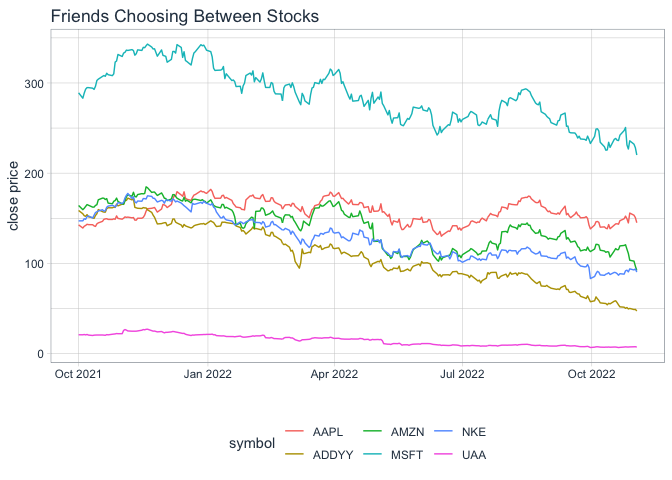

```r
library(tidyquant)
```

```
## Loading required package: lubridate
```

```
## 
## Attaching package: 'lubridate'
```

```
## The following objects are masked from 'package:base':
## 
##     date, intersect, setdiff, union
```

```
## Loading required package: PerformanceAnalytics
```

```
## Loading required package: xts
```

```
## Loading required package: zoo
```

```
## 
## Attaching package: 'zoo'
```

```
## The following objects are masked from 'package:base':
## 
##     as.Date, as.Date.numeric
```

```
## 
## Attaching package: 'PerformanceAnalytics'
```

```
## The following object is masked from 'package:graphics':
## 
##     legend
```

```
## Loading required package: quantmod
```

```
## Loading required package: TTR
```

```
## Registered S3 method overwritten by 'quantmod':
##   method            from
##   as.zoo.data.frame zoo
```

```r
library(knitr)
library(lubridate)
library(tidyverse)
```

```
## ── Attaching packages
## ───────────────────────────────────────
## tidyverse 1.3.2 ──
```

```
## ✔ ggplot2 3.3.5     ✔ purrr   0.3.4
## ✔ tibble  3.1.8     ✔ dplyr   1.0.8
## ✔ tidyr   1.2.0     ✔ stringr 1.4.1
## ✔ readr   2.1.2     ✔ forcats 0.5.1
## ── Conflicts ────────────────────────────────────────── tidyverse_conflicts() ──
## ✖ lubridate::as.difftime() masks base::as.difftime()
## ✖ lubridate::date()        masks base::date()
## ✖ dplyr::filter()          masks stats::filter()
## ✖ dplyr::first()           masks xts::first()
## ✖ lubridate::intersect()   masks base::intersect()
## ✖ dplyr::lag()             masks stats::lag()
## ✖ dplyr::last()            masks xts::last()
## ✖ lubridate::setdiff()     masks base::setdiff()
## ✖ lubridate::union()       masks base::union()
```

```r
library(timetk)
library(dygraphs)
```

Stocks I chose:
- Adidas (ADDYY)
- Nike (NKE)
- Under Armour (UAA)

Stocks my friend chose:
- Amazon (AMZN)
- Apple (AAPL)
- Microsoft (MSFT)


### Pulling Price Performance Data

```r
(Microsoft <- tq_get("MSFT", get = "stock.prices"))
```

```
## # A tibble: 2,728 × 8
##    symbol date        open  high   low close   volume adjusted
##    <chr>  <date>     <dbl> <dbl> <dbl> <dbl>    <dbl>    <dbl>
##  1 MSFT   2012-01-03  26.5  27.0  26.4  26.8 64731500     21.5
##  2 MSFT   2012-01-04  26.8  27.5  26.8  27.4 80516100     22.0
##  3 MSFT   2012-01-05  27.4  27.7  27.3  27.7 56081400     22.3
##  4 MSFT   2012-01-06  27.5  28.2  27.5  28.1 99455500     22.6
##  5 MSFT   2012-01-09  28.0  28.1  27.7  27.7 59706800     22.3
##  6 MSFT   2012-01-10  27.9  28.2  27.8  27.8 60014400     22.4
##  7 MSFT   2012-01-11  27.4  28.0  27.4  27.7 65582400     22.3
##  8 MSFT   2012-01-12  27.9  28.0  27.6  28   49370800     22.5
##  9 MSFT   2012-01-13  27.9  28.2  27.8  28.2 60196100     22.7
## 10 MSFT   2012-01-17  28.4  28.6  28.2  28.3 72395300     22.7
## # … with 2,718 more rows
```

```r
(Apple <- tq_get("AAPL", get = "stock.prices"))
```

```
## # A tibble: 2,728 × 8
##    symbol date        open  high   low close    volume adjusted
##    <chr>  <date>     <dbl> <dbl> <dbl> <dbl>     <dbl>    <dbl>
##  1 AAPL   2012-01-03  14.6  14.7  14.6  14.7 302220800     12.5
##  2 AAPL   2012-01-04  14.6  14.8  14.6  14.8 260022000     12.6
##  3 AAPL   2012-01-05  14.8  14.9  14.7  14.9 271269600     12.7
##  4 AAPL   2012-01-06  15.0  15.1  15.0  15.1 318292800     12.9
##  5 AAPL   2012-01-09  15.2  15.3  15.0  15.1 394024400     12.9
##  6 AAPL   2012-01-10  15.2  15.2  15.1  15.1 258196400     12.9
##  7 AAPL   2012-01-11  15.1  15.1  15.0  15.1 215084800     12.9
##  8 AAPL   2012-01-12  15.1  15.1  15.0  15.0 212587200     12.8
##  9 AAPL   2012-01-13  15.0  15.0  15.0  15.0 226021600     12.8
## 10 AAPL   2012-01-17  15.2  15.2  15.1  15.2 242897200     13.0
## # … with 2,718 more rows
```

```r
(Amazon <- tq_get("AMZN", get = "stock.prices"))
```

```
## # A tibble: 2,728 × 8
##    symbol date        open  high   low close    volume adjusted
##    <chr>  <date>     <dbl> <dbl> <dbl> <dbl>     <dbl>    <dbl>
##  1 AMZN   2012-01-03  8.79  8.97  8.78  8.95 102216000     8.95
##  2 AMZN   2012-01-04  8.96  9.02  8.80  8.88  84104000     8.88
##  3 AMZN   2012-01-05  8.80  8.91  8.70  8.88  76182000     8.88
##  4 AMZN   2012-01-06  8.90  9.23  8.88  9.13 140168000     9.13
##  5 AMZN   2012-01-09  9.14  9.22  8.85  8.93 101138000     8.93
##  6 AMZN   2012-01-10  9.06  9.12  8.86  8.97  79716000     8.97
##  7 AMZN   2012-01-11  8.98  9.04  8.91  8.94  62054000     8.94
##  8 AMZN   2012-01-12  8.97  8.97  8.79  8.80 107716000     8.80
##  9 AMZN   2012-01-13  8.79  8.94  8.68  8.92  95070000     8.92
## 10 AMZN   2012-01-17  9.01  9.16  8.93  9.08 112890000     9.08
## # … with 2,718 more rows
```

```r
(Adidas <- tq_get("ADDYY", get = "stock.prices"))
```

```
## # A tibble: 2,728 × 8
##    symbol date        open  high   low close volume adjusted
##    <chr>  <date>     <dbl> <dbl> <dbl> <dbl>  <dbl>    <dbl>
##  1 ADDYY  2012-01-03  34.0  34.2  33.9  33.9  18800     29.1
##  2 ADDYY  2012-01-04  33.7  33.8  33.4  33.6   9700     28.9
##  3 ADDYY  2012-01-05  33.4  33.5  33.1  33.4  14300     28.7
##  4 ADDYY  2012-01-06  32.8  33.0  32.5  32.9  42000     28.2
##  5 ADDYY  2012-01-09  33.5  34.0  33.4  33.9  34800     29.1
##  6 ADDYY  2012-01-10  34.3  34.3  34.1  34.2  20800     29.4
##  7 ADDYY  2012-01-11  34.0  34.0  33.6  34.0  15100     29.2
##  8 ADDYY  2012-01-12  34.5  34.7  34.2  34.5  24500     29.6
##  9 ADDYY  2012-01-13  33.5  33.5  32.9  33.4  39800     28.7
## 10 ADDYY  2012-01-17  34.3  35.0  34.3  34.7  21700     29.8
## # … with 2,718 more rows
```

```r
(Nike <- tq_get("NKE", get = "stock.prices"))
```

```
## # A tibble: 2,728 × 8
##    symbol date        open  high   low close   volume adjusted
##    <chr>  <date>     <dbl> <dbl> <dbl> <dbl>    <dbl>    <dbl>
##  1 NKE    2012-01-03  24.3  24.5  24.2  24.2 10944400     21.4
##  2 NKE    2012-01-04  24.2  24.7  24.1  24.6  9440800     21.7
##  3 NKE    2012-01-05  24.4  24.6  24.2  24.5  8393200     21.7
##  4 NKE    2012-01-06  24.5  24.6  24.4  24.5  7760800     21.7
##  5 NKE    2012-01-09  24.5  24.7  24.4  24.6 10045600     21.8
##  6 NKE    2012-01-10  24.7  24.7  24.4  24.6  9812400     21.8
##  7 NKE    2012-01-11  24.6  24.6  24.4  24.5  7002800     21.7
##  8 NKE    2012-01-12  24.6  24.8  24.4  24.8  7516400     21.9
##  9 NKE    2012-01-13  24.6  24.7  24.5  24.6  6534000     21.7
## 10 NKE    2012-01-17  24.7  24.9  24.5  24.8  8242000     22.0
## # … with 2,718 more rows
```

```r
(UnderArmour <- tq_get("UAA", get = "stock.prices"))
```

```
## # A tibble: 2,728 × 8
##    symbol date        open  high   low close   volume adjusted
##    <chr>  <date>     <dbl> <dbl> <dbl> <dbl>    <dbl>    <dbl>
##  1 UAA    2012-01-03  9.23  9.38  9.00  9.02  7126400     9.02
##  2 UAA    2012-01-04  9.01  9.17  8.93  9.08  8602400     9.08
##  3 UAA    2012-01-05  9.04  9.16  8.78  9.16 10757600     9.16
##  4 UAA    2012-01-06  9.15  9.36  9.08  9.27  8214400     9.27
##  5 UAA    2012-01-09  9.29  9.39  9.12  9.30  8222400     9.30
##  6 UAA    2012-01-10  9.44  9.46  9.26  9.39  8084000     9.39
##  7 UAA    2012-01-11  9.34  9.48  9.32  9.47  6409600     9.47
##  8 UAA    2012-01-12  9.53  9.73  9.45  9.71 12467200     9.71
##  9 UAA    2012-01-13  9.65  9.80  9.58  9.65  7448800     9.65
## 10 UAA    2012-01-17  9.72  9.83  9.49  9.53  8024000     9.53
## # … with 2,718 more rows
```


### Combining Data

```r
MyStock <- tq_get(c("AAPL", "AMZN", "MSFT"), get = "stock.prices", from = "2021-10-1", to = today())
head(MyStock)
```

```
## # A tibble: 6 × 8
##   symbol date        open  high   low close   volume adjusted
##   <chr>  <date>     <dbl> <dbl> <dbl> <dbl>    <dbl>    <dbl>
## 1 AAPL   2021-10-01  142.  143.  139.  143. 94639600     142.
## 2 AAPL   2021-10-04  142.  142.  138.  139. 98322000     138.
## 3 AAPL   2021-10-05  139.  142.  139.  141. 80861100     140.
## 4 AAPL   2021-10-06  139.  142.  138.  142  83221100     141.
## 5 AAPL   2021-10-07  143.  144.  143.  143. 61732700     142.
## 6 AAPL   2021-10-08  144.  144.  143.  143. 58773200     142.
```

```r
tail(MyStock)
```

```
## # A tibble: 6 × 8
##   symbol date        open  high   low close   volume adjusted
##   <chr>  <date>     <dbl> <dbl> <dbl> <dbl>    <dbl>    <dbl>
## 1 MSFT   2022-10-26  231.  238.  230.  231. 82543200     231.
## 2 MSFT   2022-10-27  231.  234.  226.  227. 40424600     227.
## 3 MSFT   2022-10-28  226.  237.  226.  236. 40647700     236.
## 4 MSFT   2022-10-31  234.  235.  231.  232. 28357300     232.
## 5 MSFT   2022-11-01  235.  236.  227.  228. 30592300     228.
## 6 MSFT   2022-11-02  229.  231.  220.  220. 38360300     220.
```

```r
FriendStock <- tq_get(c("ADDYY", "NKE", "UAA"), get = "stock.prices", from = "2021-10-1", to = today())
head(FriendStock)
```

```
## # A tibble: 6 × 8
##   symbol date        open  high   low close volume adjusted
##   <chr>  <date>     <dbl> <dbl> <dbl> <dbl>  <dbl>    <dbl>
## 1 ADDYY  2021-10-01  158.  159.  157.  159. 117300     155.
## 2 ADDYY  2021-10-04  155.  155.  153.  155.  57400     152.
## 3 ADDYY  2021-10-05  153.  154.  152.  153.  86600     150.
## 4 ADDYY  2021-10-06  150.  153.  150.  152.  39300     149.
## 5 ADDYY  2021-10-07  153.  155.  153.  154.  53200     151.
## 6 ADDYY  2021-10-08  152.  153.  151.  152.  52600     149.
```

```r
tail(FriendStock)
```

```
## # A tibble: 6 × 8
##   symbol date        open  high   low close   volume adjusted
##   <chr>  <date>     <dbl> <dbl> <dbl> <dbl>    <dbl>    <dbl>
## 1 UAA    2022-10-26  7.26  7.5   7.18  7.21  8700100     7.21
## 2 UAA    2022-10-27  7.29  7.39  7.14  7.16  7595300     7.16
## 3 UAA    2022-10-28  7.15  7.35  7.03  7.32  5794000     7.32
## 4 UAA    2022-10-31  7.22  7.48  7.21  7.45 10040300     7.45
## 5 UAA    2022-11-01  7.63  7.73  7.3   7.53 10342100     7.53
## 6 UAA    2022-11-02  7.64  7.64  7.09  7.1  11902500     7.1
```

```r
Both <- tq_get(c("AAPL", "AMZN", "MSFT", "ADDYY", "NKE", "UAA"), get = "stock.prices", from = "2021-10-1", to = today())
head(Both)
```

```
## # A tibble: 6 × 8
##   symbol date        open  high   low close   volume adjusted
##   <chr>  <date>     <dbl> <dbl> <dbl> <dbl>    <dbl>    <dbl>
## 1 AAPL   2021-10-01  142.  143.  139.  143. 94639600     142.
## 2 AAPL   2021-10-04  142.  142.  138.  139. 98322000     138.
## 3 AAPL   2021-10-05  139.  142.  139.  141. 80861100     140.
## 4 AAPL   2021-10-06  139.  142.  138.  142  83221100     141.
## 5 AAPL   2021-10-07  143.  144.  143.  143. 61732700     142.
## 6 AAPL   2021-10-08  144.  144.  143.  143. 58773200     142.
```

```r
tail(Both)
```

```
## # A tibble: 6 × 8
##   symbol date        open  high   low close   volume adjusted
##   <chr>  <date>     <dbl> <dbl> <dbl> <dbl>    <dbl>    <dbl>
## 1 UAA    2022-10-26  7.26  7.5   7.18  7.21  8700100     7.21
## 2 UAA    2022-10-27  7.29  7.39  7.14  7.16  7595300     7.16
## 3 UAA    2022-10-28  7.15  7.35  7.03  7.32  5794000     7.32
## 4 UAA    2022-10-31  7.22  7.48  7.21  7.45 10040300     7.45
## 5 UAA    2022-11-01  7.63  7.73  7.3   7.53 10342100     7.53
## 6 UAA    2022-11-02  7.64  7.64  7.09  7.1  11902500     7.1
```


#Comparing Stock Prices Visualization

```r
stockplot <- Both %>%
  ggplot(aes(x = date, y = close, color = symbol)) +
  geom_line() +
  labs(title = "Friends Choosing Between Stocks", y = "close price", x = "") +
  theme_tq()

stockplot
```

<!-- -->


### Comparing Stock percentages interavtive visualization

```r
adjusted <- Both %>%
  select(symbol, date, adjusted) %>%
  pivot_wider(names_from = symbol, values_from = adjusted) %>%
  tk_xts(date_var = date)
```

```
## Warning: Non-numeric columns being dropped: date
```

```r
dygraph(adjusted, main = "Friends Comparing Stocks") %>%
  dyRebase(percent = TRUE) %>%
  dyShading(from = "2021-10-01", to = today()) %>%
  dyRangeSelector()
```

```{=html}
<div id="htmlwidget-eaffe8aec3c823339e10" style="width:672px;height:480px;" class="dygraphs html-widget"></div>
<script type="application/json" data-for="htmlwidget-eaffe8aec3c823339e10">{"x":{"attrs":{"title":"Friends Comparing Stocks","labels":["day","AAPL","AMZN","MSFT","ADDYY","NKE","UAA"],"legend":"auto","retainDateWindow":false,"axes":{"x":{"pixelsPerLabel":60}},"showRangeSelector":true,"rangeSelectorHeight":40,"rangeSelectorPlotFillColor":" #A7B1C4","rangeSelectorPlotStrokeColor":"#808FAB","interactionModel":"Dygraph.Interaction.defaultModel"},"scale":"daily","annotations":[],"shadings":[{"from":"2021-10-01T00:00:00.000Z","to":"2022-11-03T00:00:00.000Z","color":"#EFEFEF","axis":"x"}],"events":[],"format":"date","data":[["2021-10-01T00:00:00.000Z","2021-10-04T00:00:00.000Z","2021-10-05T00:00:00.000Z","2021-10-06T00:00:00.000Z","2021-10-07T00:00:00.000Z","2021-10-08T00:00:00.000Z","2021-10-11T00:00:00.000Z","2021-10-12T00:00:00.000Z","2021-10-13T00:00:00.000Z","2021-10-14T00:00:00.000Z","2021-10-15T00:00:00.000Z","2021-10-18T00:00:00.000Z","2021-10-19T00:00:00.000Z","2021-10-20T00:00:00.000Z","2021-10-21T00:00:00.000Z","2021-10-22T00:00:00.000Z","2021-10-25T00:00:00.000Z","2021-10-26T00:00:00.000Z","2021-10-27T00:00:00.000Z","2021-10-28T00:00:00.000Z","2021-10-29T00:00:00.000Z","2021-11-01T00:00:00.000Z","2021-11-02T00:00:00.000Z","2021-11-03T00:00:00.000Z","2021-11-04T00:00:00.000Z","2021-11-05T00:00:00.000Z","2021-11-08T00:00:00.000Z","2021-11-09T00:00:00.000Z","2021-11-10T00:00:00.000Z","2021-11-11T00:00:00.000Z","2021-11-12T00:00:00.000Z","2021-11-15T00:00:00.000Z","2021-11-16T00:00:00.000Z","2021-11-17T00:00:00.000Z","2021-11-18T00:00:00.000Z","2021-11-19T00:00:00.000Z","2021-11-22T00:00:00.000Z","2021-11-23T00:00:00.000Z","2021-11-24T00:00:00.000Z","2021-11-26T00:00:00.000Z","2021-11-29T00:00:00.000Z","2021-11-30T00:00:00.000Z","2021-12-01T00:00:00.000Z","2021-12-02T00:00:00.000Z","2021-12-03T00:00:00.000Z","2021-12-06T00:00:00.000Z","2021-12-07T00:00:00.000Z","2021-12-08T00:00:00.000Z","2021-12-09T00:00:00.000Z","2021-12-10T00:00:00.000Z","2021-12-13T00:00:00.000Z","2021-12-14T00:00:00.000Z","2021-12-15T00:00:00.000Z","2021-12-16T00:00:00.000Z","2021-12-17T00:00:00.000Z","2021-12-20T00:00:00.000Z","2021-12-21T00:00:00.000Z","2021-12-22T00:00:00.000Z","2021-12-23T00:00:00.000Z","2021-12-27T00:00:00.000Z","2021-12-28T00:00:00.000Z","2021-12-29T00:00:00.000Z","2021-12-30T00:00:00.000Z","2021-12-31T00:00:00.000Z","2022-01-03T00:00:00.000Z","2022-01-04T00:00:00.000Z","2022-01-05T00:00:00.000Z","2022-01-06T00:00:00.000Z","2022-01-07T00:00:00.000Z","2022-01-10T00:00:00.000Z","2022-01-11T00:00:00.000Z","2022-01-12T00:00:00.000Z","2022-01-13T00:00:00.000Z","2022-01-14T00:00:00.000Z","2022-01-18T00:00:00.000Z","2022-01-19T00:00:00.000Z","2022-01-20T00:00:00.000Z","2022-01-21T00:00:00.000Z","2022-01-24T00:00:00.000Z","2022-01-25T00:00:00.000Z","2022-01-26T00:00:00.000Z","2022-01-27T00:00:00.000Z","2022-01-28T00:00:00.000Z","2022-01-31T00:00:00.000Z","2022-02-01T00:00:00.000Z","2022-02-02T00:00:00.000Z","2022-02-03T00:00:00.000Z","2022-02-04T00:00:00.000Z","2022-02-07T00:00:00.000Z","2022-02-08T00:00:00.000Z","2022-02-09T00:00:00.000Z","2022-02-10T00:00:00.000Z","2022-02-11T00:00:00.000Z","2022-02-14T00:00:00.000Z","2022-02-15T00:00:00.000Z","2022-02-16T00:00:00.000Z","2022-02-17T00:00:00.000Z","2022-02-18T00:00:00.000Z","2022-02-22T00:00:00.000Z","2022-02-23T00:00:00.000Z","2022-02-24T00:00:00.000Z","2022-02-25T00:00:00.000Z","2022-02-28T00:00:00.000Z","2022-03-01T00:00:00.000Z","2022-03-02T00:00:00.000Z","2022-03-03T00:00:00.000Z","2022-03-04T00:00:00.000Z","2022-03-07T00:00:00.000Z","2022-03-08T00:00:00.000Z","2022-03-09T00:00:00.000Z","2022-03-10T00:00:00.000Z","2022-03-11T00:00:00.000Z","2022-03-14T00:00:00.000Z","2022-03-15T00:00:00.000Z","2022-03-16T00:00:00.000Z","2022-03-17T00:00:00.000Z","2022-03-18T00:00:00.000Z","2022-03-21T00:00:00.000Z","2022-03-22T00:00:00.000Z","2022-03-23T00:00:00.000Z","2022-03-24T00:00:00.000Z","2022-03-25T00:00:00.000Z","2022-03-28T00:00:00.000Z","2022-03-29T00:00:00.000Z","2022-03-30T00:00:00.000Z","2022-03-31T00:00:00.000Z","2022-04-01T00:00:00.000Z","2022-04-04T00:00:00.000Z","2022-04-05T00:00:00.000Z","2022-04-06T00:00:00.000Z","2022-04-07T00:00:00.000Z","2022-04-08T00:00:00.000Z","2022-04-11T00:00:00.000Z","2022-04-12T00:00:00.000Z","2022-04-13T00:00:00.000Z","2022-04-14T00:00:00.000Z","2022-04-18T00:00:00.000Z","2022-04-19T00:00:00.000Z","2022-04-20T00:00:00.000Z","2022-04-21T00:00:00.000Z","2022-04-22T00:00:00.000Z","2022-04-25T00:00:00.000Z","2022-04-26T00:00:00.000Z","2022-04-27T00:00:00.000Z","2022-04-28T00:00:00.000Z","2022-04-29T00:00:00.000Z","2022-05-02T00:00:00.000Z","2022-05-03T00:00:00.000Z","2022-05-04T00:00:00.000Z","2022-05-05T00:00:00.000Z","2022-05-06T00:00:00.000Z","2022-05-09T00:00:00.000Z","2022-05-10T00:00:00.000Z","2022-05-11T00:00:00.000Z","2022-05-12T00:00:00.000Z","2022-05-13T00:00:00.000Z","2022-05-16T00:00:00.000Z","2022-05-17T00:00:00.000Z","2022-05-18T00:00:00.000Z","2022-05-19T00:00:00.000Z","2022-05-20T00:00:00.000Z","2022-05-23T00:00:00.000Z","2022-05-24T00:00:00.000Z","2022-05-25T00:00:00.000Z","2022-05-26T00:00:00.000Z","2022-05-27T00:00:00.000Z","2022-05-31T00:00:00.000Z","2022-06-01T00:00:00.000Z","2022-06-02T00:00:00.000Z","2022-06-03T00:00:00.000Z","2022-06-06T00:00:00.000Z","2022-06-07T00:00:00.000Z","2022-06-08T00:00:00.000Z","2022-06-09T00:00:00.000Z","2022-06-10T00:00:00.000Z","2022-06-13T00:00:00.000Z","2022-06-14T00:00:00.000Z","2022-06-15T00:00:00.000Z","2022-06-16T00:00:00.000Z","2022-06-17T00:00:00.000Z","2022-06-21T00:00:00.000Z","2022-06-22T00:00:00.000Z","2022-06-23T00:00:00.000Z","2022-06-24T00:00:00.000Z","2022-06-27T00:00:00.000Z","2022-06-28T00:00:00.000Z","2022-06-29T00:00:00.000Z","2022-06-30T00:00:00.000Z","2022-07-01T00:00:00.000Z","2022-07-05T00:00:00.000Z","2022-07-06T00:00:00.000Z","2022-07-07T00:00:00.000Z","2022-07-08T00:00:00.000Z","2022-07-11T00:00:00.000Z","2022-07-12T00:00:00.000Z","2022-07-13T00:00:00.000Z","2022-07-14T00:00:00.000Z","2022-07-15T00:00:00.000Z","2022-07-18T00:00:00.000Z","2022-07-19T00:00:00.000Z","2022-07-20T00:00:00.000Z","2022-07-21T00:00:00.000Z","2022-07-22T00:00:00.000Z","2022-07-25T00:00:00.000Z","2022-07-26T00:00:00.000Z","2022-07-27T00:00:00.000Z","2022-07-28T00:00:00.000Z","2022-07-29T00:00:00.000Z","2022-08-01T00:00:00.000Z","2022-08-02T00:00:00.000Z","2022-08-03T00:00:00.000Z","2022-08-04T00:00:00.000Z","2022-08-05T00:00:00.000Z","2022-08-08T00:00:00.000Z","2022-08-09T00:00:00.000Z","2022-08-10T00:00:00.000Z","2022-08-11T00:00:00.000Z","2022-08-12T00:00:00.000Z","2022-08-15T00:00:00.000Z","2022-08-16T00:00:00.000Z","2022-08-17T00:00:00.000Z","2022-08-18T00:00:00.000Z","2022-08-19T00:00:00.000Z","2022-08-22T00:00:00.000Z","2022-08-23T00:00:00.000Z","2022-08-24T00:00:00.000Z","2022-08-25T00:00:00.000Z","2022-08-26T00:00:00.000Z","2022-08-29T00:00:00.000Z","2022-08-30T00:00:00.000Z","2022-08-31T00:00:00.000Z","2022-09-01T00:00:00.000Z","2022-09-02T00:00:00.000Z","2022-09-06T00:00:00.000Z","2022-09-07T00:00:00.000Z","2022-09-08T00:00:00.000Z","2022-09-09T00:00:00.000Z","2022-09-12T00:00:00.000Z","2022-09-13T00:00:00.000Z","2022-09-14T00:00:00.000Z","2022-09-15T00:00:00.000Z","2022-09-16T00:00:00.000Z","2022-09-19T00:00:00.000Z","2022-09-20T00:00:00.000Z","2022-09-21T00:00:00.000Z","2022-09-22T00:00:00.000Z","2022-09-23T00:00:00.000Z","2022-09-26T00:00:00.000Z","2022-09-27T00:00:00.000Z","2022-09-28T00:00:00.000Z","2022-09-29T00:00:00.000Z","2022-09-30T00:00:00.000Z","2022-10-03T00:00:00.000Z","2022-10-04T00:00:00.000Z","2022-10-05T00:00:00.000Z","2022-10-06T00:00:00.000Z","2022-10-07T00:00:00.000Z","2022-10-10T00:00:00.000Z","2022-10-11T00:00:00.000Z","2022-10-12T00:00:00.000Z","2022-10-13T00:00:00.000Z","2022-10-14T00:00:00.000Z","2022-10-17T00:00:00.000Z","2022-10-18T00:00:00.000Z","2022-10-19T00:00:00.000Z","2022-10-20T00:00:00.000Z","2022-10-21T00:00:00.000Z","2022-10-24T00:00:00.000Z","2022-10-25T00:00:00.000Z","2022-10-26T00:00:00.000Z","2022-10-27T00:00:00.000Z","2022-10-28T00:00:00.000Z","2022-10-31T00:00:00.000Z","2022-11-01T00:00:00.000Z","2022-11-02T00:00:00.000Z"],[141.855087,138.36467,140.323669,141.208725,142.491531,142.103699,142.014221,140.721451,140.124802,142.958908,144.032898,145.733368,147.931061,148.428268,148.647034,147.86145,147.811722,148.487961,148.020554,151.719833,148.965271,148.129959,149.184036,150.645844,150.118805,150.656586,149.820023,150.188522,147.310425,147.26062,149.371902,149.381851,150.377731,152.857468,157.219421,159.888367,160.356445,160.744827,161.272644,156.163788,159.579666,164.618805,164.090988,163.085144,161.17305,164.638718,170.474548,174.35849,173.840637,178.71048,175.015793,173.611588,178.561111,171.550095,170.434723,169.050461,172.2771,174.916183,175.553558,179.586868,178.551147,178.640778,177.465622,176.838242,181.259918,178.959442,174.199158,171.291183,171.460495,171.480408,174.35849,174.806641,171.480408,172.356796,169.100266,165.544968,163.832062,161.740723,160.953949,159.121536,159.031906,158.563843,169.628082,174.059738,173.890442,175.115341,172.187469,171.898315,171.170395,174.331345,175.777222,171.629074,168.159012,168.398315,172.297165,172.057861,168.398315,166.82283,163.851334,159.613464,162.275848,164.379822,164.649048,162.734528,166.084946,165.755875,162.704605,158.845657,156.990952,162.485245,158.067886,154.288681,150.190399,154.647644,159.134827,160.16188,163.512299,164.90831,168.338501,169.724548,173.573517,174.221664,175.099152,178.44957,177.26297,174.111984,173.81282,177.931046,174.560684,171.339905,171.649017,169.604858,165.277237,167.181808,169.913971,164.818558,164.599197,166.922546,166.753021,165.945343,161.328537,162.415436,156.352783,156.123444,163.173264,157.200348,157.509476,159.025131,165.546478,156.322876,157.061829,151.849075,154.29567,146.296783,142.362244,146.905945,145.33812,149.03299,140.62468,137.159485,137.399139,142.911484,140.165298,140.325089,143.580551,149.432434,148.633545,148.503723,151.000259,145.178345,145.937286,148.503723,147.754776,142.442139,136.939789,131.697067,132.575836,135.242142,129.879593,131.377502,135.681534,135.162262,138.078201,141.463501,141.463501,137.249359,139.036865,136.53035,138.737274,141.363632,142.721756,146.147003,146.836029,144.669037,145.657669,145.288193,148.264053,149.9617,146.865997,150.790543,152.827713,155.134521,153.876251,152.737839,151.389725,156.57251,157.131744,162.284576,161.285965,159.78804,165.899567,165.580002,165.350006,164.869995,164.919998,169.240005,168.490005,172.100006,173.190002,173.029999,174.550003,174.149994,171.520004,167.570007,167.229996,167.529999,170.029999,163.619995,161.380005,158.910004,157.220001,157.960007,155.809998,154.529999,155.960007,154.460007,157.369995,163.429993,153.839996,155.309998,152.369995,150.699997,154.479996,156.899994,153.720001,152.740005,150.429993,150.770004,151.759995,149.839996,142.479996,138.199997,142.449997,146.100006,146.399994,145.429993,140.089996,140.419998,138.979996,138.339996,142.990005,138.380005,142.410004,143.75,143.860001,143.389999,147.270004,149.449997,152.339996,149.350006,144.800003,155.740005,153.339996,150.649994,145.029999],[164.162994,159.488998,161.050003,163.100494,165.121506,164.431,162.315002,162.366501,164.214005,164.992996,170.451004,172.337006,172.207504,170.753006,171.750504,166.777496,166.018494,168.803497,169.624496,172.328506,168.621506,165.905502,165.637497,169.199997,173.850006,175.949493,174.449005,178.811493,174.102493,173.625,176.257507,177.283997,177.035004,177.449997,184.802994,183.828506,178.628494,179.001999,179.020493,175.227997,178.078506,175.3535,172.186005,171.867996,169.489502,171.3685,176.164505,176.158005,174.171005,172.212006,169.567505,169.091507,173.315002,168.871002,170.017502,167.078995,170.417007,171.037003,171.068497,169.669495,170.660995,169.201004,168.644501,166.716995,170.404495,167.522003,164.356995,163.253998,162.554001,161.485992,165.362,165.207001,161.214005,162.138,158.917496,156.298996,151.667496,142.643005,144.544006,139.985992,138.872498,139.637497,143.977997,149.573502,151.193497,150.612503,138.845505,157.639496,157.935501,161.413498,161.189499,159.003494,153.293503,155.167007,156.510498,158.100494,154.652496,152.601501,150.197495,144.826996,151.358002,153.788498,153.563004,151.141998,152.052505,147.898499,145.641006,137.453003,136.014496,139.279007,146.817505,145.524506,141.852997,147.366501,153.104004,157.238998,161.250504,161.491501,164.889008,163.408005,163.649506,164.773499,168.990494,169.315002,166.300995,162.997498,163.559998,168.346497,164.054993,158.755997,157.7845,154.460495,151.121994,150.787506,155.541,151.706497,152.785004,158.115494,153.998001,148.296005,144.350006,146.074005,139.391006,138.167007,144.596497,124.281502,124.5,124.253502,125.928497,116.406998,114.772499,108.789001,108.859001,105.372002,106.930496,113.055,110.810501,115.3685,107.112503,107.319,107.591003,107.556999,104.099998,106.775002,111.077499,115.1465,120.209503,121.683998,125.511002,122.349998,124.790001,123,121.18,116.150002,109.650002,103.669998,102.309998,107.669998,103.660004,106.220001,108.68,108.949997,112.440002,116.459999,113.220001,107.400002,108.919998,106.209999,109.559998,113.5,114.330002,116.330002,115.540001,111.75,109.220001,110.400002,110.629997,113.550003,113.760002,118.209999,122.769997,124.629997,122.419998,121.139999,114.809998,120.970001,122.279999,134.949997,135.389999,134.160004,139.520004,142.570007,140.800003,139.410004,137.830002,142.690002,140.639999,143.550003,143.179993,144.779999,142.100006,142.300003,138.229996,133.220001,133.619995,133.800003,137.279999,130.75,129.789993,128.729996,126.769997,127.82,127.510002,126.110001,129.479996,129.820007,133.270004,136.449997,126.82,128.550003,126.279999,123.529999,124.660004,122.190002,118.540001,117.309998,113.779999,115.150002,114.410004,118.010002,114.800003,113,115.879997,121.089996,120.949997,120.300003,114.559998,113.669998,112.209999,112.900002,112.529999,106.900002,113.790001,116.360001,115.07,115.25,119.32,119.82,120.599998,115.660004,110.959999,103.410004,102.440002,96.790001,92.120003],[286.698914,280.758606,286.361725,290.675568,292.401093,292.401093,291.786285,290.44751,293.848969,300.235535,301.68335,304.737823,305.670013,304.856781,308.178986,306.592285,305.570831,307.534363,320.485901,321.656097,328.865753,326.634399,330.36322,331.225952,333.645721,333.26886,334.191132,333.159821,328.052551,329.669006,333.92337,333.278778,336.690247,336.918732,339.054749,340.882782,337.624054,335.488037,335.716583,327.539978,334.444885,328.444061,327.937408,327.351196,320.9133,324.072632,332.745972,332.795654,330.937775,340.316528,337.196869,326.208679,332.477722,322.790985,321.69812,317.833405,325.165497,331.03717,332.517456,340.227112,339.034882,339.730377,337.117432,334.136932,332.577057,326.874359,314.326324,311.842529,312.001495,312.230011,312.935425,316.204041,302.821472,308.186462,300.685425,301.361023,299.642273,294.108429,294.446228,286.617371,294.783997,297.893677,306.259033,308.961365,306.755798,311.425232,299.294525,303.954102,298.99649,302.583038,309.18988,300.417206,293.124847,293.085114,298.519592,298.171143,289.440063,286.652466,286.44342,279.026489,293.282928,295.990875,297.464294,293.641357,298.858093,294.607056,288.573914,277.672516,274.626099,287.219971,284.322845,278.827393,275.21347,285.875946,293.083832,293.910126,299.097015,297.832672,302.710907,298.161194,302.750763,302.332611,309.321503,314.010559,312.467438,306.942047,308.04715,313.57251,309.500671,298.171143,300.032867,295.652374,283.994354,280.808533,286.343872,278.588409,279.27533,284.034149,285.089447,279.564056,272.814178,279.474487,269.021088,281.963379,288.344971,276.288666,283.207855,280.529785,288.69339,276.119446,273.511047,263.406067,268.30426,259.393951,254.217056,259.961456,260.339752,265.636169,253.54184,252.603821,252.025055,260.0979,259.070099,261.963928,265.336792,272.661224,271.294159,271.842987,273.998383,269.448059,268.180756,271.922821,269.83725,264.229156,252.454147,241.746857,243.972153,251.226746,244.451126,247.125443,253.20256,252.593842,258.311676,267.132996,264.328949,255.936752,259.70874,256.28598,259.030182,262.293274,265.646118,267.831482,267.093079,263.949738,253.13269,252.184708,253.54184,256.176239,253.711472,258.980286,261.714478,264.279022,259.808502,258.281769,251.36644,268.170776,275.824524,280.145355,277.421143,274.237915,281.871704,283.049194,282.31076,279.726257,281.702057,288.547516,286.412048,291.291718,292.848389,292.089996,291.320007,290.170013,286.149994,277.75,276.440002,275.790009,278.850006,268.089996,265.230011,262.970001,261.470001,260.399994,256.059998,253.25,258.089996,258.519989,264.459991,266.649994,251.990005,252.220001,245.380005,244.740005,244.520004,242.449997,238.949997,240.979996,237.919998,237.449997,236.410004,241.070007,237.5,232.899994,240.740005,248.880005,249.199997,246.789993,234.240005,229.25,225.410004,225.75,234.240005,228.559998,237.529999,238.5,236.479996,236.149994,242.119995,247.25,250.660004,231.320007,226.75,235.869995,232.130005,228.169998,220.100006],[155.498962,151.920563,149.802917,149.146072,150.94017,148.655869,147.616669,146.90097,150.106842,151.959763,156.459732,154.224457,153.753876,153.655838,157.528351,158.449921,158.420502,159.106766,158.802856,162.420486,160.498932,162.361664,162.136169,166.743988,166.420456,168.940048,166.998886,168.312592,158.881287,158.37149,157.891098,157.6362,158.646011,158.253845,158.244049,156.263657,153.410736,150.391144,148.077438,140.852005,141.224548,141.763763,142.155914,142.332367,138.940247,141.234344,146.195099,146.273529,142.871582,141.881409,139.685333,137.253983,140.293182,138.793198,138.15593,136.499084,137.185349,138.73436,139.479462,141.038269,140.910812,141.371597,140.214752,141.175522,144.263733,143.185318,142.440216,140.126511,138.067703,138.626511,142.812775,142.724533,142.77356,142.302963,141.35199,141.283371,141.087296,138.675537,136.999084,133.048141,133.773605,132.273621,129.871689,133.852051,135.195175,137.538284,135.263809,135.979477,134.822632,134.489288,137.538284,135.146164,129.263855,127.656013,131.705002,131.675583,127.793266,127.293266,123.352119,119.79332,118.342346,118.901161,115.528633,111.263962,112.195328,108.058105,100.087563,92.783691,98.911102,113.607079,108.577705,108.754173,110.107101,109.548286,116.146286,116.83255,118.224693,115.489426,117.440392,113.107086,113.724731,114.754135,115.881577,119.097244,118.077644,114.528648,114.028648,114.803154,111.999252,108.352211,109.695343,110.107101,107.714966,106.597328,105.479683,106.067917,106.303207,108.528687,110.695343,108.960052,104.90126,102.322845,97.058174,94.440544,97.538559,98.107185,100.205208,99.558159,102.156174,97.420921,93.69545,89.852341,90.224884,91.322922,91.018997,94.769997,94.099998,97.040001,90.879997,91.300003,91.360001,93.669998,92.339996,91.720001,94.830002,96.739998,99.139999,97.129997,101.879997,100.300003,100.620003,100,99.650002,95.529999,92.309998,88.25,85.959999,87.57,85.029999,87.129997,87.330002,86.720001,88.540001,90.620003,91.040001,88.559998,88.510002,88.599998,88.279999,86.540001,84.120003,86.800003,85.540001,81.800003,80.400002,81.349998,78.25,80.82,83.550003,89.919998,88.059998,89.68,89.889999,90.019997,83.650002,83.330002,85.300003,86.139999,88,84.809998,87.07,89.93,87.940002,89.199997,86.699997,89.449997,88.629997,89.519997,87.940002,88.029999,86.349998,84.610001,82.730003,78.550003,77.580002,78.870003,79.720001,74.919998,74.5,75.580002,74.18,73.389999,72.419998,71.099998,71.639999,70.879997,73.150002,75.379997,71.029999,71.120003,68.040001,67.650002,68.959999,67.309998,66.150002,65.970001,63.41,61.75,60.919998,63.959999,60.630001,57.41,58.470001,62.790001,60.66,58.860001,56.169998,55.599998,55.459999,54,55.68,55.040001,58.009998,58.459999,56.41,53.939999,51.75,51.360001,50.099998,50.98,49.400002,50,48.759998,48.950001,47.119999],[145.681534,145.760773,148.059052,147.405228,150.426636,151.050735,148.871353,151.912582,154.83493,155.667038,156.528885,157.935593,156.340683,156.964767,160.659805,161.947617,162.680695,162.254715,160.828217,162.918442,165.721909,164.770905,166.256851,170.883072,173.795517,175.846115,170.239166,172.190704,166.682816,165.404922,167.505035,167.267288,170.21933,170.130203,169.743851,173.240768,172.606766,170.536346,170.41748,166.445068,168.277725,167.653625,165.137436,168.406494,168.947372,167.627457,169.989395,168.957275,166.823624,167.776321,165.573181,164.144119,162.655502,161.484467,160.134796,155.78804,165.364777,164.183807,164.412064,166.307571,165.156387,167.498444,166.218246,165.404465,163.419662,165.126587,161.018036,159.8172,155.778122,149.297714,149.158768,151.054276,148.454147,147.054855,145.834213,144.008163,141.64624,141.864563,144.891418,144.375366,142.896683,143.541733,144.802109,146.945694,147.094559,147.580841,144.20665,144.286041,144.037964,142.44017,145.149445,143.720383,139.115616,140.514908,144.474609,145.377701,141.715729,141.864563,137.140717,135.791061,136.128464,137.746094,135.513168,131.216034,134.649765,132.952759,130.481003,123.776924,120.564133,126.273544,125.358452,121.976563,116.943527,118.763779,124.522926,126.731094,130.540695,129.496292,132.380829,132.291306,131.376205,132.987579,134.091675,138.39859,137.801788,133.843002,132.808548,133.624161,131.595047,127.676033,128.690613,127.467148,124.314049,124.373726,126.810661,132.748871,130.928619,136.319733,135.146011,134.73822,128.382263,127.258278,119.877808,120.593971,126.373024,124.035538,125.408188,122.205345,125.388283,117.997879,113.879944,110.617416,108.906586,107.344948,107.325058,112.407829,112.000008,115.282425,108.787224,105.872841,107.424522,108.051163,106.718307,107.623451,112.338203,115.371948,118.216705,118.047615,122.752411,120.603584,119.885651,121.321518,122.049431,118.260315,114.401405,110.123688,110.402885,113.115097,106.813194,107.032562,108.368729,104.619492,107.690674,112.586617,110.183517,102.485626,102.954277,101.90728,100.890205,104.021217,103.931473,107.820297,107.620872,104.808952,103.462822,104.808952,102.92437,104.400124,103.642303,108.877266,110.791771,111.300308,108.807472,108.96701,104.898689,107.551079,111.908562,114.590851,113.972633,111.449875,113.95269,114.152115,113.543861,113.673492,109.794632,112.815956,113.773201,115.737564,115.986847,117.721863,116.704781,115.677734,112.835899,110.023972,110.362999,111.090912,112.895729,107.969872,107.571014,107.551079,106.145111,106.184998,105.739998,105.150002,108.480003,108.730003,110.970001,112.379997,105.720001,107,105.5,104.120003,107.209999,102.419998,99.790001,98.550003,97.019997,96.059998,96.290001,98.699997,95.330002,83.120003,85.400002,88.639999,91.099998,90.169998,87.160004,86.690002,87.989998,88.510002,89.559998,87.550003,89.970001,89.68,88.57,86.830002,88.5,88.010002,91.720001,92.389999,90.540001,93.830002,92.68,93.769997,90.300003],[20.790001,20.74,21.049999,20.620001,21.110001,20.440001,19.99,20.34,20.450001,20.51,20.51,20.530001,20.379999,20.200001,20.93,20.68,21.360001,21.549999,21.719999,22.129999,21.959999,21.98,25.6,26.540001,25.93,25.02,24.74,24.75,24.74,24.780001,25.02,25.84,26.57,26.27,26.83,26.959999,25.360001,24.799999,24.9,23.98,24.389999,23.59,22.889999,23.5,23.469999,23.98,24.450001,24.25,23.879999,23.610001,22.6,22.25,22.370001,21.370001,20.9,19.940001,20.5,20.360001,20.620001,20.9,20.93,21.08,21.040001,21.190001,21.24,21.48,20.709999,20.83,19.85,19.540001,19.469999,19.59,19.299999,18.860001,18.809999,18.799999,18.51,18.77,19.33,18.6,18.139999,18.129999,18.26,18.83,19.08,19.59,19.18,19.57,19.559999,19.889999,20.35,20.01,17.51,17.190001,17.76,17.25,16.530001,16.540001,16.15,15.79,17.1,17.76,17.889999,17.24,17.32,16.450001,15.26,13.83,14.19,15.26,15.29,15.37,15.73,16.120001,16.99,17.16,17.5,17.120001,17.129999,16.950001,17.27,17.42,17.43,18.030001,17.66,17.02,16.77,16.959999,16.49,16.15,16.08,15.95,15.9,15.91,16.219999,16.059999,16.040001,16.719999,16.540001,16.370001,15.47,15.77,14.81,15.04,15.64,15.36,15.57,15.33,15.58,14.29,10.89,10.33,10.39,9.98,10.64,11.04,10.92,11.4,10.53,9.28,9.64,9.69,9.11,9.75,10.09,10.34,10.58,10.33,11.03,11,11.03,10.99,10.92,10.53,10.13,9.66,9.46,9.56,8.94,9.16,8.87,8.93,9.09,9.58,9.33,9.13,8.78,8.33,8.5,8.74,8.52,8.82,8.97,8.62,8.61,8.53,8.12,8.33,8.25,8.74,8.95,8.96,8.76,8.73,8.25,8.7,8.98,9.26,9.26,9.2,9.33,9.3,9.33,9.67,9.22,9.76,9.85,10.03,10.17,10.24,9.95,9.76,9.25,8.85,8.99,9.01,9.18,8.73,8.54,8.68,8.42,8.32,8.28,8.25,8.64,8.81,9.01,9.19,8.6,8.67,8.44,8.35,8.59,8.27,8.06,7.75,7.6,7.58,7.75,7.93,7.37,6.65,7.03,7.4,7.48,7.3,7.07,6.94,7.12,7.04,7.21,6.97,7.18,7.17,6.92,6.62,6.82,7.17,7.37,7.21,7.16,7.32,7.45,7.53,7.1]],"plugins":{"Rebase":"percent"}},"evals":["attrs.interactionModel"],"jsHooks":[]}</script>
```

The stocks I chose to go with were ones I felt were pretty popular, falling in the retail or technoloy sectors of types of stocks. I also use products of these companies on a daily basis, so I thought it'd be interesting to see how they've been doing on the market. The first visualization I made was a line graph plotting the prices of each stock over the selected time period. This visualization gives a good idea on how each stock has performed compared to each other, but it didn't exactly give specifics. To get the specific information I wanted, I created a dygrpah. This interactivce graph was much better for comparioson puproses as it gave the net gain/loss as a percentage for each stock overtime. The graph shows that Apple was the only company with a net gain, as all the others showed an overall decrease in stock value over the selected time frame. 


