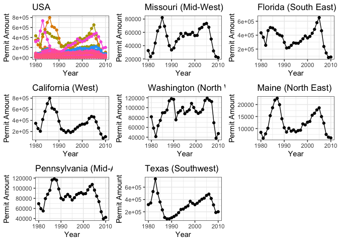

```r
library(tidyverse)
```

```
## ── Attaching packages ─────────────────────────────────────── tidyverse 1.3.2 ──
## ✔ ggplot2 3.3.5     ✔ purrr   0.3.4
## ✔ tibble  3.1.8     ✔ dplyr   1.0.8
## ✔ tidyr   1.2.0     ✔ stringr 1.4.1
## ✔ readr   2.1.2     ✔ forcats 0.5.1
## ── Conflicts ────────────────────────────────────────── tidyverse_conflicts() ──
## ✖ dplyr::filter() masks stats::filter()
## ✖ dplyr::lag()    masks stats::lag()
```

```r
library(USAboundaries)
library(USAboundariesData)
library(ggsflabel)
```

```
## 
## Attaching package: 'ggsflabel'
## 
## The following objects are masked from 'package:ggplot2':
## 
##     geom_sf_label, geom_sf_text, StatSfCoordinates
```

```r
library(remotes)
library(devtools)
```

```
## Loading required package: usethis
## 
## Attaching package: 'usethis'
## 
## The following object is masked from 'package:remotes':
## 
##     git_credentials
## 
## 
## Attaching package: 'devtools'
## 
## The following objects are masked from 'package:remotes':
## 
##     dev_package_deps, install_bioc, install_bitbucket, install_cran,
##     install_deps, install_dev, install_git, install_github,
##     install_gitlab, install_local, install_svn, install_url,
##     install_version, update_packages
```

```r
library(ggplot2)
library(maps)
```

```
## 
## Attaching package: 'maps'
## 
## The following object is masked from 'package:purrr':
## 
##     map
```

```r
library(knitr)
library(downloader)
```

```
## 
## Attaching package: 'downloader'
## 
## The following object is masked from 'package:devtools':
## 
##     source_url
```

```r
library(lubridate)
```

```
## 
## Attaching package: 'lubridate'
## 
## The following objects are masked from 'package:base':
## 
##     date, intersect, setdiff, union
```

```r
library(plotly)
```

```
## 
## Attaching package: 'plotly'
## 
## The following object is masked from 'package:ggplot2':
## 
##     last_plot
## 
## The following object is masked from 'package:stats':
## 
##     filter
## 
## The following object is masked from 'package:graphics':
## 
##     layout
```

```r
library(gridExtra)
```

```
## 
## Attaching package: 'gridExtra'
## 
## The following object is masked from 'package:dplyr':
## 
##     combine
```


```r
permitdata <- tempfile()
download("https://raw.githubusercontent.com/WJC-Data-Science/DTS350/master/permits.csv", permitdata, mode = "wb")

permits <- read_csv(permitdata)
```

```
## New names:
## Rows: 327422 Columns: 8
## ── Column specification
## ──────────────────────────────────────────────────────── Delimiter: "," chr
## (3): StateAbbr, countyname, variable dbl (5): ...1, state, county, year, value
## ℹ Use `spec()` to retrieve the full column specification for this data. ℹ
## Specify the column types or set `show_col_types = FALSE` to quiet this message.
## • `` -> `...1`
```

```r
head(permits)
```

```
## # A tibble: 6 × 8
##    ...1 state StateAbbr county countyname     variable     year value
##   <dbl> <dbl> <chr>      <dbl> <chr>          <chr>       <dbl> <dbl>
## 1     1     1 AL             1 Autauga County All Permits  2010   191
## 2     2     1 AL             1 Autauga County All Permits  2009   110
## 3     3     1 AL             1 Autauga County All Permits  2008   173
## 4     4     1 AL             1 Autauga County All Permits  2007   260
## 5     5     1 AL             1 Autauga County All Permits  2006   347
## 6     6     1 AL             1 Autauga County All Permits  2005   313
```

```r
tail(permits)
```

```
## # A tibble: 6 × 8
##     ...1 state StateAbbr county countyname    variable                year value
##    <dbl> <dbl> <chr>      <dbl> <chr>         <chr>                  <dbl> <dbl>
## 1 327417    56 WY            45 Weston County 2-Unit Multifamily      1980     4
## 2 327418    56 WY            45 Weston County 3 & 4-Unit Multifamily  2004     4
## 3 327419    56 WY            45 Weston County 3 & 4-Unit Multifamily  1982     8
## 4 327420    56 WY            45 Weston County 3 & 4-Unit Multifamily  1981    20
## 5 327421    56 WY            45 Weston County 5+-Unit Multifamily     2000    10
## 6 327422    56 WY            45 Weston County 5+-Unit Multifamily     1981     8
```


### Setting up FIPS

```r
FIPSstart<-permits%>%
  mutate(state=as.character(state), stateFIPS=str_pad(state, 2, pad="0")) %>%
  mutate(county=as.character(county), countyFIPS=str_pad(county, 3, pad="0"))
FIPSstart
```

```
## # A tibble: 327,422 × 10
##     ...1 state StateAbbr county countyname     variable     year value stateFIPS
##    <dbl> <chr> <chr>     <chr>  <chr>          <chr>       <dbl> <dbl> <chr>    
##  1     1 1     AL        1      Autauga County All Permits  2010   191 01       
##  2     2 1     AL        1      Autauga County All Permits  2009   110 01       
##  3     3 1     AL        1      Autauga County All Permits  2008   173 01       
##  4     4 1     AL        1      Autauga County All Permits  2007   260 01       
##  5     5 1     AL        1      Autauga County All Permits  2006   347 01       
##  6     6 1     AL        1      Autauga County All Permits  2005   313 01       
##  7     7 1     AL        1      Autauga County All Permits  2004   367 01       
##  8     8 1     AL        1      Autauga County All Permits  2003   283 01       
##  9     9 1     AL        1      Autauga County All Permits  2002   276 01       
## 10    10 1     AL        1      Autauga County All Permits  2001   400 01       
## # … with 327,412 more rows, and 1 more variable: countyFIPS <chr>
```

```r
FIPS <- FIPSstart %>%
  mutate(geoid=paste0(stateFIPS,countyFIPS))
```


### Combining Data

```r
counties <- us_counties()

county_FIPS <- merge(FIPS,counties, by = "geoid") %>%
  group_by(state_name, year) %>%
  summarise(across(value, sum))
```

```
## `summarise()` has grouped output by 'state_name'. You can override using the
## `.groups` argument.
```


```r
USA <- ggplot(data = county_FIPS, aes(x = year, y = value, color = state_name)) +
  geom_line() +
  geom_point() +
  labs(title="USA", x = "Year", y = "Permit Amount") +
  theme_bw() +
  theme(legend.position = 'none') 
USA
```

<!-- -->


```r
Missouri <- county_FIPS %>%
  filter(state_name == 'Missouri') %>%
  ggplot(aes(x = year, y = value)) +
  geom_point() +
  geom_line() +
  labs(title="Missouri (Mid-West)",x = 'Year', y = 'Permit Amount') +
  theme_bw() +
  theme(legend.position = 'none')
Missouri
```

<!-- -->


```r
Florida <- county_FIPS %>%
  filter(state_name == 'Florida') %>%
  ggplot(aes(x = year, y = value)) +
  geom_point() +
  geom_line() +
  labs(title="Florida (South East)",x = 'Year', y = 'Permit Amount') +
  theme_bw() +
  theme(legend.position = 'none')
Florida
```

<!-- -->


```r
California <- county_FIPS %>%
  filter(state_name == 'California') %>%
  ggplot(aes(x = year, y = value)) +
  geom_point() +
  geom_line() +
  labs(title="California (West)",x = 'Year', y = 'Permit Amount') +
  theme_bw() +
  theme(legend.position = 'none')
California
```

<!-- -->


```r
Texas <- county_FIPS %>%
  filter(state_name == 'Texas') %>%
  ggplot(aes(x = year, y = value)) +
  geom_point() +
  geom_line() +
  labs(title="Texas (Southwest)", x = 'Year', y = 'Permit Amount') +
  theme_bw() +
  theme(legend.position = 'none')
Texas
```

<!-- -->


```r
Pennsylvania <- county_FIPS %>%
  filter(state_name == 'Pennsylvania') %>%
  ggplot(aes(x = year, y = value)) +
  geom_point() +
  geom_line() +
  labs(title="Pennsylvania (Mid-Atlantic)", x = 'Year', y = 'Permit Amount') +
  theme_bw() +
  theme(legend.position = 'none')

Pennsylvania
```

<!-- -->


```r
Maine <- county_FIPS %>%
  filter(state_name == 'Maine') %>%
  ggplot(aes(x = year, y = value)) +
  geom_point() +
  geom_line() +
  labs(title="Maine (North East)", x = 'Year', y = 'Permit Amount') +
  theme_bw() +
  theme(legend.position = 'none')
Maine
```

<!-- -->


```r
Washington <- county_FIPS %>%
  filter(state_name == 'Washington') %>%
  ggplot(aes(x = year, y = value)) +
  geom_point() +
  geom_line() +
  labs(title="Washington (North West)", x = 'Year', y = 'Permit Amount') +
  theme_bw() +
  theme(legend.position = 'none')
Washington
```

<!-- -->


```r
grid.arrange(USA, Missouri, Florida, California, Washington, Maine, Pennsylvania, Texas, nrow = 3)
```

<!-- -->

When communicating the housing market crash of 2008, I first wanted to start off by showing the amount of residential building permits through out the years for the whole country. To do this, I selected each county and divided them up by whichever state they resided in. This allowed me to plot each state on one graph labeled as the USA plot. It can be seen that there is an obvious drop off around the same time in permits for each state on that graph. In order to get a better understanding of how the crash looked in the USA, I decided to pull a state from each region of the country. Again, the trends were similar in each region, with the amount of permits dropping by around 50% (if not more) from 2008 to 2010 for each of the selected states representing said regions. 


