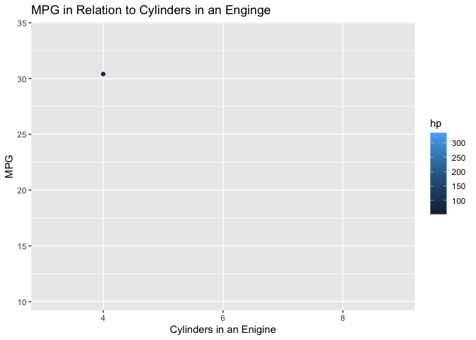

```r
library(ggplot2)
library(gganimate)
library(gifski)
```


### Animated Data from Task 9

```r
ggplot(data=mtcars, mapping=aes(as.factor(cyl), mpg, color=hp)) +
  geom_point(stat="identity") +
   transition_states(
    hp,
    transition_length = 2,
    state_length = 1
  ) +
  enter_fade() +
  exit_shrink() +
  ease_aes('sine-in-out')+
  labs(y = "MPG",
       x = "Cylinders in an Enigine",
       title = "MPG in Relation to Cylinders in an Enginge")
```

<!-- -->
This graph shows the relation of cylinders and mpg, along with the correlating horse power. The visualization communicates that as cylinders increase, miles per gallon decreases, but horse power increases. 
