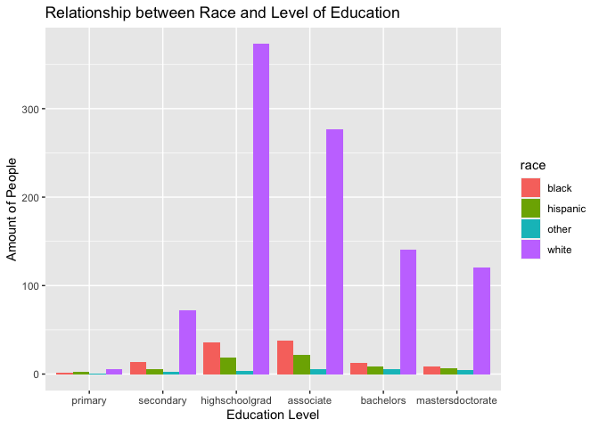
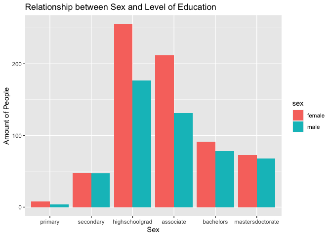
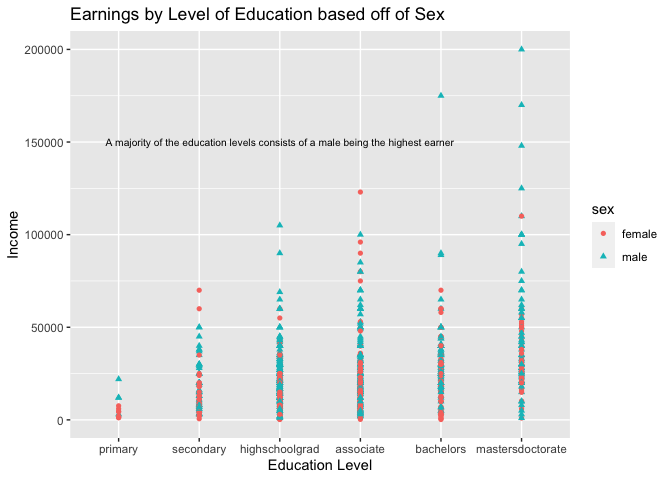

```r
library(ggplot2)
library(readr)
library(knitr)
library(tidyverse)
```

```
## ── Attaching packages ─────────────────────────────────────── tidyverse 1.3.2 ──
## ✓ tibble  3.1.6     ✓ dplyr   1.0.8
## ✓ tidyr   1.2.0     ✓ stringr 1.4.0
## ✓ purrr   0.3.4     ✓ forcats 0.5.1
## ── Conflicts ────────────────────────────────────────── tidyverse_conflicts() ──
## x dplyr::filter() masks stats::filter()
## x dplyr::lag()    masks stats::lag()
```

```r
library(dplyr)
library(forcats)
library(downloader)
library(knitr)
```


```r
download.file("https://raw.githubusercontent.com/hadley/r4ds/master/data/heights.csv", "height", mode = "wb")

heightdata <- read_csv("height")
```

```
## Rows: 1192 Columns: 6
## ── Column specification ────────────────────────────────────────────────────────
## Delimiter: ","
## chr (2): sex, race
## dbl (4): earn, height, ed, age
## 
## ℹ Use `spec()` to retrieve the full column specification for this data.
## ℹ Specify the column types or set `show_col_types = FALSE` to quiet this message.
```

```r
head(heightdata)
```

```
## # A tibble: 6 × 6
##    earn height sex       ed   age race 
##   <dbl>  <dbl> <chr>  <dbl> <dbl> <chr>
## 1 50000   74.4 male      16    45 white
## 2 60000   65.5 female    16    58 white
## 3 30000   63.6 female    16    29 white
## 4 50000   63.1 female    16    91 other
## 5 51000   63.4 female    17    39 white
## 6  9000   64.4 female    15    26 white
```


```r
HeightEd <- heightdata %>%
  mutate( ed = fct_collapse(as.factor(ed),
          primary = c("3","4","5","6"),
          secondary = c("7","8","9","10","11"),
          highschoolgrad = c("12"),
          associate = c("13","14","15"),
          bachelors = c("16"),
          mastersdoctorate = c("17","18")
  ))

head(HeightEd)
```

```
## # A tibble: 6 × 6
##    earn height sex    ed                 age race 
##   <dbl>  <dbl> <chr>  <fct>            <dbl> <chr>
## 1 50000   74.4 male   bachelors           45 white
## 2 60000   65.5 female bachelors           58 white
## 3 30000   63.6 female bachelors           29 white
## 4 50000   63.1 female bachelors           91 other
## 5 51000   63.4 female mastersdoctorate    39 white
## 6  9000   64.4 female associate           26 white
```


```r
ggplot(data = HeightEd) + 
  geom_bar(mapping = aes(x = ed, fill = race), position = "dodge") +
  labs(x = "Education Level",
       y = "Amount of People",
       title = "Relationship between Race and Level of Education")
```

<!-- -->


```r
ggplot(data = HeightEd) + 
  geom_bar(mapping = aes(x = ed, fill = sex), position = "dodge") +
  labs(x = "Sex",
       y = "Amount of People",
       title = "Relationship between Sex and Level of Education")
```

<!-- -->


```r
ggplot(data = HeightEd, mapping = aes(x = ed, 
                                  y = earn, 
                                  color = sex,
                                  shape = sex)) +
  geom_point() +
  labs(x = "Education Level",
       y = "Income", 
       title = "Earnings by Level of Education based off of Sex") + 
  annotate("text", x = "highschoolgrad", y = 150000, label = "A majority of the education levels consists of a male being the highest earner", size = 2.7)
```

<!-- -->
The graph I produced wasn't exctly how I envisioned it would turn out, but it effectively communicates the message I want to deliver: The largest income in a majority of the different education levels completed belongs to a male. That message is evident in my visualization by looking at the highest point for each education level, and it is also stated on the graph. Placing the annotation on the graph was trickier than I expected it to be, as I had to keep changing the x cooridnate to make sure the text wasn't coming off of the graph. I also had to keep adjusting the size of the text to find the best fit. 


