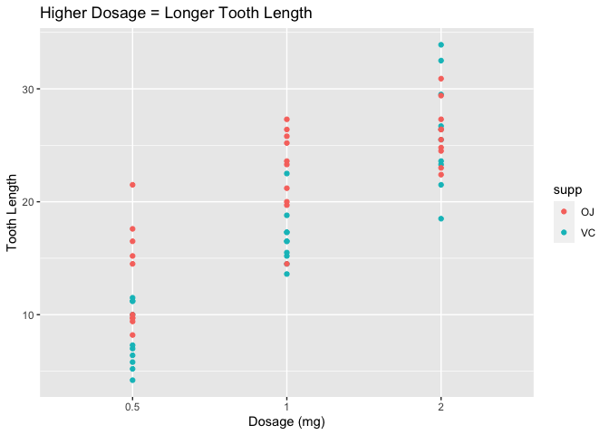
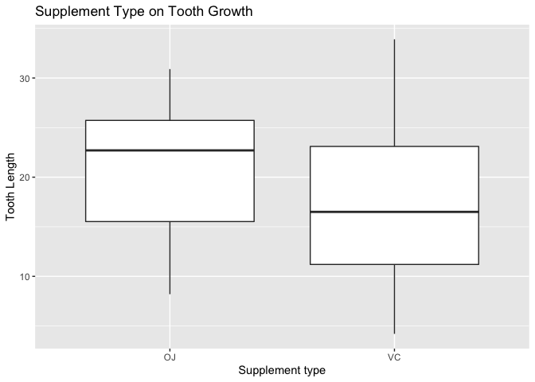
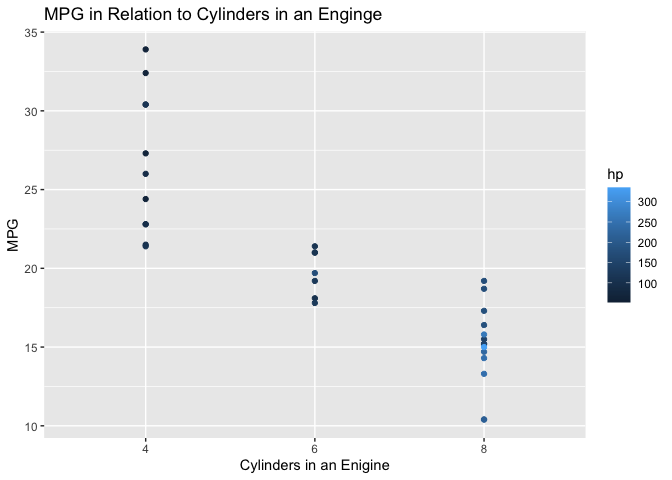
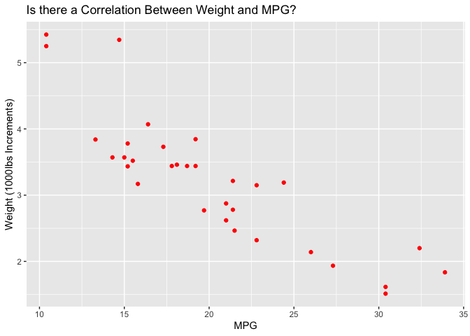

```r
library(ggplot2)
library(dplyr)
```

```
## 
## Attaching package: 'dplyr'
```

```
## The following objects are masked from 'package:stats':
## 
##     filter, lag
```

```
## The following objects are masked from 'package:base':
## 
##     intersect, setdiff, setequal, union
```

```r
library(tidyverse)
```

```
## ── Attaching packages
## ───────────────────────────────────────
## tidyverse 1.3.2 ──
```

```
## ✓ tibble  3.1.6     ✓ purrr   0.3.4
## ✓ tidyr   1.2.0     ✓ stringr 1.4.0
## ✓ readr   2.1.2     ✓ forcats 0.5.1
## ── Conflicts ────────────────────────────────────────── tidyverse_conflicts() ──
## x dplyr::filter() masks stats::filter()
## x dplyr::lag()    masks stats::lag()
```

```r
library(knitr)
library(lubridate)
```

```
## 
## Attaching package: 'lubridate'
## 
## The following objects are masked from 'package:base':
## 
##     date, intersect, setdiff, union
```


```r
?ToothGrowth
head(ToothGrowth)
```

```
##    len supp dose
## 1  4.2   VC  0.5
## 2 11.5   VC  0.5
## 3  7.3   VC  0.5
## 4  5.8   VC  0.5
## 5  6.4   VC  0.5
## 6 10.0   VC  0.5
```


```r
ggplot(data=ToothGrowth, mapping=aes(as.factor(dose), len, color=supp)) +
  geom_point(stat="identity", position="dodge") +
  labs(y = "Tooth Length",
       x = "Dosage (mg)",
       title = "Higher Dosage = Longer Tooth Length")
```

```
## Warning: Width not defined. Set with `position_dodge(width = ?)`
```

<!-- -->
This graph shows that the higher the dosage is, the longer the tooth will be be. This state is consistent with both supplement types as well as they both show the same trend on the grpah. 


```r
ggplot(data=ToothGrowth, mapping=aes(supp, len,)) +
  geom_boxplot() +
  labs(y = "Tooth Length",
       x = "Supplement type",
       title = "Supplement Type on Tooth Growth") 
```

<!-- -->
This graph shows a box plot for the two different supplement types. OJ seems to have more concise results in terms of tooth growth as the box plot is more compact whereas VC is more spread out. 


```r
?mtcars
head(mtcars)
```

```
##                    mpg cyl disp  hp drat    wt  qsec vs am gear carb
## Mazda RX4         21.0   6  160 110 3.90 2.620 16.46  0  1    4    4
## Mazda RX4 Wag     21.0   6  160 110 3.90 2.875 17.02  0  1    4    4
## Datsun 710        22.8   4  108  93 3.85 2.320 18.61  1  1    4    1
## Hornet 4 Drive    21.4   6  258 110 3.08 3.215 19.44  1  0    3    1
## Hornet Sportabout 18.7   8  360 175 3.15 3.440 17.02  0  0    3    2
## Valiant           18.1   6  225 105 2.76 3.460 20.22  1  0    3    1
```


```r
ggplot(data=mtcars, mapping=aes(as.factor(cyl), mpg, color=hp)) +
  geom_point(stat="identity") +
  labs(y = "MPG",
       x = "Cylinders in an Enigine",
       title = "MPG in Relation to Cylinders in an Enginge")
```

<!-- -->
This graph shows the relation of cylinders and mpg, along with the correlating horse power. The visualization communicates that as cylinders increase, miles per gallon decreases, but horse power increases. 


```r
ggplot(data=mtcars, mapping=aes(mpg, wt)) +
  geom_point(color = "Red") +
  labs(y = "Weight (1000lbs Increments)",
       x = "MPG",
       title = "Is there a Correlation Between Weight and MPG? ")
```

<!-- -->
I wanted to see if the weight of a vehicle had an effect on the mpg. This visualizaiton shows a strong trend of as the wig
ht of the vehicle decreases, the mpg increases. The trend tells me that there is a correlation between these two factorts.

