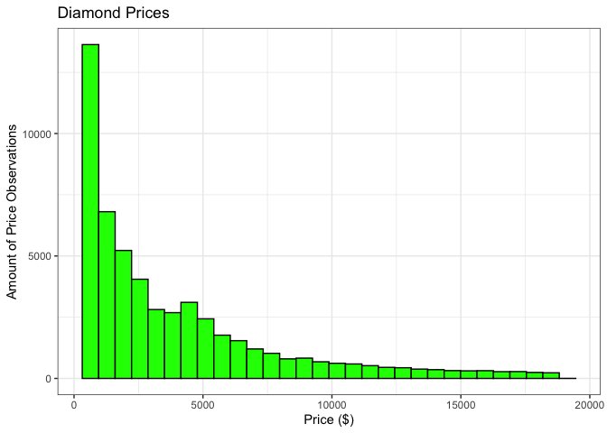

```r
library(tidyverse)
```

```
## ── Attaching packages ─────────────────────────────────────── tidyverse 1.3.2 ──
## ✓ ggplot2 3.3.5     ✓ purrr   0.3.4
## ✓ tibble  3.1.6     ✓ dplyr   1.0.8
## ✓ tidyr   1.2.0     ✓ stringr 1.4.0
## ✓ readr   2.1.2     ✓ forcats 0.5.1
## ── Conflicts ────────────────────────────────────────── tidyverse_conflicts() ──
## x dplyr::filter() masks stats::filter()
## x dplyr::lag()    masks stats::lag()
```

```r
library(knitr)
library(dplyr)
library(gridExtra)
```

```
## 
## Attaching package: 'gridExtra'
## 
## The following object is masked from 'package:dplyr':
## 
##     combine
```

```r
?diamonds
head(diamonds)
```

```
## # A tibble: 6 × 10
##   carat cut       color clarity depth table price     x     y     z
##   <dbl> <ord>     <ord> <ord>   <dbl> <dbl> <int> <dbl> <dbl> <dbl>
## 1  0.23 Ideal     E     SI2      61.5    55   326  3.95  3.98  2.43
## 2  0.21 Premium   E     SI1      59.8    61   326  3.89  3.84  2.31
## 3  0.23 Good      E     VS1      56.9    65   327  4.05  4.07  2.31
## 4  0.29 Premium   I     VS2      62.4    58   334  4.2   4.23  2.63
## 5  0.31 Good      J     SI2      63.3    58   335  4.34  4.35  2.75
## 6  0.24 Very Good J     VVS2     62.8    57   336  3.94  3.96  2.48
```


```r
#Diamond Length (x)
ggplot(data = diamonds, aes(x)) +
  geom_histogram(fill = 'cyan', color = 'Black') +
  xlim(3,10) +
  theme_bw() +
  labs(x = "Length (mm)",
       y = "Amount of Length Observations",
       title = "Diamond Lengths")
```

```
## `stat_bin()` using `bins = 30`. Pick better value with `binwidth`.
```

```
## Warning: Removed 13 rows containing non-finite values (stat_bin).
```

```
## Warning: Removed 2 rows containing missing values (geom_bar).
```

<!-- -->


```r
#Diamond Width (y)
ggplot(data = diamonds, aes(y)) +
  geom_histogram(fill = 'deeppink', color = 'black') +
  xlim(3,10) +
  theme_bw() +
  labs(x = "Width (mm)",
       y = "Amount of Width Observations",
       title = "Diamond Widths")
```

```
## `stat_bin()` using `bins = 30`. Pick better value with `binwidth`.
```

```
## Warning: Removed 12 rows containing non-finite values (stat_bin).
```

```
## Warning: Removed 2 rows containing missing values (geom_bar).
```

<!-- -->


```r
#Diamond Depth (z)
ggplot(data = diamonds, aes(z)) +
  geom_histogram(fill = 'chartreuse', color = 'black') +
  xlim(1,7) +
  theme_bw() +
  labs(x = "Depth (mm)",
       y = "Amount of Depth Observations",
       title = "Diamond Depths")
```

```
## `stat_bin()` using `bins = 30`. Pick better value with `binwidth`.
```

```
## Warning: Removed 22 rows containing non-finite values (stat_bin).
```

```
## Warning: Removed 2 rows containing missing values (geom_bar).
```

<!-- -->


```r
#Exploring distributiuon of Prices
ggplot(data = diamonds, aes(price)) +
  geom_histogram(fill = 'green', color = 'black') +
  theme_bw() +
  labs(x = "Price ($)",
       y = "Amount of Price Observations",
       title = "Diamond Prices")
```

```
## `stat_bin()` using `bins = 30`. Pick better value with `binwidth`.
```

<!-- -->

Nothing really sticks out to  me about this graph. It is expected that there are more cheaper diamonds then therre are expensive diamonds, following the idea of supply and demand. Since there are probably a large amount of diamonds of "poor quality" (even though metrics for "quality" isn't included in on this graph), they will generally be cheaper. 


```r
ggplot(data = diamonds, aes(x = cut, y = price)) +
  geom_boxplot() +
  theme_bw() +
  labs(x = "Cut",
       y = "Price",
       title = "Price V. Cut")
```

<!-- -->


```r
ggplot(data = diamonds, aes(x = carat, y = price)) +
  geom_point() +
  theme_bw() +
  labs(x = "Carat",
       y = "Price",
       title = "Price V. Carat")
```

<!-- -->


```r
ggplot(data = diamonds, aes(x = color, y = price)) +
  geom_boxplot() +
  theme_bw() +
  labs(x = "Color",
       y = "Price",
       title = "Price V. Color")
```

<!-- -->


```r
ggplot(data = diamonds, aes(x = clarity, y = price)) +
  geom_boxplot() +
  theme_bw() +
  labs(x = "Clarity",
       y = "Price",
       title = "Price V. Clarity")
```

<!-- -->


```r
ggplot(diamonds, aes(cut, carat)) +
  geom_boxplot() +
  theme_bw() +
  labs(x = 'Cut',
       y = 'Carat', 
       title = 'Diamond Cut vs. Carat')
```

<!-- -->


First observation: Carats seems to be what effects the price of a diamond the most.

Second Observation: There are less carats in higher cuts of diamonds. Cut seems to be the driving facotr of what makes a diamond more expensive or not. 


```r
diamonds %>%
  mutate(price_part =
           case_when(
             price >= 0 & price <= 2500 ~ '0-2500',
             price >= 2501 & price <= 5000 ~ '2501-5000',
             price >= 5001 & price <= 7500 ~ '5001-7501',
             price >= 7501 & price <= 10000 ~ '7501-10000',
             price >= 10001 & price <= 12500 ~ '10001-12500',
             price >= 12501 & price <= 15000 ~ '12501-15000',
             price >= 15001 & price <= 17500 ~ '15001-17500',
             price >= 17501 & price <= 20000 ~ '17501-20000',
             price >= 20001 & price <= 22500 ~ '20001-22500',
             price >= 22501 & price <= 25000 ~ '22501-25000'),
         price_part =  fct_relevel(price_part,'0-3000','2501-5000','5001-7501','7501-10000','10001-12500','12501-15000','15001-17500','17501-20000','20001-22500','22501-25000')) %>%
  ggplot(aes(carat, price, fill = price_part)) +
    geom_boxplot() +
    scale_fill_brewer(palette = 'Reds') +
    labs(x = 'Carat', y = 'Price ($USD)', title = 'Carat grouped by Price', fill = "Price Ranges") +
    theme_bw()
```

```
## Warning: Unknown levels in `f`: 0-3000, 20001-22500, 22501-25000
```

<!-- -->


```r
diamond_p <- diamonds %>%
  mutate(price_groups = 
           case_when(
             price >= 0 & price <= 2000 ~ "1-2000",
             price >= 2001 & price <= 4000 ~ "2001-4000",
             price >= 4001 & price <= 6000 ~ "4001-6000",
             price >= 6001 & price <= 8000 ~ "6001-8000",
             price >= 8001 & price <= 10000 ~ "8001-10000",
             price >= 10001 & price <= 12000 ~ "10001-12000",
             price >= 12001 & price <= 14000 ~ "12001-14000",
             price >= 14001 & price <= 16000 ~ "14001-16000",
             price >= 16001 & price <= 18000 ~ "16001-18000",
             price >= 18001 & price <= 20000 ~ "18001-20000"))
         
ggplot(data = diamond_p, aes(carat, fct_reorder(price_groups, carat), fill = price_groups)) +
  geom_boxplot() +
  theme_bw() +
  labs(x = "Carat",
       y = "Price",
       title = ("Price Groups of Different Carats")) +
  theme(legend.position = 'none')
```

<!-- -->


```r
large <- diamonds %>%
  filter(carat >= 4.01)

largeplot <- ggplot(data = large, aes(x = price)) +
  geom_histogram(fill = 'yellow', color = 'black') +
  theme_bw() +
  labs(x = "Price",
       y = "Amount of Large Diamonds",
       title = "Prices of Large Carat Diamonds")

small <- diamonds %>%
  filter(carat <= 1.2)

smallplot <- ggplot(data = small, aes(x = price)) +
  geom_histogram(fill = 'purple', color = 'black') +
  theme_bw() +
  labs(x = "Price",
       y = "Amount of Small Diamonds",
       title = "Prices of Small Carat Diamonds")

grid.arrange(largeplot, smallplot, nrow = 1)
```

```
## `stat_bin()` using `bins = 30`. Pick better value with `binwidth`.
## `stat_bin()` using `bins = 30`. Pick better value with `binwidth`.
```

<!-- -->
As expected, the price of large diamonds is higher than the price of small diamonds. With that being said, there is a much higher amount of small diamonds (44784) than there are large diamonds (5), so there is a much larger price range of those smaller diamonds than there are of the large diamonds.


```r
ggplot(diamonds, aes(x = carat, y = price, fill = cut)) +
    geom_col(alpha = 1) +
    coord_cartesian(xlim = c(0,4), ylim = c(0, 2600000), expand = FALSE) +
    facet_wrap(~cut, scales = 'free') +
    labs(x = 'Carat', y = 'Price ($)', title = 'Price of Carats by Type of Cut') +
    theme_bw() 
```

<!-- -->

