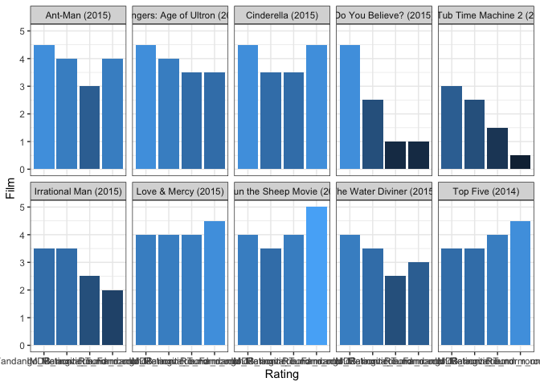

```r
library(tidyverse)
```

```
## ── Attaching packages ─────────────────────────────────────── tidyverse 1.3.2 ──
## ✓ ggplot2 3.3.5     ✓ purrr   0.3.4
## ✓ tibble  3.1.6     ✓ dplyr   1.0.8
## ✓ tidyr   1.2.0     ✓ stringr 1.4.0
## ✓ readr   2.1.2     ✓ forcats 0.5.1
## ── Conflicts ────────────────────────────────────────── tidyverse_conflicts() ──
## x dplyr::filter() masks stats::filter()
## x dplyr::lag()    masks stats::lag()
```

```r
library(knitr)
```


```r
f <- tempfile()
download.file("https://raw.githubusercontent.com/fivethirtyeight/data/master/fandango/fandango_score_comparison.csv", "f")

score <- read_csv("f")
```

```
## Rows: 146 Columns: 22
## ── Column specification ────────────────────────────────────────────────────────
## Delimiter: ","
## chr  (1): FILM
## dbl (21): RottenTomatoes, RottenTomatoes_User, Metacritic, Metacritic_User, ...
## 
## ℹ Use `spec()` to retrieve the full column specification for this data.
## ℹ Specify the column types or set `show_col_types = FALSE` to quiet this message.
```

```r
str(score)
```

```
## spec_tbl_df [146 × 22] (S3: spec_tbl_df/tbl_df/tbl/data.frame)
##  $ FILM                      : chr [1:146] "Avengers: Age of Ultron (2015)" "Cinderella (2015)" "Ant-Man (2015)" "Do You Believe? (2015)" ...
##  $ RottenTomatoes            : num [1:146] 74 85 80 18 14 63 42 86 99 89 ...
##  $ RottenTomatoes_User       : num [1:146] 86 80 90 84 28 62 53 64 82 87 ...
##  $ Metacritic                : num [1:146] 66 67 64 22 29 50 53 81 81 80 ...
##  $ Metacritic_User           : num [1:146] 7.1 7.5 8.1 4.7 3.4 6.8 7.6 6.8 8.8 8.5 ...
##  $ IMDB                      : num [1:146] 7.8 7.1 7.8 5.4 5.1 7.2 6.9 6.5 7.4 7.8 ...
##  $ Fandango_Stars            : num [1:146] 5 5 5 5 3.5 4.5 4 4 4.5 4.5 ...
##  $ Fandango_Ratingvalue      : num [1:146] 4.5 4.5 4.5 4.5 3 4 3.5 3.5 4 4 ...
##  $ RT_norm                   : num [1:146] 3.7 4.25 4 0.9 0.7 3.15 2.1 4.3 4.95 4.45 ...
##  $ RT_user_norm              : num [1:146] 4.3 4 4.5 4.2 1.4 3.1 2.65 3.2 4.1 4.35 ...
##  $ Metacritic_norm           : num [1:146] 3.3 3.35 3.2 1.1 1.45 2.5 2.65 4.05 4.05 4 ...
##  $ Metacritic_user_nom       : num [1:146] 3.55 3.75 4.05 2.35 1.7 3.4 3.8 3.4 4.4 4.25 ...
##  $ IMDB_norm                 : num [1:146] 3.9 3.55 3.9 2.7 2.55 3.6 3.45 3.25 3.7 3.9 ...
##  $ RT_norm_round             : num [1:146] 3.5 4.5 4 1 0.5 3 2 4.5 5 4.5 ...
##  $ RT_user_norm_round        : num [1:146] 4.5 4 4.5 4 1.5 3 2.5 3 4 4.5 ...
##  $ Metacritic_norm_round     : num [1:146] 3.5 3.5 3 1 1.5 2.5 2.5 4 4 4 ...
##  $ Metacritic_user_norm_round: num [1:146] 3.5 4 4 2.5 1.5 3.5 4 3.5 4.5 4.5 ...
##  $ IMDB_norm_round           : num [1:146] 4 3.5 4 2.5 2.5 3.5 3.5 3.5 3.5 4 ...
##  $ Metacritic_user_vote_count: num [1:146] 1330 249 627 31 88 34 17 124 62 54 ...
##  $ IMDB_user_vote_count      : num [1:146] 271107 65709 103660 3136 19560 ...
##  $ Fandango_votes            : num [1:146] 14846 12640 12055 1793 1021 ...
##  $ Fandango_Difference       : num [1:146] 0.5 0.5 0.5 0.5 0.5 0.5 0.5 0.5 0.5 0.5 ...
##  - attr(*, "spec")=
##   .. cols(
##   ..   FILM = col_character(),
##   ..   RottenTomatoes = col_double(),
##   ..   RottenTomatoes_User = col_double(),
##   ..   Metacritic = col_double(),
##   ..   Metacritic_User = col_double(),
##   ..   IMDB = col_double(),
##   ..   Fandango_Stars = col_double(),
##   ..   Fandango_Ratingvalue = col_double(),
##   ..   RT_norm = col_double(),
##   ..   RT_user_norm = col_double(),
##   ..   Metacritic_norm = col_double(),
##   ..   Metacritic_user_nom = col_double(),
##   ..   IMDB_norm = col_double(),
##   ..   RT_norm_round = col_double(),
##   ..   RT_user_norm_round = col_double(),
##   ..   Metacritic_norm_round = col_double(),
##   ..   Metacritic_user_norm_round = col_double(),
##   ..   IMDB_norm_round = col_double(),
##   ..   Metacritic_user_vote_count = col_double(),
##   ..   IMDB_user_vote_count = col_double(),
##   ..   Fandango_votes = col_double(),
##   ..   Fandango_Difference = col_double()
##   .. )
##  - attr(*, "problems")=<externalptr>
```

```r
head(score)
```

```
## # A tibble: 6 × 22
##   FILM          RottenTomatoes RottenTomatoes_… Metacritic Metacritic_User  IMDB
##   <chr>                  <dbl>            <dbl>      <dbl>           <dbl> <dbl>
## 1 Avengers: Ag…             74               86         66             7.1   7.8
## 2 Cinderella (…             85               80         67             7.5   7.1
## 3 Ant-Man (201…             80               90         64             8.1   7.8
## 4 Do You Belie…             18               84         22             4.7   5.4
## 5 Hot Tub Time…             14               28         29             3.4   5.1
## 6 The Water Di…             63               62         50             6.8   7.2
## # … with 16 more variables: Fandango_Stars <dbl>, Fandango_Ratingvalue <dbl>,
## #   RT_norm <dbl>, RT_user_norm <dbl>, Metacritic_norm <dbl>,
## #   Metacritic_user_nom <dbl>, IMDB_norm <dbl>, RT_norm_round <dbl>,
## #   RT_user_norm_round <dbl>, Metacritic_norm_round <dbl>,
## #   Metacritic_user_norm_round <dbl>, IMDB_norm_round <dbl>,
## #   Metacritic_user_vote_count <dbl>, IMDB_user_vote_count <dbl>,
## #   Fandango_votes <dbl>, Fandango_Difference <dbl>
```


```r
ratings <- score %>%
  select(FILM, Fandango_Ratingvalue, RT_norm_round, Metacritic_norm_round, IMDB_norm_round) %>%
  pivot_longer(2:5, names_to = "Website", values_to = "Rating") %>%
  select(FILM, Website, Rating)
```


```r
t40 <- head(ratings, n = 40)
```


```r
ggplot(data = t40, aes(x = Website, y = Rating, fill = Rating)) +
  geom_col(position = "dodge") +
  facet_wrap(~ FILM, nrow = 2) +
  theme_bw() +
  theme(legend.position = 'none') +
  labs(x = "Rating",
       y = "Film")
```

<!-- -->

I know the task said to make it show the first 20 rows, but i chose to do the first 40 beacuse I felt like comparing the ratings from the different sources of 10 movies is more accurate than just 5 movies. With that being said, by looking at the charts created, i'd say that Fandago & RT have the same ratings for movies while metacritic and IMBD generally will have the same ratings for movies.


