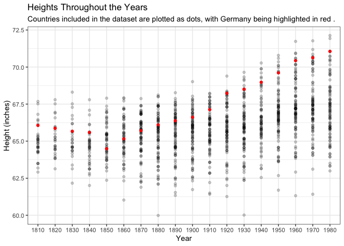
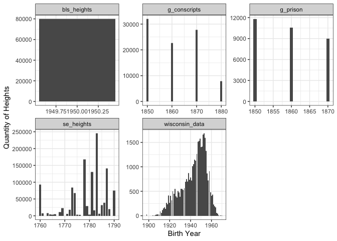

```r
library(tidyverse)
```

```
## ── Attaching packages ─────────────────────────────────────── tidyverse 1.3.2 ──
## ✓ ggplot2 3.3.5     ✓ purrr   0.3.4
## ✓ tibble  3.1.6     ✓ dplyr   1.0.8
## ✓ tidyr   1.2.0     ✓ stringr 1.4.1
## ✓ readr   2.1.2     ✓ forcats 0.5.1
## ── Conflicts ────────────────────────────────────────── tidyverse_conflicts() ──
## x dplyr::filter() masks stats::filter()
## x dplyr::lag()    masks stats::lag()
```

```r
library(readr)
library(readxl)
library(haven)
library(downloader)
library(foreign)
```


###Load in World Wide Heights Data

```r
heights <- tempfile()
download("https://github.com/WJC-Data-Science/DTS350/blob/master/Height.xlsx?raw=true", heights, mode = "wb")
w_heights<- read_xlsx(heights, skip = 2)
```


###Tidy World Data

```r
new_heights <- w_heights %>%
  pivot_longer(3:203, names_to = "years", values_to = "heights.cm", values_drop_na = TRUE) %>%
  mutate(year_decade = years, height.in = heights.cm / 2.54) %>%
  separate(years, into = c("century", "decade"), sep = -2) %>%
  separate(decade, into = c("decade", "year"), sep = -1)
head(new_heights)  
```

```
## # A tibble: 6 × 8
##    Code `Continent, Regi…` century decade year  heights.cm year_decade height.in
##   <dbl> <chr>              <chr>   <chr>  <chr>      <dbl> <chr>           <dbl>
## 1    40 Austria            18      2      0           164. 1820             64.4
## 2    40 Austria            18      3      0           163. 1830             64.3
## 3    40 Austria            18      4      0           165. 1840             64.9
## 4    40 Austria            18      5      0           166. 1850             65.3
## 5    40 Austria            18      6      0           166. 1860             65.5
## 6    40 Austria            18      7      0           167. 1870             65.8
```

```r
write.csv(new_heights, "new_heights.csv", row.names = TRUE)
```


###Load in the other five datasets

```r
g_conscripts <- read_dta(url("https://github.com/WJC-Data-Science/DTS350/blob/master/germanconscr.dta?raw=true"))

g_prison <- read_dta(url("https://github.com/WJC-Data-Science/DTS350/blob/master/germanprison.dta?raw=true"))

bls_heights <- read_csv(url("https://raw.githubusercontent.com/hadley/r4ds/master/data/heights.csv"))
```

```
## Rows: 1192 Columns: 6
## ── Column specification ────────────────────────────────────────────────────────
## Delimiter: ","
## chr (2): sex, race
## dbl (4): earn, height, ed, age
## 
## ℹ Use `spec()` to retrieve the full column specification for this data.
## ℹ Specify the column types or set `show_col_types = FALSE` to quiet this message.
```

```r
heights_se <- tempfile()
download("https://github.com/WJC-Data-Science/DTS350/raw/master/Heights_south-east/B6090.DBF?raw=true", heights_se, mode = "wb")
se_heights <- read.dbf(heights_se)

wisconsin <- tempfile()
download("http://www.ssc.wisc.edu/nsfh/wave3/NSFH3%20Apr%202005%20release/main05022005.sav", wisconsin, mode = "wb" )
wisconsin_data <- read_sav(wisconsin)
```

###Tidy Remaining Data Sets

```r
gcon_data <- g_conscripts %>%
  mutate(birth_year = bdec,
         height.cm = height,
         height.in = height.cm / 2.54,
         study_id = 'g_conscripts') %>%
  select(birth_year, height.cm, height.in, study_id)


gpris_data <- g_prison %>%
  mutate(birth_year = bdec,
         height.cm = height,
         height.in = height.cm / 2.54,
         study_id = 'g_prison') %>%
  select(birth_year, height.cm, height.in, study_id)


bls_data <- bls_heights %>%
  mutate(birth_year = 1950,
         height.cm = height * 2.54,
         height.in = height,
         study_id = 'bls_heights') %>%
  select(birth_year, height.cm, height.in, study_id)


se_data <- se_heights %>%
  mutate(birth_year = SJ,
         height.cm = CMETER,
         height.in = CMETER / 2.54,
         study_id = 'se_heights') %>%
  select(birth_year, height.cm, height.in, study_id)


wis_data <- wisconsin_data %>%
  mutate(birth_year = as.numeric(DOBY) + 1900,
         height.cm = RT216I * 2.54,
         height.in = RT216I,
         study_id = 'wisconsin_data') %>%
  select(birth_year, height.cm, height.in, study_id)
```


### Combine Datasets

```r
combine <- bind_rows(gcon_data, gpris_data, bls_data, se_data, wis_data)
head(combine)
```

```
## # A tibble: 6 × 4
##   birth_year height.cm height.in study_id    
##        <dbl>     <dbl>     <dbl> <chr>       
## 1       1850      170.      66.8 g_conscripts
## 2       1850      156.      61.6 g_conscripts
## 3       1850      172.      67.9 g_conscripts
## 4       1850      168.      66.2 g_conscripts
## 5       1850      167.      65.6 g_conscripts
## 6       1850      160.      63.1 g_conscripts
```

```r
write.csv(combine, "combined_data.csv", row.names = TRUE)
```

###Filter Germany

```r
Germany_data <- new_heights %>%
  filter(`Continent, Region, Country` == 'Germany')
```

###Plot worldwide Data

```r
worlddata <- ggplot(data = new_heights, aes(x = year_decade, y = height.in)) +
  geom_point(alpha = 0.2) +
  geom_point(data = Germany_data, color = "red") +
  theme_bw() +
  labs(x = "Year",
       y = "Height (inches)",
       title = "Heights Throughout the Years",
       subtitle = "Countries included in the dataset are plotted as dots, with Germany being highlighted in red .")

worlddata
```

<!-- -->


###Plot 5 studies

```r
fiveplots <- ggplot(data = combine, aes(x = birth_year, y = height.in)) +
  geom_col() +
  facet_wrap(~ study_id, scales = 'free') +
  theme_bw() +
  labs(x = "Birth Year",
       y = "Quantity of Heights")

fiveplots
```

```
## Warning: Removed 21 rows containing missing values (position_stack).
```

<!-- -->
When comparing the studies in the faceted graph, it can hard to draw a conclusion on what the trend is with heights throughout the years. When looking at the worlddata graph, it is much easier to see a trend in the data. In fact, I would even say that it does answer the driving question being that humans are getting taller thoughout the years. 


