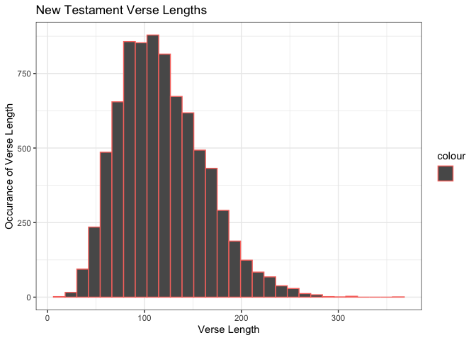

```r
library(tidyverse)
```

```
## ── Attaching packages ─────────────────────────────────────── tidyverse 1.3.2 ──
## ✓ ggplot2 3.3.5     ✓ purrr   0.3.4
## ✓ tibble  3.1.6     ✓ dplyr   1.0.8
## ✓ tidyr   1.2.0     ✓ stringr 1.4.1
## ✓ readr   2.1.2     ✓ forcats 0.5.1
## ── Conflicts ────────────────────────────────────────── tidyverse_conflicts() ──
## x dplyr::filter() masks stats::filter()
## x dplyr::lag()    masks stats::lag()
```

```r
library(stringi)
library(stringr)
library(downloader)
library(readr)
library(ggplot2)
```


```r
bible <- tempfile()
download.file("https://github.com/WJC-Data-Science/DTS350/raw/master/bible.csv",bible, mode="wb")

bibledata <- read_csv(bible)
```

```
## Rows: 31102 Columns: 17
## ── Column specification ────────────────────────────────────────────────────────
## Delimiter: ","
## chr (9): volume_title, book_title, volume_long_title, book_long_title, volum...
## dbl (6): volume_id, book_id, chapter_id, verse_id, chapter_number, verse_number
## lgl (2): volume_subtitle, book_subtitle
## 
## ℹ Use `spec()` to retrieve the full column specification for this data.
## ℹ Specify the column types or set `show_col_types = FALSE` to quiet this message.
```

```r
head(bibledata)
```

```
## # A tibble: 6 × 17
##   volume_id book_id chapter_id verse_id volume_title book_title volume_long_tit…
##       <dbl>   <dbl>      <dbl>    <dbl> <chr>        <chr>      <chr>           
## 1         1       1          1        1 Old Testame… Genesis    The Old Testame…
## 2         1       1          1        2 Old Testame… Genesis    The Old Testame…
## 3         1       1          1        3 Old Testame… Genesis    The Old Testame…
## 4         1       1          1        4 Old Testame… Genesis    The Old Testame…
## 5         1       1          1        5 Old Testame… Genesis    The Old Testame…
## 6         1       1          1        6 Old Testame… Genesis    The Old Testame…
## # … with 10 more variables: book_long_title <chr>, volume_subtitle <lgl>,
## #   book_subtitle <lgl>, volume_short_title <chr>, book_short_title <chr>,
## #   chapter_number <dbl>, verse_number <dbl>, scripture_text <chr>,
## #   verse_title <chr>, verse_short_title <chr>
```


```r
oldtest <- bibledata %>%
  filter(volume_long_title == "The Old Testament") %>%
  select(scripture_text)
head(oldtest)
```

```
## # A tibble: 6 × 1
##   scripture_text                                                                
##   <chr>                                                                         
## 1 IN the beginning God created the heaven and the earth.                        
## 2 And the earth was without form, and void; and darkness was upon the face of t…
## 3 And God said, Let there be light: and there was light.                        
## 4 And God saw the light, that it was good: and God divided the light from the d…
## 5 And God called the light Day, and the darkness he called Night. And the eveni…
## 6 And God said, Let there be a firmament in the midst of the waters, and let it…
```

```r
newtest <- bibledata %>%
  filter(volume_long_title == "The New Testament") %>%
  select(scripture_text)
head(newtest)
```

```
## # A tibble: 6 × 1
##   scripture_text                                                                
##   <chr>                                                                         
## 1 THE book of the generation of Jesus Christ, the son of David, the son of Abra…
## 2 Abraham begat Isaac; and Isaac begat Jacob; and Jacob begat Judas and his bre…
## 3 And Judas begat Phares and Zara of Thamar; and Phares begat Esrom; and Esrom …
## 4 And Aram begat Aminadab; and Aminadab begat Naasson; and Naasson begat Salmon;
## 5 And Salmon begat Booz of Rachab; and Booz begat Obed of Ruth; and Obed begat …
## 6 And Jesse begat David the king; and David the king begat Solomon of her that …
```


### Question #1: Old & New verse Length Comparisons

```r
verselength <- function(df) {
  vlength <- vector("integer", 0)
  for(row in df) {
    vlength <- append(vlength, str_length(row))
  }
  vlength
}

mean(verselength(oldtest))
```

```
## [1] 136.7845
```

```r
mean(verselength(newtest))
```

```
## [1] 118.3265
```


### Question #2: Lord usage comparison

```r
str_length(str_extract_all(oldtest, "(?i)lord"))
```

```
## Warning in stri_extract_all_regex(string, pattern, simplify = simplify, :
## argument is not an atomic vector; coercing
```

```
## Warning in stri_length(string): argument is not an atomic vector; coercing
```

```
## [1] 58300
```

```r
str_length(str_extract_all(newtest, "(?i)lord"))
```

```
## Warning in stri_extract_all_regex(string, pattern, simplify = simplify, :
## argument is not an atomic vector; coercing

## Warning in stri_extract_all_regex(string, pattern, simplify = simplify, :
## argument is not an atomic vector; coercing
```

```
## [1] 5900
```


### Question 3

```r
vdata <- as.data.frame(verselength(newtest))
head(vdata)
```

```
##   verselength(newtest)
## 1                   81
## 2                   83
## 3                   88
## 4                   78
## 5                   83
## 6                  104
```

```r
ggplot(data = vdata) +
  geom_histogram(aes(x = verselength(newtest), color="")) +
  labs(
    x = "Verse Length",
    y = "Occurance of Verse Length",
    title = 'New Testament Verse Lengths'
  ) +
  theme_bw()
```

```
## `stat_bin()` using `bins = 30`. Pick better value with `binwidth`.
```

<!-- -->

I'd be lying if I asaid this task was a breeze. The most difficult part of this task came in question 1, when I needed to find the verse length. I had trouble figuring out how to do that, but afer trial and error, I found out how to get the verselength, then applied that to the new testament and the old testament, being able to fins the average versel legth of both. The old testmant had a verse legnth mean of 136.7845 and the new testament's mean verse length was 118.3265. The case insenistive part of the code is one i forgot and had to look up, but other than that there were no troubles in finding the word count of lord in the two testaments. There were 58300 occurances of the word lord in the old testamnet compared to rhe 5900 occurances in the new testament. Verse length was dominant around the 100 range when looking at the visualization. 


