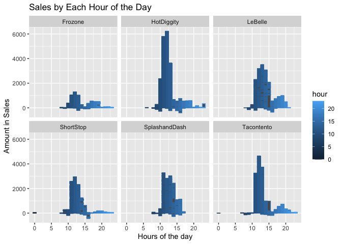
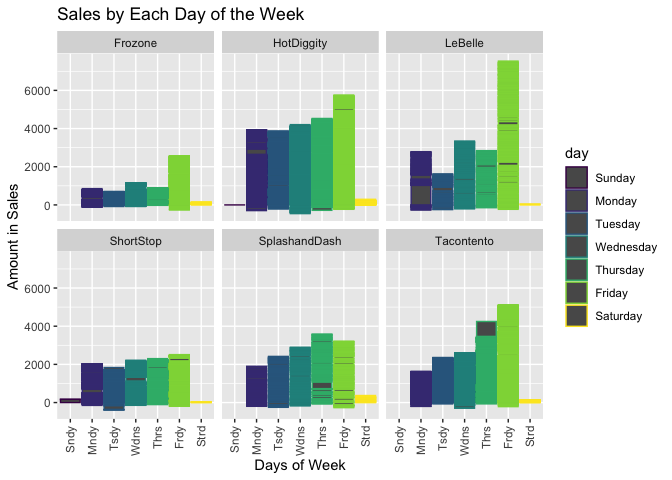
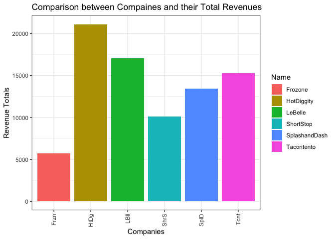

```r
library(ggplot2)
library(knitr)
library(tidyverse)
```

```
## ── Attaching packages ─────────────────────────────────────── tidyverse 1.3.2 ──
## ✓ tibble  3.1.6     ✓ dplyr   1.0.8
## ✓ tidyr   1.2.0     ✓ stringr 1.4.1
## ✓ readr   2.1.2     ✓ forcats 0.5.1
## ✓ purrr   0.3.4     
## ── Conflicts ────────────────────────────────────────── tidyverse_conflicts() ──
## x dplyr::filter() masks stats::filter()
## x dplyr::lag()    masks stats::lag()
```

```r
library(downloader)
library(lubridate)
```

```
## 
## Attaching package: 'lubridate'
## 
## The following objects are masked from 'package:base':
## 
##     date, intersect, setdiff, union
```

```r
library(riem)
```

### Reading in the data

```r
sales <- tempfile()
  download.file("https://github.com/WJC-Data-Science/DTS350/raw/master/sales.csv", sales,   mode = "wb")
salesdata <- read_csv(sales)
```

```
## Rows: 15656 Columns: 4
## ── Column specification ────────────────────────────────────────────────────────
## Delimiter: ","
## chr  (2): Name, Type
## dbl  (1): Amount
## dttm (1): Time
## 
## ℹ Use `spec()` to retrieve the full column specification for this data.
## ℹ Specify the column types or set `show_col_types = FALSE` to quiet this message.
```

```r
tail(salesdata)
```

```
## # A tibble: 6 × 4
##   Name    Type               Time                Amount
##   <chr>   <chr>              <dttm>               <dbl>
## 1 Frozone Food(pre-packaged) 2016-07-09 23:58:00   5   
## 2 Frozone Food(pre-packaged) 2016-07-10 00:33:00   5   
## 3 Frozone Food(pre-packaged) 2016-07-10 00:37:00   5   
## 4 Frozone Food(pre-packaged) 2016-07-10 00:47:00   5   
## 5 Missing Missing            2016-06-17 21:12:00 150   
## 6 Missing Missing            2016-04-20 19:01:00  -3.07
```


### Assign a timezone

```r
sdtz <- with_tz(salesdata, tzone = "US/Mountain")
tail(sdtz)
```

```
## # A tibble: 6 × 4
##   Name    Type               Time                Amount
##   <chr>   <chr>              <dttm>               <dbl>
## 1 Frozone Food(pre-packaged) 2016-07-09 17:58:00   5   
## 2 Frozone Food(pre-packaged) 2016-07-09 18:33:00   5   
## 3 Frozone Food(pre-packaged) 2016-07-09 18:37:00   5   
## 4 Frozone Food(pre-packaged) 2016-07-09 18:47:00   5   
## 5 Missing Missing            2016-06-17 15:12:00 150   
## 6 Missing Missing            2016-04-20 13:01:00  -3.07
```


### Creating correct time aggregations for POS Data

```r
td <- sdtz %>%
  mutate(hour = hour(Time)) %>%
  mutate(day = wday(Time, label = TRUE, abbr = FALSE)) %>%
  mutate(week = week(Time)) %>%
  mutate(month = month(Time))

tail(td)
```

```
## # A tibble: 6 × 8
##   Name    Type               Time                Amount  hour day     week month
##   <chr>   <chr>              <dttm>               <dbl> <int> <ord>  <dbl> <dbl>
## 1 Frozone Food(pre-packaged) 2016-07-09 17:58:00   5       17 Satur…    28     7
## 2 Frozone Food(pre-packaged) 2016-07-09 18:33:00   5       18 Satur…    28     7
## 3 Frozone Food(pre-packaged) 2016-07-09 18:37:00   5       18 Satur…    28     7
## 4 Frozone Food(pre-packaged) 2016-07-09 18:47:00   5       18 Satur…    28     7
## 5 Missing Missing            2016-06-17 15:12:00 150       15 Friday    25     6
## 6 Missing Missing            2016-04-20 13:01:00  -3.07    13 Wedne…    16     4
```


### Operation hours

```r
ophours <- td %>%
  group_by(Name, hour) %>%
  select(Name, Amount, hour) %>%
  filter(Name != "Missing")

head(ophours)
```

```
## # A tibble: 6 × 3
## # Groups:   Name, hour [1]
##   Name       Amount  hour
##   <chr>       <dbl> <int>
## 1 Tacontento    3      13
## 2 Tacontento    1.5    13
## 3 Tacontento    3      13
## 4 Tacontento    3      13
## 5 Tacontento    1.5    13
## 6 Tacontento    1      13
```

```r
tail(ophours)
```

```
## # A tibble: 6 × 3
## # Groups:   Name, hour [3]
##   Name    Amount  hour
##   <chr>    <dbl> <int>
## 1 Frozone      3    16
## 2 Frozone      5    17
## 3 Frozone      5    17
## 4 Frozone      5    18
## 5 Frozone      5    18
## 6 Frozone      5    18
```

### Visualization for sales by hour

```r
plot1 <- ggplot(ophours, aes(x = hour, y = Amount, color = hour,  na.rm = TRUE)) +
  geom_col() +
  facet_wrap(~ Name, nrow = 2) +
  labs(x = "Hours of the day",
       y = "Amount in Sales ",
       title = "Sales by Each Hour of the Day") 

plot1
```

<!-- -->
Based off the visualization, it is evident that the busiest hours of the day is from the 11pm to 2:30am range. Hot diggity does the most in sales compared to the other companies. 


### Operation Days

```r
opday <- td %>%
  group_by(Name, day) %>%
  select(Name, Amount, day) %>%
  filter(Name != "Missing")

tail(opday)
```

```
## # A tibble: 6 × 3
## # Groups:   Name, day [1]
##   Name    Amount day     
##   <chr>    <dbl> <ord>   
## 1 Frozone      3 Saturday
## 2 Frozone      5 Saturday
## 3 Frozone      5 Saturday
## 4 Frozone      5 Saturday
## 5 Frozone      5 Saturday
## 6 Frozone      5 Saturday
```


### Visualization for sales by each day

```r
plot1 <- ggplot(opday, aes(x = day, y = Amount, color = day,  na.rm = TRUE)) +
  geom_col() +
  facet_wrap(~ Name, nrow = 2)+
  scale_x_discrete(label=abbreviate)+
  guides(x = guide_axis(angle = 90))+
  labs(x = "Days of Week",
       y = "Amount in Sales",
       title = "Sales by Each Day of the Week") 
  
plot1
```

<!-- -->
There is a visual trend across most of the companies where customer traffic seems to increase as the week goes on up until Friday. There is not much traffic on the weekends. 


### Creating Summary of Revenue Sum

```r
final <- sdtz %>%
  group_by(Name) %>%
  summarise(across(Amount, sum)) %>%
  filter(Name != "Missing")

head(final)
```

```
## # A tibble: 6 × 2
##   Name          Amount
##   <chr>          <dbl>
## 1 Frozone        5741.
## 2 HotDiggity    21119.
## 3 LeBelle       17089.
## 4 ShortStop     10101.
## 5 SplashandDash 13428.
## 6 Tacontento    15264.
```


### Plotting Revenue Sum for each company

```r
ggplot(final, aes(x = Name, y = Amount, fill = Name)) +
  geom_col() +
  scale_x_discrete(label=abbreviate)+
  guides(x = guide_axis(angle = 90))+
  labs(x = "Companies",
       y = "Revenue Totals",
       title = "Comparison between Compaines and their Total Revenues") +
  theme_bw()
```

<!-- -->

The viaulization that shows the total revenue for each company gives accuracte insight for which businesses do the best. HotDiggity takes the place as the best followed by Lebele and Tacontento. Looking at the data for customer traffic by calcultaing sales for hours of the day and days of the week supports the claim that these are the top three business as well.


