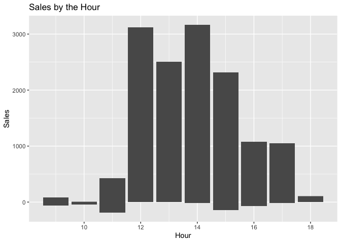

```r
library(lubridate)
```

```
## 
## Attaching package: 'lubridate'
```

```
## The following objects are masked from 'package:base':
## 
##     date, intersect, setdiff, union
```

```r
library(downloader)
library(tidyverse)
```

```
## ── Attaching packages
## ───────────────────────────────────────
## tidyverse 1.3.2 ──
```

```
## ✓ ggplot2 3.3.5     ✓ purrr   0.3.4
## ✓ tibble  3.1.6     ✓ dplyr   1.0.8
## ✓ tidyr   1.2.0     ✓ stringr 1.4.1
## ✓ readr   2.1.2     ✓ forcats 0.5.1
## ── Conflicts ────────────────────────────────────────── tidyverse_conflicts() ──
## x lubridate::as.difftime() masks base::as.difftime()
## x lubridate::date()        masks base::date()
## x dplyr::filter()          masks stats::filter()
## x lubridate::intersect()   masks base::intersect()
## x dplyr::lag()             masks stats::lag()
## x lubridate::setdiff()     masks base::setdiff()
## x lubridate::union()       masks base::union()
```

```r
library(riem)
library(gridExtra)
```

```
## 
## Attaching package: 'gridExtra'
## 
## The following object is masked from 'package:dplyr':
## 
##     combine
```


###Download FIle

```r
temp <- tempfile()
download.file("https://github.com/WJC-Data-Science/DTS350/raw/master/carwash.csv", temp, mode = "wb")
cw <- read_csv(temp)
```

```
## Rows: 533 Columns: 4
## ── Column specification ────────────────────────────────────────────────────────
## Delimiter: ","
## chr  (2): name, type
## dbl  (1): amount
## dttm (1): time
## 
## ℹ Use `spec()` to retrieve the full column specification for this data.
## ℹ Specify the column types or set `show_col_types = FALSE` to quiet this message.
```

```r
head(cw)
```

```
## # A tibble: 6 × 4
##   name          type     time                amount
##   <chr>         <chr>    <dttm>               <dbl>
## 1 SplashandDash Services 2016-05-13 20:27:00    1  
## 2 SplashandDash Services 2016-05-13 20:27:00    0  
## 3 SplashandDash Services 2016-05-16 19:31:00   23.6
## 4 SplashandDash Services 2016-05-16 17:09:00   18.9
## 5 SplashandDash Services 2016-05-16 17:47:00   23.6
## 6 SplashandDash Services 2016-05-16 17:50:00   23.6
```

```r
tail(cw)
```

```
## # A tibble: 6 × 4
##   name          type     time                amount
##   <chr>         <chr>    <dttm>               <dbl>
## 1 SplashandDash Services 2016-07-08 18:36:00   50  
## 2 SplashandDash Services 2016-07-08 18:50:00   30  
## 3 SplashandDash Services 2016-07-08 21:29:00  -33.6
## 4 SplashandDash Services 2016-07-08 22:42:00   10  
## 5 SplashandDash Services 2016-07-08 22:51:00   15  
## 6 SplashandDash Services 2016-07-08 23:08:00    5
```

```r
str(cw)
```

```
## spec_tbl_df [533 × 4] (S3: spec_tbl_df/tbl_df/tbl/data.frame)
##  $ name  : chr [1:533] "SplashandDash" "SplashandDash" "SplashandDash" "SplashandDash" ...
##  $ type  : chr [1:533] "Services" "Services" "Services" "Services" ...
##  $ time  : POSIXct[1:533], format: "2016-05-13 20:27:00" "2016-05-13 20:27:00" ...
##  $ amount: num [1:533] 1 0 23.6 18.9 23.6 ...
##  - attr(*, "spec")=
##   .. cols(
##   ..   name = col_character(),
##   ..   type = col_character(),
##   ..   time = col_datetime(format = ""),
##   ..   amount = col_double()
##   .. )
##  - attr(*, "problems")=<externalptr>
```


#Convert to Mountain Time

```r
cwm <- with_tz(cw, tzone = "US/Mountain")
head(cwm)
```

```
## # A tibble: 6 × 4
##   name          type     time                amount
##   <chr>         <chr>    <dttm>               <dbl>
## 1 SplashandDash Services 2016-05-13 14:27:00    1  
## 2 SplashandDash Services 2016-05-13 14:27:00    0  
## 3 SplashandDash Services 2016-05-16 13:31:00   23.6
## 4 SplashandDash Services 2016-05-16 11:09:00   18.9
## 5 SplashandDash Services 2016-05-16 11:47:00   23.6
## 6 SplashandDash Services 2016-05-16 11:50:00   23.6
```

#Group variable

```r
?ceiling_date
cwh <- cwm %>%
  mutate(hour = ceiling_date(time, "hour"))
tail(cwh)
```

```
## # A tibble: 6 × 5
##   name          type     time                amount hour               
##   <chr>         <chr>    <dttm>               <dbl> <dttm>             
## 1 SplashandDash Services 2016-07-08 12:36:00   50   2016-07-08 13:00:00
## 2 SplashandDash Services 2016-07-08 12:50:00   30   2016-07-08 13:00:00
## 3 SplashandDash Services 2016-07-08 15:29:00  -33.6 2016-07-08 16:00:00
## 4 SplashandDash Services 2016-07-08 16:42:00   10   2016-07-08 17:00:00
## 5 SplashandDash Services 2016-07-08 16:51:00   15   2016-07-08 17:00:00
## 6 SplashandDash Services 2016-07-08 17:08:00    5   2016-07-08 18:00:00
```

#Aggregate

```r
cwf <- cwh %>%
  group_by(hour) %>%
  summarise(across(amount, sum))
tail(cwf)
```

```
## # A tibble: 6 × 2
##   hour                amount
##   <dttm>               <dbl>
## 1 2016-07-15 13:00:00   50  
## 2 2016-07-15 14:00:00   70  
## 3 2016-07-15 15:00:00   70  
## 4 2016-07-15 16:00:00   50  
## 5 2016-07-15 17:00:00  -20.7
## 6 2016-07-18 11:00:00  -61.2
```

#Find matching temperatures

```r
match <- riem_measures(station = "RXE",  date_start = "2016-05-13",  date_end  = "2016-07-18") %>%
  with_tz(tzone = "US/Mountain") %>%
  filter(tmpf != " ") %>%
  mutate(hour =  ceiling_date(valid, "hour")) %>%
  select(hour, tmpf)

tail(match)
```

```
## # A tibble: 6 × 2
##   hour                 tmpf
##   <dttm>              <dbl>
## 1 2016-07-17 13:00:00  79.0
## 2 2016-07-17 14:00:00  84.0
## 3 2016-07-17 15:00:00  84.9
## 4 2016-07-17 16:00:00  87.1
## 5 2016-07-17 17:00:00  86  
## 6 2016-07-17 18:00:00  86
```

#Merge datasets

```r
merge <- merge(cwf, match, by = "hour") %>%
  arrange(hour) %>%
  mutate(nh = hour(hour))

tail(merge)
```

```
##                    hour amount  tmpf nh
## 238 2016-07-15 12:00:00   50.0 78.08 12
## 239 2016-07-15 13:00:00   50.0 80.96 13
## 240 2016-07-15 14:00:00   70.0 82.94 14
## 241 2016-07-15 15:00:00   70.0 84.92 15
## 242 2016-07-15 16:00:00   50.0 86.00 16
## 243 2016-07-15 17:00:00  -20.7 87.98 17
```


#Visualization for sales & temp

```r
plot <- ggplot(data=merge, mapping=aes(x=nh,y=amount))+
  geom_col()+
  labs(title="Sales by the Hour", x="Hour", y="Sales") 

plot
```

<!-- -->
